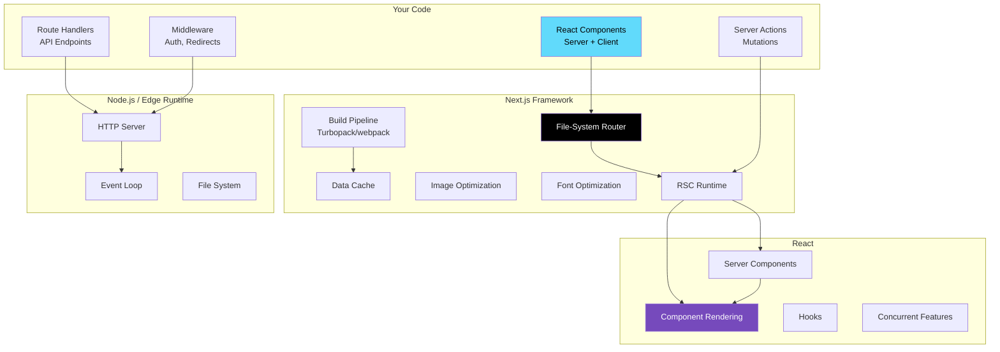
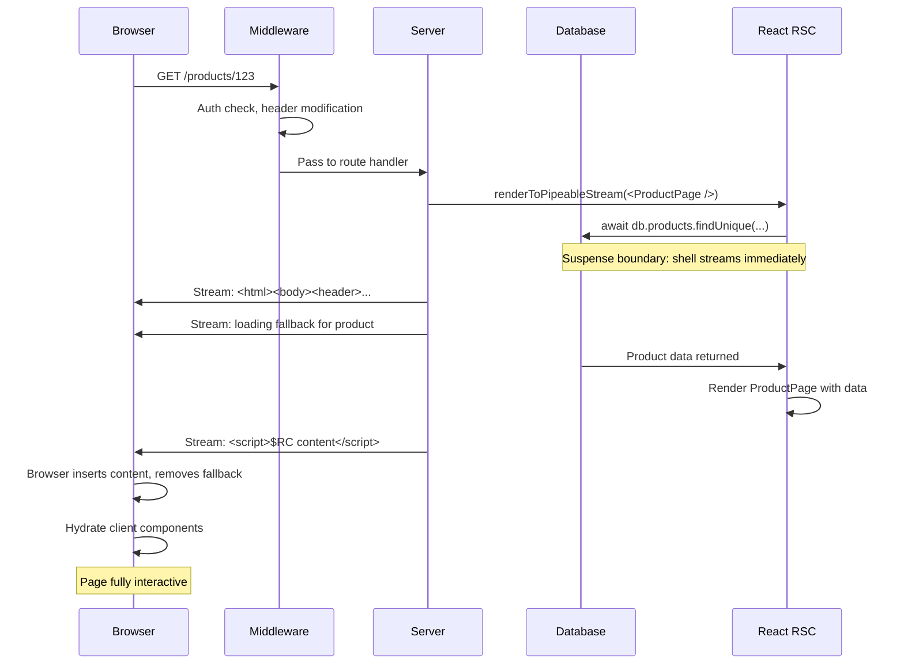

# 38 · What is Next.js

> **Next.js is a React framework that provides the server runtime, routing system, build pipeline, and deployment infrastructure that React itself deliberately does not include. React is a UI library that renders components — it has no opinion on how pages are structured, how URLs map to components, how data flows from server to client, or how the final HTML is generated. Next.js answers all of these questions and wires them together into a production-grade system. Understanding this division of responsibility is the foundation for understanding every Next.js feature.**

The React team's position is explicit: React is not a framework. It provides primitives (components, hooks, concurrent rendering) and expects a framework to provide everything else. Next.js is currently the most prominent framework in that role, and it is the framework the React team itself collaborates with most closely — to the point that features like React Server Components were designed and shipped through Next.js first.

---

## Table of Contents

- [The React-Next.js Division of Responsibility](#the-react-nextjs-division-of-responsibility)
- [What Next.js Actually Provides](#what-nextjs-actually-provides)
- [The Two Routers: Pages vs App](#the-two-routers-pages-vs-app)
- [The Build Pipeline](#the-build-pipeline)
- [The Server Runtime](#the-server-runtime)
- [How Next.js Extends React](#how-nextjs-extends-react)
- [The Request Lifecycle](#the-request-lifecycle)
- [Next.js and the Node.js Event Loop](#nextjs-and-the-nodejs-event-loop)
- [Deployment Targets](#deployment-targets)
- [Next.js vs Other React Frameworks](#nextjs-vs-other-react-frameworks)
- [When to Use Next.js](#when-to-use-next.js)
- [Architecture Diagrams](#architecture-diagrams)
- [Good Practices](#good-practices)
- [Bad Practices](#bad-practices)
- [Mental Model](#mental-model)
- [Common Misconceptions](#common-misconceptions)
- [Exercises](#exercises)
- [Further Reading](#further-reading)

---

## The React-Next.js Division of Responsibility

To understand Next.js, understand what React does NOT provide:

```
React provides:
  ✅ Component rendering (JSX → DOM)
  ✅ State management (useState, useReducer)
  ✅ Side effects (useEffect)
  ✅ Context (createContext, useContext)
  ✅ Concurrent rendering (Suspense, transitions)
  ✅ Server Components (the model and runtime primitives)
  ✅ Hooks (all built-in hooks)

React does NOT provide:
  ❌ File-system routing (no URL → component mapping)
  ❌ Server (no HTTP server, no request handling)
  ❌ Data fetching conventions (no standard for how to load data)
  ❌ Asset optimization (no image optimization, font loading)
  ❌ Build tooling (no bundler, no code splitting strategy)
  ❌ Deployment (no production server, no CDN integration)
  ❌ Caching (no HTTP cache headers, no data cache)
  ❌ Streaming (no HTTP chunked transfer encoding)
  ❌ Edge runtime (no Cloudflare Workers / Vercel Edge integration)
```

Next.js provides everything in the "does NOT" list, built on top of everything React provides.

---

## What Next.js Actually Provides

### 1. File-system routing

```
app/
  page.tsx                 → GET /
  about/
    page.tsx               → GET /about
  products/
    page.tsx               → GET /products
    [id]/
      page.tsx             → GET /products/:id
    (marketing)/           → Route group (no URL segment)
      featured/
        page.tsx           → GET /products/featured
  api/
    webhook/
      route.ts             → POST /api/webhook
```

The file system IS the router. No configuration file, no router component, no route registration.

### 2. Special file conventions

```
app/
  layout.tsx       → Wraps all pages in this directory (persistent UI)
  page.tsx         → The page content
  loading.tsx      → Suspense boundary for this route
  error.tsx        → Error boundary for this route
  not-found.tsx    → 404 handler for this route
  template.tsx     → Like layout but re-mounts on navigation
  default.tsx      → Fallback for parallel routes
  route.ts         → API endpoint (no JSX)
```

### 3. Data fetching conventions

```tsx
// Server Component (async) — fetch directly
async function ProductPage({ params }: { params: { id: string } }) {
  const product = await db.products.findUnique({ where: { id: params.id } });
  return <ProductView product={product} />;
}

// Data fetching IS component rendering (no separate data layer needed)
```

### 4. Build pipeline (Turbopack / webpack)

- Code splitting: each route is its own chunk
- Tree shaking: unused code eliminated
- Image optimization: next/image converts to WebP/AVIF, responsive sizes
- Font optimization: next/font inlines critical CSS, eliminates FOUT
- Bundle analysis: `@next/bundle-analyzer`

### 5. Production HTTP server

```js
// next start runs a Node.js server that:
// - Serves static assets from .next/static
// - Handles SSR for dynamic routes
// - Implements Suspense streaming (chunked transfer encoding)
// - Manages the data cache
// - Handles revalidation of cached data
```

---

## The Two Routers: Pages vs App

Next.js has two routers with fundamentally different paradigms:

### Pages Router (legacy, stable)

```
pages/
  index.tsx          → / (getStaticProps or getServerSideProps)
  about.tsx          → /about
  products/
    index.tsx        → /products (getStaticPaths + getStaticProps)
    [id].tsx         → /products/:id
  api/
    users.ts         → /api/users (API route)
```

Data fetching functions:

```tsx
// Pages Router data fetching:
export async function getServerSideProps(context: GetServerSidePropsContext) {
  // Runs on every request (SSR)
  const data = await fetchData(context.params.id);
  return { props: { data } };
}

export async function getStaticProps(context: GetStaticPropsContext) {
  // Runs at build time (SSG)
  const data = await fetchData(context.params.id);
  return { props: { data }, revalidate: 60 }; // ISR: regenerate every 60s
}

export async function getStaticPaths() {
  // Which dynamic paths to pre-render
  return { paths: [{ params: { id: "1" } }], fallback: "blocking" };
}
```

### App Router (modern, recommended)

```
app/
  layout.tsx
  page.tsx           → / (Server Component by default)
  products/
    [id]/
      page.tsx       → /products/:id (Server Component, can be async)
```

Data fetching — just `async/await` in server components:

```tsx
// App Router data fetching:
async function ProductPage({ params }: { params: { id: string } }) {
  // fetch() is extended by Next.js with caching semantics
  const product = await fetch(`/api/products/${params.id}`, {
    next: { revalidate: 60 }, // ISR equivalent — revalidate every 60s
  }).then((r) => r.json());

  // Or directly access DB:
  const product = await db.products.findUnique({ where: { id: params.id } });

  return <ProductView product={product} />;
}
```

### Why the App Router is the future

The Pages Router predates React Server Components. It uses a different paradigm:

- Data fetching happens in exported functions (`getServerSideProps`), not in components
- Client and server are separate concepts (no composition)
- No streaming by default

The App Router is built for RSC from the ground up:

- Components ARE the data-fetching layer (async server components)
- Streaming is the default (Suspense boundaries stream content)
- Server and Client components compose naturally
- The mental model is unified: write components, the framework handles server/client

---

## The Build Pipeline

Next.js runs two build phases:

### Phase 1: Static generation (build time)

```bash
next build
```

During `next build`:

1. Next.js renders all static pages (no `dynamic = 'force-dynamic'`)
2. Pre-renders routes with `getStaticProps` or default server component behavior
3. Optimizes images (generates WebP/AVIF variants)
4. Bundles JavaScript (code splitting per route)
5. Generates the `.next` directory:
   ```
   .next/
     static/           → JS bundles, CSS, images
     server/           → SSR code
     cache/            → Fetch cache, image cache
     BUILD_ID          → Unique build identifier
   ```

### Phase 2: Runtime (request time)

```bash
next start
```

At runtime:

- Static routes: served directly from `.next/static` (no computation)
- Dynamic routes: rendered on each request (SSR)
- ISR routes: served from cache, regenerated in background when stale
- Streaming: HTML sent in chunks as Suspense boundaries resolve

---

## The Server Runtime

Next.js implements its own server runtime on top of Node.js:

```
Incoming Request
  ↓
Next.js HTTP Server (Node.js)
  ↓
Router: match URL to route
  ↓
Middleware: runs first (Edge runtime)
  ↓
Route Handler:
  Static?  → Serve from file system
  Dynamic? → React Server Components render
  API?     → Route Handler function
  ↓
React renderToPipeableStream() / renderToReadableStream()
  ↓
HTML streamed via chunked transfer encoding
  ↓
Client hydration (selective, concurrent)
```

### The Next.js data cache

Next.js extends the native `fetch` API with its own caching layer:

```tsx
// Default: cached indefinitely (like SSG)
fetch("https://api.example.com/data");

// Revalidate every N seconds (like ISR)
fetch("https://api.example.com/data", {
  next: { revalidate: 60 },
});

// No cache (like SSR — fresh on every request)
fetch("https://api.example.com/data", {
  cache: "no-store",
});

// Tagged caching (manual revalidation)
fetch("https://api.example.com/data", {
  next: { tags: ["products"] },
});

// In a Server Action: invalidate the tagged cache
import { revalidateTag } from "next/cache";
revalidateTag("products"); // all fetches tagged 'products' become stale
```

The data cache is a persistent cache layer separate from the HTTP cache. It survives request boundaries and can be shared across concurrent requests.

---

## How Next.js Extends React

Next.js extends React in several ways:

### Extended fetch with caching

```tsx
// Next.js patches the global fetch with caching semantics
// The patched fetch:
// 1. Deduplicates concurrent identical requests (request memoization)
// 2. Caches responses based on cache headers + next.cache options
// 3. Supports tagged invalidation (revalidateTag)
// 4. Integrates with the build-time data cache
```

### Extended Link for prefetching

```tsx
import Link from "next/link";

// next/link:
// - Prefetches the linked route's JavaScript in the background
// - Uses IntersectionObserver to prefetch when link enters viewport
// - On hover: prefetches with higher priority
// - Client-side navigation: no full page reload
<Link href="/products">Products</Link>;
```

### Extended Image for optimization

```tsx
import Image from "next/image";

// next/image:
// - Serves WebP/AVIF instead of JPEG/PNG
// - Generates responsive size variants
// - Lazy-loads by default (IntersectionObserver)
// - Prevents layout shift (reserves space before load)
// - Serves from Next.js Image Optimization API (or CDN)
<Image src="/hero.jpg" alt="Hero" width={1200} height={600} priority />;
```

### Server Component rendering orchestration

Next.js implements the RSC protocol — the wire format for streaming server component output to the client:

```
Server renders RSC:
  → Serializes component tree as RSC payload (JSON-like format)
  → Streams to client in chunks
  → Client React reconstructs the component tree from the payload
  → Client components hydrate where needed

The RSC payload format:
  ["$","div",null,{"children":["$","h1",null,{"children":"Hello"}]}]
  (JSON-like instructions for client React to reconstruct the tree)
```

---

## The Request Lifecycle

A complete request through a Next.js App Router application:

```
1. DNS resolution → Load balancer → Next.js server

2. Middleware (Edge runtime)
   - Runs on every request before routing
   - Can: modify headers, rewrite URLs, redirect, read cookies
   - Cannot: access DB, render React
   - Location: middleware.ts at project root

3. Route matching
   - URL parsed → route file identified
   - params extracted from [slug] segments

4. Server Component rendering begins
   - React.renderToPipeableStream called
   - Shell renders synchronously (layout, non-suspending components)
   - Shell HTML sent to browser immediately (<head>, navigation, etc.)

5. Suspense boundaries
   - Each Suspense boundary renders its fallback in the shell
   - Async server components fetch data
   - When data arrives: content rendered, inserted via <script>$RC</script>

6. Complete HTML streamed
   - Browser receives content progressively
   - First Contentful Paint: after shell
   - Interactive: after hydration of client components

7. Client hydration
   - Next.js ships a small hydration bundle
   - React attaches event listeners to the server-rendered HTML
   - Client components mount and become interactive
   - Selective hydration: user interaction prioritizes hydration

8. Client navigation (subsequent pages)
   - Link click → Next.js router handles
   - Fetches RSC payload for new route (not full HTML)
   - React renders new route client-side
   - No full page reload
```

---

## Next.js and the Node.js Event Loop

Next.js server rendering runs in Node.js's single-threaded event loop. This has critical implications for performance:

```
Node.js event loop:
  ┌──────────────────────────────┐
  │        timers phase          │  setTimeout, setInterval
  │        pending callbacks     │  I/O callbacks from prev iteration
  │        idle, prepare         │  internal
  │        poll                  │  ← fetch I/O events, execute callbacks
  │        check                 │  setImmediate
  │        close callbacks       │  socket close events
  └──────────────────────────────┘
           ↑ repeats indefinitely

React Server Component rendering:
  - Renders synchronously on the Node.js thread
  - Await points yield to the event loop (allowing other requests)
  - CPU-intensive rendering blocks other requests while running
```

### Concurrency in Next.js

```tsx
// This pattern is important: parallel data fetching
async function Dashboard() {
  // ❌ Sequential: total time = fetchA time + fetchB time
  const a = await fetchA();
  const b = await fetchB();

  // ✅ Parallel: total time = max(fetchA time, fetchB time)
  const [a, b] = await Promise.all([fetchA(), fetchB()]);

  return <DashboardView a={a} b={b} />;
}

// Even better: initiate at page level, read in components
async function DashboardPage() {
  // Initiate all fetches immediately
  const userPromise = fetchUser();
  const metricsPromise = fetchMetrics();

  // Components read from promises (using Suspense + use())
  return (
    <>
      <Suspense fallback={<UserSkeleton />}>
        <UserSection promise={userPromise} />
      </Suspense>
      <Suspense fallback={<MetricsSkeleton />}>
        <MetricsSection promise={metricsPromise} />
      </Suspense>
    </>
  );
}
```

---

## Deployment Targets

Next.js supports multiple deployment targets:

### Node.js server (default)

```bash
next build && next start
# Runs a Node.js HTTP server
# Full feature support (streaming, ISR, Image Optimization)
# Self-hosted on VPS, EC2, GCP, etc.
```

### Static export

```js
// next.config.js
module.exports = { output: "export" };
// Generates .next/out/ directory with static HTML/CSS/JS
// No server required — serve from any static host
// Limitation: no SSR, no API routes, no ISR
```

### Edge runtime

```tsx
// Route or middleware can opt into Edge runtime:
export const runtime = "edge";
// Runs on Cloudflare Workers / Vercel Edge Network
// Faster cold starts, runs closer to user
// Limitation: subset of Node.js APIs available
```

### Vercel (Vercel's recommended deployment)

```
next build on Vercel:
  - Static pages → Vercel CDN (instant)
  - Dynamic pages → Vercel Serverless Functions
  - Edge middleware → Vercel Edge Network (100+ PoPs)
  - ISR → Vercel's distributed data cache
  - Image Optimization → Vercel Image CDN
```

---

## Next.js vs Other React Frameworks

| Feature           | Next.js | Remix     | Gatsby  | Astro |
| ----------------- | ------- | --------- | ------- | ----- |
| SSR               | ✅      | ✅        | Limited | ✅    |
| SSG               | ✅      | Limited   | ✅      | ✅    |
| RSC               | ✅      | Partial   | ❌      | ❌    |
| File routing      | ✅      | ✅        | ✅      | ✅    |
| Streaming         | ✅      | ✅        | ❌      | ❌    |
| Edge runtime      | ✅      | ✅        | ❌      | ✅    |
| Server Actions    | ✅      | Via Forms | ❌      | ❌    |
| Image opt         | ✅      | Manual    | ✅      | ✅    |
| React team collab | Highest | Medium    | Low     | Low   |

Next.js is closest to React's intended direction because the React team actively collaborates with Vercel on RSC, Server Actions, and concurrent features.

---

## When to Use Next.js

### Use Next.js when:

```
✅ You need SSR or SSG (SEO, performance)
✅ You're building a full-stack application (server + client)
✅ You want RSC (server components with direct data access)
✅ You need a production-grade routing system
✅ You want Vercel deployment (zero-config)
✅ You're building a marketing site, e-commerce, SaaS, or content site
✅ Your team is familiar with React and wants server capabilities
```

### Consider alternatives when:

```
⚠️ Pure SPA with no SEO requirements → Vite + React (simpler)
⚠️ Mobile app → React Native (different runtime entirely)
⚠️ Highly custom server requirements → Express + React (more control)
⚠️ Existing Node.js server → Remix or custom integration
⚠️ Content-first site → Astro (better for mostly-static content)
```

---

## Architecture Diagrams

### Next.js layers



### Request flow: App Router



---

## Good Practices

### ✅ Good Practice — Use the App Router for new projects

```tsx
/**
 * Good: App Router with server components for data fetching.
 * Data fetching co-located with rendering.
 * Streaming via Suspense — no full-page loading state.
 * Client components only where interactivity is needed.
 */

// app/products/[id]/page.tsx — Server Component
import { Suspense } from "react";
import { notFound } from "next/navigation";
import { ProductDetails } from "./product-details";
import { RelatedProducts } from "./related-products";
import { ReviewsSkeleton, RelatedSkeleton } from "./skeletons";

// Parallel data fetching at the page level
async function ProductPage({ params }: { params: { id: string } }) {
  const product = await db.products.findUnique({
    where: { id: params.id },
    select: { id: true, name: true, price: true, description: true },
  });

  if (!product) notFound(); // triggers not-found.tsx

  // Reviews and related products load independently
  return (
    <main>
      {/* Critical: renders immediately, no Suspense needed */}
      <ProductDetails product={product} />

      {/* Non-critical: streams in when ready */}
      <Suspense fallback={<ReviewsSkeleton />}>
        <ProductReviews productId={params.id} />
      </Suspense>

      <Suspense fallback={<RelatedSkeleton />}>
        <RelatedProducts category={product.category} />
      </Suspense>
    </main>
  );
}

// Metadata for SEO — co-located with the page
export async function generateMetadata({ params }: { params: { id: string } }) {
  const product = await db.products.findUnique({ where: { id: params.id } });
  return {
    title: product?.name ?? "Product",
    description: product?.description,
  };
}

export default ProductPage;
```

---

## Bad Practices

### ⚠️ Bad Practice — Using Pages Router patterns in the App Router

```tsx
/**
 * Bad: Applying Pages Router mental models to the App Router.
 * getServerSideProps doesn't exist in App Router.
 * useEffect for data fetching is the old pattern.
 * Recreates the same complexity the App Router eliminates.
 */

// ❌ Old pattern (Pages Router style) in App Router component:
"use client"; // unnecessarily client-side
import { useEffect, useState } from "react";

function ProductPage({ params }: { params: { id: string } }) {
  const [product, setProduct] = useState(null);
  const [loading, setLoading] = useState(true);

  // ❌ useEffect for data fetching — wrong pattern for App Router
  useEffect(() => {
    fetch(`/api/products/${params.id}`)
      .then((r) => r.json())
      .then((data) => {
        setProduct(data);
        setLoading(false);
      });
  }, [params.id]);

  if (loading) return <div>Loading...</div>;
  return <div>{product?.name}</div>;
}

/**
 * ✅ Correct: Server Component with direct data access
 */
// No 'use client' — server component by default
async function ProductPage({ params }: { params: { id: string } }) {
  const product = await db.products.findUnique({ where: { id: params.id } });
  return <div>{product?.name}</div>;
}
```

**Why this matters:** The `useEffect` + `useState` loading pattern requires shipping JavaScript to the client, adds a loading state, makes the page client-rendered, loses SEO benefits, and adds 2× the code. The App Router server component version requires zero client JavaScript for the data fetching, renders with data immediately, and ships less JavaScript to the browser. The old pattern is not "wrong" — it worked in the Pages Router — but it is the wrong approach in the App Router.

---

## Mental Model

> 💡 **The Next.js mental model:**
>
> Think of React as a **powerful engine** and Next.js as the **complete car**. The engine (React) provides propulsion — component rendering, state, effects, concurrent features. But an engine alone doesn't drive anywhere. You need a chassis (routing), a fuel system (data fetching), a transmission (build pipeline), a body (server), and integration between all of them. Next.js is the car — it takes React's engine and integrates it into a complete vehicle ready for production roads (deployment). You can build your own car from React's engine (Vite, Express, custom setup), but Next.js gives you an off-the-shelf vehicle that works. The trade-off: Next.js makes choices you might disagree with, and it introduces its own conventions on top of React's. But for most production applications, those conventions are well-designed and the vehicle is worth using.

---

## Common Misconceptions

### "Next.js is just SSR for React"

Next.js supports SSR, SSG, ISR, RSC, streaming, edge rendering, and static export. SSR is one capability among many. The App Router's primary model is not traditional SSR — it's server components with streaming.

### "You need Next.js to use React"

React works perfectly without Next.js (Create React App, Vite, custom setups). Next.js is one way to use React, not the only way. For SPAs with no server requirements, a simpler setup like Vite is often better.

### "App Router replaced Pages Router"

Both exist simultaneously. The App Router is the recommended new approach, but the Pages Router is stable and supported. Many production applications use both routers in the same project during migration.

### "Server Components run only during SSR"

Server Components run on every request (for dynamic routes) or at build time (for static routes). They are not a "server-side rendering" feature — they are a component model where some components always run on the server (never shipped to the client).

### "Next.js is Vercel-only"

Next.js is open source and deploys to any Node.js server, Docker, AWS, GCP, Azure, and any platform with Node.js support. Vercel provides an optimized deployment experience but is not required.

---

## Exercises

### Exercise 1 — Understand the build output

```bash
# Create a minimal Next.js app:
npx create-next-app@latest my-app --app --typescript
cd my-app
npm run build

# Inspect the output:
ls -la .next/server/app/
# See: page.js (server bundle), page.html (static shell)

# View the static HTML:
cat .next/server/app/page.html
# Understand: what is pre-rendered? What requires a request?
```

### Exercise 2 — Compare routing approaches

Create three routes:

1. `app/static/page.tsx` — pure static, no dynamic data
2. `app/dynamic/page.tsx` — `export const dynamic = 'force-dynamic'` with fetched data
3. `app/isr/page.tsx` — with `fetch(..., { next: { revalidate: 60 } })`

Run `next build` and examine `.next/server/app/`. Which routes generated HTML at build time? Which are computed at request time?

### Exercise 3 — Trace a request

Use Chrome DevTools Network panel on a Next.js app:

1. Initial page load: examine the HTML payload — what's included?
2. Client navigation (Link click): examine the fetch — is it HTML or JSON/RSC?
3. Compare payload sizes: HTML load vs RSC payload
4. Observe streaming: does the HTML arrive in chunks?

---

## Further Reading

- [Next.js docs: Getting Started](https://nextjs.org/docs) — Official documentation
- [Next.js docs: App Router](https://nextjs.org/docs/app) — App Router reference
- [Next.js docs: Pages Router](https://nextjs.org/docs/pages) — Pages Router reference
- [Vercel: How Next.js Works](https://vercel.com/blog/how-nextjs-works) — Build and runtime internals
- [Next.js GitHub](https://github.com/vercel/next.js) — Source code
- [Lee Robinson: Next.js 13 Deep Dive](https://www.youtube.com/watch?v=9CN9RCzznZc) — App Router walkthrough
- Next in this handbook: [39 · App Router Architecture](./02-app-router.md)

---

_Part of the [React + Next.js Engineering Handbook](../../README.md)_
