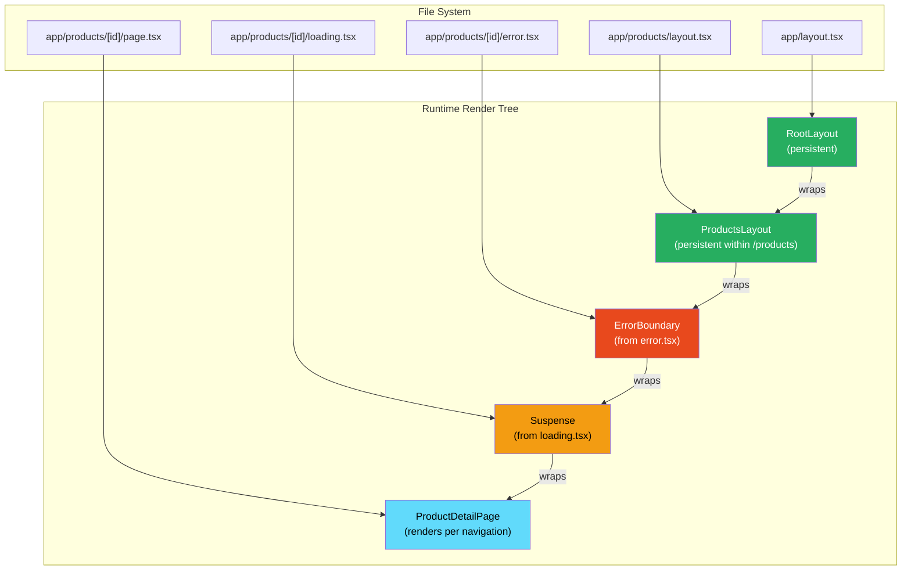
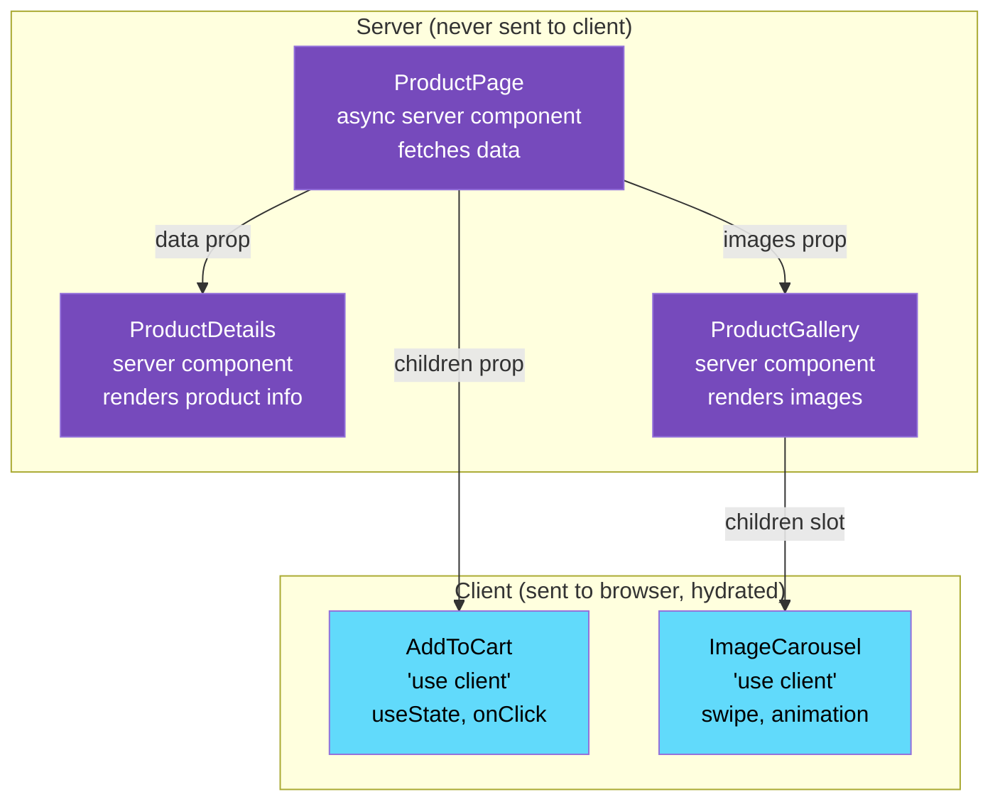

# 39 · App Router Architecture

> **The App Router is Next.js's second-generation routing system, built ground-up for React Server Components. It replaces the Pages Router's export-based data fetching (getServerSideProps, getStaticProps) with a model where components are the data layer. Understanding the App Router means understanding how the file system maps to a rendering pipeline, how layouts persist across navigation, and how server and client components compose in the same tree.**

The App Router is not just a new way to organize files — it represents a fundamentally different model for how React applications relate to the server. In the Pages Router, there was a clean separation: client = React, server = data fetching functions. In the App Router, server and client components compose together in the same component tree, and the boundary between them is explicit and intentional.

---

## Table of Contents

- [File System Conventions](#file-system-conventions)
- [The Special Files](#the-special-files)
- [Layouts: Persistent UI Across Navigation](#layouts-persistent-ui-across-navigation)
- [Route Groups](#route-groups)
- [Dynamic Routes](#dynamic-routes)
- [Parallel Routes](#parallel-routes)
- [Intercepting Routes](#intercepting-routes)
- [Server vs Client Components in the App Router](#server-vs-client-components-in-the-app-router)
- [The Component Composition Model](#the-component-composition-model)
- [generateStaticParams: Build-Time Route Generation](#generatestaticparams-build-time-route-generation)
- [generateMetadata: Co-located SEO](#generatemetadata-co-located-seo)
- [Route Segment Config](#route-segment-config)
- [Loading and Error UI](#loading-and-error-ui)
- [Not Found Handling](#not-found-handling)
- [Navigation in the App Router](#navigation-in-the-app-router)
- [Architecture Diagrams](#architecture-diagrams)
- [Good Practices](#good-practices)
- [Bad Practices](#bad-practices)
- [Mental Model](#mental-model)
- [Common Misconceptions](#common-misconceptions)
- [Exercises](#exercises)
- [Further Reading](#further-reading)

---

## File System Conventions

The App Router uses the `app/` directory. Every folder in `app/` represents a URL segment. Files within those folders define behavior:

```
app/
├── layout.tsx          → Root layout (wraps everything)
├── page.tsx            → Route: /
├── globals.css
│
├── about/
│   ├── layout.tsx      → Layout for /about/* routes
│   └── page.tsx        → Route: /about
│
├── products/
│   ├── layout.tsx      → Layout for /products/* routes
│   ├── page.tsx        → Route: /products
│   ├── loading.tsx     → Loading UI for /products
│   ├── error.tsx       → Error UI for /products
│   │
│   └── [id]/
│       ├── page.tsx    → Route: /products/:id
│       ├── loading.tsx → Loading UI for /products/:id
│       └── error.tsx   → Error UI for /products/:id
│
├── (marketing)/        → Route group (no URL segment)
│   ├── layout.tsx      → Layout for this group only
│   ├── features/
│   │   └── page.tsx    → Route: /features
│   └── pricing/
│       └── page.tsx    → Route: /pricing
│
└── api/
    └── webhook/
        └── route.ts    → API: POST /api/webhook
```

**Key rule:** Only `page.tsx` and `route.ts` make a segment publicly accessible. A folder without either is not a route — it can only contain components and utilities used by other routes.

---

## The Special Files

Each file in the App Router has a specific role in the rendering pipeline:

### page.tsx — The route content

```tsx
// app/products/[id]/page.tsx
// Props are injected by Next.js router
interface ProductPageProps {
  params: { id: string }; // URL params from [id]
  searchParams: { [key: string]: string | string[] | undefined }; // ?key=value
}

// Server Component by default (no 'use client' needed)
export default async function ProductPage({
  params,
  searchParams,
}: ProductPageProps) {
  const product = await db.products.findUnique({ where: { id: params.id } });
  return <ProductView product={product} />;
}
```

### layout.tsx — Persistent shell

```tsx
// app/layout.tsx — Root layout (required)
// wraps every page in the application
export default function RootLayout({
  children,
}: {
  children: React.ReactNode;
}) {
  return (
    <html lang="en">
      <body>
        <Navigation /> {/* persists across all navigation */}
        <main>{children}</main> {/* page content goes here */}
        <Footer /> {/* persists across all navigation */}
      </body>
    </html>
  );
}
```

### loading.tsx — Automatic Suspense boundary

```tsx
// app/products/loading.tsx
// Next.js wraps page.tsx in a <Suspense> with this as the fallback
// Shown while the page's async server component is resolving

export default function ProductsLoading() {
  return (
    <div className="grid">
      {Array.from({ length: 8 }, (_, i) => (
        <ProductSkeleton key={i} />
      ))}
    </div>
  );
}
```

When you navigate to `/products`, Next.js immediately shows `loading.tsx` while `page.tsx` (an async server component) fetches data. This happens automatically — you don't write the `<Suspense>` wrapper.

### error.tsx — Automatic Error Boundary

```tsx
// app/products/error.tsx
// Must be a Client Component (Error Boundaries must be class components or use lifecycle)
"use client";

interface ErrorProps {
  error: Error & { digest?: string }; // digest: server-side error ID for logs
  reset: () => void; // retry: re-renders the route
}

export default function ProductsError({ error, reset }: ErrorProps) {
  return (
    <div className="error-container">
      <h2>Failed to load products</h2>
      <p>{error.message}</p>
      <button onClick={reset}>Try again</button>
    </div>
  );
}
```

### template.tsx — Re-mounting layout

```tsx
// app/dashboard/template.tsx
// Like layout.tsx but re-mounts (creates a new instance) on every navigation
// Use when: you need effects to re-run on navigation, animation on page enter
export default function DashboardTemplate({
  children,
}: {
  children: React.ReactNode;
}) {
  return <PageTransition>{children}</PageTransition>;
}
```

### route.ts — API endpoints

```tsx
// app/api/products/route.ts
import { NextRequest, NextResponse } from "next/server";

export async function GET(request: NextRequest) {
  const { searchParams } = new URL(request.url);
  const category = searchParams.get("category");

  const products = await db.products.findMany({
    where: category ? { category } : undefined,
  });

  return NextResponse.json(products);
}

export async function POST(request: NextRequest) {
  const body = await request.json();
  const product = await db.products.create({ data: body });
  return NextResponse.json(product, { status: 201 });
}

// Named exports for each HTTP method:
// GET, POST, PUT, PATCH, DELETE, HEAD, OPTIONS
```

---

## Layouts: Persistent UI Across Navigation

Layouts are the App Router's most important optimization: they render once and persist across navigations within their scope.

```
URL: /products
Render tree:
  RootLayout (app/layout.tsx)        ← renders once for entire session
    ProductsLayout (products/layout.tsx)  ← renders once for /products/* navigation
      ProductsPage (products/page.tsx)    ← renders on each /products visit

URL: /products/123
Render tree:
  RootLayout                          ← SAME instance, NOT re-rendered
    ProductsLayout                    ← SAME instance, NOT re-rendered
      ProductDetailPage (products/[id]/page.tsx)  ← NEW render
```

When a user navigates from `/products` to `/products/123`:

- `RootLayout` state is preserved (shopping cart, auth status, etc.)
- `ProductsLayout` state is preserved (sort order, filter panel open/closed, etc.)
- Only `ProductDetailPage` is new — it fetches data and renders

This is fundamentally different from the Pages Router where every navigation re-renders the entire page including the layout.

### Layout persistence and state

```tsx
// app/shop/layout.tsx
// This layout maintains its own state across product navigation
export default function ShopLayout({
  children,
}: {
  children: React.ReactNode;
}) {
  // Note: must be a client component to use hooks
  // If you need state in a layout, add 'use client'
  return (
    <div className="shop">
      <FilterSidebar />{" "}
      {/* open/closed state preserved during /products/* navigation */}
      <div className="shop-content">{children}</div>
    </div>
  );
}
```

> ⚠️ **Layouts cannot receive searchParams.** Layouts render once and don't re-render on navigation (that's their purpose). Since searchParams change on navigation, they would cause layouts to re-render — defeating the persistence optimization. Read searchParams in `page.tsx`, not `layout.tsx`.

---

## Route Groups

Parentheses in folder names create route groups — organizational containers that don't add a URL segment:

```
app/
  (marketing)/              ← route group — no URL segment
    layout.tsx              ← layout for marketing pages only
    page.tsx                → /
    about/
      page.tsx              → /about
    pricing/
      page.tsx              → /pricing

  (app)/                    ← separate group with its own layout
    layout.tsx              ← layout for app pages only (must be authenticated)
    dashboard/
      page.tsx              → /dashboard
    settings/
      page.tsx              → /settings
```

### Use cases for route groups

```
1. Multiple root layouts (different <html> structure for different parts of the site)
2. Group-specific layouts (marketing site has different nav than the app)
3. Authentication boundaries (authenticated vs unauthenticated routes)
4. Code organization without affecting URLs
```

### Multiple root layouts

```tsx
// app/(marketing)/layout.tsx — Marketing site layout
export default function MarketingLayout({
  children,
}: {
  children: React.ReactNode;
}) {
  return (
    <html lang="en">
      <body>
        <MarketingNav />
        {children}
        <MarketingFooter />
      </body>
    </html>
  );
}

// app/(app)/layout.tsx — Application layout (different <html>)
export default function AppLayout({ children }: { children: React.ReactNode }) {
  return (
    <html lang="en" data-theme="app">
      <body>
        <AppSidebar />
        <main>{children}</main>
      </body>
    </html>
  );
}
```

When you have multiple root layouts, `app/layout.tsx` is optional — each route group can have its own root.

---

## Dynamic Routes

Brackets in folder names create dynamic segments:

```
app/
  products/
    [id]/               ← matches /products/anything
      page.tsx          → params.id = 'anything'

  blog/
    [...slug]/          ← catch-all: matches /blog/a, /blog/a/b, /blog/a/b/c
      page.tsx          → params.slug = ['a', 'b', 'c']

  optional/
    [[...slug]]/        ← optional catch-all: also matches /optional (no slug)
      page.tsx          → params.slug = [] or ['a', 'b']
```

### Typed params

```tsx
// app/products/[id]/page.tsx
// params type: { id: string } — always a string, never undefined
export default async function ProductPage({
  params,
}: {
  params: { id: string };
}) {
  // id is guaranteed to be a string by the router
  const product = await db.products.findUnique({ where: { id: params.id } });
  return <ProductView product={product} />;
}

// app/blog/[...slug]/page.tsx
// params type: { slug: string[] } — array of segments
export default function BlogPage({ params }: { params: { slug: string[] } }) {
  // slug = ['2024', '01', 'my-post'] for /blog/2024/01/my-post
  const [year, month, ...rest] = params.slug;
  return <BlogPost year={year} month={month} slug={rest.join("/")} />;
}
```

---

## Parallel Routes

`@folder` convention creates named "slots" in a layout — multiple pages rendered simultaneously in the same layout:

```
app/
  dashboard/
    layout.tsx              ← receives both @analytics and @team as props
    page.tsx                → /dashboard (main content)
    @analytics/
      page.tsx              → renders in analytics slot
    @team/
      page.tsx              → renders in team slot
      default.tsx           → fallback if @team has no matching route
```

```tsx
// app/dashboard/layout.tsx
export default function DashboardLayout({
  children, // page.tsx
  analytics, // @analytics/page.tsx
  team, // @team/page.tsx
}: {
  children: React.ReactNode;
  analytics: React.ReactNode;
  team: React.ReactNode;
}) {
  return (
    <div className="dashboard">
      <div className="main-content">{children}</div>
      <aside>
        <div className="analytics-panel">{analytics}</div>
        <div className="team-panel">{team}</div>
      </aside>
    </div>
  );
}
```

### Use cases for parallel routes

```
1. Dashboard widgets that load independently
2. Side panels (e.g., conversation list + current conversation)
3. Conditional rendering based on auth state
4. Modals that overlay while keeping the current route visible
```

---

## Intercepting Routes

`(.)folder`, `(..)folder`, `(...)folder` conventions intercept routes for modal/overlay patterns:

```
app/
  feed/
    page.tsx                → /feed (main feed)
    (.)photo/
      [id]/
        page.tsx            → Intercepts /photo/123 when navigating FROM /feed
  photo/
    [id]/
      page.tsx              → /photo/123 (full page when navigated directly)
```

```tsx
// When user clicks a photo in the feed:
// → URL changes to /photo/123
// → But renders feed/(.)/photo/[id]/page.tsx (the interceptor)
// → Shows photo in a modal overlay on top of the feed

// When user directly visits /photo/123 (e.g., from a link):
// → Renders photo/[id]/page.tsx (the full page)
// → No modal — full photo page
```

This pattern (parallel routes + intercepting routes) is the App Router's native implementation of the "modal URL" pattern — where a modal has its own URL, shareable and bookmarkable, but renders as an overlay in-context.

---

## Server vs Client Components in the App Router

The App Router defaults everything to Server Components. You opt into Client Components with `'use client'`:

```tsx
// Server Component (default — no directive needed)
// Can: use async/await, access DB, read secrets
// Cannot: use hooks, handle events, use browser APIs
async function ServerComponent() {
  const data = await db.getData();
  return <div>{data.value}</div>;
}

// Client Component (explicit opt-in)
// Can: use hooks (useState, useEffect, etc.), handle events
// Cannot: be async (in the async component sense), access DB directly
("use client");
function ClientComponent() {
  const [count, setCount] = useState(0);
  return <button onClick={() => setCount((c) => c + 1)}>{count}</button>;
}
```

### The 'use client' boundary

`'use client'` marks the boundary between server and client. It doesn't mean "this file is client-only" — it means "this file is the root of a client component tree":

```tsx
// app/products/product-card.tsx
"use client";

// All components imported INTO a 'use client' file are also client components
// Even if they don't have 'use client' themselves
function ProductCard({ product }: { product: Product }) {
  const [isWishlisted, setIsWishlisted] = useState(false);
  return (
    <div>
      <ProductImage src={product.image} />{" "}
      {/* also becomes a client component */}
      <ProductPrice price={product.price} />{" "}
      {/* also becomes a client component */}
    </div>
  );
}
```

### What can't cross the server/client boundary

```tsx
// ❌ Cannot pass a function from Server Component to Client Component
async function ServerComponent() {
  const serverFn = () => console.log("server side");
  return <ClientComponent onClick={serverFn} />; // Error: functions can't be serialized
}

// ❌ Cannot pass class instances
async function ServerComponent() {
  const dbConnection = db.getConnection(); // not serializable
  return <ClientComponent connection={dbConnection} />; // Error
}

// ✅ CAN pass serializable data: strings, numbers, plain objects, arrays
async function ServerComponent() {
  const data = await db.getData(); // plain JS object
  return <ClientComponent data={data} />; // OK — serializable
}
```

---

## The Component Composition Model

The App Router enables a powerful composition pattern: passing Server Components as children to Client Components.

```tsx
// Pattern: Server Component → Client Component → Server Component (as children)

// Server Component at the top
async function ProductPage() {
  const product = await db.products.findUnique(...);

  return (
    // Client Component wrapper (for interactivity)
    <InteractiveWrapper>
      {/* Server Components passed as children — NOT re-rendered on client */}
      <ProductDetails product={product} />
      <ProductGallery images={product.images} />
    </InteractiveWrapper>
  );
}

// Client Component: receives server-rendered children as a slot
'use client';
function InteractiveWrapper({ children }: { children: React.ReactNode }) {
  const [expanded, setExpanded] = useState(false);
  return (
    <div className={expanded ? 'expanded' : ''}>
      <button onClick={() => setExpanded(e => !e)}>Toggle</button>
      {children}  {/* Server-rendered content — no hydration needed */}
    </div>
  );
}
```

This works because:

1. Server Components render on the server → HTML output
2. That HTML is passed as `children` to the Client Component
3. React doesn't re-render the server components on the client — it reuses the HTML
4. Only the Client Component's interactive parts require hydration

---

## generateStaticParams: Build-Time Route Generation

For dynamic routes, `generateStaticParams` tells Next.js which params to pre-render at build time:

```tsx
// app/products/[id]/page.tsx

// Optional: pre-render these specific IDs at build time
export async function generateStaticParams() {
  // Fetch all product IDs for pre-rendering
  const products = await db.products.findMany({
    select: { id: true },
    where: { featured: true }, // pre-render only featured products
  });

  return products.map((product) => ({
    id: product.id, // must match the [id] param name
  }));
}

// The page itself
export default async function ProductPage({
  params,
}: {
  params: { id: string };
}) {
  const product = await db.products.findUnique({ where: { id: params.id } });
  if (!product) notFound();
  return <ProductView product={product} />;
}

// Behavior:
// - Routes in generateStaticParams: pre-rendered at build time (HTML file)
// - Routes NOT in generateStaticParams: rendered at request time (dynamic)
```

### Combining with dynamicParams

```tsx
// Control behavior for params NOT in generateStaticParams:
export const dynamicParams = true; // (default) render on demand
export const dynamicParams = false; // 404 for any param not in generateStaticParams
```

---

## generateMetadata: Co-located SEO

Metadata (title, description, og:image, etc.) lives alongside the page that needs it:

```tsx
// app/products/[id]/page.tsx

// Static metadata (if no data needed)
export const metadata = {
  title: "Products",
  description: "Browse our products",
};

// Dynamic metadata (when title/description come from data)
export async function generateMetadata(
  { params }: { params: { id: string } },
  parent: ResolvingMetadata, // parent layout's metadata
): Promise<Metadata> {
  const product = await db.products.findUnique({
    where: { id: params.id },
    select: { name: true, description: true, image: true },
  });

  if (!product) {
    return { title: "Product Not Found" };
  }

  const parentMetadata = await parent; // merge with parent

  return {
    title: `${product.name} | My Shop`,
    description: product.description,
    openGraph: {
      title: product.name,
      description: product.description,
      images: [product.image],
      ...(parentMetadata.openGraph ?? {}),
    },
  };
}

export default async function ProductPage({
  params,
}: {
  params: { id: string };
}) {
  // Note: data is fetched twice (once in generateMetadata, once here)
  // Next.js deduplicates identical fetch() calls within the same request
  const product = await db.products.findUnique({ where: { id: params.id } });
  return <ProductView product={product} />;
}
```

---

## Route Segment Config

Each route segment can export config variables that control its rendering behavior:

```tsx
// Rendering strategy:
export const dynamic = "auto"; // default: heuristic (static if possible)
export const dynamic = "force-static"; // always static (build time)
export const dynamic = "force-dynamic"; // always dynamic (every request)
export const dynamic = "error"; // throw error if would be dynamic

// Revalidation:
export const revalidate = false; // never revalidate (cache forever)
export const revalidate = 0; // never cache (force-dynamic equivalent)
export const revalidate = 60; // revalidate every 60 seconds (ISR)

// Runtime:
export const runtime = "nodejs"; // default Node.js runtime
export const runtime = "edge"; // Edge runtime (V8 Isolates)

// Fetch cache:
export const fetchCache = "auto"; // default
export const fetchCache = "force-cache"; // cache all fetches

// Preferred region (for edge deployments):
export const preferredRegion = "auto"; // default
export const preferredRegion = "iad1"; // specific Vercel region

// Max duration (for function timeout):
export const maxDuration = 300; // 300 seconds (5 minutes)
```

---

## Loading and Error UI

The App Router's `loading.tsx` and `error.tsx` files create automatic Suspense and Error Boundaries:

### What Next.js generates from loading.tsx

```tsx
// Your file system:
// app/products/loading.tsx
// app/products/page.tsx (async server component)

// What Next.js effectively renders:
function ProductsRouteSegment() {
  return (
    <Suspense fallback={<ProductsLoadingComponent />}>
      {" "}
      {/* from loading.tsx */}
      <ProductsPage /> {/* from page.tsx */}
    </Suspense>
  );
}
```

### What Next.js generates from error.tsx

```tsx
// app/products/error.tsx + app/products/page.tsx

// What Next.js effectively renders:
function ProductsRouteSegment() {
  return (
    <ErrorBoundary fallback={<ProductsErrorComponent />}>
      {" "}
      {/* from error.tsx */}
      <Suspense fallback={<ProductsLoadingComponent />}>
        {" "}
        {/* from loading.tsx */}
        <ProductsPage />
      </Suspense>
    </ErrorBoundary>
  );
}
```

### Error propagation

```
Error in app/products/[id]/page.tsx
  ↓ Error Boundary
  app/products/[id]/error.tsx?  → show this if exists
  ↓ No match, propagate up
  app/products/error.tsx?       → show this if exists
  ↓ No match, propagate up
  app/error.tsx?                → show this if exists
  ↓ No match
  Unhandled error → default Next.js error page
```

---

## Not Found Handling

```tsx
// Trigger 404 programmatically:
import { notFound } from "next/navigation";

async function ProductPage({ params }: { params: { id: string } }) {
  const product = await db.products.findUnique({ where: { id: params.id } });
  if (!product) notFound(); // throws a special Next.js error
  return <ProductView product={product} />;
}

// app/products/[id]/not-found.tsx
export default function ProductNotFound() {
  return (
    <div>
      <h2>Product not found</h2>
      <p>The product you're looking for doesn't exist.</p>
      <Link href="/products">Browse Products</Link>
    </div>
  );
}

// Falls through to app/not-found.tsx if no specific not-found.tsx
```

---

## Navigation in the App Router

### Link component (client-side navigation)

```tsx
import Link from 'next/link';

// Prefetches on hover/viewport entry (in production)
<Link href="/products">Products</Link>

// With dynamic route
<Link href={`/products/${product.id}`}>View Product</Link>

// Disable prefetching
<Link href="/products" prefetch={false}>Products</Link>

// Replace instead of push (no back button)
<Link href="/products" replace>Products</Link>
```

### useRouter (programmatic navigation)

```tsx
"use client";
import { useRouter } from "next/navigation";

function ActionButton() {
  const router = useRouter();

  const handleAction = async () => {
    await performAction();
    router.push("/success"); // navigate to new page
    router.replace("/success"); // navigate without history entry
    router.back(); // go back
    router.forward(); // go forward
    router.refresh(); // re-fetch server data for current page
    router.prefetch("/heavy-page"); // manually prefetch
  };
}
```

### usePathname and useSearchParams

```tsx
"use client";
import { usePathname, useSearchParams } from "next/navigation";

function ActiveLink({ href, label }: { href: string; label: string }) {
  const pathname = usePathname(); // current URL path (no query)
  const isActive = pathname === href;
  return (
    <a href={href} className={isActive ? "active" : ""}>
      {label}
    </a>
  );
}

function SearchHandler() {
  const searchParams = useSearchParams();
  const query = searchParams.get("q") ?? "";
  return <SearchInput value={query} />;
}
```

### redirect and permanentRedirect (server-side)

```tsx
import { redirect, permanentRedirect } from "next/navigation";

async function ProtectedPage() {
  const session = await getSession();
  if (!session) redirect("/login"); // 307 Temporary Redirect
  // or:
  if (session.oldAccount) permanentRedirect("/new-url"); // 308 Permanent Redirect
  return <ProtectedContent />;
}
```

---

## Architecture Diagrams

### App Router rendering layers



### Server/Client component composition



---

## Good Practices

### ✅ Good Practice — Push server work as deep as possible

```tsx
/**
 * Good: Data fetching happens at the leaf, as close to where data is used as possible.
 * Each component fetches only what it needs.
 * Parallel fetches for independent data.
 * Layouts handle shared data for their subtree.
 */

// app/dashboard/layout.tsx — shared auth check
async function DashboardLayout({ children }: { children: React.ReactNode }) {
  const session = await getSession();
  if (!session) redirect("/login");

  return <DashboardShell user={session.user}>{children}</DashboardShell>;
}

// app/dashboard/page.tsx — dashboard-specific data
async function DashboardPage() {
  // These fetch in parallel:
  const [metrics, recentActivity] = await Promise.all([
    fetchMetrics(), // dashboard-specific
    fetchRecentActivity(), // dashboard-specific
  ]);

  return (
    <div>
      <MetricsPanel metrics={metrics} />
      <ActivityFeed activity={recentActivity} />
      <Suspense fallback={<WidgetSkeleton />}>
        <ExpensiveWidget /> {/* loads independently */}
      </Suspense>
    </div>
  );
}

// app/dashboard/expensive-widget/page.tsx (parallel route) or:
// A server component that fetches its own data:
async function ExpensiveWidget() {
  const data = await fetchExpensiveData(); // doesn't block rest of page
  return <WidgetView data={data} />;
}
```

---

## Bad Practices

### ⚠️ Bad Practice — Fetching data in the root layout and drilling it down

```tsx
/**
 * Bad: Root layout fetches all data and passes it down through props.
 * This makes the root layout the bottleneck — everything waits for it.
 * Prop drilling defeats the purpose of co-located data fetching.
 * Adding a new data requirement requires modifying the root layout.
 */

// ❌ Root layout as data orchestrator
async function RootLayout({ children }: { children: React.ReactNode }) {
  // All data fetched here — BLOCKING: page waits for all of this
  const [user, products, categories, settings, notifications] =
    await Promise.all([
      fetchUser(), // needed by header
      fetchProducts(), // needed by product pages
      fetchCategories(), // needed by navigation
      fetchSettings(), // needed by... somewhere
      fetchNotifications(), // needed by notification bell
    ]);

  return (
    <html>
      <body>
        {/* Prop drilling — deep component trees */}
        <Header
          user={user}
          notifications={notifications}
          categories={categories}
        />
        {/* How does children receive products and settings? */}
        {children}
      </body>
    </html>
  );
}

/**
 * ✅ Fix: Each component fetches its own data
 * Data fetching is co-located and parallel
 */
async function RootLayout({ children }: { children: React.ReactNode }) {
  return (
    <html>
      <body>
        <Header /> {/* fetches user, notifications internally */}
        <Navigation /> {/* fetches categories internally */}
        {children} {/* product pages fetch products internally */}
      </body>
    </html>
  );
}

async function Header() {
  const [user, notifications] = await Promise.all([
    fetchUser(),
    fetchNotifications(),
  ]);
  return <HeaderUI user={user} notifications={notifications} />;
}
```

**Production impact:** A root layout that fetches all data becomes the critical path for every page. If `fetchNotifications()` takes 800ms, EVERY page in the application waits 800ms before showing anything — even pages that don't display notifications. Co-located data fetching means each component's data is fetched in parallel with others, and slow data sources only delay the components that depend on them.

---

## Mental Model

> 💡 **The App Router mental model:**
>
> The App Router is like a **building floor plan** mapped to URLs. Each floor (route segment) has a persistent shell (layout) and replaceable rooms (pages). When you change floors (navigate to a new route), the building's walls (root layout), the floor's hallways (nested layouts), and the elevators (navigation) stay exactly where they are — only the specific room you're moving to changes. The `loading.tsx` file is like a "Coming Soon" sign on a room's door (shown while the room is being prepared). The `error.tsx` is like an emergency exit sign (shown when something breaks). Server components are the architectural plans drawn offsite (on the server, never visible to building occupants). Client components are the furniture that occupants can move around (interactive, on the client).

---

## Common Misconceptions

### "loading.tsx creates a full-page loading state"

`loading.tsx` creates a Suspense boundary only around the `page.tsx` in the same directory. The layout above it still renders immediately. Users see the layout (navigation, header, footer) right away — only the page content shows the loading fallback.

### "layout.tsx re-renders on every navigation"

Layouts persist across navigation within their scope — they do NOT re-render when navigating between routes within the same layout segment. This is the main purpose of layouts. State in layouts (via 'use client') is preserved across navigation.

### "Client Components can't have Server Components as children"

They can, via the `children` prop pattern. A Server Component can pass Server Component children to a Client Component wrapper. Those children were rendered on the server and are passed as already-rendered content.

### "route.ts is the only way to create an API"

Server Actions provide another mechanism for server-side mutations without explicit API routes. `route.ts` is for RESTful-style endpoints; Server Actions are for form submissions and mutations.

### "parallel routes require complex setup"

Basic parallel routes just need `@slot` folders. They become complex when combined with intercepting routes — but for simple dashboard layouts with independent panels, they're straightforward.

---

## Exercises

### Exercise 1 — Map a URL structure to App Router files

Given this URL structure:

```
/                         (homepage)
/about                    (about page)
/blog                     (blog listing)
/blog/[slug]              (individual blog post)
/dashboard                (requires auth)
/dashboard/analytics      (analytics section)
/dashboard/users          (user management)
/dashboard/users/[id]     (individual user)
/api/posts                (GET: list, POST: create)
/api/posts/[id]           (GET: single, PUT: update, DELETE: delete)
```

Create the complete file tree for `app/`. Include appropriate special files (layout.tsx, loading.tsx, error.tsx, not-found.tsx) where they make sense.

### Exercise 2 — Implement persistent layout state

Build a dashboard with:

- A persistent sidebar (open/closed state survives navigation)
- Three sub-pages: `/dashboard/overview`, `/dashboard/metrics`, `/dashboard/settings`
- Each page has different data requirements
- Navigating between pages should NOT reset the sidebar state

Verify: click through all three pages and confirm sidebar state persists.

### Exercise 3 — Implement the modal URL pattern

Build a photo feed (`/feed`) where:

- Clicking a photo changes URL to `/photos/[id]` but shows a modal overlay
- Directly visiting `/photos/[id]` shows the full photo page
- The modal URL is shareable (if shared, opens full page)

Use parallel routes + intercepting routes.

---

## Further Reading

- [Next.js docs: Routing](https://nextjs.org/docs/app/building-your-application/routing) — Complete routing reference
- [Next.js docs: Layouts and Pages](https://nextjs.org/docs/app/building-your-application/routing/layouts-and-pages) — Layout architecture
- [Next.js docs: Parallel Routes](https://nextjs.org/docs/app/building-your-application/routing/parallel-routes) — Advanced routing
- [Next.js docs: Data Fetching](https://nextjs.org/docs/app/building-your-application/data-fetching) — Data patterns
- [Next.js docs: generateStaticParams](https://nextjs.org/docs/app/api-reference/functions/generate-static-params)
- [Next.js docs: Route Handlers](https://nextjs.org/docs/app/building-your-application/routing/route-handlers) — API routes
- Next in this handbook: [40 · Pages Router Architecture](./03-pages-router.md)

---

_Part of the [React + Next.js Engineering Handbook](../../README.md)_
