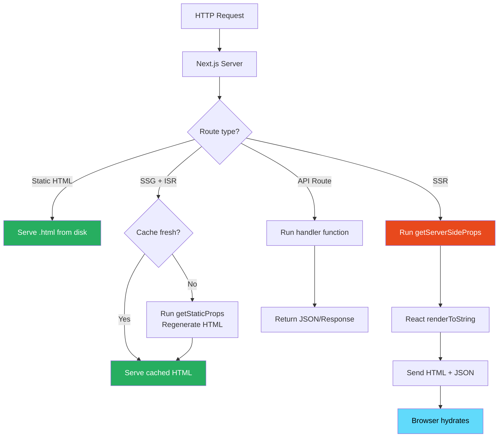
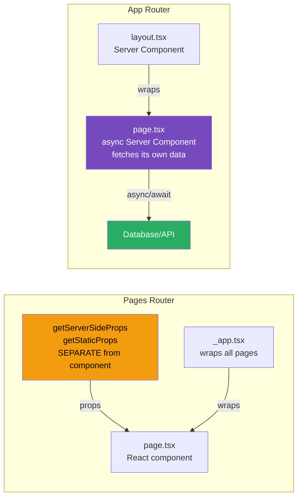

# 40 · Pages Router Architecture

> **The Pages Router is Next.js's original routing system, stable since Next.js 9 and still the system used by the majority of production Next.js applications. It separates page content from data fetching through exported lifecycle functions — getStaticProps, getServerSideProps, getStaticPaths — that run server-side while the page component itself runs client-side. Understanding the Pages Router is essential for working with existing codebases and for understanding the design decisions the App Router was built to improve upon.**

The Pages Router is not obsolete. Millions of production applications use it, it receives ongoing maintenance and security updates, and many teams will remain on it for years. More importantly, understanding the Pages Router's patterns — its constraints, its solutions to rendering problems, and its data fetching lifecycle — directly informs understanding of why the App Router was designed the way it was.

---

## Table of Contents

- [Pages Router File Conventions](#pages-router-file-conventions)
- [The Data Fetching Lifecycle](#the-data-fetching-lifecycle)
- [getStaticProps: Build-Time Data Fetching](#getstaticprops-build-time-data-fetching)
- [getStaticPaths: Dynamic Static Routes](#getstaticpaths-dynamic-static-routes)
- [getServerSideProps: Request-Time Data Fetching](#getserversideprops-request-time-data-fetching)
- [Incremental Static Regeneration (ISR)](#incremental-static-regeneration-isr)
- [Client-Side Data Fetching](#client-side-data-fetching)
- [API Routes](#api-routes)
- [The \_app.tsx File](#the-_apptsx-file)
- [The \_document.tsx File](#the-_documenttsx-file)
- [Dynamic Imports in the Pages Router](#dynamic-imports-in-the-pages-router)
- [Middleware in the Pages Router](#middleware-in-the-pages-router)
- [Pages Router vs App Router: When to Use Which](#pages-router-vs-app-router-when-to-use-which)
- [Migrating from Pages Router to App Router](#migrating-from-pages-router-to-app-router)
- [Architecture Diagrams](#architecture-diagrams)
- [Good Practices](#good-practices)
- [Bad Practices](#bad-practices)
- [Mental Model](#mental-model)
- [Common Misconceptions](#common-misconceptions)
- [Exercises](#exercises)
- [Further Reading](#further-reading)

---

## Pages Router File Conventions

```
pages/
├── _app.tsx            → Custom App wrapper (all pages go through this)
├── _document.tsx       → Custom HTML document structure
├── _error.tsx          → Custom error page
├── 404.tsx             → Custom 404 page
├── 500.tsx             → Custom 500 page
├── index.tsx           → Route: / (homepage)
├── about.tsx           → Route: /about
│
├── products/
│   ├── index.tsx       → Route: /products
│   └── [id].tsx        → Route: /products/:id (dynamic)
│
├── blog/
│   └── [...slug].tsx   → Route: /blog/* (catch-all)
│
└── api/
    ├── hello.ts        → API: /api/hello
    └── products/
        └── [id].ts     → API: /api/products/:id
```

Key differences from the App Router:

- No `layout.tsx` — layouts use the `_app.tsx` file and component composition
- No `loading.tsx` — loading states are manual (`useState`, Suspense if you add it)
- No `error.tsx` — error handling is manual or through Error Boundaries
- All pages are React components (no async server components)
- Data fetching through exported functions, not `async/await` in the component

---

## The Data Fetching Lifecycle

The Pages Router has four rendering modes, chosen by which functions you export from a page file:

```
Mode 1: STATIC (no data fetching export)
  Behavior: Rendered at build time, served as static HTML
  Use when: Page has no dynamic data (About page, Privacy Policy)

Mode 2: SSG (export getStaticProps)
  Behavior: Rendered at build time with data from getStaticProps
  Use when: Data available at build time, doesn't change per-user (blog posts, product pages)

Mode 3: ISR (export getStaticProps + revalidate)
  Behavior: SSG with periodic background regeneration
  Use when: Data changes but doesn't need to be real-time

Mode 4: SSR (export getServerSideProps)
  Behavior: Rendered on every request with fresh data
  Use when: Data is user-specific or changes frequently (dashboard, search results)
```

### The rendering decision process

```
next build encounters a page:

Does the page export getServerSideProps?
  YES → mark as SSR (dynamic, renders per request)
  NO →
    Does the page export getStaticProps?
      YES → render at build time with that function's data
            Does revalidate exist in return value?
              YES → mark as ISR (periodic regeneration)
              NO → mark as fully static
      NO → render at build time with no data (pure static)
```

---

## getStaticProps: Build-Time Data Fetching

`getStaticProps` runs at build time (and during ISR regeneration) and passes data to the page component as props:

```tsx
// pages/products/index.tsx

import type { GetStaticProps, InferGetStaticPropsType } from "next";

interface Product {
  id: string;
  name: string;
  price: number;
}

interface Props {
  products: Product[];
  generatedAt: string;
}

// Page component: receives data from getStaticProps as props
export default function ProductsPage({
  products,
  generatedAt,
}: InferGetStaticPropsType<typeof getStaticProps>) {
  return (
    <div>
      <p>Generated at: {generatedAt}</p>
      <ul>
        {products.map((product) => (
          <li key={product.id}>
            {product.name}: ${product.price}
          </li>
        ))}
      </ul>
    </div>
  );
}

// getStaticProps: runs on the server at build time
// This code is NEVER sent to the client (even imports are tree-shaken)
export const getStaticProps: GetStaticProps<Props> = async (context) => {
  // context contains:
  // - params: URL params (from getStaticPaths)
  // - locale: current locale (if i18n configured)
  // - preview: boolean (if preview mode)
  // - previewData: preview data (if preview mode)

  try {
    const products = await db.products.findMany({
      select: { id: true, name: true, price: true },
    });

    return {
      props: {
        products,
        generatedAt: new Date().toISOString(),
      },
      // Optional: revalidate (ISR)
      // revalidate: 60, // regenerate after 60 seconds
    };
  } catch (error) {
    // Return notFound to show 404:
    return { notFound: true };
    // Or redirect:
    // return { redirect: { destination: '/error', permanent: false } };
  }
};
```

### What getStaticProps can and cannot do

```tsx
// ✅ CAN do in getStaticProps:
// - Access databases directly (this code runs server-side)
// - Use environment variables (including server secrets)
// - Import server-only packages (fs, path, database clients)
// - Fetch from internal APIs
// - Read from the file system

// ❌ CANNOT do in getStaticProps:
// - Access browser APIs (window, document)
// - Access request-specific data (no req/res object)
// - Access user session (no cookies in context)
// - Return non-serializable data (functions, class instances, undefined values)
```

### The serialization requirement

```tsx
// ❌ getStaticProps cannot return non-serializable data
return {
  props: {
    fn: () => {}, // Function — not serializable
    date: new Date(), // Date object — not serializable (convert to ISO string)
    map: new Map(), // Map — not serializable
    undefined: undefined, // Undefined — not serializable (use null)
  },
};

// ✅ Correct: all values must be JSON-serializable
return {
  props: {
    date: new Date().toISOString(), // string
    items: [{ id: 1, name: "Item" }], // plain objects
    count: 42, // numbers
    flag: true, // booleans
    optional: null, // null (not undefined)
  },
};
```

---

## getStaticPaths: Dynamic Static Routes

For dynamic routes (`[id].tsx`), `getStaticPaths` tells Next.js which paths to pre-render:

```tsx
// pages/products/[id].tsx

import type {
  GetStaticPaths,
  GetStaticProps,
  InferGetStaticPropsType,
} from "next";

// Which paths to pre-render:
export const getStaticPaths: GetStaticPaths = async () => {
  const products = await db.products.findMany({
    select: { id: true },
    where: { featured: true }, // only pre-render featured products
  });

  const paths = products.map((product) => ({
    params: { id: product.id },
  }));

  return {
    paths,
    fallback: "blocking", // behavior for paths NOT in the list
    // fallback: false    → 404 for unknown paths
    // fallback: true     → show fallback UI, generate in background
    // fallback: 'blocking' → SSR on first request, then cache
  };
};

// Data for each pre-rendered path:
export const getStaticProps: GetStaticProps = async ({ params }) => {
  const product = await db.products.findUnique({
    where: { id: params?.id as string },
  });

  if (!product) return { notFound: true };

  return {
    props: { product },
    revalidate: 60,
  };
};

export default function ProductPage({
  product,
}: InferGetStaticPropsType<typeof getStaticProps>) {
  const router = useRouter();

  // Show loading state for fallback: true paths not yet generated
  if (router.isFallback) {
    return <ProductSkeleton />;
  }

  return <ProductView product={product} />;
}
```

### The three fallback modes

```
fallback: false
  Unknown paths → 404 immediately
  Use when: Complete list of paths is known at build time
  Example: /about, /pricing, /contact (fixed set)

fallback: true
  Unknown paths → immediate render with router.isFallback = true
  getStaticProps runs in background
  When done: page updates with real data
  Use when: Many paths, want fast initial response, can show skeleton
  Example: 100,000 products — pre-render top 100, generate rest on demand

fallback: 'blocking'
  Unknown paths → SSR once (like getServerSideProps), then cached as static
  No isFallback loading state — user waits for data before seeing page
  Use when: SEO matters, don't want to show skeleton
  Example: Blog posts — each generates once, then cached forever
```

---

## getServerSideProps: Request-Time Data Fetching

`getServerSideProps` runs on every request and has access to the HTTP request and response:

```tsx
// pages/dashboard.tsx

import type { GetServerSideProps, InferGetServerSidePropsType } from "next";
import type { IncomingMessage, ServerResponse } from "http";

export const getServerSideProps: GetServerSideProps = async (context) => {
  const {
    req, // Node.js IncomingMessage (full HTTP request)
    res, // Node.js ServerResponse
    params, // URL params (for dynamic routes)
    query, // URL query string as object
    preview, // boolean: preview mode
    previewData, // preview data
    resolvedUrl, // the resolved URL (includes query string)
    locale, // current locale
  } = context;

  // Access cookies (user-specific data):
  const session = await getSession({ req });
  if (!session) {
    return {
      redirect: {
        destination: "/login",
        permanent: false, // 307 (use false for user-specific redirects)
      },
    };
  }

  // Access request headers:
  const userAgent = req.headers["user-agent"];

  // Fetch user-specific data:
  const dashboardData = await fetchDashboard(session.userId);

  // Set response headers:
  res.setHeader("Cache-Control", "private, no-store");

  return {
    props: {
      data: dashboardData,
      user: session.user,
    },
  };
};

export default function DashboardPage({
  data,
  user,
}: InferGetServerSidePropsType<typeof getServerSideProps>) {
  return <Dashboard data={data} user={user} />;
}
```

### Performance characteristics of getServerSideProps

```
Every request:
  1. Next.js server receives HTTP request
  2. Executes getServerSideProps (DB queries, API calls)
  3. Renders React component with props to HTML string
  4. Sends complete HTML to browser
  5. Browser hydrates (attaches event listeners)

Total TTFB = getServerSideProps execution time + React SSR time
             (typically 50-500ms for most apps)

No caching by default — every request does all of this
Add manual caching: res.setHeader('Cache-Control', 's-maxage=10, stale-while-revalidate')
```

---

## Incremental Static Regeneration (ISR)

ISR generates static pages at build time and regenerates them in the background when they become stale:

```tsx
export const getStaticProps: GetStaticProps = async () => {
  const data = await fetchData();

  return {
    props: { data },
    revalidate: 60, // regenerate after 60 seconds if requested
  };
};
```

### ISR behavior timeline

```
Build time: Page generated with data from getStaticProps
  → Stored in CDN / cache

Request at t=0: User visits page
  → Served from cache (instant)
  → Cache age: 0 seconds

Request at t=30s: Another user visits
  → Served from cache (still fresh — revalidate: 60)
  → Cache age: 30 seconds

Request at t=65s: Another user visits
  → Served from cache (stale — cache age > 60s)
  → Triggers background regeneration:
     getStaticProps runs again
     New HTML generated with fresh data
  → Current user gets stale page (immediate response)

Request at t=70s: Another user visits
  → Served from NEW cache (fresh data)
  → 5 second delay between stale request and fresh availability
```

### On-demand ISR revalidation

```tsx
// pages/api/revalidate.ts
import type { NextApiRequest, NextApiResponse } from "next";

export default async function handler(
  req: NextApiRequest,
  res: NextApiResponse,
) {
  // Protect with a secret token
  if (req.query.secret !== process.env.REVALIDATION_SECRET) {
    return res.status(401).json({ message: "Invalid token" });
  }

  const path = req.query.path as string;

  try {
    await res.revalidate(path); // immediately regenerates the page
    return res.json({ revalidated: true });
  } catch (err) {
    return res.status(500).send("Error revalidating");
  }
}

// Trigger from a CMS webhook:
// POST /api/revalidate?secret=MY_SECRET&path=/products/123
// → Immediately regenerates /products/123
```

---

## Client-Side Data Fetching

Not all data in a Pages Router app needs server-side fetching. Client-side fetching (via hooks) works for:

- User-specific data that doesn't need SSR
- Real-time data (WebSockets, polling)
- Data below the fold / loaded on interaction

```tsx
// pages/dashboard.tsx
// Server-side: session check and critical data
// Client-side: dashboard widgets that can load independently

export const getServerSideProps: GetServerSideProps = async ({ req }) => {
  const session = await getSession({ req });
  if (!session)
    return { redirect: { destination: "/login", permanent: false } };
  return { props: { userId: session.userId } };
};

export default function Dashboard({ userId }: { userId: string }) {
  // Critical data: server-rendered (session)
  // Secondary data: client-fetched (widgets)

  const { data: metrics, isLoading } = useSWR(
    `/api/metrics?userId=${userId}`,
    fetcher,
  );

  return (
    <div>
      <h1>Dashboard</h1>
      {isLoading ? <MetricsSkeleton /> : <MetricsPanel metrics={metrics} />}
    </div>
  );
}
```

### SWR pattern for Pages Router

SWR (stale-while-revalidate) is the most common client-side data fetching pattern in Next.js Pages Router apps:

```tsx
import useSWR from "swr";

const fetcher = (url: string) => fetch(url).then((r) => r.json());

function Profile() {
  const { data, error, isLoading } = useSWR("/api/user", fetcher);

  if (error) return <ErrorView error={error} />;
  if (isLoading) return <ProfileSkeleton />;
  return <ProfileView user={data} />;
}
```

---

## API Routes

Pages Router API routes (`pages/api/`) handle HTTP requests server-side:

```tsx
// pages/api/products/[id].ts
import type { NextApiRequest, NextApiResponse } from "next";

type SuccessResponse = { product: Product };
type ErrorResponse = { message: string };

export default async function handler(
  req: NextApiRequest,
  res: NextApiResponse<SuccessResponse | ErrorResponse>,
) {
  const { id } = req.query;

  switch (req.method) {
    case "GET": {
      const product = await db.products.findUnique({
        where: { id: id as string },
      });

      if (!product) {
        return res.status(404).json({ message: "Product not found" });
      }

      return res.status(200).json({ product });
    }

    case "PUT": {
      // Auth check
      const session = await getSession({ req });
      if (!session?.user.isAdmin) {
        return res.status(403).json({ message: "Forbidden" });
      }

      const updated = await db.products.update({
        where: { id: id as string },
        data: req.body,
      });

      return res.status(200).json({ product: updated });
    }

    case "DELETE": {
      await db.products.delete({ where: { id: id as string } });
      return res.status(204).end();
    }

    default:
      res.setHeader("Allow", ["GET", "PUT", "DELETE"]);
      return res.status(405).json({ message: "Method Not Allowed" });
  }
}
```

---

## The \_app.tsx File

`_app.tsx` wraps every page in the application — the equivalent of a root layout:

```tsx
// pages/_app.tsx
import type { AppProps } from "next/app";
import { SessionProvider } from "next-auth/react";
import { QueryClient, QueryClientProvider } from "@tanstack/react-query";
import { useState } from "react";

// Global CSS (can only be imported in _app.tsx):
import "../styles/globals.css";

export default function MyApp({
  Component, // the page component
  pageProps, // props from getServerSideProps/getStaticProps
}: AppProps) {
  // queryClient persists across page navigation (like a layout)
  const [queryClient] = useState(() => new QueryClient());

  return (
    <SessionProvider session={pageProps.session}>
      <QueryClientProvider client={queryClient}>
        <Layout>
          <Component {...pageProps} />
        </Layout>
      </QueryClientProvider>
    </SessionProvider>
  );
}
```

### The layout pattern in Pages Router

Since there's no built-in layout file, layouts are implemented via component composition in `_app.tsx`:

```tsx
// Pattern: per-page layout
// pages/dashboard.tsx
function Dashboard() { ... }
Dashboard.getLayout = function getLayout(page: ReactElement) {
  return <DashboardLayout>{page}</DashboardLayout>;
};

// pages/_app.tsx
type NextPageWithLayout = NextPage & {
  getLayout?: (page: ReactElement) => ReactNode;
};

type AppPropsWithLayout = AppProps & {
  Component: NextPageWithLayout;
};

export default function MyApp({ Component, pageProps }: AppPropsWithLayout) {
  const getLayout = Component.getLayout ?? ((page) => page);
  return getLayout(<Component {...pageProps} />);
}
```

---

## The \_document.tsx File

`_document.tsx` customizes the HTML structure that Next.js generates — specifically the `<html>` and `<body>` tags:

```tsx
// pages/_document.tsx
import { Html, Head, Main, NextScript } from "next/document";

export default function Document() {
  return (
    <Html lang="en" dir="ltr">
      <Head>
        {/* Only rendered server-side — not the same as <head> in components */}
        <link rel="preconnect" href="https://fonts.googleapis.com" />
        <link rel="icon" href="/favicon.ico" />
        {/* Custom meta tags for all pages */}
        <meta name="theme-color" content="#ffffff" />
      </Head>
      <body className="bg-white">
        <Main /> {/* Where page content goes */}
        <NextScript /> {/* Next.js scripts */}
      </body>
    </Html>
  );
}
```

`_document.tsx` is server-only — it cannot use hooks or browser APIs. For client-side HTML manipulation, use `_app.tsx` or the `<Head>` component from `next/head`.

---

## Dynamic Imports in the Pages Router

Code splitting in the Pages Router uses `next/dynamic`:

```tsx
import dynamic from "next/dynamic";

// Lazy-loaded component (code-split)
const HeavyChart = dynamic(() => import("../components/HeavyChart"), {
  loading: () => <ChartSkeleton />, // shown while loading
  ssr: false, // skip server-side rendering
});

// With named export:
const HeavyChart = dynamic(
  () => import("../components/Charts").then((mod) => mod.HeavyChart),
  { ssr: false },
);

function DashboardPage() {
  return (
    <div>
      {/* HeavyChart's JS only loads when this component mounts */}
      <HeavyChart data={chartData} />
    </div>
  );
}
```

`ssr: false` is useful for components that:

- Use browser APIs that aren't available on the server
- Are heavy and not needed for initial render
- Would cause hydration mismatches if server-rendered

---

## Middleware in the Pages Router

Middleware in Next.js runs at the Edge before a request reaches any page or API route. It's the same API for both Pages and App Router:

```tsx
// middleware.ts (at the root of the project)
import { NextResponse } from "next/server";
import type { NextRequest } from "next/server";

export function middleware(request: NextRequest) {
  const { pathname } = request.nextUrl;

  // Auth protection:
  if (pathname.startsWith("/dashboard")) {
    const token = request.cookies.get("auth-token");
    if (!token) {
      return NextResponse.redirect(new URL("/login", request.url));
    }
  }

  // Header modification:
  const response = NextResponse.next();
  response.headers.set("X-Custom-Header", "value");
  return response;

  // URL rewriting (no redirect — different URL internal only):
  // return NextResponse.rewrite(new URL('/api/internal', request.url));
}

// Configure which routes middleware runs on:
export const config = {
  matcher: [
    "/dashboard/:path*",
    "/api/:path*",
    "/((?!_next/static|_next/image|favicon.ico).*)",
  ],
};
```

---

## Pages Router vs App Router: When to Use Which

### Use Pages Router when:

```
✅ Existing codebase on Pages Router — migration not worth it yet
✅ Team not familiar with RSC concepts — Pages Router is simpler
✅ Third-party libraries not yet RSC-compatible
✅ getServerSideProps patterns map cleanly to your use case
✅ Stable, battle-tested behavior required (fewer surprises)
✅ Complex middleware patterns already established
```

### Use App Router for:

```
✅ New projects — App Router is the future
✅ RSC benefits needed (zero JS for server components, direct DB access)
✅ Streaming / progressive loading required
✅ Layout persistence across navigation is important
✅ Co-located metadata generation needed
✅ Server Actions simplify your mutation patterns
```

### Running both together

Next.js supports running both routers simultaneously:

```
app/           ← App Router routes
pages/         ← Pages Router routes

URL resolution:
  /products → app/products/page.tsx (App Router takes precedence)
  /old-feature → pages/old-feature.tsx (Pages Router)

Practical use case:
  - New features: App Router
  - Existing features: Pages Router (migrate gradually)
```

---

## Migrating from Pages Router to App Router

### Migration strategy

```
Phase 1: Coexistence (both routers active)
  - Add app/ directory
  - New features in App Router
  - Existing features stay in Pages Router
  - Shared: globals.css, middleware, public/

Phase 2: Migrate leaf pages first
  - Start with simple pages (no getServerSideProps)
  - Convert static pages to Server Components
  - Test thoroughly after each page

Phase 3: Migrate complex pages
  - Pages with getServerSideProps → async Server Components
  - Pages with getStaticProps → async Server Components with fetch caching
  - Pages with getStaticPaths → generateStaticParams
  - API routes → route.ts or Server Actions

Phase 4: Migrate _app.tsx behavior
  - Provider wrappers → client components in root layout
  - Global styles → import in root layout
  - Per-page layouts → layout.tsx files

Phase 5: Remove pages/ directory
```

### Common migration patterns

```tsx
// BEFORE (Pages Router):
export const getServerSideProps: GetServerSideProps = async ({ params }) => {
  const product = await db.products.findUnique({
    where: { id: params?.id as string },
  });
  if (!product) return { notFound: true };
  return { props: { product } };
};
export default function ProductPage({ product }: { product: Product }) {
  return <ProductView product={product} />;
}

// AFTER (App Router):
export default async function ProductPage({
  params,
}: {
  params: { id: string };
}) {
  const product = await db.products.findUnique({ where: { id: params.id } });
  if (!product) notFound();
  return <ProductView product={product} />;
}
```

```tsx
// BEFORE: getStaticProps + revalidate (ISR)
export const getStaticProps: GetStaticProps = async () => {
  const data = await fetch("/api/data").then((r) => r.json());
  return { props: { data }, revalidate: 60 };
};

// AFTER: fetch with next.revalidate (same ISR behavior)
async function Page() {
  const data = await fetch("https://api.example.com/data", {
    next: { revalidate: 60 },
  }).then((r) => r.json());
  return <PageView data={data} />;
}
```

---

## Architecture Diagrams

### Pages Router request lifecycle



### Pages Router vs App Router: component model



---

## Good Practices

### ✅ Good Practice — getServerSideProps only when truly needed

```tsx
/**
 * Good: Use getStaticProps + revalidate (ISR) instead of getServerSideProps
 * when data doesn't need to be per-request.
 * ISR provides CDN caching benefits while keeping data fresh.
 * getServerSideProps blocks every request with a server round-trip.
 */

// ❌ Unnecessarily using SSR for data that could be cached:
export const getServerSideProps: GetServerSideProps = async () => {
  // This data doesn't change per-user and only updates every few minutes
  const products = await db.products.findMany({ where: { featured: true } });
  return { props: { products } };
};
// Every request: DB query + React render → ~100ms per request
// Uncacheable by CDN (SSR responses are dynamic)

// ✅ ISR: data cached, refreshed every 5 minutes, CDN-cacheable
export const getStaticProps: GetStaticProps = async () => {
  const products = await db.products.findMany({ where: { featured: true } });
  return {
    props: { products },
    revalidate: 300, // 5 minutes
  };
};
// First request after stale: ~100ms (regeneration in background)
// Subsequent requests: ~5ms (CDN cache hit)
// CDN caches the response — origin server receives far fewer requests
```

---

## Bad Practices

### ⚠️ Bad Practice — Fetching sensitive data on the client without server-side auth

```tsx
/**
 * Bad: Relying on client-side checks for sensitive data.
 * The API endpoint must also check auth — client-side checks are never enough.
 * But additionally: using getServerSideProps for session but fetching
 * sensitive data client-side from an unprotected API defeats the security model.
 */

// ❌ getServerSideProps checks auth but fetches non-sensitive data only
export const getServerSideProps: GetServerSideProps = async ({ req }) => {
  const session = await getSession({ req });
  if (!session)
    return { redirect: { destination: "/login", permanent: false } };
  // Only passes userId — the sensitive data is fetched client-side
  return { props: { userId: session.userId } };
};

export default function AdminPage({ userId }: { userId: string }) {
  // ❌ Client-side fetch to unprotected API — anyone can call this URL
  const { data: secretData } = useSWR("/api/admin/secrets", fetcher);
  // If /api/admin/secrets doesn't check auth server-side:
  // Anyone can hit /api/admin/secrets directly in their browser
  return <div>{secretData?.sensitive}</div>;
}

// ✅ Correct: sensitive data fetched server-side, OR API route protects itself
export const getServerSideProps: GetServerSideProps = async ({ req }) => {
  const session = await getSession({ req });
  if (!session?.user.isAdmin)
    return { redirect: { destination: "/", permanent: false } };

  // ✅ Fetch sensitive data server-side (never exposed to client)
  const secrets = await db.secrets.findMany({
    where: { userId: session.userId },
  });

  return { props: { secrets } };
};
// OR protect the API route:
// pages/api/admin/secrets.ts: check session before returning data
```

---

## Mental Model

> 💡 **The Pages Router mental model:**
>
> The Pages Router is like a **two-stage rocket launch**. Stage 1 (the server): `getServerSideProps` or `getStaticProps` runs on the server, fetches data, and returns a fuel payload (props). Stage 2 (the browser): the page component launches using that fuel — it renders with the props as its initial data. The two stages are completely separate — you cannot share variables between them, pass functions, or access browser APIs from Stage 1. The division is clear and explicit. The downside: the two-stage model is the _only_ model — there's no way to have some components run on the server and others on the client _within_ the same page. The App Router dissolves this two-stage model, letting individual components decide where they run.

---

## Common Misconceptions

### "getStaticProps and getServerSideProps code runs in the browser"

Both functions run exclusively on the server. Their code is completely removed from the client bundle — you can safely import `fs`, `path`, database clients, and server-only packages. The only code that runs in the browser is the component function itself.

### "getServerSideProps props are automatically updated on navigation"

Once a page loads, its props are static until the user navigates away and back (full page refresh or hard navigation). Client-side navigation with the Link component doesn't re-run getServerSideProps. For real-time updates, use client-side fetching (SWR, React Query).

### "ISR regenerates immediately when revalidate time passes"

ISR regenerates when a request is made AFTER the revalidate period has passed — not on a timer. If no users visit the page after the revalidate period, no regeneration happens. The first user after the period gets the stale page while the fresh version generates in the background.

### "getStaticProps can only be used with static data"

`getStaticProps` can fetch from databases, APIs, or any data source — it runs at build time (and during ISR regeneration), not only with static files. The "static" in its name refers to the output (static HTML), not the input (data can be dynamic at build time).

### "Pages Router doesn't support streaming"

The Pages Router doesn't support streaming by default, but you can add Suspense boundaries with `dynamic()` imports for client-side code splitting. True server-sent streaming is an App Router feature.

---

## Exercises

### Exercise 1 — Choose the right data fetching strategy

For each scenario, decide: Static, SSG, ISR, or SSR?

```
1. Homepage with featured products (updated by marketing team once/day)
2. User dashboard showing their orders and account balance
3. Product detail page (updated when inventory changes, maybe hourly)
4. Blog post (rarely updated after publishing)
5. Search results page (/search?q=laptops)
6. Admin analytics page (real-time data, admin-only)
7. "About Us" page (changes once every few months)
8. News feed (new articles every hour)
```

### Exercise 2 — Implement ISR with on-demand revalidation

```tsx
// Build a blog with:
// 1. getStaticPaths: pre-render the 10 most popular posts
// 2. getStaticProps: fetch post data with revalidate: 3600 (1 hour)
// 3. API route: POST /api/revalidate accepts a secret and path, calls res.revalidate()
// 4. Simulate a CMS webhook: after "editing" a post, call the API to revalidate

// Test: verify that the post page shows old content, then after revalidation
// shows the new content without rebuilding the entire site
```

### Exercise 3 — Convert a getServerSideProps page to App Router

Take this Pages Router page and convert it to the App Router:

```tsx
// pages/profile/[username].tsx
export const getServerSideProps: GetServerSideProps = async ({
  req,
  params,
}) => {
  const session = await getSession({ req });
  const profile = await db.users.findUnique({
    where: { username: params?.username as string },
    select: { name: true, bio: true, avatar: true, posts: { take: 10 } },
  });
  if (!profile) return { notFound: true };
  return {
    props: {
      profile,
      isOwnProfile: session?.user.username === params?.username,
    },
  };
};
```

Create:

1. `app/profile/[username]/page.tsx` (async Server Component)
2. `app/profile/[username]/loading.tsx` (skeleton)
3. `app/profile/[username]/not-found.tsx` (404 UI)
4. Handle the `isOwnProfile` logic (requires session reading on server)

---

## Further Reading

- [Next.js docs: Pages Router](https://nextjs.org/docs/pages) — Complete Pages Router reference
- [Next.js docs: Data Fetching](https://nextjs.org/docs/pages/building-your-application/data-fetching) — getStaticProps, getServerSideProps
- [Next.js docs: ISR](https://nextjs.org/docs/pages/building-your-application/data-fetching/incremental-static-regeneration) — ISR in depth
- [Next.js docs: Migrating to App Router](https://nextjs.org/docs/app/building-your-application/upgrading/app-router-migration) — Official migration guide
- [SWR docs](https://swr.vercel.app/) — Client-side data fetching library
- Next in this handbook: [41 · File System Routing](./04-file-system-routing.md)

---

_Part of the [React + Next.js Engineering Handbook](../../README.md)_
