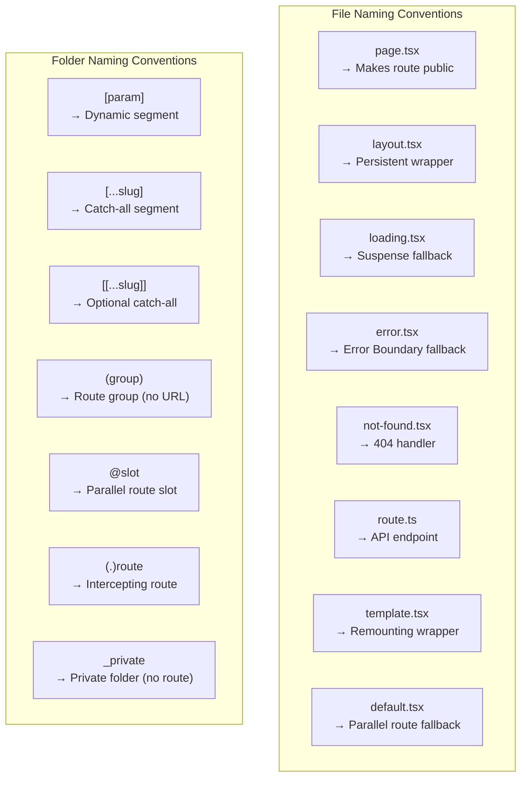
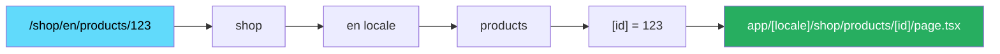

# 41 · File System Routing

> **File system routing is the contract between your directory structure and your application's URL space. In Next.js, every folder in `app/` (or `pages/`) that contains a `page.tsx` becomes a URL segment, special filenames activate specific rendering behaviors, and naming conventions like `[param]`, `[...slug]`, `(..)route`, and `@slot` map to dynamic routes, catch-alls, interceptors, and parallel slots. Understanding how Next.js resolves URLs to files — and what happens when conventions conflict — is essential for building complex routing structures.**

File system routing seems simple at first: create a file, get a route. The deeper you go — parallel routes, intercepting routes, route groups, co-located components, catch-all segments — the more the file system convention reveals itself as a comprehensive routing DSL. This document maps the complete convention system and explains how Next.js processes it.

---

## Table of Contents

- [How Next.js Resolves URLs to Files](#how-nextjs-resolves-urls-to-files)
- [Segment Types and Their Syntax](#segment-types-and-their-syntax)
- [Special Filenames Reference](#special-filenames-reference)
- [Dynamic Segment Matching Rules](#dynamic-segment-matching-rules)
- [Route Groups in Depth](#route-groups-in-depth)
- [Parallel Routes in Depth](#parallel-routes-in-depth)
- [Intercepting Routes in Depth](#intercepting-routes-in-depth)
- [Private Folders](#private-folders)
- [Co-location Patterns](#co-location-patterns)
- [Route Resolution Order and Conflicts](#route-resolution-order-and-conflicts)
- [Middleware Path Matching](#middleware-path-matching)
- [How the Router Builds the Component Tree](#how-the-router-builds-the-component-tree)
- [Architecture Diagrams](#architecture-diagrams)
- [Good Practices](#good-practices)
- [Bad Practices](#bad-practices)
- [Mental Model](#mental-model)
- [Common Misconceptions](#common-misconceptions)
- [Exercises](#exercises)
- [Further Reading](#further-reading)

---

## How Next.js Resolves URLs to Files

When a request arrives at Next.js, the router resolves it through a deterministic process:

```
Incoming URL: /products/123/reviews?sort=recent

Step 1: Split into segments
  ['products', '123', 'reviews']
  Query string is separate: { sort: 'recent' }

Step 2: Match segments to the file tree
  app/
    products/          ← matches 'products'
      [id]/            ← matches '123' (dynamic: params.id = '123')
        reviews/       ← matches 'reviews'
          page.tsx     ← MATCH: this file handles the route

Step 3: Build the layout hierarchy
  app/layout.tsx        → outermost wrapper
  app/products/layout.tsx → wraps products/* routes
  app/products/[id]/layout.tsx → wraps this specific product's routes
  app/products/[id]/reviews/layout.tsx → if exists
  app/products/[id]/reviews/page.tsx → the page content

Step 4: Inject loading/error wrappers
  Suspense boundaries (from loading.tsx files)
  Error Boundaries (from error.tsx files)
  applied at each layout level
```

---

## Segment Types and Their Syntax

### Static segments

```
Folder name   URL segment   Example
─────────────────────────────────────
products      /products     app/products/page.tsx → /products
about         /about        app/about/page.tsx → /about
blog          /blog         app/blog/page.tsx → /blog
```

### Dynamic segments — `[param]`

```
Folder name   Matches              params
─────────────────────────────────────────────────────
[id]          /products/123        { id: '123' }
[slug]        /blog/my-post        { slug: 'my-post' }
[username]    /users/alice         { username: 'alice' }

Note: params are ALWAYS strings — even numeric-looking values
params.id = '123' (string, not number)
```

### Catch-all segments — `[...param]`

```
Folder name    Matches                      params
──────────────────────────────────────────────────────────────────
[...slug]      /docs/a                      { slug: ['a'] }
[...slug]      /docs/a/b                    { slug: ['a', 'b'] }
[...slug]      /docs/a/b/c                  { slug: ['a', 'b', 'c'] }
[...slug]      /docs  (no segments)         → 404 (not matched)
```

### Optional catch-all segments — `[[...param]]`

```
Folder name     Matches                      params
─────────────────────────────────────────────────────────────────────
[[...slug]]     /docs                        { slug: undefined }
[[...slug]]     /docs/a                      { slug: ['a'] }
[[...slug]]     /docs/a/b                    { slug: ['a', 'b'] }

Difference from [...slug]: also matches the base route (no segments)
```

### Route groups — `(name)`

```
Folder name       URL segment    Purpose
────────────────────────────────────────────────────────────
(marketing)       none           Group with no URL impact
(app)             none           Group with different layout
(auth)            none           Authentication-required routes
```

### Parallel routes — `@slot`

```
Folder name    Purpose
──────────────────────────────────────────────────────────
@analytics     Slot named 'analytics' in parent layout
@team          Slot named 'team' in parent layout
@modal         Slot named 'modal' — for modal patterns
```

### Intercepting routes

```
Convention     Matches routes from
──────────────────────────────────────────────────────────────────
(.)route       Same directory level
(..)route      One directory level up
(..)(..)route  Two directory levels up (rare)
(...)route     From the root (app/)
```

---

## Special Filenames Reference

All special filenames in the App Router:

```
Filename          Purpose                          Scope
────────────────────────────────────────────────────────────────────────
page.tsx          Route content (makes URL public) Current segment
layout.tsx        Persistent wrapper               Current + descendants
loading.tsx       Suspense fallback                Current segment
error.tsx         Error Boundary fallback          Current segment
not-found.tsx     404 handler                      Current segment + descendants
template.tsx      Non-persistent wrapper           Current + descendants
default.tsx       Parallel route fallback          Current slot
route.ts          API endpoint                     Current segment

Metadata (not a file, but a convention):
export const metadata = {}
export async function generateMetadata() {}
export async function generateStaticParams() {}
export const dynamic = '...'
export const revalidate = N
export const runtime = '...'
```

### The difference between layout and template

```tsx
// layout.tsx: STATE IS PRESERVED across navigation
// Component instance is never destroyed when navigating within its scope
export default function PersistentLayout({ children }) {
  const [sidebarOpen, setSidebarOpen] = useState(false);
  // sidebarOpen SURVIVES navigation between /dashboard/analytics and /dashboard/users
  return (
    <div>
      <Sidebar open={sidebarOpen} onToggle={setSidebarOpen} />
      {children}
    </div>
  );
}

// template.tsx: RE-MOUNTS on every navigation
// A new instance is created for each navigation
export default function AnimatedTemplate({ children }) {
  // useEffect runs on EVERY navigation to a route using this template
  useEffect(() => {
    // Animate entry
    document.querySelector(".page-content")?.classList.add("animate-in");
  }, []);
  return <div className="page-content">{children}</div>;
}
```

---

## Dynamic Segment Matching Rules

When multiple dynamic routes could match a URL, Next.js uses a specificity order:

```
Priority order (highest to lowest):
1. Static segments        /products/new
2. Dynamic segments       /products/[id]
3. Catch-all segments     /products/[...slug]
4. Optional catch-all     /products/[[...slug]]

URL: /products/new
  Matches: app/products/new/page.tsx (if exists) — STATIC WINS
  Falls to: app/products/[id]/page.tsx — DYNAMIC

URL: /products/123
  Matches: app/products/[id]/page.tsx — DYNAMIC
  (no /products/123/page.tsx exists)

URL: /products/a/b/c
  Matches: app/products/[...slug]/page.tsx — CATCH-ALL
  (no /products/a/b/c/page.tsx, no /products/[id] for multiple segments)

URL: /products (base, no ID)
  Matches: app/products/page.tsx — STATIC
  (catch-all requires at least one segment)
  OR: app/products/[[...slug]]/page.tsx — OPTIONAL CATCH-ALL
  (matches even with no segments)
```

### Params typing

```tsx
// Single dynamic segment:
// app/products/[id]/page.tsx
export default function Page({ params }: { params: { id: string } }) {
  console.log(params.id); // '123' (always string)
}

// Multiple dynamic segments:
// app/[locale]/products/[id]/page.tsx
export default function Page({
  params,
}: {
  params: { locale: string; id: string };
}) {
  console.log(params.locale, params.id); // 'en', '123'
}

// Catch-all:
// app/docs/[...slug]/page.tsx
export default function Page({ params }: { params: { slug: string[] } }) {
  console.log(params.slug); // ['installation', 'getting-started']
}

// Optional catch-all:
// app/docs/[[...slug]]/page.tsx
export default function Page({
  params,
}: {
  params: { slug: string[] | undefined };
}) {
  if (!params.slug) {
    // URL was exactly /docs
  } else {
    // URL was /docs/something (slug = ['something'])
  }
}
```

---

## Route Groups in Depth

Route groups create organizational boundaries without URL impact:

### Pattern 1: Multiple layouts for the same URL prefix

```
app/
  (public)/
    layout.tsx        → Public layout (marketing nav, footer)
    page.tsx          → /  (homepage)
    about/
      page.tsx        → /about
    pricing/
      page.tsx        → /pricing

  (private)/
    layout.tsx        → Private layout (app sidebar, auth check)
    dashboard/
      page.tsx        → /dashboard
    settings/
      page.tsx        → /settings
```

Both `(public)` and `(private)` groups generate routes without the group name in the URL. They have completely separate layouts.

### Pattern 2: Multiple root layouts

```
app/
  (shop)/
    layout.tsx        → <html><body>Shop layout</body></html>
    page.tsx          → /
    products/
      page.tsx        → /products

  (blog)/
    layout.tsx        → <html><body>Blog layout</body></html>
    posts/
      page.tsx        → /posts
```

> ⚠️ When using multiple root layouts: each group needs its own `<html>` and `<body>` tags. There is no shared root `app/layout.tsx` — each group IS the root.

### Pattern 3: Organizing without affecting URLs

```
app/
  (features)/
    product-catalog/
      page.tsx        → /product-catalog
      components/     → No URL — just components
      utils/          → No URL — just utilities
    user-management/
      page.tsx        → /user-management
      components/

  (infrastructure)/
    api/
      route.ts        → /api
```

The route group parentheses make the purpose of the grouping explicit without impacting routing.

---

## Parallel Routes in Depth

Parallel routes render multiple pages simultaneously in a single layout:

### Basic parallel route setup

```
app/
  dashboard/
    layout.tsx        ← receives analytics, team as props
    page.tsx          ← default slot content
    @analytics/
      page.tsx        ← renders in analytics slot
      revenue/
        page.tsx      ← /dashboard/revenue (visible in analytics slot)
    @team/
      page.tsx        ← renders in team slot
      default.tsx     ← fallback when no match (important!)
```

```tsx
// app/dashboard/layout.tsx
export default function DashboardLayout({
  children, // from page.tsx (the default slot)
  analytics, // from @analytics/page.tsx
  team, // from @team/page.tsx
}: {
  children: React.ReactNode;
  analytics: React.ReactNode;
  team: React.ReactNode;
}) {
  return (
    <div className="dashboard-grid">
      <div className="main">{children}</div>
      <div className="analytics-panel">{analytics}</div>
      <div className="team-panel">{team}</div>
    </div>
  );
}
```

### The default.tsx requirement

When navigating to `/dashboard/revenue` (a route inside `@analytics`):

- `@analytics` slot: renders `@analytics/revenue/page.tsx` ✅
- `@team` slot: no `team/revenue/page.tsx` exists — what renders?

Without `@team/default.tsx`: 404 error for the `@team` slot.
With `@team/default.tsx`: renders the default content for `@team`.

```tsx
// app/dashboard/@team/default.tsx
// Shown when no matching route exists for this slot
export default function TeamDefault() {
  return <TeamOverview />; // show overview as fallback
}
```

### Parallel routes for conditional rendering

```tsx
// app/dashboard/layout.tsx
// Parallel routes can be used for conditional rendering based on auth state
export default async function DashboardLayout({
  children,
  admin,
  user,
}: {
  children: React.ReactNode;
  admin: React.ReactNode;
  user: React.ReactNode;
}) {
  const session = await getSession();

  return (
    <div>
      {session?.user.isAdmin ? admin : user}
      {children}
    </div>
  );
}

// app/dashboard/@admin/page.tsx — shown to admins
// app/dashboard/@user/page.tsx — shown to regular users
```

---

## Intercepting Routes in Depth

Intercepting routes catch navigation to a route and show a different component (like a modal) instead of navigating away:

### The notation explained

```
(.)    — intercept from the SAME level (sibling)
(..)   — intercept from ONE level up (parent's siblings)
(..)(..) — intercept from TWO levels up
(...)  — intercept from the root (app directory)
```

### Modal URL pattern implementation

```
app/
  feed/
    page.tsx                    → /feed (the feed page)
    (.)photo/                   → intercepts /photo from /feed level
      [id]/
        page.tsx                → shows photo IN A MODAL on top of /feed

  photo/
    [id]/
      page.tsx                  → /photo/123 (full page when accessed directly)
```

```tsx
// app/feed/page.tsx
// The feed page — includes links to photos
import Link from "next/link";
import PhotoModal from "./photo-modal";

export default function FeedPage() {
  const photos = await fetchFeedPhotos();

  return (
    <>
      {/* Link: when clicked from /feed, intercepted by (.)photo */}
      {photos.map((photo) => (
        <Link key={photo.id} href={`/photo/${photo.id}`}>
          <FeedPhoto photo={photo} />
        </Link>
      ))}

      {/* Slot for the modal — provided by the (.)photo interceptor */}
      {/* This appears when navigating from within /feed */}
    </>
  );
}
```

```tsx
// app/feed/(.)photo/[id]/page.tsx
// This renders as a modal overlay WHEN navigating from /feed
"use client";

export default function PhotoModal({ params }: { params: { id: string } }) {
  const router = useRouter();

  return (
    <dialog open onClose={() => router.back()} className="modal">
      <button onClick={() => router.back()}>×</button>
      {/* Reuse the real photo component */}
      <PhotoContent photoId={params.id} />
    </dialog>
  );
}
```

```tsx
// app/photo/[id]/page.tsx
// This renders as a FULL PAGE when accessing /photo/123 directly
export default function PhotoPage({ params }: { params: { id: string } }) {
  return (
    <div className="photo-full-page">
      <PhotoContent photoId={params.id} />
    </div>
  );
}
```

### Parallel routes + intercepting routes (the complete modal pattern)

For the modal to be accessible from a slot while keeping the feed visible:

```
app/
  feed/
    layout.tsx                  ← has @modal slot
    page.tsx                    → /feed
    @modal/
      (.)photo/
        [id]/
          page.tsx              ← shown in @modal slot (modal on top of feed)
      default.tsx               ← null (no modal by default)
```

```tsx
// app/feed/layout.tsx
export default function FeedLayout({
  children,
  modal, // the @modal slot
}: {
  children: React.ReactNode;
  modal: React.ReactNode;
}) {
  return (
    <>
      {children} {/* The feed — stays visible */}
      {modal} {/* The modal — appears when navigating to a photo */}
    </>
  );
}

// app/feed/@modal/default.tsx
export default function ModalDefault() {
  return null; // No modal by default
}
```

---

## Private Folders

Prefix a folder with `_` to exclude it from routing:

```
app/
  _components/          ← Not a route (underscore prefix)
    Button.tsx
    Modal.tsx
  _lib/                 ← Not a route
    utils.ts
    api.ts
  products/
    page.tsx            → /products (normal route)
```

This is the preferred way to co-locate non-route files within `app/` without them accidentally becoming routes.

---

## Co-location Patterns

You can organize component files directly alongside routes without making them accessible as URLs:

```
app/
  products/
    page.tsx            → /products (only page.tsx is a route)
    ProductCard.tsx     → Not a route (no page.tsx convention)
    ProductList.tsx     → Not a route
    hooks.ts            → Not a route
    types.ts            → Not a route
    [id]/
      page.tsx          → /products/123
      ProductDetail.tsx → Not a route
      EditForm.tsx      → Not a route
```

Only files named with the special conventions (`page.tsx`, `layout.tsx`, `loading.tsx`, etc.) create routes. Any other files are just co-located code.

### Organization strategies

```
Strategy 1: Feature co-location
app/
  products/
    page.tsx
    ProductCard.tsx
    ProductFilters.tsx
    product.types.ts
    product.utils.ts

Strategy 2: Separate components directory
app/
  products/
    page.tsx
  (components)/
    product-card/
      ProductCard.tsx
      ProductCard.test.tsx

Strategy 3: Private folders
app/
  _components/         ← shared components
  _lib/                ← utilities
  products/
    page.tsx
```

---

## Route Resolution Order and Conflicts

### When two routes could match the same URL

```
Scenario: Static vs Dynamic
  app/products/new/page.tsx    → /products/new (static)
  app/products/[id]/page.tsx   → /products/:id (dynamic)

  URL: /products/new
  Resolution: static route wins → app/products/new/page.tsx

Scenario: Dynamic vs Catch-all
  app/products/[id]/page.tsx   → /products/:id (single segment)
  app/products/[...slug]/page.tsx → /products/* (any segments)

  URL: /products/123
  Resolution: dynamic [id] wins (more specific)

  URL: /products/123/reviews
  Resolution: catch-all wins (only one that matches multi-segment)

Scenario: Route group collision (BUG)
  app/(a)/products/page.tsx    → /products
  app/(b)/products/page.tsx    → /products ← CONFLICT

  Both route groups map to the same URL → build error
  Next.js throws: "Route conflict: /products matches multiple pages"
```

### Avoiding conflicts

```
// ❌ Conflict: two pages at the same URL
app/(marketing)/page.tsx   → /
app/(home)/page.tsx         → /

// ✅ Fixed: only one file at each URL
app/(marketing)/page.tsx   → /
app/(home)/about/page.tsx  → /about (different URL)
```

---

## Middleware Path Matching

Middleware runs before routing and can match any path:

```tsx
// middleware.ts
import { NextResponse } from "next/server";
import type { NextRequest } from "next/server";

export function middleware(request: NextRequest) {
  const { pathname } = request.nextUrl;

  // Pattern matching options:
  if (pathname.startsWith("/dashboard")) {
    /* ... */
  }
  if (pathname.match(/^\/api\/v\d+\//)) {
    /* ... */
  }
  if (pathname.includes("/admin")) {
    /* ... */
  }

  return NextResponse.next();
}

// Precise path matching via config.matcher:
export const config = {
  matcher: [
    // Match specific paths:
    "/dashboard/:path*", // /dashboard and all sub-routes

    // Exclude Next.js internals and static files:
    "/((?!_next/static|_next/image|favicon.ico|.*\\.(?:svg|png|jpg|jpeg|gif|webp)$).*)",

    // Complex regex:
    {
      source: "/api/:path*",
      has: [{ type: "header", key: "x-custom-header" }], // only if header present
    },
  ],
};
```

### Middleware vs route handlers

```
Middleware: runs at the edge, before routing
  ✅ URL rewriting, redirects, header injection
  ✅ Auth token validation (via cookies/headers)
  ❌ Cannot access DB (no Node.js APIs in edge runtime)
  ❌ Cannot return complex responses (use route handlers for that)

Route Handler (route.ts): runs in Node.js, handles specific HTTP methods
  ✅ DB access, complex logic
  ✅ Full HTTP request/response control
  ❌ Runs after middleware, not before routing
```

---

## How the Router Builds the Component Tree

When Next.js processes a route, it assembles a component tree from the matched files:

```
URL: /products/123

Matched files (in order from outer to inner):
  1. app/layout.tsx              → RootLayout
  2. app/products/layout.tsx     → ProductsLayout (if exists)
  3. app/products/[id]/layout.tsx → ProductDetailLayout (if exists)
  4. app/products/[id]/page.tsx  → ProductDetailPage (the page)

Loading/Error wrappers inserted at each level:
  3a. app/products/[id]/loading.tsx → Suspense boundary
  3b. app/products/[id]/error.tsx   → Error Boundary

Final render tree:
  RootLayout
    ProductsLayout
      ProductDetailLayout
        ErrorBoundary (from error.tsx)
          Suspense (from loading.tsx)
            ProductDetailPage
```

### The segments array

Next.js internally represents this as a segments array:

```js
// Internal representation for URL /products/123
segments = [
  { type: "layout", file: "app/layout.tsx" },
  { type: "layout", file: "app/products/layout.tsx" },
  {
    type: "leaf",
    file: "app/products/[id]/page.tsx",
    loading: "app/products/[id]/loading.tsx",
    error: "app/products/[id]/error.tsx",
    params: { id: "123" },
  },
];
```

This segments array is computed at the start of each navigation and drives the render cycle.

---

## Architecture Diagrams

### Complete routing convention map



### URL resolution for complex route



---

## Good Practices

### ✅ Good Practice — Use route groups for clear architectural separation

```
/**
 * Good: Route groups express clear architectural intent.
 * The URL structure reflects the product, not the tech organization.
 * Each group has its own layout appropriate to its audience.
 */
app/
  (public)/
    layout.tsx          → Marketing layout (SEO-optimized, no auth)
    page.tsx            → / (landing page)
    pricing/
      page.tsx          → /pricing
    about/
      page.tsx          → /about

  (auth)/
    layout.tsx          → Auth layout (minimal, no nav)
    login/
      page.tsx          → /login
    register/
      page.tsx          → /register
    forgot-password/
      page.tsx          → /forgot-password

  (app)/
    layout.tsx          → App layout (sidebar, auth-required)
    dashboard/
      layout.tsx
      page.tsx          → /dashboard
    projects/
      page.tsx          → /projects
      [id]/
        page.tsx        → /projects/123

  api/
    auth/
      [...nextauth]/
        route.ts        → /api/auth/* (NextAuth)
    webhook/
      route.ts          → /api/webhook
```

**Why this works:** The route groups are self-documenting — reading the directory tells you the app's architecture. Different groups have different layouts, different auth requirements, and different rendering strategies. Adding a new public page, auth page, or app page goes in the obvious location with no configuration.

---

## Bad Practices

### ⚠️ Bad Practice — Deeply nesting layouts unnecessarily

```
/**
 * Bad: Layout nesting that mirrors backend organization, not user journeys.
 * Deep nesting creates unnecessary layout overhead, harder debugging,
 * and awkward persistent UI behavior.
 */
app/
  v2/                            ← Version prefix (now in URL: /v2/...)
    api/
      internal/
        layout.tsx               ← Does this need a layout?
        products/
          categories/
            layout.tsx           ← Another layout just for categories?
            seasonal/
              layout.tsx         ← Another for seasonal?
                featured/
                  page.tsx       → /v2/api/internal/products/categories/seasonal/featured

// ❌ Problems:
// - 5 layouts wrapping a simple page
// - URL is /v2/api/internal/... — the "v2/api/internal" is backend concern, not user-facing
// - Each layout layer adds weight to every request

/**
 * ✅ Fix: Organize around user journeys, not backend structure
 */
app/
  products/                      ← Clean URL: /products
    page.tsx                     → /products (list)
    featured/
      page.tsx                   → /products/featured
    [id]/
      page.tsx                   → /products/123
```

---

## Mental Model

> 💡 **The file system routing mental model:**
>
> Next.js's file system router is like **a city zoning map**. Folders are districts, `page.tsx` files are buildings open to the public, `layout.tsx` files are shared infrastructure (roads, utilities) that persist across the district, `loading.tsx` is a "Pardon Our Dust" sign on a building under construction, and `error.tsx` is a fire escape. Route groups (`(marketing)`, `(app)`) are administrative districts — they organize the map without appearing in the street addresses. Dynamic segments (`[id]`) are address ranges — "1000-9999 Main Street." Catch-alls (`[...slug]`) are annexes — "any address in this zone." Intercepting routes (`(.)photo`) are shortcuts between districts — when you're in district A and click a link to district B, it opens a popup from district B without actually traveling there. The naming conventions are the city's building codes — follow them and the infrastructure works automatically.

---

## Common Misconceptions

### "Any file in app/ is accessible as a route"

Only files named `page.tsx`, `layout.tsx`, `loading.tsx`, `error.tsx`, `not-found.tsx`, `template.tsx`, `default.tsx`, and `route.ts` have special meaning. Any other filename is treated as a co-located component or utility — inaccessible as a URL.

### "Route groups affect the URL"

Parentheses in folder names are completely invisible in the URL. `(marketing)/about/page.tsx` → `/about`, not `/(marketing)/about`. Route groups only affect the file system organization and layout assignment.

### "Catch-all routes match the base route"

`[...slug]` does NOT match `/docs` (no slug). It only matches `/docs/something`. For `[...slug]` to match the base route too, you need `[[...slug]]` (double brackets = optional catch-all).

### "Parallel route slots appear automatically"

Slots only appear if the parent layout explicitly renders them as `{analytics}`, `{team}`, etc. They are named props on the layout component — if the layout doesn't render the prop, the slot content is never shown.

### "Intercepting routes intercept all navigation"

Intercepting routes only activate for client-side navigation from specific locations. Direct URL access (user types the URL in browser, uses browser back/forward, external link, page refresh) bypasses the intercept and loads the actual page file.

---

## Exercises

### Exercise 1 — File tree to URL mapping

For the following file tree, list every URL that the app responds to and what it renders:

```
app/
  layout.tsx
  page.tsx
  (shop)/
    layout.tsx
    products/
      page.tsx
      new/
        page.tsx
      [id]/
        page.tsx
        edit/
          page.tsx
    cart/
      page.tsx
  (blog)/
    posts/
      page.tsx
      [slug]/
        page.tsx
      [...categories]/
        page.tsx
  api/
    products/
      route.ts
      [id]/
        route.ts
```

### Exercise 2 — Build the intercepted modal pattern

Create a photo gallery at `/gallery` where:

- Each photo has its own URL `/photos/[id]`
- Clicking a photo from the gallery shows it in a modal (URL changes but gallery stays visible)
- Direct access to `/photos/[id]` shows a full-page view
- The modal has a close button that returns to the gallery

Test: share the photo URL with a friend — they see the full page, not the modal.

### Exercise 3 — Design a route structure for a SaaS app

Design the file structure for an app with:

- Marketing site (/, /pricing, /features, /about)
- Auth flows (/login, /register, /verify-email)
- App (requires auth, /app/dashboard, /app/projects/[id], /app/settings)
- Admin panel (requires admin role, /admin/users, /admin/billing)
- API routes (/api/webhook, /api/projects/[id])

Requirements:

- Marketing and app have completely different layouts
- Auth pages have minimal layout (no nav)
- Admin panel has its own layout with admin nav
- No URL prefixes except what's natural (/app/_ is fine, /admin/_ is fine)

---

## Further Reading

- [Next.js docs: Routing Fundamentals](https://nextjs.org/docs/app/building-your-application/routing) — Official reference
- [Next.js docs: Dynamic Routes](https://nextjs.org/docs/app/building-your-application/routing/dynamic-routes) — Dynamic segment patterns
- [Next.js docs: Parallel Routes](https://nextjs.org/docs/app/building-your-application/routing/parallel-routes) — Slot architecture
- [Next.js docs: Intercepting Routes](https://nextjs.org/docs/app/building-your-application/routing/intercepting-routes) — Modal URL pattern
- [Next.js docs: Middleware](https://nextjs.org/docs/app/building-your-application/routing/middleware) — Edge middleware
- [Next.js examples: Parallel Routes Modal](https://github.com/vercel/next.js/tree/canary/examples/parallel-routes-and-intercepting-routes-auth-modal) — Reference implementation
- Next in this handbook: [42 · Middleware & Edge Runtime](./05-middleware.md)

---

_Part of the [React + Next.js Engineering Handbook](../../README.md)_
