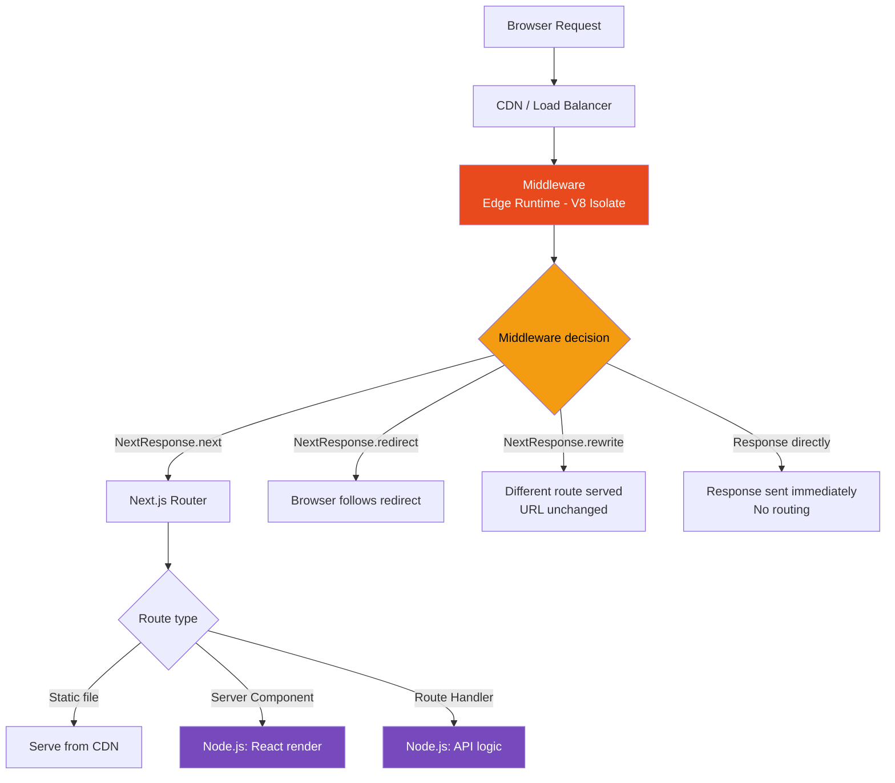
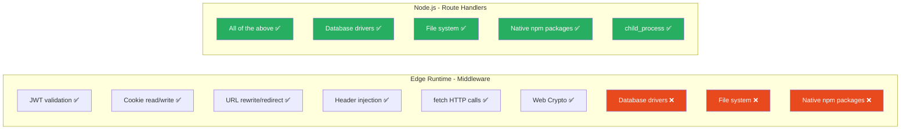

# 42 · Middleware & Edge Runtime

> **Next.js middleware runs before routing on every request — not in Node.js, but in a V8 Isolate at the network edge. This makes it uniquely powerful (runs in milliseconds, globally distributed, before any page logic) and uniquely constrained (no Node.js APIs, limited to a subset of Web APIs). Understanding what middleware can and cannot do, how the Edge Runtime differs from Node.js, and what belongs in middleware versus route handlers is the key to using this layer correctly.**

Middleware is the only place in the Next.js request pipeline that runs on every request before any React rendering, data fetching, or API handling occurs. It is therefore both the ideal place for cross-cutting concerns (auth, localization, A/B testing) and a dangerous place to put slow or incorrect code (it blocks every request).

---

## Table of Contents

- [What Middleware Is and Where It Runs](#what-middleware-is-and-where-it-runs)
- [The Edge Runtime](#the-edge-runtime)
- [Middleware Execution Context](#middleware-execution-context)
- [The NextRequest and NextResponse API](#the-nextrequest-and-nextresponse-api)
- [Path Matching with config.matcher](#path-matching-with-configmatcher)
- [Authentication Patterns](#authentication-patterns)
- [Localization and Routing](#localization-and-routing)
- [A/B Testing and Feature Flags](#ab-testing-and-feature-flags)
- [Header Manipulation](#header-manipulation)
- [Conditional Response: Rewrite vs Redirect vs Response](#conditional-response-rewrite-vs-redirect-vs-response)
- [Rate Limiting at the Edge](#rate-limiting-at-the-edge)
- [Middleware Performance Characteristics](#middleware-performance-characteristics)
- [What Belongs in Middleware vs Route Handlers](#what-belongs-in-middleware-vs-route-handlers)
- [Edge Runtime Limitations in Depth](#edge-runtime-limitations-in-depth)
- [Using Edge Runtime in Route Handlers](#using-edge-runtime-in-route-handlers)
- [Architecture Diagrams](#architecture-diagrams)
- [Good Practices](#good-practices)
- [Bad Practices](#bad-practices)
- [Mental Model](#mental-model)
- [Common Misconceptions](#common-misconceptions)
- [Exercises](#exercises)
- [Further Reading](#further-reading)

---

## What Middleware Is and Where It Runs

Middleware in Next.js is a single function exported from `middleware.ts` at the project root:

```tsx
// middleware.ts (must be at project root, next to app/ or pages/)
import { NextResponse } from "next/server";
import type { NextRequest } from "next/server";

export function middleware(
  request: NextRequest,
): NextResponse | Response | undefined {
  // Runs before EVERY matched request
  // Must return quickly (no slow DB queries)
  return NextResponse.next(); // continue to the page
}

export const config = {
  matcher: "/:path*", // which paths trigger middleware
};
```

Middleware runs in the request pipeline before:

- Route handlers (`route.ts`)
- Server Components (`page.tsx`)
- Static file serving
- Next.js internal routing

```
Browser Request
  ↓
CDN Edge (Vercel, Cloudflare, etc.)
  ↓
Middleware (Edge Runtime — V8 Isolate, NOT Node.js)
  ↓
Next.js Router (matches file system)
  ↓
Route Handler / Server Component / Static File
```

---

## The Edge Runtime

The Edge Runtime is a JavaScript execution environment that is NOT Node.js. It is built on V8 (the same JavaScript engine as Node.js) but without Node.js's standard library:

```
Node.js Runtime:
  V8 engine
  + Node.js standard library (fs, http, path, crypto, net, tls, ...)
  + npm packages that use Node.js APIs
  Startup time: ~100ms (cold start)
  Memory: ~128MB+
  Location: Your server or serverless function

Edge Runtime:
  V8 engine
  + Web APIs (fetch, Request, Response, Headers, URL, TextEncoder, ...)
  + Subset of Web Crypto API
  NO: fs, http, net, tls, path, child_process, ...
  Startup time: <1ms (V8 Isolate — no process startup)
  Memory: ~128KB typical, 4MB max
  Location: Distributed globally (CDN PoPs)
```

The Edge Runtime's tiny startup time is its primary advantage: a Node.js serverless function has a cold start of ~100-500ms. An Edge Runtime V8 Isolate cold starts in <1ms. For middleware that runs on every request, this difference is significant.

### What the Edge Runtime provides

```tsx
// ✅ Available in Edge Runtime:
fetch()                           // HTTP requests
Request, Response, Headers        // Web HTTP APIs
URL, URLSearchParams              // URL parsing
TextEncoder, TextDecoder          // Text encoding
crypto.subtle                     // Web Crypto (encryption, signing)
crypto.randomUUID()               // UUID generation
ReadableStream, WritableStream    // Streaming
AbortController, AbortSignal      // Cancellation
setTimeout, setInterval, clearTimeout
structuredClone()                 // Deep cloning
atob(), btoa()                    // Base64 encoding
queueMicrotask()                  // Microtask scheduling

// ❌ NOT available in Edge Runtime:
import fs from 'fs';               // No file system
import path from 'path';           // No path module
import http from 'http';           // No HTTP server
import net from 'net';             // No networking primitives
import child_process from ...       // No child processes
import { connect } from '@prisma/client'; // No Prisma (uses Node.js APIs)
import { createPool } from 'pg';   // No direct database drivers
// Most npm packages that use Node.js internals will fail
```

---

## Middleware Execution Context

Each middleware invocation runs in its own V8 Isolate context:

```
Request 1 → V8 Isolate (fresh context)
Request 2 → V8 Isolate (fresh context — may be reused or new)
Request 3 → V8 Isolate (fresh context)

There is NO shared state between requests via global variables.
Module-level variables are per-Isolate, not per-process:
```

```tsx
// ❌ This does NOT work as expected in Edge Runtime:
let requestCount = 0; // resets for each Isolate

export function middleware(request: NextRequest) {
  requestCount++; // may always be 1 — no shared state
  return NextResponse.next();
}

// ✅ For shared state across requests: use an external store
// (Redis, KV, database) — but remember this adds latency
```

However, within a single deployment, V8 Isolates can be reused across requests (the "warm" case). Module-level code (like cache initialization) runs once per Isolate lifecycle — but you cannot rely on this for correctness. Design middleware as if every invocation is a fresh context.

---

## The NextRequest and NextResponse API

### NextRequest

`NextRequest` extends the Web `Request` API with Next.js-specific additions:

```tsx
export function middleware(request: NextRequest) {
  // Standard Web Request properties:
  const url = request.url; // Full URL string
  const method = request.method; // 'GET', 'POST', etc.
  const headers = request.headers; // Headers object
  const body = request.body; // ReadableStream (only for POST/PUT/PATCH)

  // Next.js additions:
  const { pathname, search, searchParams } = request.nextUrl;
  // nextUrl: Next.js-enhanced URL with routing awareness

  // Cookie access:
  const token = request.cookies.get("auth-token"); // { name, value }
  const allCookies = request.cookies.getAll(); // { name, value }[]

  // Geo data (Vercel deployment only):
  const country = request.geo?.country; // 'US', 'GB', etc.
  const city = request.geo?.city;
  const region = request.geo?.region;

  // IP address:
  const ip = request.ip; // only on Vercel

  // Next.js internal URL (before rewrites):
  const nextUrl = request.nextUrl.pathname; // e.g., '/en/products' before locale rewrite
}
```

### NextResponse

`NextResponse` extends the Web `Response` API with routing control:

```tsx
// 1. Continue to the next handler (most common)
const response = NextResponse.next();

// 2. Redirect to a different URL
const redirectResponse = NextResponse.redirect(new URL("/login", request.url));
// or:
const redirectResponse = NextResponse.redirect("https://example.com");

// 3. Rewrite the URL (internal — browser URL unchanged)
const rewriteResponse = NextResponse.rewrite(
  new URL("/api/internal", request.url),
);

// 4. Return a response directly (short-circuit the request)
const directResponse = NextResponse.json(
  { error: "Unauthorized" },
  { status: 401 },
);
const directResponse2 = new Response("Not found", { status: 404 });

// Modifying headers on next():
const response = NextResponse.next({
  request: {
    headers: new Headers(request.headers), // modify request headers
  },
});
response.headers.set("X-Custom-Header", "value"); // modify response headers

// Modifying cookies:
response.cookies.set("session", "token-value", {
  httpOnly: true,
  secure: process.env.NODE_ENV === "production",
  sameSite: "strict",
  maxAge: 60 * 60 * 24 * 7, // 1 week in seconds
});
response.cookies.delete("old-cookie");
```

---

## Path Matching with config.matcher

The `matcher` config controls which paths trigger middleware. This is evaluated before middleware runs — non-matching paths bypass middleware entirely:

```tsx
export const config = {
  matcher: [
    // String patterns:
    "/dashboard", // exact path
    "/dashboard/:path*", // /dashboard and all sub-paths

    // Exclusion patterns:
    "/((?!_next/static|_next/image|favicon.ico).*)", // exclude Next.js internals

    // Complex regex (object syntax):
    {
      source: "/api/:path*",
      has: [
        { type: "header", key: "x-auth-token" }, // only if header exists
        // type options: 'header', 'cookie', 'host', 'query'
      ],
      missing: [
        { type: "header", key: "x-no-middleware" }, // only if header missing
      ],
    },
  ],
};
```

### The exclusion pattern explained

The most common middleware matcher excludes Next.js internal paths:

```tsx
export const config = {
  matcher: [
    /*
     * Match all request paths EXCEPT:
     * - _next/static (static files)
     * - _next/image (image optimization files)
     * - favicon.ico (favicon file)
     * - Files with extensions (images, fonts, etc.)
     */
    "/((?!_next/static|_next/image|favicon.ico|.*\\.(?:svg|png|jpg|jpeg|gif|webp)$).*)",
  ],
};
```

This negative lookahead regex matches everything that does NOT start with `_next/static`, `_next/image`, `favicon.ico`, or any path ending with a common static file extension.

Without this exclusion, middleware runs on EVERY request including Next.js's own static asset serving — adding latency to file downloads unnecessarily.

---

## Authentication Patterns

Auth in middleware is limited to what can be done without DB access: JWT validation, session cookie verification:

```tsx
// middleware.ts — JWT-based auth
import { NextResponse } from "next/server";
import type { NextRequest } from "next/server";
import { jwtVerify } from "jose"; // 'jose' is Edge-compatible (no Node.js deps)

const JWT_SECRET = new TextEncoder().encode(process.env.JWT_SECRET!);

const protectedPaths = ["/dashboard", "/settings", "/admin"];

export async function middleware(request: NextRequest) {
  const { pathname } = request.nextUrl;

  // Check if this route needs protection
  const isProtected = protectedPaths.some((path) => pathname.startsWith(path));
  if (!isProtected) return NextResponse.next();

  // Verify JWT from cookie
  const token = request.cookies.get("auth-token")?.value;

  if (!token) {
    // No token: redirect to login with return URL
    const loginUrl = new URL("/login", request.url);
    loginUrl.searchParams.set("callbackUrl", pathname);
    return NextResponse.redirect(loginUrl);
  }

  try {
    const { payload } = await jwtVerify(token, JWT_SECRET);

    // Token valid: attach user info to request headers for downstream use
    const response = NextResponse.next({
      request: {
        headers: new Headers({
          ...Object.fromEntries(request.headers.entries()),
          "x-user-id": payload.sub as string,
          "x-user-role": payload.role as string,
        }),
      },
    });

    return response;
  } catch (error) {
    // Token invalid or expired: redirect to login
    const loginUrl = new URL("/login", request.url);
    loginUrl.searchParams.set("callbackUrl", pathname);
    const response = NextResponse.redirect(loginUrl);
    response.cookies.delete("auth-token"); // clear invalid cookie
    return response;
  }
}

export const config = {
  matcher: ["/dashboard/:path*", "/settings/:path*", "/admin/:path*"],
};
```

### Reading middleware-set headers in server components

```tsx
// app/dashboard/page.tsx
import { headers } from "next/headers";

async function DashboardPage() {
  const headersList = headers();
  const userId = headersList.get("x-user-id"); // set by middleware
  const userRole = headersList.get("x-user-role"); // set by middleware

  // Use these values without re-validating the token
  return <Dashboard userId={userId} role={userRole} />;
}
```

---

## Localization and Routing

Middleware is the standard place to handle locale detection and routing:

```tsx
// middleware.ts — Locale detection and routing
import { NextResponse } from "next/server";
import type { NextRequest } from "next/server";
import Negotiator from "negotiator"; // Edge-compatible
import { match } from "@formatjs/intl-localematcher"; // Edge-compatible

const locales = ["en", "fr", "de", "es", "ja"];
const defaultLocale = "en";

function getLocale(request: NextRequest): string {
  // Priority 1: URL segment (/fr/about → 'fr')
  const urlLocale = request.nextUrl.pathname.split("/")[1];
  if (locales.includes(urlLocale)) return urlLocale;

  // Priority 2: Cookie preference
  const cookieLocale = request.cookies.get("locale")?.value;
  if (cookieLocale && locales.includes(cookieLocale)) return cookieLocale;

  // Priority 3: Accept-Language header
  const negotiator = new Negotiator({
    headers: Object.fromEntries(request.headers.entries()),
  });
  const languages = negotiator.languages();
  return match(languages, locales, defaultLocale);
}

export function middleware(request: NextRequest) {
  const { pathname } = request.nextUrl;

  // Skip if path already has a locale prefix
  const pathnameHasLocale = locales.some(
    (locale) => pathname.startsWith(`/${locale}/`) || pathname === `/${locale}`,
  );

  if (pathnameHasLocale) return NextResponse.next();

  // Redirect to locale-prefixed URL
  const locale = getLocale(request);
  const newUrl = new URL(`/${locale}${pathname}`, request.url);
  newUrl.search = request.nextUrl.search; // preserve query string

  return NextResponse.redirect(newUrl);
}

export const config = {
  matcher: ["/((?!_next|api|.*\\..*).*)"],
};
```

---

## A/B Testing and Feature Flags

Middleware can assign users to experiments and route them accordingly:

```tsx
// middleware.ts — A/B testing
import { NextResponse } from "next/server";
import type { NextRequest } from "next/server";

export function middleware(request: NextRequest) {
  // Stable assignment: use session ID or user ID for consistency
  let experimentGroup = request.cookies.get("ab-group")?.value;

  if (!experimentGroup) {
    // First visit: randomly assign
    experimentGroup = Math.random() < 0.5 ? "control" : "variant";
  }

  const response = NextResponse.next({
    request: {
      headers: new Headers({
        ...Object.fromEntries(request.headers.entries()),
        "x-ab-group": experimentGroup, // pass to server components
      }),
    },
  });

  // Persist the assignment
  response.cookies.set("ab-group", experimentGroup, {
    maxAge: 60 * 60 * 24 * 30, // 30 days
    httpOnly: true,
    sameSite: "strict",
  });

  // Rewrite to variant page if in variant group
  if (experimentGroup === "variant" && request.nextUrl.pathname === "/") {
    const url = request.nextUrl.clone();
    url.pathname = "/home-variant"; // different page file
    return NextResponse.rewrite(url);
  }

  return response;
}
```

### Feature flags via URL rewrite

```tsx
// Serve different implementations based on feature flags
// without the client knowing a different URL was used:
export function middleware(request: NextRequest) {
  const userId = request.cookies.get("user-id")?.value;
  const isInBeta = betaUsers.has(userId); // pre-computed set

  if (isInBeta && request.nextUrl.pathname === "/checkout") {
    // Internally serve /checkout-v2 but URL remains /checkout
    return NextResponse.rewrite(new URL("/checkout-v2", request.url));
  }

  return NextResponse.next();
}
```

---

## Header Manipulation

Middleware can read, add, and modify both request headers (going to the server) and response headers (going to the browser):

```tsx
// middleware.ts — Security headers + request enhancement
export function middleware(request: NextRequest) {
  // ─── Build enhanced request headers ─────────────────────────────────
  const requestHeaders = new Headers(request.headers);

  // Add request ID for distributed tracing
  requestHeaders.set("x-request-id", crypto.randomUUID());

  // Add timing marker
  requestHeaders.set("x-request-start", Date.now().toString());

  // Forward geo info from edge to server
  if (request.geo) {
    requestHeaders.set("x-user-country", request.geo.country ?? "");
    requestHeaders.set("x-user-city", request.geo.city ?? "");
  }

  // ─── Create response ──────────────────────────────────────────────────
  const response = NextResponse.next({
    request: { headers: requestHeaders },
  });

  // ─── Add security response headers ────────────────────────────────────
  response.headers.set("X-Frame-Options", "DENY");
  response.headers.set("X-Content-Type-Options", "nosniff");
  response.headers.set("Referrer-Policy", "strict-origin-when-cross-origin");
  response.headers.set(
    "Strict-Transport-Security",
    "max-age=31536000; includeSubDomains",
  );
  response.headers.set(
    "Content-Security-Policy",
    [
      "default-src 'self'",
      "script-src 'self' 'unsafe-inline' https://cdn.example.com",
      "style-src 'self' 'unsafe-inline'",
      "img-src 'self' data: https:",
      "connect-src 'self' https://api.example.com",
    ].join("; "),
  );

  return response;
}
```

---

## Conditional Response: Rewrite vs Redirect vs Response

The three ways middleware can alter a request flow:

### NextResponse.redirect — Change the URL

```tsx
// Browser URL changes to the new URL
// Use for: auth redirects, permanent redirects, locale redirects

// Temporary redirect (307 — method preserved):
return NextResponse.redirect(new URL("/login", request.url));

// Permanent redirect (308 — method preserved):
return NextResponse.redirect(new URL("/new-url", request.url), {
  status: 308,
});

// The user SEES the new URL in their browser
// Search engines treat 308 as a permanent move
```

### NextResponse.rewrite — Change the server destination

```tsx
// Browser URL stays the same — but different file serves the response
// Use for: A/B testing, geo-routing, feature flags

return NextResponse.rewrite(new URL("/internal-page", request.url));
// User sees /original-url in browser
// Server renders /internal-page

// Common use: serve maintenance page without URL change
if (maintenanceMode) {
  return NextResponse.rewrite(new URL("/maintenance", request.url));
}
```

### Response directly — Short-circuit

```tsx
// Return a response immediately — no routing happens
// Use for: rate limiting, authentication failures, robots.txt

// Block bots:
if (request.headers.get("user-agent")?.includes("BadBot")) {
  return new Response("Forbidden", { status: 403 });
}

// Rate limit exceeded:
return NextResponse.json(
  { error: "Rate limit exceeded" },
  {
    status: 429,
    headers: { "Retry-After": "60" },
  },
);

// robots.txt (serve from middleware, not a file):
if (request.nextUrl.pathname === "/robots.txt") {
  return new Response("User-agent: *\nDisallow: /api/\nDisallow: /admin/", {
    headers: { "Content-Type": "text/plain" },
  });
}
```

---

## Rate Limiting at the Edge

Implementing rate limiting in middleware requires an external store (no in-memory state between requests):

```tsx
// middleware.ts — Rate limiting with Upstash Redis (Edge-compatible)
import { Ratelimit } from "@upstash/ratelimit";
import { Redis } from "@upstash/redis";

const ratelimit = new Ratelimit({
  redis: Redis.fromEnv(),
  limiter: Ratelimit.slidingWindow(10, "10 s"), // 10 requests per 10 seconds
});

export async function middleware(request: NextRequest) {
  // Only rate limit API routes
  if (!request.nextUrl.pathname.startsWith("/api")) {
    return NextResponse.next();
  }

  // Identify the requester (IP address or user ID)
  const identifier = request.ip ?? "anonymous";

  const { success, limit, remaining, reset } =
    await ratelimit.limit(identifier);

  if (!success) {
    return NextResponse.json(
      { error: "Rate limit exceeded" },
      {
        status: 429,
        headers: {
          "X-RateLimit-Limit": limit.toString(),
          "X-RateLimit-Remaining": remaining.toString(),
          "X-RateLimit-Reset": reset.toString(),
          "Retry-After": Math.ceil((reset - Date.now()) / 1000).toString(),
        },
      },
    );
  }

  const response = NextResponse.next();
  response.headers.set("X-RateLimit-Limit", limit.toString());
  response.headers.set("X-RateLimit-Remaining", remaining.toString());
  return response;
}
```

> ⚠️ Rate limiting in middleware requires an external store (Redis, KV, etc.). This adds latency to every request. Measure carefully — if rate limiting adds 20ms and your page loads in 50ms, you've added 40% to your response time.

---

## Middleware Performance Characteristics

Middleware has a unique performance profile:

```
Execution location:
  - On Vercel: at the CDN edge, geographically close to the user
  - Self-hosted: on your server (same latency as any server operation)
  - Cloudflare: on Cloudflare's edge network (150+ PoPs)

Latency impact:
  - Pure CPU work (JWT validation): <1ms
  - External network call (Redis, DB): +20-100ms
  - Complex regex matching: <1ms

Cold start:
  - V8 Isolate: <1ms (no process startup)
  - Compare: Node.js function: 100-500ms cold start

Memory:
  - Limit: 4MB (Vercel), 128MB (typical Node.js function)
  - Imports must be small — tree-shake aggressively

Concurrent request handling:
  - Multiple V8 Isolates run in parallel
  - No shared memory between isolates (thread-safe by design)
```

### Middleware performance budget

```
Total request budget: 200ms (for good Time to First Byte)

Breakdown:
  Network latency: 20-50ms (client to edge)
  Middleware: 1-10ms (target)
  Routing + page rendering: 50-150ms
  Network return: 20-50ms

If middleware exceeds ~20ms: measurable impact on TTFB
If middleware exceeds ~50ms: perceptible to users

Rule: Middleware should never make slow network calls on every request
```

---

## What Belongs in Middleware vs Route Handlers

The division of responsibility:

### Put in Middleware

```tsx
// ✅ Authentication token validation (JWT verify — CPU only)
// ✅ Cookie reading and modification
// ✅ URL rewriting and redirecting
// ✅ Security header injection
// ✅ Locale detection and routing
// ✅ Request ID / tracing header injection
// ✅ Simple A/B test assignment (from cookie or random)
// ✅ Bot detection (User-Agent parsing)
// ✅ Geolocation-based routing (from request.geo)
// ✅ Rate limiting (with Edge-compatible Redis)
// ✅ CORS preflight handling
```

### Put in Route Handlers or Server Components

```tsx
// ❌ Database queries (no Node.js DB drivers at edge)
// ❌ Complex business logic
// ❌ File system operations
// ❌ OAuth flow (too many redirects/callbacks)
// ❌ Email sending
// ❌ Image processing
// ❌ Session lookup from a Node.js session store
// ❌ Anything requiring npm packages with Node.js dependencies
```

---

## Edge Runtime Limitations in Depth

Understanding WHY certain things are unavailable helps predict what will fail:

### No file system

```tsx
// ❌ Fails in Edge Runtime:
import fs from "fs";
const file = fs.readFileSync("./data.json");
// V8 Isolates have no access to the file system — they're sandboxed

// ✅ Alternative: import the data as a module
import data from "./data.json";
// JSON imports work — bundled at build time
```

### No native modules

```tsx
// ❌ Fails: bcrypt uses native binary (.node file)
import bcrypt from "bcrypt";
// V8 Isolates cannot load .node native binaries

// ✅ Alternative: pure-JavaScript crypto
import { hash, verify } from "@node-rs/bcrypt"; // Web Crypto based
// or use: bcryptjs (pure JS implementation, slower but works at edge)
```

### No database drivers

```tsx
// ❌ Fails: Prisma uses Node.js native bindings
import { PrismaClient } from "@prisma/client";
// Prisma's query engine is a Rust binary — cannot run in V8 Isolate

// ✅ Alternative: Prisma Accelerate (HTTP-based, Edge-compatible)
// or: Neon serverless driver (HTTP-based)
// or: PlanetScale serverless driver
// or: Upstash (Redis, HTTP-based)

import { neon } from "@neondatabase/serverless";
const sql = neon(process.env.DATABASE_URL!);
const users = await sql`SELECT * FROM users`; // Edge-compatible
```

### Limited environment size

```tsx
// Middleware bundle must be small (< 1MB for most edge providers)
// Large imports fail silently or with size errors

// ❌ Bad: importing a large library
import _ from "lodash"; // 69KB — too large for edge, use individual functions

// ✅ Good: import only what you need
import { pick } from "lodash-es"; // tree-shakeable

// ✅ Better: use native JS for simple operations
const picked = Object.fromEntries(["id", "name"].map((k) => [k, obj[k]]));
```

---

## Using Edge Runtime in Route Handlers

Route handlers can opt into the Edge Runtime, not just middleware:

```tsx
// app/api/fast/route.ts
// Run this API route at the edge (globally distributed)
export const runtime = "edge";

export async function GET(request: Request) {
  const data = {
    region: process.env.VERCEL_REGION ?? "local",
    timestamp: new Date().toISOString(),
  };

  return Response.json(data);
}
```

### Edge route handler vs Node.js route handler

```
Edge Route Handler (runtime = 'edge'):
  + Globally distributed (runs near users)
  + Fast cold starts (<1ms)
  + Same V8 Isolate limitations as middleware
  - No database drivers, no native modules
  Use for: geolocation APIs, CDN-like functionality, JWT validation APIs

Node.js Route Handler (default):
  + Full Node.js APIs
  + Database drivers work
  + npm packages with native modules work
  - Single-region deployment
  - Slower cold starts
  Use for: database operations, file processing, heavy computation
```

---

## Architecture Diagrams

### Middleware in the request pipeline



### Middleware capabilities vs route handlers



---

## Good Practices

### ✅ Good Practice — Lightweight JWT auth with header forwarding

```tsx
/**
 * Good: Middleware validates the JWT (CPU only — no DB),
 * extracts user claims, and forwards them as headers.
 * Server Components read the headers without re-validating.
 * Fast (< 2ms), no external calls, globally distributed.
 */
import { SignJWT, jwtVerify } from "jose";

const secret = new TextEncoder().encode(process.env.JWT_SECRET);

export async function middleware(request: NextRequest) {
  // Only protect specific paths
  if (!request.nextUrl.pathname.startsWith("/app")) {
    return NextResponse.next();
  }

  const token = request.cookies.get("session")?.value;

  if (!token) {
    const url = request.nextUrl.clone();
    url.pathname = "/login";
    url.searchParams.set("next", request.nextUrl.pathname);
    return NextResponse.redirect(url);
  }

  try {
    // JWT verification: pure crypto — <1ms, no network calls
    const { payload } = await jwtVerify(token, secret);

    // Forward verified claims to server components
    const requestHeaders = new Headers(request.headers);
    requestHeaders.set("x-user-id", payload.sub!);
    requestHeaders.set("x-user-email", payload.email as string);
    requestHeaders.set("x-user-role", payload.role as string);

    return NextResponse.next({ request: { headers: requestHeaders } });
  } catch {
    // JWT invalid or expired
    const url = request.nextUrl.clone();
    url.pathname = "/login";
    const res = NextResponse.redirect(url);
    res.cookies.delete("session");
    return res;
  }
}

export const config = {
  matcher: ["/app/:path*"],
};
```

**Why this works:** JWT verification is pure cryptography — no network calls, <1ms per request. The verified user identity is forwarded as request headers. Server components read those headers to get the user identity without any additional auth checks. This architecture is: secure (JWT is verified at the edge), fast (no DB calls in middleware), scalable (globally distributed).

---

## Bad Practices

### ⚠️ Bad Practice — Database queries in middleware

```tsx
/**
 * Bad: Database query in middleware.
 * 1. Database drivers (Prisma, pg) don't work in Edge Runtime — this will error
 * 2. Even with an Edge-compatible driver: adds 20-100ms to EVERY request
 * 3. Creates a bottleneck: the DB becomes the bottleneck for all traffic
 * 4. Scale problem: DB connections limited; middleware runs on every request
 */

// ❌ This fails at runtime (Prisma doesn't work in Edge Runtime):
import { prisma } from "@/lib/prisma";

export async function middleware(request: NextRequest) {
  const token = request.cookies.get("session")?.value;
  if (!token) return NextResponse.redirect(new URL("/login", request.url));

  // ❌ Database query in middleware:
  // 1. Will throw "PrismaClientInitializationError" (Edge Runtime incompatible)
  // 2. Even if it worked: adds DB latency to EVERY page request
  const session = await prisma.session.findUnique({ where: { token } });
  if (!session || session.expiresAt < new Date()) {
    return NextResponse.redirect(new URL("/login", request.url));
  }

  return NextResponse.next();
}

/**
 * ✅ Correct approach: Stateless JWT (no DB lookup needed)
 * OR: Check session cookie validity in server component (not middleware)
 */

// Option 1: JWT (preferred — fully stateless)
// JWT contains all needed claims, signed and verified cryptographically
// No DB lookup needed — the JWT IS the session

// Option 2: Minimal middleware + server-side session check
export async function middleware(request: NextRequest) {
  const token = request.cookies.get("session")?.value;
  if (!token) return NextResponse.redirect(new URL("/login", request.url));
  // Just check if cookie exists — don't validate against DB
  // Server components will do the full session validation
  return NextResponse.next();
}

// Then in app/app/layout.tsx (Server Component):
async function AppLayout({ children }) {
  const session = await getSession(); // full DB-backed session check (in Node.js)
  if (!session) redirect("/login");
  return <AppShell session={session}>{children}</AppShell>;
}
```

**Production impact:** A team implemented middleware with database session lookups. With 1,000 concurrent users, they had 1,000 simultaneous DB connections from middleware (one per request). Their database connection pool was exhausted, causing connection timeout errors for legitimate requests. API response times went from 50ms to 5,000ms under load. The fix: move session validation to server components (which have proper connection pooling) and use JWT validation in middleware.

---

## Mental Model

> 💡 **The middleware mental model:**
>
> Middleware is the **nightclub bouncer** of your Next.js application. The bouncer stands outside the club (at the edge, before the main building — your Node.js server). They can check IDs (verify JWTs), look up names on the guest list (check cookies), redirect people to different lines (URL rewrites), or turn people away entirely (auth redirects). What the bouncer CANNOT do: go into the bar to check the reservation system database (no DB access), prepare complex drinks (no heavy computation), or use power tools (no Node.js native modules). The bouncer makes a quick decision based on what they can see right now — and fast. If the bouncer starts making phone calls to verify every ID with a central server, the line backs up and nobody gets in efficiently. The bouncer works best when the decision is immediate: either you're on the list (valid JWT) or you're not.

---

## Common Misconceptions

### "Middleware runs in Node.js"

Middleware runs in the Edge Runtime (V8 Isolate), not Node.js. This is why Node.js APIs (fs, path, child_process) and many npm packages are unavailable. The Edge Runtime is a different JavaScript environment, deliberately constrained for performance and portability.

### "Middleware is the right place for complex auth"

Middleware is ideal for token validation (JWT verify — pure crypto). Complex auth (loading user roles from DB, checking permissions against business rules) belongs in Server Components or Route Handlers which have full Node.js access and proper DB connection pooling.

### "config.matcher is optional"

Without `config.matcher`, middleware runs on ALL requests including `_next/static`, `_next/image`, and other internal Next.js paths. This wastes resources and can cause subtle bugs. Always configure a matcher that excludes Next.js internals.

### "Middleware can share state with Server Components via globals"

Middleware and Server Components run in different processes (or at least different Isolates). You cannot share state via global variables. Communication happens through request/response headers, cookies, or external stores (Redis, etc.).

### "The Edge Runtime will become the default for everything"

The Edge Runtime is a deliberate tradeoff — less capability for better latency and distribution. Node.js will remain the default runtime for most Next.js code because most applications need database access and full Node.js APIs.

---

## Exercises

### Exercise 1 — Implement locale routing

Build middleware that:

1. Detects preferred locale from `Accept-Language` header
2. Checks for a `NEXT_LOCALE` cookie override
3. Redirects `/products` to `/en/products` (or `/fr/products`, etc.)
4. Does NOT redirect if URL already has a locale prefix
5. Does NOT redirect `_next/*` or `api/*` paths

Test with different Accept-Language headers and cookie values.

### Exercise 2 — Measure middleware latency impact

```tsx
// Add timing to middleware:
export function middleware(request: NextRequest) {
  const start = Date.now();

  // Your middleware logic here

  const response = NextResponse.next();
  response.headers.set("X-Middleware-Duration", `${Date.now() - start}ms`);
  return response;
}
```

Build two versions:

1. Middleware with pure JWT validation
2. Middleware with an external Redis call (use Upstash free tier)

Measure the latency of each in the `X-Middleware-Duration` header. At what point does Redis latency make middleware unacceptably slow?

### Exercise 3 — Build a feature flag system

```tsx
// Design a feature flag system where:
// 1. Flags are stored in an Edge-compatible KV store (Vercel KV or Upstash)
// 2. Middleware reads flags and rewrites URLs for enabled features
//    /checkout → /checkout-v2 if flag 'new-checkout' is enabled
// 3. Flags can be per-user (based on user ID cookie) or global
// 4. Admin can toggle flags without redeployment
// 5. Middleware doesn't add more than 5ms latency

// Bonus: implement flag caching so KV isn't called on every request
// (cache in middleware module scope with TTL)
```

---

## Further Reading

- [Next.js docs: Middleware](https://nextjs.org/docs/app/building-your-application/routing/middleware) — Official reference
- [Next.js docs: Edge Runtime](https://nextjs.org/docs/app/building-your-application/rendering/edge-and-nodejs-runtimes) — Runtime comparison
- [Vercel: Edge Middleware](https://vercel.com/docs/functions/edge-middleware) — Deployment specifics
- [jose library](https://github.com/panva/jose) — Edge-compatible JWT library
- [Upstash Ratelimit](https://github.com/upstash/ratelimit) — Edge-compatible rate limiting
- [Neon Serverless Driver](https://github.com/neondatabase/serverless) — Edge-compatible Postgres
- Next in this handbook: [43 · Data Fetching Patterns](./06-data-fetching.md)

---

_Part of the [React + Next.js Engineering Handbook](../../README.md)_
