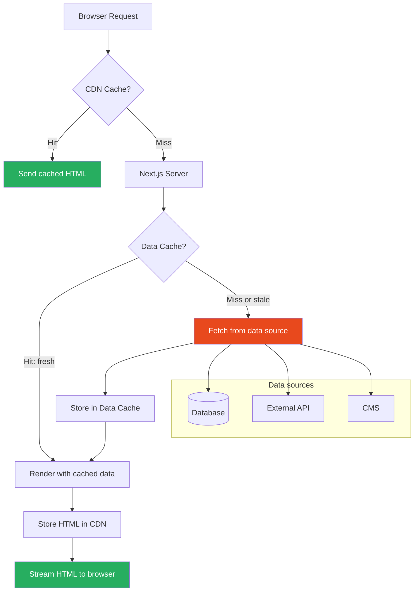
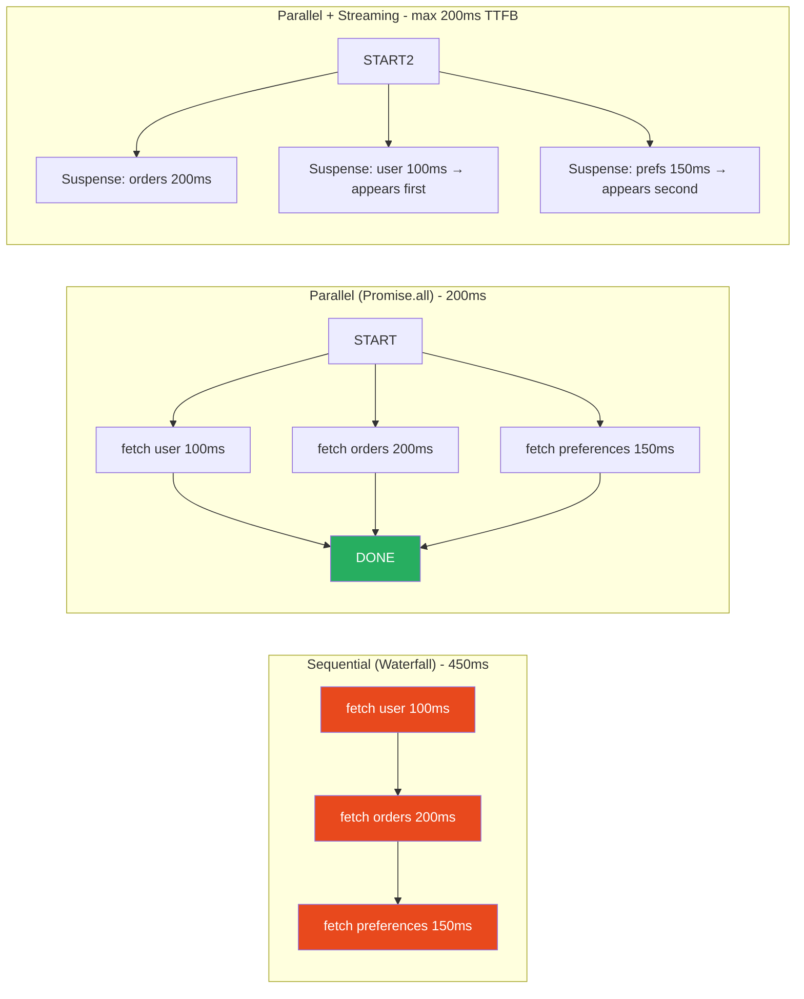

# 43 · Data Fetching Patterns

> **Data fetching in Next.js is not a single API — it is a spectrum of strategies, each with different performance characteristics, caching semantics, and architectural implications. At one end: fetch at build time, serve static HTML forever. At the other: fetch on every request, always fresh. In between: revalidation windows, on-demand invalidation, parallel fetching, streaming, and optimistic updates. Choosing the right strategy for each piece of data — not for the page as a whole — is the craft of Next.js data architecture.**

The most common mistake in Next.js data fetching is treating the page as the unit of analysis. In reality, different components on the same page often need different caching strategies: the user's profile might be cached for 5 minutes, the product catalog for 1 hour, the hero banner indefinitely, and the shopping cart never. The App Router's component-level data fetching model makes this natural — when you understand it deeply.

---

## Table of Contents

- [The Data Fetching Spectrum](#the-data-fetching-spectrum)
- [Static Data: Cache Forever](#static-data-cache-forever)
- [Revalidating Data: Cache with TTL](#revalidating-data-cache-with-ttl)
- [Dynamic Data: No Cache](#dynamic-data-no-cache)
- [On-Demand Revalidation](#on-demand-revalidation)
- [Parallel Data Fetching](#parallel-data-fetching)
- [Sequential Data Fetching](#sequential-data-fetching)
- [Request Memoization](#request-memoization)
- [Streaming Data with Suspense](#streaming-data-with-suspense)
- [Client-Side Data Fetching Patterns](#client-side-data-fetching-patterns)
- [The Fetch Extension](#the-fetch-extension)
- [Server Actions as Mutations](#server-actions-as-mutations)
- [Data Fetching and Authentication](#data-fetching-and-authentication)
- [Error Handling in Data Fetching](#error-handling-in-data-fetching)
- [Data Fetching Libraries vs Direct Fetch](#data-fetching-libraries-vs-direct-fetch)
- [Architecture Diagrams](#architecture-diagrams)
- [Good Practices](#good-practices)
- [Bad Practices](#bad-practices)
- [Mental Model](#mental-model)
- [Common Misconceptions](#common-misconceptions)
- [Exercises](#exercises)
- [Further Reading](#further-reading)

---

## The Data Fetching Spectrum

```
STATIC                                                    DYNAMIC
───────────────────────────────────────────────────────────────────
Build   ISR      ISR       ISR      SSR        SSR
time    24h      1h        60s      cached     uncached
│       │        │         │        │           │
│       │        │         │        │           │
Always  Very     Periodic  Frequent Per-request Per-request
cached  stable   update    update   some cache  no cache
│       │        │         │        │           │
Cost:   Cost:    Cost:     Cost:    Cost:       Cost:
Zero    Minimal  Low       Medium   Moderate    High (per req)

Examples:
About   Blog     Product   News     Dashboard   Cart
page    posts    catalog   feed     metrics     data
```

Each column represents a different `revalidate` value:

- Build time → `revalidate = false` (or no fetch)
- ISR 24h → `revalidate = 86400`
- ISR 1h → `revalidate = 3600`
- ISR 60s → `revalidate = 60`
- SSR cached → `cache: 'force-cache'` with manual revalidation
- SSR uncached → `cache: 'no-store'`

---

## Static Data: Cache Forever

For data that never changes (or changes only on deployment):

```tsx
// app/about/page.tsx — Content from a CMS, updated on deploy
async function AboutPage() {
  // fetch() default: cached indefinitely (static)
  const content = await fetch("https://cms.example.com/api/about").then((r) =>
    r.json(),
  );
  // Cached at build time, served from cache on every request
  return <AboutContent content={content} />;
}

// Explicit: same as default
const content = await fetch("https://cms.example.com/api/about", {
  cache: "force-cache",
}).then((r) => r.json());

// For data from imports/modules (doesn't need fetch at all):
import { teamMembers } from "./team-data"; // static import
```

### When to use static caching

```
✅ Marketing copy (About Us, Privacy Policy, Terms)
✅ Navigation structure (unlikely to change between deploys)
✅ Product catalog structure (categories, attribute definitions)
✅ Content from a CMS that's published rarely
✅ Documentation pages

Rule: If data can be stale for hours or days without user impact → static
```

---

## Revalidating Data: Cache with TTL

For data that changes periodically but doesn't need to be real-time:

```tsx
// app/products/page.tsx
async function ProductsPage() {
  // Revalidate every 60 seconds (ISR equivalent in App Router)
  const products = await fetch("https://api.example.com/products", {
    next: { revalidate: 60 },
  }).then((r) => r.json());

  return <ProductGrid products={products} />;
}

// Alternative: route segment config (applies to ALL fetches in this route)
export const revalidate = 60; // at the page level

// Per-component revalidation with different TTLs:
async function HeroSection() {
  const hero = await fetch("/api/hero", { next: { revalidate: 3600 } }); // 1 hour
  // ...
}

async function NewArrivals() {
  const items = await fetch("/api/new-arrivals", { next: { revalidate: 300 } }); // 5 min
  // ...
}
```

### Choosing a revalidate value

```
Data type                Suggested revalidate
────────────────────────────────────────────────────────
Product prices           60-300s (1-5 min)
Blog post content        3600s (1h) or longer
News feed headlines      30-60s
User profile (public)    300s (5 min)
Sports scores            10-30s
Stock prices             real-time (no cache)
Weather                  600s (10 min)
E-commerce inventory     30-60s (or on-demand)
```

### Stale-While-Revalidate behavior

```
Request at t=0:
  → Cache miss → fetch data → cache it (TTL = 60s)
  → Response in: fetch latency (e.g., 200ms)

Request at t=30s:
  → Cache hit (fresh) → serve cached data
  → Response in: <1ms

Request at t=65s:
  → Cache stale (>60s old)
  → Serve stale data IMMEDIATELY (fast response)
  → Trigger background refresh
  → Response in: <1ms

Request at t=70s (after background refresh):
  → Cache hit with fresh data
  → Response in: <1ms
```

The user at t=65s gets a slightly stale response (5 seconds stale) but gets it immediately. The next request gets fresh data.

---

## Dynamic Data: No Cache

For data that must be fresh on every request:

```tsx
// app/dashboard/page.tsx — User-specific data, always fresh
import { cookies } from "next/headers";

async function DashboardPage() {
  const session = await getSession(cookies()); // reads request cookies

  // no-store: never cache, always fetch fresh
  const userMetrics = await fetch(`/api/users/${session.userId}/metrics`, {
    cache: "no-store",
  }).then((r) => r.json());

  return <Dashboard metrics={userMetrics} user={session.user} />;
}

// Reading cookies, headers, or searchParams automatically makes
// a route dynamic (forces no caching):
import { cookies, headers } from "next/headers";
import { useSearchParams } from "next/navigation"; // triggers dynamic in App Router

async function DynamicPage() {
  const cookieStore = cookies(); // ← makes this route dynamic
  const token = cookieStore.get("token");
  // ...
}
```

### What automatically makes a route dynamic

```tsx
// Any of these in a Server Component forces the route to be dynamic:
cookies(); // reads request cookies
headers(); // reads request headers
searchParams; // reads URL query string (as prop)
Math.random(); // non-deterministic
Date.now(); // non-deterministic (without revalidate)

// And fetch() with cache: 'no-store'
fetch(url, { cache: "no-store" });

// Route segment config:
export const dynamic = "force-dynamic";
// Forces the entire route to be dynamic regardless of fetch calls
```

---

## On-Demand Revalidation

Instead of time-based revalidation, trigger revalidation explicitly when data changes:

```tsx
// app/api/webhook/cms/route.ts
// Called by your CMS when content is published
import { revalidatePath, revalidateTag } from "next/cache";
import { NextRequest, NextResponse } from "next/server";

export async function POST(request: NextRequest) {
  const secret = request.headers.get("x-webhook-secret");

  // Verify webhook authenticity
  if (secret !== process.env.WEBHOOK_SECRET) {
    return NextResponse.json({ error: "Unauthorized" }, { status: 401 });
  }

  const body = await request.json();

  // Revalidate specific paths:
  if (body.type === "product.updated") {
    revalidatePath(`/products/${body.data.slug}`); // specific page
    revalidatePath("/products"); // list page
  }

  // Or revalidate by tag:
  if (body.type === "blog.published") {
    revalidateTag("blog-posts"); // all fetches tagged 'blog-posts'
  }

  return NextResponse.json({ revalidated: true });
}

// In the data-fetching component, tag fetches:
async function BlogPosts() {
  const posts = await fetch("/api/posts", {
    next: {
      tags: ["blog-posts"], // tagged: revalidateTag('blog-posts') will invalidate
      revalidate: 3600, // also revalidate every hour (belt and suspenders)
    },
  }).then((r) => r.json());

  return <PostList posts={posts} />;
}
```

### revalidatePath vs revalidateTag

```
revalidatePath('/products/123'):
  Revalidates: the HTML cache for this exact URL
  Also affects: all layouts above this page (they share the cache)
  Use when: you know the exact URL to invalidate

revalidatePath('/products', 'page'):
  Revalidates: /products page only
  Second argument: 'page' or 'layout'

revalidatePath('/products', 'layout'):
  Revalidates: /products and ALL pages below it in the tree

revalidateTag('product-catalog'):
  Revalidates: all fetch() calls tagged with 'product-catalog'
  Can span multiple pages
  Use when: a tag is used across many pages
```

---

## Parallel Data Fetching

In server components, multiple fetches can run in parallel using `Promise.all`:

```tsx
// ❌ Sequential: total time = sum of all fetch times
async function ProductPage({ params }: { params: { id: string } }) {
  const product = await fetchProduct(params.id); // 100ms
  const reviews = await fetchReviews(params.id); // 200ms
  const related = await fetchRelatedProducts(params.id); // 150ms
  // Total: 450ms

  return <ProductView product={product} reviews={reviews} related={related} />;
}

// ✅ Parallel: total time = max of all fetch times
async function ProductPage({ params }: { params: { id: string } }) {
  const [product, reviews, related] = await Promise.all([
    fetchProduct(params.id), // starts immediately
    fetchReviews(params.id), // starts immediately
    fetchRelatedProducts(params.id), // starts immediately
  ]);
  // Total: max(100ms, 200ms, 150ms) = 200ms

  return <ProductView product={product} reviews={reviews} related={related} />;
}
```

### Parallel fetching with Suspense for progressive loading

For the best user experience, combine parallel fetching with independent Suspense boundaries:

```tsx
// Initiate all fetches at the page level — parallel, immediate
async function ProductPage({ params }: { params: { id: string } }) {
  // Don't await — create promises immediately for parallel fetching
  const productPromise = fetchProduct(params.id);
  const reviewsPromise = fetchReviews(params.id);
  const relatedPromise = fetchRelatedProducts(params.id);

  // Pass promises down (use() hook reads them)
  return (
    <>
      {/* Critical: product detail loads first (awaited in component) */}
      <Suspense fallback={<ProductSkeleton />}>
        <ProductDetails productPromise={productPromise} />
      </Suspense>

      {/* Non-critical: can load later */}
      <Suspense fallback={<ReviewsSkeleton />}>
        <ProductReviews reviewsPromise={reviewsPromise} />
      </Suspense>

      <Suspense fallback={<RelatedSkeleton />}>
        <RelatedProducts relatedPromise={relatedPromise} />
      </Suspense>
    </>
  );
}

// Each section reads its promise independently
function ProductDetails({
  productPromise,
}: {
  productPromise: Promise<Product>;
}) {
  const product = use(productPromise); // suspends until resolved
  return <div>{product.name}</div>;
}
```

All three fetches start simultaneously. Each section appears as its data arrives — no waterfall.

---

## Sequential Data Fetching

Sometimes data fetches must be sequential because one depends on the result of another:

```tsx
// Waterfall: intentional dependency
async function UserOrdersPage({ params }: { params: { userId: string } }) {
  // Step 1: Get user
  const user = await fetchUser(params.userId);

  // Step 2: Get orders for this user (requires user.organizationId)
  const orders = await fetchOrders({
    organizationId: user.organizationId, // from step 1
    limit: 20,
  });

  return <OrdersList user={user} orders={orders} />;
}
```

### Avoiding unnecessary waterfalls

```tsx
// ❌ Accidental waterfall: data doesn't actually depend on each other
async function DashboardPage({ params }) {
  const user = await fetchUser(params.userId); // 100ms
  // BUG: metrics doesn't need user — but we wait for it anyway
  const metrics = await fetchMetrics(params.userId); // 200ms
  const widgets = await fetchWidgets(params.userId); // 150ms
  // Total: 450ms — but should be 200ms
}

// ✅ Fixed: only sequence what must be sequential
async function DashboardPage({ params }) {
  // These CAN run in parallel:
  const [user, metrics, widgets] = await Promise.all([
    fetchUser(params.userId),
    fetchMetrics(params.userId),
    fetchWidgets(params.userId),
  ]);
  // Total: 200ms (max of three)
}
```

### The GraphQL alternative for complex dependencies

When data relationships are complex, GraphQL can fetch related data in a single request:

```tsx
// Instead of multiple sequential fetches:
const user = await fetchUser(id);
const org = await fetchOrg(user.orgId);
const permissions = await fetchPermissions(user.id, org.id);

// One GraphQL query (executed in one network round-trip):
const { user, org, permissions } = await gqlFetch(
  gql`
    query Dashboard($userId: ID!) {
      user(id: $userId) {
        id
        name
        orgId
        organization {
          id
          name
          plan
        }
        permissions {
          resource
          action
        }
      }
    }
  `,
  { userId: id },
);
```

---

## Request Memoization

Next.js automatically deduplicates identical `fetch()` calls within the same request:

```tsx
// These three components each call fetchUser(123):
async function UserAvatar({ userId }: { userId: string }) {
  const user = await fetchUser(userId); // fetch #1
  return ;
}

async function UserName({ userId }: { userId: string }) {
  const user = await fetchUser(userId); // fetch #2 — DEDUPLICATED
  return <span>{user.name}</span>;
}

async function UserBadge({ userId }: { userId: string }) {
  const user = await fetchUser(userId); // fetch #3 — DEDUPLICATED
  return <span>{user.role}</span>;
}

// Layout that uses all three:
async function UserLayout({ userId }: { userId: string }) {
  return (
    <>
      <UserAvatar userId={userId} />
      <UserName userId={userId} />
      <UserBadge userId={userId} />
    </>
  );
}
// Result: ONE actual HTTP request to fetchUser, not three
// The response is cached in memory for the duration of this request
```

### How request memoization works

```
Next.js wraps fetch() with a per-request cache:
  Map<cacheKey, Promise<Response>>

Where cacheKey = hash(url + method + headers + body)

On first call to fetch(url):
  1. Not in map → make real HTTP request
  2. Store the pending Promise in the map
  3. Return the Promise

On subsequent identical call to fetch(url):
  1. Found in map → return the same Promise
  2. No second HTTP request made

After request completes:
  Map is cleared (per-request scope)
  Next request starts fresh
```

### Implementing your own memoization for non-fetch data

```tsx
// For database queries, use React's cache() function
import { cache } from "react";

const getUser = cache(async (id: string) => {
  // This function is memoized per request — call it as many times as you like
  return db.users.findUnique({ where: { id } });
});

// Now this is safe to call in multiple components:
async function Profile({ userId }: { userId: string }) {
  const user = await getUser(userId); // actual DB query
  return <ProfileCard user={user} />;
}

async function PermissionsPanel({ userId }: { userId: string }) {
  const user = await getUser(userId); // returns cached result from above call
  return <PermissionList permissions={user.permissions} />;
}
```

`React.cache` creates a per-request memoized function — identical to fetch's automatic deduplication but for arbitrary async functions.

---

## Streaming Data with Suspense

Streaming allows pages to send HTML as data becomes available rather than waiting for everything:

```tsx
// app/dashboard/page.tsx
// Shell renders immediately, sections stream in as data arrives
export default function DashboardPage() {
  return (
    <DashboardLayout>
      {/* Renders immediately — no data dependency */}
      <DashboardHeader />

      {/* Streams when metrics data is ready */}
      <Suspense fallback={<MetricsSkeleton />}>
        <MetricsSection />
      </Suspense>

      {/* Streams when activity data is ready */}
      <Suspense fallback={<ActivitySkeleton />}>
        <RecentActivity />
      </Suspense>

      {/* Streams when chart data is ready */}
      <Suspense fallback={<ChartSkeleton />}>
        <RevenueChart />
      </Suspense>
    </DashboardLayout>
  );
}

// Each section fetches independently
async function MetricsSection() {
  const metrics = await fetchMetrics(); // 300ms
  return <MetricsDisplay metrics={metrics} />;
}

async function RecentActivity() {
  const activity = await fetchActivity(); // 150ms
  return <ActivityFeed activity={activity} />;
}

async function RevenueChart() {
  const data = await fetchChartData(); // 500ms
  return <Chart data={data} />;
}
```

Timeline:

```
t=0ms:    Shell arrives → user sees layout, header, all skeletons
t=150ms:  RecentActivity resolves → activity feed appears
t=300ms:  MetricsSection resolves → metrics appear
t=500ms:  RevenueChart resolves → chart appears
```

Without streaming: user would see nothing until t=500ms (the slowest section).

---

## Client-Side Data Fetching Patterns

Not everything should be server-fetched. Client-side data fetching remains important for:

### SWR for client-side data

```tsx
"use client";
import useSWR from "swr";

const fetcher = (url: string) => fetch(url).then((r) => r.json());

// Real-time data that updates frequently
function LiveMetrics({ userId }: { userId: string }) {
  const { data, error, isLoading } = useSWR(`/api/metrics/${userId}`, fetcher, {
    refreshInterval: 5000, // poll every 5 seconds
    revalidateOnFocus: true, // refresh when user returns to tab
    dedupingInterval: 2000, // deduplicate requests within 2s window
  });

  if (error) return <MetricsError />;
  if (isLoading) return <MetricsSkeleton />;
  return <MetricsDisplay metrics={data} />;
}
```

### TanStack Query for complex client state

```tsx
"use client";
import { useQuery, useMutation, useQueryClient } from "@tanstack/react-query";

function ProductManager() {
  const queryClient = useQueryClient();

  // Fetch products
  const { data: products, isLoading } = useQuery({
    queryKey: ["products"],
    queryFn: () => fetch("/api/products").then((r) => r.json()),
    staleTime: 1000 * 60 * 5, // consider fresh for 5 minutes
  });

  // Mutation with cache invalidation
  const deleteProduct = useMutation({
    mutationFn: (id: string) =>
      fetch(`/api/products/${id}`, { method: "DELETE" }),
    onSuccess: () => {
      queryClient.invalidateQueries({ queryKey: ["products"] });
      // Cache invalidated → next access refetches
    },
  });

  return (
    <ProductList
      products={products}
      onDelete={(id) => deleteProduct.mutate(id)}
    />
  );
}
```

### When to use client-side vs server-side fetching

```
Server-side (Server Components):
  ✅ Initial page data (SEO, fast FCP)
  ✅ User-specific data available at render time
  ✅ Reduces client JavaScript bundle
  ✅ Sensitive data (access tokens, private API keys stay on server)

Client-side (SWR, TanStack Query):
  ✅ Real-time data (live scores, chat, notifications)
  ✅ User interaction-driven data (search results as user types)
  ✅ Optimistic updates (immediate UI feedback before server confirms)
  ✅ Background revalidation (keep data fresh without page reload)
  ✅ Pagination/infinite scroll (load more on demand)
```

---

## The Fetch Extension

Next.js extends the global `fetch` to add caching semantics. Understanding this extension is crucial:

```tsx
// Next.js fetch extension adds:
// 1. next.revalidate: ISR-style revalidation
// 2. next.tags: tagged cache invalidation
// 3. Automatic request deduplication within a render

// Standard Web fetch: no caching by default
fetch("https://api.example.com/data");
// → In Next.js: treated as { cache: 'force-cache' } by default
// (different from browser fetch which defaults to { cache: 'default' })

// Force fresh on every render (like getServerSideProps):
fetch("https://api.example.com/data", { cache: "no-store" });

// Cache with time-based invalidation:
fetch("https://api.example.com/data", { next: { revalidate: 60 } });

// Cache with tag-based invalidation:
fetch("https://api.example.com/data", { next: { tags: ["user-data"] } });

// ISR + tags (belt and suspenders):
fetch("https://api.example.com/data", {
  next: {
    revalidate: 3600, // refresh every hour
    tags: ["product-catalog"], // also refresh on revalidateTag('product-catalog')
  },
});
```

### What fetch caches

```
Next.js fetch caches the RESPONSE BODY
For identical requests (same URL + method + headers + body):
  First call → HTTP request → cache response
  Subsequent calls → return cached response (no HTTP request)

Cache key = hash(url + method + fetchOptions)
NOT cached:
  - POST requests with body (treated as non-cacheable by default)
  - Requests with Authorization header (user-specific)
  - Requests with Cookie header (session-specific)
```

---

## Server Actions as Mutations

Server Actions are the preferred way to handle data mutations in the App Router:

```tsx
// app/actions.ts
"use server";

import { revalidatePath, revalidateTag } from "next/cache";
import { redirect } from "next/navigation";

export async function createProduct(formData: FormData) {
  // Validation
  const name = formData.get("name") as string;
  const price = Number(formData.get("price"));

  if (!name || price <= 0) {
    return { error: "Invalid product data" };
  }

  // Database mutation
  const product = await db.products.create({
    data: { name, price, createdAt: new Date() },
  });

  // Cache invalidation after mutation
  revalidatePath("/products"); // force refetch of products list
  revalidateTag("product-catalog"); // invalidate all tagged fetches

  // Redirect to new product page
  redirect(`/products/${product.id}`);
}
```

### Server Action error handling

```tsx
"use client";
import { createProduct } from "./actions";
import { useActionState } from "react";

function NewProductForm() {
  const [state, formAction, isPending] = useActionState(createProduct, {
    error: null,
    success: false,
  });

  return (
    <form action={formAction}>
      <input name="name" placeholder="Product name" required />
      <input name="price" type="number" placeholder="Price" required />
      <button type="submit" disabled={isPending}>
        {isPending ? "Creating..." : "Create Product"}
      </button>
      {state?.error && <p className="error">{state.error}</p>}
    </form>
  );
}
```

---

## Data Fetching and Authentication

Passing auth context to data fetching in Server Components:

```tsx
// Pattern 1: Reading cookies in server components
import { cookies } from "next/headers";

async function UserDashboard() {
  const cookieStore = cookies();
  const token = cookieStore.get("auth-token")?.value;

  // Include auth header in fetch
  const userData = await fetch("/api/user/me", {
    headers: { Authorization: `Bearer ${token}` },
    cache: "no-store", // user-specific: never cache
  }).then((r) => r.json());

  return <Dashboard user={userData} />;
}

// Pattern 2: Middleware sets headers, server components read them
import { headers } from "next/headers";

async function ProtectedPage() {
  const headersList = headers();
  const userId = headersList.get("x-user-id"); // set by middleware
  const userRole = headersList.get("x-user-role");

  const data = await db.getData({ userId }); // direct DB with user ID from headers
  return <PageContent data={data} role={userRole} />;
}
```

### Row-level security pattern

```tsx
// Safest pattern: RLS at the DB level
// User credentials determine what data is returned by the DB

async function UserOrders() {
  const session = await getServerSession(); // from next-auth or similar
  if (!session) redirect("/login");

  // RLS: DB policy ensures users only see their own orders
  const orders = await prisma.order.findMany({
    where: { userId: session.user.id }, // always filter by authenticated user
  });

  return <OrderList orders={orders} />;
}
```

---

## Error Handling in Data Fetching

```tsx
// Pattern 1: try/catch in server component → notFound or error
async function ProductPage({ params }: { params: { id: string } }) {
  try {
    const product = await fetchProduct(params.id);
    if (!product) notFound(); // triggers not-found.tsx
    return <ProductView product={product} />;
  } catch (error) {
    if (error instanceof NotFoundError) notFound();
    throw error; // propagates to error.tsx
  }
}

// Pattern 2: Error boundary via error.tsx
// error.tsx automatically catches thrown errors from page.tsx
("use client"); // error.tsx must be a client component
export default function ProductError({
  error,
  reset,
}: {
  error: Error;
  reset: () => void;
}) {
  return (
    <div>
      <h2>Failed to load product</h2>
      <button onClick={reset}>Retry</button>
    </div>
  );
}

// Pattern 3: Partial error handling (don't fail the whole page)
async function ProductPage({ params }) {
  const product = await fetchProduct(params.id); // must succeed

  return (
    <div>
      <ProductDetails product={product} />
      {/* Reviews failure doesn't break the page */}
      <Suspense fallback={<ReviewsSkeleton />}>
        <ErrorBoundary fallback={<ReviewsUnavailable />}>
          <ProductReviews productId={params.id} />
        </ErrorBoundary>
      </Suspense>
    </div>
  );
}
```

---

## Data Fetching Libraries vs Direct Fetch

### When to use Next.js's native fetch

```tsx
// Native fetch: good for simple server-component data loading
const products = await fetch("/api/products", {
  next: { revalidate: 60 },
}).then((r) => r.json());

// Best for:
// ✅ Simple GET requests
// ✅ When you want ISR-style caching
// ✅ When you don't need complex cache management
// ✅ Server Components (not client-side)
```

### When to use TanStack Query

```tsx
// TanStack Query: for complex client-side data management
const { data, isFetching, error } = useQuery({
  queryKey: ["products", { page, filter }],
  queryFn: () => fetchProducts({ page, filter }),
  staleTime: 5 * 60 * 1000,
  placeholderData: keepPreviousData, // no loading flash on page change
});

// Best for:
// ✅ Client-side data with complex caching needs
// ✅ Pagination and infinite scroll
// ✅ Optimistic updates
// ✅ Background refetching
// ✅ Real-time data
```

### When to use direct DB access (Prisma, Drizzle)

```tsx
// Direct DB: for server components, avoids HTTP overhead
const products = await db.products.findMany({
  where: { active: true },
  orderBy: { name: "asc" },
});

// Best for:
// ✅ Server Components that need complex queries
// ✅ When you want type-safety with your schema
// ✅ When the API layer adds unnecessary overhead
// ✅ Internal data that doesn't need an API endpoint
```

---

## Architecture Diagrams

### The caching hierarchy in Next.js



### Parallel vs sequential fetch patterns



---

## Good Practices

### ✅ Good Practice — Component-level data fetching with mixed caching strategies

```tsx
/**
 * Good: Each component fetches only its own data with appropriate caching.
 * Static content (hero) cached indefinitely.
 * Frequently updated content (prices) cached with short TTL.
 * User-specific content (cart) never cached.
 * All three load in parallel via Suspense.
 */

// app/page.tsx — the shell (no data fetching — instant)
export default function HomePage() {
  return (
    <main>
      <Suspense fallback={<HeroSkeleton />}>
        <HeroSection /> {/* static content — cached forever */}
      </Suspense>

      <Suspense fallback={<ProductsSkeleton />}>
        <FeaturedProducts /> {/* cached 1 hour */}
      </Suspense>

      <Suspense fallback={<CartSkeleton />}>
        <CartWidget /> {/* user-specific — never cached */}
      </Suspense>
    </main>
  );
}

// Static hero: cache indefinitely (changes only on content publish + revalidateTag)
async function HeroSection() {
  const hero = await fetch("https://cms.example.com/api/hero", {
    next: { tags: ["hero-content"] }, // revalidated via CMS webhook
  }).then((r) => r.json());

  return <Hero {...hero} />;
}

// Featured products: cache 1 hour (product prices can drift)
async function FeaturedProducts() {
  const products = await db.products.findMany({
    where: { featured: true },
    take: 8,
    // Note: direct DB call is memoized per request but not persisted
    // Add cache.unstable_cache for persistent caching of DB queries
  });
  return <ProductGrid products={products} />;
}

// Cart: user-specific, never cache
async function CartWidget() {
  const session = await getSession();
  if (!session) return <EmptyCart />;

  const cart = await db.cartItems.findMany({
    where: { userId: session.user.id },
    include: { product: true },
  });

  return <CartDropdown items={cart} />;
}
```

---

## Bad Practices

### ⚠️ Bad Practice — Waterfall fetching in a single component

```tsx
/**
 * Bad: Three fetches that don't depend on each other but run sequentially.
 * User waits for all three to complete in series.
 * Every render: 100ms + 200ms + 150ms = 450ms total wait.
 * With 50ms overhead: 500ms before user sees anything.
 *
 * This is the most common data fetching performance mistake in Next.js.
 */
async function DashboardPage({ params }: { params: { userId: string } }) {
  // ❌ Sequential: each awaits the previous
  const user = await fetchUser(params.userId); // 100ms
  const metrics = await fetchMetrics(params.userId); // 200ms — waits for user
  const notifications = await fetchNotifications(params.userId); // 150ms — waits for metrics
  // Total: 450ms

  // But user, metrics, and notifications don't depend on each other!
  // All three could have started simultaneously.

  return (
    <div>
      <UserHeader user={user} />
      <MetricsPanel metrics={metrics} />
      <NotificationList notifications={notifications} />
    </div>
  );
}

/**
 * ✅ Fix Option 1: Promise.all — all in parallel, wait for all
 */
async function DashboardPage({ params }) {
  const [user, metrics, notifications] = await Promise.all([
    fetchUser(params.userId), // starts immediately
    fetchMetrics(params.userId), // starts immediately
    fetchNotifications(params.userId), // starts immediately
  ]);
  // Total: max(100ms, 200ms, 150ms) = 200ms

  return (
    <div>
      <UserHeader user={user} />
      <MetricsPanel metrics={metrics} />
      <NotificationList notifications={notifications} />
    </div>
  );
}

/**
 * ✅ Fix Option 2: Suspense streaming — progressive rendering
 */
async function DashboardPage({ params }) {
  return (
    <div>
      <Suspense fallback={<UserSkeleton />}>
        <UserHeader userId={params.userId} /> {/* fetches internally — 100ms */}
      </Suspense>
      <Suspense fallback={<MetricsSkeleton />}>
        <MetricsPanel userId={params.userId} />{" "}
        {/* fetches internally — 200ms */}
      </Suspense>
      <Suspense fallback={<NotifSkeleton />}>
        <NotificationList userId={params.userId} />{" "}
        {/* fetches internally — 150ms */}
      </Suspense>
    </div>
  );
}
// User appears at 100ms, notifications at 150ms, metrics at 200ms
// No component waits for another
```

---

## Mental Model

> 💡 **The data fetching mental model:**
>
> Think of data fetching as **mail delivery with different urgency classes**. Static data is a letter you send in advance — it arrives at the post office before any customer asks for it and sits ready on the shelf. ISR data is a standing order — the supplier automatically refreshes your stock on a schedule. On-demand revalidation is a call to say "new stock just arrived, update the shelf now." Dynamic data is ordering pizza — fresh from the kitchen each time, no shelf-sitting allowed. Parallel fetching is ordering from multiple restaurants simultaneously — no waiting for one order to arrive before placing the next. Streaming is getting your appetizer while the main course is still cooking, rather than waiting for the whole meal. Your job: choose the right delivery class for each piece of data, not for the whole restaurant.

---

## Common Misconceptions

### "getServerSideProps made data fresh — server components do too"

Neither is automatically fresh. App Router Server Components use caching by default (`cache: 'force-cache'`). To get behavior like `getServerSideProps`, use `cache: 'no-store'` or `export const dynamic = 'force-dynamic'`.

### "Every fetch() call hits the network"

Within a single request, identical `fetch()` calls are deduplicated via request memoization. The first call hits the network; subsequent identical calls return the cached result from memory.

### "revalidate: 0 means the data is real-time"

`revalidate: 0` is equivalent to `cache: 'no-store'` — fresh on every request. It is not real-time (like WebSockets). For real-time data, use client-side fetching with polling or WebSockets.

### "Server Actions automatically revalidate data"

Server Actions don't automatically revalidate anything. You must explicitly call `revalidatePath()` or `revalidateTag()` in the Server Action after a mutation to clear the relevant cache entries.

### "Client-side fetching (SWR/React Query) is slower than server-side"

This is not categorical. Server-side: eliminates client-server round trip for initial data (faster FCP). Client-side: can update data without page reload and handles real-time scenarios. Each has its place. A well-architected app uses both: server-side for initial render, client-side for subsequent updates.

---

## Exercises

### Exercise 1 — Measure the cost of waterfalls

Build a page with three independent fetches:

1. Version A: sequential `await` calls
2. Version B: `Promise.all`
3. Version C: Suspense streaming with independent components

Measure Time to First Byte (TTFB) and Time to Interactive (TTI) for each using WebPageTest or Chrome DevTools Network.

### Exercise 2 — Implement tagged cache invalidation

```tsx
// Build a blog system where:
// 1. Posts are fetched with next: { tags: ['posts', `post-${id}`] }
// 2. An API webhook at /api/revalidate:
//    - revalidates a specific post when body.type === 'post.updated'
//    - revalidates all posts when body.type === 'post.list.changed'
// 3. Test: publish a new post, verify the list page updates
//    without rebuilding
```

### Exercise 3 — Optimistic updates with Server Actions

```tsx
// Build a todo list where:
// 1. Todos are fetched from the server (server component)
// 2. Adding a todo uses a Server Action
// 3. The new todo appears instantly (optimistic) before server confirms
// 4. If the server action fails, the optimistic todo is removed
// 5. Implement using useOptimistic + useActionState

// Bonus: add a 1-second artificial delay to the Server Action
// to make the optimistic update visible in practice
```

---

## Further Reading

- [Next.js docs: Data Fetching](https://nextjs.org/docs/app/building-your-application/data-fetching) — Official guide
- [Next.js docs: Caching](https://nextjs.org/docs/app/building-your-application/caching) — Cache layers explained
- [Next.js docs: revalidatePath](https://nextjs.org/docs/app/api-reference/functions/revalidatePath) — On-demand revalidation
- [Next.js docs: revalidateTag](https://nextjs.org/docs/app/api-reference/functions/revalidateTag) — Tag-based invalidation
- [TanStack Query docs](https://tanstack.com/query/latest) — Client-side data fetching
- [SWR docs](https://swr.vercel.app/) — Stale-while-revalidate hooks
- [React cache()](https://react.dev/reference/react/cache) — Per-request memoization
- Next in this handbook: [44 · Image & Font Optimization](./07-image-font-optimization.md)

---

_Part of the [React + Next.js Engineering Handbook](../../README.md)_
