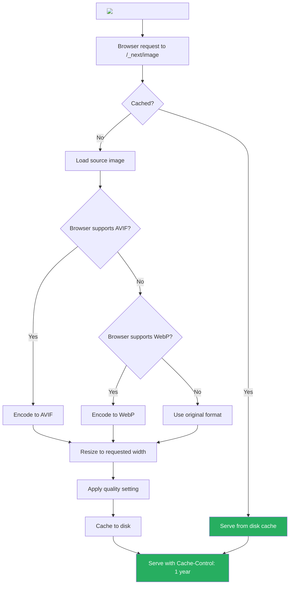
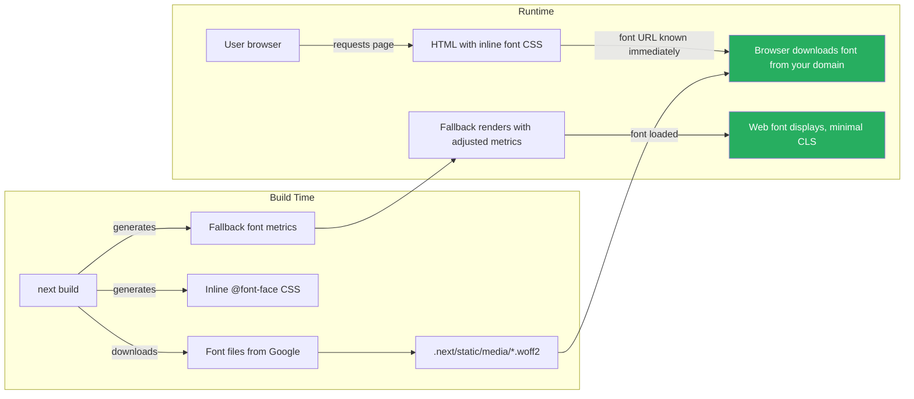

# 44 · Image & Font Optimization

> **Images and fonts are the two largest sources of avoidable performance degradation in web applications. Images are typically the single largest assets on any page. Fonts block rendering when loaded naively. Next.js provides purpose-built solutions for both: `next/image` automates format conversion, responsive sizing, lazy loading, and layout shift prevention; `next/font` eliminates FOUT (Flash of Unstyled Text), inlines critical CSS, and removes the font file round-trip. Understanding how both work at the network and browser level enables you to use them correctly and diagnose when they don't behave as expected.**

These are not "nice to have" optimizations. Images and fonts directly impact Core Web Vitals: Largest Contentful Paint (LCP), Cumulative Layout Shift (CLS), and First Contentful Paint (FCP). Poor image and font handling is the most common cause of Core Web Vitals failures in production Next.js applications.

---

## Table of Contents

- [Why Images Are a Performance Problem](#why-images-are-a-performance-problem)
- [The next/image Component](#the-nextimage-component)
- [How Image Optimization Works Internally](#how-image-optimization-works-internally)
- [Image Sizing Strategies](#image-sizing-strategies)
- [The priority Prop and LCP](#the-priority-prop-and-lcp)
- [Remote Images and Domain Configuration](#remote-images-and-domain-configuration)
- [Placeholder Strategies](#placeholder-strategies)
- [Image Formats: WebP, AVIF, and Fallbacks](#image-formats-webp-avif-and-fallbacks)
- [Why Fonts Are a Performance Problem](#why-fonts-are-a-performance-problem)
- [The next/font System](#the-nextfont-system)
- [Google Fonts via next/font](#google-fonts-via-nextfont)
- [Local Fonts via next/font](#local-fonts-via-nextfont)
- [Font Display Strategies](#font-display-strategies)
- [Variable Fonts](#variable-fonts)
- [CSS Variables with next/font](#css-variables-with-nextfont)
- [Common Mistakes with next/image](#common-mistakes-with-nextimage)
- [Common Mistakes with next/font](#common-mistakes-with-nextfont)
- [Architecture Diagrams](#architecture-diagrams)
- [Good Practices](#good-practices)
- [Bad Practices](#bad-practices)
- [Mental Model](#mental-model)
- [Common Misconceptions](#common-misconceptions)
- [Exercises](#exercises)
- [Further Reading](#further-reading)

---

## Why Images Are a Performance Problem

Images create three distinct performance problems:

### Problem 1: File size

A JPEG photo from a modern camera is 3-8MB. A product image exported from Photoshop might be 500KB-2MB. These are unnecessary — the same visual quality can be achieved at 50-200KB with modern formats (WebP) or 20-100KB with AVIF.

```
Same image, different formats and quality:
  JPEG (original):     1.2MB
  JPEG (optimized):    400KB   (quality 80, progressive)
  WebP (quality 80):   180KB   (55% smaller than JPEG original)
  AVIF (quality 50):   80KB    (93% smaller than JPEG original)

With responsive sizing (mobile: 375px wide, desktop: 1200px wide):
  Mobile WebP:  35KB  (showing 320px-wide image at 2x density)
  Desktop WebP: 120KB (showing 1200px-wide image at 2x density)
```

### Problem 2: Layout shift (CLS)

When an image loads and takes up space, it pushes other content down — causing layout shift. This directly impacts CLS (Cumulative Layout Shift), a Core Web Vital.

```
Without size attributes:
  Page renders → image loads → image takes space → everything shifts down
  CLS: 0.3 (bad — Google threshold is < 0.1)

With width/height or aspect-ratio:
  Browser reserves space before image loads → no shift
  CLS: 0.00
```

### Problem 3: Loading order

Loading all images at once (even below-the-fold ones) wastes bandwidth on mobile and delays the loading of above-the-fold content — the LCP element.

```
Without lazy loading:
  Initial page load → browser downloads 20 images → delays LCP image
  LCP: 4.2s

With lazy loading (only above-fold images load initially):
  Initial page load → browser downloads 2 images → LCP image loads first
  LCP: 1.1s
```

---

## The next/image Component

`next/image` solves all three problems automatically:

```tsx
import Image from "next/image";

// Basic usage:
<Image
  src="/hero.jpg" // path in public/ or external URL
  alt="Hero image" // required for accessibility
  width={1200} // display width in pixels
  height={600} // display height in pixels
/>;

// What next/image does automatically:
// 1. Converts to WebP or AVIF (based on browser support)
// 2. Generates multiple sizes (for responsive images)
// 3. Lazy loads by default (only loads when in viewport)
// 4. Reserves space before load (prevents CLS)
// 5. Serves from /api/image with the optimized version
```

### The rendered HTML

```html
<!-- next/image generates: -->

```

The browser selects the appropriate size from `srcset` based on the device's viewport width and pixel density. A user on a 375px iPhone at 3x density downloads the 1080px image variant (~100KB in WebP) rather than the original 1200px JPEG (400KB).

---

## How Image Optimization Works Internally

```
Request: GET /_next/image?url=/hero.jpg&w=1200&q=75

1. URL decoded: source = /hero.jpg, width = 1200, quality = 75

2. Cache check:
   Has this (source, width, quality, format) been generated before?
   YES → serve from cache (file system or CDN)
   NO → continue

3. Source image loaded from public/ (or fetched for remote images)

4. Format detection:
   Does the browser support AVIF? (Accept: image/avif)
   YES → compress to AVIF
   NO → Does browser support WebP? (Accept: image/webp)
   YES → compress to WebP
   NO → fallback to original format (JPEG, PNG)

5. Resize: scale image to requested width, maintain aspect ratio

6. Compress: apply quality setting (default: 75)

7. Cache: store optimized image on disk
   Cache-Control: public, max-age=31536000, immutable

8. Respond: send optimized image
```

### The image API endpoint

`/_next/image` is a server-side API route in Next.js that:

- Is served by the Node.js server (or Vercel's image optimization CDN)
- Caches optimized images to disk (survives server restarts on Vercel)
- Applies `Cache-Control: public, max-age=31536000, immutable` — CDN-cacheable for 1 year
- Handles the `Accept` header to serve WebP or AVIF when supported

---

## Image Sizing Strategies

### Strategy 1: Fixed size (width + height)

```tsx
// Known dimensions — use when image always displays at same size
<Image
  src="/avatar.jpg"
  alt="User avatar"
  width={64} // exact pixels
  height={64}
/>
```

Next.js generates the `srcset` using this as the base width and generating variants at standard breakpoints.

### Strategy 2: Fill (responsive — fills container)

```tsx
// Image fills its parent container — size is CSS-controlled
<div style={{ position: "relative", width: "100%", height: "400px" }}>
  <Image
    src="/banner.jpg"
    alt="Banner"
    fill // ← fill mode: no width/height needed
    sizes="100vw" // required with fill: helps browser pick right srcset entry
    style={{ objectFit: "cover" }} // how image fits in container
  />
</div>

// Parent MUST have:
// - position: 'relative' (or absolute/fixed)
// - explicit dimensions (height or aspect ratio)
```

### Strategy 3: Responsive with explicit sizes

```tsx
// Tell the browser how large the image is at different viewport widths
<Image
  src="/product.jpg"
  alt="Product"
  width={800}
  height={600}
  sizes="(max-width: 640px) 100vw,    // 0-640px: takes full width
         (max-width: 1024px) 50vw,    // 640-1024px: takes half width
         33vw" // 1024px+: takes a third
/>
// Browser downloads the optimal size for the user's device
// Mobile user (375px, 2x): downloads ~750px wide image
// Desktop user (1440px): downloads ~480px wide image (33vw)
```

### The `sizes` prop is critical for performance

Without `sizes`, Next.js defaults to `100vw` — it generates a full-viewport-width image for every viewport size. A sidebar thumbnail that's only 200px wide would download a 1200px image on desktop:

```tsx
// ❌ Without sizes: always downloads viewport-width image
<Image src="/thumbnail.jpg" alt="Thumbnail" width={200} height={200} />
// On 1440px desktop: downloads 1440px wide image — wasteful

// ✅ With correct sizes: downloads appropriately sized image
<Image
  src="/thumbnail.jpg"
  alt="Thumbnail"
  width={200}
  height={200}
  sizes="200px" // always 200px — download exactly what's needed
/>
```

---

## The priority Prop and LCP

The Largest Contentful Paint (LCP) element is the largest image or text block visible in the viewport on page load. For most pages, it's a hero image. This image should NOT be lazy-loaded:

```tsx
// ❌ Default: lazy loaded — hurts LCP
<Image
  src="/hero.jpg"
  alt="Hero"
  width={1200}
  height={600}
/>

// ✅ priority: disables lazy loading, adds rel="preload"
<Image
  src="/hero.jpg"
  alt="Hero"
  width={1200}
  height={600}
  priority          // ← tells browser: this is important, load immediately
/>
```

With `priority`:

1. `loading="eager"` instead of `loading="lazy"`
2. `<link rel="preload" as="image">` added to `<head>`
3. Browser starts downloading the image before parsing the rest of the HTML

```html
<!-- Generated in <head> when priority is set: -->
<link
  rel="preload"
  as="image"
  href="/_next/image?url=%2Fhero.jpg&w=1200&q=75"
  imagesrcset="/_next/image?url=%2Fhero.jpg&w=640&q=75 640w, ..."
  imagesizes="100vw"
/>
```

### LCP impact of priority

```
Without priority on hero image:
  HTML parsed → scripts fetched → image discovered → image downloaded → LCP
  LCP: 3.5s (image discovery delayed by script loading)

With priority on hero image:
  HTML parsed → preload link encountered → image download starts → LCP
  LCP: 1.2s (image downloads in parallel with scripts)
```

**Rule:** Every page should have exactly ONE image with `priority`. The LCP element. Zero priority images delays LCP; multiple priority images wastes bandwidth with aggressive preloading.

---

## Remote Images and Domain Configuration

For images from external URLs, you must whitelist the domain in `next.config.js`:

```js
// next.config.js
/** @type {import('next').NextConfig} */
module.exports = {
  images: {
    remotePatterns: [
      {
        protocol: "https",
        hostname: "cdn.example.com",
        port: "", // '' = default port (443 for https)
        pathname: "/images/**", // optional: restrict to path pattern
      },
      {
        protocol: "https",
        hostname: "**.supabase.co", // ** wildcard: matches any subdomain
      },
      {
        protocol: "https",
        hostname: "images.unsplash.com",
        // No pathname restriction: any path on this host
      },
    ],
  },
};
```

### Why the whitelist is required

Without the whitelist, an attacker could construct a URL like:

```
/_next/image?url=https://malicious.com/cpu-intensive-image.jpg&w=1200&q=100
```

This would cause Next.js to fetch and process arbitrary external images — potential DoS via image bombing. The whitelist restricts Next.js to only optimize images from trusted sources.

---

## Placeholder Strategies

### blur placeholder

```tsx
// For local images: Next.js generates blur hash automatically
import heroImage from './hero.jpg';

<Image
  src={heroImage}   // static import (not a string)
  alt="Hero"
  placeholder="blur" // automatic blur from static import metadata
/>
// next/image analyzes the image at build time and generates a tiny base64 blur
// Shown immediately while the real image loads

// For remote images: provide blurDataURL manually
<Image
  src="https://cdn.example.com/product.jpg"
  alt="Product"
  width={800}
  height={600}
  placeholder="blur"
  blurDataURL="data:image/jpeg;base64,/9j/4AAQSkZJRgABAQ..." // tiny placeholder
/>
```

### Generating blur placeholders

```tsx
// For remote images, generate blur placeholder at build time:
import { getPlaiceholder } from "plaiceholder";

// In getStaticProps or server component:
const { base64, img } = await getPlaiceholder(
  "https://cdn.example.com/product.jpg",
);

// base64: "data:image/png;base64,..."
// img: { src, width, height, type }

return {
  props: {
    src: img.src,
    blurDataURL: base64,
    width: img.width,
    height: img.height,
  },
};
```

---

## Image Formats: WebP, AVIF, and Fallbacks

Next.js serves images in the most efficient format the browser supports:

```
Format support (as of 2024):
  AVIF: Chrome 85+, Firefox 86+, Safari 16+, Edge 121+
  WebP: All modern browsers (>97% support)
  JPEG/PNG: Universal fallback

Next.js format selection:
  1. Does request Accept header include image/avif? → serve AVIF
  2. Does request Accept header include image/webp? → serve WebP
  3. Default → serve original format (JPEG, PNG, etc.)
```

### Configuring formats

```js
// next.config.js
module.exports = {
  images: {
    formats: ["image/avif", "image/webp"],
    // Default: ['image/avif', 'image/webp']
    // To disable AVIF (slower to encode, might prefer WebP for build speed):
    // formats: ['image/webp'],
  },
};
```

### Quality settings

```tsx
// Default quality: 75 (good balance of size and quality)
<Image src="/photo.jpg" alt="Photo" width={800} height={600} />

// Higher quality (for photos where detail matters):
<Image src="/photo.jpg" alt="Photo" width={800} height={600} quality={90} />

// Lower quality (for background images, thumbnails):
<Image src="/bg.jpg" alt="" width={1920} height={1080} quality={50} />
```

---

## Why Fonts Are a Performance Problem

Fonts create two rendering problems:

### Problem 1: FOIT (Flash of Invisible Text)

Browser behavior: Font is loading → text is invisible → font loaded → text appears. Users see blank areas where text should be.

```
Timeline without optimization:
  HTML parsed → CSS parsed → font URL discovered → font downloaded (300ms)
  → text becomes visible

During those 300ms: users see blank white space where text should be
```

### Problem 2: FOUT (Flash of Unstyled Text)

Alternative browser behavior: Use a fallback font while loading → swap to web font when loaded. Users see text that jumps/shifts when the font loads.

```
Timeline:
  HTML → CSS → render with system font (Arial/Helvetica)
  → Font downloads → swap to web font → layout shift (FOUT)

The font-size, line-height, letter-spacing differences between
Arial and your custom font cause text to reflow → CLS impact
```

### Problem 3: Extra network round-trip

Google Fonts requires two requests:

1. `https://fonts.googleapis.com/css2?family=...` — the CSS file
2. `https://fonts.gstatic.com/s/inter/...` — the actual font file

For users not in Google's cache (incognito mode, first visit, privacy-focused browsers), this adds two extra network round-trips before text can render.

---

## The next/font System

`next/font` solves all three font problems:

```tsx
// app/layout.tsx
import { Inter } from "next/font/google";

// next/font downloads the font at build time (no runtime Google Fonts request)
const inter = Inter({
  subsets: ["latin"], // download only Latin characters (smaller file)
  display: "swap", // FOUT strategy: show fallback, swap when ready
  variable: "--font-inter", // optional: CSS variable name
});

export default function RootLayout({ children }) {
  return (
    <html lang="en" className={inter.className}>
      {/* inter.className contains the font-family and font-display CSS */}
      <body>{children}</body>
    </html>
  );
}
```

### What next/font does at build time

```
next build encounters:
  import { Inter } from 'next/font/google';
  const inter = Inter({ subsets: ['latin'] });

1. Downloads Inter font files from Google Fonts servers
   → Saved to .next/static/media/
   → These files are now YOUR files (no Google CDN dependency)

2. Generates CSS:
   @font-face {
     font-family: '__Inter_HASH';
     src: url(/_next/static/media/inter-latin.woff2) format('woff2');
     font-display: swap;
   }

3. Inlines the @font-face declaration in the page <head>
   → No extra CSS file needed (eliminates one network round-trip)
   → Font URL is known immediately (browser can start downloading)

4. Returns an object:
   { className: '__Inter_HASH __Inter_FALLBACK_HASH', style: {} }
```

The font is served from YOUR domain — no external requests at runtime. The browser finds the font URL immediately from the inline CSS. No CORS issues. No privacy concerns (no requests to Google servers from users' browsers).

---

## Google Fonts via next/font

```tsx
// Single font family:
import { Inter } from 'next/font/google';

const inter = Inter({
  subsets: ['latin'],           // language subsets to include
  weight: ['400', '500', '700'], // specific weights (or 'variable' for variable fonts)
  style: ['normal', 'italic'],  // font styles
  display: 'swap',              // font-display strategy
  preload: true,                // default: true — adds <link rel="preload">
  fallback: ['Helvetica', 'Arial'], // fallback fonts (for size-adjust calculation)
  adjustFontFallback: true,     // auto-adjust fallback to match metrics
});

// Using in components:
<div className={inter.className}>This text uses Inter</div>
// or as a CSS variable:
<div style={{ fontFamily: 'var(--font-inter)' }}>This text uses Inter</div>
```

### Multiple font families

```tsx
// app/layout.tsx
import { Inter, Merriweather } from "next/font/google";

const inter = Inter({
  subsets: ["latin"],
  variable: "--font-sans", // CSS custom property
});

const merriweather = Merriweather({
  subsets: ["latin"],
  weight: ["400", "700"],
  variable: "--font-serif",
});

export default function RootLayout({ children }) {
  return (
    <html className={`${inter.variable} ${merriweather.variable}`}>
      <body>{children}</body>
    </html>
  );
}

// In CSS (or Tailwind config):
// body { font-family: var(--font-sans); }
// h1, h2, h3 { font-family: var(--font-serif); }
```

---

## Local Fonts via next/font

For self-hosted fonts (not Google Fonts):

```tsx
import localFont from "next/font/local";

// Single font file:
const myFont = localFont({
  src: "./fonts/MyFont-Regular.woff2",
  display: "swap",
  variable: "--font-custom",
});

// Multiple weights/styles from separate files:
const myFont = localFont({
  src: [
    {
      path: "./fonts/MyFont-Regular.woff2",
      weight: "400",
      style: "normal",
    },
    {
      path: "./fonts/MyFont-Bold.woff2",
      weight: "700",
      style: "normal",
    },
    {
      path: "./fonts/MyFont-Italic.woff2",
      weight: "400",
      style: "italic",
    },
  ],
  display: "swap",
  variable: "--font-custom",
});
```

### Font file location for local fonts

```
app/
  fonts/
    MyFont-Regular.woff2  ← src path is relative to the file using localFont()
    MyFont-Bold.woff2
  layout.tsx               ← localFont used here: src: './fonts/MyFont-Regular.woff2'
```

The font files can be anywhere in the project — they're served from `/_next/static/media/` regardless.

---

## Font Display Strategies

The `display` prop controls how the browser handles the loading period:

```tsx
// 'auto': browser default (usually same as 'block')
display: "auto";

// 'block': invisible text until font loads (FOIT)
// Short block period (typically 3s), then swap
// Use for: icons/symbol fonts where fallback would be wrong
display: "block";

// 'swap': show fallback immediately, swap when font loads (FOUT)
// Best for: body text where reading matters more than perfection
// CLS risk: layout shift when font swaps (mitigated by adjustFontFallback)
display: "swap";

// 'fallback': short block (100ms), then show fallback, no swap after 3s
// Best for: brand fonts where exact appearance matters
// If font doesn't load within 3s: use fallback permanently (no late CLS)
display: "fallback";

// 'optional': very short block, no swap
// Best for: non-essential decorative fonts
// If font not in cache: don't use it at all (zero CLS, possible FOUT)
display: "optional";
```

### The adjustFontFallback option (CLS reduction)

When font-display: swap is used, the switch from fallback to web font causes layout shift because different fonts have different metrics (line height, letter spacing, character width).

`next/font` automatically generates a fallback font with adjusted metrics to minimize shift:

```tsx
const inter = Inter({
  subsets: ["latin"],
  display: "swap",
  adjustFontFallback: true, // default: true
  // Generates: @font-face { font-family: '__Inter_Fallback'; ... }
  // with size-adjust, ascent-override, descent-override, line-gap-override
  // set to match Inter's metrics as closely as possible
  // Fallback font visually approximates Inter → less shift when swapping
});
```

This uses the `size-adjust` CSS descriptor to scale the fallback font to match the web font's dimensions — reducing CLS from font swaps from ~0.1 to ~0.01.

---

## Variable Fonts

Variable fonts contain all weights and styles in a single file, controlled by CSS `font-variation-settings`:

```tsx
// Variable weight font (supports any weight 100-900 in one file)
import { Inter } from 'next/font/google';

const inter = Inter({
  subsets: ['latin'],
  // For variable fonts: no weight array needed
  // The single file handles all weights
});

// Using variable weight:
.heading {
  font-weight: 800; /* extraBold — no extra file needed */
}
.body {
  font-weight: 400; /* regular */
}
.light {
  font-weight: 300; /* light */
}
```

### Advantages of variable fonts

```
Traditional font loading (4 weights):
  MyFont-Light.woff2    (40KB)
  MyFont-Regular.woff2  (45KB)
  MyFont-Bold.woff2     (45KB)
  MyFont-ExtraBold.woff2 (45KB)
  Total: 175KB (4 downloads)

Variable font equivalent:
  MyFont-Variable.woff2  (65KB)
  Total: 65KB (1 download)
  Supports: any weight from 100-900
```

The file is larger per file but typically smaller total, and requires only one download.

---

## CSS Variables with next/font

The recommended pattern for using next/font with Tailwind or CSS modules:

```tsx
// app/layout.tsx
import { Inter, Playfair_Display } from "next/font/google";

const inter = Inter({
  subsets: ["latin"],
  variable: "--font-sans",
});

const playfair = Playfair_Display({
  subsets: ["latin"],
  variable: "--font-display",
});

export default function RootLayout({ children }) {
  return (
    <html className={`${inter.variable} ${playfair.variable}`}>
      <body>{children}</body>
    </html>
  );
}
```

```css
/* globals.css */
body {
  font-family: var(--font-sans), system-ui, sans-serif;
}

h1,
h2,
h3 {
  font-family: var(--font-display), Georgia, serif;
}
```

```js
// tailwind.config.js
module.exports = {
  theme: {
    extend: {
      fontFamily: {
        sans: ["var(--font-sans)", "system-ui", "sans-serif"],
        display: ["var(--font-display)", "Georgia", "serif"],
      },
    },
  },
};

// Then in components:
// <h1 className="font-display text-4xl">Heading</h1>
// <p className="font-sans text-base">Body text</p>
```

---

## Common Mistakes with next/image

### Mistake 1: Missing sizes prop for responsive images

```tsx
// ❌ Without sizes: always downloads full viewport-width image
<Image
  src="/product.jpg"
  alt="Product"
  fill
/>
// On 1440px desktop: downloads 1440px image even if container is 300px wide

// ✅ With accurate sizes:
<Image
  src="/product.jpg"
  alt="Product"
  fill
  sizes="(max-width: 640px) 100vw, 300px"
  // Mobile: full width; Desktop: always 300px
/>
```

### Mistake 2: priority on multiple images

```tsx
// ❌ Multiple priority images: all preloaded — wastes bandwidth
<Image src="/hero.jpg" alt="Hero" width={1200} height={600} priority />
<Image src="/logo.png" alt="Logo" width={200} height={50} priority />
<Image src="/bg.jpg" alt="Background" width={1920} height={1080} priority />

// ✅ Only the LCP element needs priority
<Image src="/hero.jpg" alt="Hero" width={1200} height={600} priority />
<Image src="/logo.png" alt="Logo" width={200} height={50} />
<Image src="/bg.jpg" alt="Background" width={1920} height={1080} />
```

### Mistake 3: Using `` instead of `<Image>`

```tsx
// ❌ Raw : no optimization

// No WebP conversion, no lazy loading, no responsive sizes, no CLS prevention

// ✅ next/image
<Image src="/photo.jpg" alt="Photo" width={800} height={600} />
```

---

## Common Mistakes with next/font

### Mistake 1: Importing fonts in components instead of layout

```tsx
// ❌ Bad: font imported in a component
// components/Heading.tsx
import { Playfair_Display } from "next/font/google";
const playfair = Playfair_Display({ subsets: ["latin"] });

function Heading({ children }) {
  return <h1 className={playfair.className}>{children}</h1>;
}
// Problem: if Heading is used in multiple places, the font is declared
// multiple times — potential duplicate @font-face declarations

// ✅ Correct: import in layout, pass via CSS variable
// app/layout.tsx
const playfair = Playfair_Display({
  subsets: ["latin"],
  variable: "--font-display",
});
// components/Heading.tsx
<h1 style={{ fontFamily: "var(--font-display)" }}>{children}</h1>;
// or with Tailwind: <h1 className="font-display">{children}</h1>
```

### Mistake 2: Loading fonts outside of layout

```tsx
// ❌ Importing the font directly in a page (not the root layout)
// app/blog/page.tsx
import { Inter } from "next/font/google";
const inter = Inter({ subsets: ["latin"] });
// This font is only loaded for /blog — other pages won't have it
// AND it's re-declared on every navigation to /blog

// ✅ All fonts should be in app/layout.tsx
// They're loaded once for the entire app
```

---

## Architecture Diagrams

### next/image optimization pipeline



### next/font: build vs runtime



---

## Good Practices

### ✅ Good Practice — Complete image and font setup for a production page

```tsx
/**
 * Good: Hero image with priority, product images with responsive sizes,
 * fonts loaded in layout with CSS variables, LCP optimized.
 */

// app/layout.tsx
import { Inter, Playfair_Display } from "next/font/google";

const inter = Inter({
  subsets: ["latin"],
  display: "swap",
  adjustFontFallback: true, // minimize CLS on font swap
  variable: "--font-sans",
});

const playfair = Playfair_Display({
  subsets: ["latin"],
  weight: ["700", "900"],
  display: "swap",
  adjustFontFallback: true,
  variable: "--font-display",
});

export default function RootLayout({ children }) {
  return (
    <html lang="en" className={`${inter.variable} ${playfair.variable}`}>
      <body className="font-sans">{children}</body>
    </html>
  );
}

// app/page.tsx
import Image from "next/image";
import heroImage from "@/public/hero.jpg"; // static import for blur placeholder

export default function HomePage() {
  return (
    <main>
      {/* LCP image: priority, blur placeholder, responsive */}
      <div style={{ position: "relative", height: "500px" }}>
        <Image
          src={heroImage}
          alt="Welcome to our store"
          fill
          priority // LCP element
          placeholder="blur" // auto-generated from static import
          sizes="100vw" // full width hero
          style={{ objectFit: "cover" }}
          quality={85} // slightly higher quality for hero
        />
      </div>

      {/* Product grid: responsive sizing, lazy loaded */}
      <section className="grid grid-cols-3 gap-4">
        {products.map((product) => (
          <div
            key={product.id}
            style={{ position: "relative", aspectRatio: "1/1" }}
          >
            <Image
              src={product.imageUrl}
              alt={product.name}
              fill
              sizes="(max-width: 640px) 100vw, (max-width: 1024px) 50vw, 33vw"
              style={{ objectFit: "contain" }}
            />
          </div>
        ))}
      </section>
    </main>
  );
}
```

---

## Bad Practices

### ⚠️ Bad Practice — Unoptimized images causing Core Web Vitals failures

```tsx
/**
 * Bad: Three critical image mistakes combined.
 * 1. Missing priority on hero (LCP suffers)
 * 2. Missing sizes (oversized images downloaded)
 * 3. No blur placeholder (CLS from image loading)
 *
 * These three mistakes are responsible for the majority of
 * Core Web Vitals failures in Next.js applications.
 */
function BrokenHero() {
  return (
    <div>
      {/* ❌ Mistake 1: No priority — hero is LCP element but lazy-loaded */}
      {/* Browser discovers hero after scripts load → LCP delayed 1-3 seconds */}
      <Image
        src="/hero.jpg"
        alt="Hero"
        width={1200}
        height={600}
        // Missing: priority
      />

      {/* ❌ Mistake 2: No sizes — 20-item grid downloads full viewport images */}
      {/* Mobile user (375px wide) downloads 1200px wide images × 20 items */}
      {/* Total wasted bandwidth: ~4MB on mobile */}
      <div className="grid grid-cols-4 gap-2">
        {items.map((item) => (
          <Image
            key={item.id}
            src={item.image}
            alt={item.name}
            width={300}
            height={300}
            // Missing: sizes="(max-width: 640px) 25vw, 25vw" or "300px"
          />
        ))}
      </div>

      {/* ❌ Mistake 3: No placeholder — images pop in causing CLS */}
      {/* User sees blank space, then sudden content jump */}
      <Image
        src="https://cdn.example.com/promo.jpg"
        alt="Promo"
        width={800}
        height={400}
        // Missing: placeholder="blur" blurDataURL="data:..."
      />
    </div>
  );
}
```

**Core Web Vitals impact:**

- LCP without priority: 3.5s → **FAIL** (Google threshold: < 2.5s)
- CLS from missing sizes: 0.15 → **FAIL** (threshold: < 0.1)
- CLS from missing placeholder: +0.05 → cumulative CLS 0.20 → **FAIL**

**Cumulative result:** All three Core Web Vitals fail — Google Search ranking penalty, poor Page Experience score, 40% higher bounce rate (users leave slow pages).

---

## Mental Model

> 💡 **The image and font optimization mental model:**
>
> Think of images and fonts as **freight shipments**. Without optimization, you ship the entire warehouse (original 4MB JPEG) to every customer (mobile user on 4G), regardless of what they ordered (a 200px thumbnail). `next/image` is a logistics system that measures what each customer needs (their device width and pixel density), cuts exactly the right amount from the warehouse stock (resizes), repackages in lighter materials (WebP/AVIF), and ships directly from their nearest depot (CDN). The `priority` flag is like "overnight shipping" for the most important freight — everything else waits in the regular queue. Fonts work like software licenses — without `next/font`, every user contacts Google's licensing server (fonts.googleapis.com) before they can read anything. `next/font` pre-licenses the font at build time and distributes copies from your own depot, eliminating the licensing delay entirely.

---

## Common Misconceptions

### "next/image makes images smaller automatically"

`next/image` converts to WebP/AVIF and resizes to the requested width. But if you request `width={1920}` for a thumbnail, it generates a large optimized image. You still need to specify the correct dimensions.

### "priority loads images faster"

`priority` removes the lazy-loading delay so images start downloading when the HTML is parsed rather than when they enter the viewport. It doesn't change download speed — it changes WHEN the download starts. For above-the-fold images, starting earlier → lower LCP.

### "next/font prevents FOUT"

`next/font` eliminates the network round-trip by serving fonts from your domain. But FOUT (the visual swap from fallback to web font) can still occur — it depends on the `display` strategy. `display: 'swap'` intentionally shows the fallback then swaps. `display: 'optional'` minimizes FOUT by not swapping if the font isn't immediately available.

### "You need to set width and height for fill images"

With `fill`, the image fills its parent container — width and height come from CSS, not from the `next/image` props. You must NOT provide `width` and `height` props with `fill` mode. The parent container must have explicit dimensions.

### "next/font downloads fonts from Google at runtime"

`next/font` downloads fonts AT BUILD TIME and serves them from your domain at runtime. Users' browsers never contact Google's servers — no Google tracking, no CORS issues, no latency from external DNS.

---

## Exercises

### Exercise 1 — Audit Core Web Vitals

1. Install Lighthouse in Chrome DevTools
2. Run a Lighthouse audit on your Next.js app (or any Next.js site)
3. Look for:
   - "Properly size images" — images larger than needed
   - "Serve images in next-gen formats" — JPEG/PNG that should be WebP/AVIF
   - "Image elements do not have explicit width and height" — CLS risk
   - "Largest Contentful Paint element" — is it using priority?

### Exercise 2 — Measure the sizes prop impact

Build a product grid page:

1. Version A: no `sizes` prop (default behavior)
2. Version B: accurate `sizes` prop

Using Chrome DevTools Network panel, compare:

- Total image bytes downloaded
- Number of requests
- LCP timing

Calculate bandwidth savings per page view and project to 10,000 visits/day.

### Exercise 3 — Implement the complete font setup

```tsx
// Create a Next.js app with:
// 1. Primary sans-serif font: Inter (from next/font/google)
// 2. Display/heading font: Playfair Display (from next/font/google)
// 3. Both as CSS variables (--font-sans, --font-display)
// 4. Configured in Tailwind as font-sans and font-display
// 5. adjustFontFallback: true on both
// 6. Measure CLS: compare with and without adjustFontFallback
//    (use Chrome DevTools Performance tab or WebPageTest)
```

---

## Further Reading

- [Next.js docs: Image Optimization](https://nextjs.org/docs/app/building-your-application/optimizing/images) — Official reference
- [Next.js docs: Font Optimization](https://nextjs.org/docs/app/building-your-application/optimizing/fonts) — Official reference
- [web.dev: Optimize LCP](https://web.dev/articles/optimize-lcp) — LCP optimization guide
- [web.dev: Cumulative Layout Shift](https://web.dev/articles/cls) — CLS explanation
- [Google: Font best practices](https://web.dev/articles/font-best-practices) — Font loading strategies
- [next/image API reference](https://nextjs.org/docs/app/api-reference/components/image) — All props
- [Plaiceholder](https://plaiceholder.co/) — Generate blur placeholders for remote images
- Next in this handbook: [45 · Server Components Deep Dive](../server-components/01-what-rsc-is.md)

---

_Part of the [React + Next.js Engineering Handbook](../../README.md)_
