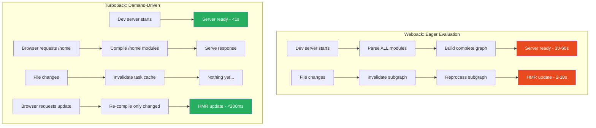
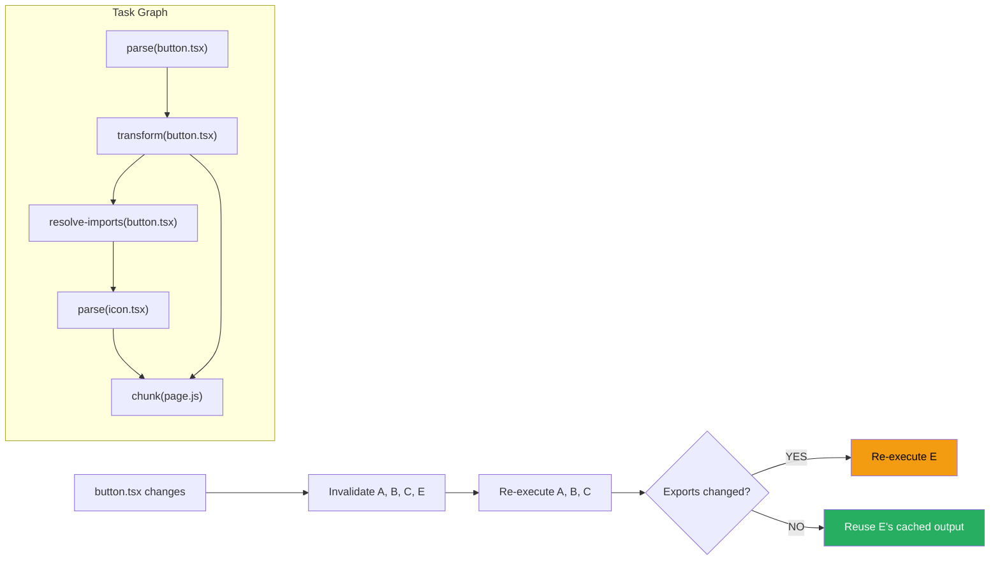

# 64 · Turbopack Architecture

> **Turbopack is the Rust-based JavaScript bundler built by Vercel as the eventual successor to Webpack in Next.js. It is not a re-implementation of Webpack — it is a fundamentally different architecture designed around incremental computation, where the primary innovation is that only the files that changed and their dependents are ever re-processed, making large-codebase development builds fast regardless of project size. Understanding Turbopack's architecture clarifies why it's fast, what its current limitations are, and when the performance difference actually matters for your development workflow.**

Build tools are often treated as black boxes — "it compiles my code" — but the architectural decisions inside a bundler directly affect two things that profoundly shape developer experience: cold start time (how long until you first see your page) and HMR latency (how long between saving a file and seeing the change in the browser). Turbopack's design addresses both through demand-driven evaluation and persistent caching.

---

## Table of Contents

- [Why a New Bundler](#why-a-new-bundler)
- [The Core Architecture: Incremental Computation Engine](#the-core-architecture-incremental-computation-engine)
- [Demand-Driven Evaluation](#demand-driven-evaluation)
- [The Module Graph](#the-module-graph)
- [Persistent Caching Across Restarts](#persistent-caching-across-restarts)
- [Turbopack vs Webpack vs Vite](#turbopack-vs-webpack-vs-vite)
- [Turbopack in Next.js: Current Status](#turbopack-in-next.js-current-status)
- [Enabling Turbopack](#enabling-turbopack)
- [Turbopack Configuration in next.config.js](#turbopack-configuration-in-nextconfigjs)
- [Loaders vs Webpack Loaders](#loaders-vs-webpack-loaders)
- [What Turbopack Currently Does Not Support](#what-turbopack-currently-does-not-support)
- [Performance Characteristics](#performance-characteristics)
- [Architecture Diagrams](#architecture-diagrams)
- [Good Practices](#good-practices)
- [Bad Practices](#bad-practices)
- [Mental Model](#mental-model)
- [Common Misconceptions](#common-misconceptions)
- [Exercises](#exercises)
- [Further Reading](#further-reading)

---

## Why a New Bundler

Webpack was designed in an era when JavaScript applications were small enough that bundling everything together on each change was tractable. As applications grew to hundreds of thousands of modules, two fundamental limitations emerged:

```
LIMITATION 1: Full graph evaluation
  Webpack builds a complete module graph on startup.
  For a large project with 50,000 modules:
    Cold start: 30-60+ seconds (every module parsed, transformed, linked)
  This is necessary for production (optimal output), but wasteful
  for development (you only ever VIEW a handful of pages at once).

LIMITATION 2: Non-incremental work
  Webpack's internal data structures aren't designed for efficient
  partial recomputation. Even with caching plugins, a file change
  typically triggers reprocessing of the entire affected subgraph.
  For modules with many dependents, HMR can take 2-10+ seconds in
  large codebases.

LIMITATION 3: JavaScript performance ceiling
  Webpack runs in Node.js. No matter how well-optimized, a JavaScript
  process has fundamental speed limits: single-threaded by default,
  no native memory layout control, GC pauses at scale.

TURBOPACK'S SOLUTIONS:
  1. Demand-driven evaluation: only process what's actually REQUESTED
  2. Fine-grained incremental computation: re-process ONLY what changed
  3. Rust: orders of magnitude faster than JS for CPU-intensive tasks,
     native parallelism via rayon, no GC pauses
```

---

## The Core Architecture: Incremental Computation Engine

Turbopack is built on top of `turbo-tasks`, a Rust framework for incremental computation. The fundamental abstraction is a **task graph** where:

```
- Every computation is a "task" that takes inputs and produces outputs
- Inputs and outputs are strongly typed, content-addressed values
- The framework tracks which tasks depend on which other tasks
- When an input changes, ONLY tasks that transitively depend on that
  input are re-executed — all other tasks reuse their previous results
```

This is conceptually similar to how build systems like Bazel or Nix work, applied to the specific domain of JavaScript bundling:

```
Example task graph for button.tsx:
  parse(button.tsx)
    → transform(button.tsx, { target: 'es2020', jsx: 'react' })
      → resolve-imports(button.tsx)
        → [icon.tsx, styles.module.css, ...]

When button.tsx changes:
  Only tasks in this subgraph re-execute.
  Anything that depends on files NOT in this subgraph: untouched.

When button.tsx changes but its EXPORTS don't change
(e.g., a comment was edited):
  Tasks depending on button.tsx's CONTENTS re-execute.
  Tasks depending only on button.tsx's PUBLIC INTERFACE
  (its exported types and values): NOT re-executed.
  This "semantic change detection" prevents unnecessary propagation
  through the graph when changes are purely internal.
```

---

## Demand-Driven Evaluation

The biggest architectural difference from Webpack is how Turbopack decides what to process:

```
WEBPACK approach (eager evaluation):
  On startup: parse and transform ALL modules in the project
  On file change: reprocess the affected module and propagate
  Result: everything is always processed, startup is expensive,
          but any subsequent request is instantly answered

TURBOPACK approach (demand-driven / lazy evaluation):
  On startup: process NOTHING
  On browser request for a page: process only the modules needed
    for THAT PAGE (and their transitive dependencies)
  On file change: invalidate affected tasks; re-process only what's
    needed when the BROWSER NEXT REQUESTS those modules
  Result: startup is instant, first load of each page takes time
          to compile its specific modules, subsequent changes are fast
```

```
Development experience with demand-driven evaluation:

$ next dev (Turbopack)
  → Server starts in ~500ms (no module processing yet)
  → First browser request to /home:
       Process modules for /home (100 modules)
       Time: 1-3 seconds depending on module count and transforms
  → Navigate to /dashboard:
       Process modules for /dashboard (might share 60 of /home's modules)
       Time: faster (shared modules already processed and cached)
  → Edit button.tsx:
       Invalidate: button.tsx and its dependents (maybe 5 modules)
       Re-process: just those 5 modules
       HMR update to browser: <200ms
```

---

## The Module Graph

Turbopack builds a module graph on demand, similar to Webpack's but with key structural differences:

```
MODULE RESOLUTION:
  Similar to Webpack: imports are resolved following the Node.js
  module resolution algorithm, with additional resolution for
  TypeScript paths, Next.js app directory conventions, etc.

CHUNK SPLITTING:
  Turbopack splits output differently from Webpack:
  - Each module is addressable individually (for HMR efficiency)
  - Shared modules are deduplicated across chunk boundaries
  - The chunking strategy is optimized for HTTP/2 multiplexing

TRANSFORMS:
  Each module is transformed according to its file type:
  TypeScript → via SWC (not Babel) → JavaScript
  JSX/TSX → via SWC → JavaScript
  CSS Modules → processed to CSS + JS exports
  PostCSS → processed to plain CSS
  Image/font imports → processed to URL references
```

### The SWC dependency

```
Both Turbopack (for development) and production Next.js builds
use SWC (Speedy Web Compiler) for TypeScript and JSX transforms.

SWC:
  - Written in Rust (like Turbopack itself)
  - ~17x faster than Babel for identical transforms
  - Handles: TypeScript stripping, JSX transform, decorators,
    module format conversion, minification
  - The key capability that made replacing Babel feasible

Turbopack uses SWC directly (as a library, not a subprocess),
meaning there's no IPC overhead between the bundler and the transformer
— they share the same process, passing data via native Rust structures.
```

---

## Persistent Caching Across Restarts

One of Turbopack's most impactful features for developer experience is its persistent cache:

```
First run (cold start):
  - All module processing results stored in .next/cache/turbopack/
  - Keyed by content hash: if file content hasn't changed, the cached
    result is valid across server restarts

Subsequent runs (warm start, files unchanged):
  - Server starts in ~100ms
  - Browser requests answered from the persistent cache immediately
  - No reprocessing of unchanged modules

Subsequent runs (warm start, some files changed):
  - Server starts in ~100ms
  - Only changed files and their dependents reprocessed
  - Unchanged modules served from persistent cache
```

```
Compare with Webpack without persistent cache:
  Every `next dev` restart: full re-evaluation of all visited modules
  10,000-module project: 30-60 seconds before first request can be served

Compare with webpack-cache-experimental (webpack 5 persistent cache):
  Also persists across restarts, but at coarser granularity and with
  more cache invalidation surface area (cache keys are less precise,
  more false misses)
```

---

## Turbopack vs Webpack vs Vite

```
                    TURBOPACK   WEBPACK 5    VITE
Language:           Rust        JavaScript   JavaScript (Vite core)
                                             Go (esbuild, via Rollup plugin)

Architecture:       Incremental  Eager        Unbundled (dev)
                    computation  graph        ESM native + esbuild pre-bundle

Dev startup:        Very fast    Slow         Very fast
                    (demand-     (eager)      (no bundling in dev)
                    driven)

HMR on large        Very fast    Can be slow  Fast (ESM native)
codebase:           (fine-       (graph-      (only changed files)
                    grained)     wide)

Production build:   Webpack      Webpack      Rollup
                    (for now)    (primary)    (primary)

Persistent cache:   ✅ Native    ✅ (v5)      ❌ (dev)
                                              ✅ (some)

Next.js support:    Dev (stable) Legacy +     Not official
                    Prod (TBD)   current      (third-party: vite-next)

Bundle analysis:    Limited      @next/bundle N/A (native for prod)
                    (improving)  -analyzer

Webpack compat:     Partial      Full         N/A
                    (loader API) (native)
```

### Vite vs Turbopack: architecturally different approaches

```
Vite's development philosophy:
  "Don't bundle at all in development — serve native ES modules directly.
   The browser handles module resolution. Use esbuild to pre-bundle
   only vendor dependencies (node_modules) which change rarely."

  PRO: instant server start (almost nothing to do on startup)
  CON: for large apps with 1000+ distinct imports per page, the browser
       makes 1000+ parallel requests per navigation — measurable
       waterfall in very large projects

Turbopack's development philosophy:
  "Bundle on-demand, but minimally and incrementally. Serve a small
   number of optimized chunks rather than raw modules."

  PRO: scales to very large apps without browser-request explosion
  CON: first-time page visits pay a compilation cost
```

For most mid-size projects, both approaches feel similarly fast. The difference becomes pronounced at scale (very large codebases or very complex dependency graphs).

---

## Turbopack in Next.js: Current Status

```
As of Next.js 15 (the state as of this document):
  Development (next dev --turbopack):
    ✅ Stable for most use cases
    ✅ Faster cold starts than Webpack
    ✅ Faster HMR than Webpack
    ✅ Persistent cache
    ⚠️  Some Webpack loader configurations require adaptation
    ⚠️  Edge cases in very complex monorepo setups

  Production (next build):
    ❌ NOT yet available — production builds still use Webpack
    Roadmap: production Turbopack builds are planned but not yet
             released for general use

  Configuration:
    ✅ next.config.js turbopack key for Turbopack-specific config
    ⚠️  webpack() config option in next.config.js does NOT apply
        when Turbopack is active — parallel config required
```

> 🏭 **Production Note:** Given the pace of Next.js development, Turbopack's production build support may have advanced since this document was written. Always check the current Next.js release notes for the latest status.

---

## Enabling Turbopack

```bash
# Development with Turbopack:
next dev --turbopack

# Or in package.json:
{
  "scripts": {
    "dev": "next dev --turbopack"
  }
}
```

Turbopack is NOT automatically enabled just by upgrading Next.js — you must explicitly opt in via the `--turbopack` flag for dev, or (once available) a separate build option for production.

---

## Turbopack Configuration in next.config.js

```js
// next.config.js
/** @type {import('next').NextConfig} */
module.exports = {
  // Turbopack-specific configuration
  turbopack: {
    // Custom module resolution aliases
    resolveAlias: {
      crypto: "crypto-browserify",
      stream: "stream-browserify",
    },

    // File extension resolution order (when no extension is specified)
    resolveExtensions: [".mdx", ".tsx", ".ts", ".jsx", ".js", ".mjs", ".json"],

    // Custom loaders for specific file types
    // (Turbopack's loader API, NOT Webpack loaders directly)
    rules: {
      "*.svg": {
        loaders: ["@svgr/webpack"],
        as: "*.js",
      },
      "*.mdx": {
        loaders: [
          {
            loader: "@mdx-js/loader",
            options: {
              remarkPlugins: [],
              rehypePlugins: [],
            },
          },
        ],
        as: "*.js",
      },
    },
  },
};
```

---

## Loaders vs Webpack Loaders

Turbopack has its own loader interface that is designed to be compatible with many Webpack loaders, but not all:

```
TURBOPACK LOADER COMPATIBILITY:
  ✅ Many file-transform loaders (MDX, SVGR, raw-loader equivalents)
  ✅ CSS-processing loaders (sass-loader, less-loader)
  ⚠️  Loaders that use Webpack-specific APIs (compilation hooks,
      emit APIs, watching APIs) are not compatible
  ❌ Loaders that deeply depend on Webpack's internal plugin system

HOW TURBOPACK USES WEBPACK-COMPATIBLE LOADERS:
  Turbopack can invoke many Webpack loaders by implementing a subset
  of Webpack's loader API. The loader receives a file's content, can
  call context methods (this.emitFile, this.addDependency, etc.),
  and returns transformed content. Turbopack provides stubs for the
  most commonly used Webpack context APIs.

IDENTIFYING INCOMPATIBLE LOADERS:
  If a loader uses: compiler.hooks, compilation.hooks, this.emitWarning
  via WebpackError, or other Webpack-specific plugin hooks → likely
  incompatible. Test by running `next dev --turbopack` and checking
  the console for loader-related errors.
```

---

## What Turbopack Currently Does Not Support

```
As of Turbopack's stable dev-mode release (verifiable in current Next.js docs):

NOT SUPPORTED:
  - Production builds (next build) — still uses Webpack
  - The webpack() configuration function in next.config.js
    (when using Turbopack, use the turbopack: {} key instead)
  - Some Webpack-specific plugins that hook deeply into
    Webpack's compilation lifecycle
  - Bundle analyzer plugins designed for Webpack output format
  - Certain Babel transforms (SWC handles most, but highly
    custom Babel plugins may not have Turbopack equivalents)

PARTIALLY SUPPORTED:
  - Custom Webpack loaders (compatible subset)
  - next.config.js options (most work, a few are Webpack-specific)
  - Third-party plugins that add Webpack loaders

BEST APPROACH:
  Test your specific configuration with --turbopack in development.
  If issues arise, check the Next.js Turbopack documentation for the
  current compatibility matrix and any available workarounds.
```

---

## Performance Characteristics

Benchmarks from the Turbopack team (and independent measurements) show roughly:

```
COLD START (next dev, large project with ~30,000 modules):
  Webpack: 25-45 seconds
  Turbopack: 1-4 seconds
  Speedup: ~10-15x

HMR (single file change, large project):
  Webpack: 2-10 seconds (varies widely by project structure)
  Turbopack: 50-200ms
  Speedup: ~10-50x

FIRST PAGE LOAD (after dev server starts):
  Webpack: Very fast (modules already processed on startup)
  Turbopack: 1-5 seconds (modules compiled on first request)
  Winner: Webpack (but only if startup has already been paid)

WARM RESTART (restart after no file changes):
  Webpack: 25-45 seconds (re-processes everything)
  Turbopack: 100-200ms (reads from persistent cache)
  Speedup: ~100-200x

REAL-WORLD IMPACT:
  For small projects (<500 modules): negligible difference
  For medium projects (500-5000 modules): noticeable improvement
  For large projects (5000+ modules): transformative for daily workflow
```

---

## Architecture Diagrams

### Webpack vs Turbopack evaluation strategy



### The turbo-tasks incremental computation model



---

## Good Practices

### ✅ Good Practice — Maintaining parallel Webpack and Turbopack config during migration

```js
/**
 * Good: During migration to Turbopack for development, maintaining
 * both configurations so the team can opt in/out, and production
 * builds (which still use Webpack) continue to work correctly.
 * Explicit comments document which config block applies to which tool.
 */

// next.config.js
/** @type {import('next').NextConfig} */
module.exports = {
  // Turbopack configuration (active when: next dev --turbopack)
  turbopack: {
    rules: {
      "*.svg": {
        loaders: ["@svgr/webpack"],
        as: "*.js",
      },
    },
    resolveAlias: {
      // Node.js polyfills for browser builds
      stream: "stream-browserify",
    },
  },

  // Webpack configuration (active when: next dev, next build)
  // This is IGNORED when using --turbopack in development
  webpack(config, { isServer }) {
    // SVG handling (equivalent to Turbopack's SVGR rule above)
    config.module.rules.push({
      test: /\.svg$/,
      use: ["@svgr/webpack"],
    });

    // Node polyfills
    if (!isServer) {
      config.resolve.fallback = {
        ...config.resolve.fallback,
        stream: require.resolve("stream-browserify"),
      };
    }

    return config;
  },
};
```

---

## Bad Practices

### ⚠️ Bad Practice — Silently skipping incompatible Webpack plugins

```js
/**
 * Bad: Adding a complex Webpack plugin without verifying it
 * works under both Turbopack (dev) and Webpack (prod), or
 * without any fallback for the Turbopack path.
 * Developers using --turbopack silently lose the plugin's
 * functionality with no warning.
 */
const { BundleAnalyzerPlugin } = require("webpack-bundle-analyzer");

module.exports = {
  webpack(config) {
    // ❌ This plugin is added to the Webpack config —
    // but when Turbopack is active, this block is never called.
    // The developer expects bundle analysis to work the same way
    // in development, but it doesn't — no error, just silence.
    config.plugins.push(new BundleAnalyzerPlugin({ analyzerMode: "disabled" }));
    return config;
  },
};

/**
 * ✅ Fix: Document the limitation, provide a clear alternative
 * for both build tools, and use environment-based detection
 * where the tools behave differently:
 */
module.exports = {
  // Note: BundleAnalyzerPlugin only works with production Webpack builds.
  // For Turbopack dev builds, use: ANALYZE=true next build
  // (production builds still use Webpack and support the analyzer)
  webpack(config, { dev }) {
    if (process.env.ANALYZE === "true" && !dev) {
      config.plugins.push(new BundleAnalyzerPlugin({ analyzerMode: "static" }));
    }
    return config;
  },
};
```

---

## Mental Model

> 💡 **The Turbopack mental model:**
>
> Turbopack is like a **restaurant that cooks dishes to order** rather than pre-cooking everything on the menu when the kitchen opens (Webpack's eager approach). When you open the kitchen (start the dev server), you spend almost no time at all — no cooking yet. The first customer who orders pasta (navigates to `/products`) waits for that pasta to be cooked (modules compiled for that page). But the kitchen's trick is that it writes every recipe step and its result in a meticulous notebook (the task cache). If the same dish is ordered again, it checks the notebook — if nothing in the recipe changed, it serves immediately from the cached preparation. If the pasta chef changed one ingredient (a file edit), only the steps that use that ingredient are repeated; everything else is still valid from the notebook. And if the kitchen closes and reopens tomorrow (dev server restart), the notebook is still there — most dishes are served instantly, because the recipes haven't changed.

---

## Common Misconceptions

### "Turbopack replaces SWC"

SWC and Turbopack are complementary. SWC is the TypeScript/JSX transformer (individual file transforms). Turbopack is the bundler (module graph, chunking, dependency resolution). Turbopack USES SWC internally for its transforms — SWC is a component of Turbopack, not a competing tool.

### "Turbopack is available for production builds"

As of the current stable Next.js release, `next build` still uses Webpack for production. Turbopack is only available via `next dev --turbopack` for development. Production Turbopack support is planned but not yet generally available.

### "Enabling Turbopack automatically makes my app faster"

Turbopack improves YOUR DEVELOPMENT EXPERIENCE (faster starts, faster HMR). It has no effect on the runtime performance of the built application — the output is functionally equivalent to Webpack's output from the user's perspective.

### "All Webpack loaders work with Turbopack"

Turbopack implements a subset of the Webpack loader API, so many loaders work, but loaders that depend on Webpack-specific compilation hooks, plugin APIs, or Webpack internal types do not. Always test specific loaders before committing to Turbopack.

### "Turbopack's slower first page load in dev is a problem"

The demand-driven approach pays a one-time compilation cost per route on first visit in a dev session, but subsequent visits and changes are dramatically faster. The warm persistent cache also means this cost is largely amortized after the first day of development on a project.

---

## Exercises

### Exercise 1 — Measure the actual difference for your project

1. Run `next dev` (Webpack), navigate to 5 different routes, note startup time and HMR speed
2. Run `next dev --turbopack`, navigate to the same 5 routes, note startup time and HMR speed
3. Compare the numbers for YOUR project specifically — the difference scales with project size

### Exercise 2 — Identify incompatible Webpack config

If your project has a custom `webpack()` function in next.config.js:

1. List every modification made in that function (loaders, plugins, aliases)
2. For each: does Turbopack have an equivalent in the `turbopack:` config key?
3. For each that doesn't: is it needed for development builds, production builds, or both?
4. Draft the parallel Turbopack configuration that would achieve the same effect

### Exercise 3 — Observe persistent caching in action

1. Run `next dev --turbopack`, load a page, then stop the server
2. Run `next dev --turbopack` again — measure how quickly the same page loads vs the first run
3. Modify one file, restart the server, reload the page — which modules are recompiled vs served from cache?

---

## Further Reading

- [Turbopack documentation](https://turbo.build/pack/docs) — official Turbopack docs (independent of Next.js)
- [Next.js docs: Turbopack](https://nextjs.org/docs/app/api-reference/config/next-config-js/turbopack) — Next.js-specific Turbopack configuration
- [turbo-tasks GitHub](https://github.com/vercel/turbo/tree/main/crates/turbo-tasks) — the incremental computation engine source
- [Vercel blog: Turbopack architecture](https://vercel.com/blog/turbopack-benchmarks) — benchmarks and architectural overview
- [Next.js: Migrating from Webpack to Turbopack](https://nextjs.org/docs/app/building-your-application/upgrading/from-webpack) — practical migration guide
- Next in this handbook: [65 · Server Actions Deep Dive](./09-server-actions.md)

---

_Part of the [React + Next.js Engineering Handbook](../../README.md)_
