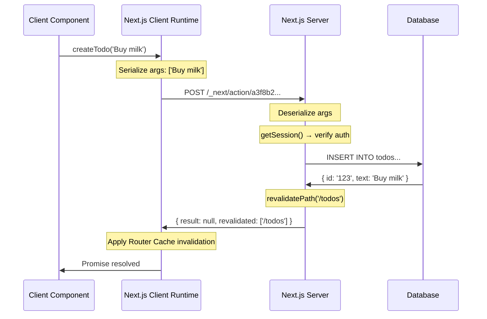

# 65 · Server Actions Deep Dive

> **Server Actions are async functions marked with 'use server' that execute exclusively on the server but can be called from Client Components, HTML form actions, and even other Server Components. They are not API endpoints — they're RPC-style function calls that Next.js's compiler and runtime transform into HTTP requests under the hood, eliminating the need to write, route, and maintain manual API endpoints for mutations. This document goes deeper than the introductory coverage in Part X: how Server Actions work at the protocol level, the security model that makes them safe, advanced composition patterns, error handling strategies, and the edge cases that bite production applications.**

The most important architectural shift Server Actions represent is the elimination of the client-server impedance mismatch for mutations. Before Server Actions, every mutation required: a client-side event handler, a fetch() call to a manually defined API route, server-side code to handle that route, error propagation back through HTTP status codes, and client-side state management to reflect the result. Server Actions collapse this into: an async function call that happens to execute on the server. But this simplicity is built on a careful protocol implementation that's worth understanding in depth.

---

## Table of Contents

- [How Server Actions Work at the Protocol Level](#how-server-actions-work-at-the-protocol-level)
- [The 'use server' Directive: Compilation vs Runtime](#the-use-server-directive-compilation-vs-runtime)
- [The Server Action Security Model](#the-server-action-security-model)
- [Form Actions vs Imperative Calls](#form-actions-vs-imperative-calls)
- [Progressive Enhancement with Form Actions](#progressive-enhancement-with-form-actions)
- [useActionState: The State Management Primitive](#useactionstate-the-state-management-primitive)
- [useFormStatus: Per-Field Pending States](#useformstatus-per-field-pending-states)
- [useOptimistic with Server Actions](#useoptimistic-with-server-actions)
- [Error Handling Strategies](#error-handling-strategies)
- [Server Actions and Redirects](#server-actions-and-redirects)
- [Server Actions in Server Components](#server-actions-in-server-components)
- [Serialization: What Can Be Passed In and Out](#serialization-what-can-be-passed-in-and-out)
- [Closures and Server Actions](#closures-and-server-actions)
- [File Upload Handling](#file-upload-handling)
- [Server Actions vs Route Handlers: When to Use Each](#server-actions-vs-route-handlers-when-to-use-each)
- [Architecture Diagrams](#architecture-diagrams)
- [Good Practices](#good-practices)
- [Bad Practices](#bad-practices)
- [Mental Model](#mental-model)
- [Common Misconceptions](#common-misconceptions)
- [Exercises](#exercises)
- [Further Reading](#further-reading)

---

## How Server Actions Work at the Protocol Level

When you write a Server Action and call it from a Client Component, this is what actually happens at the network level:

```tsx
// actions.ts
"use server";
export async function createTodo(text: string) {
  await db.todos.create({ data: { text } });
  revalidatePath("/todos");
}

// TodoForm.tsx (Client Component)
("use client");
import { createTodo } from "./actions";

function TodoForm() {
  return <button onClick={() => createTodo("Buy groceries")}>Add Todo</button>;
}
```

```
WHAT NEXT.JS DOES AT BUILD TIME:
  1. Identifies createTodo as a Server Action (via 'use server')
  2. Generates a unique action ID: a content-hash like
     "a3f8b2c1d4e5f6a7b8c9d0e1f2a3b4c5"
  3. Creates a server-side handler that maps this ID to the function
  4. Replaces the import in the client bundle with a STUB:
     // What the client bundle actually gets (simplified):
     const createTodo = createServerAction("a3f8b2c1d4e5f6a7b8c9d0e1f2a3b4c5");

WHAT HAPPENS AT RUNTIME WHEN THE BUTTON IS CLICKED:
  1. Client calls createTodo('Buy groceries')
  2. The stub serializes the arguments: ['Buy groceries']
  3. Sends: POST /_next/action/a3f8b2c1d4e5f6a7b8c9d0e1f2a3b4c5
     Content-Type: application/x-www-form-urlencoded (or multipart)
     Body: { 0: 'Buy groceries' }
     (Next.js internal header: Next-Action: a3f8b2c1d4e5f6a7b8c9d0e1f2a3b4c5)

  4. Server receives the POST:
     - Verifies the action ID against the registered action registry
     - Deserializes the arguments
     - Calls the original createTodo function with those arguments
     - Executes the function body (DB write, revalidation)

  5. Server responds with:
     - The action's return value (if any), serialized
     - A diff of what the React tree should look like after revalidation
     - Cache invalidation metadata for the Router Cache

  6. Client receives the response:
     - Updates the React tree if the action returned RSC output
     - Applies Router Cache invalidations
     - Resolves the Promise returned by the createTodo() call
```

---

## The 'use server' Directive: Compilation vs Runtime

`'use server'` is processed at COMPILE TIME, not runtime:

```
WHAT THE COMPILER DOES WITH 'use server':

File-level 'use server' (at the top of the file):
  Every export in this file becomes a Server Action.
  The compiler:
    1. Generates a unique ID for each exported function
    2. Registers each function in the server-side action registry
    3. Replaces the export in client bundles with a callable stub

Inline 'use server' (inside a function body):
  Only that specific function becomes a Server Action.
  Typically used inside Server Components for form actions:

  async function MyForm() {
    async function handleSubmit(formData: FormData) {
      'use server'; // ← this specific function only
      await db.save(parseFormData(formData));
    }
    return <form action={handleSubmit}>...</form>;
  }

WHAT THIS MEANS:
  - Server Action code NEVER runs on the client (it's not in the bundle)
  - The client only has the stub (a function that makes an HTTP request)
  - The server has the actual implementation in the action registry
  - The ID is a content hash — it changes when the function body changes,
    which prevents stale client stubs from calling outdated server code
```

---

## The Server Action Security Model

Server Actions are exposed as publicly callable HTTP endpoints — understanding the security model is critical:

### Actions are public by default

```
Every Server Action creates an HTTP endpoint at:
  POST /_next/action/<action-id>

This endpoint is:
  - Callable by ANYONE with the action ID (not just your app's UI)
  - Not protected by any authentication by default
  - Accessible cross-origin to any client that can make a POST request

THIS MEANS:
  The action ID is NOT a security mechanism — it's just a routing key.
  Security must be implemented INSIDE the action via your own auth checks.
```

### Mandatory authentication pattern

```tsx
// ❌ DANGEROUS: no auth check — anyone can delete ANY todo
"use server";
export async function deleteTodo(todoId: string) {
  await db.todos.delete({ where: { id: todoId } });
}

// ✅ CORRECT: always validate that the caller owns the resource
("use server");
export async function deleteTodo(todoId: string) {
  const session = await getSession(); // reads from cookies
  if (!session) throw new Error("Not authenticated");

  const todo = await db.todos.findUnique({ where: { id: todoId } });
  if (!todo) throw new Error("Not found");
  if (todo.userId !== session.userId) throw new Error("Forbidden");

  await db.todos.delete({ where: { id: todoId } });
  revalidatePath("/todos");
}
```

### Input validation

```tsx
// ❌ DANGEROUS: trusting client-provided input without validation
export async function createProduct(formData: FormData) {
  const price = Number(formData.get("price"));
  await db.products.create({ data: { price } }); // NaN, negative, infinity?
}

// ✅ CORRECT: validate all inputs before using them
import { z } from "zod";

const CreateProductSchema = z.object({
  name: z.string().min(1).max(200),
  price: z.number().positive().max(1_000_000),
  category: z.enum(["electronics", "clothing", "food"]),
});

export async function createProduct(formData: FormData) {
  const session = await getSession();
  if (!session?.user.isAdmin) throw new Error("Forbidden");

  const result = CreateProductSchema.safeParse({
    name: formData.get("name"),
    price: Number(formData.get("price")),
    category: formData.get("category"),
  });

  if (!result.success) {
    return { error: "Invalid product data", details: result.error.flatten() };
  }

  await db.products.create({ data: result.data });
  revalidatePath("/products");
}
```

### CSRF protection

```
Server Actions are CSRF-protected by Next.js by default:
  - Same-origin check: the Next-Action header is set by Next.js's
    own client-side code; external sites can't easily set it
  - For additional protection, Next.js checks the Origin/Referer
    headers against the configured host

What this means practically:
  - Server Actions from LEGITIMATE clients are safe against basic CSRF
  - But the endpoint is still callable from curl/Postman/scripts with
    the correct action ID and headers — "CSRF protection" here means
    "the UI's automatic invocations are protected," not "only the UI
    can call this"
  - Per-action authentication (getSession()) is still mandatory for
    any action that reads or modifies user data
```

---

## Form Actions vs Imperative Calls

Server Actions can be called in two ways, with different semantics:

```tsx
// WAY 1: Form action (HTML form integration)
// Works without JavaScript! Progressive enhancement.
function TodoForm() {
  async function createTodo(formData: FormData) {
    "use server";
    await db.todos.create({ data: { text: formData.get("text") as string } });
  }

  return (
    <form action={createTodo}>
      <input name="text" placeholder="New todo" />
      <button type="submit">Add</button>
    </form>
  );
}
// When action is on a <form>:
//   - formData is automatically constructed from form fields
//   - Works without JS (native HTML form submit)
//   - With JS: intercepts submit, uses the fetch-based protocol

// WAY 2: Imperative call (any event, any trigger)
("use client");
import { createTodo } from "./actions";

function TodoButton({ text }: { text: string }) {
  const [isPending, startTransition] = useTransition();

  return (
    <button
      onClick={() => startTransition(() => createTodo(text))}
      disabled={isPending}
    >
      {isPending ? "Adding..." : "Add Todo"}
    </button>
  );
}
// When called imperatively:
//   - Arguments are whatever you pass (not constrained to FormData)
//   - Requires JavaScript
//   - More flexible but no progressive enhancement
```

---

## Progressive Enhancement with Form Actions

When a Server Action is used as a `<form action>`, it works without JavaScript via native HTML form submission:

```tsx
// This form works even with JavaScript disabled:
export default async function NewTodoPage() {
  async function createTodo(formData: FormData) {
    "use server";
    const text = formData.get("text") as string;
    if (!text.trim()) return;
    await db.todos.create({ data: { text } });
    redirect("/todos"); // redirect works in both JS and no-JS contexts
  }

  return (
    <form action={createTodo}>
      <input
        name="text"
        required
        minLength={1}
        maxLength={200}
        placeholder="What needs to be done?"
      />
      <button type="submit">Add Todo</button>
    </form>
  );
}

// WITHOUT JS: browser submits form natively → POST /_next/action/...
//   → Server executes createTodo → redirect() → browser follows redirect
//   → User sees the updated todos list
//   Full functionality, zero JavaScript

// WITH JS: Next.js intercepts submit → creates fetch request
//   → Server executes createTodo → redirect() intercepted by client router
//   → Client-side navigation (faster, smoother)
```

HTML form constraints (required, minLength, type="email", etc.) provide free validation that works without JS. For maximum progressive enhancement, use semantic HTML form attributes as the first line of validation defense.

---

## useActionState: The State Management Primitive

`useActionState` connects a Server Action to a Client Component's state, handling the loading/error/success cycle:

```tsx
"use client";
import { useActionState } from "react";
import { createTodo } from "./actions";

// The action must accept (prevState, formData) when used with useActionState
async function createTodoAction(prevState: ActionState, formData: FormData) {
  "use server";
  const text = formData.get("text") as string;

  if (!text.trim()) {
    return { error: "Todo text cannot be empty", success: false };
  }

  try {
    await db.todos.create({ data: { text } });
    revalidatePath("/todos");
    return { error: null, success: true, createdText: text };
  } catch (e) {
    return {
      error: "Failed to create todo. Please try again.",
      success: false,
    };
  }
}

interface ActionState {
  error: string | null;
  success: boolean;
  createdText?: string;
}

const INITIAL_STATE: ActionState = { error: null, success: false };

function TodoForm() {
  const [state, formAction, isPending] = useActionState(
    createTodoAction,
    INITIAL_STATE,
  );

  return (
    <form action={formAction}>
      {state.success && <p className="success">Added: {state.createdText}</p>}
      {state.error && <p className="error">{state.error}</p>}
      <input name="text" placeholder="New todo" disabled={isPending} />
      <button type="submit" disabled={isPending}>
        {isPending ? "Adding..." : "Add Todo"}
      </button>
    </form>
  );
}
```

### useActionState signature

```tsx
const [state, formAction, isPending] = useActionState(
  action,        // async (prevState: S, formData: FormData) => S
  initialState,  // S — the state before any action has been called
  permalink?     // optional: URL for progressive enhancement history
);

// state: the current state (initialState before first call, then action's return)
// formAction: the wrapped action to pass to <form action={...}>
// isPending: true while the action is in flight
```

---

## useFormStatus: Per-Field Pending States

`useFormStatus` provides the pending state of the NEAREST parent form, allowing individual form elements to respond to submission:

```tsx
"use client";
import { useFormStatus } from "react-dom";

// Must be inside a component that's a CHILD of the <form>
function SubmitButton() {
  const { pending } = useFormStatus();

  return (
    <button type="submit" disabled={pending}>
      {pending ? (
        <>
          <Spinner />
          Saving...
        </>
      ) : (
        "Save"
      )}
    </button>
  );
}

function ProductForm() {
  async function saveProduct(formData: FormData) {
    "use server";
    await db.products.create({
      /* ... */
    });
  }

  return (
    <form action={saveProduct}>
      <input name="name" />
      <input name="price" type="number" />
      <SubmitButton /> {/* has access to the form's pending state */}
    </form>
  );
}
```

```
Why useFormStatus works this way:
  - It reads the pending state from React context (the form's own action state)
  - It MUST be inside a component rendered as a CHILD of the <form> element —
    not inside the same component as the <form> itself
  - If the SubmitButton is in the same component as the <form>, it won't work
  - The solution: extract it to a separate child component
```

---

## useOptimistic with Server Actions

`useOptimistic` allows showing the expected result of a mutation immediately, before the server confirms:

```tsx
"use client";
import { useOptimistic } from "react";
import { addTodo } from "./actions";

type Todo = { id: string; text: string; status: "pending" | "saved" };

function TodoList({ initialTodos }: { initialTodos: Todo[] }) {
  const [optimisticTodos, addOptimisticTodo] = useOptimistic(
    initialTodos,
    (currentTodos: Todo[], newTodoText: string): Todo[] => [
      ...currentTodos,
      {
        id: "temp-" + Date.now(), // temporary ID
        text: newTodoText,
        status: "pending", // visual indicator: not yet saved
      },
    ],
  );

  async function handleSubmit(formData: FormData) {
    const text = formData.get("text") as string;
    addOptimisticTodo(text); // UI updates IMMEDIATELY
    await addTodo(text); // network request in background
    // If addTodo throws, React automatically rolls back the optimistic state
  }

  return (
    <>
      <ul>
        {optimisticTodos.map((todo) => (
          <li
            key={todo.id}
            style={{ opacity: todo.status === "pending" ? 0.5 : 1 }}
          >
            {todo.text}
            {todo.status === "pending" && " (saving...)"}
          </li>
        ))}
      </ul>
      <form action={handleSubmit}>
        <input name="text" />
        <button type="submit">Add</button>
      </form>
    </>
  );
}
```

---

## Error Handling Strategies

Server Actions have two error channels: returned values and thrown exceptions.

```tsx
"use server";

// STRATEGY 1: Return error objects (for expected, handleable errors)
// Good for: validation failures, "not found", business rule violations
export async function updateProduct(id: string, formData: FormData) {
  if (!(await isAdmin())) {
    return { error: "Unauthorized", field: null };
  }

  const name = formData.get("name") as string;
  if (!name.trim()) {
    return { error: "Name is required", field: "name" };
  }

  await db.products.update({ where: { id }, data: { name } });
  return { error: null }; // success
}

// STRATEGY 2: Throw errors (for unexpected, unrecoverable errors)
// Good for: infrastructure failures, programming errors
// These propagate to the nearest error.tsx boundary
export async function criticalOperation(id: string) {
  const session = await getSession();
  if (!session) throw new Error("Not authenticated"); // ← caught by error.tsx

  try {
    await db.critical.update({ where: { id }, data: { done: true } });
  } catch (e) {
    // Log the full error server-side (safe — never sent to client)
    console.error("Database error in criticalOperation:", e);
    // Throw a SAFE error to the client (no internal details leaked)
    throw new Error("Operation failed. Please try again.");
  }
}

// STRATEGY 3: redirect() — not an error, but changes the flow
// Works from inside a Server Action regardless of try/catch context
export async function createAndRedirect(formData: FormData) {
  const item = await db.items.create({ data: parseFormData(formData) });
  revalidatePath("/items");
  redirect(`/items/${item.id}`); // ← throws internally, must not be in try/catch
}

// ⚠️ Common mistake: wrapping redirect() in try/catch
export async function BAD_createAndRedirect(formData: FormData) {
  try {
    const item = await db.items.create({ data: parseFormData(formData) });
    redirect(`/items/${item.id}`); // ❌ redirect() throws; this catch will catch it!
  } catch (e) {
    console.error("Error:", e); // ← catches the redirect "error" — broken
  }
}

// ✅ Fix: check if the thrown error IS a redirect before handling
export async function GOOD_createAndRedirect(formData: FormData) {
  let item;
  try {
    item = await db.items.create({ data: parseFormData(formData) });
  } catch (e) {
    console.error("Error creating item:", e);
    return { error: "Failed to create item" };
  }
  revalidatePath("/items");
  redirect(`/items/${item.id}`); // outside try/catch
}
```

---

## Server Actions and Redirects

`redirect()` and `notFound()` from `next/navigation` work inside Server Actions but with specific semantics:

```tsx
import { redirect, notFound } from "next/navigation";

export async function saveForm(formData: FormData) {
  "use server";
  const result = await processForm(formData);

  if (result.status === "not-found") {
    notFound(); // renders the nearest not-found.tsx
  }

  if (result.success) {
    redirect("/success"); // navigates client-side (with JS) or HTTP redirect (without)
  }
}

// redirect() implementation detail:
// redirect() works by THROWING a special error object that Next.js
// catches and converts to an HTTP 307 redirect response (without JS)
// or a client-side router navigation (with JS).
//
// Because it throws internally, it CANNOT be inside a try/catch block
// that catches all errors. Structure your code to call redirect() only
// outside of try/catch, or check `isRedirectError(e)` from next/dist:

import { isRedirectError } from "next/dist/client/components/redirect";

export async function safeRedirectAction(formData: FormData) {
  try {
    const item = await db.create({ data: parseFormData(formData) });
    redirect(`/items/${item.id}`);
  } catch (e) {
    if (isRedirectError(e)) throw e; // re-throw redirect errors
    return { error: "Failed to create" };
  }
}
```

---

## Server Actions in Server Components

Server Actions can be defined and passed from Server Components to Client Components:

```tsx
// Server Component: defines the action
async function ProductSection({ productId }: { productId: string }) {
  async function deleteProduct() {
    "use server";
    // productId is CAPTURED from the closure — see next section
    const session = await getSession();
    if (!session?.user.isAdmin) throw new Error("Forbidden");
    await db.products.delete({ where: { id: productId } });
    revalidatePath("/products");
    redirect("/products");
  }

  const product = await db.products.findUnique({ where: { id: productId } });

  return (
    <div>
      <h1>{product?.name}</h1>
      {/* Pass the action to a Client Component */}
      <DeleteButton onDelete={deleteProduct} />
    </div>
  );
}

// Client Component: receives and calls the action
("use client");
function DeleteButton({ onDelete }: { onDelete: () => Promise<void> }) {
  const [isPending, startTransition] = useTransition();
  return (
    <button onClick={() => startTransition(onDelete)} disabled={isPending}>
      {isPending ? "Deleting..." : "Delete Product"}
    </button>
  );
}
```

---

## Serialization: What Can Be Passed In and Out

### Arguments passed INTO a Server Action

```tsx
// ✅ Primitives
createTodo("Buy groceries", 42, true);

// ✅ Plain objects (must be JSON-serializable)
updateUser({ name: "Alice", age: 30 });

// ✅ Arrays of serializable values
batchCreate(["item1", "item2", "item3"]);

// ✅ FormData (automatically passed from <form action>)
handleSubmit(formData);

// ✅ File / Blob (for uploads via FormData)
handleUpload(formData); // where formData includes File inputs

// ❌ Functions
doSomething(myCallback); // cannot serialize functions

// ❌ Class instances
doSomething(new MyClass()); // cannot serialize non-plain objects

// ❌ Symbols, Maps, Sets (must convert to serializable equivalents)
doSomething(new Map([["key", "value"]])); // use plain objects instead
```

### Values returned FROM a Server Action

```tsx
// ✅ Primitives, plain objects, arrays — same rules as input
// ✅ null, undefined
// ✅ React elements/JSX (for returning server-rendered RSC fragments)
// ❌ Functions, class instances, DOM nodes
```

---

## Closures and Server Actions

Inline Server Actions (defined inside Server Components) can capture variables from their outer scope via closures:

```tsx
async function ProductCard({ productId, userId }: Props) {
  // productId and userId are captured by the closure
  async function toggleFavorite() {
    "use server";
    // productId and userId are available here
    // BUT: they are SERIALIZED into the action's closure at build time
    await db.favorites.toggle({ userId, productId });
    revalidatePath("/products");
  }

  return (
    <form action={toggleFavorite}>
      <button type="submit">⭐ Favorite</button>
    </form>
  );
}
```

### The security implication of closure capture

```
Captured variables are SERIALIZED into the action's payload.
When the client calls the action, the serialized closure values
are sent back to the server as part of the request.

CRITICALLY: if you capture sensitive values in a closure,
those values are sent to the client (as part of the action stub)
and back to the server on each call.

✅ SAFE to capture: public IDs, non-sensitive config values
❌ UNSAFE to capture: passwords, private keys, secret tokens,
                      any value that shouldn't leave the server

// ❌ DANGEROUS: capturing a secret in a closure
async function SendEmailForm({ apiKey }: { apiKey: string }) {
  async function sendEmail(formData: FormData) {
    'use server';
    await emailService.send({ apiKey, ...parseFormData(formData) });
    // apiKey IS EXPOSED to the client via the closure serialization!
  }
  // ...
}

// ✅ SAFE: read secrets server-side inside the action
async function sendEmail(formData: FormData) {
  'use server';
  const apiKey = process.env.EMAIL_API_KEY; // read from server env at call time
  await emailService.send({ apiKey, ...parseFormData(formData) });
}
```

---

## File Upload Handling

Server Actions handle file uploads via `FormData`:

```tsx
// Server Action
export async function uploadAvatar(formData: FormData) {
  "use server";
  const session = await getSession();
  if (!session) throw new Error("Not authenticated");

  const file = formData.get("avatar") as File;
  if (!file || file.size === 0) {
    return { error: "No file provided" };
  }

  if (!file.type.startsWith("image/")) {
    return { error: "File must be an image" };
  }

  if (file.size > 5 * 1024 * 1024) {
    return { error: "File must be under 5MB" };
  }

  const bytes = await file.arrayBuffer();
  const buffer = Buffer.from(bytes);

  // Upload to storage service
  const url = await uploadToS3(buffer, {
    key: `avatars/${session.userId}/${Date.now()}-${file.name}`,
    contentType: file.type,
  });

  await db.users.update({
    where: { id: session.userId },
    data: { avatar: url },
  });

  revalidatePath("/profile");
  return { success: true, url };
}

// Client Component form
("use client");
function AvatarUploadForm() {
  const [state, formAction] = useActionState(uploadAvatar, {
    error: null,
    success: false,
  });

  return (
    <form action={formAction}>
      <input type="file" name="avatar" accept="image/*" />
      <button type="submit">Upload</button>
      {state.error && <p className="error">{state.error}</p>}
      {state.success && <p className="success">Avatar updated!</p>}
    </form>
  );
}
```

---

## Server Actions vs Route Handlers: When to Use Each

```
USE SERVER ACTIONS when:
  ✅ Handling form submissions (the primary use case)
  ✅ Mutations triggered by user interaction (delete, toggle, update)
  ✅ Operations that need tight integration with RSC re-rendering
     (revalidation + UI update in one step)
  ✅ Progressive enhancement is desired (works without JS)
  ✅ The operation is called FROM React components

USE ROUTE HANDLERS when:
  ✅ Building an API consumed by third-party clients (mobile apps, other services)
  ✅ Webhooks (external services calling your endpoint)
  ✅ Custom HTTP methods (GET with complex caching, DELETE, PATCH)
  ✅ Streaming responses (ReadableStream, SSE)
  ✅ Setting custom response headers (not possible with Server Actions)
  ✅ The caller is NOT a React component in your Next.js app
```

---

## Architecture Diagrams

### Server Action execution flow



### Security validation layers

```mermaid
graph TD
    A["Client calls Server Action"] --> B{Origin/host check<br/>CSRF baseline}
    B -->|Fail| C[Reject 403]
    B -->|Pass| D{Action ID<br/>in registry?}
    D -->|No| E[Reject 404]
    D -->|Yes| F{getSession()<br/>→ authenticated?}
    F -->|No| G[throw Error('Not authenticated')]
    F -->|Yes| H{User authorized<br/>for this resource?}
    H -->|No| I[throw Error('Forbidden')]
    H -->|Yes| J{Input validation<br/>passes schema?}
    J -->|No| K[return { error: 'Invalid input' }]
    J -->|Yes| L[Execute mutation]
    L --> M[revalidate + respond]

    style C fill:#e8491d,color:#fff
    style G fill:#e8491d,color:#fff
    style I fill:#e8491d,color:#fff
    style K fill:#f39c12,color:#000
    style M fill:#27ae60,color:#fff
```

---

## Good Practices

### ✅ Good Practice — A production-ready Server Action with full validation, auth, and error handling

```tsx
"use server";
import { z } from "zod";
import { revalidatePath } from "next/cache";
import { redirect } from "next/navigation";
import { getSession } from "@/lib/auth";
import { db } from "@/lib/db";

const UpdateProductSchema = z.object({
  name: z.string().min(1, "Name is required").max(200),
  price: z.coerce.number().positive("Price must be positive").max(100000),
  description: z.string().max(2000).optional(),
});

type UpdateProductState = {
  error: string | null;
  fieldErrors?: Record<string, string[]>;
};

export async function updateProduct(
  productId: string,
  _prevState: UpdateProductState,
  formData: FormData,
): Promise<UpdateProductState> {
  // 1. Authentication
  const session = await getSession();
  if (!session) return { error: "You must be logged in" };

  // 2. Authorization: only admins or product owners
  const product = await db.products.findUnique({ where: { id: productId } });
  if (!product) return { error: "Product not found" };
  if (!session.user.isAdmin && product.ownerId !== session.userId) {
    return { error: "You do not have permission to edit this product" };
  }

  // 3. Input validation
  const parsed = UpdateProductSchema.safeParse(Object.fromEntries(formData));
  if (!parsed.success) {
    return {
      error: "Please fix the errors below",
      fieldErrors: parsed.error.flatten().fieldErrors,
    };
  }

  // 4. Mutation (after all checks pass)
  try {
    await db.products.update({
      where: { id: productId },
      data: parsed.data,
    });
  } catch (e) {
    console.error("[updateProduct] DB error:", e);
    return { error: "Failed to save changes. Please try again." };
  }

  // 5. Cache invalidation + redirect (after successful mutation)
  revalidatePath(`/products/${productId}`);
  revalidatePath("/products");
  redirect(`/products/${productId}`);
}
```

---

## Bad Practices

### ⚠️ Bad Practice — Trusting client-provided IDs without authorization

```tsx
/**
 * Bad: The productId comes from the client. Any user can craft a
 * request with any productId and delete ANY product in the system.
 * This is an IDOR (Insecure Direct Object Reference) vulnerability —
 * one of the most common and severe security issues in Server Actions.
 */
"use server";
export async function deleteProduct(productId: string) {
  // ❌ No auth check
  // ❌ No verification that the current user owns this product
  // Anyone can call: deleteProduct('any-product-id-in-the-database')
  await db.products.delete({ where: { id: productId } });
  revalidatePath("/products");
}

/**
 * ✅ Fix: Always verify ownership/permission before acting on client-provided IDs
 */
("use server");
export async function deleteProduct(productId: string) {
  const session = await getSession();
  if (!session) throw new Error("Not authenticated");

  const product = await db.products.findUnique({
    where: { id: productId },
    select: { id: true, ownerId: true },
  });

  if (!product) return { error: "Product not found" };

  // Check ownership OR admin role
  if (product.ownerId !== session.userId && !session.user.isAdmin) {
    throw new Error("Forbidden");
  }

  await db.products.delete({ where: { id: productId } });
  revalidatePath("/products");
}
```

**Production impact:** A company's early App Router implementation had Server Actions for their internal admin panel without auth checks, under the assumption that "only admins have access to the admin UI." But Server Action endpoints are publicly accessible — anyone who discovered the action ID could call `deleteRecord(anyId)` without ever logging in. Found during a security audit before production launch. All 14 admin Server Actions needed immediate remediation.

---

## Mental Model

> 💡 **The Server Action mental model:**
>
> Server Actions are like **pneumatic tubes in a department store** — the customer (Client Component) fills out a form (serializes arguments) and sends it through the tube (HTTP POST) to the stockroom (Next.js server). The stockroom staff (the actual function body) receive the form, check that the request makes sense (auth + validation), fulfill it (DB mutation), and send back a confirmation (return value + revalidation signal) through the same tube. The customer never enters the stockroom — they can't see the inventory system or the staff credentials. Critically: the TUBE NUMBER (action ID) is visible to the customer, but that doesn't mean anyone with a tube number can send unauthorized requests — there's a staff member at the stockroom end checking every form for a valid ID badge before doing anything.

---

## Common Misconceptions

### "Server Actions are API routes with extra steps"

Server Actions are RPC calls that integrate directly with React's rendering model — they handle revalidation, Router Cache invalidation, and return values that React can use directly. API route handlers are HTTP endpoints for external consumption. The programming model is fundamentally different even if they can achieve similar outcomes.

### "Server Actions are safe because the code runs on the server"

Running on the server doesn't mean it's secure. The action endpoint is publicly callable. Security comes from the auth and validation logic you write INSIDE the action — not from the execution environment.

### "redirect() can be inside a try/catch block"

`redirect()` works by throwing an internal Next.js error object that propagates up the call stack to be caught by Next.js's own error handling. If your `try/catch` catches it first, the redirect won't happen. Either call `redirect()` outside any `try/catch`, or re-throw redirect errors by checking `isRedirectError(e)`.

### "Captured closure variables in Server Actions are safe if they're IDs"

Generally true for public IDs (product IDs, post slugs). But sensitive values (API keys, access tokens, passwords) captured in closures are serialized into the client bundle and transmitted on every action call — they should be read from environment variables inside the action, not captured from outer scope.

### "useFormStatus works inside the same component as the form"

`useFormStatus()` reads context from the nearest ancestor `<form>` element. If it's called in the same component that RENDERS the `<form>`, there's no ancestor form yet — the call finds nothing. It must be in a CHILD component that renders inside the form element's children.

---

## Exercises

### Exercise 1 — Build a Server Action with full security

Create a "delete comment" Server Action where:

1. User must be authenticated (check session via cookies)
2. Comment must exist (return 'not found' if not)
3. User must own the comment OR be an admin
4. Validate that the commentId is a valid format (e.g., a cuid or uuid)
5. Log the deletion with the user's ID and timestamp for audit purposes

### Exercise 2 — Fix the redirect-in-try/catch bug

```tsx
export async function createItem(formData: FormData) {
  try {
    const item = await db.items.create({
      data: { name: formData.get("name") as string },
    });
    redirect(`/items/${item.id}`);
  } catch (e) {
    return { error: "Something went wrong" };
  }
}
```

This function never redirects — find the bug and fix it two different ways: (a) by restructuring the try/catch, and (b) by using `isRedirectError()`.

### Exercise 3 — Implement optimistic updates for a like button

Build a blog post "like" feature:

1. Server Action: toggleLike(postId) — toggles the user's like, revalidates
2. Client Component: LikeButton — shows current like count and liked state
3. Optimistic update: the count increments/decrements instantly on click
4. Error handling: if the action fails, the optimistic state rolls back

---

## Further Reading

- [Next.js docs: Server Actions and Mutations](https://nextjs.org/docs/app/building-your-application/data-fetching/server-actions-and-mutations) — comprehensive official guide
- [React Docs: useActionState](https://react.dev/reference/react/useActionState) — state management primitive
- [React Docs: useOptimistic](https://react.dev/reference/react/useOptimistic) — optimistic update primitive
- [React Docs: useFormStatus](https://react.dev/reference/react-dom/hooks/useFormStatus) — form pending state
- [OWASP: IDOR vulnerability](https://owasp.org/www-project-web-security-testing-guide/latest/4-Web_Application_Security_Testing/05-Authorization_Testing/04-Testing_for_Insecure_Direct_Object_References) — the security risk in Server Actions without auth checks
- Next in this handbook: [66 · Parallel & Intercepting Routes](./10-parallel-routes.md)

---

_Part of the [React + Next.js Engineering Handbook](../../README.md)_
