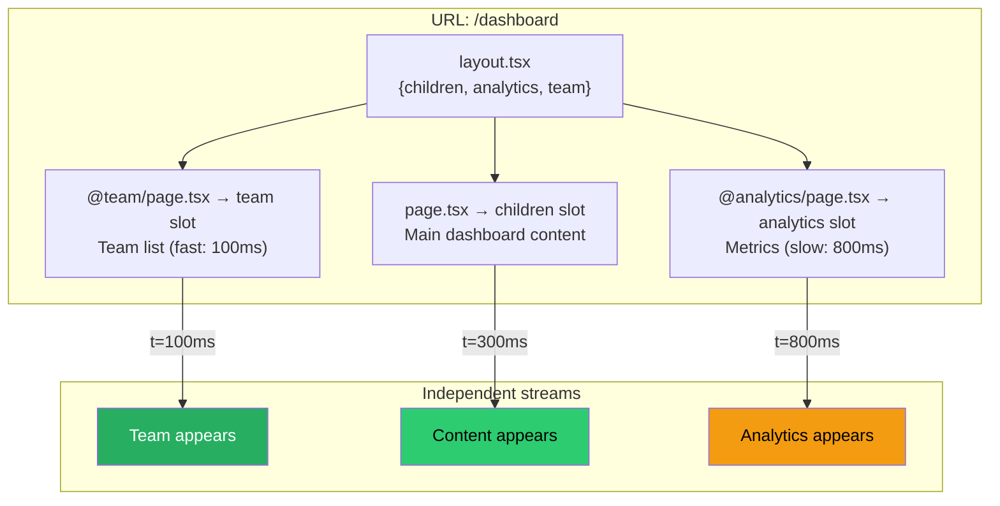

# 66 · Parallel & Intercepting Routes

> **Parallel Routes and Intercepting Routes are two advanced App Router features that together enable UI patterns impossible or extremely awkward to build with the Pages Router: simultaneously rendering multiple independent pages in the same layout, showing a modal with its own URL without navigating away from the current page, and creating "soft" navigation that loads a lightweight version of a resource while the direct URL loads the full version. These features are complex by nature — they exist to solve genuinely complex UI problems — and understanding them requires grasping how the App Router's file system and routing work at a level deeper than the typical page.tsx/layout.tsx model.**

Most Next.js applications don't need either of these features. They exist for specific, high-value UI patterns: parallel dashboards where independent sections can load and refresh independently, photo gallery modals that preserve the underlying grid while showing a focused view with a shareable URL, and side-by-side editors where two routes are simultaneously rendered. If your application has none of these patterns, this document is for future reference. If it does — or if you've ever wondered how Instagram-style routing (click a photo → modal appears, but right-clicking the modal link opens the full photo page) works in React — this is the document that explains it.

---

## Table of Contents

- [Parallel Routes: The Core Concept](#parallel-routes-the-core-concept)
- [Named Slots: The @folder Convention](#named-slots-the-folder-convention)
- [Default Files and Empty States](#default-files-and-empty-states)
- [Independent Loading and Error States](#independent-loading-and-error-states)
- [Conditional Parallel Rendering](#conditional-parallel-rendering)
- [Intercepting Routes: The Core Concept](#intercepting-routes-the-core-concept)
- [The Intercepting Route Conventions](#the-intercepting-route-conventions)
- [The Canonical Pattern: Modal with Shareable URL](#the-canonical-pattern-modal-with-shareable-url)
- [Intercepting Routes and the Full Page Load](#intercepting-routes-and-the-full-page-load)
- [Combining Parallel and Intercepting Routes](#combining-parallel-and-intercepting-routes)
- [When to Use Each Feature](#when-to-use-each-feature)
- [Common File System Structures](#common-file-system-structures)
- [Architecture Diagrams](#architecture-diagrams)
- [Good Practices](#good-practices)
- [Bad Practices](#bad-practices)
- [Mental Model](#mental-model)
- [Common Misconceptions](#common-misconceptions)
- [Exercises](#exercises)
- [Further Reading](#further-reading)

---

## Parallel Routes: The Core Concept

Parallel Routes allow a single layout to simultaneously render multiple SEPARATE page-level components, each with their own URL segment, loading state, error boundary, and independent data fetching:

```
Without Parallel Routes:
  A dashboard layout can render ONE page child at a time.
  /dashboard → renders dashboard/page.tsx in the layout's {children} slot

With Parallel Routes:
  A dashboard layout can render MULTIPLE page children simultaneously.
  /dashboard → renders:
    dashboard/page.tsx         in the default {children} slot
    dashboard/@analytics/page.tsx  in the @analytics slot
    dashboard/@team/page.tsx      in the @team slot
  All three render simultaneously, in parallel, each with their own
  loading and error states, each updating independently.
```

The practical benefit: the three sections can have different data-fetching speeds. The analytics panel showing a slow ML-computed metric doesn't block the team list from appearing. Each Suspense boundary (which each slot effectively provides) resolves independently.

---

## Named Slots: The @folder Convention

Parallel Routes are defined by creating folders whose names begin with `@`:

```
app/
  dashboard/
    layout.tsx           ← renders {children}, {analytics}, {team} slots
    page.tsx             ← renders in the {children} slot
    @analytics/
      page.tsx           ← renders in the {analytics} slot
      loading.tsx        ← loading state for this slot only
      error.tsx          ← error state for this slot only
    @team/
      page.tsx           ← renders in the {team} slot
      loading.tsx
```

```tsx
// app/dashboard/layout.tsx
// Each named slot becomes a prop:
export default function DashboardLayout({
  children, // always available — the default slot
  analytics, // the @analytics slot
  team, // the @team slot
}: {
  children: React.ReactNode;
  analytics: React.ReactNode;
  team: React.ReactNode;
}) {
  return (
    <div className="dashboard">
      <main className="dashboard-main">{children}</main>
      <aside className="dashboard-analytics">{analytics}</aside>
      <section className="dashboard-team">{team}</section>
    </div>
  );
}
```

```tsx
// app/dashboard/@analytics/page.tsx
async function AnalyticsPanel() {
  const metrics = await fetchMetrics(); // slow: 800ms
  return <MetricsDisplay metrics={metrics} />;
}

// app/dashboard/@team/page.tsx
async function TeamPanel() {
  const team = await fetchTeamMembers(); // fast: 100ms
  return <TeamList members={team} />;
}

// app/dashboard/page.tsx
async function DashboardMain() {
  const summary = await fetchSummary(); // medium: 300ms
  return <SummaryView summary={summary} />;
}
```

Navigation to `/dashboard` renders all three components simultaneously. The team panel appears at 100ms, the main summary at 300ms, the analytics at 800ms — each in their own independent Suspense boundary.

---

## Default Files and Empty States

A critical requirement of Parallel Routes: every slot must have content for every URL that renders the parent layout. When a URL doesn't have a specific page for a slot, Next.js looks for a `default.tsx` file in that slot:

```
app/
  dashboard/
    layout.tsx             ← {children, analytics, team} slots
    page.tsx               ← /dashboard: children = this
    @analytics/
      page.tsx             ← /dashboard: analytics = this
      default.tsx          ← /dashboard/settings: analytics = this (fallback)
    @team/
      page.tsx             ← /dashboard: team = this
      default.tsx          ← /dashboard/settings: team = this (fallback)
    settings/
      page.tsx             ← /dashboard/settings: children = this
      // @analytics and @team have no settings/ folder
      // So: falls back to default.tsx in each slot
```

```tsx
// app/dashboard/@analytics/default.tsx
// Rendered when there's no @analytics/[specific-route].tsx for the current URL
export default function AnalyticsDefault() {
  return null; // or a placeholder, or the same panel
}
```

If a slot has NO `default.tsx` AND no matching page for the current URL, Next.js will show a 404 error. The `default.tsx` file prevents this "unmatched slot" 404 from occurring.

---

## Independent Loading and Error States

Each slot in a Parallel Route can have its own `loading.tsx` and `error.tsx`:

```
@analytics/
  page.tsx       ← the actual analytics content
  loading.tsx    ← shown while @analytics/page.tsx is loading
  error.tsx      ← shown if @analytics/page.tsx throws

@team/
  page.tsx
  loading.tsx
  error.tsx
```

This is what makes the dashboard pattern genuinely useful: if the analytics service goes down, the team panel and main content are unaffected. The analytics slot shows its own error state while everything else continues normally.

```tsx
// app/dashboard/@analytics/error.tsx
"use client"; // error.tsx must be a Client Component
export default function AnalyticsError({
  error,
  reset,
}: {
  error: Error;
  reset: () => void;
}) {
  return (
    <div className="analytics-error">
      <p>Analytics temporarily unavailable</p>
      <button onClick={reset}>Retry</button>
    </div>
  );
}
```

---

## Conditional Parallel Rendering

Because slots are available as props in the layout, you can conditionally render them based on server-side logic:

```tsx
// app/dashboard/layout.tsx
import { getSession } from "@/lib/auth";

export default async function DashboardLayout({
  children,
  analytics,
  adminPanel,
}: {
  children: React.ReactNode;
  analytics: React.ReactNode;
  adminPanel: React.ReactNode;
}) {
  const session = await getSession();

  return (
    <div className="dashboard">
      <main>{children}</main>
      <aside>{analytics}</aside>
      {session?.user.isAdmin && (
        <section className="admin">{adminPanel}</section>
      )}
    </div>
  );
}
```

The `@adminPanel` slot's server components only execute if the condition renders them — non-admin users don't pay the data-fetching cost for the admin panel.

---

## Intercepting Routes: The Core Concept

Intercepting Routes allow a route to "intercept" what would normally be a full navigation to another page, and instead render that content in the CURRENT layout context — typically as a modal or overlay:

```
WITHOUT intercepting routes:
  User is on /photos (photo grid)
  User clicks photo → full navigation to /photos/456
  Browser navigates: URL changes, layout potentially changes,
  /photos grid is unmounted, /photos/456 page loads

WITH intercepting routes:
  User is on /photos (photo grid)
  User clicks photo → /photos route INTERCEPTS the navigation
  /photos layout stays mounted (grid still visible beneath)
  The photo detail renders as a MODAL over the current layout
  URL changes to /photos/456 (shareable, back-button-aware)

  User hard-refreshes /photos/456 (or opens from another tab):
  No interception — /photos/456 renders its full standalone page
  (the "real" /photos/456/page.tsx)
```

This enables the "Instagram pattern": photos viewed inline as modals when browsed from the grid, but as full pages when opened directly.

---

## The Intercepting Route Conventions

Intercepting routes are defined using special folder naming conventions that indicate WHICH level of the route to intercept:

```
(.)  same level
(..) one level up
(...)  root (from the app directory)

Examples:

app/photos/(.)photos/[id]/           ← intercepts /photos/[id] from /photos level
app/feed/(.)posts/[id]/              ← intercepts /posts/[id] from /feed level
app/shop/(..)(.)products/[id]/      ← intercepts /products/[id] from one level up

The most common pattern is (..) — intercept a sibling or near-sibling route
from a parent layout.
```

---

## The Canonical Pattern: Modal with Shareable URL

The complete implementation of a photo gallery with modal viewing:

### File structure

```
app/
  layout.tsx
  @modal/
    default.tsx          ← renders null when no modal is active
    (.)photos/
      [id]/
        page.tsx         ← the modal content
  photos/
    layout.tsx           ← renders {children} + {modal} props
    page.tsx             ← the photo grid
    [id]/
      page.tsx           ← the full standalone photo page
```

### The layout with a modal slot

```tsx
// app/layout.tsx
export default function RootLayout({
  children,
  modal, // the @modal parallel route slot
}: {
  children: React.ReactNode;
  modal: React.ReactNode;
}) {
  return (
    <html>
      <body>
        {children}
        {modal} {/* renders null or the modal content */}
      </body>
    </html>
  );
}
```

### The modal slot's default (empty state)

```tsx
// app/@modal/default.tsx
export default function ModalDefault() {
  return null; // no modal visible by default
}
```

### The intercepting route modal content

```tsx
// app/@modal/(.)photos/[id]/page.tsx
import { Modal } from "@/components/modal";

async function PhotoModal({ params }: { params: { id: string } }) {
  const photo = await fetchPhoto(params.id);

  return (
    <Modal>
      
      <h2>{photo.title}</h2>
      <p>{photo.description}</p>
    </Modal>
  );
}
```

### The modal UI (Client Component for the close behavior)

```tsx
// components/modal.tsx
"use client";
import { useRouter } from "next/navigation";
import { useEffect, useRef } from "react";

export function Modal({ children }: { children: React.ReactNode }) {
  const router = useRouter();
  const overlayRef = useRef<HTMLDivElement>(null);

  // Close on escape key
  useEffect(() => {
    const onKey = (e: KeyboardEvent) => {
      if (e.key === "Escape") router.back();
    };
    document.addEventListener("keydown", onKey);
    return () => document.removeEventListener("keydown", onKey);
  }, [router]);

  return (
    // Close when clicking the overlay (not the content)
    <div
      ref={overlayRef}
      className="modal-overlay"
      onClick={(e) => e.target === overlayRef.current && router.back()}
    >
      <div className="modal-content">
        <button onClick={() => router.back()} className="modal-close">
          ✕
        </button>
        {children}
      </div>
    </div>
  );
}
```

### The photo grid with Link components

```tsx
// app/photos/page.tsx
async function PhotosPage() {
  const photos = await fetchPhotos();

  return (
    <div className="photo-grid">
      {photos.map((photo) => (
        <Link key={photo.id} href={`/photos/${photo.id}`}>
          
        </Link>
      ))}
    </div>
  );
}
```

### The standalone full page

```tsx
// app/photos/[id]/page.tsx
// This renders when /photos/[id] is loaded directly (no interception)
async function PhotoPage({ params }: { params: { id: string } }) {
  const photo = await fetchPhoto(params.id);

  return (
    <div className="photo-page">
      <Link href="/photos">← Back to Photos</Link>
      
      <h1>{photo.title}</h1>
      <p>{photo.description}</p>
    </div>
  );
}
```

### How it behaves

```
Scenario 1: User on /photos, clicks a photo thumbnail
  → The @modal/(.)photos/[id]/page.tsx is rendered (interception active)
  → URL changes to /photos/123 (shareable)
  → /photos/page.tsx grid remains visible beneath the modal
  → Back button: modal closes, grid is still there

Scenario 2: User types /photos/123 directly in the URL bar
  → No active interception (hard navigation, fresh page load)
  → /photos/[id]/page.tsx renders as a full, standalone page
  → Same URL, different experience appropriate to the context

Scenario 3: User in Scenario 1 copies the URL and sends it
  → Recipient opens /photos/123 fresh → Scenario 2 behavior
  → They see the full photo page (the "canonical" experience)
  → The URL works, the content is shareable, SEO-friendly
```

---

## Intercepting Routes and the Full Page Load

The interception ONLY happens during client-side navigation (clicking a Link). On a full page load (direct URL, refresh), the interception doesn't apply:

```
Client-side navigation to /photos/123:
  App Router detects: "I'm currently on /photos"
  "Is there an intercepting route for /photos/123 within this context?"
  YES → render /app/@modal/(.)photos/[id]/page.tsx as the modal slot

Full page load to /photos/123:
  No "current context" exists — this is a fresh browser load
  Next.js serves: /app/photos/[id]/page.tsx (the real page, no modal)
```

This is the invariant: intercepting routes are a CLIENT-SIDE NAVIGATION concern only. The "real" route always exists as a fallback for direct navigation.

---

## Combining Parallel and Intercepting Routes

The most powerful pattern combines both: parallel routes create the `@modal` slot; intercepting routes populate it during client navigation:

```
The @modal slot is a parallel route — it runs alongside {children}.
The (.)photos/[id] folder is an intercepting route — it captures
the navigation before the real route takes over.

Together:
  - @modal gives the layout a dedicated slot for modal content
  - The interception fills that slot when a link is clicked
  - default.tsx empties that slot when no modal should show
  - router.back() closes the modal by returning to the state
    where default.tsx renders (null)
```

---

## When to Use Each Feature

```
USE PARALLEL ROUTES when:
  ✅ A dashboard layout needs multiple independently-loading sections
  ✅ You want independent error boundaries for different parts of a layout
  ✅ Different sections of a page load at very different speeds and you
     want the fast ones to appear immediately without waiting for slow ones
  ✅ You need to conditionally render entire page-level sections
     based on user role or feature flags

USE INTERCEPTING ROUTES when:
  ✅ You want modal-style viewing of a resource that has its own URL
     (the "Instagram pattern": photos, products, search results)
  ✅ You want clicking a link to show a preview/modal while preserving
     the underlying page (drawer panels, quick-view modals)
  ✅ You want the modal URL to be shareable AND the direct URL to
     show the full page (both experiences from the same URL)

DON'T USE EITHER when:
  ❌ A simple Suspense boundary with a loading skeleton is sufficient
  ❌ A client-side Dialog/Modal component (no URL needed) is simpler
  ❌ You just need client-state-driven show/hide (useState is enough)
  ❌ The added file structure complexity isn't justified by the UX gain
```

---

## Common File System Structures

### Dashboard with parallel sections

```
app/
  dashboard/
    layout.tsx         ← { children, activity, notifications }
    page.tsx           ← main dashboard content
    @activity/
      default.tsx
      page.tsx
    @notifications/
      default.tsx
      page.tsx
```

### Photo gallery with modal

```
app/
  layout.tsx           ← { children, modal }
  @modal/
    default.tsx        ← returns null
    (.)photos/
      [id]/
        page.tsx       ← modal content
  photos/
    page.tsx           ← photo grid
    [id]/
      page.tsx         ← full photo page
```

### Authentication modal (login from any page)

```
app/
  layout.tsx           ← { children, modal }
  @modal/
    default.tsx
    (.)login/
      page.tsx         ← login modal
    (.)register/
      page.tsx         ← register modal
  (auth)/
    login/
      page.tsx         ← full login page
    register/
      page.tsx         ← full register page
  (marketing)/
    page.tsx           ← homepage with "Log In" link
    about/
      page.tsx
```

---

## Architecture Diagrams

### Parallel Routes slot rendering



### Intercepting Routes: client navigation vs full page load

```mermaid
graph TD
    subgraph "Client Navigation from /photos"
        CN[User clicks photo link] --> INT{Intercepting route<br/>@modal/(.)photos/[id]<br/>exists?}
        INT -->|YES| MODAL[Render modal overlay<br/>URL = /photos/123<br/>Grid stays visible]
    end

    subgraph "Full Page Load at /photos/123"
        FP[Browser loads /photos/123] --> REAL[Render /photos/[id]/page.tsx<br/>Full standalone page<br/>No modal, no grid]
    end

    style MODAL fill:#61dafb,color:#000
    style REAL fill:#764abc,color:#fff
```

---

## Good Practices

### ✅ Good Practice — Graceful fallbacks for every parallel slot

```tsx
/**
 * Good: Every slot has a default.tsx that handles the "no content
 * for this slot at this URL" case — preventing unexpected 404s when
 * navigating to subroutes within the parallel layout, and providing
 * a meaningful empty state rather than null.
 */

// app/dashboard/@activity/default.tsx
export default function ActivityDefault() {
  // Shown when navigating to e.g. /dashboard/settings where
  // there's no @activity/settings/page.tsx
  return (
    <div className="activity-panel activity-panel--inactive">
      <p>Navigate to a section to see relevant activity</p>
    </div>
  );
}

// app/@modal/default.tsx
export default function ModalDefault() {
  // Shown when no modal is active — must return null to prevent
  // an empty modal overlay appearing on the page
  return null;
}
```

---

## Bad Practices

### ⚠️ Bad Practice — Using intercepting routes for simple client-state modals

```tsx
/**
 * Bad: Reaching for intercepting routes for a simple modal that
 * doesn't need its own URL, doesn't need to be shareable, and
 * doesn't have a corresponding standalone page.
 * This adds significant file structure complexity for zero
 * architectural benefit over a simple useState + Dialog approach.
 */

// ❌ Overkill: an entire intercepting route system for a
// "Are you sure you want to delete?" confirmation dialog
// The dialog:
//   - Has no URL (no reason to deep-link to a confirmation)
//   - Is always triggered by a specific action (delete button click)
//   - Has no standalone "full page" version
//   - Closes immediately and doesn't need to persist across page loads

// ✅ The correct solution: a simple client-state modal
"use client";
function DeleteButton({ productId }: { productId: string }) {
  const [showConfirm, setShowConfirm] = useState(false);

  return (
    <>
      <button onClick={() => setShowConfirm(true)}>Delete</button>
      {showConfirm && (
        <ConfirmDialog
          message="Are you sure you want to delete this product?"
          onConfirm={async () => {
            await deleteProduct(productId);
            setShowConfirm(false);
          }}
          onCancel={() => setShowConfirm(false)}
        />
      )}
    </>
  );
}
// No @modal slot, no intercepting routes, no default.tsx complexity —
// just useState and a dialog component. Done.
```

**Rule of thumb:** If the question "what URL does this modal have?" doesn't have a meaningful answer, don't use intercepting routes. If the URL question DOES have a meaningful answer (users should be able to bookmark it, share it, and the back button should close it), intercepting routes are the right tool.

---

## Mental Model

> 💡 **The Parallel Routes mental model:**
>
> Parallel Routes are like a **multi-panel magazine layout** where each panel can be printing its content at a different speed from a different press. The layout (the magazine page design) defines WHERE each panel goes. Each press (each slot's page.tsx) works independently — the sports panel finishing first doesn't have to wait for the still-printing travel section. If the travel press breaks down (error), the sports section stays readable.
>
> **The Intercepting Routes mental model:**
>
> Intercepting Routes are like **a theater's "house lights" effect** — when you watch a movie on your phone in the theater lobby (client-side navigation), you see it on the small screen overlaid on your surroundings. But if you watch the same film in the proper screening room (direct URL / full page load), you see it on the full cinema screen with full context and cinematic framing. The FILM (the content at /photos/123) is identical — what differs is the CONTEXT in which it's presented. Clicking a link in the lobby intercepts the full-cinema experience; going directly to the screening room gives you the real thing.

---

## Common Misconceptions

### "Parallel Routes are just multiple Suspense boundaries"

Parallel Routes are defined by the file system, give each section its own full routing context (including its own layout.tsx, loading.tsx, error.tsx), and can be independently navigated with URL changes. Plain Suspense boundaries within one component don't have URL identities or independent routing behavior.

### "Intercepting routes prevent the underlying page from existing"

Intercepting routes intercept client-side navigation but leave the underlying route completely intact. The "real" /photos/[id]/page.tsx MUST exist — it's what renders on full page loads. The intercepting route is an ADDITIONAL rendering path layered on top of, not a replacement for, the real route.

### "You need router.push() to close an intercepting route modal"

`router.back()` is the correct and idiomatic way to close a modal opened by an intercepting route — it returns the Router to its pre-interception state, clearing the modal slot. `router.push()` to the same URL would navigate to the FULL page (no interception) rather than closing the modal.

### "The @modal slot shows its content on every page"

`default.tsx` returning `null` means the modal slot renders nothing when no interception is active. The slot is always PRESENT in the DOM tree (as a React context slot), but its rendered output is whatever `default.tsx` returns — typically nothing.

### "Parallel Routes make all sections load simultaneously"

The sections START loading simultaneously (no waterfall). They COMPLETE at different times depending on their data fetching. The visual appearance timing is independent per section — the fast ones appear first, the slow ones appear later, each in their own Suspense boundary.

---

## Exercises

### Exercise 1 — Build a parallel dashboard

Create a dashboard at `/dashboard` with three parallel slots:

1. `@summary`: shows a total count fetched in 200ms
2. `@activity`: shows a recent activity feed fetched in 800ms
3. `@alerts`: shows system alerts fetched in 100ms

Add `loading.tsx` to each slot so skeletons appear independently. Add `error.tsx` to `@alerts` that shows "Alert system unavailable" if the fetch fails. Verify that each section appears as its data resolves, without waiting for the slowest.

### Exercise 2 — Implement the photo modal pattern

Build a photo gallery where:

1. `/photos` shows a grid of photos
2. Clicking a photo opens it as a modal (URL changes to `/photos/[id]`)
3. The back button closes the modal and returns to the grid
4. Opening `/photos/[id]` directly in a new tab shows the full photo page
5. The modal can be closed by clicking the overlay or pressing Escape

### Exercise 3 — When NOT to use intercepting routes

Identify which of these UI patterns SHOULD use intercepting routes and which should use simple state-based modals. Justify each decision:

1. A "Create new post" button that opens a form
2. A user avatar that, when clicked, shows a profile preview with a shareable link
3. A "Delete account" confirmation dialog
4. A product in a listing that, when clicked, shows a quick-view drawer with full product details and a link to the full product page
5. A notification bell that opens a dropdown of recent notifications

---

## Further Reading

- [Next.js docs: Parallel Routes](https://nextjs.org/docs/app/building-your-application/routing/parallel-routes) — official reference
- [Next.js docs: Intercepting Routes](https://nextjs.org/docs/app/building-your-application/routing/intercepting-routes) — official reference
- [Next.js examples: Parallel and intercepting routes](https://github.com/vercel/next.js/tree/canary/examples/with-route-intercepting-modal) — official example implementation
- [Lee Robinson: App Router modal demo](https://twitter.com/leeerob/status/1704827478789746898) — the pattern in action
- Next in this handbook: [67 · Browser Rendering Pipeline](../browser-internals/01-rendering-pipeline.md)

---

_Part of the [React + Next.js Engineering Handbook](../../README.md)_
