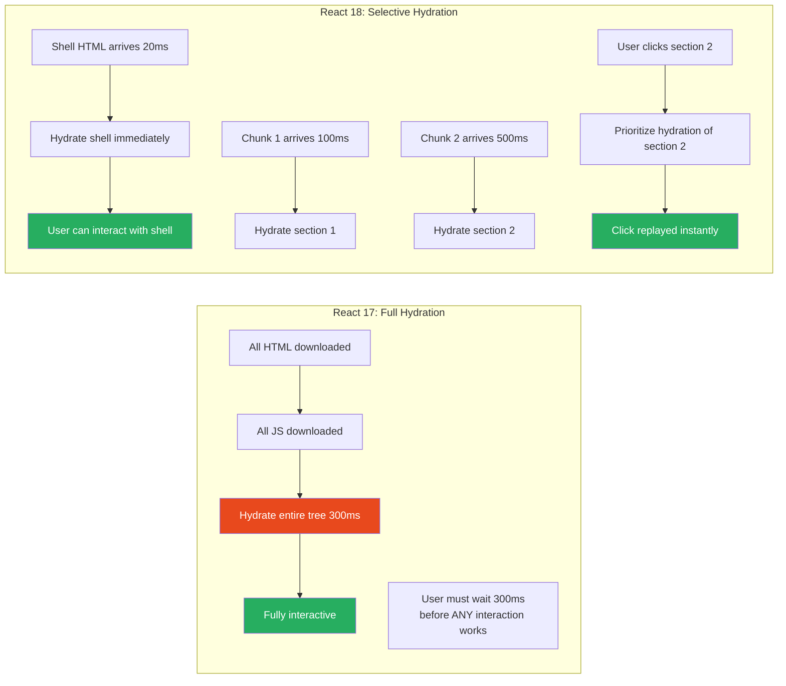
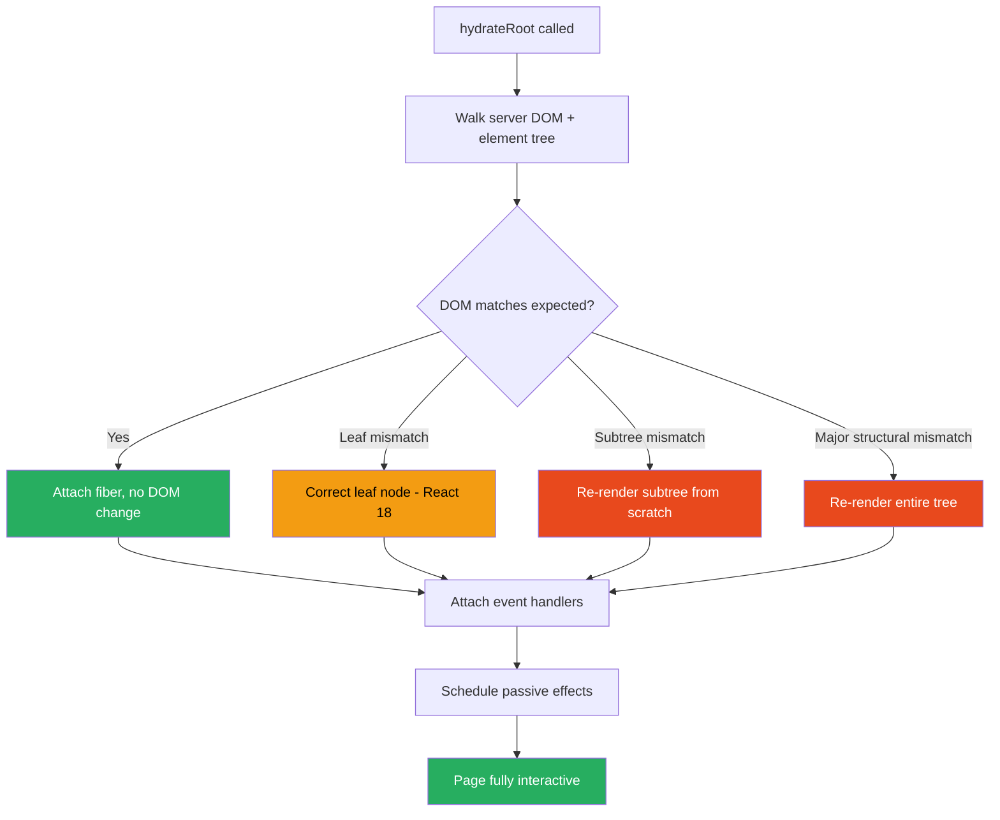

# 50 · Hydration Strategies

> **Hydration is the process of attaching React's event system and component state to HTML that was rendered on the server. Without hydration, a server-rendered page is static — visible but not interactive. With hydration, React "takes over" the server-rendered DOM, attaching event listeners, initializing component state, and enabling React to manage subsequent re-renders. Understanding hydration precisely — what it does, what can go wrong, and how React 18 changed it — is essential for building applications that are both fast and interactive.**

Hydration is often described as React "matching" the server HTML. This description undersells the complexity: React must reconstruct the entire virtual DOM tree from the server HTML, verify that every node matches what React would have rendered on the client, and establish fiber nodes for every component — all without modifying the DOM (which would cause visual flicker). When hydration fails (mismatches), React discards the server HTML and re-renders from scratch — negating all SSR performance benefits.

---

## Table of Contents

- [What Hydration Does at the Implementation Level](#what-hydration-does-at-the-implementation-level)
- [The Hydration Algorithm](#the-hydration-algorithm)
- [Hydration vs Reconciliation](#hydration-vs-reconciliation)
- [Hydration Mismatches: Causes and Consequences](#hydration-mismatches-causes-and-consequences)
- [Common Hydration Mismatch Causes](#common-hydration-mismatch-causes)
- [Preventing Hydration Mismatches](#preventing-hydration-mismatches)
- [Selective Hydration (React 18)](#selective-hydration-react-18)
- [Progressive Hydration](#progressive-hydration)
- [The suppressHydrationWarning Escape Hatch](#the-suppresshydrationwarning-escape-hatch)
- [Hydration Performance Metrics](#hydration-performance-metrics)
- [Islands Architecture as an Alternative](#islands-architecture-as-an-alternative)
- [Hydration in the Pages Router vs App Router](#hydration-in-the-pages-router-vs-app-router)
- [Debugging Hydration Problems](#debugging-hydration-problems)
- [Architecture Diagrams](#architecture-diagrams)
- [Good Practices](#good-practices)
- [Bad Practices](#bad-practices)
- [Mental Model](#mental-model)
- [Common Misconceptions](#common-misconceptions)
- [Exercises](#exercises)
- [Further Reading](#further-reading)

---

## What Hydration Does at the Implementation Level

Hydration is called via `hydrateRoot` (React 18) or the older `hydrate` (React 17):

```js
// React 18 (Next.js App Router):
import { hydrateRoot } from "react-dom/client";

const root = hydrateRoot(document.getElementById("root"), <App />, {
  onRecoverableError: (error) => {
    console.error("Hydration error (recovered):", error);
  },
});

// React 17 / Pages Router:
import ReactDOM from "react-dom";
ReactDOM.hydrate(<App />, document.getElementById("root"));
```

When `hydrateRoot` is called, React:

1. **Traverses the server HTML** (existing DOM) alongside the React element tree
2. **Creates fiber nodes** for each component — the fiber tree that will manage future updates
3. **Verifies** that the DOM node at each position matches what React would render
4. **Attaches event listeners** at the root (event delegation, not per-element)
5. **Initializes component state** from initial values (useState, useReducer)
6. **Schedules passive effects** (useEffect callbacks) to run after hydration

During hydration, React reads the existing DOM but does NOT write to it (assuming no mismatches). The DOM that the user sees during hydration is the same DOM rendered by the server.

---

## The Hydration Algorithm

React walks the server DOM and its element tree in lockstep:

```
Server HTML:
  <div id="root">
    <div class="product">      ← DOM node 1
      <h2>Laptop Pro</h2>      ← DOM node 2
      <span>$999</span>        ← DOM node 3
      <button>Add to Cart</button> ← DOM node 4
    </div>
  </div>

React element tree (from <App /> on client):
  <div id="root">
    <ProductCard />            ← React element 1
      <div class="product">   ← React element 2
        <h2>Laptop Pro</h2>   ← React element 3 (same)
        <span>$999</span>     ← React element 4 (same)
        <button onClick={...}>Add to Cart</button> ← element 5 (same + event)

Hydration walkthrough:
  1. Find <div class="product"> in DOM → matches React element → attach fiber
  2. Find <h2>Laptop Pro</h2> in DOM → matches → attach fiber, no action needed
  3. Find <span>$999</span> in DOM → matches → attach fiber
  4. Find <button>Add to Cart</button> in DOM → matches → attach fiber + event handler
     The event handler is NOT added to the <button> element directly
     It's registered at the root container (event delegation)
```

### What "attach fiber" means

For each DOM node, React creates a corresponding fiber node and stores a reference:

```js
// React stores the fiber on the DOM node:
domNode[internalInstanceKey] = fiber;
// (internalInstanceKey = '__reactFiber$' + randomHash)

// And the current props on the DOM node:
domNode[internalPropsKey] = props;
// (internalPropsKey = '__reactProps$' + randomHash)
```

This enables React's event system to find the fiber from any DOM event target — critical for the event delegation model.

---

## Hydration vs Reconciliation

Hydration and reconciliation both compare React elements to what exists in the DOM, but they operate differently:

### Reconciliation (update path)

```
New state → new render → new element tree
Reconciler: compare new elements to current fibers
  → Create, update, or delete DOM nodes as needed
  → Result: DOM updated to match new elements
```

### Hydration (initial mount path)

```
Server HTML → hydrateRoot → hydration pass
Hydrator: compare element tree to existing DOM nodes
  → Attach fibers to existing DOM nodes (no DOM modifications)
  → Verify: each DOM node matches what React would render
  → Result: React "owns" the existing DOM nodes
```

The key difference: reconciliation creates or modifies DOM nodes; hydration adopts existing DOM nodes without modification.

---

## Hydration Mismatches: Causes and Consequences

A hydration mismatch occurs when the server-rendered HTML doesn't match what React would render on the client.

### What happens on mismatch (React 18)

React 18 improved mismatch handling significantly:

```
React 17 behavior on mismatch:
  Any mismatch → entire tree re-rendered from scratch
  User sees: flash of differently-styled content
  Console: warning (often cryptic)

React 18 behavior on mismatch:
  Leaf element mismatch → that specific element corrected
  Subtree mismatch → that subtree re-rendered
  Major structural mismatch → full tree re-render
  Console: detailed error with component stack
```

### The error message in React 18

```
Error: Hydration failed because the server rendered HTML
didn't match the client. As a result this tree will be
regenerated on the client. This can happen if a SSR-ed
Client Component used:
- A server/client branch `if (typeof window !== 'undefined')`.
- Variable input such as `Date.now()` or `Math.random()`
  which changes each time it's called.
- Date formatting in a user's locale which doesn't match
  the server.
- External changing data without sending it along with the HTML.
- Invalid HTML tag nesting.

It can also happen if the client has a browser extension
installed which messes with the HTML before React loaded.

Component Stack:
  at ClientComponent (./components/client.tsx:12)
  at Page (./app/page.tsx:8)
```

---

## Common Hydration Mismatch Causes

### Cause 1: Non-deterministic values

```tsx
// ❌ Different on server vs client
function Timestamp() {
  return <span>{new Date().toLocaleString()}</span>;
  // Server: "1/15/2024, 10:30:00 AM" (server's time)
  // Client: "1/15/2024, 10:30:01 AM" (1 second later)
  // Mismatch!
}

// ✅ Fix: suppress or use useEffect for client-only values
function Timestamp() {
  const [time, setTime] = useState<string | null>(null);

  useEffect(() => {
    setTime(new Date().toLocaleString()); // only runs on client
  }, []);

  // First render: null → no text node (matches empty server output)
  // After hydration: sets client time
  return <span>{time}</span>;
}
```

### Cause 2: Browser extension interference

```tsx
// Browser extensions can inject HTML before React hydrates:
// - Ad blockers adding "removed" placeholders
// - Password managers adding autocomplete elements
// - Dark mode extensions modifying the DOM

// This is not a bug in your code — React handles it but logs a warning
// The suppressHydrationWarning prop handles this for leaf elements
```

### Cause 3: typeof window checks

```tsx
// ❌ Different rendering paths on server vs client
function Navigation() {
  if (typeof window !== "undefined") {
    return <ClientNav currentPath={window.location.pathname} />;
  }
  return <ServerNav />; // Different component!
  // Server: <ServerNav />, Client: <ClientNav /> → major mismatch
}

// ✅ Fix: use a consistent render, update after hydration
function Navigation() {
  const [mounted, setMounted] = useState(false);
  useEffect(() => setMounted(true), []);

  // Both server and client render the same initial output
  if (!mounted) return <NavSkeleton />;
  return <ClientNav currentPath={window.location.pathname} />;
}
```

### Cause 4: Locale-sensitive formatting

```tsx
// ❌ Server locale may differ from client locale
function PriceDisplay({ price }: { price: number }) {
  return (
    <span>
      {new Intl.NumberFormat(navigator.language, {
        // ← navigator not available on server
        style: "currency",
        currency: "USD",
      }).format(price)}
    </span>
  );
}
// Server: throws (navigator undefined) or uses server locale
// Client: uses browser locale

// ✅ Fix: use a consistent locale, or format on client only
function PriceDisplay({ price }: { price: number }) {
  return (
    <span>
      {new Intl.NumberFormat("en-US", {
        style: "currency",
        currency: "USD",
      }).format(price)}
    </span>
  );
  // Same locale on server and client → no mismatch
}
```

### Cause 5: Invalid HTML nesting

```tsx
// ❌ Browsers "fix" invalid HTML — their DOM doesn't match React's output
function Card() {
  return (
    <p>
      <div>Card content</div> {/* div inside p → invalid HTML! */}
    </p>
  );
  // Browser parses this as: <p></p><div>Card content</div><p></p>
  // React rendered: <p><div>Card content</div></p>
  // Mismatch: browser's DOM !== React's expected structure
}

// ✅ Fix: use valid HTML nesting
function Card() {
  return (
    <div className="card">
      <div>Card content</div>
    </div>
  );
}
```

---

## Preventing Hydration Mismatches

### Strategy 1: Consistent rendering

```tsx
// Use the same data on server and client
// Pass server-computed values as props instead of computing client-side

// Server Component passes consistent data to Client Component
async function DateDisplay() {
  const date = new Date().toISOString(); // server's date

  return <ClientDateDisplay serverDate={date} />;
}

("use client");
function ClientDateDisplay({ serverDate }: { serverDate: string }) {
  // Use the server date for consistent initial render
  return (
    <time dateTime={serverDate}>
      {new Date(serverDate).toLocaleDateString()}
    </time>
  );
  // Both server and client render with the same serverDate value
}
```

### Strategy 2: Defer client-only rendering to useEffect

```tsx
"use client";
function ClientOnlyComponent({ children }: { children: React.ReactNode }) {
  const [hasMounted, setHasMounted] = useState(false);

  useEffect(() => {
    setHasMounted(true);
  }, []);

  if (!hasMounted) {
    return null; // Server renders null → client renders null initially → then switches
  }

  return <>{children}</>;
}

// Usage:
<ClientOnlyComponent>
  <BrowserSpecificFeature />
</ClientOnlyComponent>;
```

### Strategy 3: dynamic() with ssr: false

```tsx
import dynamic from "next/dynamic";

// Skip SSR entirely for this component
const BrowserOnlyChart = dynamic(() => import("./chart-component"), {
  ssr: false, // Don't render on server
  loading: () => <ChartSkeleton />, // Show skeleton until client renders
});

// Server renders: <ChartSkeleton />
// Client: loads chart JS, replaces skeleton
// No hydration mismatch (server never tries to render the chart)
```

---

## Selective Hydration (React 18)

React 18 introduces selective hydration: not the entire page must hydrate before it becomes interactive. React hydrates components as their HTML streams in, and prioritizes based on user interaction.

### How selective hydration works

```
Traditional hydration (React 17):
  All HTML downloaded → entire JS bundle loaded → entire tree hydrated
  Time to Interactive: T(HTML) + T(JS) + T(hydrate all)
  Components above the fold wait for components below the fold

React 18 selective hydration:
  Shell HTML streams in → shell hydrates immediately
  Suspense-wrapped sections: each hydrates when its HTML arrives
  Priority: user interaction with an unhyrated section → immediate hydration
```

### User interaction triggers priority hydration

```
User clicks on ProductCard while page is still hydrating:

React 18:
  1. Detects pointer event on ProductCard's DOM node
  2. Identifies which Suspense boundary contains ProductCard
  3. Immediately hydrates that Suspense boundary (SyncLane)
  4. Click event replayed on now-hydrated component
  5. Continues hydrating rest of tree at lower priority

React 17:
  1. Detects pointer event on ProductCard's DOM node
  2. ProductCard not yet hydrated — event ignored
  3. User must click again after hydration completes
```

### The hydration scheduling

```js
// React 18's hydrateRoot processes work in priority order:
// 1. Event handlers on already-hydrated components: SyncLane
// 2. User interaction with non-hydrated area: SyncLane (priority)
// 3. Suspense boundary content that arrived: DefaultLane
// 4. Remaining unhyrated sections: IdleLane (background)

// This enables the page to become partially interactive immediately
// while background hydration continues
```

---

## Progressive Hydration

Progressive hydration is the technique of hydrating high-priority components first and deferring low-priority ones:

```tsx
// Approach 1: Suspense boundaries for natural progressive hydration
function Page() {
  return (
    <>
      {/* High priority: hero section, hydrates first */}
      <HeroSection />

      {/* Medium priority: hydrates when content streams in */}
      <Suspense fallback={<ProductsSkeleton />}>
        <ProductSection />
      </Suspense>

      {/* Low priority: footer can hydrate last */}
      <Suspense fallback={<FooterSkeleton />}>
        <Footer />
      </Suspense>
    </>
  );
}

// Approach 2: IntersectionObserver-based lazy hydration
("use client");
function LazyHydrate({ children }: { children: React.ReactNode }) {
  const [shouldHydrate, setShouldHydrate] = useState(false);
  const ref = useRef<HTMLDivElement>(null);

  useEffect(() => {
    const observer = new IntersectionObserver(
      ([entry]) => {
        if (entry.isIntersecting) {
          setShouldHydrate(true);
          observer.disconnect();
        }
      },
      { rootMargin: "200px" }, // start hydrating 200px before visible
    );

    if (ref.current) observer.observe(ref.current);
    return () => observer.disconnect();
  }, []);

  return (
    <div ref={ref}>{shouldHydrate ? children : <ComponentSkeleton />}</div>
  );
}

// Usage:
<LazyHydrate>
  <ExpensiveComponent /> {/* only hydrates when near viewport */}
</LazyHydrate>;
```

---

## The suppressHydrationWarning Escape Hatch

For intentional server/client differences (like timestamps or random IDs), suppress the warning:

```tsx
// ✅ Acceptable uses of suppressHydrationWarning:
<time
  suppressHydrationWarning
  dateTime={serverDate}
>
  {/* Client will update with local time — intentional mismatch */}
  {new Date().toLocaleDateString()}
</time>

<input
  suppressHydrationWarning
  defaultValue={serverGeneratedId}
  // ID differs between server and client — acceptable
/>

// suppressHydrationWarning applies ONLY to the element itself
// It does NOT suppress warnings for children
// For children: suppress on each child element that mismatches
```

### When suppressHydrationWarning is appropriate

```
✅ Acceptable:
  - Timestamps that show current time
  - Random IDs that are generated per-render
  - Browser-extension-injected content
  - Date/time formatted in user's local timezone

❌ NOT acceptable:
  - Different component types between server and client
  - Missing/extra DOM elements
  - Structural differences in the DOM
  These indicate real bugs — don't suppress them!
```

---

## Hydration Performance Metrics

Hydration contributes to several performance metrics:

### Time to Interactive (TTI)

```
TTI = time until page responds to user interaction

Hydration impact:
  Before hydration: static HTML (no JS handlers)
  During hydration: partial interaction possible (React 18 selective)
  After hydration: fully interactive

Optimization: minimize hydration work
  - Use Server Components (zero hydration cost for server components)
  - Defer non-critical hydration (lazy components, IntersectionObserver)
  - Reduce Client Component count (push 'use client' boundary down)
```

### Long Tasks from Hydration

```
Chrome DevTools → Performance tab:
  Look for: long JavaScript tasks during page load

  Large, uninterrupted hydration:
    [████████████████████ Hydrate All Components (200ms) ████████████████]
    This blocks user interaction for 200ms

  React 18 time-sliced hydration:
    [Hydrate █] [Paint] [Hydrate █] [Paint] [Hydrate █]
    5ms slices, browser paints between → no long tasks → responsive
```

### Measuring hydration time

```js
// Using PerformanceObserver:
const observer = new PerformanceObserver((list) => {
  for (const entry of list.getEntries()) {
    if (entry.name === "react-hydrate") {
      console.log(`Hydration took: ${entry.duration}ms`);
    }
  }
});
observer.observe({ type: "measure", buffered: true });

// Or use React DevTools Profiler:
// It shows "hydration" in the timeline
```

---

## Islands Architecture as an Alternative

For content-heavy sites, the Islands Architecture minimizes hydration by only hydrating interactive "islands":

```
Traditional SSR:
  [Full page hydration — all components]
  Bundle: entire React app

Islands Architecture:
  [Static HTML ─────────────────────────────────────]
  [Static HTML] [Island A] [Static HTML] [Island B]
  [Static HTML ─────────────────────────────────────]
  Bundle: only Island A + Island B JavaScript
```

In Next.js App Router, Server Components effectively implement Islands Architecture:

```tsx
// Server Components = static HTML (no hydration)
// Client Components with 'use client' = islands (hydrated)

async function ContentPage() {
  const article = await db.articles.findUnique({ where: { slug } });
  return (
    <article>
      {/* Static HTML — no hydration cost */}
      <h1>{article.title}</h1>
      <div dangerouslySetInnerHTML={{ __html: article.content }} />
      {/* Islands — hydrated for interactivity */}
      <ShareButtons url={article.url} /> {/* Client Component */}
      <LikeCounter articleId={article.id} /> {/* Client Component */}
      <CommentSection articleId={article.id} /> {/* Client Component */}
    </article>
  );
}
```

Total hydration: only ShareButtons + LikeCounter + CommentSection. The article content (which could be kilobytes of HTML) has zero hydration cost.

---

## Hydration in the Pages Router vs App Router

### Pages Router hydration

```
Pages Router:
  All page components → client bundle → full page hydration

  Hydration target: <div id="__NEXT_DATA__"> or <div id="root">
  React hydrates the ENTIRE page component tree
  Even if 90% of the page is static content

  Pages Router with React 18:
    Uses hydrateRoot (React 18 API)
    Gets selective hydration for Suspense-wrapped sections
    But: entire page is still client-rendered by default
```

### App Router hydration

```
App Router:
  Server Components → no client bundle → no hydration
  Client Components → client bundle → selective hydration

  Hydration target: only Client Component subtrees
  Server Component HTML: already in DOM, no hydration needed
  React only "takes over" the Client Component portions

  Benefit: for a page that's 80% Server Components:
    Only 20% of the tree is hydrated
    80% smaller hydration work
    Faster TTI
```

---

## Debugging Hydration Problems

### Method 1: React DevTools component highlighting

```
React DevTools → Settings → "Highlight updates"
Initial page load shows hydration happening
Red highlights = components being hydrated
Gray = server-rendered (no hydration needed)

For mismatches: the component will show as "updated" immediately after mount
```

### Method 2: Console errors

```
React 18 hydration errors are descriptive:
  "Hydration failed because..."
  + Component stack showing which component caused the mismatch

In development:
  More verbose — shows both expected and received HTML

In production:
  Shorter error + digest (reference to server-side error log)
```

### Method 3: Network timing

```
Chrome DevTools → Network → HTML document → Timing

Long "Waiting (TTFB)": server rendering is slow
Long "Downloading": streaming (good!) or slow network
Check Resource Timing for the HTML:
  "domContentLoadedEventEnd" - "navigationStart" = TTFB
  "loadEventEnd" - "domContentLoadedEventEnd" = hydration + execution time
```

### Method 4: Deliberate mismatch testing

```tsx
// Add this to components you suspect of causing mismatches:
function DebugComponent({ children }) {
  const serverMarkup = useId(); // consistent across server/client

  // Log on hydration:
  useEffect(() => {
    console.log("Hydrated:", serverMarkup);
    // If this doesn't log: component wasn't hydrated (good for SC!)
    // If this logs: component was hydrated
  }, []);

  return <>{children}</>;
}
```

---

## Architecture Diagrams

### Traditional vs selective hydration



### Hydration mismatch recovery



---

## Good Practices

### ✅ Good Practice — Consistent server/client rendering with passed data

```tsx
/**
 * Good: Data that could differ between server and client is explicitly
 * passed from server to client, ensuring consistent initial rendering.
 * Client-only updates happen in useEffect (after hydration).
 */

// Server Component: generates consistent data
async function ProductPricePage({ params }: { params: { id: string } }) {
  const product = await db.products.findUnique({ where: { id: params.id } });
  const serverTime = new Date().toISOString(); // server's timestamp

  return (
    <PriceDisplay
      price={product!.price}
      currency={product!.currency}
      lastUpdated={serverTime} // passed explicitly — no client-side Date.now()
    />
  );
}

// Client Component: uses server-provided values for consistent render
("use client");
function PriceDisplay({
  price,
  currency,
  lastUpdated,
}: {
  price: number;
  currency: string;
  lastUpdated: string;
}) {
  // ✅ Consistent: uses server-provided price (no recalculation)
  const formattedPrice = new Intl.NumberFormat("en-US", {
    style: "currency",
    currency,
  }).format(price);

  // ✅ Consistent initial render: same date string on server and client
  // ✅ Client update: after hydration, format with local timezone
  const [displayTime, setDisplayTime] = useState(
    new Date(lastUpdated).toISOString(), // ISO format: same everywhere
  );

  useEffect(() => {
    // After hydration: update to local formatted time (client-only)
    setDisplayTime(new Date(lastUpdated).toLocaleString());
  }, [lastUpdated]);

  return (
    <div>
      <span className="price">{formattedPrice}</span>
      <time suppressHydrationWarning dateTime={lastUpdated}>
        {displayTime}
      </time>
    </div>
  );
}
```

---

## Bad Practices

### ⚠️ Bad Practice — Browser API checks that cause mismatches

```tsx
/**
 * Bad: Using typeof window !== 'undefined' or direct browser API access
 * in the render path. Creates different rendering output on server vs client.
 *
 * This is the #1 cause of hydration errors in production React apps.
 * The component renders differently on server (no window) and client (has window),
 * causing React to discard the server HTML and re-render.
 */

// ❌ Renders differently on server vs client
"use client";
function ResponsiveMenu() {
  // window is not available on server → branch is different
  const isMobile = typeof window !== "undefined" && window.innerWidth < 768;

  return (
    <nav>
      {
        isMobile ? (
          <HamburgerMenu /> // ← Client renders this
        ) : (
          <FullMenu />
        ) // ← Server renders this
      }
    </nav>
  );
  // Server: FullMenu rendered
  // Client (mobile): HamburgerMenu rendered
  // Mismatch → full subtree re-render → content flickers
}

// ✅ Fix 1: Same initial render, update after hydration
("use client");
function ResponsiveMenu() {
  const [isMobile, setIsMobile] = useState(false); // false = same as server

  useEffect(() => {
    const check = () => setIsMobile(window.innerWidth < 768);
    check(); // initial check after hydration
    window.addEventListener("resize", check);
    return () => window.removeEventListener("resize", check);
  }, []);

  // Server: FullMenu (isMobile=false)
  // Client initial: FullMenu (isMobile=false) — matches!
  // After hydration: HamburgerMenu if mobile
  return <nav>{isMobile ? <HamburgerMenu /> : <FullMenu />}</nav>;
}

// ✅ Fix 2: CSS-only responsive (no JS, no hydration issue)
function ResponsiveMenu() {
  return (
    <nav>
      <FullMenu className="hidden md:flex" /> {/* hidden on mobile */}
      <HamburgerMenu className="flex md:hidden" /> {/* hidden on desktop */}
    </nav>
  );
  // Both rendered on server AND client
  // CSS controls visibility — no hydration mismatch
}
```

**Production impact:** A major e-commerce site had hydration mismatches on mobile devices because their navigation component used `typeof window !== 'undefined'` to show a hamburger menu. Mobile users experienced: page loads (server HTML shown), navigation appears, JavaScript loads, hydration detects mismatch, entire navigation re-rendered. This caused a visible "flash" of the desktop navigation before the mobile hamburger appeared. Bounce rate on mobile was 40% higher than desktop. After the CSS-only fix: no re-render, no flash, mobile bounce rate dropped 25%.

---

## Mental Model

> 💡 **The hydration mental model:**
>
> Hydration is like a **puppeteer taking control of a puppet**. The server creates the puppet (HTML) — it looks like a person, has the right proportions, wears appropriate clothes. The puppet arrives at the theater (browser) and the audience sees it immediately (FCP). Then the puppeteer (React's JavaScript) arrives with their strings (event handlers, state management). The puppeteer must match the puppet exactly — they need to know where every joint is (DOM nodes) and which string controls which limb (event delegation). If the puppet isn't what the puppeteer expected (mismatch), they have to tear it apart and rebuild it while the audience watches (full re-render). Selective hydration is like having a team of puppeteers — the most important puppet (above the fold) gets its puppeteer first, while the others wait their turn. The audience can interact with puppets as they get puppeteers, even while others are still being connected.

---

## Common Misconceptions

### "Hydration happens once, then React takes over"

React hydrates the initial tree, then manages future renders. Hydration is a one-time operation per root, but it can be interrupted and resumed (React 18's concurrent hydration). After hydration, React renders normally.

### "suppressHydrationWarning fixes hydration problems"

`suppressHydrationWarning` silences the warning for intentional mismatches. It doesn't fix actual bugs — if you have structural mismatches (wrong elements), suppressing the warning just hides the problem. Use it only for known, acceptable mismatches.

### "Server Components need hydration"

Server Components are never hydrated — they don't produce a JavaScript bundle. Only Client Components are hydrated. Server Component HTML is already complete and correct — React doesn't need to "take it over."

### "Hydration mismatches crash the page"

React recovers from hydration mismatches by re-rendering the affected component subtree from scratch. The user may see a brief flicker, but the page recovers. In React 18, many mismatches are corrected without visible impact.

### "dynamic({ ssr: false }) prevents hydration entirely"

`dynamic({ ssr: false })` skips server rendering for that component — there's no server HTML for it. The client renders it fresh. This avoids hydration mismatches but also loses SSR benefits. There IS still React rendering on the client, just not hydration.

---

## Exercises

### Exercise 1 — Deliberately trigger and observe a hydration mismatch

```tsx
// Add this component to a Next.js page:
"use client";
function HydrationTester() {
  // This will cause a mismatch: server renders empty, client renders with window data
  return (
    <div>{typeof window !== "undefined" ? window.innerWidth : "server"}</div>
  );
}
```

1. Add this component to a Next.js page
2. Observe the hydration error in the browser console
3. Read the full error message — what information does it provide?
4. Fix the mismatch using the techniques in this document
5. Verify: no more console error

### Exercise 2 — Measure hydration time

```tsx
// Add to your _app.tsx or root layout:
useEffect(() => {
  // After React has hydrated, this fires
  const navigationEntry = performance.getEntriesByType(
    "navigation",
  )[0] as PerformanceNavigationTiming;
  const hydrationTime =
    navigationEntry.domInteractive - navigationEntry.responseEnd;
  console.log(`Hydration completed in: ${hydrationTime.toFixed(0)}ms`);
}, []);
```

Measure hydration time on:

1. A simple static page
2. A complex page with many Client Components
3. A page using RSC (mostly Server Components)

Compare the numbers.

### Exercise 3 — Fix all hydration mismatches

```tsx
// This component has 3 hydration issues — find and fix all of them:
'use client';
function BuggyComponent() {
  const items = [Math.random(), Math.random(), Math.random()]; // Issue 1

  return (
    <div>
      <p>Rendered at: {Date.now()}</p>  {/* Issue 2 */}
      {typeof window !== 'undefined' && (
        <p>Window width: {window.innerWidth}</p>  {/* Issue 3 */}
      )}
      <ul>
        {items.map((item, i) => (
          <li key={i}>{item}</li>
        ))}
      </ul>
    </div>
  );
}
```

---

## Further Reading

- [React Source: ReactFiberHydrationContext.js](https://github.com/facebook/react/blob/main/packages/react-reconciler/src/ReactFiberHydrationContext.js) — Hydration implementation
- [React Docs: hydrateRoot](https://react.dev/reference/react-dom/client/hydrateRoot) — API reference
- [React 18 Working Group: Selective Hydration](https://github.com/reactwg/react-18/discussions/130) — Design discussion
- [Addy Osmani: Patterns.dev — Hydration](https://www.patterns.dev/react/react-server-components) — Islands and hydration patterns
- [web.dev: JavaScript Hydration](https://web.dev/articles/rendering-on-the-web) — Rendering strategies comparison
- Next in this handbook: [51 · Static Site Generation](./02-static-generation.md)

---

_Part of the [React + Next.js Engineering Handbook](../../README.md)_
