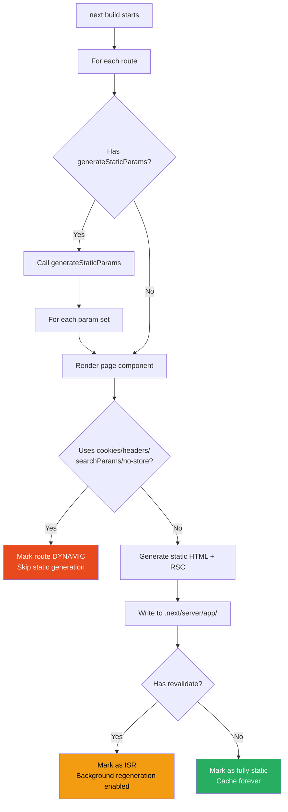
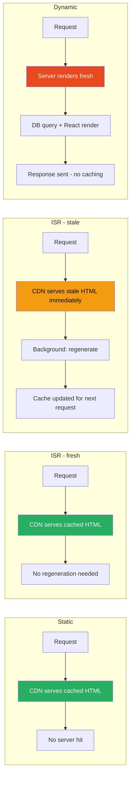

# 51 · Static Site Generation

> **Static Site Generation (SSG) produces complete HTML pages at build time, before any user ever requests them. The result is the fastest possible delivery mechanism: a CDN serves pre-built HTML files with no server computation, no database queries, and no rendering delay per request. Understanding exactly when Next.js chooses static generation, how it determines which pages can be static, and the build-time mechanics that produce static output is essential for maximizing the performance ceiling of a Next.js application.**

Static generation is not a feature you explicitly invoke in the App Router — it's a rendering strategy that Next.js automatically selects based on what your code does. Understanding the rules that trigger static vs dynamic rendering lets you architect pages deliberately rather than discovering the rendering mode after deployment.

---

## Table of Contents

- [What Makes a Page Static](#what-makes-a-page-static)
- [The Static Rendering Decision Algorithm](#the-static-rendering-decision-algorithm)
- [Build-Time Execution](#build-time-execution)
- [Static Generation with Dynamic Segments](#static-generation-with-dynamic-segments)
- [Static Params Generation](#static-params-generation)
- [The Static HTML Output](#the-static-html-output)
- [Static Generation and the Data Cache](#static-generation-and-the-data-cache)
- [Forcing Static or Dynamic Rendering](#forcing-static-or-dynamic-rendering)
- [Static Generation Limits](#static-generation-limits)
- [Static Export Mode](#static-export-mode)
- [Partial Prerendering (PPR)](#partial-prerendering-ppr)
- [Measuring Static Generation Performance](#measuring-static-generation-performance)
- [Build Time Considerations at Scale](#build-time-considerations-at-scale)
- [Architecture Diagrams](#architecture-diagrams)
- [Good Practices](#good-practices)
- [Bad Practices](#bad-practices)
- [Mental Model](#mental-model)
- [Common Misconceptions](#common-misconceptions)
- [Exercises](#exercises)
- [Further Reading](#further-reading)

---

## What Makes a Page Static

In the App Router, Next.js determines static vs dynamic rendering automatically by analyzing what APIs your route uses:

```tsx
// ✅ STATIC: no dynamic APIs used
async function AboutPage() {
  const content = await fetch("https://cms.example.com/about").then((r) =>
    r.json(),
  );
  return <AboutContent content={content} />;
}
// Next.js: this page can be fully pre-rendered at build time

// ❌ DYNAMIC: uses cookies() — request-specific API
async function DashboardPage() {
  const session = cookies().get("session");
  const data = await fetchUserData(session?.value);
  return <Dashboard data={data} />;
}
// Next.js: this page MUST be rendered per-request (dynamic)
```

### APIs that force dynamic rendering

```tsx
// Any of these force the ENTIRE route to be dynamic:
cookies()                          // from next/headers
headers()                          // from next/headers
searchParams (as a page prop)      // reading URL query params

fetch(url, { cache: 'no-store' })  // explicit no-cache fetch

// Route segment config:
export const dynamic = 'force-dynamic';

// Using these APIs:
unstable_noStore()                 // explicit dynamic opt-in
connection()                       // explicit dynamic opt-in (React 19+)
```

---

## The Static Rendering Decision Algorithm

Next.js determines rendering mode through static analysis combined with runtime detection:

```
At build time, for each route:

1. Next.js attempts to render the route statically
   (calls the page component with placeholder params if dynamic segments exist)

2. During this render, Next.js tracks:
   - Was cookies() called?
   - Was headers() called?
   - Was searchParams accessed?
   - Was any fetch() called with cache: 'no-store'?
   - Is dynamic = 'force-dynamic' set?

3. If NONE of the above: route is STATIC
   → HTML generated now, cached, served from CDN forever (or until revalidation)

4. If ANY of the above: route is DYNAMIC
   → Next.js marks this route for per-request rendering
   → No HTML generated at build time
   → Rendered fresh on each request (or following ISR rules if revalidate is set)
```

### Mixed signals: revalidate with dynamic APIs

```tsx
// Using cookies() but ALSO setting revalidate:
async function ProductPage({ params }) {
  const locale = cookies().get("locale")?.value ?? "en"; // dynamic API!

  const product = await fetch(`/api/products/${params.id}?locale=${locale}`, {
    next: { revalidate: 60 },
  });

  return <ProductView product={product} />;
}

// Result: STILL DYNAMIC
// cookies() forces dynamic rendering regardless of fetch revalidate settings
// The revalidate only matters for fully static routes
```

---

## Build-Time Execution

During `next build`, Next.js executes your Server Components to generate static HTML:

```bash
$ next build

Route (app)                              Size     First Load JS
┌ ○ /                                    142 B          87.3 kB
├ ○ /about                               142 B          87.3 kB
├ ● /blog/[slug]                         182 B          89.1 kB
├   ├ /blog/hello-world
├   ├ /blog/getting-started
├   └ [+8 more paths]
├ ƒ /dashboard                           1.2 kB         95.4 kB
└ ƒ /api/webhook                         0 B                0 B

○  (Static)   prerendered as static content
●  (SSG)      prerendered as static HTML (uses generateStaticParams)
ƒ  (Dynamic)  server-rendered on demand
```

### What happens during build for each type

```
○ Static routes:
  1. Next.js calls the page component once (no params)
  2. Awaits all data fetching
  3. Generates HTML file: .next/server/app/about.html
  4. Generates RSC payload: .next/server/app/about.rsc

● SSG routes (with generateStaticParams):
  1. Next.js calls generateStaticParams() to get the list of params
  2. For EACH param set, calls the page component
  3. Generates one HTML file per param combination
  4. .next/server/app/blog/hello-world.html
  5. .next/server/app/blog/getting-started.html
  6. etc.

ƒ Dynamic routes:
  1. Next.js does NOT call the page component at build time
  2. Generates a server function reference instead
  3. Component runs on each incoming request
```

---

## Static Generation with Dynamic Segments

For routes with `[param]` segments, `generateStaticParams` determines which specific paths get pre-rendered:

```tsx
// app/blog/[slug]/page.tsx

export async function generateStaticParams() {
  const posts = await db.posts.findMany({
    select: { slug: true },
    where: { published: true },
  });

  return posts.map((post) => ({ slug: post.slug }));
  // Returns: [{ slug: 'hello-world' }, { slug: 'getting-started' }, ...]
}

export default async function BlogPost({
  params,
}: {
  params: { slug: string };
}) {
  const post = await db.posts.findUnique({ where: { slug: params.slug } });
  if (!post) notFound();
  return <PostView post={post} />;
}
```

### What happens for params NOT in generateStaticParams

```tsx
// Control behavior for unlisted params:
export const dynamicParams = true; // default

// dynamicParams = true:
//   Unlisted slug → rendered on-demand at request time
//   Result is cached after first render (like ISR)
//   Subsequent requests for same slug: served from cache

// dynamicParams = false:
//   Unlisted slug → 404 immediately
//   Use when you have a complete, fixed set of valid paths
```

### Partial pre-rendering with generateStaticParams

```tsx
// Pre-render only the most important paths at build time
// Let the rest generate on-demand (faster builds, still fast for popular content)
export async function generateStaticParams() {
  // Only pre-render the top 100 most-viewed posts
  const topPosts = await db.posts.findMany({
    select: { slug: true },
    orderBy: { viewCount: "desc" },
    take: 100,
  });

  return topPosts.map((post) => ({ slug: post.slug }));
}
// Remaining thousands of posts: rendered on first request, then cached
```

---

## Static Params Generation

`generateStaticParams` itself runs at build time and can be expensive for large datasets:

```tsx
// For nested dynamic segments, generateStaticParams composes:
// app/shop/[category]/[product]/page.tsx

export async function generateStaticParams({
  params,
}: {
  params: { category: string }; // from PARENT generateStaticParams
}) {
  // This runs once per category returned by the parent segment
  const products = await db.products.findMany({
    where: { category: params.category },
    select: { slug: true },
  });

  return products.map((product) => ({ product: product.slug }));
}

// app/shop/[category]/page.tsx (parent)
export async function generateStaticParams() {
  const categories = await db.categories.findMany({ select: { slug: true } });
  return categories.map((c) => ({ category: c.slug }));
}

// Combined generation: for each category, generate all its products
// 10 categories × 50 products each = 500 total static pages
```

### Limiting the param combinations

```tsx
// For large catalogs, generating ALL combinations can make builds too slow
// Strategy: generate only top-level segments, let leaf pages be on-demand

// app/shop/[category]/page.tsx
export async function generateStaticParams() {
  const categories = await db.categories.findMany({ select: { slug: true } });
  return categories.map((c) => ({ category: c.slug })); // ~20 categories: fast
}

// app/shop/[category]/[product]/page.tsx
// NO generateStaticParams here — all products generate on-demand
// First request for each product: SSR + cache (ISR-style)
// Subsequent requests: served from cache
```

---

## The Static HTML Output

Static pages produce both HTML and an RSC payload:

```
.next/server/app/
  about.html       ← Full HTML document (for direct navigation/crawlers)
  about.rsc        ← RSC payload (for client-side navigation)
  about.meta       ← Metadata (headers, revalidate config)

blog/
  hello-world.html
  hello-world.rsc
  hello-world.meta
  getting-started.html
  getting-started.rsc
  getting-started.meta
```

### Why two formats

```
.html file:
  Used when: direct navigation (typing URL, clicking external link, page refresh)
  Served by: CDN directly, or Next.js server reads from disk
  Contains: complete HTML document

.rsc file:
  Used when: client-side navigation (clicking <Link> within the app)
  Served by: Next.js server (or CDN with proper routing)
  Contains: RSC payload (lighter weight than full HTML)
  Benefit: React can update just the changed parts of the page
```

---

## Static Generation and the Data Cache

Static pages interact with Next.js's Data Cache for their `fetch()` calls:

```tsx
// During build (or ISR regeneration):
async function ProductPage({ params }: { params: { id: string } }) {
  // This fetch is cached in the Data Cache
  const product = await fetch(`https://api.example.com/products/${params.id}`, {
    next: { revalidate: 3600 }, // 1 hour
  }).then((r) => r.json());

  return <ProductView product={product} />;
}

// Build process:
// 1. fetch() called → no cache entry exists → real HTTP request
// 2. Response cached in Data Cache (persisted to disk in .next/cache)
// 3. HTML generated using this response
// 4. Both HTML output AND Data Cache entry are part of the build artifacts

// On Vercel: Data Cache persists across deployments (shared cache)
// Self-hosted: Data Cache is per-deployment unless configured otherwise
```

### The relationship between HTML cache and Data Cache

```
HTML Cache (CDN-level):
  Stores: the rendered output (HTML + RSC payload)
  Invalidated by: revalidatePath(), new deployment, or ISR timeout

Data Cache (fetch-level):
  Stores: the raw data from fetch() calls
  Invalidated by: revalidateTag(), revalidatePath(), or next.revalidate timeout

When ISR triggers regeneration:
  1. Data Cache checked first — is the data still fresh?
  2. If Data Cache is also stale: new fetch() call made
  3. New data → new render → new HTML cache entry
  4. If Data Cache is fresh but HTML Cache expired: re-render with cached data
     (faster regeneration — no network call needed)
```

---

## Forcing Static or Dynamic Rendering

Route segment config can override the automatic detection:

```tsx
// Force static (error if any dynamic API is used):
export const dynamic = "error";
// Throws a build error if cookies(), headers(), etc. are used
// Use this to GUARANTEE a route stays static (catch accidental dynamic usage)

// Force static (ignore dynamic API usage, use empty/default values):
export const dynamic = "force-static";
// cookies() returns empty, headers() returns empty
// Dangerous: silently ignores dynamic data — use carefully

// Force dynamic (always render per-request):
export const dynamic = "force-dynamic";
// Equivalent to using cookies() or { cache: 'no-store' } everywhere
// Use for: pages that must always be fresh, even without using dynamic APIs

// Auto (default): Next.js decides based on API usage
export const dynamic = "auto";
```

### Practical use of dynamic = 'error'

```tsx
// app/about/page.tsx
// Guarantee this page never becomes accidentally dynamic
export const dynamic = "error";

async function AboutPage() {
  const content = await fetch("https://cms.example.com/about").then((r) =>
    r.json(),
  );
  return <AboutContent content={content} />;
}

// If someone later adds `cookies()` to this file:
// Build FAILS with a clear error, rather than silently making the page dynamic
// This catches accidental dynamic API usage in code review / CI
```

---

## Static Generation Limits

Static generation isn't always the right choice:

```
✅ Good candidates for static generation:
  - Marketing pages (About, Pricing, Contact)
  - Blog posts and articles
  - Documentation pages
  - Product catalog pages (with ISR for price updates)
  - Landing pages

❌ Poor candidates for static generation:
  - User dashboards (always user-specific)
  - Real-time data displays (stock prices, live scores)
  - Personalized content (recommendations based on browsing history)
  - Pages requiring authentication state at render time
  - Search results pages (highly dynamic query combinations)

⚠️ Edge cases requiring care:
  - E-commerce product pages: static + ISR for price/inventory
  - News articles: static at publish, ISR for comment counts
  - User profile pages: static shell + client-fetched dynamic data
```

---

## Static Export Mode

For fully static sites (no server required at all), Next.js supports static export:

```js
// next.config.js
module.exports = {
  output: "export",
};
```

```bash
next build
# Generates: out/ directory with complete static site
# out/index.html, out/about.html, out/blog/hello-world.html, etc.
```

### Static export limitations

```
With output: 'export', these features are UNAVAILABLE:
  ❌ Server Actions (no server to run them)
  ❌ Route Handlers with dynamic behavior (route.ts must be static)
  ❌ Image Optimization API (next/image needs a server, OR use unoptimized: true)
  ❌ Middleware (no server to run it)
  ❌ Incremental Static Regeneration (no server for background regeneration)
  ❌ Dynamic rendering (cookies(), headers(), force-dynamic)

What STILL WORKS:
  ✅ Static Server Components
  ✅ Client Components with client-side data fetching
  ✅ generateStaticParams for dynamic routes
  ✅ Client-side navigation
  ✅ Static assets, fonts, CSS
```

### When to use static export

```
✅ Use static export for:
  - Documentation sites with no backend
  - Marketing sites deployed to GitHub Pages / S3 / any static host
  - Sites where you specifically need zero server infrastructure
  - Embedded apps in environments without Node.js (some Electron/Tauri setups)

❌ Don't use static export for:
  - Apps with Server Actions or dynamic API routes
  - Apps requiring authentication checks at render time
  - Apps using Next.js Image Optimization API
  - Most production SaaS or e-commerce applications
```

---

## Partial Prerendering (PPR)

Partial Prerendering is Next.js's evolving solution to combine static and dynamic content in a single route — without making the whole route dynamic:

```tsx
// app/products/[id]/page.tsx
export const experimental_ppr = true;

async function ProductPage({ params }: { params: { id: string } }) {
  // Static part: pre-rendered at build time
  const product = await db.products.findUnique({ where: { id: params.id } });

  return (
    <div>
      {/* Static: part of the prerendered shell */}
      <ProductInfo product={product} />

      {/* Dynamic: streams in at request time */}
      <Suspense fallback={<CartStatusSkeleton />}>
        <PersonalizedCartStatus /> {/* uses cookies() — dynamic */}
      </Suspense>
    </div>
  );
}
```

### How PPR works conceptually

```
Without PPR:
  Any dynamic API anywhere in the route → entire route is dynamic
  Even static parts re-render on every request

With PPR:
  Static shell generated at build time (cached, served instantly)
  Dynamic holes (Suspense boundaries using dynamic APIs) render per-request
  Result: instant TTFB for the static shell + fresh dynamic content where needed

This is the "best of both worlds":
  Static performance for the parts that can be static
  Dynamic freshness for the parts that need it
  All within a SINGLE route — no manual splitting required
```

> 🏭 **Production Note:** PPR was experimental in Next.js 14-15 and is stabilizing in subsequent releases. Check the current Next.js documentation for its production-readiness status before relying on it for critical infrastructure.

---

## Measuring Static Generation Performance

### Build time analysis

```bash
# Time the build:
time next build

# Identify slow generateStaticParams calls:
# Add timing logs:
export async function generateStaticParams() {
  const start = Date.now();
  const posts = await db.posts.findMany();
  console.log(`generateStaticParams took ${Date.now() - start}ms`);
  return posts.map(p => ({ slug: p.slug }));
}
```

### Runtime performance comparison

```
Static page (served from CDN):
  TTFB: 10-30ms (CDN edge, no origin server hit)
  No DB query at request time
  No React rendering at request time

ISR page (cache hit):
  TTFB: 10-30ms (same as static, served from cache)

ISR page (cache miss/stale):
  TTFB: 100-500ms (background regeneration, but stale served immediately)

Dynamic page (SSR):
  TTFB: 100-1000ms+ (depends on data fetching + render time)
```

---

## Build Time Considerations at Scale

For large sites with thousands of static pages, build time becomes a concern:

```
Build time factors:
  1. Number of pages to generate
  2. Time per page (data fetching + rendering)
  3. Parallelization (Next.js parallelizes page generation)

Example: 10,000 blog posts
  Sequential generation: 10,000 × 200ms = 2,000 seconds (33 minutes)
  Parallel generation (default): much faster, depends on CPU cores

Strategies for large sites:
  1. Use generateStaticParams selectively (only pre-render popular content)
  2. Use ISR with dynamicParams: true for long-tail content
  3. Increase build machine resources (more CPU cores = more parallelism)
  4. Use Vercel's distributed build system (automatically parallelizes)
  5. Consider on-demand ISR instead of build-time generation for very large catalogs
```

### Incremental builds (Vercel-specific)

```
Vercel's build system can skip regenerating unchanged static pages:
  - Detects which source files changed
  - Only re-generates pages affected by those changes
  - Significantly faster builds for large sites with isolated changes

This requires:
  - Proper dependency tracking (Vercel handles this automatically)
  - Pages structured so changes don't have unexpectedly wide blast radius
```

---

## Architecture Diagrams

### Static generation decision flow



### Static vs Dynamic vs ISR request handling



---

## Good Practices

### ✅ Good Practice — Strategic static generation for a content site

```tsx
/**
 * Good: Most content statically generated, popular content pre-built,
 * long-tail content generated on-demand with caching,
 * truly dynamic content isolated to specific routes.
 */

// app/blog/[slug]/page.tsx — Mostly static blog
export async function generateStaticParams() {
  // Pre-render the most popular/recent posts at build time
  const posts = await db.posts.findMany({
    where: { published: true },
    orderBy: { publishedAt: "desc" },
    take: 200, // top 200 posts pre-built
    select: { slug: true },
  });
  return posts.map((p) => ({ slug: p.slug }));
}

// dynamicParams defaults to true:
// Posts NOT in the top 200 still work — generated on first request, then cached

export const revalidate = 3600; // refresh every hour (for view counts, etc.)

async function BlogPost({ params }: { params: { slug: string } }) {
  const post = await db.posts.findUnique({ where: { slug: params.slug } });
  if (!post) notFound();

  return (
    <article>
      <PostContent post={post} />
      {/* Dynamic: comment count changes frequently, isolated via Suspense */}
      <Suspense fallback={<CommentCountSkeleton />}>
        <CommentCount postId={post.id} />
      </Suspense>
    </article>
  );
}

// app/dashboard/page.tsx — Fully dynamic (user-specific)
export const dynamic = "force-dynamic"; // explicit: always per-request

async function DashboardPage() {
  const session = await getSession(); // uses cookies() — would be dynamic anyway
  if (!session) redirect("/login");
  const data = await fetchUserDashboard(session.userId);
  return <Dashboard data={data} />;
}
```

---

## Bad Practices

### ⚠️ Bad Practice — Accidentally making static pages dynamic

```tsx
/**
 * Bad: Adding a single dynamic API call makes the ENTIRE page dynamic,
 * even though 99% of the content could be static.
 * This is a common performance regression introduced during feature additions.
 */

// Originally static page:
async function AboutPage() {
  const content = await fetch("https://cms.example.com/about").then((r) =>
    r.json(),
  );
  return <AboutContent content={content} />;
}
// Build output: ○ /about (Static)

// ❌ Someone adds analytics tracking using headers():
async function AboutPage() {
  const userAgent = headers().get("user-agent"); // ← forces DYNAMIC rendering!
  await logPageView("about", userAgent);

  const content = await fetch("https://cms.example.com/about").then((r) =>
    r.json(),
  );
  return <AboutContent content={content} />;
}
// Build output: ƒ /about (Dynamic) — entire page is now server-rendered per request!
// Performance regression: every visit now requires server computation
// Even though the actual CONTENT (content) never changes per-request

/**
 * ✅ Fix: Move dynamic logic to a Client Component or separate it
 */
async function AboutPage() {
  const content = await fetch("https://cms.example.com/about").then((r) =>
    r.json(),
  );

  return (
    <>
      <AboutContent content={content} />
      <PageViewTracker page="about" /> {/* Client Component handles tracking */}
    </>
  );
}

// 'use client'
function PageViewTracker({ page }: { page: string }) {
  useEffect(() => {
    // Tracking happens client-side — doesn't affect page's static status
    fetch("/api/track", { method: "POST", body: JSON.stringify({ page }) });
  }, [page]);
  return null;
}
// Build output: ○ /about (Static) — restored!
```

**Production impact:** A documentation site had all pages statically generated and served instantly from CDN. A developer added server-side analytics using `headers()` to capture user agent for bot detection. This single change converted 500+ documentation pages from static to dynamic, increasing average response time from 15ms (CDN) to 250ms (server render + DB lookup for analytics config). The fix: move the analytics tracking to a Client Component, restoring static generation for all 500 pages.

---

## Mental Model

> 💡 **The static generation mental model:**
>
> Static generation is like **printing a book versus writing a personalized letter**. A book (static page) is printed once in bulk — the same content for every reader, available immediately from any bookstore (CDN) without waiting for the printing press. A personalized letter (dynamic page) must be written individually for each recipient — checking their name, their specific situation, before any content is produced. ISR is like print-on-demand: the book is "printed" once, but if enough time passes, a new edition is automatically prepared in the background while readers still get the current edition immediately. The mistake of adding one dynamic element to a static page is like inserting a personalized note into every copy of a mass-printed book — suddenly you can't print in bulk anymore; each copy must be individually assembled, destroying the efficiency of mass production.

---

## Common Misconceptions

### "Static pages can't have any per-user content"

Static pages can have per-user content — delivered via Client Components that fetch data client-side after the static shell loads. The HTML itself is static and shared; personalization happens after hydration.

### "ISR pages are the same as dynamic pages"

ISR pages are served from cache (like static pages) until they become stale, then regenerate in the background. Dynamic pages have NO caching — every request triggers fresh rendering. ISR provides the performance of static with periodic freshness.

### "generateStaticParams must include every possible value"

You can pre-render a subset of params and let the rest generate on-demand (`dynamicParams: true`, the default). This is the recommended approach for large datasets — pre-build popular content, generate long-tail content on first access.

### "Static export and static generation are the same thing"

Static generation (the default App Router behavior) produces static HTML for static routes WHILE still running a Next.js server for dynamic routes. Static export (`output: 'export'`) produces a fully static site with NO server — every route must be statically renderable.

### "Adding revalidate makes a page dynamic"

Adding `revalidate` to a static page makes it ISR (still served from cache, periodically refreshed) — not dynamic. The page is still pre-rendered and served from cache; only the regeneration trigger changes.

---

## Exercises

### Exercise 1 — Identify rendering mode from build output

Run `next build` on a project and examine the output table. For each route:

1. What symbol does it have (○, ●, ƒ)?
2. Why does it have that rendering mode? (check the code for dynamic APIs)
3. Could any ƒ routes be converted to ○ or ●? What would need to change?

### Exercise 2 — Implement strategic generateStaticParams

Build a product catalog with 10,000 products:

1. Use `generateStaticParams` to pre-build only the top 50 best-selling products
2. Set `dynamicParams: true` (default) for the rest
3. Add `revalidate: 3600` for periodic price updates
4. Measure build time with this strategy vs. pre-building ALL 10,000 products

### Exercise 3 — Convert a dynamic page to static + client island

Take this dynamic page:

```tsx
export const dynamic = "force-dynamic";
async function ProductPage({ params }) {
  const userAgent = headers().get("user-agent");
  trackPageView(params.id, userAgent);

  const product = await db.products.findUnique({ where: { id: params.id } });
  return <ProductView product={product} />;
}
```

Refactor to make the product display static while keeping the tracking functional via a Client Component. Verify the build output changes from ƒ to ● (or ○).

---

## Further Reading

- [Next.js docs: Static and Dynamic Rendering](https://nextjs.org/docs/app/building-your-application/rendering/server-components#static-rendering-default) — Official rendering guide
- [Next.js docs: generateStaticParams](https://nextjs.org/docs/app/api-reference/functions/generate-static-params) — API reference
- [Next.js docs: Route Segment Config](https://nextjs.org/docs/app/api-reference/file-conventions/route-segment-config) — dynamic, revalidate options
- [Next.js docs: Static Exports](https://nextjs.org/docs/app/building-your-application/deploying/static-exports) — output: 'export' guide
- [Next.js docs: Partial Prerendering](https://nextjs.org/docs/app/building-your-application/rendering/partial-prerendering) — PPR documentation
- [Vercel: Incremental Static Regeneration](https://vercel.com/docs/incremental-static-regeneration) — ISR deep dive
- Next in this handbook: [52 · Server-Side Rendering](./03-server-side-rendering.md)

---

_Part of the [React + Next.js Engineering Handbook](../../README.md)_
