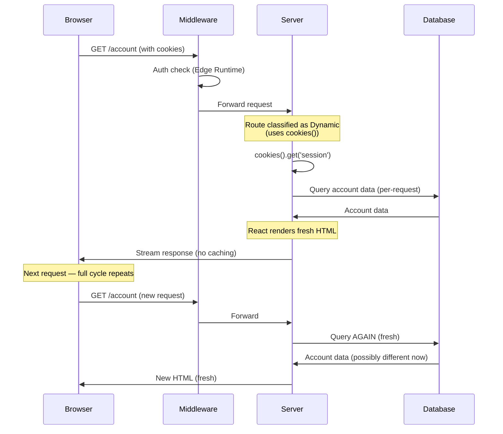
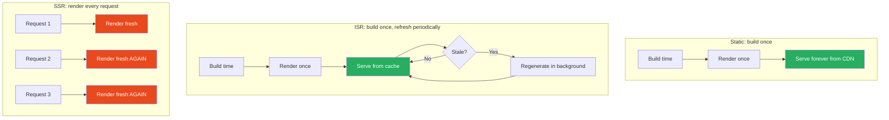

# 52 · Server-Side Rendering

> **Server-Side Rendering (SSR) renders a page's complete HTML on the server for every single request, using fresh data each time. Unlike static generation, there is no pre-built artifact to serve — the server does real work for every visitor. This makes SSR the right choice for content that must reflect the current moment (user-specific dashboards, real-time data, content gated by request-specific authorization) at the cost of higher latency and server load per request. This document covers how SSR works at the implementation level in the App Router, when it's automatically triggered, and how to architect SSR pages for acceptable performance.**

SSR is often misunderstood as "the default" rendering mode in Next.js — it isn't. The App Router defaults to static rendering and only falls back to SSR when your code explicitly requires request-time data. Understanding exactly what triggers this fallback, and how to architect around it, determines whether your "dynamic" pages perform like a SPA-killer or a server bottleneck.

---

## Table of Contents

- [SSR in the App Router Model](#ssr-in-the-app-router-model)
- [The Render Pipeline for Dynamic Routes](#the-render-pipeline-for-dynamic-routes)
- [What Triggers SSR Automatically](#what-triggers-ssr-automatically)
- [SSR Performance Characteristics](#ssr-performance-characteristics)
- [Reducing SSR Latency](#reducing-ssr-latency)
- [SSR with Streaming](#ssr-with-streaming)
- [SSR and Caching Layers](#ssr-and-caching-layers)
- [SSR vs getServerSideProps (Pages Router Comparison)](#ssr-vs-getserversideprops-pages-router-comparison)
- [Database Connection Management for SSR](#database-connection-management-for-ssr)
- [SSR and CDN Interaction](#ssr-and-cdn-interaction)
- [When SSR Is the Right Choice](#when-ssr-is-the-right-choice)
- [Hybrid Strategies: SSR + Static + Client](#hybrid-strategies-ssr--static--client)
- [Architecture Diagrams](#architecture-diagrams)
- [Good Practices](#good-practices)
- [Bad Practices](#bad-practices)
- [Mental Model](#mental-model)
- [Common Misconceptions](#common-misconceptions)
- [Exercises](#exercises)
- [Further Reading](#further-reading)

---

## SSR in the App Router Model

In the App Router, "SSR" isn't a separate API you call — it's what happens when a route is classified as dynamic:

```tsx
// This route is SSR because it uses cookies() (a dynamic API)
async function AccountPage() {
  const session = cookies().get("session");
  const account = await db.accounts.findUnique({
    where: { sessionToken: session?.value },
  });

  return <AccountDashboard account={account} />;
}

// Every request to /account:
// 1. Server receives request
// 2. AccountPage component function called fresh
// 3. cookies() reads THIS request's cookies
// 4. Database queried with THIS request's session
// 5. React renders HTML with THIS request's data
// 6. HTML streamed to THIS specific browser
// No caching, no pre-building — pure per-request computation
```

### SSR is automatic, not manually invoked

```tsx
// You don't write:
// export async function getServerSideProps() { ... }  ← Pages Router syntax

// You simply use APIs that require request-time information:
async function Page() {
  const headersList = headers(); // ← triggers SSR
  // or:
  const data = await fetch(url, { cache: "no-store" }); // ← triggers SSR
  // or:
  export const dynamic = "force-dynamic"; // ← explicitly forces SSR
}
```

---

## The Render Pipeline for Dynamic Routes

For an SSR route, here's the complete pipeline from request to response:

```
1. Request arrives at Next.js server
   GET /account HTTP/1.1
   Cookie: session=abc123

2. Middleware runs (if configured)
   Edge Runtime — auth checks, header injection

3. Next.js router matches the route
   app/account/page.tsx identified

4. React begins rendering (renderToPipeableStream or equivalent)
   Server Components execute:
   - cookies() reads request cookies
   - Database queries run (await db.accounts.findUnique(...))
   - JSX rendered with fetched data

5. Shell determination
   Content above any Suspense boundary = shell
   Shell + Suspense fallbacks sent first

6. Streaming continues
   As async components resolve, their HTML streams in

7. Client hydration
   Client Components in the response hydrate

8. Response complete
   No caching of this specific response (unless explicitly configured)
```

### Per-request execution cost

```
For each SSR request, the server does:
  1. Parse the request (cookies, headers, URL)
  2. Execute middleware (if any)
  3. Run all Server Component functions in the tree
  4. Execute all database queries / API calls
  5. Render React tree to HTML/RSC payload
  6. Stream the response

This is fundamentally different from static:
  Static: steps 1-2 only (serve pre-built file)
  SSR: all steps, every single time
```

---

## What Triggers SSR Automatically

```tsx
// 1. Reading cookies
import { cookies } from "next/headers";
const token = cookies().get("token");

// 2. Reading headers
import { headers } from "next/headers";
const userAgent = headers().get("user-agent");

// 3. Accessing searchParams as a page prop
async function Page({ searchParams }: { searchParams: { q?: string } }) {
  // Just having searchParams as a destructured prop triggers dynamic rendering
  // if you actually READ it
}

// 4. Explicit no-cache fetch
const data = await fetch(url, { cache: "no-store" });

// 5. Explicit dynamic config
export const dynamic = "force-dynamic";

// 6. Using non-deterministic functions WITHOUT revalidate
const random = Math.random(); // doesn't itself force dynamic, but breaks static correctness
// Next.js doesn't detect this automatically — you should add dynamic = 'force-dynamic'
// or use revalidate appropriately

// 7. unstable_noStore() — explicit opt-out of caching
import { unstable_noStore as noStore } from "next/cache";
async function Component() {
  noStore(); // forces this component's data fetching to be treated as dynamic
  const data = await fetchData();
}

// 8. connection() (React 19 / Next.js 15+)
import { connection } from "next/server";
async function Component() {
  await connection(); // explicitly wait for a real request (forces dynamic)
}
```

---

## SSR Performance Characteristics

### Latency budget for SSR pages

```
Total response time = Network + Server processing + Network

Server processing breakdown:
  Middleware execution:        1-10ms
  Route matching:               <1ms
  Server Component execution:   varies (the big variable)
  Database queries:             10-200ms (often the dominant cost)
  React rendering:               5-50ms (depends on tree size)
  Serialization:                 1-10ms

Typical total for a well-optimized SSR page: 50-200ms
Poorly optimized: 500-2000ms+
```

### What makes SSR slow

```
Common SSR performance killers:
  1. Sequential (waterfall) data fetching instead of parallel
  2. N+1 database queries (fetching related data in a loop)
  3. No database connection pooling (new connection per request)
  4. Large data transformations in the render path
  5. Synchronous CPU-intensive work (image processing, large JSON parsing)
  6. Missing database indexes (slow queries)
  7. Cold starts (serverless functions, especially Edge Runtime with heavy imports)
```

---

## Reducing SSR Latency

### Technique 1: Parallel data fetching

```tsx
// ❌ Sequential: 100ms + 150ms + 200ms = 450ms
async function Page() {
  const user = await fetchUser();
  const orders = await fetchOrders(user.id);
  const recommendations = await fetchRecommendations(user.id);
}

// ✅ Parallel where possible: max(100, 150) = 150ms, then +50ms for dependent fetch
async function Page() {
  const user = await fetchUser();
  const [orders, recommendations] = await Promise.all([
    fetchOrders(user.id),
    fetchRecommendations(user.id),
  ]);
}
```

### Technique 2: Streaming to avoid blocking the shell

```tsx
// Move slow, non-critical data behind Suspense
async function DashboardPage() {
  return (
    <>
      <DashboardHeader /> {/* fast, in shell */}
      <Suspense fallback={<MetricsSkeleton />}>
        <SlowMetrics /> {/* slow, streams independently */}
      </Suspense>
    </>
  );
}
```

### Technique 3: Database connection pooling

```tsx
// lib/db.ts — singleton connection pool
import { PrismaClient } from "@prisma/client";

const globalForPrisma = global as unknown as { prisma: PrismaClient };

export const db =
  globalForPrisma.prisma ||
  new PrismaClient({
    log: ["query"], // dev only
  });

if (process.env.NODE_ENV !== "production") {
  globalForPrisma.prisma = db;
}
// Reuses the same connection pool across requests in the same server process
// Without this: new PrismaClient() per request → connection exhaustion
```

### Technique 4: Reduce computation in the render path

```tsx
// ❌ Heavy computation in the component (blocks render)
async function ReportPage() {
  const rawData = await fetchLargeDataset(); // 10,000 rows
  const processed = rawData.map(complexTransform); // CPU-intensive, synchronous
  const aggregated = aggregateByCategory(processed); // more CPU work
  return <Report data={aggregated} />;
}

// ✅ Push computation to the database (faster, optimized engine)
async function ReportPage() {
  const aggregated = await db.$queryRaw`
    SELECT category, SUM(amount) as total, COUNT(*) as count
    FROM sales
    GROUP BY category
  `; // Database does the aggregation — much faster than JS
  return <Report data={aggregated} />;
}
```

### Technique 5: Edge Runtime for latency-sensitive SSR

```tsx
// For globally distributed users, Edge Runtime reduces network latency
export const runtime = "edge";

async function Page() {
  // Runs at the edge, closer to the user
  // BUT: limited to Edge-compatible data sources (HTTP-based DBs)
  const data = await fetch("https://api.example.com/data"); // Edge-compatible
  return <PageContent data={data} />;
}
```

---

## SSR with Streaming

SSR and streaming are not mutually exclusive — SSR pages can (and should) use Suspense for progressive rendering:

```tsx
export const dynamic = "force-dynamic"; // explicitly SSR

async function UserDashboard() {
  // Critical, fast data: in the shell
  const session = await getSession();

  return (
    <div>
      <Header user={session.user} /> {/* fast — in shell */}
      {/* Slower data streams independently */}
      <Suspense fallback={<MetricsSkeleton />}>
        <UserMetrics userId={session.userId} />
      </Suspense>
      <Suspense fallback={<ActivitySkeleton />}>
        <RecentActivity userId={session.userId} />
      </Suspense>
    </div>
  );
}
```

This combines SSR's freshness guarantee with streaming's perceived performance benefit. Even though the entire route is dynamic (re-rendered every request), the user still sees progressive content loading rather than a single blocking wait.

---

## SSR and Caching Layers

Even SSR pages can leverage some caching:

```tsx
// SSR page, but with cached sub-fetches
export const dynamic = "force-dynamic";

async function ProductPage({ params }: { params: { id: string } }) {
  // This part is genuinely dynamic (user-specific):
  const session = await getSession();
  const userPricing = await getPricingForUser(session?.userId);

  // This part CAN be cached (product info doesn't change per-user):
  const product = await fetch(`https://api.example.com/products/${params.id}`, {
    next: { revalidate: 300 }, // cached for 5 minutes, even within an SSR route
  }).then((r) => r.json());

  return <ProductView product={product} pricing={userPricing} />;
}
```

Important: even though the ROUTE is dynamic (forced by `getSession`/`cookies`), individual `fetch()` calls within it can still use the Data Cache. The route being dynamic means the HTML output isn't cached, but the underlying data fetches can be.

### HTTP caching headers for SSR responses

```tsx
// Route Handlers can set cache headers manually:
// app/api/live-data/route.ts
export async function GET() {
  const data = await fetchLiveData();

  return Response.json(data, {
    headers: {
      "Cache-Control": "private, no-cache, no-store, must-revalidate",
      // or for semi-fresh data:
      // 'Cache-Control': 's-maxage=10, stale-while-revalidate=59',
    },
  });
}
```

For page routes (not Route Handlers), Next.js manages caching headers automatically based on the rendering mode — you typically don't set them manually.

---

## SSR vs getServerSideProps (Pages Router Comparison)

| Aspect         | Pages Router (getServerSideProps) | App Router (SSR via dynamic APIs)          |
| -------------- | --------------------------------- | ------------------------------------------ |
| Trigger        | Explicit function export          | Implicit (using cookies/headers/no-store)  |
| Data location  | Separate function, returns props  | Inline in the component (async/await)      |
| Composition    | Single function per page          | Each component fetches its own data        |
| Streaming      | Not supported                     | Native support via Suspense                |
| Granularity    | Whole-page                        | Component-level (some parts can be cached) |
| Request object | Full access to req/res            | Limited access via cookies()/headers()     |

```tsx
// Pages Router equivalent:
export const getServerSideProps: GetServerSideProps = async (context) => {
  const session = await getSession({ req: context.req });
  const data = await fetchData(session.userId);
  return { props: { data } };
};
function Page({ data }) {
  return <PageView data={data} />;
}

// App Router equivalent:
async function Page() {
  const session = await getSession(); // reads cookies() internally
  const data = await fetchData(session.userId);
  return <PageView data={data} />;
}
// Same SSR behavior, but co-located and composable with Suspense
```

---

## Database Connection Management for SSR

SSR's per-request execution model creates specific database connection challenges:

```
Serverless deployment (Vercel, AWS Lambda):
  Each request MAY spin up a new function instance
  Each instance needs its own DB connection (or pool)
  Risk: connection exhaustion under high concurrency

Solution 1: Connection pooling service
  PgBouncer, Prisma Accelerate, Neon's connection pooler
  Sits between your app and the database
  Manages a fixed pool of real connections, multiplexes app connections

Solution 2: Serverless-friendly database drivers
  Neon serverless driver (HTTP-based, no persistent connection)
  PlanetScale serverless driver (HTTP-based)
  These avoid the connection-per-instance problem entirely

Solution 3: Reuse connections across invocations (warm starts)
  global.prisma pattern (shown above)
  Works for warm function instances, not cold starts
```

```tsx
// lib/db.ts — Neon serverless driver example
import { neon } from "@neondatabase/serverless";

const sql = neon(process.env.DATABASE_URL!);

export async function getUser(id: string) {
  const [user] = await sql`SELECT * FROM users WHERE id = ${id}`;
  return user;
}
// HTTP-based: no connection pool needed, works in Edge Runtime too
```

---

## SSR and CDN Interaction

Even fully dynamic SSR pages can benefit from CDN-level caching in specific scenarios:

```tsx
// For SSR pages that are the SAME for all users at a given moment
// (but still need server computation, e.g., expensive aggregation)
// Use Route Handler with explicit cache headers:

// app/api/live-leaderboard/route.ts
export async function GET() {
  const leaderboard = await computeExpensiveLeaderboard(); // 2 seconds!

  return Response.json(leaderboard, {
    headers: {
      "Cache-Control": "public, s-maxage=10, stale-while-revalidate=30",
      // CDN caches for 10s, serves stale for up to 30s while revalidating
    },
  });
}

// Client Component fetches this:
("use client");
function Leaderboard() {
  const { data } = useSWR("/api/live-leaderboard", fetcher, {
    refreshInterval: 10000,
  });
  return <LeaderboardView data={data} />;
}
```

This pattern moves the "dynamic" computation to a cacheable API endpoint, decoupling it from the page's own rendering mode.

---

## When SSR Is the Right Choice

```
✅ Use SSR when:
  - Content is genuinely different per request/user
  - Authentication state determines what's shown
  - Data changes too frequently for ISR to be worthwhile
  - SEO requires fully rendered, request-specific content
  - You need request headers/cookies for rendering decisions

❌ Don't use SSR when:
  - Content is the same for all users (use Static or ISR)
  - Data changes infrequently (use ISR instead)
  - Performance is critical and data doesn't need to be request-fresh
  - You're tempted to use SSR "just in case" — measure first

⚠️ Hybrid approach (most common in practice):
  - Static shell + dynamic islands (Client Components fetching their own data)
  - This avoids making the ENTIRE page SSR for a small dynamic part
```

---

## Hybrid Strategies: SSR + Static + Client

The most performant real-world applications mix rendering strategies within a single page:

```tsx
// app/products/[id]/page.tsx
// Static shell for product info (rarely changes)
// SSR-equivalent for personalized pricing (via Client Component)
// ISR for inventory status

async function ProductPage({ params }: { params: { id: string } }) {
  // Static-cacheable: product details
  const product = await fetch(`https://api.example.com/products/${params.id}`, {
    next: { revalidate: 3600 },
  }).then((r) => r.json());

  return (
    <article>
      {/* Static: cached, fast */}
      <ProductInfo product={product} />

      {/* ISR: inventory, refreshed periodically */}
      <Suspense fallback={<InventorySkeleton />}>
        <InventoryStatus productId={params.id} />
      </Suspense>

      {/* Client-side "SSR-equivalent": personalized pricing fetched after page loads */}
      <PersonalizedPricing productId={params.id} />
    </article>
  );
}

// This component is itself static/ISR (uses next: { revalidate })
async function InventoryStatus({ productId }: { productId: string }) {
  const inventory = await fetch(
    `https://api.example.com/inventory/${productId}`,
    {
      next: { revalidate: 30 }, // 30 second freshness
    },
  ).then((r) => r.json());
  return <InventoryBadge count={inventory.count} />;
}

// Client Component: fetches user-specific data without making the PAGE dynamic
("use client");
function PersonalizedPricing({ productId }: { productId: string }) {
  const { data: pricing } = useSWR(`/api/pricing/${productId}`, fetcher);
  if (!pricing) return <PricingSkeleton />;
  return <PriceDisplay pricing={pricing} />;
}
```

**Result:** the page itself is static (or ISR) — fast TTFB from CDN. Personalization happens client-side after the static shell loads, avoiding the cost of making the ENTIRE page dynamic just for one personalized element.

---

## Architecture Diagrams

### SSR request lifecycle



### Rendering mode comparison



---

## Good Practices

### ✅ Good Practice — Minimizing the dynamic surface area

```tsx
/**
 * Good: Only the genuinely user-specific part of the page is SSR.
 * Product data is static/ISR. Personalization is isolated.
 * This minimizes server load while maintaining freshness where needed.
 */

// app/products/[id]/page.tsx — NOT forced dynamic
async function ProductPage({ params }: { params: { id: string } }) {
  // Cacheable data — doesn't force dynamic rendering
  const product = await fetch(`https://api.example.com/products/${params.id}`, {
    next: { revalidate: 600 },
  }).then((r) => r.json());

  return (
    <article>
      <ProductDetails product={product} />

      {/* Isolated dynamic section — Server Component using cookies() */}
      <Suspense fallback={<RecommendationsSkeleton />}>
        <PersonalizedRecommendations productId={params.id} />
      </Suspense>
    </article>
  );
}

// This component uses cookies() — but it's isolated in its own Suspense boundary
// In future Next.js versions with stable PPR, this keeps the rest of the page static
async function PersonalizedRecommendations({
  productId,
}: {
  productId: string;
}) {
  const userId = cookies().get("user_id")?.value;
  const recommendations = userId
    ? await getPersonalizedRecs(userId, productId)
    : await getGenericRecs(productId);

  return <RecommendationGrid items={recommendations} />;
}
```

---

## Bad Practices

### ⚠️ Bad Practice — N+1 queries in SSR causing severe latency

```tsx
/**
 * Bad: Fetching related data in a loop instead of a single batched query.
 * For a page with 20 items, this means 21 sequential database round-trips
 * instead of 2. Each round-trip has network latency (even to a fast DB,
 * this is 1-5ms — multiplied by 20 items, it adds up).
 */
async function OrderHistoryPage() {
  const session = await getSession();
  const orders = await db.orders.findMany({
    where: { userId: session.userId },
    take: 20,
  });

  // ❌ N+1: one query per order to get its items
  const ordersWithItems = await Promise.all(
    orders.map(async (order) => {
      const items = await db.orderItems.findMany({
        where: { orderId: order.id },
      }); // 20 separate queries!
      return { ...order, items };
    }),
  );

  return <OrderHistory orders={ordersWithItems} />;
}

/**
 * ✅ Fix: Single query with include/join
 */
async function OrderHistoryPage() {
  const session = await getSession();

  // ✅ One query: database JOIN handles the relation
  const orders = await db.orders.findMany({
    where: { userId: session.userId },
    take: 20,
    include: { items: true }, // Prisma generates a single optimized query
  });

  return <OrderHistory orders={orders} />;
}
```

**Production impact:** An order history page with N+1 queries took 800ms to render under normal load (20 orders × 35ms per query + overhead). Under load testing with 50 concurrent users, response times degraded to 3-4 seconds as the database connection pool became saturated by the volume of small queries. After fixing the N+1 with a single JOIN query: response time dropped to 60ms, and the page handled 10x the concurrent load without degradation.

---

## Mental Model

> 💡 **The SSR mental model:**
>
> SSR is like a **custom tailor making a suit for each customer**, compared to static generation's "off-the-rack" suits hanging ready on a rack (CDN). Every customer (request) who walks in gets individual attention: measurements taken (cookies/headers read), fabric selected based on their preferences (database queries for their specific data), and the suit assembled fresh (React rendering). This produces a perfect fit (exactly right content for this user) but takes time — you can't pre-make a suit for someone whose measurements you don't know yet. ISR is like a tailor who keeps a few popular sizes pre-made and only does custom work when a non-standard size is requested, refreshing the pre-made stock periodically. The key insight: most of your customers (page visitors) probably fit standard sizes (cacheable content) — reserve the custom tailoring (SSR) for the parts that genuinely need it.

---

## Common Misconceptions

### "SSR is the default rendering mode in Next.js App Router"

The default is static rendering. SSR (dynamic rendering) only happens when your code uses dynamic APIs (cookies, headers, searchParams) or explicitly sets `dynamic = 'force-dynamic'`.

### "SSR pages can't use any caching"

The ROUTE'S html output isn't cached when SSR, but individual `fetch()` calls within an SSR route can still use the Data Cache with `next: { revalidate }`. SSR means the page structure renders fresh each time, not that every piece of data is uncached.

### "SSR and streaming are mutually exclusive"

They compose naturally. An SSR route (forced dynamic by `cookies()`) can still use Suspense boundaries for progressive rendering — the route just won't have its overall HTML output cached.

### "More server resources fix slow SSR"

Often, slow SSR is caused by architectural issues (N+1 queries, sequential fetching, missing indexes) rather than insufficient compute. Scaling server resources without fixing the underlying inefficiency just delays the problem and increases cost.

### "SSR always means slower than static"

For genuinely personalized or real-time content, SSR is necessary — there's no static alternative that provides the correct experience. The comparison isn't "SSR vs static" in the abstract; it's "is this specific content cacheable or not."

---

## Exercises

### Exercise 1 — Identify and fix N+1 queries

Find a component in a codebase (or write one) that fetches related data in a `.map()` with `await` inside. Refactor it to use a single query with `include` or a JOIN. Measure the latency difference with realistic data volumes (50-100 related records).

### Exercise 2 — Measure SSR vs Static for the same content

Build the same page twice:

1. Force it dynamic with `export const dynamic = 'force-dynamic'`
2. Remove that and let it be static (or ISR)

Load test both with a tool like `autocannon` or `k6` at 50 concurrent requests. Compare:

- Average response time
- p95/p99 response time
- Server CPU usage

### Exercise 3 — Build a hybrid page

Create a product page where:

1. Product info: static, revalidate every hour
2. Inventory count: ISR, revalidate every 30 seconds
3. "Recently viewed by you": Client Component using localStorage + client fetch (no server dynamic needed)
4. "Recommended for you" (using cookies for personalization): isolated Server Component in its own Suspense boundary

Verify the build output shows the page as static/ISR (not forced dynamic) if your Next.js version supports PPR, or document the trade-off if not.

---

## Further Reading

- [Next.js docs: Server Rendering](https://nextjs.org/docs/app/building-your-application/rendering/server-components#dynamic-rendering) — Dynamic rendering reference
- [Next.js docs: Route Segment Config](https://nextjs.org/docs/app/api-reference/file-conventions/route-segment-config#dynamic) — dynamic export options
- [Next.js docs: unstable_noStore](https://nextjs.org/docs/app/api-reference/functions/unstable_noStore) — Explicit dynamic opt-in
- [Prisma docs: Connection management](https://www.prisma.io/docs/orm/prisma-client/setup-and-configuration/databases-connections) — Connection pooling strategies
- [Neon: Serverless driver](https://neon.tech/docs/serverless/serverless-driver) — HTTP-based Postgres for serverless
- Next in this handbook: [53 · Incremental Static Regeneration](./04-incremental-static-regeneration.md)

---

_Part of the [React + Next.js Engineering Handbook](../../README.md)_
