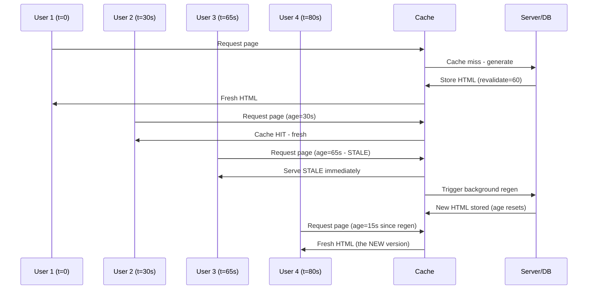
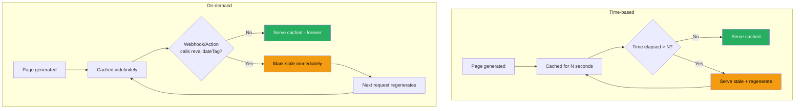

# 53 · Incremental Static Regeneration

> **Incremental Static Regeneration (ISR) is Next.js's mechanism for getting static generation's performance with periodic freshness — without rebuilding the entire site. A page is generated once (at build time or on first request), served from cache for a configured window, and regenerated in the background when that window expires. The crucial property: stale content is served immediately while fresh content generates behind the scenes, so no user ever waits for a regeneration. Understanding the exact mechanics of when regeneration triggers, how concurrent requests are handled during regeneration, and how on-demand revalidation fits in is essential for using ISR correctly at scale.**

ISR sits at the architectural sweet spot between two extremes: full static generation (fast but stale until the next deploy) and full SSR (always fresh but slow and expensive per request). For the large class of content that changes periodically but not on every request — product catalogs, blog content, dashboards with acceptable staleness — ISR delivers near-static performance with bounded staleness.

---

## Table of Contents

- [The Core ISR Mechanism](#the-core-isr-mechanism)
- [Time-Based Revalidation](#time-based-revalidation)
- [The Stale-While-Revalidate Algorithm](#the-stale-while-revalidate-algorithm)
- [On-Demand Revalidation](#on-demand-revalidation)
- [revalidatePath vs revalidateTag](#revalidatepath-vs-revalidatetag)
- [ISR for Dynamic Routes Not Pre-Built](#isr-for-dynamic-routes-not-pre-built)
- [Concurrent Requests During Regeneration](#concurrent-requests-during-regeneration)
- [ISR and the Data Cache Relationship](#isr-and-the-data-cache-relationship)
- [ISR on Different Deployment Platforms](#isr-on-different-deployment-platforms)
- [ISR Failure Handling](#isr-failure-handling)
- [Combining ISR with Suspense Streaming](#combining-isr-with-suspense-streaming)
- [Choosing Revalidation Windows](#choosing-revalidation-windows)
- [ISR at Scale: Operational Considerations](#isr-at-scale-operational-considerations)
- [Architecture Diagrams](#architecture-diagrams)
- [Good Practices](#good-practices)
- [Bad Practices](#bad-practices)
- [Mental Model](#mental-model)
- [Common Misconceptions](#common-misconceptions)
- [Exercises](#exercises)
- [Further Reading](#further-reading)

---

## The Core ISR Mechanism

ISR is configured via the `revalidate` option, either on a `fetch()` call or as a route segment export:

```tsx
// Per-fetch revalidation:
async function ProductsPage() {
  const products = await fetch("https://api.example.com/products", {
    next: { revalidate: 60 }, // this fetch's data is fresh for 60 seconds
  }).then((r) => r.json());

  return <ProductGrid products={products} />;
}

// Route-level revalidation (applies to the whole route's cache):
export const revalidate = 60;

async function ProductsPage() {
  const products = await db.products.findMany(); // direct DB call
  return <ProductGrid products={products} />;
}
```

### What revalidate actually controls

```
revalidate = 60 means:
  "This cached HTML page is considered FRESH for 60 seconds after generation.
   After 60 seconds, the NEXT request triggers a background regeneration.
   That request still receives the STALE (cached) version immediately."

It does NOT mean:
  "Regenerate every 60 seconds on a timer" (there's no background cron)
  "After 60 seconds, users wait for fresh content" (they get stale instantly)
```

---

## Time-Based Revalidation

The complete timeline of a time-based ISR page:

```
t=0 (build time or first request):
  Page generated → HTML cached → timestamp recorded
  Cache entry: { html: "...", generatedAt: 0, revalidate: 60 }

t=30s: Request arrives
  Cache age: 30s < 60s revalidate window → FRESH
  Serve cached HTML immediately (no regeneration)

t=45s: Another request
  Cache age: 45s < 60s → still FRESH
  Serve cached HTML immediately

t=65s: Request arrives
  Cache age: 65s > 60s revalidate window → STALE
  Action:
    1. Serve the STALE cached HTML immediately to THIS request
    2. Trigger background regeneration (non-blocking)
  This user got a 5-second-stale page, but instantly (no wait)

t=65.1s: Background regeneration starts
  Page component re-executes
  New data fetched
  New HTML generated
  Cache updated: { html: "new...", generatedAt: 65.1, revalidate: 60 }

t=70s: Another request arrives (during regeneration, if slow)
  If regeneration still in progress: serve the OLD stale HTML
  (Next.js doesn't make concurrent requests wait for regeneration)

t=80s: Request arrives (after regeneration complete)
  Cache age: 80 - 65.1 = ~15s < 60s → FRESH (with the NEW data)
  Serve cached HTML (now updated)
```

---

## The Stale-While-Revalidate Algorithm

This pattern — serve stale immediately, refresh in background — is formally known as stale-while-revalidate (SWR), and it's the foundation of ISR:

```
Traditional cache (cache-then-network):
  Cache expired → wait for fresh data → THEN respond
  User experience: delay when cache expires

Stale-while-revalidate:
  Cache expired → respond with stale data IMMEDIATELY → fetch fresh data in background
  User experience: never wait, eventually consistent
```

### Why this matters for user experience

```
Without SWR (naive cache invalidation):
  99% of requests: fast (cache hit)
  1% of requests (right after expiry): SLOW (full regeneration wait)
  → Inconsistent experience, "thundering herd" risk if many requests
    arrive simultaneously after expiry

With SWR (ISR's approach):
  100% of requests: fast (always serve from cache)
  Background: regeneration happens invisibly
  → Consistent fast experience for ALL users, always
```

---

## On-Demand Revalidation

Time-based revalidation works on a schedule, but many use cases need revalidation triggered by an EVENT (a CMS publish, a price update, a Server Action mutation):

```tsx
// actions/product-actions.ts
"use server";
import { revalidatePath, revalidateTag } from "next/cache";

export async function updateProductPrice(productId: string, newPrice: number) {
  await db.products.update({
    where: { id: productId },
    data: { price: newPrice },
  });

  // Immediately invalidate the cache — next request regenerates
  revalidatePath(`/products/${productId}`);
  revalidatePath("/products"); // the listing page too
}
```

```tsx
// Webhook-triggered revalidation (e.g., from a CMS)
// app/api/revalidate/route.ts
import { revalidateTag } from "next/cache";
import { NextRequest, NextResponse } from "next/server";

export async function POST(request: NextRequest) {
  const secret = request.headers.get("x-webhook-secret");
  if (secret !== process.env.REVALIDATION_SECRET) {
    return NextResponse.json({ error: "Unauthorized" }, { status: 401 });
  }

  const { tag } = await request.json();
  revalidateTag(tag);

  return NextResponse.json({ revalidated: true, tag, now: Date.now() });
}
```

### On-demand revalidation timeline

```
t=0: Page generated, cached (revalidate: 3600 — 1 hour window)
t=120s: Editor publishes a change in the CMS
t=120.5s: CMS webhook fires → POST /api/revalidate { tag: 'product-123' }
t=120.6s: revalidateTag('product-123') called
  → Cache entry for tag 'product-123' marked stale IMMEDIATELY
  → Does NOT wait for the 3600s window

t=121s: Next user visits the page
  → Cache marked stale → regenerate NOW (or serve-stale-then-regenerate,
    depending on configuration)
  → User sees updated content within seconds of the CMS publish
```

On-demand revalidation decouples freshness from a fixed timer — content updates propagate as fast as the webhook fires, while still benefiting from caching between updates.

---

## revalidatePath vs revalidateTag

### revalidatePath: invalidate by URL

```tsx
import { revalidatePath } from "next/cache";

// Specific page:
revalidatePath("/products/123");

// Page type (layout-level — invalidates all routes sharing this layout):
revalidatePath("/products/[id]", "page");

// Entire subtree (layout invalidation cascades to all children):
revalidatePath("/products", "layout");
```

`revalidatePath` works by URL — it doesn't care what fetches were used to generate that page, it just marks the cache entry for that route as stale.

### revalidateTag: invalidate by data dependency

```tsx
// Tag fetches when creating them:
async function ProductPage({ params }: { params: { id: string } }) {
  const product = await fetch(`https://api.example.com/products/${params.id}`, {
    next: { tags: [`product-${params.id}`, "all-products"] },
  }).then((r) => r.json());
  // ...
}

async function ProductsListPage() {
  const products = await fetch("https://api.example.com/products", {
    next: { tags: ["all-products"] },
  }).then((r) => r.json());
  // ...
}

// Later, invalidate by tag:
revalidateTag(`product-123`); // invalidates only that product's page
revalidateTag("all-products"); // invalidates EVERY fetch tagged 'all-products'
// (both the list page AND any product detail pages
//  that also used this tag)
```

### Choosing between them

```
Use revalidatePath when:
  - You know the exact URL(s) affected
  - The relationship between data and pages is simple (1 entity = 1 page)

Use revalidateTag when:
  - The same data appears on multiple, unpredictable pages
  - You want to invalidate by DATA DEPENDENCY rather than URL
  - Example: a "featured" flag on a product might affect the homepage,
    a category page, AND the product page — tag all three with 'featured-products'
```

---

## ISR for Dynamic Routes Not Pre-Built

Combining `generateStaticParams` (partial) with `dynamicParams: true` and `revalidate` creates a powerful pattern: pre-build popular content, generate the rest on-demand with the SAME caching behavior:

```tsx
// app/products/[id]/page.tsx

export async function generateStaticParams() {
  // Pre-build only the top 100 products
  const topProducts = await db.products.findMany({
    orderBy: { viewCount: "desc" },
    take: 100,
    select: { id: true },
  });
  return topProducts.map((p) => ({ id: p.id }));
}

export const revalidate = 3600; // 1 hour for ALL products (built and on-demand)

async function ProductPage({ params }: { params: { id: string } }) {
  const product = await db.products.findUnique({ where: { id: params.id } });
  if (!product) notFound();
  return <ProductView product={product} />;
}
```

### What happens for a product NOT in the top 100

```
First request for /products/50000 (not pre-built):
  1. No cache entry exists
  2. Next.js renders the page ON DEMAND (like SSR, but...)
  3. Result is CACHED after generation (revalidate: 3600 applies)
  4. Response sent to this user (slight delay — first-request cost)

Second request for /products/50000 (within 1 hour):
  1. Cache HIT — served instantly
  2. No regeneration needed

Request after 1 hour:
  1. Stale-while-revalidate kicks in
  2. Serve stale, regenerate in background
  3. Same behavior as a pre-built page from this point forward
```

This means: after the first request, ANY page (pre-built or not) behaves identically under ISR rules. The only difference is the very first request pays the generation cost instead of getting an instant cache hit.

---

## Concurrent Requests During Regeneration

A critical correctness question: what happens if 1000 requests arrive simultaneously for a stale page?

```
Without proper handling (naive implementation):
  1000 requests → 1000 simultaneous regenerations → "thundering herd"
  Database gets hit with 1000 identical queries
  Server CPU spikes processing 1000 redundant renders

Next.js's actual behavior:
  1000 requests arrive for a stale page
  → ALL 1000 receive the STALE cached response immediately
  → ONLY ONE regeneration is triggered (Next.js deduplicates this)
  → The single regeneration updates the cache for FUTURE requests
  → No thundering herd — the system is protected by design
```

This deduplication happens at the platform level (Vercel's infrastructure or Next.js's internal locking mechanism for self-hosted deployments) and is a core correctness guarantee of ISR — without it, ISR would be dangerous to use under load.

---

## ISR and the Data Cache Relationship

ISR operates on two layers that interact:

```
Layer 1: Full Route Cache (the HTML + RSC payload)
  Controlled by: revalidate at the route segment level
  Stores: complete rendered output

Layer 2: Data Cache (individual fetch() results)
  Controlled by: next.revalidate per fetch() call
  Stores: raw response data

Interaction example:
  export const revalidate = 60; // Route-level: regenerate HTML every 60s

  async function Page() {
    const a = await fetch(urlA, { next: { revalidate: 30 } }); // more frequent
    const b = await fetch(urlB, { next: { revalidate: 120 } }); // less frequent
    // ...
  }

  What happens at t=65s (route regeneration triggered):
    - fetch(urlA): cache age 65s > 30s → ALSO stale → new network request
    - fetch(urlB): cache age 65s < 120s → still FRESH → served from Data Cache
    - Route regenerates using: NEW data for A, CACHED data for B
    - Faster regeneration because B didn't need a new network round-trip
```

This layered caching means route-level regeneration doesn't necessarily mean every underlying fetch refetches — only the ones whose own revalidate window has also expired.

---

## ISR on Different Deployment Platforms

### Vercel

```
Vercel's ISR implementation:
  - Distributed cache across Vercel's edge network
  - On-demand revalidation propagates globally within seconds
  - Automatic deduplication of concurrent regeneration requests
  - Cache persists across deployments (same project)
  - Generous default caching behavior, minimal configuration needed
```

### Self-hosted (Node.js server)

```
Self-hosted ISR:
  - Cache stored on the local file system (.next/cache)
  - If running multiple server instances (load balanced):
    each instance has its OWN cache — can serve different staleness
    levels to different users hitting different instances!
  - Solution: shared cache layer (Redis, shared file system, or a CDN
    in front of all instances)

next.config.js for custom cache handler:
  module.exports = {
    cacheHandler: require.resolve('./cache-handler.js'),
    cacheMaxMemorySize: 0, // disable default in-memory caching
  };

  // cache-handler.js implements get/set/revalidateTag using Redis
```

### Self-hosted ISR with Redis (multi-instance consistency)

```js
// cache-handler.js
const { createClient } = require("redis");

class RedisCacheHandler {
  constructor(options) {
    this.client = createClient({ url: process.env.REDIS_URL });
    this.client.connect();
  }

  async get(key) {
    const data = await this.client.get(key);
    return data ? JSON.parse(data) : null;
  }

  async set(key, data, ctx) {
    await this.client.set(key, JSON.stringify(data), {
      EX: ctx.revalidate || 3600,
    });
  }

  async revalidateTag(tag) {
    // Find and invalidate all keys with this tag
    const keys = await this.client.sMembers(`tag:${tag}`);
    if (keys.length) await this.client.del(keys);
  }
}

module.exports = RedisCacheHandler;
```

Without a shared cache handler, self-hosted multi-instance deployments can serve inconsistent staleness to different users — a correctness issue worth solving explicitly.

---

## ISR Failure Handling

What happens when a background regeneration fails (database down, API error)?

```tsx
async function ProductPage({ params }: { params: { id: string } }) {
  try {
    const product = await db.products.findUnique({ where: { id: params.id } });
    if (!product) notFound();
    return <ProductView product={product} />;
  } catch (error) {
    // If regeneration fails:
    // Next.js KEEPS serving the last successfully generated (stale) version
    // The error is logged, but users are NOT shown an error page
    // This is a resilience feature: a temporary DB outage doesn't take down
    // already-cached pages
    throw error; // re-throw so Next.js can apply this fallback behavior
  }
}
```

### The resilience guarantee

```
ISR failure handling:
  Regeneration attempt fails (exception thrown)
  → Next.js logs the error
  → The STALE cached version remains in place (NOT replaced with an error page)
  → Users continue seeing the last successfully generated content
  → Next regeneration attempt happens at the next revalidate window

This means: a database outage during ISR regeneration doesn't cause
visible errors for users IF a previous successful generation exists.
The first-ever generation (no prior cache) WOULD show an error if it fails.
```

---

## Combining ISR with Suspense Streaming

ISR pages can use Suspense for progressive rendering — the entire cached output includes the streamed result:

```tsx
export const revalidate = 300; // 5-minute ISR window

async function ProductPage({ params }: { params: { id: string } }) {
  const product = await db.products.findUnique({ where: { id: params.id } });

  return (
    <article>
      <ProductHero product={product} />

      {/* This Suspense boundary's content is ALSO part of the cached page */}
      <Suspense fallback={<ReviewsSkeleton />}>
        <ProductReviews productId={product.id} />
      </Suspense>
    </article>
  );
}
```

When this page is generated (at build time or on regeneration), Next.js resolves ALL Suspense boundaries before caching the complete result — the cached HTML includes the fully resolved reviews section, not a perpetual loading state. Streaming during GENERATION provides faster TTFB during the build/regeneration process itself, but the final CACHED output is complete.

---

## Choosing Revalidation Windows

```
Very short (10-30s):
  Use for: near-real-time data where eventual consistency of seconds is OK
  Example: live sports scores, stock tickers (though true real-time needs WebSockets)

Short (60-300s, 1-5 min):
  Use for: frequently changing but not critical-instant data
  Example: product inventory counts, trending content rankings

Medium (3600s, 1 hour):
  Use for: content that updates periodically through the day
  Example: news article view counts, "popular this week" lists

Long (86400s, 1 day):
  Use for: content that rarely changes but isn't permanently static
  Example: blog post content (in case of typo fixes), category listings

Very long / false (no revalidate):
  Use for: content that only changes via deployment or on-demand revalidation
  Example: marketing pages, documentation (use revalidateTag on publish instead)
```

### The on-demand-first strategy

```
Best practice for content with a "publish" action (CMS, admin panel):
  1. Set a LONG revalidate window (or none) as a safety net
  2. Use on-demand revalidation (revalidateTag/revalidatePath) as the PRIMARY trigger
  3. This gives you: instant updates when content changes (on-demand)
     PLUS protection against missed webhooks (the safety-net timer)

export const revalidate = 86400; // safety net: refresh daily even if webhook missed

// Primary mechanism: webhook calls revalidateTag() immediately on publish
```

---

## ISR at Scale: Operational Considerations

```
Cache storage growth:
  Every unique dynamic path generates its own cache entry
  10,000 products × cached HTML (~20KB avg) = ~200MB cache storage
  Plan storage accordingly for self-hosted deployments

Cache key collisions:
  Different searchParams combinations on the SAME path can create
  many cache entries if the page reads searchParams
  Be deliberate: searchParams usage forces dynamic rendering (no ISR)
  unless explicitly cached via Route Handlers

Monitoring ISR health:
  Track: cache hit rate, regeneration frequency, regeneration failures
  Vercel Analytics shows ISR cache hit/miss rates
  Self-hosted: instrument your cache handler with custom metrics

Purge strategy for content deletion:
  When content is DELETED (not just updated), explicitly revalidate
  so the cache doesn't serve a "ghost" page for content that no longer exists
  revalidatePath(`/products/${deletedId}`) after deletion
```

---

## Architecture Diagrams

### ISR stale-while-revalidate timeline



### On-demand vs time-based revalidation



---

## Good Practices

### ✅ Good Practice — Layered revalidation strategy for an e-commerce catalog

```tsx
/**
 * Good: Combine time-based safety net with on-demand precision.
 * Product pages refresh hourly automatically (safety net).
 * Admin actions trigger immediate revalidation (precision).
 * Tags allow invalidating related pages together.
 */

// app/products/[id]/page.tsx
export const revalidate = 3600; // safety net: always refresh within an hour

async function ProductPage({ params }: { params: { id: string } }) {
  const product = await fetch(`https://api.example.com/products/${params.id}`, {
    next: { tags: [`product-${params.id}`, "products"] },
  }).then((r) => r.json());

  return <ProductView product={product} />;
}

// actions/admin-actions.ts
("use server");
import { revalidateTag } from "next/cache";

export async function updateProduct(
  productId: string,
  data: ProductUpdateData,
) {
  await db.products.update({ where: { id: productId }, data });

  // Immediate, precise invalidation
  revalidateTag(`product-${productId}`); // this specific product page

  if (data.featured !== undefined) {
    revalidateTag("products"); // listing pages that show products
  }
}

export async function deleteProduct(productId: string) {
  await db.products.delete({ where: { id: productId } });

  // Important: revalidate on deletion too, or the page might serve
  // a "ghost" cached version of a product that no longer exists
  revalidateTag(`product-${productId}`);
  revalidateTag("products");
}
```

---

## Bad Practices

### ⚠️ Bad Practice — Relying solely on short time-based revalidation for urgent updates

```tsx
/**
 * Bad: Using a very short revalidate window to simulate "real-time" updates,
 * instead of using on-demand revalidation for events that actually need
 * immediate propagation.
 *
 * This wastes server resources (frequent unnecessary regeneration)
 * AND doesn't even guarantee true real-time freshness (regeneration only
 * happens when the NEXT request arrives after expiry).
 */

// ❌ Aggressive polling-style revalidation for "urgent" content
export const revalidate = 5; // every 5 seconds!

async function FlashSalePage() {
  const sale = await db.flashSales.findFirst({ where: { active: true } });
  return <FlashSaleDisplay sale={sale} />;
}
// Problems:
// 1. Regenerates up to every 5 seconds IF traffic is constant — wasteful
//    if the flash sale data only changes a few times per day
// 2. If traffic is LOW: a request at t=4s gets STALE data from 4 seconds ago,
//    but the next regeneration only happens when someone requests AFTER t=5s
//    — there's no guarantee of "exactly every 5 seconds" freshness
// 3. When the admin actually starts/ends the flash sale, users might still
//    see the old state for up to 5 seconds (small but unnecessary delay)

/**
 * ✅ Fix: Long safety-net window + on-demand revalidation for the actual event
 */
export const revalidate = 3600; // safety net only

async function FlashSalePage() {
  const sale = await db.flashSales.findFirst({
    where: { active: true },
    // tag for on-demand revalidation
  });
  return <FlashSaleDisplay sale={sale} />;
}

// When admin starts/ends the sale (the ACTUAL event that matters):
("use server");
export async function toggleFlashSale(saleId: string, active: boolean) {
  await db.flashSales.update({ where: { id: saleId }, data: { active } });
  revalidatePath("/flash-sale"); // instant update, exactly when it matters
}
```

**Production impact:** A retail site used `revalidate: 5` on their homepage to show "live" inventory counts, generating thousands of unnecessary regenerations per hour during high-traffic periods, each hitting the database. Server costs increased 3x. The actual inventory only changed a few times per minute. Switching to `revalidate: 300` (5 minutes) as a safety net plus `revalidateTag('inventory')` triggered from the actual order-processing system reduced database load by 95% while making inventory updates appear FASTER (near-instant via webhook vs the previous worst-case 5-second staleness).

---

## Mental Model

> 💡 **The ISR mental model:**
>
> ISR is like a **museum's printed exhibition guide with a corrections desk**. The guide (the static page) is printed in bulk and handed to every visitor instantly — no one waits at the door for a fresh copy. Periodically (the revalidate window), the museum checks if anything in the guide is outdated and reprints a batch for future visitors — but the visitor who arrives the moment before the reprint still gets the (slightly outdated, but still useful) old guide instantly. If the museum discovers something urgently wrong (a piece is removed, a fact is corrected), they don't wait for the periodic reprint — they go straight to the corrections desk (revalidateTag) and update the master copy immediately, so the NEXT printed batch reflects the fix right away. The system favors "never make anyone wait" over "always perfectly fresh" — and gives you a manual override for when freshness matters more than the periodic schedule.

---

## Common Misconceptions

### "revalidate: 60 means the page is regenerated every 60 seconds automatically"

There is no background timer. Regeneration happens lazily — triggered by the NEXT request that arrives after the 60-second window has passed. If no one visits the page, it never regenerates (which is fine — no one's loading stale data, either).

### "ISR causes users to wait for regeneration"

Users NEVER wait for ISR regeneration. They always receive the cached version immediately — either fresh (within the window) or stale (triggering a background regen for future requests). The exception is the very FIRST request for an unbuilt dynamic path, which does wait for initial generation.

### "On-demand revalidation replaces the need for revalidate windows"

They serve complementary purposes. On-demand revalidation handles known events (a CMS publish, an admin edit). A revalidate window acts as a safety net for cases where the on-demand trigger might be missed (webhook failures, manual database edits, external system changes you don't have a webhook for).

### "ISR works the same on every deployment platform"

Vercel provides built-in distributed ISR caching with automatic deduplication. Self-hosted deployments with multiple server instances need a shared cache layer (Redis, custom cache handler) to avoid serving inconsistent staleness across instances.

### "Tags and paths are interchangeable"

`revalidatePath` invalidates by URL. `revalidateTag` invalidates by an arbitrary label you assign to fetches — useful when the same data appears across multiple, possibly unknown-in-advance, URLs. They solve different invalidation granularity problems.

---

## Exercises

### Exercise 1 — Observe stale-while-revalidate in action

```tsx
// Build a page with a visible timestamp:
export const revalidate = 10;

async function TimestampPage() {
  const generatedAt = new Date().toISOString();
  await new Promise((r) => setTimeout(r, 1000)); // simulate slow data fetch
  return <div>Generated at: {generatedAt}</div>;
}
```

1. Load the page, note the timestamp
2. Wait 15 seconds, reload — observe: same timestamp (stale) but instant load
3. Reload again immediately — observe: new timestamp (regeneration completed)
4. Document the exact timing of when the timestamp changes relative to your requests

### Exercise 2 — Implement tag-based invalidation across multiple pages

Build:

1. A homepage showing "featured products" (tagged `featured`)
2. A category page showing the same products (also tagged `featured`)
3. A product detail page (tagged `product-{id}` and `featured`)
4. An admin action that toggles a product's featured status and calls `revalidateTag('featured')`

Verify: toggling featured status updates ALL THREE pages without rebuilding the site.

### Exercise 3 — Build a resilient ISR page with fallback behavior

```tsx
// Simulate a flaky data source:
async function getProductData(id: string) {
  if (Math.random() < 0.3) throw new Error("Simulated DB failure");
  return { id, name: "Product", price: 99.99 };
}
```

Build a page using this function with `revalidate: 30`. Observe what happens when regeneration fails — does the page show an error, or does it continue serving the last good version? Document your findings.

---

## Further Reading

- [Next.js docs: Incremental Static Regeneration](https://nextjs.org/docs/app/building-your-application/data-fetching/incremental-static-regeneration) — Official ISR guide
- [Next.js docs: revalidatePath](https://nextjs.org/docs/app/api-reference/functions/revalidatePath) — API reference
- [Next.js docs: revalidateTag](https://nextjs.org/docs/app/api-reference/functions/revalidateTag) — API reference
- [Vercel: ISR explained](https://vercel.com/docs/incremental-static-regeneration) — Platform-specific details
- [Next.js docs: Custom cache handler](https://nextjs.org/docs/app/building-your-application/deploying#caching-and-isr) — Self-hosted ISR configuration
- [HTTP Caching: stale-while-revalidate](https://web.dev/articles/stale-while-revalidate) — The underlying web standard concept
- Next in this handbook: [54 · Client-Side Rendering Boundaries](./05-client-side-rendering.md)

---

_Part of the [React + Next.js Engineering Handbook](../../README.md)_
