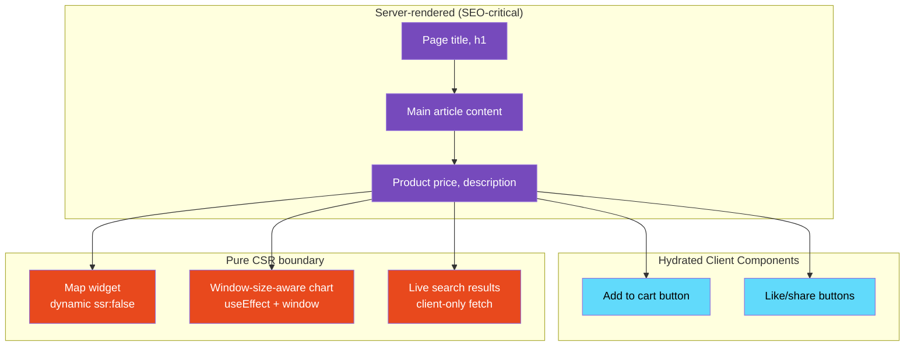

# 54 · Client-Side Rendering Boundaries

> **Client-Side Rendering (CSR) is the rendering mode where a component's markup is produced entirely in the browser, with no server-rendered HTML for that content. In a Next.js App Router application, CSR isn't an all-or-nothing choice for the whole app — it's a boundary you draw around specific subtrees via 'use client' combined with patterns like dynamic(..., { ssr: false }) or data fetched exclusively through client hooks. Understanding exactly where CSR boundaries should sit, what they cost, and when they're the right tool prevents both over-using server rendering (fighting browser-only APIs) and under-using it (shipping unnecessary JavaScript).**

CSR is not the opposite of "good architecture" — it's a deliberate tool with specific tradeoffs. Some content genuinely belongs entirely on the client: things that depend on browser state unknowable to the server (window dimensions, IndexedDB contents, WebGL canvases), components from libraries that only work in a DOM environment, and highly interactive widgets where the server-rendered fallback would be misleading. This document maps where CSR boundaries belong and how to implement them cleanly within the App Router's server-first model.

---

## Table of Contents

- [What "Client-Side Rendering" Means in the App Router](#what-client-side-rendering-means-in-the-app-router)
- [The Spectrum from SSR to Pure CSR](#the-spectrum-from-ssr-to-pure-csr)
- [When CSR Is the Correct Choice](#when-csr-is-the-correct-choice)
- [Implementing a CSR Boundary](#implementing-a-csr-boundary)
- [dynamic() with ssr: false](#dynamic-with-ssr-false)
- [Client-Only Data Fetching Patterns](#client-only-data-fetching-patterns)
- [CSR and SEO Implications](#csr-and-seo-implications)
- [CSR and Core Web Vitals](#csr-and-core-web-vitals)
- [The Loading State Contract for CSR](#the-loading-state-contract-for-csr)
- [CSR Inside Otherwise-Static Pages](#csr-inside-otherwise-static-pages)
- [Avoiding Accidental Full-Page CSR](#avoiding-accidental-full-page-csr)
- [CSR for Browser-Only Libraries](#csr-for-browser-only-libraries)
- [Testing CSR Boundaries](#testing-csr-boundaries)
- [Architecture Diagrams](#architecture-diagrams)
- [Good Practices](#good-practices)
- [Bad Practices](#bad-practices)
- [Mental Model](#mental-model)
- [Common Misconceptions](#common-misconceptions)
- [Exercises](#exercises)
- [Further Reading](#further-reading)

---

## What "Client-Side Rendering" Means in the App Router

In the Pages Router and pre-RSC React, "CSR" typically meant the entire application rendered in the browser via a single root `ReactDOM.render` call — the classic SPA model. In the App Router, CSR is finer-grained:

```
Pure CSR application (classic SPA, e.g. Create React App):
  Server sends: <div id="root"></div> + bundle.js
  Browser: downloads JS, executes, renders EVERYTHING client-side
  No HTML content until JavaScript runs

App Router CSR boundary:
  Server renders: the page shell, Server Components, static content
  ONE specific subtree: marked 'use client' + has no server-renderable
  alternative — its content materializes only after hydration
  Most of the page: already has real HTML before any JS runs
```

The distinction matters because "this page uses Client Components" does NOT mean "this page is CSR" in the classic sense — Client Components still render on the server for the initial HTML (unless explicitly opted out). True CSR boundaries are the parts that have NO server-rendered output at all.

---

## The Spectrum from SSR to Pure CSR

```
1. Server Component (no JS shipped)
   ────────────────────────────────────
   async function Component() { return <div>{data}</div> }
   Zero client bundle impact. No hydration.

2. Client Component, SSR'd + hydrated (the common case)
   ────────────────────────────────────
   'use client'
   function Component() { const [s] = useState(); return <div>{s}</div> }
   Server renders initial HTML. Client hydrates and takes over.

3. Client Component, SSR'd but immediately replaced (loading flicker risk)
   ────────────────────────────────────
   Server renders a value that's immediately overwritten in useEffect
   (e.g., reading localStorage) — wasted server render + visible flash

4. Client Component, explicitly skipping SSR
   ────────────────────────────────────
   dynamic(() => import('./widget'), { ssr: false })
   No server HTML produced. Browser renders from scratch after JS loads.
   This is the closest analog to "classic CSR" within Next.js.

5. Pure client fetch + render (no initial data from server at all)
   ────────────────────────────────────
   Component mounts with no data, fetches via useEffect/SWR/React Query,
   shows loading state, then renders fetched content.
```

Most discussions of "CSR" in a Next.js context are really about levels 3-5 — the genuinely client-only rendering paths.

---

## When CSR Is the Correct Choice

```
✅ Use a CSR boundary when:
  - The component requires browser-only APIs unavailable during SSR
    (window.matchMedia, IndexedDB, WebGL, the Canvas 2D context,
     navigator.geolocation, MediaDevices)
  - A third-party library assumes a DOM environment and breaks under SSR
    (some chart libraries, rich text editors, drag-and-drop libraries)
  - The content is meaningfully personalized using ONLY client-available
    signals (e.g., A/B variant stored in localStorage, not in a cookie
    the server can read)
  - Server-rendering would produce a value immediately overwritten
    on mount, making the SSR pass pure wasted work
  - The feature is genuinely optional/non-critical and deferring its
    JavaScript improves more important metrics (LCP, TTI for core content)

❌ Don't use a CSR boundary when:
  - You're avoiding 'use client' hooks errors by reaching for ssr:false
    as a shortcut instead of understanding the actual constraint
  - The content is important for SEO or first paint
  - The data is available server-side (cookies, headers, DB) — fetching
    it client-side instead just adds latency and loading states
```

---

## Implementing a CSR Boundary

The simplest CSR boundary is a Client Component that intentionally renders nothing meaningful until after mount:

```tsx
"use client";
import { useEffect, useState } from "react";

function BrowserDimensions() {
  const [dimensions, setDimensions] = useState<{
    width: number;
    height: number;
  } | null>(null);

  useEffect(() => {
    // window is only available client-side — this is a genuine CSR boundary
    const update = () =>
      setDimensions({ width: window.innerWidth, height: window.innerHeight });
    update();
    window.addEventListener("resize", update);
    return () => window.removeEventListener("resize", update);
  }, []);

  // Server renders this (null state) — matches client's pre-mount state, no mismatch
  if (!dimensions) return <DimensionsPlaceholder />;

  return (
    <p>
      Viewport: {dimensions.width} × {dimensions.height}
    </p>
  );
}
```

This component DOES get server-rendered (producing the placeholder), but its meaningful content (`dimensions`) only ever exists client-side. The key correctness rule: the server-rendered fallback state must EXACTLY match what the client renders before its first effect runs, to avoid a hydration mismatch (see [Hydration Strategies](./01-hydration.md)).

---

## dynamic() with ssr: false

For components that would error or behave incorrectly if the server attempted to render them at all, skip SSR entirely:

```tsx
import dynamic from "next/dynamic";

// This library throws if `document` is undefined during import/initialization
const RichTextEditor = dynamic(() => import("@/components/rich-text-editor"), {
  ssr: false,
  loading: () => <EditorSkeleton />,
});

function ArticleEditorPage() {
  return (
    <div>
      <ArticleMetadataForm />{" "}
      {/* Server Component or hydrated Client Component */}
      <RichTextEditor /> {/* Never rendered on the server at all */}
    </div>
  );
}
```

### What ssr: false actually does

```
Without ssr: false:
  Server: attempts to render RichTextEditor → may throw (document undefined)
          → entire page render fails OR component shows broken output

With ssr: false:
  Server: renders the `loading` fallback ONLY — never touches the real component
  Client: after JS loads, dynamically imports and renders the real component
  Result: clean separation — no SSR attempt, no SSR-related errors
```

`ssr: false` can only be used inside a Client Component (`'use client'` file) in the App Router — it's not directly importable into a Server Component, because the `ssr` option itself requires client-side dynamic import machinery.

```tsx
// ❌ Invalid in a Server Component file:
// app/page.tsx (no 'use client')
const Editor = dynamic(() => import("./editor"), { ssr: false });
// Error: ssr: false is not allowed with next/dynamic in Server Components

// ✅ Wrap it in a Client Component:
// components/editor-loader.tsx
("use client");
import dynamic from "next/dynamic";
const Editor = dynamic(() => import("./editor"), { ssr: false });
export default Editor;

// app/page.tsx — Server Component imports the wrapper
import EditorLoader from "@/components/editor-loader";
async function Page() {
  return <EditorLoader />;
}
```

---

## Client-Only Data Fetching Patterns

Some data genuinely should be fetched only client-side — typically because it's user-interaction-driven, frequently changing, or doesn't need to exist at initial paint:

```tsx
"use client";
import useSWR from "swr";

// Search-as-you-type results: no value in SSR'ing the FIRST empty state,
// and every subsequent state is driven entirely by client interaction
function LiveSearchResults({ query }: { query: string }) {
  const { data, isLoading } = useSWR(
    query ? `/api/search?q=${encodeURIComponent(query)}` : null,
    fetcher,
    { keepPreviousData: true },
  );

  if (!query) return null;
  if (isLoading) return <ResultsSkeleton />;
  return <ResultsList results={data} />;
}
```

This is appropriately client-only: there's no meaningful "initial" search results to server-render — the feature only exists in response to client interaction.

### Contrast with data that SHOULD be server-fetched

```tsx
// ❌ Unnecessarily client-only: this data is known at request time
"use client";
function ProductDetails({ productId }: { productId: string }) {
  const { data: product, isLoading } = useSWR(
    `/api/products/${productId}`,
    fetcher,
  );
  if (isLoading) return <ProductSkeleton />;
  return <ProductView product={product} />;
}
// This adds a loading flash, a round trip, and SEO loss for data
// the server already knew when it received the request.

// ✅ Server Component: same data, no client round-trip, SEO-friendly
async function ProductDetails({ productId }: { productId: string }) {
  const product = await db.products.findUnique({ where: { id: productId } });
  return <ProductView product={product} />;
}
```

---

## CSR and SEO Implications

Search engine crawlers (particularly Googlebot) execute JavaScript, but with caveats:

```
What's generally true:
  - Googlebot renders JavaScript and can index CSR content
  - But: rendering happens in a queue, sometimes with significant delay
  - Crawl budget is finite — JS-heavy pages may be rendered less frequently
  - Other crawlers (some social media link previews, some search engines)
    may NOT execute JavaScript at all

Practical implications:
  - Critical content (page title, primary heading, main copy): should NOT
    be behind a pure CSR boundary if SEO matters
  - Secondary, interactive, or personalized content: CSR is fine
  - Always verify with: "View Source" should show meaningful content
    for anything SEO-critical (this only shows server-rendered HTML,
    a quick sanity check for what crawlers see immediately)
```

```tsx
// ❌ SEO-critical content behind a CSR boundary
"use client";
function ProductPage({ productId }: { productId: string }) {
  const { data: product } = useSWR(`/api/products/${productId}`, fetcher);
  // Title, description — all CSR. "View Source" shows nothing useful.
  return (
    <div>
      <h1>{product?.name}</h1>
      <p>{product?.description}</p>
    </div>
  );
}

// ✅ SEO-critical content server-rendered, only the cart widget is CSR
async function ProductPage({ params }: { params: { id: string } }) {
  const product = await db.products.findUnique({ where: { id: params.id } });
  return (
    <div>
      <h1>{product!.name}</h1> {/* server-rendered, in View Source */}
      <p>{product!.description}</p> {/* server-rendered, in View Source */}
      <AddToCartWidget productId={product!.id} /> {/* CSR is fine here */}
    </div>
  );
}
```

---

## CSR and Core Web Vitals

CSR boundaries interact with Core Web Vitals in predictable ways:

```
LCP (Largest Contentful Paint):
  If the LCP element is inside a CSR boundary (ssr:false or client-fetched),
  it cannot paint until JS loads, executes, fetches data, and renders.
  This is almost always worse than having that content server-rendered.
  → Never put the LCP candidate behind a CSR boundary.

CLS (Cumulative Layout Shift):
  CSR content that has no server-rendered placeholder of the correct
  size will cause layout shift when it mounts. Always reserve space
  (skeleton with matching dimensions, explicit width/height, aspect-ratio).

INP (Interaction to Next Paint):
  CSR boundaries add MORE JavaScript that must be parsed/executed,
  competing for main-thread time with interaction handling.
  Code-splitting CSR-only widgets (via dynamic import) keeps this JS
  out of the critical initial bundle, reducing INP risk on first interactions.
```

---

## The Loading State Contract for CSR

Every CSR boundary needs an explicit, deliberate loading state — there's no "automatic" content to show otherwise:

```tsx
"use client";
import dynamic from "next/dynamic";

const Map = dynamic(() => import("./map"), {
  ssr: false,
  loading: () => (
    // This MUST visually approximate the real component's footprint
    <div
      style={{ height: 400, background: "#e5e5e5", borderRadius: 8 }}
      aria-label="Loading map"
      role="img"
    />
  ),
});
```

### Loading state checklist

```
□ Does the loading state reserve the same space as the real content? (prevents CLS)
□ Is there an accessible label (aria-label, role) for screen readers?
□ Does it visually communicate "loading" rather than looking broken/empty?
□ Is there a timeout/error path if the import or data fetch fails?
```

---

## CSR Inside Otherwise-Static Pages

A common, healthy pattern: a fully static or ISR page with one or two CSR islands for genuinely client-only features:

```tsx
// app/blog/[slug]/page.tsx
export const revalidate = 3600;

async function BlogPostPage({ params }: { params: { slug: string } }) {
  const post = await db.posts.findUnique({ where: { slug: params.slug } });
  if (!post) notFound();

  return (
    <article>
      {/* Static: cached HTML, great for SEO */}
      <h1>{post.title}</h1>
      <div dangerouslySetInnerHTML={{ __html: post.contentHtml }} />

      {/* CSR: reading progress bar needs scroll position — browser-only */}
      <ReadingProgressBar />

      {/* CSR: "copy link" button needs clipboard API — browser-only */}
      <CopyLinkButton url={post.canonicalUrl} />
    </article>
  );
}
```

```tsx
"use client";
function ReadingProgressBar() {
  const [progress, setProgress] = useState(0);

  useEffect(() => {
    const onScroll = () => {
      const { scrollTop, scrollHeight, clientHeight } =
        document.documentElement;
      setProgress(scrollTop / (scrollHeight - clientHeight));
    };
    window.addEventListener("scroll", onScroll);
    return () => window.removeEventListener("scroll", onScroll);
  }, []);

  return (
    <div
      className="progress-bar"
      style={{ transform: `scaleX(${progress})` }}
    />
  );
}
```

The page is overwhelmingly static (great for SEO and TTFB); the CSR surface area is tiny and precisely targeted at features that are inherently browser-dependent.

---

## Avoiding Accidental Full-Page CSR

The most common architectural mistake is accidentally converting an entire page to client-only rendering by placing `'use client'` too high in the tree (see also [Server vs Client Components](../server-components/02-server-vs-client.md)):

```tsx
// ❌ One browser-only feature forces the WHOLE page to be a client component,
// which then can't directly await data — pushing EVERYTHING to client fetches
"use client";
async function Page() {
  // Error: Client Components can't be async like this anyway —
  // and even fixed, this pattern invites client-side data fetching
  const [data, setData] = useState(null);
  useEffect(() => {
    fetch("/api/data")
      .then((r) => r.json())
      .then(setData);
  }, []);

  const width = useWindowWidth(); // the ONE thing that actually needs CSR

  return <PageContent data={data} width={width} />;
}

// ✅ Server Component page, CSR isolated to just the hook that needs it
async function Page() {
  const data = await db.getData(); // server-side, fast, SEO-friendly
  return <PageContent data={data} />;
}

function PageContent({ data }: { data: Data }) {
  return (
    <div>
      <StaticContent data={data} />
      <WidthAwareWidget /> {/* the only Client Component */}
    </div>
  );
}

("use client");
function WidthAwareWidget() {
  const width = useWindowWidth(); // genuinely needs the browser
  return <ResponsiveChart width={width} />;
}
```

---

## CSR for Browser-Only Libraries

A practical catalog of libraries/APIs that typically require a CSR boundary:

```
Genuinely browser-only (CSR boundary required):
  - Charting libraries using <canvas> with imperative drawing (some Chart.js setups)
  - Map libraries (Leaflet, Mapbox GL JS — manipulate the DOM imperatively)
  - Rich text / WYSIWYG editors (ProseMirror, Slate, TipTap — operate on contentEditable)
  - Drag-and-drop libraries that measure DOM nodes (react-beautiful-dnd, dnd-kit
    generally tolerate SSR but their drag state is inherently client-only)
  - WebSocket/real-time connection management
  - Browser storage access (localStorage, IndexedDB, sessionStorage)
  - Device APIs (geolocation, camera/mic via MediaDevices, clipboard)
  - Anything depending on `window.matchMedia` for initial render decisions

Often fine with SSR (no CSR boundary needed):
  - Most form libraries (react-hook-form works fine SSR'd)
  - Most animation libraries (Framer Motion SSRs its initial state correctly)
  - State management (Zustand, Jotai — SSR-safe by default)
  - Most UI component libraries (Radix, shadcn/ui, Headless UI)
```

---

## Testing CSR Boundaries

```tsx
// Verify the SSR fallback matches the pre-hydration client state exactly
// (prevents hydration mismatches — see Hydration Strategies)

import { renderToStaticMarkup } from "react-dom/server";
import { BrowserDimensions } from "./browser-dimensions";

test("server-rendered placeholder matches initial client render", () => {
  const serverHtml = renderToStaticMarkup(<BrowserDimensions />);
  // Should render the placeholder, NOT throw on `window` access
  expect(serverHtml).toContain("Loading dimensions");
  expect(serverHtml).not.toContain("Viewport:"); // real content shouldn't be here yet
});
```

```tsx
// Verify dynamic(..., { ssr: false }) components never appear in server output
import { render } from "@testing-library/react";

test("CSR-only widget shows loading state initially, then real content", async () => {
  const { findByText, queryByText } = render(<PageWithCSRWidget />);
  expect(queryByText("Map loaded")).not.toBeInTheDocument(); // not yet
  await findByText("Map loaded"); // appears after dynamic import resolves
});
```

---

## Architecture Diagrams

### The SSR-to-CSR spectrum


### Where CSR boundaries belong on a typical page



---

## Good Practices

### ✅ Good Practice — Precisely scoped CSR boundary for a map widget

```tsx
/**
 * Good: The map is the ONLY thing that's CSR. Everything else
 * (location name, address, description) is server-rendered for SEO
 * and fast paint. The map's loading state reserves correct space.
 */

// app/locations/[id]/page.tsx — Server Component
async function LocationPage({ params }: { params: { id: string } }) {
  const location = await db.locations.findUnique({ where: { id: params.id } });
  if (!location) notFound();

  return (
    <article>
      <h1>{location.name}</h1> {/* server-rendered, SEO-visible */}
      <address>{location.address}</address> {/* server-rendered, SEO-visible */}
      <p>{location.description}</p> {/* server-rendered, SEO-visible */}
      <MapWidget latitude={location.lat} longitude={location.lng} />
    </article>
  );
}

// components/map-widget.tsx
("use client");
import dynamic from "next/dynamic";

const LeafletMap = dynamic(() => import("./leaflet-map"), {
  ssr: false,
  loading: () => (
    <div
      style={{
        height: 320,
        width: "100%",
        background: "#eef2f7",
        borderRadius: 8,
      }}
      role="img"
      aria-label="Map loading"
    />
  ),
});

export default function MapWidget(props: {
  latitude: number;
  longitude: number;
}) {
  return <LeafletMap {...props} />;
}
```

---

## Bad Practices

### ⚠️ Bad Practice — Client-fetching data the server already had

```tsx
/**
 * Bad: The server received this request and could have fetched the data
 * directly. Instead, the page renders an empty shell, ships JavaScript,
 * and only THEN fetches the data the server already knew about.
 * Result: slower content paint, an unnecessary loading state, and
 * worse SEO — all for data with zero browser-dependency.
 */
"use client";
function ArticlePage({ slug }: { slug: string }) {
  const [article, setArticle] = useState<Article | null>(null);

  useEffect(() => {
    fetch(`/api/articles/${slug}`)
      .then((r) => r.json())
      .then(setArticle);
  }, [slug]);

  if (!article) return <ArticleSkeleton />;
  return (
    <article>
      <h1>{article.title}</h1>
      <div dangerouslySetInnerHTML={{ __html: article.contentHtml }} />
    </article>
  );
}
// "View Source" on this page shows nothing — title and content are invisible
// to crawlers that don't execute JS, and even Googlebot has to wait for a
// render pass plus a fetch round-trip before indexing anything meaningful.

/**
 * ✅ Fix: Server Component, no client fetch needed for this data at all
 */
async function ArticlePage({ params }: { params: { slug: string } }) {
  const article = await db.articles.findUnique({
    where: { slug: params.slug },
  });
  if (!article) notFound();
  return (
    <article>
      <h1>{article.title}</h1>
      <div dangerouslySetInnerHTML={{ __html: article.contentHtml }} />
    </article>
  );
}
```

**Production impact:** A publishing site rendered article pages entirely client-side, fetching content via `useEffect` after mount. Lighthouse LCP scores were consistently 3.5-4.5s because the largest content block (the article body) couldn't paint until JS executed and a fetch completed. After converting to a Server Component with direct database access, LCP dropped to 0.9-1.3s, and organic search traffic increased over the following weeks as previously-unindexed dynamic content became crawlable in the initial HTML.

---

## Mental Model

> 💡 **The CSR boundary mental model:**
>
> Think of a page as a **stage set built before the audience arrives** (server rendering), with a few **live, in-the-moment performers** who can only do their act once the lights and sound system (the browser's JavaScript runtime) are powered on. The set — backdrops, furniture, props (your static and server-fetched content) — is fully assembled and visible the instant the curtain rises. The live performers (CSR boundaries: a map that draws itself, a widget that reads your screen size, a search box that responds as you type) genuinely need the live environment to do their job; you couldn't pre-build their performance into the set. The craft is in deciding which parts of the show truly require a live performer and which parts can simply be built into the set ahead of time — building too much "live" content means the audience stares at an empty stage longer than necessary waiting for the show to start.

---

## Common Misconceptions

### "'use client' means client-side rendering"

`'use client'` marks a component as hydratable on the client — but by default it STILL renders on the server for the initial HTML. True CSR (no server-rendered output) requires the additional step of `dynamic(..., { ssr: false })` or a component that intentionally has no meaningful server output.

### "CSR is always bad for performance"

CSR is bad for the INITIAL paint of content placed behind it. For genuinely optional, deferred, or interaction-only features, isolating them in a CSR boundary via code-splitting can IMPROVE overall page performance by keeping that JavaScript out of the critical path entirely.

### "If a component uses useState, it has to be CSR"

A component using `useState` is a Client Component, but it's still server-rendered for its initial HTML output (assuming no `ssr: false`). The presence of hooks doesn't automatically mean "no server rendering" — it means "this component also runs on the client after hydration."

### "You can use dynamic(..., { ssr: false }) directly in a Server Component file"

You can't — the `ssr: false` option requires being inside a Client Component boundary. Wrap the dynamic import in a small `'use client'` file and import that wrapper from your Server Component.

### "CSR content is invisible to all search engines"

Modern crawlers like Googlebot do execute JavaScript and can index CSR content, but with caveats around crawl budget, render queue delays, and inconsistent support across other crawlers (social media unfurlers, less sophisticated bots). Treat CSR as a real SEO risk for important content, not a guaranteed failure.

---

## Exercises

### Exercise 1 — Identify the correct boundary

For each of the following features, decide: Server Component, hydrated Client Component, or `ssr: false` CSR boundary?

```
1. A product price that updates based on the visitor's detected currency from a cookie
2. A "scroll to top" button that appears after scrolling 500px
3. A canvas-based signature pad for an e-signature form
4. A blog post's table of contents generated from its headings
5. A live currency converter widget using the user's last-selected currency from localStorage
6. The main navigation menu
```

### Exercise 2 — Convert a CSR data fetch to server-side

Take this component and convert it so the initial data comes from the server, with `useState`/`useEffect` only handling subsequent client-side updates (e.g., a refresh button):

```tsx
"use client";
function UserOrders({ userId }: { userId: string }) {
  const [orders, setOrders] = useState<Order[]>([]);
  useEffect(() => {
    fetch(`/api/orders?userId=${userId}`)
      .then((r) => r.json())
      .then(setOrders);
  }, [userId]);
  return <OrderList orders={orders} />;
}
```

### Exercise 3 — Build a correctly-bounded map feature

Implement a location page where:

1. Location name, address, and description are Server Component output (verify via "View Source")
2. The interactive map uses `dynamic(..., { ssr: false })`
3. The loading placeholder for the map matches its final dimensions exactly (verify zero CLS using Chrome DevTools Performance panel)

---

## Further Reading

- [Next.js docs: Lazy Loading](https://nextjs.org/docs/app/building-your-application/optimizing/lazy-loading) — dynamic() and ssr: false reference
- [Next.js docs: Server and Client Components](https://nextjs.org/docs/app/building-your-application/rendering/server-components) — the broader boundary model
- [web.dev: Rendering on the Web](https://web.dev/articles/rendering-on-the-web) — CSR/SSR/SSG tradeoffs from a web-standards perspective
- [Google Search Central: JavaScript SEO basics](https://developers.google.com/search/docs/crawling-indexing/javascript/javascript-seo-basics) — how Googlebot handles CSR
- Related in this handbook: [01 · Hydration Strategies](./01-hydration.md), [02 · Server vs Client Components](../server-components/02-server-vs-client.md)
- Next in this handbook: [55 · Rendering Strategies Comparison](./06-rendering-strategies-comparison.md)

---

_Part of the [React + Next.js Engineering Handbook](../../README.md)_
