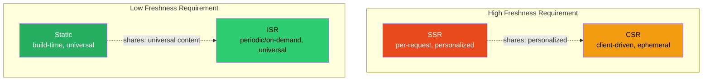
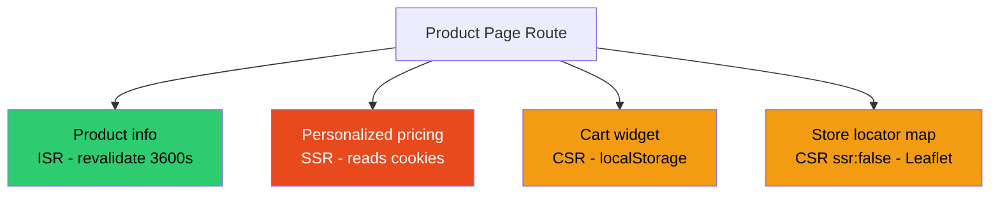

# 55 · Rendering Strategies Comparison

> **Static generation, ISR, server-side rendering, and client-side rendering are not competing philosophies — they are four points on a continuum, each optimal for a different combination of data freshness requirements, personalization needs, and performance targets. Most production Next.js applications use all four simultaneously, often within the same page. This document is the synthesis: a single decision framework, a side-by-side comparison across every dimension that matters, and worked examples showing how real applications combine these strategies deliberately rather than defaulting to one.**

Each of the previous four documents in this part examined one rendering strategy in isolation. The actual skill in production Next.js architecture is choosing correctly per-component, not per-application — and recognizing that the "right" choice for a given piece of content can change as your product's requirements evolve. This document provides the comparative lens to make those choices quickly and correctly.

---

## Table of Contents

- [The Four Strategies at a Glance](#the-four-strategies-at-a-glance)
- [The Complete Comparison Matrix](#the-complete-comparison-matrix)
- [The Decision Tree](#the-decision-tree)
- [Performance Comparison](#performance-comparison)
- [Cost Comparison](#cost-comparison)
- [Freshness Guarantees Compared](#freshness-guarantees-compared)
- [SEO Implications Compared](#seo-implications-compared)
- [Worked Example: An E-Commerce Product Page](#worked-example-an-e-commerce-product-page)
- [Worked Example: A SaaS Dashboard](#worked-example-a-saas-dashboard)
- [Worked Example: A News/Content Site](#worked-example-a-newscontent-site)
- [Migrating Between Strategies](#migrating-between-strategies)
- [Anti-Pattern: The Single-Strategy Mindset](#anti-pattern-the-single-strategy-mindset)
- [Architecture Diagrams](#architecture-diagrams)
- [Good Practices](#good-practices)
- [Bad Practices](#bad-practices)
- [Mental Model](#mental-model)
- [Common Misconceptions](#common-misconceptions)
- [Exercises](#exercises)
- [Further Reading](#further-reading)

---

## The Four Strategies at a Glance

```
STATIC GENERATION (SSG)
  When rendered: build time, once
  Where served from: CDN edge, no origin hit
  Freshness: fixed until next deploy (or on-demand revalidation)
  Best for: content identical for all users, rarely changing

INCREMENTAL STATIC REGENERATION (ISR)
  When rendered: build time + periodically in background
  Where served from: CDN/cache, with background refresh
  Freshness: bounded staleness (revalidate window) or on-demand
  Best for: content identical for all users, changes periodically

SERVER-SIDE RENDERING (SSR)
  When rendered: every request, fresh
  Where served from: origin server (no caching of HTML)
  Freshness: always current as of THIS request
  Best for: per-user or per-request content that must be current

CLIENT-SIDE RENDERING (CSR)
  When rendered: in the browser, after JS loads
  Where served from: N/A (no server HTML for this content)
  Freshness: whatever the client fetch returns, whenever it runs
  Best for: browser-only APIs, highly interactive/ephemeral UI
```

---

## The Complete Comparison Matrix

| Dimension                      | Static (SSG)              | ISR                                       | SSR                            | CSR                           |
| ------------------------------ | ------------------------- | ----------------------------------------- | ------------------------------ | ----------------------------- |
| TTFB                           | Fastest (~10-30ms, CDN)   | Fastest (cache hit) / slower (cache miss) | Slower (~100-1000ms)           | Fast shell, slow content      |
| Server load per request        | Zero                      | Near-zero (only on regen)                 | Full (every request)           | Zero (server) / API load      |
| Data freshness                 | Until next deploy         | Bounded by revalidate window              | Always current                 | Whenever fetched              |
| Personalization                | None (same for all)       | None (same for all)                       | Full (per-request)             | Full (per-client)             |
| SEO                            | Excellent                 | Excellent                                 | Excellent (if no client delay) | Risky (depends on crawler)    |
| Build time impact              | Scales with page count    | Scales with pre-built page count          | None                           | None                          |
| Database load                  | Only at build/regen       | Only at build/regen                       | Every request                  | Via API, every fetch          |
| Works with cookies()/headers() | No (forces dynamic)       | No (forces dynamic)                       | Yes (this is the trigger)      | N/A (client has full access)  |
| CDN cacheable                  | Yes                       | Yes                                       | No (by default)                | The shell only                |
| Implementation complexity      | Low                       | Low-medium                                | Low                            | Medium (loading/error states) |
| Resilience to backend outage   | Total (serves last build) | High (serves stale on failure)            | None (every request can fail)  | Partial (shell still loads)   |

---

## The Decision Tree

```
START: What kind of content is this?

├─ Is it IDENTICAL for every visitor (no auth, no personalization)?
│  │
│  ├─ YES → Does it change more than once a day?
│  │        │
│  │        ├─ NO  → STATIC GENERATION
│  │        │        (export const dynamic = 'error' as a safety net)
│  │        │
│  │        └─ YES → Does it need to update within seconds of a change?
│  │                 │
│  │                 ├─ NO  → ISR with time-based revalidate
│  │                 │
│  │                 └─ YES → ISR with on-demand revalidateTag/revalidatePath
│  │
│  └─ NO (it's per-user or per-request) → Is it available from the server
│           at request time (cookies, session, DB lookup by user)?
│           │
│           ├─ YES → SSR (use cookies()/headers(), or force-dynamic)
│           │
│           └─ NO (only available in the browser: localStorage, window,
│                   client-only APIs, post-interaction state)
│                   │
│                   └─ CSR (Client Component, possibly ssr: false)
│
└─ Is this ONE PIECE of an otherwise-static/ISR/SSR page?
   → Don't change the whole page's strategy. Isolate this piece:
     - Server Component fetching its own data (co-located)
     - Client Component island for interactivity
     - Suspense boundary for anything slow
```

---

## Performance Comparison

### Time to First Byte (TTFB) — typical ranges

```
Static (CDN cache hit):        5-30ms
ISR (cache hit, the common case): 5-30ms
ISR (cache miss/stale, rare):  100-600ms (then fast for everyone after)
SSR (well-optimized):          80-250ms
SSR (poorly optimized, N+1s):  500-3000ms
CSR (shell):                   5-30ms (just the empty shell)
CSR (meaningful content):      shell TTFB + JS parse/exec + fetch round-trip
                                = typically 300-1500ms to meaningful paint
```

### Why the gap between Static/ISR and SSR/CSR is so large

```
Static/ISR: the expensive work (rendering, data fetching) happened ONCE,
            ahead of time. Every request afterward is just "serve a file."

SSR: the expensive work happens on the CRITICAL PATH of every single
     request. There's no way around paying the rendering+data cost
     per-visitor — that's the whole point of SSR.

CSR: the expensive work is moved to the WORST possible place — after
     a full round trip to get the shell, then JS download/parse/execute,
     then a SECOND round trip to fetch data, THEN rendering. This is why
     CSR-for-everything was the wrong default that RSC moved the
     ecosystem away from.
```

---

## Cost Comparison

```
Static / ISR:
  Build compute: one-time (or periodic, for ISR regeneration)
  Serving compute: ~zero (CDN bandwidth only)
  Database load: one query per page per build/regeneration
  Scales to: effectively unlimited traffic at near-zero marginal cost

SSR:
  Serving compute: proportional to REQUEST volume, not page count
  Database load: proportional to request volume (can N+1 badly if not careful)
  Scales to: requires capacity planning; cost grows with traffic
  Risk: a traffic spike directly stresses your database and compute

CSR:
  Serving compute: minimal (static shell + API)
  Database load: via API routes, proportional to client fetch volume
  Client compute: shifted to the user's device (real cost, just not yours)
  Scales to: scales well for serving, but API backend still needs capacity
```

For a page that COULD be static but is implemented as SSR, the cost difference at scale is not academic — it is the difference between "this costs nothing to serve a million views" and "this costs real infrastructure money per million views, plus database capacity planning."

---

## Freshness Guarantees Compared

```
Static:
  Guarantee: "frozen" at build time, period. Only changes on redeploy
  or explicit on-demand revalidation (which effectively makes it ISR
  in practice for that page).

ISR (time-based):
  Guarantee: "no more than N seconds stale, assuming traffic exists
  to trigger the background regeneration." If zero traffic during
  a window, content can be MORE than N seconds stale (harmlessly,
  since no one is viewing it).

ISR (on-demand):
  Guarantee: "fresh within the latency of your revalidation trigger"
  (webhook delivery time + regeneration time — typically sub-second
  to a few seconds).

SSR:
  Guarantee: "reflects the exact state of the world at the moment
  this specific request was processed." The strongest guarantee,
  but only as strong as your data source's own consistency.

CSR:
  Guarantee: "reflects the state of the world at the moment the
  client's fetch resolved" — similar to SSR's guarantee but shifted
  later in time and dependent on the client's network conditions.
```

---

## SEO Implications Compared

```
Static / ISR:
  Best possible SEO outcome. Complete HTML available instantly,
  identical for crawlers and users, no JS execution required to see
  meaningful content.

SSR:
  Equally strong SEO outcome AS LONG AS the response time is reasonable.
  Crawlers see complete, request-time-accurate HTML. The only risk is
  if SSR latency is so high that crawl budget gets consumed inefficiently.

CSR:
  Variable outcome. Modern Googlebot generally indexes CSR content,
  but with rendering queue delays and reduced crawl frequency. Other
  crawlers/bots/unfurlers may see nothing. Safe rule: anything you
  actually want indexed and ranked should not be CSR-only.
```

---

## Worked Example: An E-Commerce Product Page

A realistic product page combines all four strategies for different pieces of content:

```tsx
// app/products/[id]/page.tsx

// STRATEGY: ISR — product info is the same for everyone, changes occasionally
export const revalidate = 3600;

export async function generateStaticParams() {
  // STRATEGY: Static (pre-built) for the top sellers
  const topProducts = await db.products.findMany({
    orderBy: { salesCount: "desc" },
    take: 500,
    select: { id: true },
  });
  return topProducts.map((p) => ({ id: p.id }));
  // Products NOT in this list: generated on first request, then behave
  // identically to pre-built ones (ISR with dynamicParams: true, the default)
}

async function ProductPage({ params }: { params: { id: string } }) {
  const product = await fetch(`https://api.example.com/products/${params.id}`, {
    next: { revalidate: 3600, tags: [`product-${params.id}`] },
  }).then((r) => r.json());

  return (
    <article>
      {/* ISR/Static content: product name, description, base price */}
      <ProductInfo product={product} />

      {/* SSR-equivalent (Server Component reading cookies):
          isolated so it doesn't force the WHOLE page dynamic in
          frameworks/versions with Partial Prerendering support */}
      <Suspense fallback={<PricingSkeleton />}>
        <PersonalizedPricing productId={product.id} />
      </Suspense>

      {/* CSR: cart state lives in the browser (localStorage-backed),
          genuinely client-only */}
      <AddToCartWidget productId={product.id} />

      {/* CSR: map showing nearest store with stock — browser-only library */}
      <Suspense fallback={<MapSkeleton />}>
        <NearestStoreMap productId={product.id} />
      </Suspense>
    </article>
  );
}
```

### Why each choice was made

```
Product info → ISR:        identical for all visitors, changes infrequently,
                            massive traffic benefit from CDN caching
Personalized pricing → SSR: depends on the visitor's loyalty tier (cookie),
                            must be correct per-request
Cart widget → CSR:          cart state is inherently client-side (until checkout)
Store map → CSR (ssr:false): Mapbox/Leaflet requires a DOM environment
```

---

## Worked Example: A SaaS Dashboard

```tsx
// app/dashboard/layout.tsx
// STRATEGY: SSR (forced by cookies() for auth) — but isolated to the layout,
// not duplicated in every nested page
async function DashboardLayout({ children }: { children: React.ReactNode }) {
  const session = await getSession(); // reads cookies() — SSR for this layout
  if (!session) redirect("/login");

  return <DashboardShell user={session.user}>{children}</DashboardShell>;
}

// app/dashboard/page.tsx
// STRATEGY: SSR (inherits dynamic requirement from layout's cookie read)
async function DashboardPage() {
  const session = await getSession();

  return (
    <div>
      {/* SSR: per-user metrics, must be accurate to this account */}
      <Suspense fallback={<MetricsSkeleton />}>
        <AccountMetrics userId={session.userId} />
      </Suspense>

      {/* CSR: live-updating notification feed via WebSocket */}
      <LiveNotificationFeed userId={session.userId} />

      {/* ISR: a "what's new" changelog widget — same for every user,
          updates occasionally, no reason to make it per-request */}
      <Suspense fallback={<ChangelogSkeleton />}>
        <ProductChangelog />
      </Suspense>
    </div>
  );
}

// components/product-changelog.tsx — separate fetch with its own ISR window
async function ProductChangelog() {
  const entries = await fetch("https://api.example.com/changelog", {
    next: { revalidate: 1800 }, // 30 minutes — independent of the page's SSR status
  }).then((r) => r.json());
  return <ChangelogList entries={entries} />;
}
```

This demonstrates an important nuance: even within an SSR-forced route (because the layout reads cookies), individual `fetch()` calls can still carry their OWN `revalidate` window via the Data Cache — the route's HTML isn't cached, but `ProductChangelog`'s underlying data fetch still benefits from caching, avoiding a redundant API call on every dashboard view.

---

## Worked Example: A News/Content Site

```tsx
// app/articles/[slug]/page.tsx
export const revalidate = 60; // ISR: refresh every minute for view counts, etc.

export async function generateStaticParams() {
  // Static-at-build for the front page's articles
  const recent = await db.articles.findMany({
    orderBy: { publishedAt: "desc" },
    take: 50,
    select: { slug: true },
  });
  return recent.map((a) => ({ slug: a.slug }));
}

async function ArticlePage({ params }: { params: { slug: string } }) {
  const article = await db.articles.findUnique({
    where: { slug: params.slug },
  });
  if (!article) notFound();

  return (
    <article>
      {/* ISR: the article body itself rarely changes after publish */}
      <ArticleHeader article={article} />
      <ArticleBody html={article.contentHtml} />

      {/* On-demand revalidated independently: comment count changes
          far more often than the article body, but tagging it separately
          means we don't need to shrink the article's own revalidate window */}
      <Suspense fallback={<CommentCountSkeleton />}>
        <CommentCount articleSlug={params.slug} />
      </Suspense>

      {/* CSR: reading-time progress bar, browser-only (scroll position) */}
      <ReadingProgressBar />
    </article>
  );
}

async function CommentCount({ articleSlug }: { articleSlug: string }) {
  const count = await fetch(
    `https://api.example.com/comments/count?slug=${articleSlug}`,
    {
      next: { revalidate: 30, tags: [`comments-${articleSlug}`] },
    },
  ).then((r) => r.json());
  return <span>{count.total} comments</span>;
}
```

When a new comment is posted (via a Server Action), call `revalidateTag(\`comments-${articleSlug}\`)` to update just that count immediately, without touching the article body's own 60-second ISR window.

---

## Migrating Between Strategies

Requirements change. A page that started as static often needs to become ISR, then later needs a personalized SSR section. The migration path is almost always additive rather than wholesale rewrites:

```
Static → ISR:
  Add `revalidate` (or `next: { revalidate }` to fetches). No structural change.

ISR → ISR + on-demand:
  Add `tags` to fetches, call `revalidateTag()` from the relevant mutation/webhook.
  No change to the page's rendering logic.

Static/ISR page needs ONE personalized section:
  Don't convert the whole page to SSR. Extract that section into its own
  Server Component reading cookies()/headers(), wrap it in Suspense.
  (With Partial Prerendering, this keeps the rest of the page static.
  Without PPR support, weigh whether isolating it in a Client Component
  with a client-side fetch is preferable to making the whole route dynamic.)

SSR page has a slow, non-personalized sub-section:
  Extract it into its own component with its own `fetch(..., { next: { revalidate } })`.
  Even though the ROUTE is dynamic, that specific fetch still benefits from
  the Data Cache, avoiding redundant work on every request.

CSR feature turns out to matter for SEO:
  Move the data fetching server-side (Server Component), keep only the
  truly-interactive part as a Client Component, eliminate the loading flash.
```

---

## Anti-Pattern: The Single-Strategy Mindset

The most common architectural mistake at the application level is picking ONE rendering strategy and forcing every page into it:

```
"We use SSR for everything" — common in teams migrating from a
  Node.js/Express background where per-request rendering felt natural.
  Cost: marketing pages, docs, and blog posts pay full per-request
  server+DB cost for content that never changes per-visitor.

"We use static export for everything" — common in teams prioritizing
  simplicity/cheap hosting above all else.
  Cost: any genuinely dynamic feature (auth, personalization, Server
  Actions) becomes impossible or requires bolting on a separate backend,
  defeating the purpose of using Next.js's integrated model.

"We use CSR for everything" — common in teams with a pre-RSC SPA
  mental model.
  Cost: every page pays a JS-download-then-fetch tax before showing
  anything meaningful; SEO suffers; Core Web Vitals suffer.

The correct mindset: rendering strategy is a PER-COMPONENT decision,
informed by that component's actual data characteristics — not a
single project-wide configuration choice.
```

---

## Architecture Diagrams

### The four strategies positioned on two axes



### A single page composed of all four strategies



---

## Good Practices

### ✅ Good Practice — Strategy selection documented per route

```tsx
/**
 * Good: Explicit comments documenting WHY each rendering strategy
 * was chosen. This is invaluable for future maintainers (including
 * yourself) who need to understand whether a strategy can be safely
 * changed as requirements evolve.
 */

// app/products/[id]/page.tsx
//
// RENDERING STRATEGY: ISR, revalidate=3600
// WHY: Product info (name, description, base price) is identical for
// all visitors. Price changes happen via the admin panel a few times
// a day at most. The 1-hour window is a safety net; actual updates
// propagate instantly via revalidateTag('product-{id}') in the
// updateProduct Server Action.
//
// generateStaticParams pre-builds only the top 500 sellers (by volume)
// to keep build times reasonable; remaining products generate on first
// request and behave identically to pre-built ones afterward.
export const revalidate = 3600;

export async function generateStaticParams() {
  const topProducts = await db.products.findMany({
    orderBy: { salesCount: "desc" },
    take: 500,
    select: { id: true },
  });
  return topProducts.map((p) => ({ id: p.id }));
}
```

---

## Bad Practices

### ⚠️ Bad Practice — Defaulting to force-dynamic "to be safe"

```tsx
/**
 * Bad: Adding `export const dynamic = 'force-dynamic'` reflexively,
 * "just in case something needs it later," without an actual
 * requirement driving the decision. This silently disables ALL
 * caching benefits for a page that might genuinely be cacheable.
 */

// ❌ No actual reason for this — added out of caution
export const dynamic = "force-dynamic";

async function AboutPage() {
  const content = await fetch("https://cms.example.com/about").then((r) =>
    r.json(),
  );
  return <AboutContent content={content} />;
}
// This page now does a full server render + CMS fetch on EVERY request,
// for content that is identical for every visitor and changes maybe
// once a month. Pure waste, multiplied by every single page view.

/**
 * ✅ Fix: Let Next.js infer static rendering (the correct default),
 * add ISR only if there's an actual freshness requirement
 */
async function AboutPage() {
  const content = await fetch("https://cms.example.com/about", {
    next: { revalidate: 86400, tags: ["about-page"] }, // safety net: daily
  }).then((r) => r.json());
  return <AboutContent content={content} />;
}
// Add a webhook from the CMS calling revalidateTag('about-page') on publish
// for instant updates, with zero per-request server cost in between.
```

**Production impact:** A marketing team added `force-dynamic` to several dozen static-eligible pages "to avoid caching issues" during a launch. Server costs for those pages increased noticeably under traffic that should have been served entirely from the CDN, and TTFB on those pages regressed from ~20ms to 150-300ms. Removing the unnecessary `force-dynamic` and replacing it with a long ISR window plus on-demand revalidation restored both the performance and the cost profile.

---

## Mental Model

> 💡 **The rendering strategies mental model:**
>
> Think of a newsroom publishing a website. The **front page headline and top story** are printed in bulk every morning (static/ISR) — millions of readers see the identical, instantly-available version. A **subscriber's personalized "recommended for you" rail** must be assembled individually for each reader at the moment they load the page (SSR) — it depends on who they are. A **live comment count or stock ticker** is updated continuously after the page has loaded, fetched by the reader's own device as needed (CSR) — too volatile to bake into either the bulk print run or the per-reader assembly step. A well-run newsroom doesn't print everything fresh per-reader (too slow, too expensive) and doesn't bulk-print everything (can't personalize, can't show live data) — it deliberately assigns each piece of content to the production method that matches its actual freshness and personalization needs.

---

## Common Misconceptions

### "You must pick one rendering strategy for your whole app"

The App Router is explicitly designed for per-route (and per-component, via Suspense composition) strategy selection. Real applications mix all four within a single page routinely.

### "ISR is just 'slow static'"

ISR has the SAME serving performance as static for the overwhelming majority of requests (cache hits). It only differs in the rare cache-miss/stale case, and even then, only the FIRST request after staleness pays a cost — every subsequent request is fast again.

### "SSR is required for any page behind authentication"

Authentication checks at the middleware/layout level can gate access without forcing every nested page to be dynamic for non-personalized content. Often only the specific personalized widgets need SSR; the surrounding structure can still benefit from caching where the content itself doesn't vary per-user.

### "Switching from SSR to ISR is risky"

For content that's actually identical across users, the migration is almost always safe and is usually a one-line change (adding `revalidate`). The risk is in NOT making this change when appropriate — leaving cacheable content paying per-request costs indefinitely.

### "CSR and SSR produce the same SEO outcome since both involve JavaScript"

SSR delivers complete, crawlable HTML on the FIRST response. CSR delivers an empty (or near-empty) shell first, requiring the crawler to execute JavaScript and wait for fetches before any content exists — a meaningfully different and riskier SEO posture.

---

## Exercises

### Exercise 1 — Audit and reclassify

Take an existing Next.js application (yours or an open-source example) and for every route, determine:

1. Its current rendering strategy (check `next build` output: ○, ●, or ƒ)
2. What its CONTENT characteristics actually require (per the decision tree)
3. Whether there's a mismatch, and if so, the specific code change needed to fix it

### Exercise 2 — Build the same feature four ways

Implement a "trending products" widget four different ways:

1. Static (no revalidate, manual rebuild to update)
2. ISR with a 5-minute revalidate window
3. SSR (force-dynamic, fresh every request)
4. CSR (Client Component fetching from an API route)

Measure TTFB for each under simulated load (e.g., using `autocannon`). Document the tradeoffs you observe firsthand.

### Exercise 3 — Design a strategy map for a hypothetical app

Design the rendering strategy for every major section of a hypothetical recipe-sharing site:

- Homepage with featured recipes
- Individual recipe pages (with ratings/comments)
- User profile pages
- "My saved recipes" (authenticated, personal)
- Live recipe rating widget
- Search results page
- A real-time "cooking along" feature showing other users currently viewing the same recipe

For each, justify your choice using the decision tree from this document.

---

## Further Reading

- [Next.js docs: Rendering](https://nextjs.org/docs/app/building-your-application/rendering) — Official overview of all rendering models
- Related in this handbook: [01 · Hydration Strategies](./01-hydration.md)
- Related in this handbook: [02 · Static Site Generation](./02-static-generation.md)
- Related in this handbook: [03 · Server-Side Rendering](./03-server-side-rendering.md)
- Related in this handbook: [04 · Incremental Static Regeneration](./04-incremental-static-regeneration.md)
- Related in this handbook: [05 · Client-Side Rendering Boundaries](./05-client-side-rendering.md)
- [web.dev: Rendering on the Web](https://web.dev/articles/rendering-on-the-web) — Framework-agnostic comparison
- Next in this handbook: [56 · Edge Rendering](./07-edge-rendering.md)

---

_Part of the [React + Next.js Engineering Handbook](../../README.md)_
