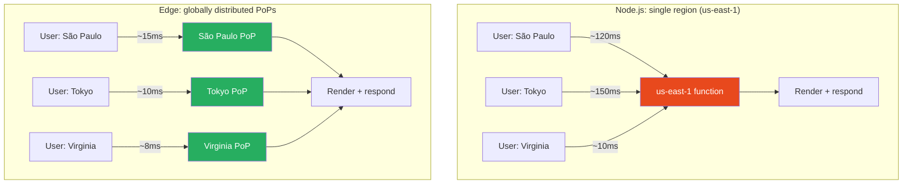
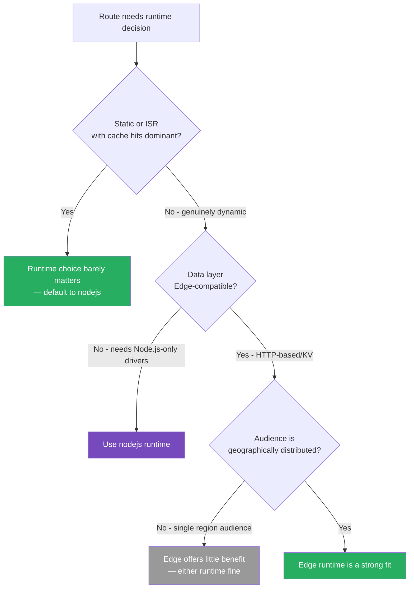

# 56 · Edge Rendering

> **Edge rendering moves the React rendering process itself off a single regional server and onto a globally distributed network of V8 Isolates, executing your page's render function in a Point of Presence physically close to the requesting user. This is distinct from Edge Middleware (covered in Part IX) — here we're talking about rendering entire pages, not just intercepting requests before they reach a page. The benefit is dramatically reduced network latency for SSR-style content; the cost is the same Edge Runtime constraints that apply everywhere else in Next.js: no Node.js APIs, no native database drivers, and a much smaller execution environment.**

Edge rendering is the most geographically-aware rendering option in Next.js. A Server Component rendered in the Node.js runtime always executes in one region (wherever your server/serverless function is deployed) — a user in Tokyo hitting a US-East server pays the full round-trip latency before rendering even begins. Edge rendering lets that same component execute in a Point of Presence in or near Tokyo, eliminating that geographic penalty for the rendering step itself.

---

## Table of Contents

- [Edge Rendering vs Edge Middleware vs Node.js Rendering](#edge-rendering-vs-edge-middleware-vs-nodejs-rendering)
- [Opting a Route Into the Edge Runtime](#opting-a-route-into-the-edge-runtime)
- [What Changes When a Page Runs at the Edge](#what-changes-when-a-page-runs-at-the-edge)
- [The Latency Case for Edge Rendering](#the-latency-case-for-edge-rendering)
- [Data Access from the Edge](#data-access-from-the-edge)
- [Edge Rendering and Static/ISR Interaction](#edge-rendering-and-staticisr-interaction)
- [Edge Rendering and Streaming](#edge-rendering-and-streaming)
- [Cold Starts: Edge vs Node.js Serverless](#cold-starts-edge-vs-nodejs-serverless)
- [When Edge Rendering Is the Right Choice](#when-edge-rendering-is-the-right-choice)
- [When Edge Rendering Is the Wrong Choice](#when-edge-rendering-is-the-wrong-choice)
- [Mixed Deployments: Edge and Node.js Together](#mixed-deployments-edge-and-nodejs-together)
- [Debugging Edge Runtime Issues](#debugging-edge-runtime-issues)
- [Measuring Edge Rendering Impact](#measuring-edge-rendering-impact)
- [Architecture Diagrams](#architecture-diagrams)
- [Good Practices](#good-practices)
- [Bad Practices](#bad-practices)
- [Mental Model](#mental-model)
- [Common Misconceptions](#common-misconceptions)
- [Exercises](#exercises)
- [Further Reading](#further-reading)

---

## Edge Rendering vs Edge Middleware vs Node.js Rendering

These three are easy to conflate because they share the term "Edge" and the same underlying runtime, but they apply to different stages of the request:

```
Edge Middleware (middleware.ts):
  Runs: before routing, on every matched request
  Purpose: redirect, rewrite, header injection, auth gating
  Does NOT render React — it decides WHERE the request goes next

Edge Rendering (export const runtime = 'edge' on a page/route):
  Runs: as the actual page rendering step, replacing Node.js for that route
  Purpose: produce the page's HTML/RSC output, geographically close to the user
  DOES render React — this IS the page

Node.js Rendering (the default):
  Runs: in a single region (or serverless function), full Node.js APIs available
  Purpose: the standard rendering path for most routes
  DOES render React — same as Edge rendering, different runtime/location
```

A request can pass through Edge Middleware and THEN hit a page that renders in the Node.js runtime — these are independent, composable decisions.

---

## Opting a Route Into the Edge Runtime

```tsx
// app/status/page.tsx
export const runtime = "edge";

async function StatusPage() {
  // This entire component tree renders inside a V8 Isolate at the edge,
  // not in your Node.js server/serverless function
  const region = process.env.VERCEL_REGION ?? "unknown";
  const timestamp = new Date().toISOString();

  return (
    <div>
      <h1>Service Status</h1>
      <p>Rendered in region: {region}</p>
      <p>At: {timestamp}</p>
    </div>
  );
}
```

```tsx
// Route Handlers can also opt in:
// app/api/geo/route.ts
export const runtime = "edge";

export async function GET(request: Request) {
  // geo data is available directly from the request at the edge
  const country = request.headers.get("x-vercel-ip-country") ?? "unknown";
  return Response.json({ country, renderedAt: new Date().toISOString() });
}
```

### Per-route, not application-wide

The `runtime` export is a route segment config — it applies to that specific route (and inherits down through layouts unless overridden). There is no single "make the whole app Edge" switch; it's deliberately granular because most applications need a mix.

---

## What Changes When a Page Runs at the Edge

Everything covered in [Middleware & Edge Runtime](../nextjs-core/05-middleware.md) about the Edge Runtime's constraints applies identically here, because it's the SAME runtime — just executing a full page render instead of a middleware function:

```tsx
export const runtime = "edge";

// ❌ Fails: Node.js-only database client
import { PrismaClient } from "@prisma/client";
const prisma = new PrismaClient(); // throws — Prisma's engine needs Node.js

// ❌ Fails: file system access
import fs from "fs";
const data = fs.readFileSync("./data.json"); // fs is unavailable

// ❌ Fails: most native npm packages
import bcrypt from "bcrypt"; // native binary, incompatible

// ✅ Works: fetch-based or HTTP-based data access
const data = await fetch("https://api.example.com/data").then((r) => r.json());

// ✅ Works: HTTP-based database drivers
import { neon } from "@neondatabase/serverless";
const sql = neon(process.env.DATABASE_URL!);
const rows = await sql`SELECT * FROM products LIMIT 10`;

// ✅ Works: Web Crypto, standard Web APIs
const hash = await crypto.subtle.digest("SHA-256", data);
```

The full list of available/unavailable APIs is identical to the middleware constraints — see [Edge Runtime Limitations in Depth](../nextjs-core/05-middleware.md#edge-runtime-limitations-in-depth) for the complete reference.

---

## The Latency Case for Edge Rendering

The core value proposition is eliminating the "long-haul" network round-trip that precedes rendering when your origin is in a single region:

```
Node.js rendering, single-region deployment (e.g., us-east-1):

  User in São Paulo:
    Request → travels to us-east-1 (~120ms one-way) → render happens
    → response travels back (~120ms) → total network overhead: ~240ms
    PLUS the actual render/data-fetch time on top of that

  User in Virginia (near us-east-1):
    Request → travels to us-east-1 (~10ms) → render happens
    → response travels back (~10ms) → total network overhead: ~20ms

Edge rendering, globally distributed:

  User in São Paulo:
    Request → nearest PoP (likely in São Paulo or nearby, ~10-20ms)
    → render happens THERE → response travels back (~10-20ms)
    → total network overhead: ~20-40ms

  User in Virginia:
    Request → nearest PoP (likely very close, ~5-15ms)
    → render happens THERE → response back (~5-15ms)
    → total network overhead: ~10-30ms
```

The benefit is largest for users geographically far from your origin region, and negligible for users near it. Edge rendering doesn't make rendering faster in absolute CPU terms — it removes distance-based network latency from the critical path.

### When the data layer undermines the benefit

```
If your Edge-rendered page still needs to fetch from a single-region
database (e.g., a Postgres instance only in us-east-1), the latency
benefit is substantially reduced — you've moved the RENDERING close
to the user, but the DATA FETCH still has to make that same long
round-trip.

True end-to-end latency improvement requires either:
  1. A globally-replicated/edge-aware data layer (Neon's read replicas,
     PlanetScale, Cloudflare D1, Vercel KV, Upstash Redis with global
     replication), or
  2. Content that doesn't depend on a single-region data source at all
     (static content, data embedded at build time, geo-local APIs)
```

---

## Data Access from the Edge

Because Edge rendering shares the same runtime constraints as Edge Middleware, the same category of HTTP-based, Edge-compatible data sources apply:

```tsx
export const runtime = "edge";

// Neon (Postgres, HTTP-based, supports read replicas near edge regions)
import { neon } from "@neondatabase/serverless";
const sql = neon(process.env.DATABASE_URL!);

// Upstash Redis (HTTP-based, globally replicated)
import { Redis } from "@upstash/redis";
const redis = Redis.fromEnv();

// Vercel KV (built on Upstash, Edge-native)
import { kv } from "@vercel/kv";

async function EdgePage() {
  const [dbRows, cachedValue] = await Promise.all([
    sql`SELECT * FROM featured_items LIMIT 5`,
    kv.get("homepage-banner"),
  ]);

  return <HomepageContent items={dbRows} banner={cachedValue} />;
}
```

For data sources without an HTTP-based driver (most traditional ORMs against a single-region Postgres/MySQL instance), Edge rendering for pages that depend heavily on that data provides limited benefit and may be the wrong choice — see the decision criteria below.

---

## Edge Rendering and Static/ISR Interaction

Edge rendering is orthogonal to the static/ISR/SSR spectrum covered in [Rendering Strategies Comparison](./06-rendering-strategies-comparison.md) — `runtime` controls WHERE code executes, while `dynamic`/`revalidate` control WHEN:

```tsx
// Static content, rendered at the edge when it DOES need to regenerate
export const runtime = "edge";
export const revalidate = 3600;

async function EdgeISRPage() {
  const content = await fetch("https://api.example.com/content", {
    next: { revalidate: 3600 },
  }).then((r) => r.json());
  return <Content data={content} />;
}
// Most requests: served from cache (CDN), runtime doesn't even matter
// because nothing is executing. The `runtime: 'edge'` only matters
// for the regeneration step itself, executing geographically close
// to wherever the triggering request originated.

// Genuinely dynamic, per-request, AND geographically distributed
export const runtime = "edge";
export const dynamic = "force-dynamic";

async function EdgeSSRPage() {
  const geo = headers().get("x-vercel-ip-country");
  const localizedContent = await fetchLocalizedContent(geo);
  return <Content data={localizedContent} />;
}
// THIS is where Edge rendering's latency benefit is most directly realized —
// every request executes fresh, and now that execution happens near the user
```

The combination of `force-dynamic` + `runtime: 'edge'` is the configuration that most directly targets "I need fresh, personalized content with minimal network latency for a global audience."

---

## Edge Rendering and Streaming

Streaming (covered in [Streaming & Suspense with RSC](../server-components/03-streaming.md)) works the same way at the Edge — `ReadableStream` is a Web API available in the Edge Runtime:

```tsx
export const runtime = "edge";

async function EdgeStreamingPage() {
  return (
    <>
      <ShellContent />
      <Suspense fallback={<Skeleton />}>
        <SlowEdgeCompatibleSection />
      </Suspense>
    </>
  );
}
```

The shell streams from the nearest PoP immediately; Suspense boundaries resolve and stream in exactly as described in the streaming document — the only difference is that the entire pipeline executes within Edge Runtime constraints (no Node.js APIs in any component in this tree).

---

## Cold Starts: Edge vs Node.js Serverless

```
Node.js serverless function cold start:
  Process spin-up, Node.js runtime initialization, module loading
  Typical: 100-500ms+ (varies by bundle size, dependencies, provider)

Edge Runtime (V8 Isolate) cold start:
  No process spin-up — Isolates are lightweight, pre-warmed across
  the provider's edge network
  Typical: <1-5ms

This is independent of the network-latency benefit discussed above —
even for a user near your Node.js function's single region, Edge
rendering can still win on cold-start avoidance for low-traffic routes
that frequently scale to zero between requests.
```

---

## When Edge Rendering Is the Right Choice

```
✅ Use Edge rendering when:
  - The page is genuinely dynamic (force-dynamic) AND serves a globally
    distributed audience where network latency materially matters
  - The page's data dependencies are themselves Edge-compatible
    (HTTP-based DB drivers, KV stores, external APIs) — not locked to
    Node.js-only drivers
  - The page is lightweight (small bundle) — Edge Runtime has tighter
    size/memory limits than Node.js functions
  - Cold-start avoidance matters for a low-traffic, latency-sensitive route
  - Geo-aware logic is central to the page (using request.geo /
    x-vercel-ip-country headers to render different content per region)
```

---

## When Edge Rendering Is the Wrong Choice

```
❌ Don't use Edge rendering when:
  - The page is Static or ISR — most requests are served from cache
    regardless of runtime, so the choice barely matters except for the
    regeneration step
  - The data layer requires Node.js-only drivers (most ORMs against
    traditional single-region Postgres/MySQL without an HTTP proxy layer)
  - The page needs heavy npm dependencies with native bindings
    (image processing, certain auth libraries, PDF generation)
  - The page does CPU-intensive work that benefits from Node.js's more
    generous compute/memory limits
  - You're choosing Edge "for performance" without having identified
    an actual latency bottleneck tied to geographic distance
```

---

## Mixed Deployments: Edge and Node.js Together

Most production applications run BOTH runtimes simultaneously, route by route:

```tsx
// app/page.tsx — marketing homepage, static, runtime doesn't matter much
// (no explicit runtime export — defaults to nodejs, but served from cache anyway)

// app/api/geo-banner/route.ts — Edge: needs low latency, simple geo logic
export const runtime = "edge";
export async function GET(request: Request) {
  const country = request.headers.get("x-vercel-ip-country");
  return Response.json({ banner: getBannerForCountry(country) });
}

// app/dashboard/page.tsx — Node.js: needs full Prisma ORM access
// (no runtime export — defaults to nodejs)
async function DashboardPage() {
  const data = await prisma.user.findMany({
    /* complex query */
  });
  return <Dashboard data={data} />;
}

// app/api/generate-pdf/route.ts — Node.js: needs a native PDF library
// (no runtime export — defaults to nodejs)
export async function POST(request: Request) {
  const pdf = await generatePdfWithNativeLib(/* ... */);
  return new Response(pdf, { headers: { "Content-Type": "application/pdf" } });
}
```

This is the normal, expected shape of a real Next.js deployment: a handful of routes deliberately opted into Edge for specific latency-sensitive or geo-aware needs, with everything else on the more capable Node.js runtime by default.

---

## Debugging Edge Runtime Issues

```bash
# Build-time errors are the most common signal of an Edge incompatibility:
# "Error: The edge runtime does not support Node.js 'fs' module"
# "Error: A Node.js API is used (process.version) which is not supported
#  in the Edge Runtime"

# To check whether a dependency is Edge-compatible BEFORE you discover
# it at build time:
grep -r "react-server\|edge-light" node_modules/<package>/package.json

# Vercel's build output explicitly labels routes by runtime:
# Route (app)                    Size   Runtime
# ┌ ƒ /api/geo                   0 B    Edge
# └ ƒ /dashboard                 1.2kB  Node.js
```

```tsx
// A defensive pattern for code that might run in either runtime
// (e.g., a shared utility imported by both Edge and Node.js routes):
const isEdgeRuntime = typeof EdgeRuntime !== "undefined";

export function getDbClient() {
  if (isEdgeRuntime) {
    return createEdgeCompatibleClient(); // HTTP-based driver
  }
  return createNodeClient(); // full driver with native bindings
}
```

---

## Measuring Edge Rendering Impact

```
Before claiming an Edge migration improved performance, measure:

1. TTFB by geographic region (not just an aggregate average)
   - Use a tool with multi-region synthetic testing (WebPageTest has
     server locations, or Vercel Analytics breaks down by region)

2. Isolate the rendering-location benefit from the data-fetch latency
   - If your data source is still single-region, the Edge migration's
     benefit may be smaller than expected — measure the data fetch
     portion separately

3. Compare cold-start frequency and impact for low-traffic routes
   - Check function invocation logs for cold-start indicators
   - Edge Isolates rarely show meaningful cold-start latency; Node.js
     serverless functions can, especially after scale-to-zero periods

4. Watch bundle size — Edge Runtime has stricter size limits, and an
   over-budget Edge function will fail to deploy or fall back unexpectedly
```

---

## Architecture Diagrams

### Edge rendering vs Node.js rendering, geographically



### Decision flow: should this route use the Edge Runtime?



---

## Good Practices

### ✅ Good Practice — Edge rendering for a geo-aware, data-light page

```tsx
/**
 * Good: A genuinely dynamic, geo-sensitive page with Edge-compatible
 * data dependencies (a KV store, not a traditional ORM). The audience
 * is global, and the content genuinely needs to be fresh per-request.
 * This is the precise scenario Edge rendering is built for.
 */

// app/regional-pricing/page.tsx
export const runtime = "edge";
export const dynamic = "force-dynamic";

async function RegionalPricingPage() {
  const country = headers().get("x-vercel-ip-country") ?? "US";

  const pricing =
    (await kv.get<PricingTable>(`pricing:${country}`)) ??
    (await kv.get<PricingTable>("pricing:default"));

  return (
    <div>
      <h1>Pricing for your region</h1>
      <PricingTable data={pricing} />
    </div>
  );
}
```

---

## Bad Practices

### ⚠️ Bad Practice — Forcing Edge runtime onto a Node.js-dependent page

```tsx
/**
 * Bad: Opting into the Edge Runtime for a page that fundamentally
 * depends on Node.js-only infrastructure (a traditional Prisma setup
 * against a single-region database with no HTTP proxy). This either
 * fails to build/deploy outright, or requires a half-measure workaround
 * that defeats the purpose of choosing Edge in the first place.
 */
export const runtime = "edge"; // ❌ chosen reflexively, "for performance"

import { prisma } from "@/lib/prisma"; // standard Prisma client — Node.js only

async function ReportsPage() {
  const reports = await prisma.report.findMany({
    include: { author: true, comments: true },
  });
  // Build error: Prisma's query engine is incompatible with the Edge Runtime
  return <ReportsList reports={reports} />;
}

/**
 * ✅ Fix: Use the Node.js runtime (the default) for this page,
 * which has no such constraint, and reserve Edge for routes whose
 * data dependencies are actually compatible with it
 */
// no `runtime` export — defaults to nodejs

async function ReportsPage() {
  const reports = await prisma.report.findMany({
    include: { author: true, comments: true },
  });
  return <ReportsList reports={reports} />;
}
```

**Production impact:** A team added `runtime = 'edge'` across their app indiscriratenly after reading that "Edge is faster," without auditing data dependencies first. Half their routes failed to build with cryptic Prisma engine errors. The routes that DID build successfully (because they happened not to touch Prisma) showed no measurable latency improvement, because their actual audience was concentrated in one region near their existing Node.js deployment — there was no geographic latency problem to solve in the first place.

---

## Mental Model

> 💡 **The Edge rendering mental model:**
>
> Think of Node.js rendering as a **single, well-equipped regional kitchen** that can cook anything (full Node.js APIs, any database connection, any native tool) but is located in one city — every order from anywhere in the world has to travel to that kitchen and the finished dish has to travel back. Edge rendering is a **chain of smaller kitchens in every city**, each equipped with only a limited set of tools (Web APIs, HTTP-based connections) but able to cook the order right where the customer is sitting — no travel time for the order or the dish. If your recipe requires a piece of equipment only the regional kitchen has (a Node.js-only database driver, a native library), you can't cook it in the small local kitchen no matter how much faster that would be. The right choice depends on whether your recipe (route) can actually be made with what the local kitchen has, and whether your customers (audience) are spread out enough for the travel-time savings to matter.

---

## Common Misconceptions

### "Edge rendering makes every page faster"

Edge rendering eliminates GEOGRAPHIC network latency to the rendering step. It does nothing for CPU-bound render time, and provides no benefit at all for content served from cache (static/ISR hits) since nothing executes on those requests regardless of runtime.

### "Edge Middleware and Edge rendering are the same feature"

They share a runtime (V8 Isolates, same constraints) but serve different purposes: Middleware runs before routing to redirect/rewrite/gate requests; Edge-rendered pages/routes actually produce the response content. A request can pass through Edge Middleware and then be rendered by a Node.js page.

### "You should use Edge for everything to be safe/future-proof"

The Edge Runtime is a more CONSTRAINED environment, not a strictly better one. Defaulting to Edge without auditing data dependencies and actual latency requirements creates avoidable build failures and provides no guaranteed benefit.

### "Edge rendering replaces the need for a CDN"

Edge rendering executes your RENDER LOGIC near the user for dynamic content. Static/ISR content is still served from a genuine CDN cache regardless of the `runtime` setting — these are complementary mechanisms, not substitutes for each other.

### "If my database is HTTP-based, Edge rendering has no downsides"

Even with an Edge-compatible data layer, you're still bound by the Edge Runtime's bundle size limits, memory constraints, and missing Node.js APIs for any other logic in that route (image processing, certain validation libraries, etc.). Compatibility with one dependency doesn't guarantee compatibility with all of a route's code.

---

## Exercises

### Exercise 1 — Audit a route for Edge compatibility

Take a Node.js-runtime page from an existing project and list every import and API call it makes. For each one, determine: is it Edge-compatible? If any are not, what would need to change (different library, different data access pattern) to make the route Edge-eligible?

### Exercise 2 — Measure the geographic latency difference

Deploy the same simple dynamic page twice — once with `runtime = 'nodejs'`, once with `runtime = 'edge'` — to a platform supporting both (e.g., Vercel). Using a multi-region testing tool, measure TTFB from at least three geographically distant locations relative to your Node.js function's region. Document the actual measured difference (not just the theoretical one).

### Exercise 3 — Design a mixed-runtime architecture

For a hypothetical global SaaS product with: a marketing site, a dashboard backed by a traditional Postgres ORM, a public status page showing real-time regional uptime, and a PDF invoice generator — assign each piece to Edge or Node.js runtime, with justification referencing the decision criteria in this document.

---

## Further Reading

- [Next.js docs: Edge and Node.js Runtimes](https://nextjs.org/docs/app/building-your-application/rendering/edge-and-nodejs-runtimes) — Official runtime comparison
- Related in this handbook: [05 · Middleware & Edge Runtime](../nextjs-core/05-middleware.md) — full Edge Runtime constraint reference
- Related in this handbook: [06 · Rendering Strategies Comparison](./06-rendering-strategies-comparison.md)
- [Vercel docs: Edge Functions](https://vercel.com/docs/functions/edge-functions) — platform-specific Edge details
- [Neon: Serverless driver](https://neon.tech/docs/serverless/serverless-driver) — Edge-compatible Postgres access
- [Cloudflare: What is a V8 Isolate](https://blog.cloudflare.com/cloud-computing-without-containers/) — background on the underlying isolation model

---

_Part of the [React + Next.js Engineering Handbook](../../README.md)_
