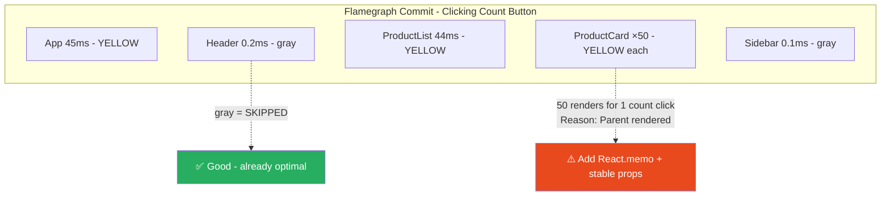
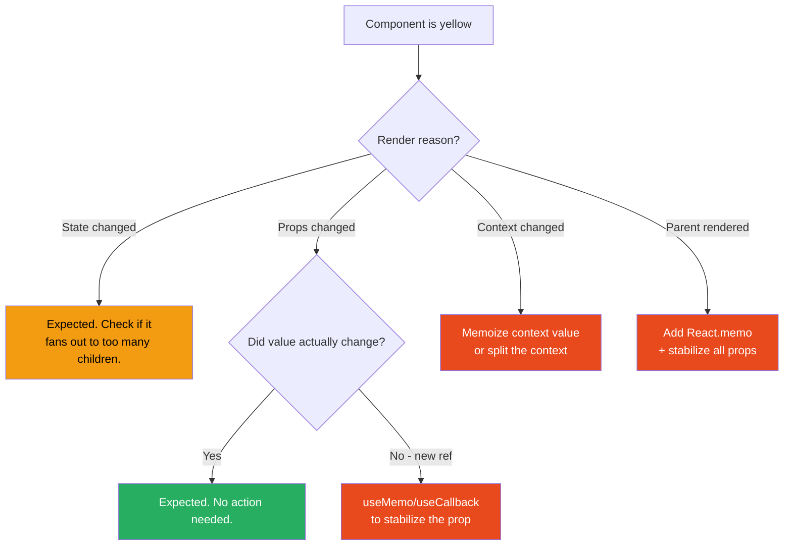

# 72 · React Profiler & Flamegraphs

> **The React Profiler is the primary diagnostic tool for identifying which components are rendering unnecessarily, how long each render takes, and which interactions trigger the most work. Flamegraphs are the visual output of profiler data — they show every component that rendered during a recorded session, the time each took, and the reason it re-rendered. Understanding how to read flamegraphs and interpret profiler data is the difference between guessing at performance problems and knowing exactly where to apply optimization.**

Performance optimization without measurement is guesswork. The React Profiler gives you precise data to answer three questions for any interaction: which components rendered, why they rendered, and how long each took. The "why" is particularly valuable — it distinguishes necessary renders (new data arrived) from unnecessary ones (a parent re-rendered but nothing changed for this component), which is where memoization can eliminate work.

---

## Table of Contents

- [The Two React Profilers](#the-two-react-profilers)
- [React DevTools Profiler: Setup and Recording](#react-devtools-profiler-setup-and-recording)
- [Reading the Flamegraph](#reading-the-flamegraph)
- [The Ranked Chart View](#the-ranked-chart-view)
- [Why Did This Component Render?](#why-did-this-component-render)
- [The Render Reason Categories](#the-render-reason-categories)
- [Timeline Mode (React 18+)](#timeline-mode-react-18)
- [The Programmatic Profiler Component](#the-programmatic-profiler-component)
- [Profiling in Production](#profiling-in-production)
- [The Performance Investigation Workflow](#the-performance-investigation-workflow)
- [Common Performance Patterns Found via Profiler](#common-performance-patterns-found-via-profiler)
- [Architecture Diagrams](#architecture-diagrams)
- [Good Practices](#good-practices)
- [Bad Practices](#bad-practices)
- [Mental Model](#mental-model)
- [Common Misconceptions](#common-misconceptions)
- [Exercises](#exercises)
- [Further Reading](#further-reading)

---

## The Two React Profilers

```
1. React DevTools Profiler (browser extension)
   Use for: interactive development profiling
   Access: browser DevTools → "⚛ Profiler" tab
   Output: flamegraphs, ranked charts, render reasons
   Works in: development mode (some features also in production profiling builds)
   Overhead: significant — judge PATTERNS not absolute timing numbers

2. <Profiler> component (programmatic API)
   Use for: production performance monitoring, automated testing
   Access: import { Profiler } from 'react'
   Output: programmatic callbacks with timing data per render
   Works in: development and production (with react-dom/profiling build)
   Overhead: minimal when production profiling build is used
```

---

## React DevTools Profiler: Setup and Recording

```bash
# Chrome: install "React Developer Tools" from Chrome Web Store
# Firefox: install from Firefox Add-ons
# Verify: adds "⚛ Components" and "⚛ Profiler" tabs to DevTools
```

```
RECORDING STEPS:
1. Open DevTools → "⚛ Profiler" tab
2. Click ● (record) — turns red
3. Perform the interaction to profile (click, type, navigate)
4. Click ● again to stop
5. Flamegraph appears immediately

CRITICAL SETTINGS (⚙️ gear icon in Profiler):
  ✅ "Record why each component rendered" — ENABLE THIS
     Without it: you see timing, but not render reasons
     This is the most useful profiler setting for diagnosing
     unnecessary re-renders
```

---

## Reading the Flamegraph

```
FLAMEGRAPH ANATOMY:

┌─────────────────────────────────────────────────────────┐
│ App (3.2ms)                                              │
├───────────────────┬─────────────────────────────────────┤
│ Header (0.1ms)    │ Main (3.0ms)                        │
│ [gray]            ├──────────────────┬──────────────────┤
│                   │ ProductList(2.8ms)│ Sidebar (0.1ms)  │
│                   │ [yellow]          │ [gray]           │
│                   ├──────────────────┤                  │
│                   │ ProductCard ×50  │                  │
│                   │ [yellow]         │                  │
└───────────────────┴──────────────────┴──────────────────┘

Width = time spent rendering (wider = slower)
Depth = component nesting
Color:
  Gray = did NOT render this commit (memoized / skipped) ✅
  Yellow/colored = DID render this commit

GOAL: maximize gray, minimize unnecessary yellow.

WHAT TO LOOK FOR:
  ✅ Large gray blocks = components correctly skipping renders
  ⚠️ Unexpected yellow blocks = investigate render reason
  ❌ Everything yellow = no memoization working anywhere
```

---

## The Ranked Chart View

```
Ranked chart: components sorted by SELF render time
(time spent in that component, excluding its children)

┌────────────────────────────────────────┐
│ ProductCard               ████ 2.4ms  │
│ ExpensiveFilter        ██ 1.1ms       │
│ UserAvatar            █ 0.8ms         │
│ Header                ▌ 0.2ms         │
└────────────────────────────────────────┘

SELF time = the component's own render function cost
TOTAL time = self + all children (shown by flamegraph width)

USE THE RANKED CHART TO:
  Find the most expensive individual component render functions.
  Start optimization with the top entry — that component's
  own rendering code is the bottleneck, not its children.
```

---

## Why Did This Component Render?

With "Record why each component rendered" enabled, hovering over any component shows its render reason:

```
"Props changed"
  → One or more props changed.
  → Check: did the value ACTUALLY change, or is it a new object
    reference with the same content? (The unstable reference bug)

"State changed"
  → Component's own state changed.
  → Usually expected — the component intentionally updated.

"Context changed"
  → A context this component consumes changed.
  → Check: is the context value creating a new object on every render?

"Hooks changed"
  → A hook's internal state changed.

"Parent component rendered"
  → Parent re-rendered; this component followed (no memo).
  → This is the "unnecessary re-render" case.
  → Fix: React.memo() + ensure props are stable references.
```

---

## The Render Reason Categories

### "Props changed" — diagnosing unstable references

```tsx
// ❌ Problem: inline object and function create new references every render
function ProductList({ products }) {
  return products.map((p) => (
    <ProductCard
      key={p.id}
      product={p}
      style={{ padding: "16px" }} // new object every render!
      onAddToCart={() => addToCart(p.id)} // new function every render!
    />
  ));
}
// Profiler: ProductCard "Props changed" on every parent render
// Even though product data hasn't changed

// ✅ Fix: stabilize references
const CARD_STYLE = { padding: "16px" }; // constant outside component

const ProductCard = React.memo(function ProductCard({
  product,
  style,
  onAddToCart,
}) {
  return <div style={style}>{product.name}</div>;
});

function ProductList({ products }) {
  const handleAddToCart = useCallback((id: string) => addToCart(id), []);

  return products.map((p) => (
    <ProductCard
      key={p.id}
      product={p}
      style={CARD_STYLE} // stable constant reference
      onAddToCart={handleAddToCart} // stable callback reference
    />
  ));
}
// Profiler: ProductCard is now GRAY on keystroke — only renders when product changes
```

### "Context changed" — the most common context performance bug

```tsx
// ❌ Problem: new object created on every ThemeProvider render
function ThemeProvider({ children }) {
  const [theme, setTheme] = useState("light");

  return (
    <ThemeContext.Provider value={{ theme, setTheme }}>
      {children}
    </ThemeContext.Provider>
  );
}
// Every consumer re-renders whenever ThemeProvider renders,
// even if theme didn't actually change

// ✅ Fix: memoize the context value
function ThemeProvider({ children }) {
  const [theme, setTheme] = useState("light");
  const value = useMemo(() => ({ theme, setTheme }), [theme]);

  return (
    <ThemeContext.Provider value={value}>{children}</ThemeContext.Provider>
  );
}
// Consumers only re-render when theme actually changes
```

### "Parent component rendered" — missing memo

```tsx
// ❌ Problem: expensive child re-renders on every parent state change
function Dashboard() {
  const [activeTab, setActiveTab] = useState("overview");
  const [notifications] = useState([]);

  return (
    <>
      <TabBar activeTab={activeTab} onTabChange={setActiveTab} />
      <ExpensiveChart data={notifications} /> {/* re-renders on tab change! */}
    </>
  );
}

// ✅ Fix: React.memo prevents render when chart's own props didn't change
const ExpensiveChart = React.memo(function ExpensiveChart({ data }) {
  return <Chart data={data} />;
});
// Now: tab changes don't re-render the chart (its data prop didn't change)
```

---

## Timeline Mode (React 18+)

```
DevTools Profiler → "Timeline" tab (next to Flamegraph / Ranked)

Shows React's concurrent rendering behavior:
  - Which components suspended (Suspense waiting for data)
  - Which transitions were in progress (useTransition)
  - Priority lanes (Sync, InputContinuous, Default, Transition)
  - When React yielded to the browser vs blocked it

WHAT TO LOOK FOR:
  Long continuous purple blocks = React blocking the browser
  Short blocks with gaps = React yielding (concurrent rendering working)
  Orange "Suspended" markers = Suspense boundaries waiting

USE FOR:
  Verifying useTransition is actually deferring renders
  Seeing when Suspense boundaries activate and resolve
  Checking if transitions are interrupted by higher-priority updates
```

---

## The Programmatic Profiler Component

```tsx
import { Profiler, type ProfilerOnRenderCallback } from "react";

const onRender: ProfilerOnRenderCallback = (
  id, // the "id" prop of this Profiler
  phase, // "mount" or "update"
  actualDuration, // ms spent rendering
  baseDuration, // estimated ms without memoization
  startTime, // when React began rendering
  commitTime, // when React committed
) => {
  // efficiency ratio: actualDuration / baseDuration
  // Near 1.0 → memoization not helping
  // Near 0.0 → most components being correctly skipped

  analytics.track("react_render", {
    component: id,
    phase,
    ms: actualDuration,
    efficiency: (actualDuration / baseDuration).toFixed(2),
  });
};

function App() {
  return (
    <Profiler id="ProductList" onRender={onRender}>
      <ProductList />
    </Profiler>
  );
}
```

### Programmatic Profiler in tests

```tsx
import { render } from "@testing-library/react";
import { Profiler } from "react";

test("ProductCard does not re-render when unrelated props change", () => {
  const renders: { phase: string }[] = [];

  const { rerender } = render(
    <Profiler id="test" onRender={(_, phase) => renders.push({ phase })}>
      <ProductCard product={product} />
    </Profiler>,
  );

  // Re-render with same product, but trigger from parent
  rerender(
    <Profiler id="test" onRender={(_, phase) => renders.push({ phase })}>
      <ProductCard product={product} />
    </Profiler>,
  );

  // With React.memo, no update renders should have occurred
  expect(renders.filter((r) => r.phase === "update")).toHaveLength(0);
});
```

---

## Profiling in Production

```bash
# Build with profiling enabled (Next.js):
next build --profile

# Or via environment variable:
REACT_PROFILE=true next build
```

```js
// next.config.js
module.exports = {
  ...(process.env.REACT_PROFILE === "true" && {
    webpack(config) {
      config.resolve.alias = {
        ...config.resolve.alias,
        "react-dom$": "react-dom/profiling",
        "scheduler/tracing": "scheduler/tracing-profiling",
      };
      return config;
    },
  }),
};
```

```
NOTES:
  Overhead: ~2-5% slower than standard production build
  The programmatic <Profiler> component works in this build
  Use for: one-off investigations, not permanent instrumentation
  Do NOT deploy permanently with profiling build — use sampling instead
```

---

## The Performance Investigation Workflow

```
STEP 1: ESTABLISH A BASELINE
  Record profiler session for the problematic interaction.
  Note: total time, commit count, component render count.

STEP 2: IDENTIFY LARGEST RENDERS
  Ranked chart: highest self-time components
  Flamegraph: subtrees consistently yellow across commits

STEP 3: UNDERSTAND WHY EACH RENDERS
  Hover each suspicious component: render reason?
  "Props changed" + same value → unstable reference
  "Parent rendered" → missing React.memo
  "Context changed" → context value not memoized

STEP 4: APPLY THE FIX
  Unstable reference → useMemo/useCallback/stable constants
  Missing memo → React.memo (if props are now stable)
  Context issue → memoize the context value

STEP 5: VERIFY AND MEASURE
  Record new profiler session for SAME interaction
  Check: are fixed components now gray?
  Check: did the fix create new problems elsewhere?
  Measure: actual time improvement (not just render count)
```

---

## Common Performance Patterns Found via Profiler

### Pattern 1: Entire tree re-renders on every keystroke

```
Symptom: search input causes 100 ProductCards to re-render
Profiler: every ProductCard yellow, "Parent rendered"
Cause: search state in same component that renders the list
Fix: React.memo on ProductCard + useCallback for handlers
Result: only re-renders cards affected by the filter change
```

### Pattern 2: Context consumer explosion

```
Symptom: cart update causes 80 components to re-render
Profiler: 80 components, "Context changed"
Cause: single AppContext with user, theme, AND cart combined
Fix: split into separate contexts (CartContext, ThemeContext, UserContext)
Result: cart updates only re-render CartContext consumers
```

### Pattern 3: List items re-render on every parent update

```
Symptom: adding to list causes ALL existing items to re-render
Profiler: every ListItem "Props changed"
Cause: <ListItem onDelete={() => deleteItem(item.id)} />
        new function reference every render
Fix: useCallback for the handler, React.memo on ListItem
Result: only the newly added item renders; existing items stay gray
```

---

## Architecture Diagrams

### Flamegraph interpretation guide



### Optimization decision flow



---

## Good Practices

### ✅ Good Practice — Profile-first, optimize-second

```tsx
/**
 * Good: Full optimization cycle driven by profiler data.
 * Before: ProductCard re-renders on every keystroke (200ms total).
 * After: ProductCard stays gray on filter changes (8ms total).
 */
const CARD_STYLE = { padding: 16, margin: 8 }; // stable constant

const ProductCard = React.memo(function ProductCard({
  product,
  style,
  onAddToCart,
}: ProductCardProps) {
  return (
    <div style={style}>
      <h3>{product.name}</h3>
      <span>${product.price}</span>
      <button onClick={() => onAddToCart(product.id)}>Add</button>
    </div>
  );
});

function ProductList({ products, searchQuery }: ProductListProps) {
  // Memoize filtered list — avoids re-filter on unrelated parent renders
  const filtered = useMemo(
    () =>
      products.filter((p) =>
        p.name.toLowerCase().includes(searchQuery.toLowerCase()),
      ),
    [products, searchQuery],
  );

  // Stable handler — won't cause ProductCard "Props changed" on parent renders
  const handleAddToCart = useCallback((id: string) => {
    addToCart(id);
  }, []); // no deps: addToCart is stable (module-level function)

  return (
    <ul>
      {filtered.map((product) => (
        <ProductCard
          key={product.id}
          product={product}
          style={CARD_STYLE} // stable constant
          onAddToCart={handleAddToCart} // stable callback
        />
      ))}
    </ul>
  );
}
// Profiler result after: ProductCards are gray on keystroke changes.
// Only re-render when their specific product data changes.
```

---

## Bad Practices

### ⚠️ Bad Practice — Pre-emptive memoization without profiling

```tsx
/**
 * Bad: Adding React.memo, useMemo, and useCallback to everything
 * without profiling first. Memoization is not free:
 *   - React.memo: shallow-compares ALL props on every parent render
 *   - useMemo: compares dependency array on every render
 *   - useCallback: same
 *
 * For cheap components or values, the comparison overhead can EXCEED
 * the render cost saved — a net performance LOSS.
 */

// ❌ Memo on a trivial label that renders in <0.1ms
const SimpleLabel = React.memo(({ text }: { text: string }) => (
  <span className="label">{text}</span>
));
// The prop comparison cost ≈ the render cost. No meaningful benefit.

// ❌ useMemo on a trivial computation
const doubled = useMemo(() => value * 2, [value]);
// Multiply by 2 takes nanoseconds. The memoization overhead is more expensive.

/**
 * ✅ Correct: Profile first, then apply memoization only where
 * the profiler shows actual unnecessary renders of costly components.
 *
 * Rule: React.memo pays off when:
 *   1. The component's render cost is meaningful (>1ms)
 *   2. AND it re-renders unnecessarily (parent renders without its props changing)
 *   3. AND you can make its props stable (useMemo/useCallback/constants)
 *
 * If ANY of these three isn't true, React.memo is waste.
 */
```

---

## Mental Model

> 💡 **The React Profiler mental model:**
>
> The flamegraph is a **time-lapse of a factory floor during one production run**. Each component is a workstation. Yellow = active this run. Gray = idle (previous output still valid, skipped). The Ranked chart is the timesheet: which station took longest? The render reason is the supervisor's note explaining why each station activated. The optimization workflow: find yellow stations that shouldn't have been active (unnecessary activations), understand why (unstable ref? missing memo?), fix the root cause, verify they're now gray. Don't insulate every station preemptively — only the ones the timesheet shows are causing bottlenecks.

---

## Common Misconceptions

### "DevTools profiler timing = production performance"

DevTools runs in development mode with extra overhead (StrictMode, instrumentation). Use the timing proportionally (relative costs) but NOT as absolute production numbers. For real production timing, use the programmatic `<Profiler>` in a production profiling build.

### "React.memo on every component makes apps faster"

React.memo adds a shallow prop comparison on every parent render. For cheap renders, the comparison can cost MORE than just re-rendering. Profile first — memo pays off only when render cost exceeds comparison cost.

### "Gray components = memoization is working"

Gray can mean (a) correctly memoized and skipped, OR (b) simply not in the re-rendered subtree at all. A component without memo can be gray if the parent that owns it didn't render. Verify by actually checking that memo is applied.

### "Profiler's 'Props changed' = memoization broken"

React.memo skips renders when ALL props are shallowly equal. "Props changed" means at least one prop changed — which might be an unstable reference (the bug) OR a genuinely new value (expected). Inspect which specific prop changed to tell the difference.

---

## Exercises

### Exercise 1 — Find and fix the most expensive render

```tsx
// Build this and profile clicking the count button:
function App() {
  const [count, setCount] = useState(0);
  const items = useMemo(
    () => Array.from({ length: 100 }, (_, i) => ({ id: i, name: `Item ${i}` })),
    [],
  );

  return (
    <div>
      <button onClick={() => setCount((c) => c + 1)}>Count: {count}</button>
      {items.map((item) => (
        <ExpensiveItem key={item.id} item={item} />
      ))}
    </div>
  );
}
```

1. Profile clicking "Count" — how many components render?
2. Apply minimum necessary optimizations
3. Profile again — verify only the counter re-renders

### Exercise 2 — Diagnose a context explosion

Build a provider with user + theme + cart in one context.
Profile adding to cart.
Count how many consumers re-render.
Fix by splitting into separate contexts.
Profile again — compare consumer counts.

### Exercise 3 — Programmatic Profiler in a test

Write a test using `<Profiler>` that asserts:

- `ProductCard` renders once on mount (phase === 'mount')
- `ProductCard` does NOT render when an unrelated sibling state changes
- `ProductCard` DOES render when its `product` prop changes

---

## Further Reading

- [React Docs: Profiler API](https://react.dev/reference/react/Profiler) — programmatic Profiler component
- [React DevTools documentation](https://react.dev/learn/react-developer-tools) — setup and usage
- [Kent C. Dodds: Profile a React app](https://kentcdodds.com/blog/profile-a-react-app-for-performance) — practical walkthrough
- Related in this handbook: [73 · Memoization Engineering](./02-memoization.md)
- Next in this handbook: [73 · Memoization Engineering](./02-memoization.md)

---

_Part of the [React + Next.js Engineering Handbook](../../README.md)_
