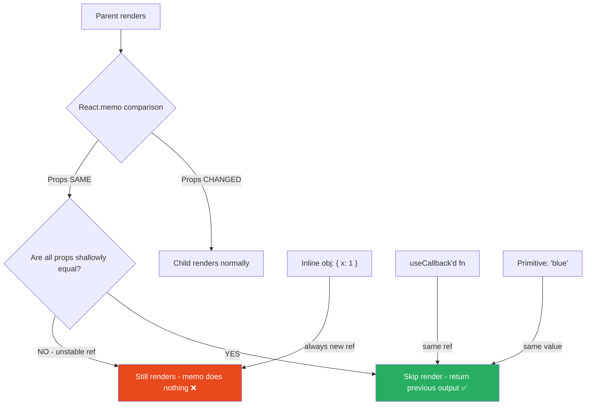
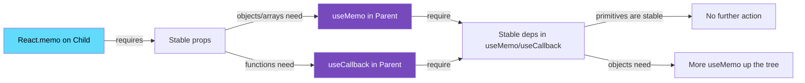

# 73 · Memoization Engineering

> **Memoization in React is the practice of caching the result of a computation — a render, a value, or a function — and returning the cached result when inputs haven't changed, rather than recomputing. React provides three memoization primitives: `React.memo` for component renders, `useMemo` for values, and `useCallback` for functions. Each has a specific use case, a specific cost, and a common misuse pattern. The art of memoization engineering is knowing precisely when each primitive earns its keep and when it's adding overhead for no benefit.**

The instinct to add memoization everywhere after reading about performance is understandable but counterproductive. Every call to `useMemo` or `useCallback` allocates memory, runs a dependency comparison on every render, and adds cognitive overhead to the codebase. The correct mental model: memoization is a trade — you pay a small certain cost (comparison) to avoid a potentially larger uncertain cost (recomputation or re-render). The trade only makes sense when the uncertain cost is actually significant and actually being incurred.

---

## Table of Contents

- [How React Memoization Works Internally](#how-react-memoization-works-internally)
- [React.memo: Component-Level Memoization](#reactmemo-component-level-memoization)
- [When React.memo Actually Helps](#when-reactmemo-actually-helps)
- [React.memo Custom Comparison](#reactmemo-custom-comparison)
- [useMemo: Value Memoization](#usememo-value-memoization)
- [When useMemo Actually Helps](#when-usememo-actually-helps)
- [useCallback: Function Reference Stability](#usecallback-function-reference-stability)
- [The Relationship Between memo, useMemo, and useCallback](#the-relationship-between-memo-usememo-and-usecallback)
- [Shallow Comparison in Depth](#shallow-comparison-in-depth)
- [The Memoization Decision Matrix](#the-memoization-decision-matrix)
- [Memoization and the React Compiler](#memoization-and-the-react-compiler)
- [Common Memoization Bugs](#common-memoization-bugs)
- [Measuring Whether Memoization Helps](#measuring-whether-memoization-helps)
- [Architecture Diagrams](#architecture-diagrams)
- [Good Practices](#good-practices)
- [Bad Practices](#bad-practices)
- [Mental Model](#mental-model)
- [Common Misconceptions](#common-misconceptions)
- [Exercises](#exercises)
- [Further Reading](#further-reading)

---

## How React Memoization Works Internally

All three React memoization primitives share a common implementation pattern in React's fiber architecture:

```
React fibers store a "memoized state" linked list.
For hooks: each hook call corresponds to one node in this list.
Each node stores: { value, deps } (the cached value and its dependency array).

On render:
  1. React calls useMemo (or useCallback, or checks React.memo props)
  2. Compares the current deps to the stored deps
  3. Object.is() comparison: compares each dep by reference/value
  4. ALL deps unchanged → return stored value (no recomputation)
  5. ANY dep changed → recompute, store new value and deps, return

THE COMPARISON COST IS ALWAYS PAID:
  Even when the result is returned from cache, the dependency
  comparison runs on every render. This is why memoization is not
  free — you pay the comparison cost on every render in exchange
  for avoiding the computation cost on renders where deps match.
```

---

## React.memo: Component-Level Memoization

```tsx
// Without memo: re-renders whenever parent renders
function ProductCard({ product, price }) {
  return (
    <div>
      <h3>{product.name}</h3>
      <span>${price}</span>
    </div>
  );
}

// With memo: re-renders ONLY when props change (shallow comparison)
const ProductCard = React.memo(function ProductCard({ product, price }) {
  return (
    <div>
      <h3>{product.name}</h3>
      <span>${price}</span>
    </div>
  );
});
```

### What React.memo does internally

```
React.memo wraps a component with a comparison check in the reconciler.

On each parent render, React:
  1. Gets the new props from the parent
  2. Compares them to the previous props via shallowEqual()
     shallowEqual checks: Object.is(prevProp, nextProp) for each key
  3. ALL props shallowly equal → skip render, return previous output (fiber reuse)
  4. ANY prop changed → render normally

Cost of the comparison:
  O(n) where n = number of props
  For a component with 5 props: 5 Object.is() calls
  This runs on EVERY parent render, whether or not memo saves work
```

### The three conditions for React.memo to help

```
React.memo only provides a net benefit when ALL THREE are true:

1. The component renders are EXPENSIVE (significant CPU work)
   → If the component renders in <1ms, the memo comparison overhead
     may exceed the render cost

2. The parent renders FREQUENTLY without changing this component's props
   → If props always change when parent renders, memo never skips anything

3. The props ARE STABLE (same references when values haven't changed)
   → If props include inline objects or functions (new references each render),
     memo will always re-render — comparison always fails

If any of these three conditions fails, React.memo adds overhead
for zero benefit.
```

---

## When React.memo Actually Helps

### ✅ Scenario 1: Expensive component, stable props, frequent parent updates

```tsx
// Parent has frequent state changes (input typing)
function SearchPage() {
  const [query, setQuery] = useState("");
  const [results] = useState(heavyDataset); // stable

  return (
    <>
      <input value={query} onChange={(e) => setQuery(e.target.value)} />
      {/* ExpensiveChart shouldn't re-render on every keystroke */}
      <ExpensiveChart data={results} />
    </>
  );
}

const ExpensiveChart = React.memo(function ExpensiveChart({ data }) {
  // Complex D3/canvas rendering, takes 50ms
  return <canvas ref={/* D3 render logic */} />;
});
// ✅ Saves 50ms per keystroke — significant benefit
```

### ✅ Scenario 2: List items with stable item data

```tsx
const ListItem = React.memo(function ListItem({
  item,
  onSelect,
}: {
  item: Item;
  onSelect: (id: string) => void;
}) {
  return <li onClick={() => onSelect(item.id)}>{item.name}</li>;
});

function List({ items }: { items: Item[] }) {
  const handleSelect = useCallback((id: string) => {
    selectItem(id);
  }, []); // stable reference

  return (
    <ul>
      {items.map((item) => (
        <ListItem key={item.id} item={item} onSelect={handleSelect} />
      ))}
    </ul>
  );
}
// ✅ 1000-item list: only the changed item re-renders, not all 1000
```

### ❌ Scenario 3: Cheap component, not worth memo overhead

```tsx
// Don't memo a trivial render
const StatusDot = React.memo(function StatusDot({ color }: { color: string }) {
  return <span className={`dot dot--${color}`} />;
});
// ❌ This component renders in <0.1ms
// The shallow prop comparison runs on every parent render
// Net cost: more overhead, not less
```

---

## React.memo Custom Comparison

For cases where shallow comparison is too strict (misses "equal" objects) or too loose:

```tsx
type Product = { id: string; name: string; price: number; tags: string[] };

const ProductCard = React.memo(
  function ProductCard({
    product,
    onClick,
  }: {
    product: Product;
    onClick: () => void;
  }) {
    return <div onClick={onClick}>{product.name}</div>;
  },
  // Custom comparison function: return true to SKIP re-render (they're "equal")
  // return false to ALLOW re-render (they're "not equal")
  (prevProps, nextProps) => {
    // Skip re-render if only price changed by less than $1 (rounding)
    // AND name, id are the same
    return (
      prevProps.product.id === nextProps.product.id &&
      prevProps.product.name === nextProps.product.name &&
      Math.abs(prevProps.product.price - nextProps.product.price) < 1 &&
      prevProps.onClick === nextProps.onClick
    );
  },
);
```

```
CUSTOM COMPARISON RULES:
  return true → props are "equal" → SKIP the render
  return false → props are "different" → ALLOW the render

This is the INVERSE of a normal equality check naming convention,
which trips up developers. "areEqual" returning true = skip render.

WHEN TO USE CUSTOM COMPARISON:
  - Props contain arrays/objects that are recreated but conceptually same
  - You want to ignore certain prop changes (e.g., irrelevant metadata)
  - The standard shallow comparison is causing false positives (unnecessary renders)

WHEN NOT TO USE CUSTOM COMPARISON:
  - Just to avoid passing stable references (fix the reference instead)
  - For complex deep equality (the deep comparison cost may exceed render cost)
```

---

## useMemo: Value Memoization

```tsx
// Syntax:
const memoizedValue = useMemo(() => computeValue(a, b), [a, b]);

// The computation runs:
//   - On the first render (always)
//   - When 'a' OR 'b' changes (any dep in the array)
//   - NOT on re-renders where a and b are unchanged

// Example: expensive filter + sort
function ProductList({ products, filter, sortBy }) {
  const processedProducts = useMemo(
    () => {
      const filtered = products.filter((p) => p.category === filter);
      const sorted = [...filtered].sort((a, b) => {
        if (sortBy === "price") return a.price - b.price;
        return a.name.localeCompare(b.name);
      });
      return sorted;
    },
    [products, filter, sortBy], // only recompute when these change
  );

  return processedProducts.map((p) => <ProductCard key={p.id} product={p} />);
}
```

### useMemo for reference stability (enabling downstream memo)

```tsx
// useMemo to create a stable object reference for memo'd children
function UserDashboard({ userId }: { userId: string }) {
  const [data, setData] = useState<DashboardData | null>(null);

  // ❌ Without useMemo: new object reference on every render
  // → children with React.memo always see "props changed"
  const config = { userId, theme: "dark", pageSize: 20 };

  // ✅ With useMemo: stable reference when userId doesn't change
  const config = useMemo(
    () => ({ userId, theme: "dark", pageSize: 20 }),
    [userId],
  );

  return <DashboardContent config={config} />;
}
```

---

## When useMemo Actually Helps

### ✅ Scenario 1: Computationally expensive transformation

```tsx
// Expensive: sorting/filtering 10,000 items, running on every render
const sortedItems = useMemo(
  () =>
    items
      .filter((item) => item.active)
      .sort((a, b) => b.priority - a.priority)
      .map((item) => ({ ...item, displayName: formatName(item) })),
  [items], // recompute only when items array changes
);
// ✅ Saves 20-50ms per render for large datasets
```

### ✅ Scenario 2: Creating a stable reference for React.memo children

```tsx
// useMemo to stabilize a prop object, enabling memo to work
const chartConfig = useMemo(
  () => ({ type: "line", color: theme.primary, responsive: true }),
  [theme.primary],
);
<ExpensiveChart config={chartConfig} />; // React.memo'd — now works correctly
// ✅ chartConfig reference is stable when theme.primary doesn't change
```

### ❌ Scenario 3: Trivial computation

```tsx
// ❌ Wasteful: this is cheaper than the memo overhead
const doubled = useMemo(() => value * 2, [value]);
// Multiply by 2 = nanoseconds
// useMemo: allocates a hooks node, compares [value] every render
// Net cost: more work, not less

// ✅ Just compute it directly
const doubled = value * 2;
```

### ❌ Scenario 4: Dependencies that change on every render

```tsx
// ❌ useMemo with unstable dependencies never caches anything
function Component({ data }) {
  const processed = useMemo(
    () => processData(data),
    [data], // data is a new object reference on every parent render
  );
  // Every render: dependencies changed → recompute → no caching benefit
  // AND the comparison runs every render → net overhead
}
```

---

## useCallback: Function Reference Stability

```tsx
// Without useCallback: new function reference on every render
function TodoList({ todos, onFilter }) {
  const handleDelete = (id: string) => {
    deleteTodo(id);
    onFilter();
  };
  // handleDelete is a new function instance every render
  // If passed to React.memo'd children: memo never skips

  // With useCallback: same function reference when deps unchanged
  const handleDelete = useCallback(
    (id: string) => {
      deleteTodo(id);
      onFilter();
    },
    [onFilter],
  ); // only recreate when onFilter changes
}
```

### useCallback is primarily for reference stability

```
useCallback does NOT prevent the function from being called.
It does NOT cache the result of the function.
It ONLY returns the SAME function reference when deps haven't changed.

The only reason to use useCallback:
  To create a stable function reference that won't break React.memo
  on a downstream component that receives it as a prop.

useCallback WITHOUT React.memo on the recipient = zero benefit:
  If the child doesn't have React.memo, it re-renders regardless
  of whether the function reference changed. useCallback achieves
  nothing in this scenario.
```

### The useCallback + React.memo pairing rule

```tsx
// These two must be used TOGETHER or neither works for render optimization:

// ✅ BOTH: React.memo on child + useCallback for the handler prop
const TodoItem = React.memo(function TodoItem({ todo, onDelete }) {
  return (
    <li>
      {todo.text} <button onClick={() => onDelete(todo.id)}>✕</button>
    </li>
  );
});

function TodoList({ todos }) {
  const handleDelete = useCallback(
    (id: string) => {
      dispatch({ type: "DELETE_TODO", payload: id });
    },
    [dispatch],
  ); // stable: dispatch from useReducer is stable

  return todos.map((todo) => (
    <TodoItem key={todo.id} todo={todo} onDelete={handleDelete} />
  ));
}

// ❌ ONLY useCallback, no React.memo on child: useCallback does nothing
function TodoList({ todos }) {
  const handleDelete = useCallback(
    (id: string) => {
      dispatch({ type: "DELETE_TODO", payload: id });
    },
    [dispatch],
  );

  return todos.map((todo) => (
    <TodoItem key={todo.id} todo={todo} onDelete={handleDelete} />
    // TodoItem has NO React.memo → re-renders on every parent render anyway
    // useCallback's stable reference is irrelevant
  ));
}
```

---

## The Relationship Between memo, useMemo, and useCallback

```
React.memo: "skip rendering this component if props haven't changed"
  Requires: stable prop references to work correctly

useMemo: "skip recomputing this value if deps haven't changed"
  Use for: expensive computations + creating stable object references

useCallback: "keep the same function reference if deps haven't changed"
  Is exactly: useMemo(() => fn, deps) — just syntactic sugar
  Use for: creating stable function references for React.memo'd children

The dependency chain:
  React.memo works correctly ONLY IF props are stable
  Props (objects, arrays) are stable ONLY IF created with useMemo
  Props (functions) are stable ONLY IF created with useCallback

  → React.memo without useMemo/useCallback for non-primitive props = broken
  → useMemo/useCallback without React.memo on the recipient = useless
```

---

## Shallow Comparison in Depth

Understanding exactly what "shallow comparison" means is essential for debugging memoization:

```
Object.is() comparison (used for each dep in useMemo/useCallback,
and for each prop in React.memo's default comparison):

// Primitives: compared by value
Object.is(1, 1)          // true
Object.is('abc', 'abc')  // true
Object.is(true, false)   // false
Object.is(null, null)    // true
Object.is(undefined, undefined) // true

// Edge cases:
Object.is(NaN, NaN)       // true (unlike ===)
Object.is(0, -0)          // false (unlike ===)

// Objects and arrays: compared by REFERENCE
Object.is({}, {})         // false — different objects!
Object.is([], [])         // false — different arrays!
const a = {}; Object.is(a, a) // true — same reference!

// Functions: compared by REFERENCE
Object.is(() => {}, () => {}) // false — different functions!
const fn = () => {}; Object.is(fn, fn) // true — same reference!
```

```
PRACTICAL IMPLICATIONS:

// These trigger re-renders even with React.memo:
<Component style={{ padding: 16 }} />     // new object each render
<Component items={[1, 2, 3]} />           // new array each render
<Component onClick={() => doThing()} />   // new function each render

// These DON'T trigger re-renders with React.memo:
<Component color="blue" />                // string: same value
<Component count={42} />                  // number: same value
<Component style={STABLE_STYLE} />        // stable reference
<Component onClick={handleClick} />       // useCallback'd stable reference
```

---

## The Memoization Decision Matrix

```
useMemo(fn, deps):
  ✅ Use when:
    - fn takes >1ms to compute
    - Component re-renders frequently without deps changing
    - Creating a stable object/array reference for React.memo'd children
  ❌ Don't use when:
    - fn is trivial (<0.1ms: arithmetic, string formatting, simple maps)
    - deps change on every render (breaks caching, adds comparison overhead)
    - Not passing the value to a React.memo'd component

useCallback(fn, deps):
  ✅ Use when:
    - The function is passed as a prop to a React.memo'd component
    - The function is in the dependency array of another hook
      (useEffect, useMemo, useCallback) and would cause infinite loops
      without stability
  ❌ Don't use when:
    - The recipient component is NOT wrapped in React.memo
    - The function is only called locally (not passed as a prop)
    - The function is redefined but deps change just as often

React.memo(Component):
  ✅ Use when:
    - The component's render cost is significant (>1-2ms)
    - The parent renders frequently without changing this component's props
    - All props are stable (primitives, or stabilized with useMemo/useCallback)
  ❌ Don't use when:
    - The component is trivially cheap to render
    - Props always change when parent renders (memo never skips)
    - Props include unstable references (memo always re-renders)
```

---

## Memoization and the React Compiler

The React Compiler (covered in Part VIII) automates memoization:

```
The React Compiler:
  - Analyzes component code statically
  - Automatically applies the equivalent of React.memo, useMemo,
    and useCallback where beneficial
  - Produces fine-grained memoization at the property access level
    (not just the whole object)

If the React Compiler is enabled:
  - Manual React.memo / useMemo / useCallback may become redundant
  - The compiler will have already applied equivalent optimization
  - Adding manual memo on top may not break anything, but adds dead code

IF USING THE REACT COMPILER:
  - Remove manual memoization and let the compiler handle it
  - Profile with the compiler enabled to verify its optimizations are applied
  - The compiler's output is visible in the "React Memo" DevTools section

The compiler is not yet universally adopted (as of 2025).
Until it is, manual memoization remains necessary for performance-critical code.
```

---

## Common Memoization Bugs

### Bug 1: Memoizing but not stabilizing

```tsx
// ❌ React.memo without stabilizing the function prop
const Button = React.memo(function Button({ onClick, label }) {
  return <button onClick={onClick}>{label}</button>;
});

function Parent() {
  // ❌ New function every render → memo never works
  return <Button onClick={() => handleClick()} label="Click" />;
}

// ✅ Fix: stabilize with useCallback
function Parent() {
  const handleClick = useCallback(() => doSomething(), []);
  return <Button onClick={handleClick} label="Click" />;
}
```

### Bug 2: Including unstable values in dep arrays

```tsx
// ❌ Object literal in dep array: always triggers recompute
function Component({ config }) {
  const processed = useMemo(
    () => processData(config),
    [config, { debug: true }], // ← new object literal every render!
  );
  // useMemo never caches because { debug: true } is always "new"
}

// ✅ Fix: move stable values outside, or use primitive deps
const DEBUG_CONFIG = { debug: true }; // outside component = stable

function Component({ config }) {
  const processed = useMemo(
    () => processData(config, DEBUG_CONFIG),
    [config], // ✅ DEBUG_CONFIG is stable (not in deps)
  );
}
```

### Bug 3: Over-memoizing, creating a harder-to-maintain codebase

```tsx
// ❌ Every value is wrapped in useMemo, every handler in useCallback
// Code becomes unreadable; many memos are providing no benefit
function ProductForm({ productId }) {
  const id = useMemo(() => productId, [productId]); // ❌ trivial primitive
  const title = useMemo(() => "Edit Product", []); // ❌ constant string!
  const handleSave = useCallback(() => save(productId), [productId]);
  const handleCancel = useCallback(() => navigate(-1), []); // maybe ok
  const validationRules = useMemo(() => ({ required: true }), []); // ❌ cheap constant

  // ...
}

// ✅ Only memoize what the profiler shows needs it
function ProductForm({ productId }) {
  const handleSave = useCallback(() => save(productId), [productId]); // ✅ needed if passed to memo'd child
  // Everything else: just compute directly
}
```

---

## Measuring Whether Memoization Helps

```tsx
// Use the Profiler to measure the actual impact:
import { Profiler } from "react";

function measureMemo() {
  const renders = { withMemo: [], withoutMemo: [] };

  // Test without memo:
  const WithoutMemo = ({ data }) => <ExpensiveList data={data} />;

  // Test with memo:
  const WithMemo = React.memo(({ data }) => <ExpensiveList data={data} />);

  // Wrap in Profiler, trigger renders, compare actualDuration values
  // The difference between actualDuration WITH and WITHOUT memo = saved time
  // Compare to the 0.05-0.2ms baseline cost of the comparison itself
}

// Heuristic: memo is probably worth it if:
//   Render time WITHOUT memo: >2ms
//   Render frequency: >10 times/second (60fps UI interaction)
//   Estimated saved work per second: >20ms
// For everything else: measure before committing
```

---

## Architecture Diagrams

### When React.memo saves work vs when it doesn't



### The memoization effectiveness chain



---

## Good Practices

### ✅ Good Practice — The complete memoization pattern for a large list

```tsx
/**
 * Good: Complete, correctly-applied memoization for a 500-item list
 * where items have expensive renders and the parent has frequent
 * unrelated state changes (e.g., a search input nearby).
 *
 * The three memoization primitives work together:
 *   useMemo: stabilizes the filtered list reference
 *   useCallback: stabilizes the handler reference
 *   React.memo: prevents ProductCard renders when props are stable
 */

// The stable handler callback
function useProductActions(dispatch: React.Dispatch<Action>) {
  const handleAddToCart = useCallback(
    (productId: string) =>
      dispatch({ type: "ADD_TO_CART", payload: productId }),
    [dispatch], // dispatch from useReducer is guaranteed stable
  );

  const handleWishlist = useCallback(
    (productId: string) =>
      dispatch({ type: "TOGGLE_WISHLIST", payload: productId }),
    [dispatch],
  );

  return { handleAddToCart, handleWishlist };
}

// The memoized ProductCard
const ProductCard = React.memo(function ProductCard({
  product,
  onAddToCart,
  onWishlist,
}: ProductCardProps) {
  return (
    <article>
      <h3>{product.name}</h3>
      <span>${product.price}</span>
      <button onClick={() => onAddToCart(product.id)}>Add to Cart</button>
      <button onClick={() => onWishlist(product.id)}>♡</button>
    </article>
  );
});

// The parent: memoizes the list, uses stable callbacks
function ProductGrid({ products, searchQuery }: ProductGridProps) {
  const [state, dispatch] = useReducer(cartReducer, initialState);
  const { handleAddToCart, handleWishlist } = useProductActions(dispatch);

  // Stable filtered list: only recomputes when products or searchQuery change
  const filtered = useMemo(
    () =>
      products.filter((p) =>
        p.name.toLowerCase().includes(searchQuery.toLowerCase()),
      ),
    [products, searchQuery],
  );

  return (
    <div className="product-grid">
      {filtered.map((product) => (
        <ProductCard
          key={product.id}
          product={product}
          onAddToCart={handleAddToCart} // stable reference
          onWishlist={handleWishlist} // stable reference
        />
      ))}
    </div>
  );
}
// Result: typing in the search input only re-renders ProductCards whose
// display status changes (appear/disappear), not all 500 cards.
```

---

## Bad Practices

### ⚠️ Bad Practice — The "memo everything" anti-pattern

```tsx
/**
 * Bad: Applying memoization uniformly to all components and values
 * "for performance," creating a maintenance burden without
 * corresponding benefit.
 *
 * Signs of over-memoization:
 *   - Every component wrapped in React.memo
 *   - Every computed value in useMemo
 *   - Every handler in useCallback
 *   - No profiler data justifying the choices
 *
 * The actual cost:
 *   - Bundle size: useMemo/useCallback add code
 *   - Runtime: comparison runs every render regardless of cache hits
 *   - Readability: nested useMemo for stale closure avoidance is hard to follow
 *   - Maintenance: deps arrays must be kept accurate (easy to get wrong)
 */

// ❌ Reflexive memoization of trivial values and cheap components
function UserCard({ user }) {
  const fullName = useMemo(
    () => `${user.first} ${user.last}`,
    [user.first, user.last],
  );
  const avatarUrl = useMemo(() => getAvatarUrl(user.id), [user.id]);
  const cardClass = useMemo(() => `card card--${user.role}`, [user.role]);

  const handleClick = useCallback(() => {
    selectUser(user.id);
  }, [user.id]);

  return (
    <div className={cardClass} onClick={handleClick}>
      
      <span>{fullName}</span>
    </div>
  );
}

// This component renders in ~0.3ms. All these useMemos and the useCallback
// add overhead comparable to the render itself, with zero benefit unless
// this component's parent re-renders very frequently WITHOUT user changing.
// Profiler shows this component rarely re-renders unnecessarily.
// ALL of this memoization is waste.

// ✅ Correct version: direct computation, no memo overhead
function UserCard({ user }) {
  const fullName = `${user.first} ${user.last}`;
  const avatarUrl = getAvatarUrl(user.id);
  const cardClass = `card card--${user.role}`;

  return (
    <div className={cardClass} onClick={() => selectUser(user.id)}>
      
      <span>{fullName}</span>
    </div>
  );
}
// Simpler, faster to write, easier to read, performs identically
// for this component's actual usage pattern.
```

---

## Mental Model

> 💡 **The memoization mental model:**
>
> Think of memoization as a **filing clerk who always checks the index before going to the archive**. Every time you need a document (a computed value or render), the clerk first checks a small index card that lists the last document retrieved and the conditions under which it was retrieved (the dependency array). If the conditions match — same drawer, same search term (same deps) — the clerk hands you the copy from the desk instead of trekking to the archive (recomputing). But the clerk ALWAYS checks the index card, even when handing you the desk copy — that checking costs a small, fixed amount every time. The optimization only pays off when the archive trek is more expensive than the index check. Filing EVERY document behind this clerk (memoizing everything) means you pay the index-check cost for every document retrieval, even for documents that live right on the desk and take one second to grab. Only file documents behind the clerk when the archive is genuinely far away.

---

## Common Misconceptions

### "useCallback prevents function re-creation"

`useCallback` returns the SAME function reference when deps haven't changed. The function is still defined at the module level — `useCallback` doesn't prevent its source code from existing. What it prevents is a NEW function object being created on each render, which matters only when the recipient uses reference equality (React.memo).

### "useMemo runs before the component renders"

`useMemo` runs DURING the render (synchronously, as part of the component function body). It doesn't pre-compute or run before the render starts. On the first render, it always runs the computation. On subsequent renders, it runs the comparison, and either returns the cached value or runs the computation again.

### "React.memo does deep equality comparison"

React.memo's default comparison is SHALLOW equality (Object.is for each prop). `{ a: 1 }` and `{ a: 1 }` are NOT equal under shallow comparison — they're different objects. Deep equality would be much more expensive and is not the default. Custom comparators can implement deep comparison but at a cost.

### "useMemo with an empty dependency array runs once"

`useMemo(() => value, [])` runs on the FIRST render and caches the result. On subsequent renders, it returns the cached result (empty deps array never changes). But this should not be confused with "runs once globally" — in StrictMode (development), React renders components twice to detect side effects, so useMemo runs twice in development. In production, it genuinely runs once.

### "Memoization is always a win for performance-sensitive code"

Memoization adds a certain, fixed overhead (the comparison) to avoid a possible, variable cost (the computation). If the variable cost is small, the fixed overhead may dominate. Measure with the Profiler before applying memoization in performance-sensitive code — don't assume it helps.

---

## Exercises

### Exercise 1 — Measure the actual cost of a React.memo comparison

```tsx
// Build this:
const SimpleComponent = React.memo(function SimpleComponent({ value }) {
  return <span>{value}</span>;
});

function Parent() {
  const [count, setCount] = useState(0);
  return (
    <div>
      <button onClick={() => setCount((c) => c + 1)}>Count: {count}</button>
      <SimpleComponent value="constant" />
    </div>
  );
}
```

1. Profile 100 rapid button clicks
2. Note the time for each render with SimpleComponent gray (skipped)
3. Remove React.memo, profile again
4. Compare: how much does the memo comparison cost vs the render?

### Exercise 2 — Fix broken memoization

```tsx
// This React.memo is doing nothing. Find and fix all the issues:
const ProductCard = React.memo(function ProductCard({
  product,
  config,
  onSelect,
}) {
  return <div>{product.name}</div>;
});

function ProductList({ products }) {
  return products.map((p) => (
    <ProductCard
      key={p.id}
      product={p}
      config={{ showPrice: true, currency: "USD" }} // Issue 1
      onSelect={(id) => handleSelect(id)} // Issue 2
    />
  ));
}
```

### Exercise 3 — Audit a codebase for memoization effectiveness

Take any React project (or create one with 10+ components). For each usage of `React.memo`, `useMemo`, or `useCallback`:

1. Is this prop/value passed to a React.memo'd component?
2. Does the computation take >1ms (check with Profiler)?
3. Do deps change less often than the component renders?

For each "no" answer: the memoization is likely not helping. Remove it and profile to confirm.

---

## Further Reading

- [React Docs: React.memo](https://react.dev/reference/react/memo) — official reference
- [React Docs: useMemo](https://react.dev/reference/react/useMemo) — official reference
- [React Docs: useCallback](https://react.dev/reference/react/useCallback) — official reference
- [Kent C. Dodds: When to useMemo and useCallback](https://kentcdodds.com/blog/usememo-and-usecallback) — the definitive essay on when NOT to memoize
- [Nadia Makarevich: Advanced React](https://www.advanced-react.com/) — Chapter 5 covers memoization in depth
- Related in this handbook: [72 · React Profiler](./01-react-profiler.md), [Part VIII: React Compiler](../react-compiler/01-compiler.md)
- Next in this handbook: [74 · Virtualization & Windowing](./03-virtualization.md)

---

_Part of the [React + Next.js Engineering Handbook](../../README.md)_
