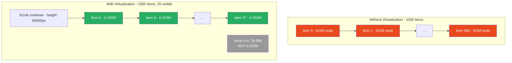
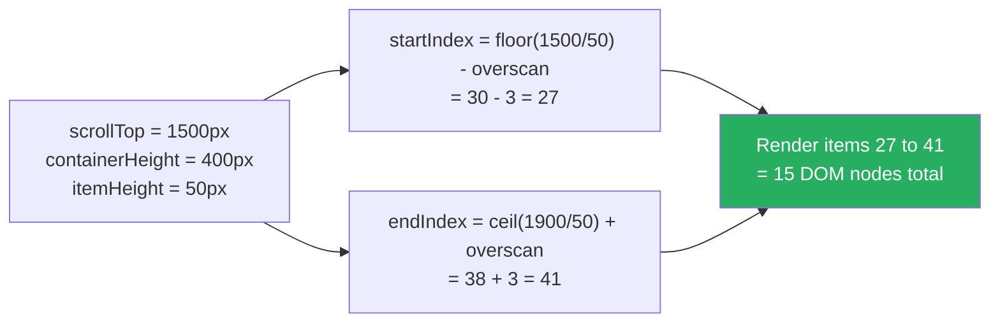

# 74 · Virtualization & Windowing

> **Virtualization (also called windowing) is the technique of rendering only the subset of list items currently visible in the viewport, rather than rendering all items at once. A list of 10,000 items where each item renders a `<div>` with some text and an image: without virtualization, that's 10,000 DOM nodes, 10,000 layout calculations, and 10,000 paint operations on every render. With virtualization: 15-30 DOM nodes regardless of list length. The technique makes "render a large list" go from O(n) to O(1) in terms of DOM size and render cost.**

Virtualization is the right tool for a specific, well-defined problem: rendering a list (or grid) whose total item count significantly exceeds what's visible in the viewport at once. It's not a general-purpose optimization — it adds complexity, changes scroll behavior, and requires items to have predictable sizes (or to measure them). Understanding when virtualization is the right answer and how to implement it correctly is the skill.

---

## Table of Contents

- [The Problem: DOM Size at Scale](#the-problem-dom-size-at-scale)
- [How Virtualization Works](#how-virtualization-works)
- [The Windowing Calculation](#the-windowing-calculation)
- [Overscan: Rendering Beyond the Viewport](#overscan-rendering-beyond-the-viewport)
- [Fixed Size vs Variable Size Items](#fixed-size-vs-variable-size-items)
- [The Libraries: react-window vs react-virtual vs tanstack-virtual](#the-libraries-react-window-vs-react-virtual-vs-tanstack-virtual)
- [Implementing with TanStack Virtual](#implementing-with-tanstack-virtual)
- [Implementing with react-window](#implementing-with-react-window)
- [Virtualizing Grids](#virtualizing-grids)
- [Dynamic Item Sizes with Measurement](#dynamic-item-sizes-with-measurement)
- [Infinite Scroll with Virtualization](#infinite-scroll-with-virtualization)
- [Virtualization and React State](#virtualization-and-react-state)
- [When NOT to Virtualize](#when-not-to-virtualize)
- [Architecture Diagrams](#architecture-diagrams)
- [Good Practices](#good-practices)
- [Bad Practices](#bad-practices)
- [Mental Model](#mental-model)
- [Common Misconceptions](#common-misconceptions)
- [Exercises](#exercises)
- [Further Reading](#further-reading)

---

## The Problem: DOM Size at Scale

```
Consider a contact list with 5,000 contacts:

WITHOUT virtualization:
  DOM nodes: 5,000 × (let's say 5 elements per contact) = 25,000 nodes
  Initial render: React creates 5,000 components, mounts 25,000 DOM nodes
  Time for initial render: 2-5 seconds on a mid-range device
  Memory: ~50MB for DOM nodes alone
  Scroll: smooth initially, but DOM queries and layout calculations
          operate on all 25,000 nodes

WITH virtualization (viewport shows 20 contacts at once):
  DOM nodes: ~25 × 5 elements = ~125 nodes (20 visible + 5 overscan)
  Initial render: React creates 25 components, mounts 125 DOM nodes
  Time for initial render: 20-50ms
  Memory: ~0.3MB for DOM nodes
  Scroll: browser calculates layout for 125 nodes (not 25,000)

The difference: 125 DOM nodes vs 25,000 — regardless of total list length.
```

### The three costs of large DOM trees

```
1. INITIAL RENDER COST:
   React must call 5,000 component functions, reconcile them,
   and commit 25,000 DOM nodes to the actual DOM.
   Time: scales linearly with item count.

2. LAYOUT COST:
   The browser must lay out all 25,000 nodes, even off-screen ones.
   Any DOM mutation (adding, removing, updating) recalculates layout
   for the entire visible subtree plus its dirty ancestors.

3. MEMORY COST:
   Each DOM node is a C++ object with ~300 bytes minimum.
   25,000 nodes = ~7.5MB. Add React fiber nodes, event handlers,
   and JavaScript object overhead: 50-100MB easily.
   On mobile: OOM (out of memory) crashes are real.
```

---

## How Virtualization Works

The core mechanism is deceptively simple:

```
SETUP:
  A scrollable container with explicit height (the "window")
  Inside: a container with height = total_items × item_height
    (creates the correct scrollbar size)
  Inside: only the currently-visible items, absolutely positioned

ON SCROLL:
  1. Calculate scrollTop (how far the user has scrolled)
  2. Calculate startIndex = Math.floor(scrollTop / itemHeight)
  3. Calculate endIndex = startIndex + Math.ceil(containerHeight / itemHeight)
  4. Render ONLY items[startIndex..endIndex]
  5. Position each item: top = index × itemHeight (via CSS or style)

RESULT:
  - Scrollbar reflects the full list height (user sees correct scroll affordance)
  - Only viewport-visible items are in the DOM
  - As user scrolls: old items unmount, new items mount
  - Constant DOM size regardless of list length
```

```
┌──────────────────────────────────────┐ ← scrollable container
│ ┌────────────────────────────────┐   │
│ │ [Item 0: RENDERED]             │   │ ← positioned at top: 0px
│ │ [Item 1: RENDERED]             │   │ ← positioned at top: 50px
│ │ [Item 2: RENDERED]             │   │ ← positioned at top: 100px
│ │ ....                           │   │
│ │ [Item 24: RENDERED]            │   │ ← positioned at top: 1200px
│ │                                │   │
│ │   [empty space: 975,800px]    │   │ ← CSS height = 20000 × 50px
│ │   (no DOM nodes here)         │   │
│ └────────────────────────────────┘   │
└──────────────────────────────────────┘

User scrolls to position 5000px:
  startIndex = Math.floor(5000 / 50) = 100
  visible: items 100-124 (RENDERED)
  items 0-99: NOT in DOM
  items 125-19999: NOT in DOM
```

---

## The Windowing Calculation

The precise math behind which items to render:

```tsx
function getVisibleRange(
  scrollTop: number,
  containerHeight: number,
  itemHeight: number,
  itemCount: number,
  overscan: number = 3,
) {
  const startIndex = Math.max(0, Math.floor(scrollTop / itemHeight) - overscan);

  const endIndex = Math.min(
    itemCount - 1,
    Math.ceil((scrollTop + containerHeight) / itemHeight) + overscan,
  );

  return { startIndex, endIndex };
}

// Example:
// scrollTop = 250px, container = 400px, itemHeight = 50px, overscan = 3
// startIndex = max(0, floor(250/50) - 3) = max(0, 5 - 3) = 2
// endIndex = min(999, ceil((250+400)/50) + 3) = min(999, 13 + 3) = 16
// Renders items 2 through 16: 15 items (13 visible + 3 overscan each side)
```

---

## Overscan: Rendering Beyond the Viewport

Overscan renders a buffer of items beyond the visible viewport to prevent a flash of blank content during fast scrolling:

```
WITHOUT overscan:
  User scrolls quickly → item enters viewport BEFORE React has rendered it
  → Brief flash of empty space while React catches up
  Very noticeable on mobile or with slow JS execution

WITH overscan (3 items):
  Items are rendered 3 slots BEFORE they enter the viewport
  User scrolls quickly → items are already in the DOM when they become visible
  → No flash of empty space (usually)
  Cost: 3 extra items rendered above + 3 below = 6 extra DOM nodes

TYPICAL OVERSCAN VALUES:
  1-3: minimal extra nodes, may show flashes on fast scroll
  3-5: good balance (most common default)
  10+: never shows flash even on very fast scroll, but more nodes rendered
```

---

## Fixed Size vs Variable Size Items

The most important architectural decision in a virtualized list:

```
FIXED SIZE ITEMS:
  All items have the same height (for vertical lists) or width (horizontal)

  Advantages:
    - O(1) scroll position calculation
    - No measurement needed
    - No layout recalculation when scrolling
    - Simplest implementation

  When to use: homogeneous content (email subjects, product cards,
  search results, user avatars)

VARIABLE SIZE ITEMS:
  Items have different heights depending on their content

  Advantages: renders content accurately
  Disadvantages:
    - Must know each item's size before or as it renders
    - Options:
      a. Pre-specify sizes (if known): pass array of heights
      b. Measure on render: render → measure DOM → cache size → position
    - Measuring is expensive and can cause layout thrashing
    - Re-measuring on window resize is complex

  When to use: social media feeds, chat messages, rich text content
```

---

## The Libraries: react-window vs react-virtual vs tanstack-virtual

```
REACT-WINDOW (bvaughn/react-window):
  Maturity: very stable, widely used
  API: component-based (<FixedSizeList>, <VariableSizeList>, <FixedSizeGrid>)
  Bundle size: ~5KB gzip
  Variable size support: yes, but manual size specification required
  React 18 concurrent mode: partial (some features)
  SSR: basic support
  Best for: simple lists and grids, well-understood use case

TANSTACK VIRTUAL (@tanstack/react-virtual):
  Maturity: stable, actively maintained (v3)
  API: hook-based (useVirtualizer) — more flexible
  Bundle size: ~3KB gzip
  Variable size support: yes, with measurement support
  React 18 concurrent mode: yes
  SSR: yes (with SSR placeholder count)
  Best for: custom scroll containers, React 18 features,
             variable-size content, complex layouts

REACT-VIRTUALIZED (bvaughn/react-virtualized):
  Maturity: older, less maintained (predecessor to react-window)
  Best for: legacy codebases only; prefer react-window or TanStack for new work
```

---

## Implementing with TanStack Virtual

```tsx
import { useVirtualizer } from "@tanstack/react-virtual";
import { useRef } from "react";

function VirtualList({ items }: { items: Contact[] }) {
  const parentRef = useRef<HTMLDivElement>(null);

  const virtualizer = useVirtualizer({
    count: items.length, // total item count
    getScrollElement: () => parentRef.current, // the scrollable element
    estimateSize: () => 56, // estimated item height in px
    overscan: 5, // items to render beyond viewport
  });

  return (
    <div
      ref={parentRef}
      style={{
        height: "600px", // the "window" height
        overflow: "auto", // enables scrolling
      }}
    >
      {/* Inner container: full virtual height for correct scrollbar */}
      <div
        style={{
          height: `${virtualizer.getTotalSize()}px`,
          width: "100%",
          position: "relative",
        }}
      >
        {/* Only render visible items */}
        {virtualizer.getVirtualItems().map((virtualItem) => (
          <div
            key={virtualItem.key}
            data-index={virtualItem.index}
            ref={virtualizer.measureElement} // enables dynamic height measurement
            style={{
              position: "absolute",
              top: 0,
              left: 0,
              width: "100%",
              transform: `translateY(${virtualItem.start}px)`,
            }}
          >
            <ContactRow contact={items[virtualItem.index]} />
          </div>
        ))}
      </div>
    </div>
  );
}
```

### TanStack Virtual with dynamic measurement

```tsx
// When item heights vary by content:
const virtualizer = useVirtualizer({
  count: items.length,
  getScrollElement: () => parentRef.current,
  estimateSize: () => 80, // initial estimate; will be corrected by measurement
  overscan: 5,
});

// The ref={virtualizer.measureElement} on each item enables automatic
// measurement after render — TanStack Virtual will:
// 1. Render with estimated sizes (possibly incorrect scroll position)
// 2. Measure actual rendered heights after mount
// 3. Update the virtual position calculations
// 4. Re-render with correct positions (may cause a brief layout shift)
```

---

## Implementing with react-window

```tsx
import { FixedSizeList as List } from "react-window";

// The row component receives index and style (MUST apply style for positioning)
function ContactRow({
  index,
  style,
  data,
}: {
  index: number;
  style: React.CSSProperties;
  data: Contact[];
}) {
  const contact = data[index];
  return (
    <div style={style}>
      {" "}
      {/* CRITICAL: apply the provided style prop */}
      
      <span>{contact.name}</span>
    </div>
  );
}

function ContactList({ contacts }: { contacts: Contact[] }) {
  return (
    <List
      height={600} // visible window height
      itemCount={contacts.length} // total items
      itemSize={56} // each item's height in px
      itemData={contacts} // passed to each row as 'data' prop
      width="100%"
    >
      {ContactRow}
    </List>
  );
}
```

### Variable size with react-window

```tsx
import { VariableSizeList } from "react-window";

// Must know sizes in advance or cache measured sizes
const itemSizes = new Map<number, number>();

function getItemSize(index: number) {
  return itemSizes.get(index) ?? 80; // default estimate
}

function MessageList({ messages }: { messages: Message[] }) {
  const listRef = useRef<VariableSizeList>(null);

  const onItemRendered = useCallback((index: number, size: number) => {
    if (itemSizes.get(index) !== size) {
      itemSizes.set(index, size);
      // Tell react-window to recalculate positions from this index onward:
      listRef.current?.resetAfterIndex(index);
    }
  }, []);

  return (
    <VariableSizeList
      ref={listRef}
      height={600}
      itemCount={messages.length}
      itemSize={getItemSize}
      estimatedItemSize={80}
    >
      {({ index, style }) => (
        <MessageRow
          message={messages[index]}
          style={style}
          onHeightChange={(size) => onItemRendered(index, size)}
        />
      )}
    </VariableSizeList>
  );
}
```

---

## Virtualizing Grids

For 2D content (image galleries, kanban boards, spreadsheets):

```tsx
import { useVirtualizer } from "@tanstack/react-virtual";

function VirtualGrid({
  items,
  columnCount,
  rowHeight = 200,
  columnWidth = 200,
}: GridProps) {
  const parentRef = useRef<HTMLDivElement>(null);
  const rowCount = Math.ceil(items.length / columnCount);

  const rowVirtualizer = useVirtualizer({
    count: rowCount,
    getScrollElement: () => parentRef.current,
    estimateSize: () => rowHeight,
    overscan: 2,
  });

  const columnVirtualizer = useVirtualizer({
    horizontal: true, // ← horizontal virtualization
    count: columnCount,
    getScrollElement: () => parentRef.current,
    estimateSize: () => columnWidth,
    overscan: 1,
  });

  return (
    <div
      ref={parentRef}
      style={{ height: "600px", width: "100%", overflow: "auto" }}
    >
      <div
        style={{
          height: `${rowVirtualizer.getTotalSize()}px`,
          width: `${columnVirtualizer.getTotalSize()}px`,
          position: "relative",
        }}
      >
        {rowVirtualizer.getVirtualItems().map((virtualRow) =>
          columnVirtualizer.getVirtualItems().map((virtualColumn) => {
            const itemIndex =
              virtualRow.index * columnCount + virtualColumn.index;
            if (itemIndex >= items.length) return null;

            return (
              <div
                key={`${virtualRow.index}-${virtualColumn.index}`}
                style={{
                  position: "absolute",
                  top: 0,
                  left: 0,
                  width: `${virtualColumn.size}px`,
                  height: `${virtualRow.size}px`,
                  transform: `translateX(${virtualColumn.start}px) translateY(${virtualRow.start}px)`,
                }}
              >
                <GridItem item={items[itemIndex]} />
              </div>
            );
          }),
        )}
      </div>
    </div>
  );
}
```

---

## Infinite Scroll with Virtualization

Combining virtualization with data fetching:

```tsx
import { useVirtualizer } from "@tanstack/react-virtual";
import { useInfiniteQuery } from "@tanstack/react-query";

function InfiniteProductList() {
  const parentRef = useRef<HTMLDivElement>(null);

  const { data, fetchNextPage, hasNextPage, isFetchingNextPage } =
    useInfiniteQuery({
      queryKey: ["products"],
      queryFn: ({ pageParam = 0 }) => fetchProducts({ page: pageParam }),
      getNextPageParam: (lastPage) => lastPage.nextCursor,
    });

  // Flatten pages into a single array
  const allItems = data?.pages.flatMap((page) => page.items) ?? [];
  // Add a "loading" placeholder if more pages exist
  const itemCount = hasNextPage ? allItems.length + 1 : allItems.length;

  const virtualizer = useVirtualizer({
    count: itemCount,
    getScrollElement: () => parentRef.current,
    estimateSize: () => 80,
    overscan: 5,
  });

  // Fetch next page when last item becomes visible
  const lastItem = virtualizer.getVirtualItems().at(-1);
  useEffect(() => {
    if (
      lastItem &&
      lastItem.index >= allItems.length - 1 &&
      hasNextPage &&
      !isFetchingNextPage
    ) {
      fetchNextPage();
    }
  }, [
    lastItem,
    hasNextPage,
    isFetchingNextPage,
    allItems.length,
    fetchNextPage,
  ]);

  return (
    <div ref={parentRef} style={{ height: "600px", overflow: "auto" }}>
      <div
        style={{
          height: `${virtualizer.getTotalSize()}px`,
          position: "relative",
        }}
      >
        {virtualizer.getVirtualItems().map((virtualItem) => {
          const isLoaderRow = virtualItem.index >= allItems.length;

          return (
            <div
              key={virtualItem.key}
              style={{
                position: "absolute",
                top: 0,
                left: 0,
                width: "100%",
                transform: `translateY(${virtualItem.start}px)`,
                height: `${virtualItem.size}px`,
              }}
            >
              {isLoaderRow ? (
                <LoadingRow />
              ) : (
                <ProductRow product={allItems[virtualItem.index]} />
              )}
            </div>
          );
        })}
      </div>
    </div>
  );
}
```

---

## Virtualization and React State

A critical architectural concern: virtualized components mount and unmount as items scroll in and out of view. This means component-local state is lost:

```tsx
// ❌ Problem: accordion state is lost when item scrolls off-screen
function ProductCard({ product }: { product: Product }) {
  const [isExpanded, setIsExpanded] = useState(false); // lost on unmount!

  return (
    <div>
      <h3>{product.name}</h3>
      <button onClick={() => setIsExpanded((e) => !e)}>
        {isExpanded ? "Collapse" : "Expand"}
      </button>
      {isExpanded && <ProductDetails product={product} />}
    </div>
  );
}
// User expands item at index 50, scrolls down, scrolls back up:
// → Item remounts with isExpanded = false (state reset)

// ✅ Fix: lift state OUT of the virtualized item
function ProductList({ products }: { products: Product[] }) {
  const [expandedIds, setExpandedIds] = useState(new Set<string>());

  const toggleExpanded = useCallback((id: string) => {
    setExpandedIds((prev) => {
      const next = new Set(prev);
      if (next.has(id)) next.delete(id);
      else next.add(id);
      return next;
    });
  }, []);

  return (
    <VirtualList items={products}>
      {(product) => (
        <ProductCard
          product={product}
          isExpanded={expandedIds.has(product.id)} // from external state
          onToggle={() => toggleExpanded(product.id)}
        />
      )}
    </VirtualList>
  );
}
// State persists in the parent — items can unmount/remount freely
```

---

## When NOT to Virtualize

```
DON'T virtualize when:
  ❌ The list has fewer than ~100 items (overhead not worth it)
  ❌ Items don't have a natural scrollable container (full-page layouts)
  ❌ Items need to be accessible in the DOM for SEO
     (virtualized items are not in the DOM when not visible)
  ❌ Items have complex interdependencies (one item's size affects another's)
  ❌ You need "find on page" (Ctrl+F) to work for list content
     (browser search only finds DOM-present text)
  ❌ Users need to select text that spans across multiple items
  ❌ Print layout requires all items visible

DO virtualize when:
  ✅ The list has hundreds or thousands of items
  ✅ Users primarily scroll through the list (browse pattern)
  ✅ Items are visually uniform (fixed size) or measurable (variable size)
  ✅ Initial render time is causing a noticeable delay (>500ms)
  ✅ Memory consumption from the DOM is causing mobile crashes/slowness
```

---

## Architecture Diagrams

### Virtualization: what's in the DOM vs what's not



### The windowing calculation on scroll



---

## Good Practices

### ✅ Good Practice — Complete virtualized list with state persistence and infinite loading

```tsx
/**
 * Good: Virtualized contact list where:
 *   - State (selected contacts) lives outside the virtualizer
 *   - Infinite loading triggers before reaching the bottom
 *   - Items have consistent height (no measurement needed)
 *   - Accessibility: aria attributes on the scrollable container
 */

const ITEM_HEIGHT = 64;
const OVERSCAN = 5;

function ContactList() {
  const parentRef = useRef<HTMLDivElement>(null);
  const [selectedIds, setSelectedIds] = useState(new Set<string>());

  const { data, fetchNextPage, hasNextPage, isFetchingNextPage } =
    useInfiniteQuery({
      queryKey: ["contacts"],
      queryFn: ({ pageParam }) => fetchContacts({ cursor: pageParam }),
      getNextPageParam: (last) => last.nextCursor,
    });

  const contacts = data?.pages.flatMap((p) => p.contacts) ?? [];

  const virtualizer = useVirtualizer({
    count: hasNextPage ? contacts.length + 1 : contacts.length,
    getScrollElement: () => parentRef.current,
    estimateSize: () => ITEM_HEIGHT,
    overscan: OVERSCAN,
  });

  // Prefetch next page when approaching the end
  const virtualItems = virtualizer.getVirtualItems();
  const lastVirtualItem = virtualItems.at(-1);

  useEffect(() => {
    if (
      lastVirtualItem &&
      lastVirtualItem.index >= contacts.length - OVERSCAN * 2 &&
      hasNextPage &&
      !isFetchingNextPage
    ) {
      fetchNextPage();
    }
  }, [
    lastVirtualItem,
    contacts.length,
    hasNextPage,
    isFetchingNextPage,
    fetchNextPage,
  ]);

  const toggleSelect = useCallback((id: string) => {
    setSelectedIds((prev) => {
      const next = new Set(prev);
      next.has(id) ? next.delete(id) : next.add(id);
      return next;
    });
  }, []);

  return (
    <div
      ref={parentRef}
      role="listbox"
      aria-label="Contact list"
      aria-multiselectable="true"
      style={{ height: "600px", overflow: "auto" }}
    >
      <div style={{ height: virtualizer.getTotalSize(), position: "relative" }}>
        {virtualizer.getVirtualItems().map((vItem) => {
          const isLoader = vItem.index >= contacts.length;
          return (
            <div
              key={vItem.key}
              role={isLoader ? undefined : "option"}
              aria-selected={
                !isLoader && selectedIds.has(contacts[vItem.index].id)
              }
              style={{
                position: "absolute",
                top: 0,
                width: "100%",
                height: `${ITEM_HEIGHT}px`,
                transform: `translateY(${vItem.start}px)`,
              }}
            >
              {isLoader ? (
                <ContactSkeleton />
              ) : (
                <ContactRow
                  contact={contacts[vItem.index]}
                  isSelected={selectedIds.has(contacts[vItem.index].id)}
                  onToggle={toggleSelect}
                />
              )}
            </div>
          );
        })}
      </div>
    </div>
  );
}
```

---

## Bad Practices

### ⚠️ Bad Practice — Virtualizing a short list, or using local state in virtualized items

```tsx
/**
 * Bad 1: Virtualizing a 50-item list.
 * 50 items render in ~20ms without virtualization.
 * Adding virtualization: scroll event handling, position calculations,
 * mount/unmount overhead on scroll — likely SLOWER and definitely
 * more complex for no meaningful benefit.
 */
function SmallList({ items }: { items: Item[] }) {
  // ❌ Unnecessary virtualization for 50 items
  const virtualizer = useVirtualizer({
    count: items.length,
    getScrollElement: () => parentRef.current,
    estimateSize: () => 48,
  });
  // 50 items → just render them all directly
}

// ✅ Just render them:
function SmallList({ items }: { items: Item[] }) {
  return (
    <ul>
      {items.map((item) => (
        <ListItem key={item.id} item={item} />
      ))}
    </ul>
  );
}

/**
 * Bad 2: Local state inside a virtualized item component.
 * State is lost when the item scrolls off-screen and remounts.
 */
function VirtualizedTodo({ todo }: { todo: Todo }) {
  const [isEditing, setIsEditing] = useState(false); // ❌ lost on remount!
  const [editText, setEditText] = useState(todo.text); // ❌ lost on remount!

  return (
    <div>
      {isEditing ? (
        <input value={editText} onChange={(e) => setEditText(e.target.value)} />
      ) : (
        <span onClick={() => setIsEditing(true)}>{todo.text}</span>
      )}
    </div>
  );
}
// User clicks to edit todo at index 200, starts typing, scrolls up,
// scrolls back down → editing state and typed text: GONE

// ✅ Fix: all interactive state lives in the parent (outside the virtualizer)
```

---

## Mental Model

> 💡 **The virtualization mental model:**
>
> Virtualization is like a **theater's moving stage**. A play with 1,000 scenes doesn't need 1,000 physical sets built simultaneously backstage — that would collapse the building. Instead, only the current scene's set is on stage; the crew brings the next scene's props from storage as the current scene ends, and strikes the previous scene's props back to storage. The audience sees a continuous performance (smooth scrolling), but only a handful of sets exist physically at any time (a handful of DOM nodes). The full scroll bar height is like the playbill — it tells the audience "there are 1,000 scenes" without any of them being on stage simultaneously. The "storage area" (the pool of non-rendered items) takes no memory, because there's nothing there.

---

## Common Misconceptions

### "Virtualization speeds up renders"

Virtualization reduces the NUMBER of DOM nodes, which speeds up initial render and layout. It doesn't make individual item renders faster. If each ContactRow takes 10ms to render and 20 are visible, the render cost is 200ms — virtualization doesn't change that. It prevents 10ms × 1000 = 10 seconds of render for the full list.

### "Virtualization works automatically with any scroll container"

Virtualization requires an explicit fixed-height scroll container. If your page uses infinite scroll without a fixed-height container (the entire page scrolls, not an inner div), the virtualizer can't calculate the viewport size. You need `window.scrollY` + `document.documentElement.clientHeight` as inputs, which TanStack Virtual supports via `useWindowVirtualizer`.

### "Items must have fixed heights to virtualize"

Fixed heights are simpler and more efficient, but variable heights work with `estimateSize` and measurement. The cost of measurement (triggering layout for each item to measure actual heights) must be weighed — for items with very different heights, it can still be worth the complexity.

### "After virtualization, 'Find on Page' still works"

Browsers' Ctrl+F search only finds text that's in the DOM. Virtualized items that have scrolled off-screen are NOT in the DOM. "Find on Page" will not find text in those items. For searchable text content, either don't virtualize, or implement your own in-app search.

### "Virtualization is always the right answer for large lists"

Pagination is often a better answer. Paginated lists have no virtualization complexity, work with "Find on Page", are SEO-friendly, have no state persistence issues, and are simpler to implement. Virtualization is better when the product design specifically calls for an uninterrupted scrollable list without page boundaries.

---

## Exercises

### Exercise 1 — Measure the DOM size difference

Build a list of 1,000 simple rows:

1. Version A: render all 1,000 rows normally (no virtualization)
2. Version B: virtualize with TanStack Virtual

Measure with Chrome DevTools:

- Memory tab: JS heap snapshot before and after render
- Performance tab: initial render time
- Elements tab: count DOM nodes in each version

### Exercise 2 — Fix state persistence in a virtualized list

```tsx
// This list loses accordion state when items scroll off-screen.
// Refactor to persist accordion state across scroll:
function AccordionList({ items }) {
  const virtualizer = useVirtualizer({
    /* ... */
  });

  return (
    <div ref={parentRef} style={{ height: "600px", overflow: "auto" }}>
      <div style={{ height: virtualizer.getTotalSize(), position: "relative" }}>
        {virtualizer.getVirtualItems().map((vItem) => (
          <AccordionItem
            key={vItem.key}
            item={items[vItem.index]}
            style={{
              position: "absolute",
              transform: `translateY(${vItem.start}px)`,
            }}
          />
        ))}
      </div>
    </div>
  );
}

function AccordionItem({ item, style }) {
  const [isOpen, setIsOpen] = useState(false); // loses state on scroll!
  // ...
}
```

### Exercise 3 — Implement a windowing calculation from scratch

Without using any library, implement a basic fixed-size list virtualizer:

1. A scrollable container with explicit height
2. An inner div with height = itemCount × itemHeight
3. An onScroll handler that calculates start/end indices
4. Rendering only visible items with absolute positioning

Test with 10,000 items of 40px height each. Verify that DOM node count stays constant as you scroll.

---

## Further Reading

- [TanStack Virtual docs](https://tanstack.com/virtual/latest) — the most actively maintained virtualizer
- [react-window docs](https://react-window.vercel.app/) — Brian Vaughn's windowing library
- [Brian Vaughn: Rendering large lists with react-window](https://web.dev/articles/virtualize-long-lists-react-window) — web.dev guide
- [Aaron Abramov: React Virtualization Explained](https://bvaughn.github.io/forward-js-2017/) — the original deep dive
- Related in this handbook: [72 · React Profiler](./01-react-profiler.md), [75 · Code Splitting](./04-code-splitting.md)
- Next in this handbook: [75 · Code Splitting & Lazy Loading](./04-code-splitting.md)

---

_Part of the [React + Next.js Engineering Handbook](../../README.md)_
