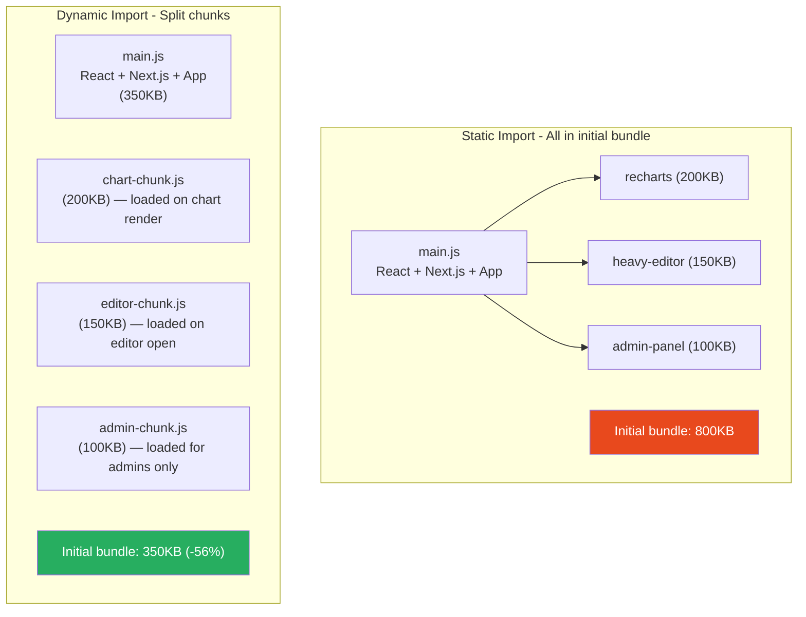
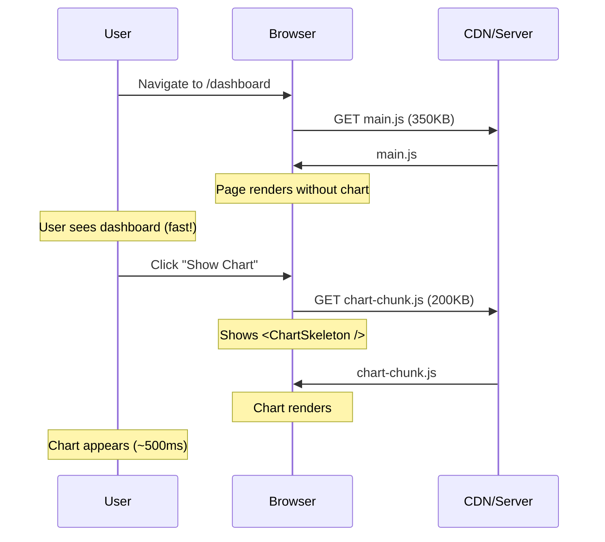

# 75 · Code Splitting & Lazy Loading

> **Code splitting is the practice of dividing a JavaScript bundle into smaller chunks that are loaded on demand rather than all at once. In a React/Next.js application, the default is that every import in every component ends up in the same JavaScript bundle — shipped to the browser on the first page load, even if 80% of it is needed only when the user navigates to a specific route or opens a specific modal. Code splitting reverses this default: only the code needed for the current route arrives immediately; everything else is fetched when it's actually needed. Lazy loading is the runtime mechanism that makes this work — dynamically importing modules only when they're about to be rendered.**

The motivation for code splitting is directly measurable: Time to Interactive (TTI) is bottlenecked by JavaScript download, parse, and execution time. A 2MB JavaScript bundle on a mobile device on a 3G connection takes 15-25 seconds to download and 5-10 seconds to parse. Splitting that into 10 route-level chunks of 200KB each, only loading the chunk for the current route, reduces first-load JavaScript to 200KB — the same user on the same device sees TTI in under 5 seconds instead of 25.

---

## Table of Contents

- [How Code Splitting Works in Webpack/Turbopack](#how-code-splitting-works-in-webpackturbopack)
- [Route-Level Code Splitting in Next.js](#route-level-code-splitting-in-nextjs)
- [React.lazy and Suspense](#reactlazy-and-suspense)
- [next/dynamic: Next.js's Lazy Loading API](#nextdynamic-nextjss-lazy-loading-api)
- [The Dynamic Import Function](#the-dynamic-import-function)
- [Component-Level Splitting Strategies](#component-level-splitting-strategies)
- [Library-Level Splitting](#library-level-splitting)
- [Named Exports and Dynamic Import](#named-exports-and-dynamic-import)
- [Preloading and Prefetching Chunks](#preloading-and-prefetching-chunks)
- [The Bundle Analyzer: Finding Split Opportunities](#the-bundle-analyzer-finding-split-opportunities)
- [Measuring Code Splitting Impact](#measuring-code-splitting-impact)
- [Common Code Splitting Patterns](#common-code-splitting-patterns)
- [Architecture Diagrams](#architecture-diagrams)
- [Good Practices](#good-practices)
- [Bad Practices](#bad-practices)
- [Mental Model](#mental-model)
- [Common Misconceptions](#common-misconceptions)
- [Exercises](#exercises)
- [Further Reading](#further-reading)

---

## How Code Splitting Works in Webpack/Turbopack

Both Webpack and Turbopack analyze your import graph to decide what goes into which chunk:

```
Static imports (always in the same chunk):
  import { Button } from './button';
  import { format } from 'date-fns';
  → These are resolved at BUILD TIME and included in the chunk
    that contains the importing module

Dynamic imports (create a new chunk boundary):
  const Chart = dynamic(() => import('./chart'));
  import('./heavy-module').then(mod => use(mod));
  → These are resolved at RUNTIME
  → The bundler creates a SEPARATE chunk for ./chart
  → That chunk is NOT included in the initial bundle
  → The browser downloads it only when the import() executes

CHUNK STRATEGY:
  Next.js App Router creates chunks:
    - Per page/route (automatic route-level splitting)
    - Per dynamic() / React.lazy() call (explicit component splitting)
    - Per large shared dependency (automatic vendor chunk splitting)
    - Shared code between routes gets its own "common" chunk
```

### What the output looks like

```
.next/static/chunks/
  main-abc123.js           ← React, Next.js runtime (always loaded)
  pages/_app-def456.js     ← App-level code
  pages/index-ghi789.js    ← Home page (loaded for /)
  pages/dashboard-jkl012.js ← Dashboard page (loaded for /dashboard only)
  chart-mno345.js          ← Chart component (loaded when chart renders)
  date-picker-pqr678.js    ← DatePicker (loaded when date picker opens)
```

---

## Route-Level Code Splitting in Next.js

Next.js performs automatic route-level code splitting:

```
In the App Router:
  Each page.tsx file in app/ is automatically a split point.
  The JavaScript for /dashboard/page.tsx is NOT loaded on /home.
  The JavaScript for /settings/page.tsx is NOT loaded until the
  user navigates to /settings.

  This is automatic — you get it for free with the App Router's
  file-system routing convention.

In the Pages Router:
  Each file in pages/ is a split point.
  Same automatic behavior.

What's included in EVERY route's bundle:
  - React + React DOM (unavoidable — the framework itself)
  - Next.js client runtime
  - Shared components used across multiple routes
    (these get their own "common chunks" via Webpack's optimization.splitChunks)

What's route-specific:
  - The page component itself
  - Components imported ONLY by that page
  - Libraries used ONLY by that page
```

---

## React.lazy and Suspense

React's built-in API for component-level lazy loading:

```tsx
import { lazy, Suspense } from "react";

// lazy() takes a function that returns a dynamic import
// The component is NOT loaded until it's first rendered
const HeavyChart = lazy(() => import("./heavy-chart"));
const RichTextEditor = lazy(() => import("./rich-text-editor"));

function Dashboard() {
  const [showChart, setShowChart] = useState(false);
  const [showEditor, setShowEditor] = useState(false);

  return (
    <div>
      <button onClick={() => setShowChart(true)}>Show Chart</button>
      <button onClick={() => setShowEditor(true)}>Open Editor</button>

      {/* Chart chunk loaded only when showChart becomes true */}
      {showChart && (
        <Suspense fallback={<ChartSkeleton />}>
          <HeavyChart data={chartData} />
        </Suspense>
      )}

      {/* Editor chunk loaded only when showEditor becomes true */}
      {showEditor && (
        <Suspense fallback={<EditorLoading />}>
          <RichTextEditor />
        </Suspense>
      )}
    </div>
  );
}
```

### How React.lazy works internally

```
1. lazy() returns a special React element type that stores:
   - The factory function (the () => import() call)
   - The current status: 'pending' | 'resolved' | 'rejected'
   - The resolved module (once loaded)

2. When React renders a lazy component for the first time:
   - Calls the factory function → initiates the dynamic import
   - Throws a Promise (signals Suspense to show fallback)
   - The Suspense boundary catches the thrown Promise
   - When the Promise resolves: Suspense re-renders with the real component

3. On subsequent renders (already loaded):
   - The resolved module is in the lazy object's cache
   - No dynamic import re-triggered
   - Renders synchronously (no Suspense activation)
```

---

## next/dynamic: Next.js's Lazy Loading API

`next/dynamic` is Next.js's enhanced version of `React.lazy`:

```tsx
import dynamic from "next/dynamic";

// Basic: same as React.lazy
const Chart = dynamic(() => import("./chart"));

// With loading state (Suspense fallback built-in):
const Chart = dynamic(() => import("./chart"), {
  loading: () => <ChartSkeleton />,
});

// No SSR (for browser-only libraries):
const MapWidget = dynamic(() => import("./map"), {
  ssr: false,
  loading: () => <div style={{ height: 400, background: "#eee" }} />,
});

// Named export (non-default export from the module):
const { BarChart } = dynamic(() =>
  import("recharts").then((mod) => ({ default: mod.BarChart })),
);
// Or:
const BarChart = dynamic(() => import("recharts").then((mod) => mod.BarChart));
```

### next/dynamic vs React.lazy differences

```
Feature                  React.lazy         next/dynamic
─────────────────────────────────────────────────────────
SSR support              Yes (basic)        Yes + ssr:false option
Loading state            Via Suspense       Built-in loading prop
Named exports            Manual             .then() helper
Server components        No                 No (client only)
Works without Suspense   No                 Yes (uses internal Suspense)
TypeScript types         Yes                Yes
```

---

## The Dynamic Import Function

The `import()` function is JavaScript's native mechanism for dynamic loading:

```tsx
// Synchronous (static) — bundled immediately, always in the chunk:
import { format } from "date-fns";

// Asynchronous (dynamic) — creates a split point, loaded on demand:
const { format } = await import("date-fns");

// In component code — import on demand:
async function handleExport() {
  // The date-fns chunk is only downloaded when Export is clicked
  const { format } = await import("date-fns");
  const formattedDate = format(new Date(), "yyyy-MM-dd");
  downloadFile(`report-${formattedDate}.csv`);
}

// Works with local modules too:
async function handleAdvancedFilter() {
  const { AdvancedFilter } = await import("./advanced-filter");
  setFilterComponent(<AdvancedFilter />);
}
```

### Dynamic import caching

```
Once a chunk is downloaded, it's cached in the browser:
  First import('./chart'): downloads chart-abc.js (network request)
  Second import('./chart'): returns immediately (from module cache)
  Third import('./chart'): returns immediately (still cached)

The cache persists for the duration of the browser tab session.
Hard refresh clears it.

This means: the FIRST render of a lazy component pays the download cost.
All subsequent renders (even after unmounting and remounting) are instant.
```

---

## Component-Level Splitting Strategies

### Strategy 1: Split on route-adjacent modals and drawers

```tsx
// The modal code is large (rich text editor, complex form)
// Don't ship it until the user opens the modal

const CreatePostModal = dynamic(() => import("./create-post-modal"), {
  loading: () => <ModalSkeleton />,
});

function BlogPage() {
  const [isModalOpen, setIsModalOpen] = useState(false);

  return (
    <>
      <PostList />
      <button onClick={() => setIsModalOpen(true)}>New Post</button>
      {isModalOpen && (
        <CreatePostModal
          onClose={() => setIsModalOpen(false)}
          onSave={handleSave}
        />
      )}
    </>
  );
}
// CreatePostModal + its imports (TipTap, image upload, validation)
// are only downloaded when the user clicks "New Post"
```

### Strategy 2: Split on user interaction triggers

```tsx
// Feature only used occasionally: don't ship code for it upfront

function ProductPage({ product }) {
  const [showComparison, setShowComparison] = useState(false);

  return (
    <div>
      <ProductDetails product={product} />
      <button onClick={() => setShowComparison(true)}>
        Compare with similar products
      </button>

      {/* ComparisonTable + its complex algorithm: loaded on click */}
      {showComparison && (
        <Suspense fallback={<ComparisonSkeleton />}>
          <ComparisonTable productId={product.id} />
        </Suspense>
      )}
    </div>
  );
}

const ComparisonTable = lazy(() => import("./comparison-table"));
```

### Strategy 3: Split on feature flags

```tsx
// Admin features only needed by admins — don't ship to regular users

async function DashboardPage() {
  const user = await getCurrentUser();

  // Dynamically import admin panel only for admins
  const AdminPanel = user.isAdmin
    ? dynamic(() => import("./admin-panel"))
    : null;

  return (
    <div>
      <MainDashboard />
      {AdminPanel && (
        <Suspense fallback={<AdminSkeleton />}>
          <AdminPanel />
        </Suspense>
      )}
    </div>
  );
}
```

---

## Library-Level Splitting

Large third-party libraries are often the biggest code-splitting wins:

```tsx
// ❌ Static import: entire Recharts library in initial bundle (~200KB)
import { LineChart, BarChart, PieChart, RadarChart } from "recharts";

function Dashboard() {
  return <LineChart data={data} />;
}

// ✅ Dynamic import: Recharts only loaded when chart renders
const Chart = dynamic(
  () => import("./charts/line-chart"), // thin wrapper around recharts
  { loading: () => <ChartSkeleton /> },
);

// charts/line-chart.tsx (this file is in its own chunk):
import { LineChart, ResponsiveContainer, XAxis, YAxis, Line } from "recharts";
export default function LineChartWrapper({ data }) {
  return (
    <ResponsiveContainer width="100%" height={300}>
      <LineChart data={data}>
        <XAxis dataKey="date" />
        <YAxis />
        <Line type="monotone" dataKey="value" />
      </LineChart>
    </ResponsiveContainer>
  );
}
```

### Common large libraries worth splitting

```
Library           Gzipped size    Split when used for:
─────────────────────────────────────────────────────────
recharts          ~95KB           Charts visible only on specific pages
chart.js          ~60KB           Same
moment            ~72KB           Date formatting in specific features
lodash (full)     ~24KB           Split; import specific functions instead
highlight.js      ~35KB           Code blocks (not on every page)
prismjs           ~8KB base       Code syntax highlighting
react-pdf         ~150KB+         PDF rendering (rare feature)
react-quill       ~50KB+          Rich text editing
mapbox-gl         ~250KB+         Maps (specific pages only)
leaflet           ~40KB           Maps (specific pages only)
d3 (full)         ~250KB+         Data visualization (specific pages)
```

---

## Named Exports and Dynamic Import

`React.lazy` only works with default exports. For named exports:

```tsx
// Module with named exports:
// chart-components.tsx
export function LineChart() { ... }
export function BarChart() { ... }
export function PieChart() { ... }

// ✅ Option 1: Re-export as default in a wrapper file
// line-chart-lazy.tsx
export { LineChart as default } from './chart-components';

// Then:
const LazyLineChart = lazy(() => import('./line-chart-lazy'));

// ✅ Option 2: Use .then() to extract the named export
const LazyLineChart = lazy(
  () => import('./chart-components').then(mod => ({ default: mod.LineChart }))
);

// ✅ Option 3: next/dynamic with .then()
const LineChart = dynamic(
  () => import('./chart-components').then(mod => mod.LineChart)
);
```

---

## Preloading and Prefetching Chunks

Don't wait until the user triggers an action to start downloading — prefetch when you can anticipate the need:

```tsx
// Prefetch a chunk when you predict the user will need it soon
function PreloadOnHover({ children, importFn }) {
  const prefetchRef = useRef(false);

  const handleMouseEnter = () => {
    if (!prefetchRef.current) {
      prefetchRef.current = true;
      // Start downloading the chunk immediately on hover
      importFn(); // the same () => import('./component') function
    }
  };

  return <div onMouseEnter={handleMouseEnter}>{children}</div>;
}

// Usage:
const heavyChartImport = () => import('./heavy-chart');
const HeavyChart = lazy(heavyChartImport);

function Dashboard() {
  const [showChart, setShowChart] = useState(false);

  return (
    <PreloadOnHover importFn={heavyChartImport}>
      <button onClick={() => setShowChart(true)}>Show Chart</button>
    </PreloadOnHover>
    {showChart && (
      <Suspense fallback={<Skeleton />}>
        <HeavyChart />
      </Suspense>
    )}
  );
}
// User hovers button → chunk starts downloading
// User clicks button → chunk already downloaded → instant render
```

### Next.js Link prefetching for route chunks

```tsx
// <Link> in Next.js prefetches the route chunk when it enters the viewport
// This applies to route-level code splitting automatically

<Link href="/dashboard">Dashboard</Link>
// When this Link scrolls into view:
// → Next.js fetches the /dashboard chunk in the background
// → When user clicks: chunk already loaded → instant navigation

// Control prefetching behavior:
<Link href="/dashboard" prefetch={false}>Dashboard</Link>  // disable
<Link href="/dashboard" prefetch={true}>Dashboard</Link>   // force (default for static)
```

---

## The Bundle Analyzer: Finding Split Opportunities

```bash
# Install:
npm install @next/bundle-analyzer

# Configure:
# next.config.js
const withBundleAnalyzer = require('@next/bundle-analyzer')({
  enabled: process.env.ANALYZE === 'true',
});

module.exports = withBundleAnalyzer({
  // your other next config
});

# Run:
ANALYZE=true next build
# Opens a treemap visualization in your browser
```

```
READING THE BUNDLE ANALYZER:
  Each rectangle = a module in the bundle
  Size = the module's contribution to the bundle (gzipped or parsed)
  Color = which chunk the module is in

  WHAT TO LOOK FOR:
  ✅ Route-specific code in a route-specific chunk: correct
  ❌ Large library in the MAIN bundle (loaded on every page):
     → should it be in a page-specific chunk?
     → should it be dynamically imported?
  ❌ The same library appearing in MULTIPLE chunks:
     → Webpack should be de-duplicating; check splitChunks config
  ❌ Very large modules in ANY bundle:
     → Can they be replaced with smaller alternatives?
     → Can they be tree-shaken more aggressively?
```

---

## Measuring Code Splitting Impact

```
BEFORE: time the initial page load

1. Open Chrome DevTools → Network tab
2. Clear cache (Shift+Ctrl+Delete or check "Disable cache")
3. Record while loading the target page
4. Note:
   - Total JS transferred (kB)
   - Number of JS files
   - Time to First Byte (TTFB)
   - Largest Contentful Paint (LCP)
   - Time to Interactive (TTI)

APPLY CODE SPLITTING

AFTER: repeat the measurement
  - Did total JS on first load decrease?
  - Did LCP improve?
  - Did TTI improve?
  - Are the lazily-loaded chunks downloaded when expected (not upfront)?

VERIFY LAZY LOADING IS WORKING:
  Network tab: lazy chunks should appear AFTER the initial page load,
  at the time the user triggers the feature that needs them.
  If the chunk appears in the initial page load: the import is static,
  not dynamic — the code splitting didn't work.
```

---

## Common Code Splitting Patterns

### Pattern 1: Route-level chart (loaded once per session)

```tsx
// App routes to /analytics → analytics chunk loads once
// Subsequent navigation to /analytics: already in module cache
const AnalyticsChart = dynamic(() => import("@/components/analytics/chart"), {
  loading: () => <ChartSkeleton />,
});
```

### Pattern 2: Conditional feature gate

```tsx
// Import A/B test variant only when in the test
const ExperimentalCheckout = dynamic(
  () => import("./checkout-v2"),
  { ssr: false }, // A/B variant doesn't need SSR
);

function CheckoutPage({ user }) {
  const isInExperiment = user.experimentGroups.includes("checkout-v2");

  return isInExperiment ? <ExperimentalCheckout /> : <StandardCheckout />;
}
```

### Pattern 3: Progressive enhancement

```tsx
// Core experience: static, fast, no JS required
// Enhanced experience: lazy-loaded when JS is available

const EnhancedVideoPlayer = dynamic(() => import("./enhanced-video-player"), {
  ssr: false,
  loading: () => (
    // The SSR fallback: a plain <video> element that works without JS
    <video src={src} controls className="video-player" />
  ),
});
```

### Pattern 4: Admin-only features in a shared layout

```tsx
// Regular users: admin features are never downloaded
// Admin users: admin features loaded when they visit admin routes

// app/(admin)/layout.tsx
export default function AdminLayout({ children }) {
  return (
    <div>
      <AdminSidebar /> {/* separate chunk, only in admin routes */}
      <main>{children}</main>
    </div>
  );
}
// AdminSidebar and its imports are only in the (admin) route group chunk
```

---

## Architecture Diagrams

### Static vs dynamic import bundle impact



### Lazy loading timeline



---

## Good Practices

### ✅ Good Practice — Split large libraries behind interaction boundaries

```tsx
/**
 * Good: A rich text editor (Tiptap + extensions ≈ 200KB) is split
 * behind the modal that contains it. 95% of users who view the
 * blog listing page never open the editor — they pay 0KB for it.
 * The 5% who do open it pay the download cost, but only then.
 *
 * The loading state matches the editor's final layout dimensions —
 * no layout shift when the editor loads.
 */
const RichEditor = dynamic(() => import("@/components/editor/rich-editor"), {
  loading: () => (
    <div
      className="editor-skeleton"
      style={{ height: 400, border: "1px solid #e2e8f0", borderRadius: 8 }}
      aria-label="Editor loading"
      role="img"
    />
  ),
  ssr: false, // Tiptap requires DOM — skip SSR
});

function BlogListPage() {
  const [editingPost, setEditingPost] = useState<Post | null>(null);

  return (
    <>
      <PostList onEdit={setEditingPost} />

      {editingPost && (
        <Modal onClose={() => setEditingPost(null)}>
          <RichEditor
            content={editingPost.content}
            onSave={async (content) => {
              await updatePost(editingPost.id, { content });
              setEditingPost(null);
            }}
          />
        </Modal>
      )}
    </>
  );
}
```

---

## Bad Practices

### ⚠️ Bad Practice — Dynamic importing everything, including tiny utilities

```tsx
/**
 * Bad: Applying dynamic import reflexively to every component,
 * including tiny ones that cost more in dynamic-import overhead
 * than their static size would add to the bundle.
 *
 * Dynamic imports add:
 *   - An extra network request per chunk (HTTP overhead)
 *   - A loading state that users see (visual interruption)
 *   - Complexity in the code (Suspense boundaries, loading states)
 *
 * For a 2KB component like a Button or Badge:
 *   Dynamic import HTTP overhead: 50-200ms (request + response)
 *   Static import bundle cost: 2KB (included in existing chunk)
 *   Net result: dynamic import is SLOWER and MORE complex
 */

// ❌ Dynamic importing trivially small components
const StatusBadge = dynamic(() => import("./status-badge")); // 1.5KB
const UserAvatar = dynamic(() => import("./user-avatar")); // 2KB
const Tooltip = dynamic(() => import("./tooltip")); // 3KB

// These add network requests and loading states for components
// that would take <0.5ms to parse if statically included

/**
 * ✅ Correct heuristic: dynamically import when the module is:
 *   - >20KB gzipped (substantial bundle contribution)
 *   - Used on < 50% of page views (not needed for most users)
 *   - Triggered by a specific user interaction (not immediately visible)
 *
 * StatusBadge, UserAvatar, Tooltip: always visible, tiny — static import.
 * RichTextEditor, PDFViewer, MapComponent: interaction-gated, large — dynamic.
 */
```

---

## Mental Model

> 💡 **The code splitting mental model:**
>
> Code splitting is like a **restaurant that only brings dishes when you order them**, rather than putting every dish on the menu on your table when you sit down. The static import approach (no splitting) delivers all 50 menu items to your table before you've even seen the menu — you're buried in food you didn't order and probably won't eat. Code splitting brings the main course (your current route) immediately, with the kitchen pre-staging the dishes you're most likely to order next (prefetching linked routes). When you specifically ask for dessert (clicking "Open Editor"), only then does the dessert arrive (the lazy chunk downloads). Dynamic importing is the waiter's instruction to the kitchen: "don't prepare this until the customer specifically asks." The loading skeleton is the empty plate on the table — it reserves space so nothing shifts when the food arrives.

---

## Common Misconceptions

### "Code splitting always makes apps faster"

Code splitting reduces INITIAL load bundle size, which improves initial load performance. But it adds latency when the split chunk is first needed (a network request). If a user immediately clicks a lazily-loaded feature on first load, they wait longer than if it had been statically included. Code splitting optimizes for the majority path (most users don't use every feature immediately) at a small cost to the minority path (users who immediately trigger a lazy feature).

### "next/dynamic and React.lazy are interchangeable"

They're very similar but differ in: `next/dynamic` supports `ssr: false` (React.lazy always SSRs), `next/dynamic` has a built-in `loading` prop (React.lazy needs explicit Suspense), and `next/dynamic` works in the Pages Router while React.lazy works in the App Router context.

### "Dynamic imports mean the code runs dynamically"

Dynamic import refers to LOADING the code dynamically (on demand), not how the code executes. Once the chunk is downloaded, the imported functions run normally — there's nothing "dynamic" about their execution.

### "You need to bundle-analyze to identify split opportunities"

Bundle analysis helps but isn't required. The most obvious split opportunities are components you KNOW are: (1) large (rich text editors, PDF viewers, maps, charts), (2) feature-gated (admin tools, power-user features), and (3) modal/drawer-based. Apply dynamic import to these first, measure the impact, then use bundle analysis for subtler opportunities.

### "Splitting vendor libraries into separate chunks is always better"

This was conventional wisdom in the HTTP/1.1 era (when each request was expensive). With HTTP/2, which multiplexes many requests over one connection, very granular splitting can create too many tiny requests. Modern Next.js's automatic chunk splitting algorithm is generally well-tuned — don't override it without measuring.

---

## Exercises

### Exercise 1 — Measure the bundle impact of a static library import

1. In a Next.js app, statically import `import * as Recharts from 'recharts'`
2. Build with `ANALYZE=true next build` and note the bundle size
3. Replace with a dynamic import of only the chart you need
4. Build + analyze again — how much did the initial bundle shrink?
5. Measure LCP before and after on Chrome Lighthouse

### Exercise 2 — Implement interaction-triggered lazy loading

Build a "Comments" section that:

1. Is not visible until the user scrolls to it (use IntersectionObserver)
2. When it becomes visible: starts loading the comment thread (dynamic import)
3. Shows a skeleton while loading
4. Renders the full thread when loaded

Verify: the comments chunk does NOT appear in the Network tab on initial page load.

### Exercise 3 — Prefetch a chunk on hover, render on click

Build a button that:

1. On hover: starts downloading the heavy feature chunk
2. On click: renders the heavy feature (should be instant since it was prefetched)
3. Verify with Network tab: chunk downloads on hover, no network activity on click

---

## Further Reading

- [Next.js docs: Lazy Loading](https://nextjs.org/docs/app/building-your-application/optimizing/lazy-loading) — official guide
- [React Docs: React.lazy](https://react.dev/reference/react/lazy) — API reference
- [webpack docs: Code Splitting](https://webpack.js.org/guides/code-splitting/) — the underlying mechanism
- [@next/bundle-analyzer](https://www.npmjs.com/package/@next/bundle-analyzer) — bundle visualization
- [web.dev: Code Splitting with dynamic imports](https://web.dev/articles/code-splitting-suspense) — patterns guide
- Related in this handbook: [54 · Client-Side Rendering Boundaries](../nextjs-rendering/05-client-side-rendering.md)
- Next in this handbook: [76 · Bundle Optimization](./05-bundle-optimization.md)

---

_Part of the [React + Next.js Engineering Handbook](../../README.md)_
