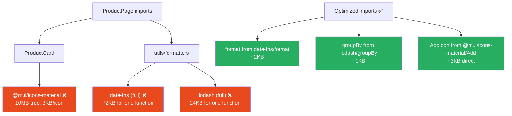
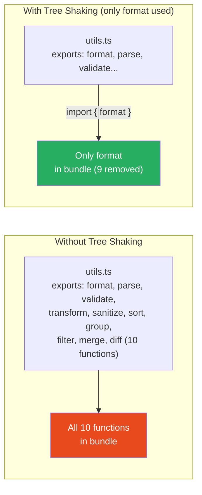

# 76 · Bundle Optimization

> **Bundle optimization is the discipline of reducing the amount of JavaScript sent to the browser — not by removing features, but by being precise about what code is actually needed. Every kilobyte of JavaScript has a cost beyond download: it must be parsed by the browser's JavaScript engine, compiled to machine code, and executed before the page becomes interactive. A 500KB bundle on a mid-range Android device takes 3-5 seconds to process. A 100KB bundle takes under a second. The difference is Time to Interactive. Bundle optimization is about earning back those seconds.**

The JavaScript bundle is the sum of every import in your application. Imports compound: importing a component that imports a utility that imports a date library that imports a locale file. Each of these links in the chain contributes to the final bundle size. Bundle optimization is the practice of auditing this import graph, identifying unexpected contributors, and eliminating or shrinking them through better import patterns, tree shaking, and strategic dependency choices.

---

## Table of Contents

- [The True Cost of JavaScript](#the-true-cost-of-javascript)
- [How Tree Shaking Works](#how-tree-shaking-works)
- [Import Patterns That Break Tree Shaking](#import-patterns-that-break-tree-shaking)
- [Analyzing Your Bundle](#analyzing-your-bundle)
- [The Usual Suspects: Large Dependencies](#the-usual-suspects-large-dependencies)
- [Replacing Heavy Libraries with Lighter Alternatives](#replacing-heavy-libraries-with-lighter-alternatives)
- [Polyfill Strategy in Next.js](#polyfill-strategy-in-nextjs)
- [Third-Party Script Optimization](#third-party-script-optimization)
- [Image and Font Impact on Bundle](#image-and-font-impact-on-bundle)
- [Webpack Optimization Configuration](#webpack-optimization-configuration)
- [Monitoring Bundle Size Over Time](#monitoring-bundle-size-over-time)
- [Architecture Diagrams](#architecture-diagrams)
- [Good Practices](#good-practices)
- [Bad Practices](#bad-practices)
- [Mental Model](#mental-model)
- [Common Misconceptions](#common-misconceptions)
- [Exercises](#exercises)
- [Further Reading](#further-reading)

---

## The True Cost of JavaScript

JavaScript is the most expensive resource type on the web — not because of download size alone, but because of what the browser must do after downloading:

```
For 1MB of JavaScript (gzipped):
  1. Download: ~1.2MB transferred (varies by gzip ratio)
     → Fast 4G: ~0.4 seconds
     → Average 4G: ~1.5 seconds
     → Slow 3G: ~5 seconds

  2. Decompress: ~50ms

  3. Parse (tokenize + build AST): ~500ms
     → Runs on a single thread
     → Blocks any other JS execution during this time

  4. Compile (JIT compilation to bytecode): ~300-500ms

  5. Execute (run the module code): ~100-300ms

Total processing time for 1MB JS on mid-range Android: ~2-4 SECONDS
(and this is PER PAGE LOAD — cached JS is re-parsed from disk)

Compare to 1MB of images:
  Download: same
  Processing: near-zero (GPU-decoded, not CPU-intensive)

JavaScript is special: its size costs BOTH bandwidth AND CPU time.
```

### The processing cost by device

```
Same 1MB bundle, different devices:
  MacBook Pro M2:          ~100ms to parse
  iPhone 14 Pro:           ~150ms to parse
  Mid-range Android 2023:  ~500ms to parse
  Budget Android 2022:     ~1500ms to parse
  Budget Android 2020:     ~3000ms to parse

The performance gap between high-end and low-end devices
is 10-30x for JavaScript processing. A bundle that feels
fast on a developer's MacBook is broken on a budget Android.
Size budgets must be set for your WORST case device, not your dev machine.
```

---

## How Tree Shaking Works

Tree shaking is the process of eliminating dead code — exports that are imported nowhere in the application:

```
Tree shaking requirements:
  1. ES modules (import/export syntax), not CommonJS (require/module.exports)
  2. "Side-effect free" modules (declared in package.json: "sideEffects": false)
  3. The bundler (Webpack/Turbopack) must be in production mode

How it works:
  1. Bundler builds the complete import graph: who imports what
  2. Starting from entry points (page.tsx files), traverses imports
  3. For each imported module: which NAMED EXPORTS are actually used?
  4. Any export that's never imported anywhere: REMOVED from output

Example:
  // utils.ts — exports 10 functions
  export function formatDate() { ... }      // used: YES
  export function parseDate() { ... }       // used: YES
  export function transformData() { ... }   // used: NO
  export function validateEmail() { ... }   // used: NO
  // ... 6 more unused functions

  Tree shaking result: only formatDate and parseDate in the bundle.
  The other 8 functions: eliminated entirely.
```

### What "side effects" means for tree shaking

```
A module has SIDE EFFECTS if importing it (even without using any exports)
changes program behavior:
  - Modifying globals: window.MyLib = { ... }
  - Polyfilling: Array.prototype.includes = function() { ... }
  - Registering event listeners
  - Starting timers or intervals
  - Anything that runs at module evaluation time

package.json declaration:
  "sideEffects": false
  → "Every export in this package is pure — tree shake aggressively"

  "sideEffects": ["./src/polyfills.js", "*.css"]
  → "These specific files have side effects; tree shake everything else"
  → CSS is ALWAYS listed here (importing CSS is a side effect)

Without "sideEffects": false:
  Bundler is conservative — imports the WHOLE module even if you only
  use one export (can't safely remove code that might have side effects)
```

---

## Import Patterns That Break Tree Shaking

### Pattern 1: Barrel file imports

```tsx
// ❌ Importing from a barrel file (index.ts that re-exports everything)
import { Button, Input, Select, Modal, Tooltip } from "@/components";
// @/components/index.ts re-exports ALL components
// Tree shaker must include ALL of index.ts (or all components)
// because barrel files often have side effects or complex re-export patterns

// ✅ Direct imports — tree shaker knows exactly what's needed
import { Button } from "@/components/button";
import { Input } from "@/components/input";
// Only button.tsx and input.tsx end up in the bundle
```

```
BARREL FILES AND TREE SHAKING:
  Barrel files work fine when:
    - The package properly declares "sideEffects": false
    - All re-exports are pure named exports
    - The bundler's tree shaking implementation handles it

  Barrel files break tree shaking when:
    - The barrel has any side effects (CSS imports, registrations)
    - The package hasn't declared sideEffects
    - Using CommonJS require() anywhere in the chain

  NEXT.JS OPTIMIZATION:
    Next.js 13+ has automatic barrel file optimization.
    Configure in next.config.js:
    experimental: { optimizePackageImports: ['@mui/icons-material', 'lodash'] }
    → Next.js automatically uses direct imports even when you write barrel imports
```

### Pattern 2: Full library imports

```tsx
// ❌ Imports the ENTIRE lodash library (~24KB gzipped)
import _ from "lodash";
const result = _.groupBy(items, "category");

// ✅ Import only what you use (~2KB for this function only)
import groupBy from "lodash/groupBy";
const result = groupBy(items, "category");

// ✅ Even better: use native alternatives when available
const result = Object.groupBy(items, (item) => item.category); // ES2024 native
```

### Pattern 3: CommonJS modules (can't be tree-shaken)

```tsx
// ❌ CommonJS: bundler can't determine what's used at build time
const { format, parseISO } = require("date-fns");
// Entire date-fns is included because require() is dynamic

// ✅ ESM: bundler can statically analyze and tree-shake
import { format, parseISO } from "date-fns";
// Only format and parseISO end up in the bundle
```

### Pattern 4: Importing from a package that ships CommonJS only

```tsx
// Some packages only ship CommonJS and can't be tree-shaken:
import moment from "moment";
// moment.js: always ~67KB gzipped regardless of what you use
// because it's CommonJS and has side effects

// Solution: replace with an ESM-native, tree-shakeable alternative
import { format, parseISO } from "date-fns"; // ~2-5KB for just these functions
import dayjs from "dayjs"; // ~2KB (designed to be small)
```

---

## Analyzing Your Bundle

### The Next.js bundle analyzer

```bash
# Setup:
npm install @next/bundle-analyzer

# next.config.js:
const withBundleAnalyzer = require('@next/bundle-analyzer')({
  enabled: process.env.ANALYZE === 'true',
});
module.exports = withBundleAnalyzer({ /* your config */ });

# Run analysis:
ANALYZE=true next build
# Opens two browser tabs:
#   client.html — what ships to the browser
#   server.html — what runs on the server (useful for checking RSC)
```

### Reading the treemap

```
TREEMAP READING GUIDE:

Each rectangle = a module/file
Size = parsed (uncompressed) size contribution
Hover = shows the exact module path and sizes

WHAT TO FLAG FOR OPTIMIZATION:
  □ Any single module > 50KB: can it be split or replaced?
  □ A library appearing in the MAIN (shared) chunk that's only
    used on one specific route: should be route-specific
  □ Multiple copies of the same library: de-duplication issue
  □ Known-large libraries (moment, lodash, chart.js) in client bundle:
    can they be replaced or moved server-side?
  □ Development-only code in production bundle: check for
    process.env.NODE_ENV !== 'production' guards
```

### The bundlesize tool for CI enforcement

```bash
# Install:
npm install bundlesize --save-dev

# package.json configuration:
{
  "bundlesize": [
    {
      "path": "./.next/static/chunks/main-*.js",
      "maxSize": "100 kB"
    },
    {
      "path": "./.next/static/chunks/pages/**/*.js",
      "maxSize": "50 kB"
    }
  ],
  "scripts": {
    "size": "bundlesize"
  }
}

# Add to CI:
next build && npm run size
# Fails the build if any chunk exceeds the configured limit
```

---

## The Usual Suspects: Large Dependencies

Libraries most likely to appear unexpectedly large in your bundle:

```
MOMENT.JS (~67KB gzipped):
  All locales included by default (~50KB of locale data alone)
  Not tree-shakeable (CommonJS, side effects)
  Fix: replace with date-fns or dayjs, or use Intl APIs

LODASH (24KB full, or ~2-5KB per function):
  Full import: never do import _ from 'lodash'
  Per-function import: import groupBy from 'lodash/groupBy'
  Or: use lodash-es (ESM version, fully tree-shakeable)
  Or: use native alternatives (Object.groupBy, Array.flatMap, etc.)

CHART LIBRARIES (varies, typically 60-250KB):
  Recharts: ~95KB, tree-shakeable but large
  Chart.js: ~60KB, tree-shakeable
  D3: ~250KB full, but highly tree-shakeable
  Fix: code-split (dynamic import) + import only needed chart types

MATERIAL UI / ANTD (~100-300KB):
  Tree-shakeable in v5+, but icons library is massive
  @mui/icons-material: 10MB total (3KB per icon)
  Fix: import icons directly (not from barrel)
  import AddIcon from '@mui/icons-material/Add' (not from the barrel)
  Use Next.js's optimizePackageImports for automatic optimization

FIREBASE SDK (~150-400KB depending on services used):
  Only import the specific services you need:
  import { getAuth } from 'firebase/auth'; // not from 'firebase'
  import { getFirestore } from 'firebase/firestore'; // not from 'firebase'

REACT-ICONS:
  Each icon set is large; only import specific icons:
  import { FiUser } from 'react-icons/fi'; // ✅ direct
  import * as FiIcons from 'react-icons/fi'; // ❌ entire set
```

---

## Replacing Heavy Libraries with Lighter Alternatives

```
TASK: Date formatting
  HEAVY: moment.js (67KB) → has all locales
  LIGHTER: date-fns (2-5KB per function) → tree-shakeable
  LIGHTEST: Intl.DateTimeFormat (0KB — built into browser)
  Recommendation: date-fns or Intl API

TASK: Utility functions (groupBy, debounce, throttle, etc.)
  HEAVY: lodash full import (24KB)
  LIGHTER: lodash-es with direct imports (2-5KB per function)
  LIGHTEST: native implementations (increasingly available in ES2020-2024)
  Recommendation: write your own debounce/throttle (10 lines),
                 use lodash for complex utilities only

TASK: UUID generation
  HEAVY: uuid package (~8KB) — usually overkill
  LIGHTER: crypto.randomUUID() — 0KB, built into all modern browsers
  Recommendation: crypto.randomUUID() for client, uuidv4 for legacy

TASK: Deep cloning
  HEAVY: lodash.cloneDeep (some KB)
  LIGHTER: structuredClone() — 0KB, built-in in modern browsers (2022+)
  Recommendation: structuredClone() for most cases

TASK: HTTP requests in browser
  HEAVY: axios (13KB)
  LIGHTER: fetch (0KB — built-in)
  Recommendation: fetch + a thin wrapper for error handling

TASK: Form validation
  HEAVY: yup (30KB) — mature but large
  LIGHTER: zod (10KB) — TypeScript-first, recommended
  LIGHTEST: native HTML5 validation — 0KB for simple cases
  Recommendation: zod for complex validation

TASK: Animation
  HEAVY: Framer Motion (100KB) — full-featured
  LIGHTER: CSS animations (0KB for simple cases)
  LIGHTER: Motion (rebranded Framer Motion, better tree-shaking)
  Lighter: @react-spring/web (~25KB) — spring physics
  Recommendation: CSS animations first, then Motion for complex sequences
```

---

## Polyfill Strategy in Next.js

Polyfills add modern JavaScript features to older browsers — but can add significant bundle size if not managed carefully:

```
NEXT.JS DEFAULT POLYFILLS:
  Next.js automatically adds polyfills for widely-needed APIs:
  - fetch, URL, URLSearchParams, Object.assign, etc.
  - Based on your configured browser targets

BROWSERSLIST CONFIGURATION:
  Add to package.json to tell Next.js (and Babel/SWC) what browsers
  to support (affects polyfill inclusion):

  "browserslist": [
    ">0.3%",
    "not dead",
    "not op_mini all"
  ]

  More conservative (support more browsers) → more polyfills → larger bundle
  More aggressive (drop old browsers) → fewer polyfills → smaller bundle

AVOID POLYFILLING WHAT'S ALREADY AVAILABLE:
  // ❌ polyfill-ing Array.prototype.flat (supported everywhere)
  import 'core-js/proposals/array-flat-map';

  // ✅ Just use it — it's in >99% of browsers
  const flat = nestedArray.flat();

SPECIFIC POLYFILL AUDIT:
  Run with NEXT_TELEMETRY_DISABLED=1 ANALYZE=true next build
  Look for: core-js, polyfill.io, whatwg-fetch in the bundle
  Each should be questioned: is this actually needed for your target browsers?
```

---

## Third-Party Script Optimization

Third-party scripts (analytics, chat widgets, A/B testing) are often loaded inefficiently, blocking page rendering and inflating effective bundle size:

```tsx
// ❌ Regular <script>: blocks rendering (if in <head>), or loads immediately
<script src="https://analytics.example.com/tracker.js" />

// ✅ next/Script with strategy: 'afterInteractive'
// Loads after page is interactive — doesn't block LCP or TTI
import Script from 'next/script';

<Script
  src="https://analytics.example.com/tracker.js"
  strategy="afterInteractive"
/>

// ✅ strategy: 'lazyOnload' — loads during browser idle time
// For non-critical scripts (chat widgets, marketing pixels)
<Script
  src="https://chat.example.com/widget.js"
  strategy="lazyOnload"
/>

// ✅ strategy: 'worker' — offloads to Web Worker (experimental)
// For heavy scripts that don't need DOM access
<Script
  src="https://heavy-lib.example.com/processing.js"
  strategy="worker"
/>
```

```
STRATEGY GUIDE:
  'beforeInteractive': loads before hydration — only for critical scripts
  'afterInteractive': loads after hydration — for analytics, tag managers
  'lazyOnload': loads during idle time — for chat, marketing, low-priority
  'worker': offloads to web worker — for CPU-intensive third-party scripts

DEFAULT BEHAVIOR WITHOUT next/Script:
  Scripts in <head>: render-blocking (delay FCP, LCP)
  Scripts at end of <body>: parser-blocking

  next/Script handles deferred execution automatically.
```

---

## Image and Font Impact on Bundle

Images and fonts imported directly into JavaScript have different effects than you might expect:

```tsx
// Images imported as modules:
import heroImage from "./hero.jpg";
// heroImage = { src: '/_next/static/media/hero.abc123.jpg', width: 1200, height: 600 }
// The actual image bytes are NOT in the JS bundle
// Only metadata (URL, dimensions) is included in the JS bundle
// The image loads via a separate HTTP request when rendered
// ✅ This is correct — no bundle optimization needed here

// Images imported as base64 (via webpack data URL):
// If configured, small images can be inlined as base64:
// url-loader or next.config.js asset size threshold
// These DO add to the bundle size
// Keep this threshold LOW (8-16KB max) to avoid bundle bloat

// next/font vs @font-face:
// next/font: 0KB in bundle (generates inline CSS, fonts loaded via HTTP)
// Manual @font-face: 0KB in bundle (same mechanism)
// Font files themselves are NEVER in the JS bundle
// They're separate HTTP resources loaded by CSS
// ✅ Font optimization is about eliminating render-blocking, not bundle size
```

---

## Webpack Optimization Configuration

```js
// next.config.js — fine-tuned bundle optimization

/** @type {import('next').NextConfig} */
module.exports = {
  // Experimental: automatic barrel file optimization
  // Converts barrel imports to direct imports for these packages:
  experimental: {
    optimizePackageImports: [
      "@mui/material",
      "@mui/icons-material",
      "lucide-react",
      "@heroicons/react",
    ],
  },

  // Custom webpack for additional optimizations:
  webpack(config, { dev, isServer }) {
    // Production-only optimizations:
    if (!dev && !isServer) {
      // Use smaller, tree-shakeable version of lodash:
      config.resolve.alias["lodash"] = "lodash-es";

      // Replace moment with dayjs (much smaller):
      // (if you're stuck with a dependency that uses moment internally)
      config.plugins.push(
        new webpack.NormalModuleReplacementPlugin(
          /moment$/,
          require.resolve("dayjs"),
        ),
      );
    }

    return config;
  },
};
```

---

## Monitoring Bundle Size Over Time

Bundle size regressions happen gradually — one dependency added here, one large import there. Monitoring prevents drift:

```yaml
# .github/workflows/bundle-size.yml — GitHub Actions integration

name: Bundle Size Check
on: [pull_request]

jobs:
  bundle-size:
    runs-on: ubuntu-latest
    steps:
      - uses: actions/checkout@v4
      - uses: actions/setup-node@v4
      - run: npm ci
      - run: npm run build

      # Compare with main branch:
      - uses: preactjs/compressed-size-action@v2
        with:
          repo-token: ${{ secrets.GITHUB_TOKEN }}
          pattern: ".next/static/**/*.js"
          exclude: "{.next/static/chunks/app/page-*.js}"
```

```
METRIC THRESHOLDS TO ENFORCE:
  Main chunk (always loaded):     < 100KB gzipped
  Per-route chunk (page-specific): < 50KB gzipped
  Total first load JS:            < 200KB gzipped for most pages
                                  < 100KB gzipped for landing pages

  These are guidelines — adjust based on your product's user base
  and the devices your analytics show they use.
```

---

## Architecture Diagrams

### Import chain leading to bundle bloat



### Tree shaking effect on bundle



---

## Good Practices

### ✅ Good Practice — Replacing heavy dependencies and enforcing bundle budgets

```js
/**
 * Good: A complete bundle optimization setup that:
 * 1. Replaces lodash with lodash-es for tree shaking
 * 2. Enables automatic barrel file optimization
 * 3. Enforces bundle size limits in CI
 * 4. Uses bundlesize for PR-level enforcement
 */

// next.config.js
const withBundleAnalyzer = require("@next/bundle-analyzer")({
  enabled: process.env.ANALYZE === "true",
});

/** @type {import('next').NextConfig} */
const config = {
  experimental: {
    // Automatic barrel import optimization for common icon libraries
    optimizePackageImports: [
      "lucide-react",
      "@heroicons/react",
      "@mui/icons-material",
      "react-icons",
    ],
  },

  webpack(webpackConfig, { dev, isServer }) {
    if (!dev && !isServer) {
      // Alias lodash to its ESM version for better tree-shaking
      webpackConfig.resolve.alias["lodash"] = "lodash-es";
    }
    return webpackConfig;
  },
};

module.exports = withBundleAnalyzer(config);
```

```json
// package.json — bundle size enforcement
{
  "bundlesize": [
    {
      "path": "./.next/static/chunks/main-*.js",
      "maxSize": "80 kB",
      "compression": "gzip"
    },
    {
      "path": "./.next/static/chunks/framework-*.js",
      "maxSize": "50 kB",
      "compression": "gzip"
    }
  ],
  "scripts": {
    "analyze": "ANALYZE=true next build",
    "size": "next build && bundlesize"
  }
}
```

---

## Bad Practices

### ⚠️ Bad Practice — Importing entire libraries for one or two functions

```tsx
/**
 * Bad: Importing complete libraries when only specific utilities
 * are needed. These are the three most common offenders found
 * in production Next.js bundles.
 *
 * Combined, these three add ~163KB gzipped to every page load.
 */

// ❌ Bad: entire lodash for one function
import _ from "lodash";
const grouped = _.groupBy(orders, "status");

// ❌ Bad: entire moment for one format
import moment from "moment";
const date = moment(timestamp).format("MMM D, YYYY");

// ❌ Bad: entire icon set barrel import
import { User, Settings, Bell, Search } from "@mui/icons-material";

/**
 * ✅ Fix 1: specific lodash function import (or native)
 */
// Option A: specific lodash import
import groupBy from "lodash/groupBy";

// Option B: native (ES2024)
const grouped = Object.groupBy(orders, (order) => order.status);

/**
 * ✅ Fix 2: date-fns specific function (or Intl)
 */
// Option A: date-fns
import { format } from "date-fns";
const date = format(new Date(timestamp), "MMM d, yyyy");

// Option B: Intl API (zero bundle cost)
const date = new Intl.DateTimeFormat("en-US", {
  month: "short",
  day: "numeric",
  year: "numeric",
}).format(new Date(timestamp));

/**
 * ✅ Fix 3: direct icon imports
 */
import UserIcon from "@mui/icons-material/Person";
import SettingsIcon from "@mui/icons-material/Settings";
import BellIcon from "@mui/icons-material/Notifications";
import SearchIcon from "@mui/icons-material/Search";
// Or use lucide-react which is fully tree-shakeable from the barrel:
import { User, Settings, Bell, Search } from "lucide-react"; // ✅ tree-shakes correctly
```

**Measured impact:** An e-commerce platform's product listing page had a 340KB gzipped initial JS bundle. Bundle analysis revealed: moment.js (67KB), full lodash import (24KB), all recharts components (95KB for one bar chart). After replacing moment with date-fns/format, lodash with a direct import, and recharts with a dynamically imported wrapper: 127KB — a 63% reduction. TTI on a mid-range Android phone improved from 8.2s to 3.1s.

---

## Mental Model

> 💡 **The bundle optimization mental model:**
>
> Your JavaScript bundle is like a **shipping container packed for moving house**. Without discipline, you pack every book, every piece of furniture, every appliance — including things you haven't used in years, things that belong to a neighbor, and things that duplicate what's already at the destination. Bundle optimization is the disciplined audit of what actually goes into the container: every item earns its place by being actually needed, in the smallest version that does the job. The bundle analyzer is the manifest of everything in the container. Tree shaking is the automatic removal of items that nobody opened during the trip. Import discipline is deciding at packing time: "do I need the entire cookware collection, or just one pan?" CI bundle limits are the weight limit on the container — when something pushes it over, you must remove something else before it ships.

---

## Common Misconceptions

### "Smaller libraries are always better"

A smaller library that's missing features you need leads to custom code that's often larger and less tested. The right question is "is this library's size justified by what it provides?" — not "is there something smaller?" Zod at 10KB is right-sized for what it does. A hand-written deep equality function that's 2KB but buggy and not tree-shakeable is worse.

### "Tree shaking eliminates all unused code"

Tree shaking removes unused EXPORTS from ES modules with no side effects. It cannot remove: dead code within a function body (that's minification/dead code elimination), code in CommonJS modules, code in modules with side effects, and code that's referenced dynamically (computed property access). It's a powerful tool but not a complete solution.

### "The bundle analyzer shows the final gzipped size"

By default, bundle analyzers show PARSED (uncompressed) size — the size of the code after decompression, which is what the JavaScript engine processes. Gzipped size (what's transferred over the network) is smaller but both matter: gzip affects download time, parsed size affects parse/compile time.

### "Adding 'sideEffects': false to package.json is always safe"

It's safe only if the package genuinely has no side effects — no global mutations, no implicit polyfills, no CSS that auto-applies. Adding this declaration to a package with actual side effects will cause those effects to be dropped, breaking functionality in subtle ways.

### "Removing unused imports automatically improves performance"

Removing an unused import reduces bundle size only if that import isn't imported elsewhere. If 5 other files also import the same module, removing it from one file has no bundle impact — the module is still included due to the other imports. Bundle analysis shows the actual impact; ESLint's no-unused-imports rule catches hygiene issues but doesn't guarantee bundle reduction.

---

## Exercises

### Exercise 1 — Bundle analyze and identify top 5 opportunities

1. Run `ANALYZE=true next build` on your project
2. In the treemap, identify the 5 largest modules in the client bundle
3. For each: is it in the right chunk (route-specific vs shared)?
4. For each: is there a smaller alternative, a tree-shaking issue, or a code-splitting opportunity?
5. Implement one improvement, measure the before/after bundle size

### Exercise 2 — Replace moment with date-fns

In a project using moment.js:

1. Find all moment usages (`grep -r "moment(" src/`)
2. Replace each with the equivalent date-fns function
3. Uninstall moment, install date-fns
4. Compare bundle sizes before/after

### Exercise 3 — Set up CI bundle size enforcement

1. Add `bundlesize` to a project
2. Configure limits for the main chunk and per-route chunks
3. Create a GitHub Action that runs `bundlesize` on every PR
4. Intentionally add a large import to verify the CI check fails
5. Remove it and verify the check passes

---

## Further Reading

- [webpack docs: Tree Shaking](https://webpack.js.org/guides/tree-shaking/) — how it works mechanically
- [web.dev: Reduce JavaScript payloads with tree shaking](https://web.dev/articles/reduce-javascript-payloads-with-tree-shaking) — practical guide
- [@next/bundle-analyzer](https://www.npmjs.com/package/@next/bundle-analyzer) — bundle visualization for Next.js
- [Bundlephobia](https://bundlephobia.com/) — check library sizes before installing
- [You Might Not Need Lodash](https://youmightnotneed.com/lodash) — native alternatives reference
- [Next.js: optimizePackageImports](https://nextjs.org/docs/app/api-reference/config/next-config-js/optimizePackageImports) — automatic barrel optimization
- Next in this handbook: [77 · Large List Rendering](./06-large-lists.md)

---

_Part of the [React + Next.js Engineering Handbook](../../README.md)_
