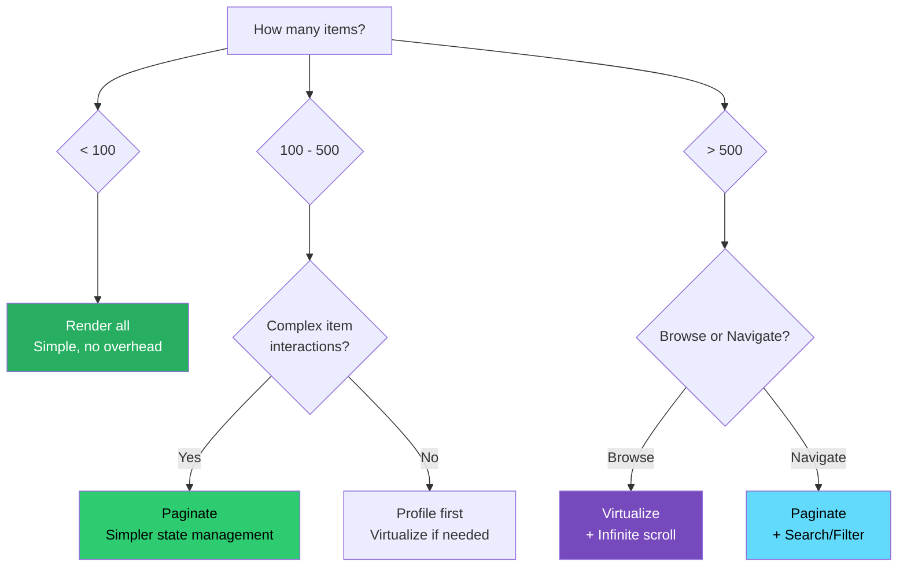
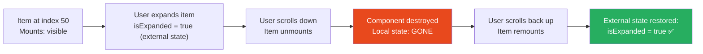

# 77 · Large List Rendering

> **Large list rendering is one of the most frequent performance problems in production React applications — not because virtualization isn't covered (it is, in doc 74), but because the decision to virtualize is only the starting point. The harder questions are: when should you paginate instead of scroll? How do you handle lists with variable-height items that also contain interactive sub-components? What happens to accessibility when you virtualize? How do you keep filter, sort, and selection state consistent across a windowed list? This document addresses the architecture of large list rendering at production scale — the patterns that emerge when a simple "render 10,000 rows" problem meets real product requirements.**

The gap between "I've implemented react-virtual" and "this list is production-ready" is often substantial. Real lists have: items that can be expanded to variable heights, checkboxes that select items across scroll position, drag-and-drop reordering, inline editing, sticky headers, and grouped sections. Each requirement interacts with the windowing mechanism in specific ways. This document is the engineering guide for navigating those interactions.

---

## Table of Contents

- [The Rendering Strategy Decision Tree](#the-rendering-strategy-decision-tree)
- [Pagination vs Infinite Scroll vs Virtualization](#pagination-vs-infinite-scroll-vs-virtualization)
- [Stable Keys and List Identity](#stable-keys-and-list-identity)
- [Handling Item State Across Scroll](#handling-item-state-across-scroll)
- [Expandable Items and Variable Heights](#expandable-items-and-variable-heights)
- [Selection in Large Lists](#selection-in-large-lists)
- [Grouped Lists and Section Headers](#grouped-lists-and-section-headers)
- [Sticky Headers in Virtualized Lists](#sticky-headers-in-virtualized-lists)
- [Filtering and Sorting Without Re-mounting](#filtering-and-sorting-without-re-mounting)
- [Drag-and-Drop in Virtualized Lists](#drag-and-drop-in-virtualized-lists)
- [Accessibility in Virtualized Lists](#accessibility-in-virtualized-lists)
- [Server-Rendered Lists vs Client-Rendered](#server-rendered-lists-vs-client-rendered)
- [Performance Profiling Large Lists](#performance-profiling-large-lists)
- [Architecture Diagrams](#architecture-diagrams)
- [Good Practices](#good-practices)
- [Bad Practices](#bad-practices)
- [Mental Model](#mental-model)
- [Common Misconceptions](#common-misconceptions)
- [Exercises](#exercises)
- [Further Reading](#further-reading)

---

## The Rendering Strategy Decision Tree

```
Item count: < 100
  → Render all. No special treatment needed.
  → Optionally: add memoization if items are expensive to render.

Item count: 100-500
  → Render all with React.memo + stable keys.
  → Profile first: does initial render actually cause a problem?
  → If initial render < 500ms and scroll is smooth: no further action.

Item count: 500-5000
  → Consider virtualization (react-virtual, react-window).
  → Consider pagination (simpler, more compatible, SEO-friendly).
  → Decision factor: is the user expected to BROWSE (scroll through)
    or NAVIGATE (jump to specific items)?
    Browse → virtualize
    Navigate → paginate + search/filter

Item count: > 5000
  → Virtualization is almost certainly required.
  → Also consider: is all this data actually needed at once?
    Can the API be paginated server-side so less data is loaded?
  → If items have complex interactive state (inline editing, expansion):
    consider whether the product design needs to be revised

Items have complex interactions (selection, drag-drop, inline edit):
  → Virtualization adds significant complexity for these cases.
  → Weigh virtualization benefit vs implementation complexity.
  → For complex interactions: prefer pagination or smaller data sets.
```

---

## Pagination vs Infinite Scroll vs Virtualization

Each strategy has distinct tradeoffs that must be matched to product requirements:

```
PAGINATION:
  How it works: show N items per page; user clicks to go to next page
  Browser: page reload or client-side navigation between pages

  Pros:
    ✅ Deterministic: user always knows where they are (page 3 of 47)
    ✅ Shareable: /products?page=3 links to exactly this view
    ✅ SEO-friendly: each page is a crawlable URL
    ✅ Simple implementation: no special libraries
    ✅ Works with Ctrl+F, print, accessibility tools
    ✅ Browser back button works naturally

  Cons:
    ❌ Context lost on page change (user must re-find their place)
    ❌ Feels "clunky" for browse-mode experiences
    ❌ Doesn't suit real-time or frequently-updating lists

INFINITE SCROLL:
  How it works: as user scrolls to bottom, next batch of items loads

  Pros:
    ✅ Low friction: no explicit click to see more
    ✅ Suits browse/discovery patterns (social feed, image gallery)
    ✅ Feels "native" on mobile

  Cons:
    ❌ "Lost in the feed": no way to know how far through the list you are
    ❌ Back button: loses scroll position in many implementations
    ❌ Footer inaccessible: footer can't be reached until list is exhausted
    ❌ Memory grows: DOM accumulates unless combined with virtualization
    ❌ Not SEO-friendly without server rendering every batch

VIRTUALIZATION:
  How it works: only visible items in the DOM; others are virtual

  Pros:
    ✅ Constant DOM size: performance unchanged at any list length
    ✅ Instant scroll: no loading between sections
    ✅ Full list available: no pagination or loading states mid-list

  Cons:
    ❌ Complex implementation, especially for variable-height items
    ❌ Ctrl+F doesn't find non-rendered items
    ❌ Accessibility requires explicit ARIA implementation
    ❌ Local component state lost on scroll (must be externalized)
    ❌ Print: only visible items print

RECOMMENDATION:
  Admin tables / data grids → pagination (predictable, navigable)
  Social feeds / discovery → infinite scroll + virtualization
  Long dropdown lists → virtualization (react-select does this)
  E-commerce browsing → infinite scroll or pagination depending on brand
  Developer tools (file lists, log viewers) → virtualization
```

---

## Stable Keys and List Identity

The single most common cause of incorrect list behavior is unstable keys:

```tsx
// ❌ Index as key: React can't track item identity across reorders/filter changes
{
  items.map((item, index) => <ListItem key={index} item={item} />);
}
// When items are reordered or filtered:
// React sees the SAME keys (0, 1, 2...) and tries to UPDATE existing
// components instead of moving them. Result: wrong state in the wrong item,
// unexpected animations, lost form input values.

// ❌ Unstable key: Math.random() generates a new key every render
{
  items.map((item) => <ListItem key={Math.random()} item={item} />);
}
// React unmounts and remounts every item on every render.
// Destroys all local state. Zero reconciliation efficiency.

// ✅ Stable, unique ID from the data
{
  items.map((item) => <ListItem key={item.id} item={item} />);
}
// React can correctly identify each item across renders,
// reorders, filter changes, and data updates.
```

### The case for composite keys

```tsx
// When items don't have inherently unique IDs:
// (e.g., a list of log lines that might have duplicate content)

{
  logs.map((log, index) => (
    <LogLine key={`${log.timestamp}-${log.level}-${index}`} log={log} />
  ));
}
// Composite key: timestamp + level reduces collision risk
// index as tiebreaker when content is genuinely identical
// Still not ideal — best to add a unique ID at data source

// For virtualized lists: the virtualizer adds its own index-based key
// Use data.id as the KEY for the React component inside the virtual item:
{
  virtualizer.getVirtualItems().map((vItem) => (
    <div key={vItem.key}>
      {" "}
      {/* vItem.key is the virtualizer's key */}
      <ListItem key={items[vItem.index].id} item={items[vItem.index]} />
    </div>
  ));
}
```

---

## Handling Item State Across Scroll

Virtual list items unmount when they scroll out of view. Any state local to the item component is lost. The pattern: ALL interactive state must live OUTSIDE the virtualizer.

```tsx
// THE EXTERNAL STATE PATTERN for virtualized lists

type ItemState = {
  isExpanded: boolean;
  isEditing: boolean;
  editValue: string;
};

function VirtualProductList({ products }: { products: Product[] }) {
  const parentRef = useRef<HTMLDivElement>(null);

  // ALL item state lives here, keyed by item ID
  const [itemStates, setItemStates] = useState<Record<string, ItemState>>({});

  const getItemState = useCallback(
    (id: string): ItemState => {
      return (
        itemStates[id] ?? { isExpanded: false, isEditing: false, editValue: "" }
      );
    },
    [itemStates],
  );

  const updateItemState = useCallback(
    (id: string, update: Partial<ItemState>) => {
      setItemStates((prev) => ({
        ...prev,
        [id]: { ...getItemState(id), ...update },
      }));
    },
    [getItemState],
  );

  const virtualizer = useVirtualizer({
    count: products.length,
    getScrollElement: () => parentRef.current,
    estimateSize: (index) => {
      const id = products[index].id;
      const state = itemStates[id];
      return state?.isExpanded ? 200 : 72; // expanded vs collapsed height
    },
    overscan: 5,
  });

  return (
    <div ref={parentRef} style={{ height: "600px", overflow: "auto" }}>
      <div style={{ height: virtualizer.getTotalSize(), position: "relative" }}>
        {virtualizer.getVirtualItems().map((vItem) => {
          const product = products[vItem.index];
          const state = getItemState(product.id);

          return (
            <div
              key={vItem.key}
              ref={virtualizer.measureElement}
              data-index={vItem.index}
              style={{
                position: "absolute",
                top: 0,
                width: "100%",
                transform: `translateY(${vItem.start}px)`,
              }}
            >
              <ProductItem
                product={product}
                isExpanded={state.isExpanded}
                isEditing={state.isEditing}
                editValue={state.editValue}
                onToggleExpand={() =>
                  updateItemState(product.id, { isExpanded: !state.isExpanded })
                }
                onStartEdit={() =>
                  updateItemState(product.id, {
                    isEditing: true,
                    editValue: product.name,
                  })
                }
                onEditChange={(value) =>
                  updateItemState(product.id, { editValue: value })
                }
                onSaveEdit={async () => {
                  await updateProduct(product.id, { name: state.editValue });
                  updateItemState(product.id, { isEditing: false });
                }}
              />
            </div>
          );
        })}
      </div>
    </div>
  );
}
```

---

## Expandable Items and Variable Heights

When items can expand to reveal additional content, the virtualizer must be notified of size changes:

```tsx
import { useVirtualizer } from "@tanstack/react-virtual";

function ExpandableList({ items }: { items: Item[] }) {
  const parentRef = useRef<HTMLDivElement>(null);
  const [expandedIds, setExpandedIds] = useState(new Set<string>());

  const virtualizer = useVirtualizer({
    count: items.length,
    getScrollElement: () => parentRef.current,
    estimateSize: (index) => {
      // Estimate: collapsed = 56px, expanded = ~200px
      return expandedIds.has(items[index].id) ? 200 : 56;
    },
    measureElement: (element) => {
      // Actual measurement after render (more accurate than estimate)
      return element.getBoundingClientRect().height;
    },
    overscan: 5,
  });

  const toggleExpand = useCallback((id: string) => {
    setExpandedIds((prev) => {
      const next = new Set(prev);
      next.has(id) ? next.delete(id) : next.add(id);
      return next;
    });

    // After state update: virtualizer needs to re-measure this item
    // TanStack Virtual handles this automatically via measureElement
  }, []);

  return (
    <div ref={parentRef} style={{ height: "600px", overflow: "auto" }}>
      <div style={{ height: virtualizer.getTotalSize(), position: "relative" }}>
        {virtualizer.getVirtualItems().map((vItem) => {
          const item = items[vItem.index];
          const isExpanded = expandedIds.has(item.id);

          return (
            <div
              key={vItem.key}
              ref={virtualizer.measureElement}
              data-index={vItem.index}
              style={{
                position: "absolute",
                top: 0,
                width: "100%",
                transform: `translateY(${vItem.start}px)`,
              }}
            >
              <ExpandableItem
                item={item}
                isExpanded={isExpanded}
                onToggle={() => toggleExpand(item.id)}
              />
            </div>
          );
        })}
      </div>
    </div>
  );
}
```

---

## Selection in Large Lists

Selection ("select all", checkboxes) in a virtualized list requires careful state design:

```tsx
type SelectionState =
  | { type: "none" }
  | { type: "some"; ids: Set<string> }
  | { type: "all-except"; excludedIds: Set<string> }; // for "select all" efficiency

function useListSelection(totalCount: number) {
  const [selection, setSelection] = useState<SelectionState>({ type: "none" });

  const isSelected = useCallback(
    (id: string): boolean => {
      if (selection.type === "none") return false;
      if (selection.type === "some") return selection.ids.has(id);
      if (selection.type === "all-except")
        return !selection.excludedIds.has(id);
      return false;
    },
    [selection],
  );

  const selectedCount = useMemo(() => {
    if (selection.type === "none") return 0;
    if (selection.type === "some") return selection.ids.size;
    if (selection.type === "all-except")
      return totalCount - selection.excludedIds.size;
    return 0;
  }, [selection, totalCount]);

  const toggleItem = useCallback((id: string) => {
    setSelection((prev) => {
      if (prev.type === "none") {
        return { type: "some", ids: new Set([id]) };
      }
      if (prev.type === "some") {
        const next = new Set(prev.ids);
        next.has(id) ? next.delete(id) : next.add(id);
        return next.size === 0 ? { type: "none" } : { type: "some", ids: next };
      }
      if (prev.type === "all-except") {
        const next = new Set(prev.excludedIds);
        // If it was excluded (unselected), selecting it removes from exclusion
        next.has(id) ? next.delete(id) : next.add(id);
        return next.size === 0
          ? { type: "all-except", excludedIds: new Set() }
          : { type: "all-except", excludedIds: next };
      }
      return prev;
    });
  }, []);

  const selectAll = useCallback(() => {
    setSelection({ type: "all-except", excludedIds: new Set() });
  }, []);

  const deselectAll = useCallback(() => {
    setSelection({ type: "none" });
  }, []);

  return { isSelected, selectedCount, toggleItem, selectAll, deselectAll };
}
```

The "all-except" pattern is critical for large lists: "select all" on 50,000 items shouldn't store 50,000 IDs in state. Instead, store "all selected minus these exceptions" — the excluded set starts empty (all selected) and grows as the user deselects specific items.

---

## Grouped Lists and Section Headers

Grouping items requires flattening the data structure for the virtualizer while preserving visual grouping:

```tsx
type FlatItem =
  | { type: "header"; category: string; count: number }
  | { type: "item"; product: Product };

function flattenGroupedData(products: Product[]): FlatItem[] {
  const grouped = Object.groupBy(products, (p) => p.category);
  const flat: FlatItem[] = [];

  for (const [category, items] of Object.entries(grouped)) {
    flat.push({ type: "header", category, count: items.length });
    for (const product of items) {
      flat.push({ type: "item", product });
    }
  }

  return flat;
}

function GroupedProductList({ products }: { products: Product[] }) {
  const flatItems = useMemo(() => flattenGroupedData(products), [products]);
  const parentRef = useRef<HTMLDivElement>(null);

  const virtualizer = useVirtualizer({
    count: flatItems.length,
    getScrollElement: () => parentRef.current,
    estimateSize: (index) => {
      const item = flatItems[index];
      return item.type === "header" ? 40 : 72;
    },
    overscan: 5,
  });

  return (
    <div ref={parentRef} style={{ height: "600px", overflow: "auto" }}>
      <div style={{ height: virtualizer.getTotalSize(), position: "relative" }}>
        {virtualizer.getVirtualItems().map((vItem) => {
          const item = flatItems[vItem.index];

          return (
            <div
              key={vItem.key}
              style={{
                position: "absolute",
                top: 0,
                width: "100%",
                transform: `translateY(${vItem.start}px)`,
                height: item.type === "header" ? 40 : 72,
              }}
            >
              {item.type === "header" ? (
                <CategoryHeader category={item.category} count={item.count} />
              ) : (
                <ProductRow product={item.product} />
              )}
            </div>
          );
        })}
      </div>
    </div>
  );
}
```

---

## Sticky Headers in Virtualized Lists

Sticky section headers require special handling in a virtualized list because the header's DOM position is managed by the virtualizer:

```tsx
// Strategy: track which header should be "stuck" based on scroll position
function StickyGroupedList({ items, groups }: Props) {
  const parentRef = useRef<HTMLDivElement>(null);
  const [stickyHeader, setStickyHeader] = useState<string | null>(null);

  const virtualizer = useVirtualizer({
    count: items.length,
    getScrollElement: () => parentRef.current,
    estimateSize: () => 56,
    overscan: 5,
  });

  // Determine which group header should be sticky based on scroll position
  useEffect(() => {
    const container = parentRef.current;
    if (!container) return;

    const onScroll = () => {
      const scrollTop = container.scrollTop;
      // Find the last group header whose virtual start <= scrollTop
      const activeGroup = groups.findLast(
        (group) => group.virtualStart <= scrollTop,
      );
      setStickyHeader(activeGroup?.name ?? null);
    };

    container.addEventListener("scroll", onScroll, { passive: true });
    return () => container.removeEventListener("scroll", onScroll);
  }, [groups]);

  return (
    <div
      ref={parentRef}
      style={{ height: "600px", overflow: "auto", position: "relative" }}
    >
      {/* Sticky header overlay — absolutely positioned, sticks to top */}
      {stickyHeader && (
        <div
          style={{
            position: "sticky",
            top: 0,
            zIndex: 10,
            background: "white",
          }}
        >
          <SectionHeader name={stickyHeader} />
        </div>
      )}

      <div style={{ height: virtualizer.getTotalSize(), position: "relative" }}>
        {virtualizer.getVirtualItems().map((vItem) => (
          <div
            key={vItem.key}
            style={{
              position: "absolute",
              top: 0,
              width: "100%",
              transform: `translateY(${vItem.start}px)`,
            }}
          >
            {items[vItem.index].type === "header" ? (
              <SectionHeader name={items[vItem.index].name} />
            ) : (
              <ItemRow item={items[vItem.index]} />
            )}
          </div>
        ))}
      </div>
    </div>
  );
}
```

---

## Filtering and Sorting Without Re-mounting

When the user filters or sorts a large list, you want to REORDER/FILTER items without destroying and recreating the virtualizer:

```tsx
function FilterableSortableList({ allItems }: { allItems: Product[] }) {
  const [filter, setFilter] = useState("");
  const [sortKey, setSortKey] = useState<"name" | "price">("name");
  const [sortDir, setSortDir] = useState<"asc" | "desc">("asc");
  const parentRef = useRef<HTMLDivElement>(null);

  // Compute visible items: filter + sort applied together
  // useMemo: only recomputes when filter, sortKey, sortDir, or allItems change
  const visibleItems = useMemo(() => {
    let result = allItems;

    if (filter) {
      result = result.filter((p) =>
        p.name.toLowerCase().includes(filter.toLowerCase()),
      );
    }

    result = [...result].sort((a, b) => {
      const comparison =
        sortKey === "name" ? a.name.localeCompare(b.name) : a.price - b.price;
      return sortDir === "asc" ? comparison : -comparison;
    });

    return result;
  }, [allItems, filter, sortKey, sortDir]);

  const virtualizer = useVirtualizer({
    count: visibleItems.length, // adapts to filtered count automatically
    getScrollElement: () => parentRef.current,
    estimateSize: () => 64,
    overscan: 5,
  });

  // Important: scroll to top when filter/sort changes
  useEffect(() => {
    virtualizer.scrollToIndex(0, { behavior: "smooth" });
  }, [filter, sortKey, sortDir]);

  return (
    <>
      <FilterBar
        filter={filter}
        onFilterChange={setFilter}
        sortKey={sortKey}
        sortDir={sortDir}
        onSortChange={setSortKey}
        onSortDirChange={setSortDir}
      />
      <div ref={parentRef} style={{ height: "600px", overflow: "auto" }}>
        <div
          style={{ height: virtualizer.getTotalSize(), position: "relative" }}
        >
          {virtualizer.getVirtualItems().map((vItem) => (
            <div
              key={visibleItems[vItem.index].id}
              style={{
                position: "absolute",
                top: 0,
                width: "100%",
                transform: `translateY(${vItem.start}px)`,
                height: 64,
              }}
            >
              <ProductRow product={visibleItems[vItem.index]} />
            </div>
          ))}
        </div>
      </div>
      <div>{visibleItems.length} results</div>
    </>
  );
}
```

---

## Accessibility in Virtualized Lists

Virtualized lists require explicit ARIA implementation to be accessible — screen readers can't read items that aren't in the DOM:

```tsx
function AccessibleVirtualList({
  items,
  label,
}: {
  items: Item[];
  label: string;
}) {
  const parentRef = useRef<HTMLDivElement>(null);
  const virtualizer = useVirtualizer({
    count: items.length,
    getScrollElement: () => parentRef.current,
    estimateSize: () => 48,
    overscan: 5,
  });

  return (
    <div
      ref={parentRef}
      role="listbox"
      aria-label={label}
      aria-rowcount={items.length} // total count (even for non-rendered items)
      tabIndex={0}
      style={{ height: "400px", overflow: "auto" }}
      // Keyboard navigation:
      onKeyDown={(e) => {
        if (e.key === "ArrowDown") {
          // virtualizer.scrollToIndex(currentIndex + 1)
        }
        if (e.key === "ArrowUp") {
          // virtualizer.scrollToIndex(currentIndex - 1)
        }
      }}
    >
      <div style={{ height: virtualizer.getTotalSize(), position: "relative" }}>
        {virtualizer.getVirtualItems().map((vItem) => (
          <div
            key={vItem.key}
            role="option"
            aria-rowindex={vItem.index + 1} // 1-based, per ARIA spec
            aria-selected={false}
            tabIndex={-1}
            style={{
              position: "absolute",
              top: 0,
              width: "100%",
              transform: `translateY(${vItem.start}px)`,
              height: 48,
            }}
          >
            {items[vItem.index].name}
          </div>
        ))}
      </div>
    </div>
  );
}
```

```
ACCESSIBILITY NOTES FOR VIRTUALIZED LISTS:

aria-rowcount: total item count (tells screen readers the full list size)
aria-rowindex: 1-based index of each rendered item (so screen reader
               announces "item 247 of 5000" not "item 5 of 20")

Screen readers that DON'T work well with virtualized lists:
  - NVDA + Firefox: may announce incorrect counts
  - VoiceOver iOS: largely fine
  - JAWS: reasonable support with correct ARIA

For accessibility-critical lists:
  Consider providing a "Download all as CSV" option
  Consider server-side search/filter (results page is a real page)
  Consider pagination as an alternative (always accessible)
```

---

## Architecture Diagrams

### Strategy selection decision matrix



### Item state lifecycle in a virtualized list



---

## Good Practices

### ✅ Good Practice — Production-ready virtualized data table

```tsx
/**
 * Good: A complete virtualized list with:
 *   - Stable keys from data IDs
 *   - External state for selection and expansion
 *   - Scroll-to-top on filter change
 *   - aria-rowcount for accessibility
 *   - Correct CSS for smooth rendering
 */
function DataTable({ rows, columns }: DataTableProps) {
  const parentRef = useRef<HTMLDivElement>(null);
  const [selectedIds, setSelectedIds] = useState(new Set<string>());
  const [filter, setFilter] = useState("");

  const visibleRows = useMemo(
    () =>
      rows.filter((r) =>
        Object.values(r).some((v) =>
          String(v).toLowerCase().includes(filter.toLowerCase()),
        ),
      ),
    [rows, filter],
  );

  const virtualizer = useVirtualizer({
    count: visibleRows.length,
    getScrollElement: () => parentRef.current,
    estimateSize: () => 48,
    overscan: 8,
  });

  useEffect(() => {
    if (filter) virtualizer.scrollToIndex(0);
  }, [filter]);

  const toggleRow = useCallback((id: string) => {
    setSelectedIds((prev) => {
      const next = new Set(prev);
      next.has(id) ? next.delete(id) : next.add(id);
      return next;
    });
  }, []);

  return (
    <div className="table-container">
      <input
        type="search"
        value={filter}
        onChange={(e) => setFilter(e.target.value)}
        placeholder={`Filter ${rows.length} rows...`}
      />
      <div className="table-header">
        {columns.map((col) => (
          <div key={col.key} className="th">
            {col.label}
          </div>
        ))}
      </div>
      <div
        ref={parentRef}
        role="grid"
        aria-rowcount={visibleRows.length}
        aria-label="Data table"
        style={{ height: "calc(100vh - 200px)", overflow: "auto" }}
      >
        <div
          style={{ height: virtualizer.getTotalSize(), position: "relative" }}
        >
          {virtualizer.getVirtualItems().map((vItem) => {
            const row = visibleRows[vItem.index];
            return (
              <div
                key={row.id} // stable ID-based key
                role="row"
                aria-rowindex={vItem.index + 1}
                aria-selected={selectedIds.has(row.id)}
                onClick={() => toggleRow(row.id)}
                style={{
                  position: "absolute",
                  top: 0,
                  width: "100%",
                  height: 48,
                  transform: `translateY(${vItem.start}px)`,
                  background: selectedIds.has(row.id) ? "#e8f4fd" : undefined,
                }}
              >
                {columns.map((col) => (
                  <div key={col.key} role="gridcell" className="td">
                    {row[col.key]}
                  </div>
                ))}
              </div>
            );
          })}
        </div>
      </div>
      <div className="table-footer">
        {selectedIds.size > 0 && `${selectedIds.size} selected • `}
        {visibleRows.length} of {rows.length} rows
      </div>
    </div>
  );
}
```

---

## Bad Practices

### ⚠️ Bad Practice — Virtualizing a list with complex local state in items

```tsx
/**
 * Bad: Items have complex local state (multi-step inline editing,
 * form validation, timers) that MUST persist across scroll.
 * Virtualization loses this state silently — users lose their work.
 *
 * This is a product design problem disguised as an engineering problem.
 * The correct fix is often: change the UX so editing happens in a
 * modal/sidebar (separate from the list) rather than inline.
 */

// ❌ Multi-step inline form inside a virtualized item
function InlineEditor({ item }: { item: Item }) {
  // ALL of this is lost when the item scrolls off screen:
  const [step, setStep] = useState(1); // lost on scroll
  const [formData, setFormData] = useState({}); // lost on scroll
  const [isValidating, setIsValidating] = useState(false); // lost
  const [errors, setErrors] = useState({}); // lost

  // 3-step form that takes time to fill out
  return (
    <form>
      {step === 1 && <BasicInfoStep />}
      {step === 2 && <DetailsStep />}
      {step === 3 && <ReviewStep />}
    </form>
  );
}

// ✅ Fix Option A: edit in a dedicated modal (not inline)
// The modal stays mounted regardless of list scroll position
function ProductList({ products }) {
  const [editingProduct, setEditingProduct] = useState<Product | null>(null);

  return (
    <>
      <VirtualList items={products} onEdit={setEditingProduct} />
      {editingProduct && (
        <EditModal
          product={editingProduct}
          onClose={() => setEditingProduct(null)}
        />
        // Modal state is fully persisted — not in a virtualized item
      )}
    </>
  );
}

// ✅ Fix Option B: externalize ALL form state (as shown in earlier section)
// Complex but possible if inline UX is a firm product requirement
```

---

## Mental Model

> 💡 **The large list mental model:**
>
> A large list is like a **long roll of film** being viewed through a projector window. The projector (the virtualizer) shows only the section of film currently in the window — the rest of the roll sits in the canister, not projected. If you mark a frame with a sticky note (local item state), that sticky note disappears into the canister when the film advances, and reappears blank when the film comes back (state lost on remount). The correct architecture: sticky notes go on the WALL next to the projector (external state manager), not on the film frames themselves. That way they persist regardless of which section of film is in the window. The decision between pagination, infinite scroll, and virtualization is a decision about what KIND of viewing experience fits the content: chapters in a book (pagination), an endless stream (infinite scroll), or scrubbing through a timeline (virtualization).

---

## Common Misconceptions

### "Virtualization solves all large list performance problems"

Virtualization solves the DOM size problem (too many nodes causing slow layout). It doesn't solve slow item renders (each item taking too long to render), network latency (fetching all data upfront), or memory problems from holding all data in JavaScript memory. Virtualization is one of several tools.

### "You can always extract local state to make virtualization work"

For simple state (expanded/collapsed, selected), yes. For complex state (multi-step forms, rich text editors with cursor positions, canvas with drawing state), extracting all state externally is impractical. In these cases, change the UX: use modals or dedicated detail panels instead of inline editing.

### "Stable keys are only needed for lists with reordering"

Stable keys are needed for any list where React needs to track component identity — which is all lists. Without stable keys, React uses position-based identity: an item at index 5 is "the same component" as the previous item at index 5. When items are filtered, sorted, or paginated, this causes wrong state to appear in wrong items even without explicit reordering.

### "Virtual lists are inaccessible by nature"

They're accessible WITH proper ARIA implementation (`aria-rowcount`, `aria-rowindex`, keyboard navigation, focus management). Many popular data grid libraries (AG Grid, TanStack Table) handle this correctly out of the box. The default (no ARIA) is inaccessible, but it's fixable.

### "Pagination is always better for accessibility than virtualization"

Pagination is simpler to make accessible (each page is a normal DOM). But pagination isn't always accessible in its own right — if the "next page" action isn't keyboard-accessible or doesn't announce to screen readers, it's also problematic. Both strategies require intentional accessibility work.

---

## Exercises

### Exercise 1 — Implement selection that survives scroll

Build a virtualized list of 500 items with checkboxes. Verify that:

1. Checking item 5, scrolling to 200, and scrolling back: item 5 is still checked
2. "Select all" selects all 500, even non-rendered items
3. The selection count in the header updates correctly

### Exercise 2 — Grouped list with sticky section headers

Build a product list grouped by category where:

1. Items are virtualized (50+ items per category, multiple categories)
2. The category header "sticks" to the top as you scroll through its items
3. The sticky header correctly switches when you enter a new category

### Exercise 3 — Filter performance: profile before and after

```tsx
// This filter runs on every keystroke across 5,000 items:
const filtered = items.filter((item) =>
  JSON.stringify(item).toLowerCase().includes(query.toLowerCase()),
);
```

1. Profile with React Profiler: how long does each keystroke take?
2. Replace with a targeted, specific field filter
3. Add useMemo with [items, query] dependencies
4. Profile again: what's the improvement?

---

## Further Reading

- [TanStack Virtual docs](https://tanstack.com/virtual/latest) — the virtualizer used in examples
- [TanStack Table](https://tanstack.com/table) — full-featured headless data table (handles virtualization, sorting, filtering, selection)
- [AG Grid docs](https://www.ag-grid.com/react-data-grid/) — enterprise-grade virtualized data grid
- [ARIA listbox pattern](https://www.w3.org/WAI/ARIA/apg/patterns/listbox/) — accessibility specification for lists
- [web.dev: Infinite scroll](https://web.dev/articles/infinite-scroll) — UX and implementation guidance
- Related in this handbook: [74 · Virtualization & Windowing](./03-virtualization.md)
- Next in this handbook: [78 · requestAnimationFrame & requestIdleCallback](./07-raf-ric.md)

---

_Part of the [React + Next.js Engineering Handbook](../../README.md)_
