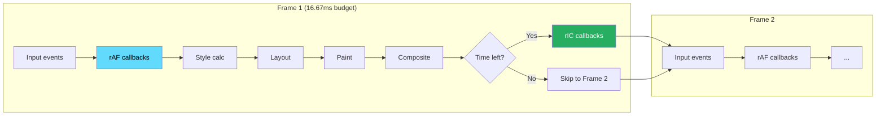
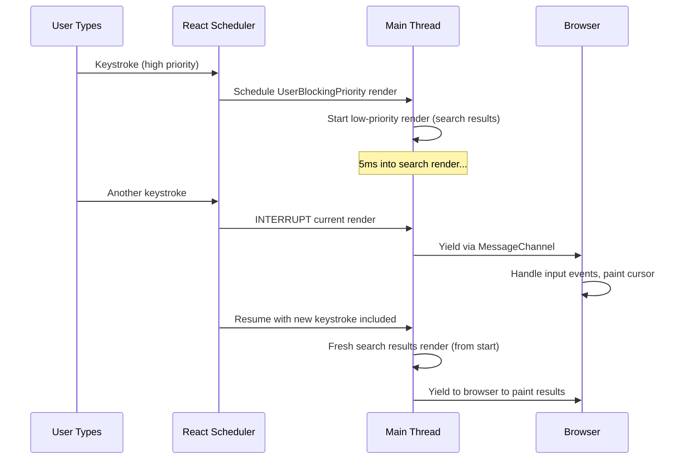

# 78 · requestAnimationFrame & requestIdleCallback

> **`requestAnimationFrame` and `requestIdleCallback` are the browser's two scheduling primitives for work that needs to happen at a specific time: rAF for work that must happen before the next paint (animations, DOM reads that must be synchronized), and rIC for work that can happen whenever the browser isn't doing anything else (background processing, precomputation, non-urgent updates). React's own scheduler is built on these primitives, and understanding them directly reveals why concurrent React behaves the way it does, how to implement smooth animations outside React, and how to offload non-critical work without impacting user experience.**

The browser's main thread has one job at any given moment. Understanding how to schedule yours correctly — synchronized with the frame cycle for visual work, deferred to idle time for background work — is the difference between a smooth UI and a janky one. This is the scheduling knowledge that underpins React 18's concurrent rendering, CSS animation advice ("prefer transform over left"), and performance patterns like "debounce input but not in rAF."

---

## Table of Contents

- [The Browser Frame Cycle](#the-browser-frame-cycle)
- [requestAnimationFrame: Timing Semantics](#requestanimationframe-timing-semantics)
- [When to Use rAF](#when-to-use-raf)
- [rAF for DOM Reads: Avoiding Layout Thrashing](#raf-for-dom-reads-avoiding-layout-thrashing)
- [Implementing Smooth Animations with rAF](#implementing-smooth-animations-with-raf)
- [rAF in React: useLayoutEffect vs rAF](#raf-in-react-uselayouteffect-vs-raf)
- [requestIdleCallback: Background Work Scheduling](#requestidlecallback-background-work-scheduling)
- [rIC Timing Guarantees (and Their Absence)](#ric-timing-guarantees-and-their-absence)
- [When to Use rIC](#when-to-use-ric)
- [The React Scheduler: rAF + rIC Descendant](#the-react-scheduler-raf--ric-descendant)
- [Building a Work Queue with rIC](#building-a-work-queue-with-ric)
- [rIC Polyfill and Fallback Strategy](#ric-polyfill-and-fallback-strategy)
- [The Task Queue: macrotasks vs microtasks vs rAF vs rIC](#the-task-queue-macrotasks-vs-microtasks-vs-raf-vs-ric)
- [Architecture Diagrams](#architecture-diagrams)
- [Good Practices](#good-practices)
- [Bad Practices](#bad-practices)
- [Mental Model](#mental-model)
- [Common Misconceptions](#common-misconceptions)
- [Exercises](#exercises)
- [Further Reading](#further-reading)

---

## The Browser Frame Cycle

Before understanding rAF and rIC, the frame cycle must be clear:

```
At 60fps, the browser produces a new frame every 16.67ms.
For each frame, the browser processes this sequence:

┌─────────────────────────────────────────────────────────┐
│  FRAME N (16.67ms budget)                               │
│                                                         │
│  Input events (click, keydown, mousemove)               │
│  ↓                                                      │
│  requestAnimationFrame callbacks ←── YOUR WORK GOES HERE│
│  ↓                                                      │
│  Style recalculation                                    │
│  ↓                                                      │
│  Layout                                                 │
│  ↓                                                      │
│  Paint                                                  │
│  ↓                                                      │
│  Composite                                              │
│  ↓                                                      │
│  [IDLE TIME if budget remains] ←── rIC RUNS HERE       │
│  requestIdleCallback callbacks                          │
└─────────────────────────────────────────────────────────┘
  FRAME N+1 starts
```

rAF runs AT THE START of each frame (before style/layout/paint).
rIC runs AT THE END of each frame (if time remains), or during inter-frame gaps.

---

## requestAnimationFrame: Timing Semantics

```js
// Basic usage:
const rafId = requestAnimationFrame(callback);

// callback receives: DOMHighResTimeStamp — the time when this frame started
function myCallback(timestamp) {
  console.log(`Frame started at: ${timestamp}ms`);
  // Do visual work here
}

// Cancel:
cancelAnimationFrame(rafId);
```

### The critical timing guarantee

```
requestAnimationFrame guarantees that your callback runs:
  - BEFORE the next style recalculation
  - BEFORE the next layout pass
  - BEFORE the next paint
  - AT MOST ONCE per frame (even if called multiple times)

This means:
  - DOM reads inside rAF reflect the PREVIOUS frame's final layout
  - DOM writes inside rAF will be batched with the current frame's paint
  - The browser won't paint while your rAF callback is running
  - Multiple rAF registrations for the same frame all run before any paint
```

### Frame timestamp vs Date.now()

```js
// ❌ Using Date.now() for animation timing: jitters
function animateWithDateNow() {
  const elapsed = Date.now() - startTime; // milliseconds
  element.style.transform = `translateX(${elapsed * speed}px)`;
  requestAnimationFrame(animateWithDateNow);
}

// ✅ Using the rAF timestamp: monotonic, synchronized to the frame
let startTime: number | null = null;

function animateWithTimestamp(timestamp: number) {
  if (startTime === null) startTime = timestamp;
  const elapsed = timestamp - startTime;

  element.style.transform = `translateX(${elapsed * speed}px)`;

  if (elapsed < totalDuration) {
    requestAnimationFrame(animateWithTimestamp);
  }
}
requestAnimationFrame(animateWithTimestamp);
```

The rAF timestamp is the same for all callbacks in the same frame — even if your callback takes 5ms to execute, the next callback in the same frame sees the same timestamp. This synchronizes animations: two elements animated by separate rAF loops will always be at the same "time" within a frame.

---

## When to Use rAF

```
✅ USE rAF FOR:
  - JavaScript-driven animations (moving elements, Canvas drawing)
  - Reading DOM properties that depend on layout (offsetWidth,
    getBoundingClientRect) in a way that avoids layout thrashing
  - Synchronizing multiple visual updates that must happen in the same frame
  - Implementing smooth scrolling or parallax effects
  - Canvas rendering loops (games, data visualizations)
  - Any visual change that should be synchronized with the next paint

❌ DON'T USE rAF FOR:
  - Non-visual work (data processing, API calls, state updates)
  - Debounced event handling (use setTimeout for that)
  - One-time DOM mutations that don't need frame synchronization
  - CSS animations (the browser handles these more efficiently
    without rAF — use CSS transitions/animations + GPU layers)
```

---

## rAF for DOM Reads: Avoiding Layout Thrashing

One of rAF's most valuable uses is batching DOM reads that need to be synchronized:

```js
// ❌ Layout thrashing: read-write-read-write in a loop
function badResize(elements: HTMLElement[]) {
  for (const el of elements) {
    const width = el.offsetWidth;    // READ — forces layout
    el.style.height = `${width}px`; // WRITE — invalidates layout
    const height = el.offsetHeight; // READ — forces layout AGAIN
    el.style.width = `${height}px`; // WRITE — invalidates layout again
  }
}

// ✅ Using rAF to batch reads and writes in separate phases:
function goodResize(elements: HTMLElement[]) {
  // Batch all reads in the current animation frame:
  requestAnimationFrame(() => {
    const sizes = elements.map(el => ({
      width: el.offsetWidth,   // all reads: layout calculated once
      height: el.offsetHeight,
    }));

    // Batch all writes in the NEXT animation frame:
    requestAnimationFrame(() => {
      elements.forEach((el, i) => {
        el.style.width = `${sizes[i].height}px`;
        el.style.height = `${sizes[i].width}px`;
      });
    });
  });
}
```

The FastDOM library formalizes this pattern: all reads are scheduled in the current frame, all writes in the next, automatically preventing interleaved read-write cycles.

---

## Implementing Smooth Animations with rAF

```tsx
// React hook for smooth rAF-based animation
import { useEffect, useRef, useCallback } from "react";

interface AnimationOptions {
  duration: number; // ms
  easing?: (t: number) => number; // t: 0-1, returns 0-1
  onUpdate: (progress: number) => void;
  onComplete?: () => void;
}

// Common easing functions
export const easings = {
  linear: (t: number) => t,
  easeInOut: (t: number) => (t < 0.5 ? 2 * t * t : -1 + (4 - 2 * t) * t),
  easeOut: (t: number) => 1 - Math.pow(1 - t, 3),
  spring: (t: number) => {
    const c4 = (2 * Math.PI) / 3;
    return t === 0
      ? 0
      : t === 1
        ? 1
        : Math.pow(2, -10 * t) * Math.sin((t * 10 - 0.75) * c4) + 1;
  },
};

function useAnimation({
  duration,
  easing = easings.easeInOut,
  onUpdate,
  onComplete,
}: AnimationOptions) {
  const rafIdRef = useRef<number | null>(null);
  const startTimeRef = useRef<number | null>(null);

  const start = useCallback(() => {
    // Cancel any existing animation
    if (rafIdRef.current !== null) {
      cancelAnimationFrame(rafIdRef.current);
    }
    startTimeRef.current = null;

    function step(timestamp: number) {
      if (startTimeRef.current === null) {
        startTimeRef.current = timestamp;
      }

      const elapsed = timestamp - startTimeRef.current;
      const rawProgress = Math.min(elapsed / duration, 1);
      const easedProgress = easing(rawProgress);

      onUpdate(easedProgress);

      if (rawProgress < 1) {
        rafIdRef.current = requestAnimationFrame(step);
      } else {
        rafIdRef.current = null;
        onComplete?.();
      }
    }

    rafIdRef.current = requestAnimationFrame(step);
  }, [duration, easing, onUpdate, onComplete]);

  const stop = useCallback(() => {
    if (rafIdRef.current !== null) {
      cancelAnimationFrame(rafIdRef.current);
      rafIdRef.current = null;
    }
  }, []);

  // Cleanup on unmount
  useEffect(() => () => stop(), [stop]);

  return { start, stop };
}

// Usage:
function AnimatedCounter({ targetValue }: { targetValue: number }) {
  const [displayed, setDisplayed] = useState(0);
  const startValueRef = useRef(0);

  const { start } = useAnimation({
    duration: 800,
    easing: easings.easeOut,
    onUpdate: (progress) => {
      setDisplayed(
        Math.round(
          startValueRef.current +
            (targetValue - startValueRef.current) * progress,
        ),
      );
    },
  });

  useEffect(() => {
    startValueRef.current = displayed;
    start();
  }, [targetValue]);

  return <span>{displayed.toLocaleString()}</span>;
}
```

---

## rAF in React: useLayoutEffect vs rAF

Both `useLayoutEffect` and `requestAnimationFrame` run synchronously with the browser paint cycle, but at different points:

```
TIMING COMPARISON:

React renders (commit phase)
  ↓
useLayoutEffect callbacks run   ← runs BEFORE browser paints
  ↓
Browser paints the frame
  ↓ (next frame)
requestAnimationFrame callback  ← runs BEFORE NEXT frame's paint
  ↓
Browser paints next frame
```

```tsx
// useLayoutEffect: runs synchronously after React commits but BEFORE paint
// Use for: measuring DOM, synchronizing external systems with React's DOM
useLayoutEffect(() => {
  const rect = ref.current?.getBoundingClientRect();
  setDimensions(rect);
  // DOM mutation here appears in the SAME paint as React's commit
}, []);

// rAF: runs before the NEXT frame's paint
// Use for: animations, work that should happen in a future frame
useEffect(() => {
  const id = requestAnimationFrame(() => {
    // This runs in the frame AFTER React's commit
    // Useful for starting animations after an element appears
  });
  return () => cancelAnimationFrame(id);
}, []);

// Double rAF: ensures CSS transitions start after an initial paint
// Needed because: element must be in the DOM AND painted before transitions work
useEffect(() => {
  const id = requestAnimationFrame(() => {
    requestAnimationFrame(() => {
      // At this point: element is painted, CSS transition will fire
      element.classList.add("visible");
    });
  });
  return () => cancelAnimationFrame(id);
}, []);
```

---

## requestIdleCallback: Background Work Scheduling

```js
// Basic usage:
const ricId = requestIdleCallback(callback, options);

// callback receives: IdleDeadline object
function myIdleCallback(deadline: IdleDeadline) {
  while (deadline.timeRemaining() > 0 && workQueue.length > 0) {
    processOneWorkItem(workQueue.shift());
  }

  if (workQueue.length > 0) {
    // More work to do — schedule another idle callback
    requestIdleCallback(myIdleCallback);
  }
}

// Options:
requestIdleCallback(callback, {
  timeout: 2000, // If idle time doesn't occur within 2s, force callback
                 // (with deadline.didTimeout === true)
});

// Cancel:
cancelIdleCallback(ricId);
```

### The IdleDeadline API

```js
function callback(deadline: IdleDeadline) {
  deadline.timeRemaining()
  // Returns: estimated ms remaining in the current idle period
  // Starts at: usually 15-20ms for a real idle frame
  //           (remaining budget after frame work is done)
  // Decreases as: you use time (re-checked on each call)
  // Returns 0 when: idle period ending (don't do more work)

  deadline.didTimeout
  // true if: the callback was forced due to the timeout option
  // You should do at least some work even when timeRemaining() === 0
  // to make progress when the browser is never truly idle
}
```

---

## rIC Timing Guarantees (and Their Absence)

rIC makes WEAK timing guarantees compared to rAF:

```
rAF GUARANTEE: runs before every single frame's paint
  → Reliable, predictable timing
  → Suitable for visual work that must be synchronized with paint

rIC GUARANTEE: runs when the browser is idle
  → "Idle" = after all higher priority tasks complete
  → May not run for a long time on busy pages
  → May not run at all in certain scenarios:
    - Tab in background (browser suspends rIC)
    - Page is very busy (user interacting continuously)
    - Mobile browser in battery saver mode

TIMEOUT OPTION is essential for work that must eventually happen:
  requestIdleCallback(callback, { timeout: 5000 });
  // If the browser never goes idle for 5 seconds, callback fires
  // with deadline.didTimeout === true
  // You should check didTimeout and do the work even if timeRemaining is low
```

---

## When to Use rIC

```
✅ USE rIC FOR:
  - Pre-computing data that will be needed soon
    (e.g., calculating the next page's data while user reads current page)
  - Sending analytics events that aren't time-critical
  - Prefetching images or resources for future interactions
  - Saving draft data to localStorage without interrupting typing
  - Running spell-check or grammar suggestions after user stops typing
  - Background synchronization of non-critical state
  - Initializing features that aren't needed immediately

❌ DON'T USE rIC FOR:
  - Visual updates (use rAF)
  - Work that must happen within a specific time window
  - Work triggered by user interaction (use the event handler + possibly setTimeout)
  - Critical-path operations that users are waiting for
```

---

## The React Scheduler: rAF + rIC Descendant

React 18's concurrent scheduler is built on concepts from rAF and rIC, but with its own implementation (for better cross-platform support):

```
React Scheduler's approach:
  Priority levels (like task lanes):
    ImmediatePriority:  runs synchronously, no scheduling
    UserBlockingPriority: 250ms timeout (input response)
    NormalPriority:     5s timeout (most React rendering)
    LowPriority:        10s timeout (offscreen prefetching)
    IdlePriority:       No timeout (like rIC — only when idle)

  Scheduling mechanism:
    Uses MessageChannel (a macrotask) to yield to the browser
    This allows the browser to run its own work (input handling,
    painting) between React's rendering slices — the key
    innovation of concurrent React.

    Why not rIC directly?
      rIC has browser compatibility issues and weak timing.
      MessageChannel gives React more control over when to yield
      and when to continue rendering.

    Why not rAF directly?
      rAF runs before paint — using it for rendering would mean
      React re-renders before every paint, which is too much work.
      React only needs to render when state changes.

WHAT THIS MEANS FOR DEVELOPERS:
  useTransition marks work as lower priority (Normal/Low)
  → React can interrupt this work when higher-priority work arrives
  → e.g., user types in a search box (UserBlockingPriority) →
    React pauses the search-results render (NormalPriority) to
    process the keystroke first

  startTransition(() => setQuery(input)) is the rIC equivalent:
  "Do this work when you have time, don't block user interaction"
```

---

## Building a Work Queue with rIC

A practical pattern for background processing:

```tsx
// Generic idle work queue for React
function useIdleWorkQueue<T>(
  processItem: (item: T) => void,
  options: { timeout?: number } = {},
) {
  const queueRef = useRef<T[]>([]);
  const ricIdRef = useRef<number | null>(null);

  const scheduleWork = useCallback(() => {
    if (ricIdRef.current !== null) return; // already scheduled

    ricIdRef.current = requestIdleCallback(
      (deadline) => {
        ricIdRef.current = null;

        while (
          (deadline.timeRemaining() > 1 || deadline.didTimeout) &&
          queueRef.current.length > 0
        ) {
          const item = queueRef.current.shift()!;
          processItem(item);
        }

        // If work remains, schedule again
        if (queueRef.current.length > 0) {
          scheduleWork();
        }
      },
      { timeout: options.timeout ?? 5000 },
    );
  }, [processItem, options.timeout]);

  const addWork = useCallback(
    (item: T) => {
      queueRef.current.push(item);
      scheduleWork();
    },
    [scheduleWork],
  );

  const clearWork = useCallback(() => {
    queueRef.current = [];
    if (ricIdRef.current !== null) {
      cancelIdleCallback(ricIdRef.current);
      ricIdRef.current = null;
    }
  }, []);

  useEffect(() => () => clearWork(), [clearWork]);

  return { addWork, clearWork };
}

// Usage: pre-compute data while user reads content
function ArticlePage({ articles }: { articles: Article[] }) {
  const [processedMap, setProcessedMap] = useState<
    Map<string, ProcessedArticle>
  >(new Map());

  const { addWork } = useIdleWorkQueue<Article>((article) => {
    const processed = expensivePreprocess(article);
    setProcessedMap((prev) => new Map(prev).set(article.id, processed));
  });

  // Queue all articles for background processing
  useEffect(() => {
    articles.forEach(addWork);
  }, [articles, addWork]);

  return <ArticleList articles={articles} processedMap={processedMap} />;
}
```

---

## rIC Polyfill and Fallback Strategy

Safari did not support rIC until very recently; some environments still lack it:

```tsx
// Robust rIC usage with setTimeout fallback:
const requestIdleCallbackPolyfill: typeof requestIdleCallback =
  typeof requestIdleCallback !== "undefined"
    ? requestIdleCallback.bind(window)
    : (callback, options) => {
        const start = Date.now();
        return setTimeout(() => {
          callback({
            didTimeout: false,
            timeRemaining: () => Math.max(0, 50 - (Date.now() - start)),
          });
        }, options?.timeout ?? 1) as unknown as ReturnType<
          typeof requestIdleCallback
        >;
      };

const cancelIdleCallbackPolyfill: typeof cancelIdleCallback =
  typeof cancelIdleCallback !== "undefined"
    ? cancelIdleCallback.bind(window)
    : (clearTimeout as unknown as typeof cancelIdleCallback);

// Usage:
const id = requestIdleCallbackPolyfill(callback, { timeout: 2000 });
cancelIdleCallbackPolyfill(id);
```

---

## The Task Queue: macrotasks vs microtasks vs rAF vs rIC

Understanding where rAF and rIC fit in the browser's task ordering:

```
TASK ORDERING (within one "event loop turn"):

  1. MACROTASK (one at a time, from the task queue):
     - setTimeout callback
     - setInterval callback
     - I/O callbacks
     - postMessage
     - Script execution (module evaluation)

  2. MICROTASKS (ALL pending, before next macrotask):
     - Promise.then() callbacks
     - queueMicrotask()
     - MutationObserver callbacks
     → Drain completely before moving on
     → If microtasks schedule more microtasks: those run too (beware infinite loops)

  3. RENDER PIPELINE (if browser decides it's time to paint):
     a. requestAnimationFrame callbacks
     b. Style + Layout + Paint
     c. Composite

  4. IDLE TIME (if time remains in the frame):
     a. requestIdleCallback callbacks

  5. Next MACROTASK from the queue

PRACTICAL IMPLICATIONS:
  Promise.resolve().then(fn)  → fn runs VERY SOON (before next task)
  setTimeout(fn, 0)           → fn runs at start of next macrotask
  requestAnimationFrame(fn)   → fn runs before next paint
  requestIdleCallback(fn)     → fn runs when browser has spare time

  // Scheduling order example:
  console.log('1 - sync');
  setTimeout(() => console.log('4 - setTimeout'), 0);
  Promise.resolve().then(() => console.log('2 - microtask'));
  requestAnimationFrame(() => console.log('3 - rAF (before paint)'));
  // Output: 1, 2, 3, 4 (in a typical frame)
```

---

## Architecture Diagrams

### rAF and rIC in the frame timeline



### React Scheduler's concurrent rendering model



---

## Good Practices

### ✅ Good Practice — Smooth scroll animation with rAF

```tsx
/**
 * Good: Custom smooth scroll hook using rAF for buttery animation.
 * Uses easing function for natural deceleration.
 * Properly cancels on unmount. Respects prefers-reduced-motion.
 */
function useSmoothScroll() {
  const rafIdRef = useRef<number | null>(null);
  const prefersReducedMotion = useMediaQuery(
    "(prefers-reduced-motion: reduce)",
  );

  const scrollTo = useCallback(
    (targetY: number, duration = 600) => {
      if (rafIdRef.current !== null) {
        cancelAnimationFrame(rafIdRef.current);
      }

      if (prefersReducedMotion) {
        window.scrollTo({ top: targetY, behavior: "auto" });
        return;
      }

      const startY = window.scrollY;
      const distance = targetY - startY;
      let startTime: number | null = null;

      // Ease-out cubic
      const easeOut = (t: number) => 1 - Math.pow(1 - t, 3);

      function step(timestamp: number) {
        if (startTime === null) startTime = timestamp;
        const elapsed = timestamp - startTime;
        const progress = Math.min(elapsed / duration, 1);
        const easedProgress = easeOut(progress);

        window.scrollTo(0, startY + distance * easedProgress);

        if (progress < 1) {
          rafIdRef.current = requestAnimationFrame(step);
        } else {
          rafIdRef.current = null;
        }
      }

      rafIdRef.current = requestAnimationFrame(step);
    },
    [prefersReducedMotion],
  );

  useEffect(
    () => () => {
      if (rafIdRef.current !== null) {
        cancelAnimationFrame(rafIdRef.current);
      }
    },
    [],
  );

  return { scrollTo };
}
```

---

## Bad Practices

### ⚠️ Bad Practice — Using rAF for non-visual work, or setInterval for animations

```tsx
/**
 * Bad 1: Using rAF for non-visual work.
 * rAF fires before EVERY frame, even when no visual update is needed.
 * Non-visual work here runs 60 times per second unnecessarily,
 * consuming main thread budget every frame.
 */
function BAD_useRafForAnalytics() {
  useEffect(() => {
    function sendAnalytics() {
      fetch("/api/track", {
        method: "POST",
        body: JSON.stringify(getMetrics()),
      });
      requestAnimationFrame(sendAnalytics); // ❌ runs 60x per second!
    }
    requestAnimationFrame(sendAnalytics);
  }, []);
}

// ✅ Fix: use setInterval for periodic non-visual work
function GOOD_useIntervalForAnalytics() {
  useEffect(() => {
    const id = setInterval(() => {
      fetch("/api/track", {
        method: "POST",
        body: JSON.stringify(getMetrics()),
      });
    }, 30000); // every 30 seconds — appropriate for analytics
    return () => clearInterval(id);
  }, []);
}

/**
 * Bad 2: Using setInterval for animations.
 * setInterval has no relationship to the browser's paint cycle.
 * It fires based on a timer, not frame timing — producing "tearing"
 * (animation out of sync with display refresh) and jank.
 */
function BAD_useIntervalForAnimation() {
  useEffect(() => {
    let x = 0;
    const id = setInterval(() => {
      x += 2;
      element.style.transform = `translateX(${x}px)`;
      // ❌ May fire between browser paint cycles — causes tearing
      // ❌ Not synchronized with the 16.67ms frame boundary
      // ❌ On a 120Hz display: fires at wrong rate entirely
    }, 16); // ≈60fps but NOT synchronized
    return () => clearInterval(id);
  }, []);
}

// ✅ Fix: use rAF for animations
function GOOD_useRafForAnimation() {
  useEffect(() => {
    let x = 0;
    let rafId: number;

    function animate() {
      x += 2;
      element.style.transform = `translateX(${x}px)`;
      rafId = requestAnimationFrame(animate);
      // ✅ Synchronized with the browser's display refresh
      // ✅ Adapts automatically to 60Hz or 120Hz
      // ✅ Pauses when tab is hidden (browser throttles rAF)
    }

    rafId = requestAnimationFrame(animate);
    return () => cancelAnimationFrame(rafId);
  }, []);
}
```

---

## Mental Model

> 💡 **The rAF / rIC mental model:**
>
> Think of the browser as a **restaurant with two kinds of reservations**. `requestAnimationFrame` is a guaranteed dinner reservation — you're assured a seat at the table every single evening (every frame), and you must place your order BEFORE the kitchen closes for that night (before each paint). Missing this window means waiting for tomorrow's dinner service (the next frame). `requestIdleCallback` is a standby reservation — you only get seated if there's an empty table after all the guaranteed reservations are handled (after each frame's work is complete). Some evenings there are empty tables; some evenings the restaurant is completely full (the page is busy). The timeout option is like "I'll wait standby for up to 2 hours, but after that, seat me whether or not there's a good table." React's Scheduler is the restaurant's own reservation system — it manages who gets priority seating based on urgency, and periodically checks if any more urgent guests have arrived and should jump the queue.

---

## Common Misconceptions

### "requestAnimationFrame runs at 60fps exactly"

rAF runs before each browser paint, which happens at the display's refresh rate — 60Hz, 90Hz, 120Hz, or whatever the display supports. On a 120Hz display, rAF fires 120 times per second. On a phone with adaptive refresh that drops to 30Hz under load, rAF fires 30 times per second. Don't hardcode "16ms" as the rAF interval — use the timestamp parameter to calculate actual elapsed time.

### "requestIdleCallback is the same as setTimeout(fn, 0)"

`setTimeout(fn, 0)` queues a macrotask that runs as soon as the current task completes — this could be in the middle of a busy frame, competing with layout and paint. rIC specifically runs in idle time (after frame work is done), with a budget indicator (`timeRemaining()`). They're fundamentally different scheduling semantics.

### "rAF callbacks are guaranteed to run before the next frame"

rAF callbacks scheduled during an rAF callback run before the NEXT next frame (two frames from now). If you call `requestAnimationFrame(callback)` from inside an rAF callback, `callback` won't run before the current frame's paint — it's queued for the FOLLOWING frame.

### "Using rAF for everything improves performance"

rAF is specifically for work that needs to happen before a paint. Running non-visual work (API calls, data processing) in rAF wastes frame budget on work that doesn't need frame-synchronized timing, potentially causing janky frames.

### "requestIdleCallback is deprecated or going away"

rIC is a living Web standard. Browser support has improved significantly (Chrome, Firefox, Safari all support it). It's not deprecated — it's used by performance tooling and background work scheduling widely in production.

---

## Exercises

### Exercise 1 — Implement a number counter animation

Build a component that animates a number from 0 to a target value:

1. Use rAF loop with timestamp-based progress (not setInterval)
2. Apply an ease-out cubic function
3. Respect `prefers-reduced-motion` (skip animation if set)
4. Cancel the rAF loop on unmount

Test: the number should animate smoothly, not jump.

### Exercise 2 — Background pre-processing with rIC

```tsx
// You have 1000 products, each needing an expensive pre-process:
function expensivePreprocess(product: Product): ProcessedProduct {
  // Simulates ~5ms of CPU work
  const result = { ...product };
  for (let i = 0; i < 500000; i++) {
    /* computation */
  }
  return result;
}
```

Implement an idle work queue that:

1. Processes products in the background using rIC
2. Shows a progress indicator (0-100%)
3. Does NOT block user interaction while processing
4. Uses `timeout: 10000` to ensure eventual completion

### Exercise 3 — Observe rAF vs setInterval in DevTools

1. Implement the same animation (move a div left) using both rAF and setInterval(fn, 16)
2. Open Chrome DevTools → Performance tab
3. Record while each animation plays for 2 seconds
4. Compare: does setInterval show consistent or jittery intervals?
5. On a 120Hz display (if available): does setInterval still fire at ~60Hz while rAF adapts?

---

## Further Reading

- [MDN: requestAnimationFrame](https://developer.mozilla.org/en-US/docs/Web/API/window/requestAnimationFrame) — API reference
- [MDN: requestIdleCallback](https://developer.mozilla.org/en-US/docs/Web/API/Window/requestIdleCallback) — API reference
- [Google: Using requestIdleCallback](https://developer.chrome.com/docs/blog/using-requestidlecallback/) — practical patterns
- [Jake Archibald: In The Loop](https://www.youtube.com/watch?v=cCOL7MC4Pl0) — JSConf talk on the event loop, rAF, rIC
- [React Scheduler source](https://github.com/facebook/react/blob/main/packages/scheduler/src/forks/Scheduler.js) — how React implements its own scheduler
- [Paul Lewis: requestAnimationFrame for Smart Animating](https://www.paulirish.com/2011/requestanimationframe-for-smart-animating/) — the original case for rAF
- Related in this handbook: [73 · Memoization Engineering](./02-memoization.md), [Part IV: React Concurrent](../concurrent-react/05-scheduling.md)

---

_Part of the [React + Next.js Engineering Handbook](../../README.md)_
