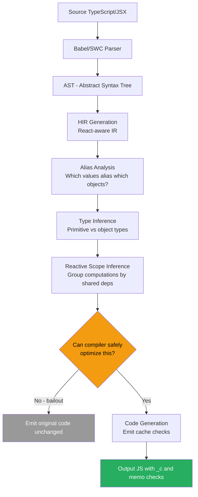
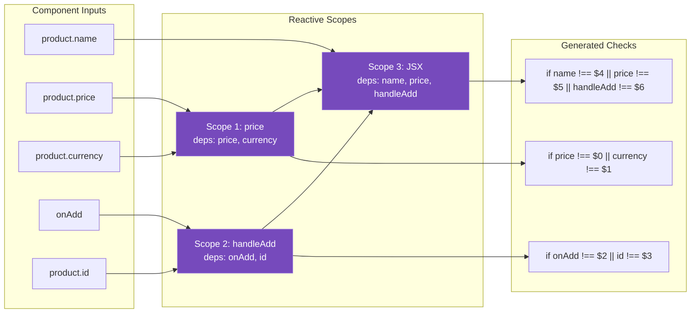

# 35 · React Compiler Architecture

> **The React Compiler (formerly React Forget) is a build-time static analysis tool that automatically adds memoization to React components and hooks. It transforms your source code into equivalent code that never re-renders unnecessarily — without you writing a single useMemo, useCallback, or React.memo. Understanding how the compiler works reveals why it can do this correctly at scale, and what its limits are.**

For five years, React engineers debated when to use `useMemo` and `useCallback`. Libraries were built, blog posts were written, ESLint rules were created — all to address the same fundamental problem: React's optimization model required developers to manually annotate every value that should be stable. The React Compiler eliminates this problem at the language level. This document explains how.

---

## Table of Contents

- [What the React Compiler Does](#what-the-react-compiler-does)
- [The Core Insight: Reactivity Rules](#the-core-insight-reactivity-rules)
- [Compiler Architecture Overview](#compiler-architecture-overview)
- [Phase 1: Parsing and HIR Generation](#phase-1-parsing-and-hir-generation)
- [Phase 2: Alias Analysis and Mutability](#phase-2-alias-analysis-and-mutability)
- [Phase 3: Reactive Scope Inference](#phase-3-reactive-scope-inference)
- [Phase 4: Code Generation](#phase-4-code-generation)
- [What the Compiler Generates](#what-the-compiler-generates)
- [Compiler Bailout Conditions](#compiler-bailout-conditions)
- [The Compiler and the Rules of React](#the-compiler-and-the-rules-of-react)
- [Enabling the Compiler](#enabling-the-compiler)
- [Compiler vs Manual Memoization](#compiler-vs-manual-memoization)
- [Current Limitations](#current-limitations)
- [Production Results](#production-results)
- [Architecture Diagrams](#architecture-diagrams)
- [Good Practices](#good-practices)
- [Bad Practices](#bad-practices)
- [Mental Model](#mental-model)
- [Common Misconceptions](#common-misconceptions)
- [Exercises](#exercises)
- [Further Reading](#further-reading)

---

## What the React Compiler Does

The React Compiler is a Babel/SWC transform that takes your React components as input and emits equivalent components with memoization automatically applied:

```tsx
// You write:
function ProductCard({ product, onAdd }: ProductCardProps) {
  const price = formatPrice(product.price, product.currency);
  const handleAddClick = () => onAdd(product.id);

  return (
    <div className="card">
      <h2>{product.name}</h2>
      <span>{price}</span>
      <button onClick={handleAddClick}>Add to Cart</button>
    </div>
  );
}

// Compiler emits (conceptually):
import { c as _c } from "react/compiler-runtime";

function ProductCard({ product, onAdd }: ProductCardProps) {
  const $ = _c(6); // allocate 6 memo slots

  let price;
  if ($[0] !== product.price || $[1] !== product.currency) {
    price = formatPrice(product.price, product.currency);
    $[0] = product.price;
    $[1] = product.currency;
  } else {
    price = $[2];
  }

  let handleAddClick;
  if ($[3] !== onAdd || $[4] !== product.id) {
    handleAddClick = () => onAdd(product.id);
    $[3] = onAdd;
    $[4] = product.id;
  } else {
    handleAddClick = $[5];
  }

  // Note: JSX is also memoized but shown simplified here
  return (
    <div className="card">
      <h2>{product.name}</h2>
      <span>{price}</span>
      <button onClick={handleAddClick}>Add to Cart</button>
    </div>
  );
}
```

The compiler automatically:

1. Identifies which values depend on which inputs (props, state, context)
2. Groups dependent computations into "reactive scopes"
3. Wraps each scope in a check: "did the inputs change?"
4. Only recomputes when inputs change

---

## The Core Insight: Reactivity Rules

The compiler is possible because React components must follow specific rules that make their behavior analyzable at compile time:

### Rule 1: Components are pure functions of their inputs

A component's output (JSX) depends only on its props, state, and context — not on external mutable state or random values.

```tsx
// ✅ Pure: output determined by props
function Price({ amount, currency }: PriceProps) {
  return <span>{formatPrice(amount, currency)}</span>;
}

// ❌ Impure: output depends on external state
let globalCounter = 0;
function ImpureComponent() {
  globalCounter++; // depends on external mutable state
  return <span>{globalCounter}</span>;
  // Compiler cannot safely memoize this
}
```

### Rule 2: Values are immutable within a render

Props and state are not mutated during render. This means the compiler can assume that `product.price` at the start of a render equals `product.price` at the end.

```tsx
// ✅ Immutable: safe to memoize based on product
function ProductCard({ product }: { product: Product }) {
  const price = product.price * 1.1; // safe to cache: product.price won't change during render
}

// ❌ Mutable: breaks memoization
function BrokenCard({ items }: { items: Item[] }) {
  items.push(newItem); // mutation! compiler cannot analyze safely
}
```

### Rule 3: Hooks follow call-order rules

The compiler knows which values come from which hooks because hook call order is fixed and analyzable.

These rules collectively mean that the compiler can statically determine: for a given component, which output values depend on which input values — and therefore which caches to invalidate when inputs change.

---

## Compiler Architecture Overview

The React Compiler is implemented as a multi-phase transformation:

```
Source TypeScript/JSX
        ↓
    1. PARSER
    Parse via Babel/SWC → AST (Abstract Syntax Tree)
        ↓
    2. HIR GENERATION
    Convert AST → HIR (High-level Intermediate Representation)
    HIR is React-aware: understands hooks, JSX, components
        ↓
    3. ALIAS ANALYSIS
    Determine which variables alias which objects
    Track mutability: which values can be safely cached?
        ↓
    4. TYPE INFERENCE
    Determine primitive vs object types
    Primitives: always comparable by value
    Objects: need reference tracking
        ↓
    5. REACTIVE SCOPE INFERENCE
    Group computations into "reactive scopes"
    A scope is a set of computations that share the same dependencies
    Each scope = one cache check in the output
        ↓
    6. CODE GENERATION
    Convert scopes → cache checks (if/else with memo slots)
    Emit optimized JavaScript/TypeScript
        ↓
Output JavaScript/TypeScript with automatic memoization
```

---

## Phase 1: Parsing and HIR Generation

The compiler first converts JavaScript/TypeScript into its own internal representation — the HIR (High-level Intermediate Representation):

```
Source:
  const price = formatPrice(product.price, product.currency);

AST (from Babel):
  VariableDeclaration {
    declarations: [VariableDeclarator {
      id: Identifier { name: 'price' },
      init: CallExpression {
        callee: Identifier { name: 'formatPrice' },
        arguments: [
          MemberExpression { object: Identifier('product'), property: Identifier('price') },
          MemberExpression { object: Identifier('product'), property: Identifier('currency') }
        ]
      }
    }]
  }

HIR (React Compiler's representation):
  instruction: {
    id: InstructionId(5),
    value: {
      kind: 'Call',
      callee: { kind: 'Identifier', name: 'formatPrice' },
      args: [
        { kind: 'PropertyLoad', object: 'product', property: 'price' },
        { kind: 'PropertyLoad', object: 'product', property: 'currency' }
      ]
    },
    lvalue: { kind: 'Identifier', name: 'price' }
  }
```

The HIR is more amenable to analysis than the raw AST because it:

- Makes data flow explicit (each instruction has a result and its inputs)
- Flattens nested expressions into a sequence of simple operations
- Makes scope and lifetime information explicit

---

## Phase 2: Alias Analysis and Mutability

The compiler must determine which values can safely be cached. A value can be cached if:

1. It depends only on "reactive values" (props, state, hook return values)
2. It is not mutated after creation

```tsx
// Compiler analysis:
function Component({ items, filter }: Props) {
  // ✅ Safe to cache: depends on items and filter (reactive), no mutation
  const filtered = items.filter((i) => i.type === filter);

  // ❌ NOT safe to cache: mutation after creation
  const result = [...items];
  result.push(extraItem); // mutation → cannot cache 'result'

  // ✅ Safe to cache: primitive computation
  const count = filtered.length;

  // ❌ NOT safe to cache: depends on Date.now() (non-deterministic)
  const timestamp = Date.now();
}
```

### The alias analysis problem

Alias analysis determines whether two variable names point to the same object:

```tsx
function Component({ data }: { data: Record<string, Item> }) {
  const items = data.items; // items aliases data.items
  const firstItem = items[0]; // firstItem aliases items[0] = data.items[0]

  // Compiler must know: if data changes, items and firstItem also change
  // Even though we only wrote "items" and "firstItem" in the deps

  // Generated cache check:
  // if ($[0] !== data) { // check data → implies items and firstItem change too
  //   items = data.items;
  //   firstItem = items[0];
  //   $[0] = data;
  // }
}
```

The compiler uses a points-to analysis to build an alias graph — a mapping of which identifiers might refer to the same memory location. This graph determines which cache checks are sufficient.

---

## Phase 3: Reactive Scope Inference

This is the heart of the compiler's optimization. A "reactive scope" is a group of computations that:

1. Share the same set of reactive dependencies
2. Should be recomputed together when any dependency changes

```tsx
// Source:
function ProductPage({ productId, userId }: Props) {
  // These computations depend on productId:
  const productUrl = `/api/products/${productId}`;
  const cacheKey = `product-${productId}`;

  // These computations depend on userId:
  const userUrl = `/api/users/${userId}`;

  // This computation depends on BOTH:
  const combinedKey = `${productId}-${userId}`;
}

// Compiler identifies 3 reactive scopes:
// Scope 1: [productUrl, cacheKey] → deps: [productId]
// Scope 2: [userUrl]              → deps: [userId]
// Scope 3: [combinedKey]          → deps: [productId, userId]

// Generated:
if ($[0] !== productId) {
  productUrl = `/api/products/${productId}`;
  cacheKey = `product-${productId}`;
  $[0] = productId;
} else {
  /* use cached */
}

if ($[1] !== userId) {
  userUrl = `/api/users/${userId}`;
  $[1] = userId;
} else {
  /* use cached */
}

if ($[2] !== productId || $[3] !== userId) {
  combinedKey = `${productId}-${userId}`;
  $[2] = productId;
  $[3] = userId;
} else {
  /* use cached */
}
```

### The scope grouping algorithm

The compiler uses a dependency graph to group computations:

```
For each computation C in the component:
  1. Find all reactive values C reads (direct and transitive)
  2. These are C's reactive dependencies

  3. Two computations A and B are in the same scope if:
     a. A reads B's output (A depends on B), OR
     b. B reads A's output (B depends on A)

  4. Group connected computations into scopes
  5. Each scope's dependencies = union of all computations' dependencies
```

This grouping ensures that:

- Computations that depend on each other are always recomputed together (consistency)
- Computations with different deps are in separate scopes (efficiency)

---

## Phase 4: Code Generation

The compiler converts reactive scopes into imperative cache checks:

```tsx
// For each reactive scope, generate:
if ($[slotIndex1] !== dep1 || $[slotIndex2] !== dep2 || ...) {
  // Recompute:
  value = computation();
  // Update cache:
  $[slotIndex1] = dep1;
  $[slotIndex2] = dep2;
  $[resultSlot] = value;
} else {
  // Cache hit:
  value = $[resultSlot];
}
```

### The `_c` runtime function

```tsx
// react/compiler-runtime exports:
export function c(size: number): Array<unknown> {
  // Returns a stable array that persists across renders
  // Implemented as a custom hook under the hood:
  return useMemo(() => Array(size).fill(REACT_MEMO_CACHE_SENTINEL), []);
  // REACT_MEMO_CACHE_SENTINEL: a unique symbol that marks "not yet computed"
  // On first render: all slots contain the sentinel → all caches miss
}
```

The `$` array is the component's memo cache — it persists across renders, just like `useMemo` does. The compiler chooses the minimum number of slots needed for all the reactive scopes in a component.

### JSX memoization

The compiler also memoizes JSX elements:

```tsx
// Source:
return (
  <div className="card">
    <ProductName name={product.name} />
    <Price amount={price} />
  </div>
);

// Compiled:
let t0;
if ($[0] !== product.name) {
  t0 = <ProductName name={product.name} />;
  $[0] = product.name;
} else {
  t0 = $[1]; // cached JSX element
}

let t1;
if ($[2] !== price) {
  t1 = <Price amount={price} />;
  $[2] = price;
} else {
  t1 = $[3];
}

let t2;
if ($[4] !== t0 || $[5] !== t1) {
  t2 = (
    <div className="card">
      {t0}
      {t1}
    </div>
  );
  $[4] = t0;
  $[5] = t1;
} else {
  t2 = $[6];
}

return t2;
```

When `product.name` doesn't change, the compiler reuses the same `<ProductName>` JSX element object. React's reconciler sees identical references (`t0 === prevT0`) and bails out without calling the component function — equivalent to `React.memo` but without the explicit wrapper.

---

## What the Compiler Generates

A complete example showing before and after:

```tsx
// BEFORE (what you write):
function UserDashboard({
  user,
  posts,
  onLike,
}: {
  user: User;
  posts: Post[];
  onLike: (postId: string) => void;
}) {
  const greeting = `Hello, ${user.name}!`;
  const postCount = posts.length;
  const recentPosts = posts.slice(0, 5);

  const handleLike = (postId: string) => {
    onLike(postId);
  };

  return (
    <div>
      <h1>{greeting}</h1>
      <p>You have {postCount} posts</p>
      <PostList posts={recentPosts} onLike={handleLike} />
    </div>
  );
}

// AFTER (compiler output — simplified for readability):
import { c as _c } from "react/compiler-runtime";

function UserDashboard({ user, posts, onLike }) {
  const $ = _c(12);

  let greeting;
  if ($[0] !== user.name) {
    greeting = `Hello, ${user.name}!`;
    $[0] = user.name;
  } else {
    greeting = $[1];
  }

  let postCount;
  if ($[2] !== posts) {
    postCount = posts.length;
    $[2] = posts;
  } else {
    postCount = $[3];
  }

  let recentPosts;
  if ($[4] !== posts) {
    recentPosts = posts.slice(0, 5);
    $[4] = posts;
  } else {
    recentPosts = $[5];
  }

  let handleLike;
  if ($[6] !== onLike) {
    handleLike = (postId) => onLike(postId);
    $[6] = onLike;
  } else {
    handleLike = $[7];
  }

  let t0;
  if (
    $[8] !== greeting ||
    $[9] !== postCount ||
    $[10] !== recentPosts ||
    $[11] !== handleLike
  ) {
    t0 = (
      <div>
        <h1>{greeting}</h1>
        <p>You have {postCount} posts</p>
        <PostList posts={recentPosts} onLike={handleLike} />
      </div>
    );
    $[8] = greeting;
    $[9] = postCount;
    $[10] = recentPosts;
    $[11] = handleLike;
  } else {
    t0 = $[12]; // wait, that would be index 12 but we only allocated 12 slots (0-11)
    // compiler allocates the right number of slots automatically
  }

  return t0;
}
```

The compiler correctly identifies that:

- `greeting` depends on `user.name` (not all of `user`)
- `postCount` and `recentPosts` both depend on `posts` (can share the cache check)
- `handleLike` depends on `onLike` (stabilized like `useCallback`)
- The JSX depends on all computed values

---

## Compiler Bailout Conditions

The compiler cannot safely optimize every component. When it encounters code it cannot analyze, it bails out — either for the entire component or for a specific computation:

### Component-level bailouts

```tsx
// ❌ Bailout: uses ref but type inference can't determine it's stable
function ComponentWithComplexRef() {
  const ref = useRef(null);
  // Some complex ref usage that confuses alias analysis
  // Compiler: "cannot safely memoize this component"
}

// ❌ Bailout: dynamic hook calls (rules of hooks violation)
function ConditionalHook({ flag }: { flag: boolean }) {
  if (flag) {
    const [state] = useState(0); // conditional hook call → bailout
  }
}

// ❌ Bailout: complex control flow the compiler can't analyze
function ComplexFlow({ items }: { items: Item[] }) {
  let result;
  for (const item of items) {
    if (someComplexCondition(item)) {
      result = processA(item);
      break;
    }
  }
  // Complex early-exit patterns may cause partial bailout
}
```

### Value-level bailouts

```tsx
// ✅ Compiler optimizes what it can, skips what it can't
function MixedComponent({ product, config }: Props) {
  // ✅ Compiler can optimize: clear reactive dependency
  const price = product.price * config.taxRate;

  // ❌ Compiler cannot optimize: unknown external dependency
  const timestamp = Date.now(); // non-deterministic
  // Compiler: skip memoizing 'timestamp' (not cacheable)

  // ✅ Compiler can still optimize the JSX that doesn't use timestamp
  return (
    <div>
      <Price value={price} /> {/* memoized */}
      <Debug time={timestamp} /> {/* not memoized */}
    </div>
  );
}
```

When the compiler bails out, it emits the original code unchanged — no incorrect optimization, just no optimization. The component works identically, just without the automatic memoization.

### Checking bailout reasons

```bash
# The compiler emits annotations in debug mode:
npx react-compiler-healthcheck

# Or with the Babel plugin in verbose mode:
# Each bailed-out component/value gets a comment:
// ❌ Could not memoize: date.now() is not pure
const timestamp = Date.now();
```

---

## The Compiler and the Rules of React

The React Compiler requires components to follow React's rules. If a component violates the rules, the compiler cannot optimize it (and may emit a warning):

```tsx
// ❌ Rule violation: mutating props
function BrokenComponent({ items }: { items: Item[] }) {
  items.push(newItem); // mutation! compiler bails out AND warns

  // The component is also incorrect: React will see the same array reference
  // and may not re-render even when items "changed"
}

// ❌ Rule violation: calling hook conditionally
function AnotherBroken({ show }: { show: boolean }) {
  if (show) {
    const [x] = useState(0); // conditional hook: compiler bails out
  }
}

// ❌ Rule violation: side effects in render
function SideEffectComponent({ name }: { name: string }) {
  localStorage.setItem("lastSeen", name); // side effect in render: not pure
  // Compiler: cannot memoize (side effects must run every render)
}
```

The compiler acts as an enforcement mechanism for React's rules. Components that follow the rules are automatically optimized. Components that don't are flagged and left unoptimized.

---

## Enabling the Compiler

The React Compiler ships as a Babel/SWC plugin for React 19+:

```bash
npm install babel-plugin-react-compiler
# or for Next.js:
npm install next@latest  # Next.js 15+ has built-in compiler support
```

### Babel configuration

```js
// babel.config.js
const ReactCompilerConfig = {
  target: "18", // React 18 or 19
  sources: (filename) => {
    // Optional: only compile specific files
    return filename.indexOf("src/") !== -1;
  },
};

module.exports = function (api) {
  return {
    plugins: [["babel-plugin-react-compiler", ReactCompilerConfig]],
  };
};
```

### Next.js configuration

```js
// next.config.js
/** @type {import('next').NextConfig} */
const nextConfig = {
  experimental: {
    reactCompiler: true,
    // Or with options:
    reactCompiler: {
      compilationMode: "annotation", // 'all', 'infer', 'annotation'
    },
  },
};

module.exports = nextConfig;
```

### Compilation modes

```tsx
// 'all': compile everything (default for new projects)
// Risks: may encounter bugs on complex components

// 'annotation': only compile components with the opt-in directive
"use memo"; // place at top of file or component

function OptedInComponent() {
  // ← compiled
}

function NotOptedIn() {
  // ← not compiled
}

// 'infer': compile only components that the compiler determines are safe
// Conservative mode for migrating existing codebases

// Opting out of a specific component:
function SkipThisOne() {
  "use no memo";
  // ← will not be compiled
}
```

---

## Compiler vs Manual Memoization

### What the compiler replaces

```tsx
// Before compiler:
const MemoizedProductCard = React.memo(function ProductCard({
  product,
  onAdd,
  config,
}: ProductCardProps) {
  const price = useMemo(
    () => formatPrice(product.price, product.currency),
    [product.price, product.currency],
  );

  const handleAdd = useCallback(
    () => onAdd(product.id, config.cartId),
    [onAdd, product.id, config.cartId],
  );

  return <Card price={price} onAdd={handleAdd} />;
});

// After compiler (you write):
function ProductCard({ product, onAdd, config }: ProductCardProps) {
  const price = formatPrice(product.price, product.currency);
  const handleAdd = () => onAdd(product.id, config.cartId);
  return <Card price={price} onAdd={handleAdd} />;
}
// Compiler generates equivalent memoization automatically
```

### What the compiler does NOT replace

```tsx
// The compiler does not help with:

// 1. Data fetching (useEffect-based or Suspense-based)
// Still need TanStack Query, SWR, etc.

// 2. Global state management
// Still need Context, Zustand, etc.

// 3. Code splitting
// Still need React.lazy() and dynamic imports

// 4. Virtualization
// Still need react-window for large lists

// 5. Server-side rendering optimizations
// Still need Next.js streaming, RSC, etc.
```

---

## Current Limitations

The React Compiler is production-ready but has known limitations:

### Generator functions and iterators

```tsx
// ❌ Not yet supported:
function* generateItems(items: Item[]) {
  for (const item of items) {
    yield processItem(item);
  }
}

function Component({ items }: Props) {
  const processed = [...generateItems(items)]; // compiler bails out
}
```

### Complex class patterns

```tsx
// ❌ Class components: compiler targets function components only
class OldComponent extends React.Component {
  render() {
    // ← not compiled
  }
}
```

### Some HOC patterns

```tsx
// ❌ Some HOC patterns confuse alias analysis:
function withLogging<T>(Component: React.FC<T>) {
  return function Wrapped(props: T) {
    console.log("rendering");
    return <Component {...props} />;
    // Complex generic HOCs may cause partial bailout
  };
}
```

### Third-party library side effects

```tsx
// ❌ Components that rely on render-phase side effects in libraries
// Some older libraries call render-time functions expecting them to fire every render
// Memoization may skip those calls
```

---

## Production Results

The React team deployed the compiler on internal Meta applications:

### Meta's results (publicly shared)

- **Facebook**: ~20% reduction in interaction-to-next-paint (INP) for some interactions
- **Instagram**: 10-30% reduction in component render time
- **Meta Quest**: significant reductions in UI thread saturation

### What the numbers mean

The 20-30% improvements come from eliminating redundant re-renders across large component trees. In an application with:

- 500 component types
- Each rendering ~2ms on average
- With 30% unnecessary re-renders

Eliminating unnecessary re-renders saves: `500 × 2ms × 0.30 = 300ms` per interaction cycle. For real-time interactions, this is the difference between responsive and sluggish.

---

## Architecture Diagrams

### Compiler pipeline



### Reactive scope identification



---

## Good Practices

### ✅ Good Practice — Write clean code and let the compiler optimize

```tsx
/**
 * Good: Component written naturally without manual memoization.
 * The compiler analyzes the data flow and adds optimal memoization.
 * Code is readable, simple, and automatically optimized.
 *
 * Note: this assumes the compiler is enabled in your build config.
 */
function OrderSummary({
  items,
  discount,
  shippingAddress,
  onCheckout,
}: OrderSummaryProps) {
  // Natural computation — compiler makes it memoized automatically
  const subtotal = items.reduce(
    (sum, item) => sum + item.price * item.quantity,
    0,
  );
  const discountAmount = subtotal * (discount / 100);
  const total = subtotal - discountAmount;

  // Natural formatting — compiler caches based on total, currency
  const formattedTotal = new Intl.NumberFormat("en-US", {
    style: "currency",
    currency: "USD",
  }).format(total);

  // Natural event handler — compiler stabilizes if onCheckout is stable
  const handleCheckout = () => {
    onCheckout({ items, total, shippingAddress });
  };

  return (
    <div className="order-summary">
      <ItemList items={items} />
      <DiscountLine amount={discountAmount} />
      <TotalLine formattedTotal={formattedTotal} />
      <CheckoutButton onCheckout={handleCheckout} />
    </div>
  );
}
```

**Why this works with the compiler:** The compiler generates: (1) a reactive scope for `subtotal` depending on `items`, (2) a scope for `discountAmount` depending on `subtotal` and `discount`, (3) a scope for `total` depending on `subtotal` and `discountAmount`, (4) a scope for `formattedTotal` depending on `total`, (5) a scope for `handleCheckout` depending on `onCheckout`, `items`, `total`, and `shippingAddress`, (6) a scope for the JSX depending on all computed values. When any prop changes, only the affected scopes recompute — equivalent to carefully hand-memoized code.

---

## Bad Practices

### ⚠️ Bad Practice — Rule violations that force compiler bailout

```tsx
/**
 * Bad: Multiple rule violations that prevent compiler optimization.
 * These patterns are also incorrect React code — they produce bugs
 * regardless of whether the compiler is enabled.
 * The compiler makes them visible by refusing to optimize them.
 */
function BrokenDashboard({ data }: { data: DashboardData }) {
  // ❌ Mutation: modifies the prop array directly
  data.items.push({ id: Date.now(), value: "extra" });
  // → Compiler bails out: cannot trust 'data.items' after mutation
  // → Also bug: React won't know data changed (same reference)

  // ❌ Side effect in render: sets localStorage every render
  localStorage.setItem("lastDashboard", JSON.stringify(data));
  // → Compiler bails out: non-pure render
  // → Also bug: fires on every render including re-renders

  // ❌ Non-deterministic: different result on each render
  const renderToken = Math.random();
  // → Compiler skips this computation (correctly)
  // → Also confusing: value changes every render for no reason

  return <Dashboard data={data} token={renderToken} />;
}

/**
 * ✅ Correct: pure render, no mutations, no side effects
 */
function Dashboard({ data }: { data: DashboardData }) {
  // ✅ No mutation: create new array
  const itemsWithExtra = [...data.items, { id: "extra", value: "extra" }];

  // ✅ Side effect in useEffect (not render):
  useEffect(() => {
    localStorage.setItem("lastDashboard", JSON.stringify(data));
  }, [data]);

  // ✅ Stable: computed from props
  const dashboardId = `dashboard-${data.id}`;

  return <DashboardView items={itemsWithExtra} id={dashboardId} />;
}
```

---

## Mental Model

> 💡 **The compiler mental model:**
>
> The React Compiler is like a **tax accountant who automatically finds all your deductions**. You provide your financial records (the component code), the accountant understands the tax rules (React's rules), and identifies every legally-deductible expense (every computation that can be memoized). You don't need to manually track receipts (write useMemo/useCallback) — the accountant does it systematically and correctly. But: if you've been committing tax fraud (violating React's rules), the accountant can't file your return and flags the problems. The accountant makes correct, law-abiding behavior effortless; it cannot fix fraudulent books.

---

## Common Misconceptions

### "The compiler makes React components faster by default"

The compiler eliminates _unnecessary_ re-renders and recomputations. If your component was already optimally memoized, the compiler adds zero benefit. If your component had no memoization and re-renders were expensive, the compiler can provide significant improvement.

### "I can write sloppy code and the compiler will fix it"

The compiler optimizes _correct_ React code. Rule violations (prop mutation, conditional hooks, render side effects) cause the compiler to bail out. The compiler rewards correct code with automatic optimization — it doesn't fix incorrect code.

### "The compiler replaces all manual useMemo/useCallback"

For components the compiler successfully optimizes: yes, you can remove manual memoization. For bailed-out components, or for non-component code (utility functions, class methods), you still write memoization manually.

### "The compiler changes runtime behavior"

The compiler produces code that is semantically equivalent to the original — same outputs for same inputs, same effects, same timing. It only changes _how many times_ computations run, not _what_ they compute.

### "The compiler only works with React 19"

The compiler supports React 17, 18, and 19 (configurable via the `target` option). However, React 19 has native support for some compiler features that React 17/18 require polyfills for.

---

## Exercises

### Exercise 1 — Run the compiler health check

```bash
npx react-compiler-healthcheck@latest
```

This scans your codebase and reports:

- How many components are "compilable" (follow React's rules)
- How many need fixes before the compiler can optimize them
- Specific rule violations per file

### Exercise 2 — Compare output with React DevTools

1. Enable the compiler in your app
2. Open React DevTools → Settings → "Highlight updates when components render"
3. Perform an interaction (click a button, type in a search field)
4. Count how many components highlight
5. Disable the compiler (or use `'use no memo'`)
6. Perform the same interaction
7. Count highlights again

The compiler should reduce the number of highlighted components.

### Exercise 3 — Read compiled output

Enable the compiler and inspect the JavaScript bundle in Chrome DevTools → Sources. Find a compiled component and identify:

- How many memo slots (`_c(N)`) were allocated?
- Which reactive scopes were identified?
- Which values were grouped together (same `if` check)?
- Which props are checked at the most granular level (e.g., `product.price` vs `product`)?

---

## Further Reading

- [React Compiler docs](https://react.dev/learn/react-compiler) — Official documentation and setup guide
- [React Compiler GitHub](https://github.com/facebook/react/tree/main/compiler) — Source code
- [react-compiler-healthcheck](https://www.npmjs.com/package/react-compiler-healthcheck) — Compatibility scanner
- [Lauren Tan: React Compiler (React Conf 2024)](https://www.youtube.com/watch?v=qOQClO3g8-Y) — Deep dive talk
- [Sathya Gunasekaran: React Forget (React India 2022)](https://www.youtube.com/watch?v=lGEMwh32soc) — Early design talk
- Next in this handbook: [36 · Automatic Memoization](./02-auto-memoization.md)

---

_Part of the [React + Next.js Engineering Handbook](../../README.md)_
