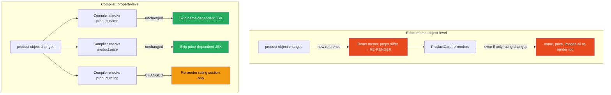
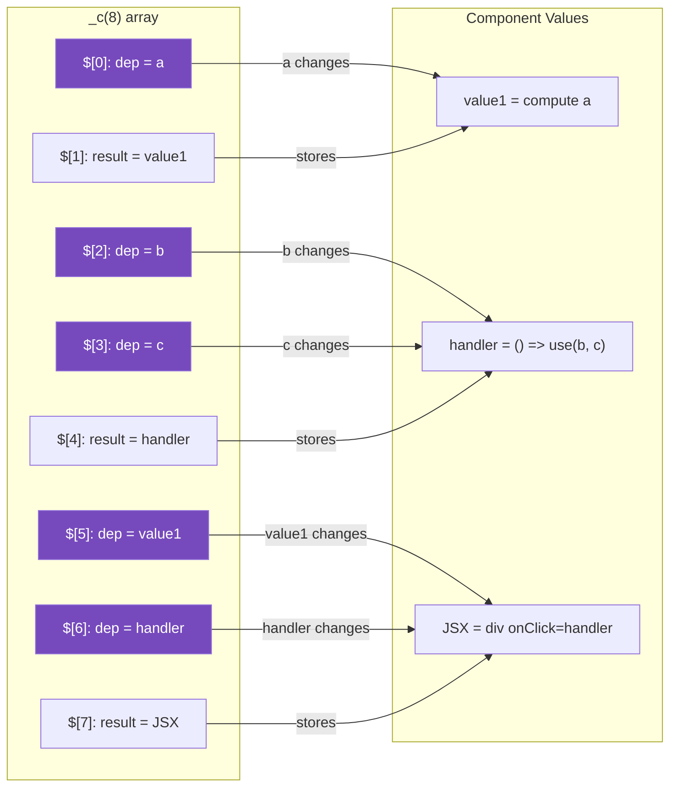

# 36 · Automatic Memoization

> **Automatic memoization is the React Compiler's primary output: it transforms natural component code into equivalent code where every recomputation is justified by an actual dependency change. Understanding what the compiler memoizes, how it decides scope boundaries, and what the generated code looks like at runtime is essential for writing code that compiles well and for diagnosing cases where the compiler cannot help.**

This document is a companion to [React Compiler Architecture](./01-compiler.md). Where that document explained how the compiler works internally, this one focuses on the memoization patterns it produces — the granular decisions about what to cache, when to invalidate, and how the generated cache checks compare to hand-written memoization.

---

## Table of Contents

- [The Four Things the Compiler Memoizes](#the-four-things-the-compiler-memoizes)
- [Granularity: Props vs Object Properties](#granularity-props-vs-object-properties)
- [Memoizing Derived Values](#memoizing-derived-values)
- [Memoizing Event Handlers](#memoizing-event-handlers)
- [Memoizing JSX Elements](#memoizing-jsx-elements)
- [Memoizing Entire Components](#memoizing-entire-components)
- [Scope Boundary Decisions](#scope-boundary-decisions)
- [Shared Dependency Optimization](#shared-dependency-optimization)
- [How Compiler Memoization Compares to Manual Memoization](#how-compiler-memoization-compares-to-manual-memoization)
- [The Cache Slot Allocation Strategy](#the-cache-slot-allocation-strategy)
- [Memoization and useEffect](#memoization-and-useeffect)
- [Memoization and Context](#memoization-and-context)
- [When Automatic Memoization Falls Short](#when-automatic-memoization-falls-short)
- [Diagnosing Missed Optimizations](#diagnosing-missed-optimizations)
- [Architecture Diagrams](#architecture-diagrams)
- [Good Practices](#good-practices)
- [Bad Practices](#bad-practices)
- [Mental Model](#mental-model)
- [Exercises](#exercises)
- [Further Reading](#further-reading)

---

## The Four Things the Compiler Memoizes

The React Compiler applies memoization to four categories of values in your components:

### 1. Computed values (replaces useMemo)

```tsx
// You write:
const sortedItems = items.sort((a, b) => a.priority - b.priority);

// Compiler generates:
let sortedItems;
if ($[0] !== items) {
  sortedItems = items.sort((a, b) => a.priority - b.priority);
  $[0] = items;
} else {
  sortedItems = $[1];
}
```

### 2. Event handlers and callbacks (replaces useCallback)

```tsx
// You write:
const handleDelete = (id: string) => onDelete(id, userId);

// Compiler generates:
let handleDelete;
if ($[0] !== onDelete || $[1] !== userId) {
  handleDelete = (id: string) => onDelete(id, userId);
  $[0] = onDelete;
  $[1] = userId;
} else {
  handleDelete = $[2];
}
```

### 3. JSX elements (no manual equivalent)

```tsx
// You write:
return <UserCard user={user} onEdit={handleEdit} />;

// Compiler generates:
let t0;
if ($[0] !== user || $[1] !== handleEdit) {
  t0 = <UserCard user={user} onEdit={handleEdit} />;
  $[0] = user;
  $[1] = handleEdit;
} else {
  t0 = $[2];
}
return t0;
```

### 4. Entire component renders (replaces React.memo)

When all of a component's outputs are stable (no dependencies changed), the compiler prevents even the JSX tree from being recreated:

```tsx
// If none of the component's deps changed:
// The entire return value is cached
// React receives the same JSX tree reference
// Reconciler bails out without calling the component
```

---

## Granularity: Props vs Object Properties

One of the compiler's key advantages over manual `React.memo`: it can track dependencies at the property level rather than the object level.

```tsx
// Manual React.memo: compares at the prop level
const MemoCard = React.memo(function Card({ product }: { product: Product }) {
  // React.memo checks: did 'product' reference change?
  // Even if only product.rating changed, if the product object is new → re-render
  return (
    <div>
      {product.name}: {product.price}
    </div>
  );
});

// Compiler: compares at the property level
function Card({ product }: { product: Product }) {
  // Compiler sees you only use product.name and product.price
  // Generated:
  let t0;
  if ($[0] !== product.name || $[1] !== product.price) {
    t0 = (
      <div>
        {product.name}: {product.price}
      </div>
    );
    $[0] = product.name;
    $[1] = product.price;
  } else {
    t0 = $[2];
  }
  return t0;
}

// When product.rating changes (but name and price don't):
// React.memo: re-renders (product object reference is new)
// Compiler: SKIPS re-render (only tracks name and price)
```

### Property access tracking in practice

```tsx
function UserProfile({ user }: { user: User }) {
  // Compiler tracks which properties you access:
  const displayName = user.displayName || user.name; // tracks .displayName and .name
  const avatarUrl = user.avatar.url; // tracks .avatar.url (deep)
  const isVerified = user.verification.status === "verified"; // tracks .verification.status

  // Generated cache check:
  // if ($[0] !== user.displayName || $[1] !== user.name ||
  //     $[2] !== user.avatar.url || $[3] !== user.verification.status)

  // When user.email changes (but above props don't): NO RE-RENDER
  // This is impossible to achieve with React.memo alone
}
```

> ⚠️ **Caveat:** The compiler's property-level tracking has limits. For deeply nested objects or dynamic property access (`user[dynamicKey]`), it may fall back to object-level comparison. The compiler's analysis is path-sensitive but not fully interprocedural.

---

## Memoizing Derived Values

The compiler creates separate reactive scopes for values with different dependency sets:

```tsx
function ReportDashboard({
  salesData,
  userMetrics,
  timeRange,
  currency,
}: ReportProps) {
  // Scope 1: depends on salesData and currency
  const totalRevenue = salesData.reduce((sum, s) => sum + s.amount, 0);
  const formattedRevenue = formatCurrency(totalRevenue, currency);

  // Scope 2: depends on userMetrics and timeRange
  const activeUsers = userMetrics.filter((u) => u.lastSeen > timeRange.start);
  const userGrowth = calculateGrowth(activeUsers, timeRange);

  // Scope 3: depends on outputs of Scope 1 and Scope 2
  const reportTitle = `Revenue: ${formattedRevenue} | Users: ${activeUsers.length}`;

  // Generated:
  // Scope 1 check: if ($[0] !== salesData.reduce... result or $[1] !== currency)
  // Scope 2 check: if ($[2] !== userMetrics || $[3] !== timeRange.start)
  // Scope 3 check: if ($[4] !== formattedRevenue || $[5] !== activeUsers.length)
}
```

When `currency` changes: only Scope 1 recomputes (and then Scope 3 because its dep changed).
When `timeRange` changes: only Scope 2 recomputes (and then Scope 3).
When `salesData` changes: Scope 1 recomputes, then Scope 3.

This is more granular than any `useMemo` chain you'd write manually — the compiler automatically identifies the minimal recomputation for each change.

---

## Memoizing Event Handlers

The compiler stabilizes event handlers at the right granularity:

```tsx
function TodoList({ todos, onToggle, onDelete, userId }: TodoListProps) {
  // Handler 1: depends only on onToggle
  const handleToggle = (id: string) => {
    onToggle(id);
  };
  // Generated: if ($[0] !== onToggle) { handleToggle = ...; $[0] = onToggle; }

  // Handler 2: depends on onDelete AND userId (closure over userId)
  const handleDelete = (id: string) => {
    onDelete(id, { deletedBy: userId });
  };
  // Generated: if ($[1] !== onDelete || $[2] !== userId) { handleDelete = ...; }

  // Handler 3: depends on nothing reactive (pure logic)
  const handleSort = () => {
    // No props or state referenced → no reactive deps
    console.log("sorted");
  };
  // Generated: if ($[3] === SENTINEL) { handleSort = ...; $[3] = DONE; }
  // (Computed once, never recomputed)
}
```

The compiler correctly identifies that `handleSort` has no reactive dependencies — it's computed once on first render and never invalidated. This is stricter than `useCallback(() => ..., [])` which is a manual assertion; the compiler proves it statically.

---

## Memoizing JSX Elements

JSX element memoization is where the compiler provides the most unique value — there is no manual equivalent without wrapping every child in `React.memo`:

```tsx
function ProductPage({ product, relatedProducts, onAddToCart }: PageProps) {
  // The compiler generates separate memoization for each JSX element:

  // Memoize <ProductHeader />:
  // Only re-created when product.name, product.category, or product.images changes
  let productHeader;
  if (
    $[0] !== product.name ||
    $[1] !== product.category ||
    $[2] !== product.images
  ) {
    productHeader = (
      <ProductHeader
        name={product.name}
        category={product.category}
        images={product.images}
      />
    );
    $[0] = product.name;
    $[1] = product.category;
    $[2] = product.images;
  } else {
    productHeader = $[3];
  }

  // Memoize <PriceDisplay />:
  // Only re-created when product.price or product.currency changes
  let priceDisplay;
  if ($[4] !== product.price || $[5] !== product.currency) {
    priceDisplay = (
      <PriceDisplay price={product.price} currency={product.currency} />
    );
    $[4] = product.price;
    $[5] = product.currency;
  } else {
    priceDisplay = $[6];
  }

  // The critical result: when product.price changes but product.name doesn't:
  // → productHeader is the SAME object reference as last render
  // → React reconciler sees same ref → bails out on ProductHeader render
  // → priceDisplay is a new object → PriceDisplay re-renders
  // This is granular, automatic, per-element optimization
}
```

### The JSX memoization chain

JSX memoization is hierarchical — parent elements are only recreated when their children change:

```tsx
// If ProductHeader JSX is cached (same ref):
// → The parent <div> JSX that contains it checks:
//   if ($[X] !== productHeader || ...) → since productHeader is the same ref, it may not recreate the div

// This cascades: a stable leaf component stabilizes everything above it
// The tree is only invalidated where actual changes occurred
```

---

## Memoizing Entire Components

When a component's props map to completely stable outputs, the compiler can memoize the entire render — equivalent to `React.memo` but without the explicit wrapper:

```tsx
// This component:
function Badge({ label, color }: { label: string; color: string }) {
  return (
    <span style={{ color }} className="badge">
      {label}
    </span>
  );
}

// After compilation: essentially equivalent to React.memo(Badge)
// The entire JSX return value is cached based on label and color
// If parent re-renders without changing these: Badge doesn't re-render

// The difference from React.memo:
// React.memo: prop-level comparison (label as a whole, color as a whole)
// Compiler: same, but integrated into the component — no wrapper component in the tree
```

---

## Scope Boundary Decisions

The compiler makes specific decisions about where to draw scope boundaries. These decisions affect how granular the caching is:

### Decision 1: Inlining vs separate scope

```tsx
// Short computations may be inlined into their usage scope:
function Component({ items }: Props) {
  // These might be one scope:
  const count = items.length; // used immediately in JSX
  return <div>Count: {count}</div>;
  // Compiler may generate: if ($[0] !== items.length) { ... }
  // Rather than: compute count separately, then check count in JSX scope

  // Why: caching count separately from JSX adds overhead with no benefit
  // The JSX already tracks items.length → count is redundant
}
```

### Decision 2: Scope splitting at control flow

```tsx
function Component({ items, filter }: Props) {
  // Branch affects scope boundaries:
  let processed;
  if (filter === "active") {
    processed = items.filter((i) => i.active);
    // Scope A: [items, filter] when filter='active'
  } else {
    processed = items.filter((i) => !i.active);
    // Scope B: [items, filter] when filter!='active'
  }
  // Both branches have same deps: [items, filter]
  // Compiler may generate a single check: if ($[0] !== items || $[1] !== filter)
}
```

### Decision 3: Early computation for loop bodies

```tsx
function ItemList({ items }: { items: Item[] }) {
  return (
    <ul>
      {items.map((item, index) => (
        // Each list item's JSX:
        // Compiler generates a scope per iteration
        // Key-stable elements reuse their cached JSX
        <li key={item.id}>
          {item.name}: {item.value}
        </li>
      ))}
    </ul>
  );
}
// With stable keys: items that don't change don't re-render their <li> elements
// Equivalent to: each <li> being wrapped in React.memo with {item.name, item.value}
```

---

## Shared Dependency Optimization

When multiple values share the same dependencies, the compiler groups them into a single scope to avoid redundant cache checks:

```tsx
function UserSummary({ user }: { user: User }) {
  // Three values all depend on user.name:
  const greeting = `Hello, ${user.name}`;
  const initials = user.name
    .split(" ")
    .map((n) => n[0])
    .join("");
  const slug = user.name.toLowerCase().replace(/\s+/g, "-");

  // Compiler generates ONE check for all three:
  let greeting_computed, initials_computed, slug_computed;
  if ($[0] !== user.name) {
    greeting_computed = `Hello, ${user.name}`;
    initials_computed = user.name
      .split(" ")
      .map((n) => n[0])
      .join("");
    slug_computed = user.name.toLowerCase().replace(/\s+/g, "-");
    $[0] = user.name;
    $[1] = greeting_computed;
    $[2] = initials_computed;
    $[3] = slug_computed;
  } else {
    greeting_computed = $[1];
    initials_computed = $[2];
    slug_computed = $[3];
  }

  // One `if` instead of three separate useMemo calls
  // Fewer cache checks = lower overhead
}
```

This is more efficient than three separate `useMemo` calls — each `useMemo` has its own hook node traversal, comparison, and potential invalidation. The compiler's single scope reduces this to one check for all three values.

---

## How Compiler Memoization Compares to Manual Memoization

### Comparison table

| Aspect                      | Manual (useMemo/useCallback/React.memo)         | React Compiler                            |
| --------------------------- | ----------------------------------------------- | ----------------------------------------- |
| **Dependency tracking**     | Manual — you decide deps                        | Automatic — compiler analyzes             |
| **Granularity**             | Object-level for React.memo, custom for useMemo | Property-level via static analysis        |
| **JSX memoization**         | Requires React.memo on child component          | Per-element, no wrapper needed            |
| **Dependency correctness**  | Human error (missing/extra deps)                | Provably correct (compiler sees all uses) |
| **Over-invalidation risk**  | Common (broad dep arrays)                       | Low (compiler uses minimal deps)          |
| **Under-invalidation risk** | Common (missing deps → stale closures)          | None (compiler is exhaustive)             |
| **Code verbosity**          | High (useMemo/useCallback everywhere)           | Zero (natural code)                       |
| **Runtime overhead**        | Each useMemo = 1 hook node + comparison         | \_c array + if/else (lower overhead)      |

### Overhead comparison

```tsx
// Manual useMemo:
const price = useMemo(() => formatPrice(amount, currency), [amount, currency]);
// Cost: hook node traversal (pointer chase) + areHookInputsEqual + cache lookup
// Per render: ~3-5 operations

// Compiler output:
let price;
if ($[0] !== amount || $[1] !== currency) {
  price = formatPrice(amount, currency);
  $[0] = amount;
  $[1] = currency;
  $[2] = price;
} else {
  price = $[2];
}
// Cost: array indexing + comparison
// Per render: ~2 operations (faster than useMemo)
```

The compiler's output is faster than manual `useMemo` in the cache-hit case because it skips the hook machinery entirely.

---

## The Cache Slot Allocation Strategy

The `_c(N)` call allocates exactly N slots. The compiler calculates N at compile time by counting all the values that need to be cached:

```tsx
function Component({ a, b, c }: Props) {
  // Slot 0: dep for value1 (a)
  // Slot 1: result for value1
  const value1 = compute(a); // 2 slots

  // Slot 2: dep for handler (b, c)
  // Slot 3: dep for handler (b, c)
  // Slot 4: result for handler
  const handler = () => use(b, c); // 3 slots (2 deps + result)

  // Slot 5: dep for JSX (value1)
  // Slot 6: dep for JSX (handler)
  // Slot 7: result for JSX
  return <div onClick={handler}>{value1}</div>; // 3 slots

  // Total: 8 slots → _c(8)
}
```

The compiler packs slots densely — one array access is cheaper than one `useMemo` call (which traverses the hook linked list). For a component with 10 memoized values, the compiler's single `_c(N)` array costs one allocation vs 10 hook node allocations.

---

## Memoization and useEffect

The compiler memoizes values but does not change useEffect behavior. Effects still declare their own dependencies — the compiler can help by providing stable references, which reduces unnecessary effect re-runs:

```tsx
function DataLoader({ config, onLoaded }: Props) {
  // Without compiler: fetchUrl is a new string on every render if config.id changes
  // With compiler: fetchUrl is memoized based on config.id
  const fetchUrl = `/api/data/${config.id}`;

  // handleLoaded: memoized based on onLoaded reference
  const handleLoaded = (data: Data) => onLoaded(data);

  useEffect(() => {
    fetch(fetchUrl)
      .then((r) => r.json())
      .then(handleLoaded);
  }, [fetchUrl, handleLoaded]);
  // fetchUrl: stable until config.id changes → effect doesn't re-run spuriously
  // handleLoaded: stable until onLoaded changes → same
}
```

The compiler's memoization reduces the frequency of effect re-runs by providing stable dependency values — but you still need to correctly list dependencies.

> ⚠️ **The compiler does not add or remove useEffect dependencies.** This is a deliberate design decision: effect dependencies are semantic (what should trigger re-synchronization), not just performance (what changed). The compiler handles the performance layer; you handle the semantic layer.

---

## Memoization and Context

The compiler memoizes values derived from context, but context reading itself is not memoized — a context value change will still cause the component to re-render:

```tsx
const ThemeContext = React.createContext<Theme>({ mode: "light", colors: {} });

function ThemedButton({ label, onClick }: ButtonProps) {
  const theme = useContext(ThemeContext);

  // Compiler memoizes the style computation:
  // if ($[0] !== theme.mode || $[1] !== theme.colors.primary) {
  //   style = { ... }
  // }
  const style = {
    backgroundColor: theme.colors.primary,
    color: theme.mode === "dark" ? "white" : "black",
  };

  // But: when ThemeContext.Provider value changes (any property):
  // → React marks ThemedButton for re-render (context consumer)
  // → Component function runs
  // → Compiler checks: did theme.mode or theme.colors.primary change?
  // → If no: style is cached, JSX is cached → minimal DOM work
  // → If yes: style recomputed, JSX recreated
}
```

The compiler provides efficient handling of the render that context forces — it doesn't prevent that render, but makes it cheaper when the used properties didn't change.

---

## When Automatic Memoization Falls Short

The compiler cannot memoize across component boundaries or in non-component code:

```tsx
// ❌ Outside components: not compiled
function processData(items: Item[]): ProcessedItem[] {
  // This runs on every call — compiler doesn't touch utility functions
  return items.map((item) => ({ ...item, processed: true }));
}

// ✅ Inside components: compiled
function DataComponent({ items }: Props) {
  // Compiler memoizes this:
  const processed = processData(items); // memoized when 'items' is stable
}
```

### Large computation in utility functions

```tsx
// The compiler cannot memoize inside processData itself:
function processData(items: Item[]): ProcessedItem[] {
  return items
    .filter((i) => i.active) // not memoized
    .map((i) => transform(i)) // not memoized
    .sort((a, b) => a.order - b.order); // not memoized
}

// But the call site IS memoized:
function Component({ items }: Props) {
  const result = processData(items);
  // Compiler: if ($[0] !== items) { result = processData(items); ... }
  // processData itself runs completely — only its call is memoized
}
```

For expensive utility functions that need internal memoization: the compiler doesn't help. Use a library-level cache (TanStack Query, SWR) or a manual `useMemo` for the specific expensive step.

---

## Diagnosing Missed Optimizations

When the compiler can't optimize a component, it may emit a warning in the bundle:

```bash
# Build output with compiler enabled:
Module src/components/ComplexChart.tsx: ReactCompilerBailout
  Reason: Cannot analyze: dynamic property access `data[userKey]`
  Line 45, Column 12

# Other common bail-out messages:
  "Mutating a value after it was read"
  "Calling a hook conditionally"
  "Side effect in render"
```

### Checking optimized vs unoptimized components

```tsx
// Dev tool: add a render counter to identify if a component is over-rendering
function DebugComponent({ value }: { value: string }) {
  const renderCount = useRef(0);
  renderCount.current++;

  if (process.env.NODE_ENV === "development") {
    console.log(`DebugComponent render #${renderCount.current}`, { value });
  }

  return <div>{value}</div>;
}

// If renderCount increments when value doesn't change:
// → Compiler didn't optimize this component
// → Check: does the component follow React's rules?
// → Run: npx react-compiler-healthcheck
```

### The React DevTools compiler badge

React DevTools (v5+) shows a badge on components that were compiled:

- ⚡ badge = compiled and optimized
- No badge = not compiled (may or may not be a problem)

---

## Architecture Diagrams

### Granular dependency tracking: compiler vs React.memo



### Cache slot allocation



---

## Good Practices

### ✅ Good Practice — Destructure at the right level for granular memoization

```tsx
/**
 * Good: Destructuring exposes the specific properties you use.
 * The compiler can track at the property level, not the object level.
 * When user.email changes but name/role don't: no re-render.
 */
function UserChip({
  user: { name, role, avatarUrl }, // destructure to expose properties
  onSelect,
}: UserChipProps) {
  // Compiler sees: name, role, avatarUrl, onSelect are the reactive values
  // NOT: user (the whole object)

  const initials = name
    .split(" ")
    .map((c) => c[0])
    .join("")
    .toUpperCase();
  const isAdmin = role === "admin";

  const handleClick = () => onSelect(name);

  return (
    <button
      className={`chip ${isAdmin ? "chip--admin" : ""}`}
      onClick={handleClick}
    >
      
      <span>{initials}</span>
    </button>
  );
}

// Compare to NOT destructuring:
function UserChipBad({
  user,
  onSelect,
}: {
  user: User;
  onSelect: (name: string) => void;
}) {
  // Compiler: user is the reactive value (object-level)
  // When any property of user changes → full recompute
  // Less granular than destructured version
  const initials = user.name
    .split(" ")
    .map((c) => c[0])
    .join("")
    .toUpperCase();
  // ...
}
```

**Why this matters:** With destructuring, the compiler tracks `name`, `role`, and `avatarUrl` as separate reactive values. When `user.email` changes, only those specific properties are checked — and since they haven't changed, the entire component output is cached. Without destructuring, the compiler must conservatively track `user` as a whole object.

---

## Bad Practices

### ⚠️ Bad Practice — Undermining compiler optimization with unstable object creation

```tsx
/**
 * Bad: Creating objects/arrays in parent scope that are passed as props.
 * Even if the compiler memoizes the child component, the parent passes
 * new object references on every render — invalidating the child's cache.
 *
 * This is the one pattern where the compiler CANNOT help:
 * it compiles each component independently, not across boundaries.
 */
function ParentComponent({ items }: { items: Item[] }) {
  const [count, setCount] = useState(0);

  return (
    <>
      <button onClick={() => setCount((c) => c + 1)}>Count: {count}</button>

      {/* ❌ New config object on every parent render */}
      <ChildComponent
        items={items}
        config={{ pageSize: 20, sortBy: "name" }} // new object every render!
      />
      {/* Even though ChildComponent is compiled, its cache check for 'config' fails:
          $[X] !== { pageSize: 20, sortBy: 'name' }  → always true → always recomputes */}
    </>
  );
}

/**
 * ✅ Fix: Stable object reference — compiler's cache check succeeds
 */
const DEFAULT_CONFIG = { pageSize: 20, sortBy: "name" }; // module-level: stable

function ParentComponent({ items }: { items: Item[] }) {
  const [count, setCount] = useState(0);

  return (
    <>
      <button onClick={() => setCount((c) => c + 1)}>Count: {count}</button>

      {/* ✅ Stable config reference — child's cache check succeeds when items unchanged */}
      <ChildComponent items={items} config={DEFAULT_CONFIG} />
    </>
  );
}
```

**The key insight:** The compiler works within a component's boundary. If the parent passes unstable references (new objects on every render), the child's compiled cache checks will always fail — even if the child is perfectly compiled. Cross-component stability still requires care from the parent.

---

## Mental Model

> 💡 **The automatic memoization mental model:**
>
> Think of the compiler as a **professional photographer reviewing your photo album**. You (the developer) take photos (write components). The photographer analyzes each photo: "This section only changed because of the light — the subject is the same. This section is entirely new." The photographer then marks which parts of the album can be reprinted from the existing negative (cache hit) and which need a new photo (recompute). The photographer is more careful than you would be — they track exactly which pixels changed (property-level), not just which pages look different (object-level). But: if you hand the photographer a blurry, badly-lit photo (impure component with mutations), they can't work with it. The quality of the automation depends on the quality of the input.

---

## Exercises

### Exercise 1 — Compare compiled output for object vs property deps

Build two versions of a component:

```tsx
// Version A: receives full object
function CardA({ product }: { product: Product }) {
  return (
    <div>
      {product.name}: {product.price}
    </div>
  );
}

// Version B: destructures
function CardB({ product: { name, price } }: { product: Product }) {
  return (
    <div>
      {name}: {price}
    </div>
  );
}
```

Enable the compiler and inspect the output. Count how many `$[X]` comparisons each version generates. Which tracks more granularly?

### Exercise 2 — Trace a memoization miss

```tsx
function Parent() {
  const [x, setX] = useState(0);

  // This will cause ChildComponent's cache to miss every render:
  const unstableConfig = { value: x }; // new object every render

  return (
    <div>
      <button onClick={() => setX((v) => v + 1)}>Increment</button>
      <ChildComponent config={unstableConfig} />
    </div>
  );
}

function ChildComponent({ config }: { config: { value: number } }) {
  // Even though this is compiled:
  const processed = heavyComputation(config.value);
  return <div>{processed}</div>;
}
```

Add a render counter to `ChildComponent`. Observe: does it re-render on every parent render? Now make `unstableConfig` stable (either `useMemo` or move outside component). Does the child re-render count drop?

### Exercise 3 — Find the compilation scope boundaries

Enable the compiler in your app and view the JavaScript bundle (unminified). Find a compiled component and:

1. Count the `_c(N)` allocation — how many slots?
2. Identify each `if ($[X] !== ...)` block — what are the scopes?
3. Match each scope to the source code — which lines of source code correspond to each scope?
4. Verify: do the scopes correctly minimize recomputation?

---

## Further Reading

- [React Compiler Playground](https://playground.react.dev/) — See compiler output in real time
- [React Compiler docs: Writing Compilable Code](https://react.dev/learn/react-compiler#writing-react-compiler-friendly-code) — What to avoid
- [Lauren Tan: React Without useMemo (ReactConf 2024)](https://www.youtube.com/watch?v=qOQClO3g8-Y) — Memoization patterns talk
- [react-compiler-healthcheck](https://www.npmjs.com/package/react-compiler-healthcheck) — Scan for bail-outs
- Next in this handbook: [37 · The Future of React](./03-future-react.md)

---

_Part of the [React + Next.js Engineering Handbook](../../README.md)_
