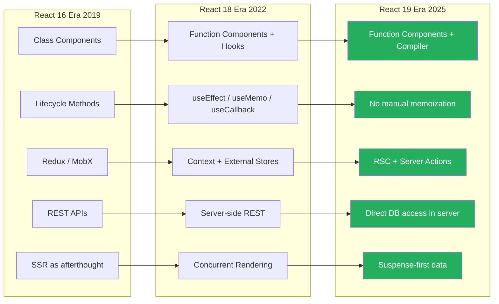
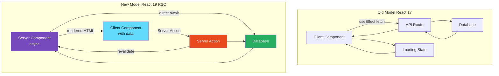

# 37 · The Future of React

> **React 19 is the most significant React release since Hooks in 2016. It ships the compiler, Server Actions, the `use` hook, form actions, optimistic updates, and a refined mental model for the boundary between server and client. Beyond React 19, the React team's stated roadmap points toward a world where the framework-level distinction between "React" and "Next.js" (or any other framework) narrows further, and where the compiler eliminates the remaining rough edges of the hooks model. This document maps what is shipping, what is in active development, and what the trajectory implies for how you write React in 2025 and beyond.**

Understanding where React is going shapes the investments worth making today. Some patterns being adopted now (manual memoization, useEffect for data fetching, client-only thinking) are on a direct collision course with the direction React is heading. Others (composable server/client boundaries, Suspense-driven loading states, compiler-friendly code) are precisely aligned with the roadmap.

---

## Table of Contents

- [React 19: What Actually Shipped](#react-19-what-actually-shipped)
- [The use Hook](#the-use-hook)
- [Server Actions](#server-actions)
- [Form Actions and useFormStatus](#form-actions-and-useformstatus)
- [useOptimistic](#useoptimistic)
- [Document Metadata APIs](#document-metadata-apis)
- [Improved Error Reporting](#improved-error-reporting)
- [ref as a Prop](#ref-as-a-prop)
- [The Activity API (formerly Offscreen)](#the-activity-api-formerly-offscreen)
- [React Compiler: Stable in 2025](#react-compiler-stable-in-2025)
- [The Server Component Mental Model Shift](#the-server-component-mental-model-shift)
- [What useEffect Is Evolving Into](#what-useeffect-is-evolving-into)
- [The Long-Term Trajectory](#the-long-term-trajectory)
- [Implications for Your Architecture Today](#implications-for-your-architecture-today)
- [Architecture Diagrams](#architecture-diagrams)
- [What to Stop Doing](#what-to-stop-doing)
- [What to Start Doing](#what-to-start-doing)
- [Mental Model](#mental-model)
- [Exercises](#exercises)
- [Further Reading](#further-reading)

---

## React 19: What Actually Shipped

React 19 shipped as stable in December 2024. The headline features:

| Feature            | Status    | Description                                 |
| ------------------ | --------- | ------------------------------------------- |
| React Compiler     | Beta → RC | Automatic memoization                       |
| Server Components  | Stable    | Zero-bundle server rendering                |
| Server Actions     | Stable    | Server functions callable from client       |
| `use()` hook       | Stable    | Read Promises and Context conditionally     |
| Form Actions       | Stable    | Native form handling with Actions           |
| `useFormStatus`    | Stable    | Form submission state                       |
| `useOptimistic`    | Stable    | Optimistic UI updates                       |
| `useActionState`   | Stable    | Action state management                     |
| Document metadata  | Stable    | `<title>`, `<meta>`, `<link>` in components |
| ref as prop        | Stable    | No more forwardRef                          |
| Async transitions  | Stable    | Async functions in startTransition          |
| Improved hydration | Stable    | Third-party script compatibility            |

---

## The use Hook

`use` is the most conceptually significant addition to the hooks API since the original Hooks release. Unlike all other hooks, `use` can be called conditionally:

```tsx
import { use, Suspense } from "react";

// use() with a Promise: reads the resolved value, throws if pending
function UserProfile({ userPromise }: { userPromise: Promise<User> }) {
  // Can be called conditionally — valid with use()
  const user = use(userPromise);
  return <h1>{user.name}</h1>;
}

// use() with Context: reads context value
// (Alternative to useContext — same result, different syntax)
function ThemedComponent() {
  const theme = use(ThemeContext);
  return <div className={theme.mode}>...</div>;
}

// Conditional use() — impossible with useContext
function DataDisplay({
  dataPromise,
  show,
}: {
  dataPromise: Promise<Data>;
  show: boolean;
}) {
  if (!show) return null; // early return before use() — valid!

  const data = use(dataPromise); // conditionally called — valid with use()
  return <pre>{JSON.stringify(data)}</pre>;
}
```

### Why use() matters architecturally

`use` enables a pattern that was previously impossible: passing Promises as props and reading them deep in the tree without prop drilling:

```tsx
// Server component creates the promise and passes it down
async function Page({ id }: { id: string }) {
  // Start fetching without awaiting — promise created immediately
  const userPromise = fetchUser(id);

  return (
    <Suspense fallback={<Skeleton />}>
      <UserSection userPromise={userPromise} />
    </Suspense>
  );
}

// Client component receives and reads the promise
function UserSection({ userPromise }: { userPromise: Promise<User> }) {
  const user = use(userPromise); // reads or suspends
  return <UserCard user={user} />;
}
```

The promise is initiated at the top of the server component tree (immediately) and read wherever needed in the client tree. This is the React-native version of query prefetching — no library needed.

### use() vs useSuspenseQuery

```tsx
// use(): fine-grained control, manual caching required
const data = use(fetchData(id));
// No deduplication, no background revalidation, no cache

// TanStack Query (useSuspenseQuery): production-ready
const { data } = useSuspenseQuery({
  queryKey: ["data", id],
  queryFn: () => fetchData(id),
});
// Deduplication, background refetch, cache invalidation, devtools
```

For most production use cases, use a Suspense-compatible library. `use()` is the primitive that libraries build on.

---

## Server Actions

Server Actions are async functions that run on the server, callable from client components. They're the React-native solution to the "how do clients trigger server-side mutations" problem:

```tsx
// app/actions.ts — Server Action
"use server";

export async function updateUserProfile(formData: FormData) {
  const name = formData.get("name") as string;
  const bio = formData.get("bio") as string;

  // Runs on the server — can access databases, environment variables, etc.
  await db.users.update({ where: { id: session.userId }, data: { name, bio } });

  // Triggers revalidation of cached data
  revalidatePath("/profile");
}

// Client component — calls the Server Action
("use client");
import { updateUserProfile } from "./actions";
import { useActionState } from "react";

function ProfileForm({ user }: { user: User }) {
  const [state, formAction, isPending] = useActionState(updateUserProfile, {
    error: null,
  });

  return (
    <form action={formAction}>
      <input name="name" defaultValue={user.name} />
      <textarea name="bio" defaultValue={user.bio} />
      <button type="submit" disabled={isPending}>
        {isPending ? "Saving..." : "Save Profile"}
      </button>
      {state.error && <p className="error">{state.error}</p>}
    </form>
  );
}
```

### What Server Actions replace

```
Before React 19:
  Client → fetch('/api/update-profile', { method: 'POST', body: ... }) → API Route → DB
  Required: manual API route, fetch boilerplate, error handling, loading state

After React 19:
  Client → Server Action (automatic serialization, transport, error handling)
  Required: one async function with 'use server'

The abstraction collapses: no API route definition, no fetch call, no JSON serialization
```

### Server Actions with transitions

Server Actions integrate seamlessly with `useTransition`:

```tsx
function ActionButton({ id }: { id: string }) {
  const [isPending, startTransition] = useTransition();

  const handleClick = () => {
    startTransition(async () => {
      await deleteItem(id); // Server Action — awaitable in transition
      // isPending = true until the Server Action resolves AND re-render commits
    });
  };

  return (
    <button onClick={handleClick} disabled={isPending}>
      {isPending ? "Deleting..." : "Delete"}
    </button>
  );
}
```

`isPending` now covers the full lifecycle: click → network request → server processing → client re-render → commit. This is a significant ergonomic improvement over manual loading state management.

---

## Form Actions and useFormStatus

React 19 restores native HTML form semantics while adding React-friendly state management:

```tsx
// Form Actions: the action prop now accepts a function (not just a URL)
function SearchForm() {
  async function searchAction(formData: FormData) {
    "use server";
    const query = formData.get("q") as string;
    // Process on server
    redirect(`/search?q=${encodeURIComponent(query)}`);
  }

  return (
    <form action={searchAction}>
      <input name="q" placeholder="Search..." />
      <SubmitButton /> {/* Child can read form state */}
    </form>
  );
}

// useFormStatus: reads the parent form's pending state
// No prop drilling — directly reads form context
import { useFormStatus } from "react-dom";

function SubmitButton() {
  const { pending, data, method, action } = useFormStatus();
  // pending: true while form is submitting
  // data: the FormData being submitted
  // method: 'get' or 'post'
  // action: the action URL or function

  return (
    <button type="submit" disabled={pending}>
      {pending ? "Searching..." : "Search"}
    </button>
  );
}
```

### useFormStatus's implementation note

`useFormStatus` uses a Context-like mechanism to read the nearest parent form's state. It is designed to work across component boundaries — `SubmitButton` doesn't need to receive `isPending` as a prop.

```tsx
// This works even when SubmitButton is deeply nested:
function SearchForm() {
  return (
    <form action={serverAction}>
      <FormHeader />
      <FormBody>
        <FormSection>
          <SubmitButton /> {/* reads useFormStatus — no prop drilling */}
        </FormSection>
      </FormBody>
    </form>
  );
}
```

---

## useOptimistic

`useOptimistic` enables optimistic UI updates — showing the expected result immediately while the server processes the request:

```tsx
import { useOptimistic, useTransition } from "react";

function TodoList({ todos }: { todos: Todo[] }) {
  const [isPending, startTransition] = useTransition();

  // useOptimistic: current state, update function
  const [optimisticTodos, addOptimisticTodo] = useOptimistic(
    todos,
    (currentTodos, newTodo: Todo) => [...currentTodos, newTodo],
  );

  const handleAdd = (text: string) => {
    const newTodo = { id: Date.now(), text, completed: false };

    startTransition(async () => {
      // Optimistically add immediately
      addOptimisticTodo(newTodo);

      // Send to server (may succeed or fail)
      await createTodo(text); // Server Action

      // After Server Action:
      // - If success: server data refetches → real todo replaces optimistic
      // - If error: optimistic todo is removed, error shown
    });
  };

  return (
    <ul>
      {optimisticTodos.map((todo) => (
        <li
          key={todo.id}
          className={todo.id === Date.now() ? "optimistic" : ""}
        >
          {todo.text}
        </li>
      ))}
    </ul>
  );
}
```

### How useOptimistic works internally

```js
// useOptimistic is built on useState and transitions:
function useOptimistic(passthrough, reducer) {
  // When inside a transition: use optimistic value
  // When transition completes: revert to passthrough value
  // On server action success: passthrough updates → optimistic aligns
  // On server action error: optimistic is discarded → passthrough (unchanged) shown
}
```

The optimistic state is automatically discarded when the transition commits (whether success or error). The real server state takes precedence. This is the core of optimistic UI — show what you expect, correct if wrong.

---

## Document Metadata APIs

React 19 allows `<title>`, `<meta>`, and `<link>` elements anywhere in the component tree — React hoists them to `<head>` automatically:

```tsx
// Client Component — metadata hoisted to <head>
function ProductPage({ product }: { product: Product }) {
  return (
    <>
      {/* React hoists these to <head> — works in client components */}
      <title>{product.name} | MyShop</title>
      <meta name="description" content={product.description} />
      <meta property="og:image" content={product.imageUrl} />
      <link
        rel="canonical"
        href={`https://myshop.com/products/${product.slug}`}
      />

      <div className="product-page">
        <h1>{product.name}</h1>
        {/* ... */}
      </div>
    </>
  );
}
```

This eliminates the need for libraries like `react-helmet` or Next.js's `<Head>` component for many use cases.

```tsx
// Server Component — metadata rendered server-side (better for SEO)
async function ProductPage({ params }: { params: { slug: string } }) {
  const product = await fetchProduct(params.slug);

  return (
    <>
      <title>{product.name}</title>
      <meta name="description" content={product.description} />
      <ProductContent product={product} />
    </>
  );
}
```

---

## Improved Error Reporting

React 19 significantly improves error reporting, particularly for hydration mismatches:

```
Before React 19 hydration error:
  "Text content did not match. Server: 'Hello World' Client: 'Hello World!'"
  (Minimal context — hard to locate the source component)

After React 19 hydration error:
  Hydration failed because the server rendered HTML didn't match the client.
  As a result this tree will be regenerated on the client. This can happen if
  a SSR-ed Client Component used:
  - A server/client branch `if (typeof window !== 'undefined')`.
  - Variable input such as `Date.now()` or `Math.random()` which changes each time it's called.
  - Date formatting in a user's locale which doesn't match the server.
  ...

  Component stack:
    at MyComponent (./src/components/MyComponent.tsx:45)
    at Layout (./src/app/layout.tsx:12)
```

React 19 also decouples error handling — provides separate callbacks for caught vs uncaught errors:

```tsx
ReactDOM.createRoot(container, {
  onCaughtError(error, errorInfo) {
    // Error caught by an Error Boundary — log as warning
    console.warn("Caught by Error Boundary:", error, errorInfo.componentStack);
  },
  onUncaughtError(error, errorInfo) {
    // Error not caught — report to error tracking
    Sentry.captureException(error, {
      extra: { componentStack: errorInfo.componentStack },
    });
  },
  onRecoverableError(error, errorInfo) {
    // Hydration mismatch — recovered but log it
    console.log("Recovered from:", error);
  },
});
```

---

## ref as a Prop

`forwardRef` is gone in React 19. `ref` is now a regular prop:

```tsx
// React 18: required forwardRef
const Input = React.forwardRef<HTMLInputElement, InputProps>((props, ref) => {
  return <input ref={ref} {...props} />;
});

// React 19: ref is a regular prop
function Input({
  ref,
  ...props
}: InputProps & { ref?: React.Ref<HTMLInputElement> }) {
  return <input ref={ref} {...props} />;
}

// Or with the new type helper:
function Input(props: React.ComponentProps<"input">) {
  return <input {...props} />;
  // ref is included in ComponentProps<'input'>
}

// Usage: identical in both versions
const inputRef = useRef<HTMLInputElement>(null);
<Input ref={inputRef} placeholder="Enter text" />;
```

This simplification removes a React-specific concept that confused many developers. The `forwardRef` wrapper exists in React 18 for backward compatibility but generates a deprecation warning.

---

## The Activity API (formerly Offscreen)

The Activity API (previously called "Offscreen") allows React to pre-render components that aren't visible yet, and to keep components mounted but hidden — preserving their state without showing them:

```tsx
import { Activity } from "react"; // API name may change

function TabContainer() {
  const [activeTab, setActiveTab] = useState("home");

  return (
    <>
      <TabBar active={activeTab} onChange={setActiveTab} />

      {/* Tab content: pre-rendered, state preserved when hidden */}
      <Activity mode={activeTab === "home" ? "visible" : "hidden"}>
        <HomeTab />
      </Activity>

      <Activity mode={activeTab === "profile" ? "visible" : "hidden"}>
        <ProfileTab />
      </Activity>

      <Activity mode={activeTab === "settings" ? "visible" : "hidden"}>
        <SettingsTab />
      </Activity>
    </>
  );
}
```

### Activity mode semantics

```
mode="visible":
  - Renders normally
  - Fully interactive
  - All effects run

mode="hidden":
  - Not visible in DOM (display: none equivalent)
  - State preserved (unlike unmounting)
  - Effects are deactivated (like a sleeping component)
  - Can be "woken up" quickly when switched to visible

mode="manual":
  - Application controls visibility via imperative API
  - Used for fine-grained control (popups, overlays)
```

### Use cases for Activity

```tsx
// 1. Tab panels: preserve scroll position and form state when switching tabs
// 2. Drawer/sidebar: keep mounted for animation, hide when closed
// 3. Background prefetching: pre-render likely-next-page at idle priority
// 4. Modal preservation: modal state preserved when closed, restored when opened
// 5. Multi-step forms: previous steps' state preserved while navigating
```

Activity is currently experimental and the exact API may change, but it ships in a stable form in React 19 for specific use cases.

---

## React Compiler: Stable in 2025

The React Compiler reached production stability at Meta in 2024 and is targeting a stable release for the broader community in 2025:

```
Timeline:
  2021: "React Forget" announced at React Conf
  2022-2023: Internal development and testing at Meta
  2024: Facebook.com and Instagram migrated; compiler goes public beta
  2024 Q4: Ships as part of React 19 RC
  2025: Stable release; bundled into create-react-app, Vite plugin, Next.js by default
```

### What "stable compiler" changes

When the compiler is stable and widely adopted:

- The `useMemo`, `useCallback`, and `React.memo` APIs remain but are rarely needed
- New codebases start without manual memoization
- ESLint rules for exhaustive-deps become less critical (compiler tracks deps)
- The mental model shifts: "write correct React, performance follows"

---

## The Server Component Mental Model Shift

The biggest conceptual shift in modern React is the server/client boundary. React Server Components fundamentally change the question "where does this code run?":

```
Old model (React 17 and below):
  All components run in the browser
  Server = just an HTML string generator (SSR)
  Client = the "real" app

New model (React 18+ with RSC):
  Components can run on the server OR the client
  Server components: async, no hooks, direct data access
  Client components: hooks, interactivity, browser APIs
  Both: identical JSX syntax, React rendering model

The boundary is explicit:
  'use client' → client component (and all children)
  No directive → server component (in RSC frameworks)
```

### The composition model

```tsx
// Server Component: can be async, no hooks
async function ProductList() {
  const products = await db.products.findMany({ limit: 20 });
  return (
    <div>
      {products.map((product) => (
        // Can nest Client Components inside Server Components
        <ProductCard key={product.id} product={product} />
      ))}
    </div>
  );
}

// Client Component: can use hooks, handle events
("use client");
function ProductCard({ product }: { product: Product }) {
  const [isWishlisted, setIsWishlisted] = useState(false);

  return (
    <div>
      <h2>{product.name}</h2>
      <button onClick={() => setIsWishlisted((v) => !v)}>
        {isWishlisted ? "❤️" : "🤍"}
      </button>
    </div>
  );
}
```

### What RSC eliminates

```
Problems RSC solves at the framework level:

1. Waterfall data fetching:
   Old: Component mounts → useEffect fires → fetch → loading state → render
   New: Server component awaits data → renders with data → client receives complete HTML

2. Bundle size:
   Old: All component code sent to client
   New: Server component code never sent to client (only the rendered output)

3. Backend access:
   Old: Client → API Route → DB (extra hop, extra code)
   New: Server Component → DB directly (same process)

4. API proliferation:
   Old: One API route per data requirement
   New: Direct data access in server components → fewer API routes needed
```

---

## What useEffect Is Evolving Into

The mental model for `useEffect` is clarifying as React evolves:

```
useEffect in 2019-2021: "lifecycle replacement"
  Developers used it for: componentDidMount, componentDidUpdate, componentWillUnmount
  This led to: cleanup bugs, stale closures, infinite loops

useEffect in 2022-2024: "synchronization primitive"
  Official mental model: synchronize component with external system
  Clearer rules: every effect needs cleanup, exhaustive deps
  Better: StrictMode double-invoke revealed cleanup bugs

useEffect in 2025+: "last resort for browser APIs"
  Most data fetching → Server Components or Suspense-compatible libraries
  Most mutations → Server Actions
  Most subscriptions → useSyncExternalStore
  useEffect remaining uses:
    - Browser-specific APIs (geolocation, media devices)
    - WebSocket connections
    - Third-party library initialization
    - Custom DOM interactions
```

### The shrinking useEffect surface

```tsx
// 2020: useEffect for data fetching (common)
useEffect(() => {
  fetchUser(userId).then(setUser);
}, [userId]);

// 2025: Server Component handles this (no useEffect needed)
async function UserProfile({ userId }: { userId: string }) {
  const user = await fetchUser(userId); // direct
  return <div>{user.name}</div>;
}

// 2020: useEffect for external store subscription
useEffect(() => {
  const unsubscribe = store.subscribe(() => setState(store.getState()));
  return unsubscribe;
}, []);

// 2025: useSyncExternalStore handles this
const state = useSyncExternalStore(store.subscribe, store.getSnapshot);

// 2020: useEffect for document title
useEffect(() => {
  document.title = `${product.name} | MyShop`;
}, [product.name]);

// 2025: React 19 metadata API
return (
  <>
    <title>{product.name} | MyShop</title>
    <ProductContent product={product} />
  </>
);
```

---

## The Long-Term Trajectory

The React team's public roadmap and stated directions:

### 1. Compiler becomes the default

The React Compiler moves from optional to default. New projects start with compiler-optimized React. Manual memoization becomes an escape hatch, not standard practice.

### 2. Server/Client boundary becomes the primary architecture

RSC is not a framework feature — it is React's intended model for full-stack applications. The `'use client'` and `'use server'` directives become as fundamental as `'use strict'` was for JavaScript modules.

### 3. Forms and mutations become first-class

Server Actions, `useFormStatus`, `useOptimistic`, and `useActionState` collectively bring form handling into the React model. The pattern of "component manages its own mutation" (not just its view) becomes idiomatic.

### 4. Suspense becomes the universal loading primitive

Every loading state — data, code, assets — converges on Suspense boundaries. `useEffect`-based loading states become an anti-pattern as libraries adopt Suspense.

### 5. Progressive enhancement by default

React's form and action model is designed to work without JavaScript. A form with a Server Action degrades gracefully when JavaScript fails to load — the browser submits the form natively and the server handles it.

```tsx
// This form works even without JavaScript:
function ContactForm() {
  return (
    <form action={submitContactForm}>
      <input name="email" type="email" required />
      <textarea name="message" required />
      <button type="submit">Send</button>
    </form>
  );
}
```

---

## Implications for Your Architecture Today

Given this trajectory, here are the architectural investments worth making now:

### High-confidence investments

```tsx
// 1. Learn the Server/Client boundary deeply
// RSC is the future of React applications — not a Next.js-only feature
// 'use client' / 'use server' will be as fundamental as hooks

// 2. Adopt Suspense-first loading patterns
// Data loading that doesn't use Suspense will need to be migrated
<Suspense fallback={<Skeleton />}>
  <DataDrivenComponent /> // Use TanStack Query with suspense:true, or use()
</Suspense>

// 3. Write compiler-friendly code now
// Even before enabling the compiler: no mutations, pure renders, correct deps
// These are the rules of React — the compiler just enforces them at scale

// 4. Learn Server Actions for mutations
// API routes for mutations will be replaced by Server Actions
// Pattern: form → Server Action → revalidate → re-render
```

### Patterns to phase out

```tsx
// 1. useEffect for data fetching (replace with RSC or Suspense libraries)
useEffect(() => { fetchData().then(setData); }, [deps]); // → Server Component or useSuspenseQuery

// 2. Manual state for loading/error (replace with Suspense + Error Boundary)
const [data, setData] = useState(null);
const [loading, setLoading] = useState(true);
const [error, setError] = useState(null);
// → Suspense for loading, Error Boundary for error

// 3. Manual API routes for every mutation (replace with Server Actions)
// app/api/update-user/route.ts → updateUser() server action

// 4. forwardRef (deprecated — use ref as prop in React 19+)
const Input = React.forwardRef<HTMLInputElement, InputProps>((props, ref) => ...)
// → function Input({ ref, ...props }) { ... }
```

---

## Architecture Diagrams

### React's evolution: 2019 → 2025



### Server/Client data flow: old vs new



---

## What to Stop Doing

These patterns are on their way out in modern React:

```tsx
// ❌ Stop: useEffect for data fetching
useEffect(() => {
  let cancelled = false;
  setLoading(true);
  fetchData(id).then(data => {
    if (!cancelled) { setData(data); setLoading(false); }
  });
  return () => { cancelled = true; };
}, [id]);
// → Use Server Components or useSuspenseQuery

// ❌ Stop: manual API route for every mutation
// app/api/users/[id]/route.ts:
export async function PATCH(req: Request) { ... }
// → Use Server Actions

// ❌ Stop: forwardRef (React 19+)
const Input = React.forwardRef<HTMLInputElement, InputProps>((props, ref) => ...)
// → function Input({ ref, ...props }: ComponentProps<'input'>) { ... }

// ❌ Stop: exhaustive manual memoization
const x = useMemo(() => compute(a, b), [a, b]);
const fn = useCallback(() => doThing(x), [x]);
const Child = React.memo(({ x, fn }) => <div>{x}</div>);
// → Write natural code, enable compiler

// ❌ Stop: react-helmet for document metadata
import { Helmet } from 'react-helmet';
<Helmet><title>My Page</title></Helmet>
// → Use React 19 native <title> in component
```

---

## What to Start Doing

These are aligned with React's direction:

```tsx
// ✅ Start: Server Components for data
async function ProductList() {
  const products = await db.products.findMany();
  return products.map((p) => <ProductCard key={p.id} product={p} />);
}

// ✅ Start: Server Actions for mutations
("use server");
export async function createProduct(formData: FormData) {
  await db.products.create({ data: parseProduct(formData) });
  revalidatePath("/products");
}

// ✅ Start: Suspense-first loading
<Suspense fallback={<Skeleton />}>
  <DataComponent />
</Suspense>;

// ✅ Start: useOptimistic for mutations
const [optimisticItems, addOptimistic] = useOptimistic(
  items,
  (state, newItem) => [...state, newItem],
);

// ✅ Start: use() for consuming promises
const user = use(userPromise); // within a Suspense boundary

// ✅ Start: Native form actions
<form action={serverAction}>
  <input name="title" />
  <button type="submit">Create</button>
</form>;

// ✅ Start: compiler-friendly code
// Write natural React code — no useMemo/useCallback unless truly needed
// The compiler handles it
```

---

## Mental Model

> 💡 **The future of React mental model:**
>
> React is converging on a model where **the component is the unit of truth for both data and view**. In the old model, components managed view, and a separate layer (useEffect, API routes, state management libraries) managed data. In the emerging model, a server component directly fetches and renders its data, mutations are server actions co-located with the form that triggers them, loading states are Suspense boundaries co-located with the content they guard, and optimistic updates are co-located with the mutation that triggers them. Everything belongs to the component that needs it. The compiler removes the performance tax of writing natural code. The framework (Next.js, Remix, TanStack Start) provides the server runtime. Your job narrows to: describe the UI correctly.

---

## Exercises

### Exercise 1 — Convert a data-fetching component to RSC

Take a component that uses `useEffect` for data fetching:

```tsx
function UserProfile({ userId }: { userId: string }) {
  const [user, setUser] = useState<User | null>(null);
  const [loading, setLoading] = useState(true);

  useEffect(() => {
    fetchUser(userId).then((user) => {
      setUser(user);
      setLoading(false);
    });
  }, [userId]);

  if (loading) return <Skeleton />;
  return <div>{user?.name}</div>;
}
```

Convert it to:

1. A Server Component with `async/await`
2. A Suspense boundary wrapping it
3. An Error Boundary for error handling

### Exercise 2 — Convert an API route + fetch to a Server Action

```tsx
// Before:
// app/api/todos/route.ts
export async function POST(req: Request) {
  const { text } = await req.json();
  const todo = await db.todos.create({ data: { text } });
  return Response.json(todo);
}

// app/components/AddTodo.tsx
function AddTodo() {
  const [text, setText] = useState("");
  const handleSubmit = async () => {
    await fetch("/api/todos", {
      method: "POST",
      body: JSON.stringify({ text }),
      headers: { "Content-Type": "application/json" },
    });
    setText("");
  };
  return (
    <>
      <input value={text} onChange={(e) => setText(e.target.value)} />
      <button onClick={handleSubmit}>Add</button>
    </>
  );
}
```

Convert to:

1. A Server Action (`createTodo`)
2. A form with `action={createTodo}`
3. `useFormStatus` for the button's pending state
4. `useOptimistic` for instant UI update

### Exercise 3 — Audit your codebase for migration readiness

Run these checks against your codebase:

```bash
# 1. Count useEffect with fetch:
grep -r "useEffect" src/ | grep "fetch\|axios\|http" | wc -l

# 2. Count API routes (candidates for Server Actions):
find app/api -name "route.ts" | wc -l

# 3. Count manual loading state patterns:
grep -r "isLoading\|setLoading" src/ | wc -l

# 4. Count forwardRef (deprecated in React 19):
grep -r "forwardRef" src/ | wc -l

# 5. Check compiler compatibility:
npx react-compiler-healthcheck
```

For each category: estimate the effort to migrate, prioritize by business impact, and plan incremental adoption.

---

## Further Reading

- [React 19 Changelog](https://react.dev/blog/2024/12/05/react-19) — Official release notes
- [React Server Components RFC](https://github.com/reactjs/rfcs/blob/main/text/0188-server-components.md) — Design rationale
- [React Docs: Server Components](https://react.dev/reference/rsc/server-components) — Official RSC reference
- [React Docs: Server Actions](https://react.dev/reference/rsc/server-actions) — Official Server Actions reference
- [React Docs: use](https://react.dev/reference/react/use) — use() hook reference
- [React Docs: useOptimistic](https://react.dev/reference/react/useOptimistic) — Optimistic updates
- [Dan Abramov: React for Two Computers (React Conf 2024)](https://www.youtube.com/watch?v=T8TZQ6k4SLE) — RSC mental model
- Next in this handbook: [38 · What is Next.js](../nextjs-core/01-what-nextjs-is.md)

---

_Part of the [React + Next.js Engineering Handbook](../../README.md)_
