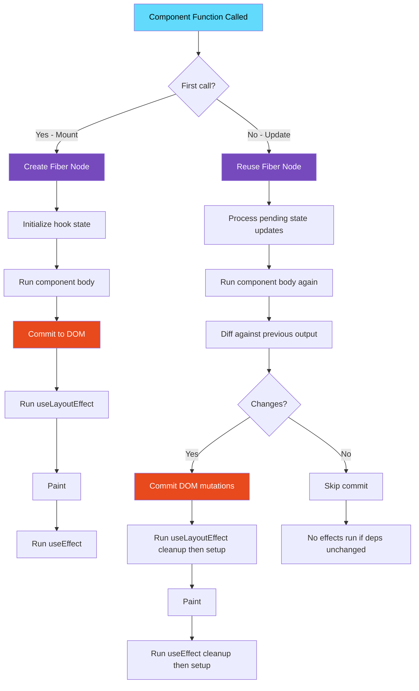
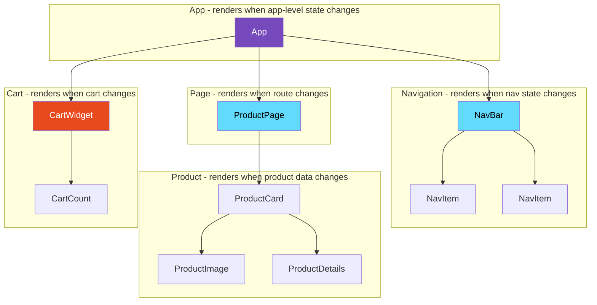
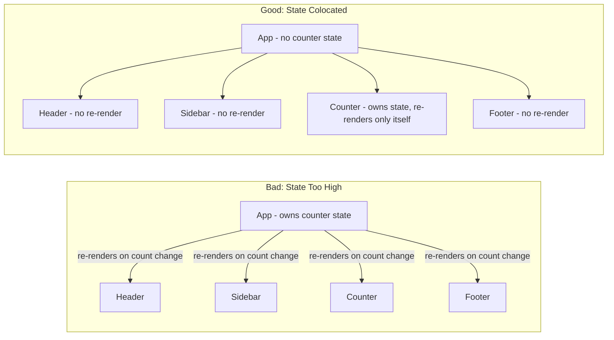

# 04 · Component Architecture

> **A React component is not a UI widget. It is a unit of state ownership, lifecycle management, and rendering responsibility. How you divide your application into components determines your rendering performance, your state management complexity, and your ability to scale the codebase.**

Most React developers learn components as "reusable pieces of UI." That framing produces applications that are hard to reason about, slow to render, and difficult to scale. The engineering framing is different: a component is a **boundary** — a boundary around state, around rendering work, around side effects, and around responsibility. Where you draw those boundaries is one of the most consequential architectural decisions in a React application.

---

## Table of Contents

- [What a Component Actually Is at Runtime](#what-a-component-actually-is-at-runtime)
- [Function Components vs Class Components](#function-components-vs-class-components)
- [The Component Lifecycle](#the-component-lifecycle)
- [Component Boundaries as Performance Boundaries](#component-boundaries-as-performance-boundaries)
- [State Ownership and Colocation](#state-ownership-and-colocation)
- [Component Composition Patterns](#component-composition-patterns)
- [The Children Pattern](#the-children-pattern)
- [Render Props](#render-props)
- [Higher-Order Components](#higher-order-components)
- [Component Design Principles](#component-design-principles)
- [Controlled vs Uncontrolled Components](#controlled-vs-uncontrolled-components)
- [Component Boundaries and Code Splitting](#component-boundaries-and-code-splitting)
- [Architecture Diagrams](#architecture-diagrams)
- [Good Practices](#good-practices)
- [Bad Practices](#bad-practices)
- [Mental Model](#mental-model)
- [Common Mistakes](#common-mistakes)
- [Exercises](#exercises)
- [Further Reading](#further-reading)

---

## What a Component Actually Is at Runtime

From the outside, a React component looks like a function that takes props and returns JSX. That description is accurate but incomplete. At runtime, a component is:

### 1. A unit of reconciliation

The Fiber tree has one node per component. When React reconciles, it processes components one by one. Each component boundary is a potential stopping point — React can memoize at component boundaries (`React.memo`), skip entire subtrees, and track which component is responsible for which DOM output.

### 2. A scope for hooks

Hooks (`useState`, `useEffect`, `useMemo`, etc.) are attached to the Fiber node of the component that calls them. The hook linked list lives on the Fiber, not in any global store. This is why hooks can only be called inside component functions — they require an active Fiber to attach to.

```js
// Each component's Fiber node has a memoizedState linked list
FiberNode {
  memoizedState: {           // First hook
    memoizedState: 0,        // useState: current value
    queue: UpdateQueue,      // pending updates
    next: {                  // Second hook
      memoizedState: null,   // useEffect: last deps
      deps: [userId],
      next: {                // Third hook
        memoizedState: 'Alice', // useMemo: cached value
        deps: [user],
        next: null
      }
    }
  }
}
```

### 3. A rendering unit

When a component's state changes, React re-renders that component — meaning it calls the component function again. React then reconciles the new output against the previous output. The component boundary determines the scope of this re-render: by default, all children re-render too (because the parent produces new element objects for them). With `React.memo`, children can be exempt.

### 4. A lifecycle anchor

Component mount, update, and unmount events are tied to when a component's Fiber node is created, updated, or deleted. Effects (`useEffect`, `useLayoutEffect`) run in relation to these lifecycle events. The component boundary determines _when_ effects run and _when_ cleanup runs.



---

## Function Components vs Class Components

Class components are the historical form of React components. Function components with hooks are the current standard. Understanding why the shift happened reveals important truths about component architecture.

### Class components: the problems

```tsx
class UserProfile extends React.Component<Props, State> {
  state = { userData: null, isLoading: true };

  // Lifecycle methods force you to split related logic by timing
  componentDidMount() {
    // Fetch user data AND set up analytics AND start timer
    // All "on mount" logic is bundled here regardless of concern
    this.fetchUser();
    this.analytics.track("profile_viewed");
    this.timer = setInterval(this.refreshData, 30000);
  }

  componentDidUpdate(prevProps: Props) {
    // Must manually compare props to avoid infinite loops
    if (prevProps.userId !== this.props.userId) {
      this.fetchUser();
    }
  }

  componentWillUnmount() {
    // All "on unmount" logic bundled here — far from the setup code
    clearInterval(this.timer);
    this.analytics.cleanup();
  }

  // Setup and cleanup are separated by potentially hundreds of lines
  // Hard to extract related logic into reusable units
}
```

**The core architectural problem:** Related logic (set up a subscription / clean it up) is split across `componentDidMount` and `componentWillUnmount`. Unrelated logic (fetch user, set up analytics, start timer) is colocated in the same lifecycle method. This inverted organization makes components hard to read and hard to extract logic from.

### Function components with hooks: the solution

```tsx
function UserProfile({ userId }: Props) {
  // Related logic stays together — setup and cleanup in one place
  const userData = useUserData(userId); // custom hook: fetch + cleanup
  useAnalytics("profile_viewed"); // custom hook: track + cleanup
  useDataRefresh(userData.refresh, 30000); // custom hook: timer + cleanup

  // Each concern is encapsulated in a hook
  // Extractable, testable, reusable independently
}
```

> 🔬 **Internals:** Function components have no lifecycle methods because they have no instances. A class component creates one instance per mount and calls methods on it. A function component has no instance — React calls the function itself. State lives in the Fiber, not in `this`. This is why you cannot use `this` in function components and why hooks replaced lifecycle methods — hooks attach to the Fiber the same way instance methods attached to the class instance.

### When class components still appear

Class components are the only way to use error boundaries as of React 18. `getDerivedStateFromError` and `componentDidCatch` have no hook equivalents. Every other use case is covered by hooks.

```tsx
// The one remaining legitimate use case for class components
class ErrorBoundary extends React.Component<Props, { hasError: boolean }> {
  state = { hasError: false };

  static getDerivedStateFromError() {
    return { hasError: true };
  }

  componentDidCatch(error: Error, info: React.ErrorInfo) {
    reportError(error, info.componentStack);
  }

  render() {
    if (this.state.hasError) return this.props.fallback;
    return this.props.children;
  }
}
```

---

## The Component Lifecycle

Despite function components having no explicit lifecycle methods, they have a well-defined lifecycle that you must understand to avoid bugs.

### Phase 1: Mount

Triggered when a component appears in the tree for the first time (its Fiber node is created).

```
1. Component function runs for the first time
2. useState initializers run (only on mount)
3. React element tree is produced
4. Children are mounted recursively
5. DOM nodes are created (commit phase)
6. Refs are attached
7. useLayoutEffect setup runs (synchronously after DOM)
8. Browser paints
9. useEffect setup runs (asynchronously after paint)
```

### Phase 2: Update

Triggered when state changes, parent re-renders, or context updates.

```
1. Component function runs again with new props/state
2. React element tree is produced
3. Reconciler diffs against previous output
4. Changed children are updated recursively
5. DOM mutations applied (commit phase — only if diff found changes)
6. Refs updated if they changed
7. useLayoutEffect cleanup runs, then setup runs (if deps changed)
8. Browser paints (if DOM was mutated)
9. useEffect cleanup runs, then setup runs (if deps changed)
```

### Phase 3: Unmount

Triggered when a component is removed from the tree (its Fiber node is deleted).

```
1. useLayoutEffect cleanup runs (synchronously)
2. useEffect cleanup runs (asynchronously)
3. DOM node removed
4. Refs set to null
5. Fiber node marked for garbage collection
```

### Effect timing — the most commonly misunderstood part

```tsx
function Component() {
  console.log("1. Component function runs");

  useLayoutEffect(() => {
    console.log("3. useLayoutEffect setup — after DOM, before paint");
    return () => console.log("cleanup runs before next setup");
  });

  useEffect(() => {
    console.log("4. useEffect setup — after paint");
    return () => console.log("cleanup runs before next setup");
  });

  // After this function returns:
  // 2. DOM mutations committed
  // Then 3, then browser paints, then 4
}
```

> ⚠️ **Anti-Pattern:** Using `useLayoutEffect` when `useEffect` would work. `useLayoutEffect` runs synchronously before the browser can paint — blocking the paint. It is only needed when you must read layout (like DOM measurements) before the user sees the new frame. Every unnecessary `useLayoutEffect` adds synchronous work to the critical rendering path.

---

## Component Boundaries as Performance Boundaries

This is the most under-appreciated aspect of component architecture. **Where you place component boundaries determines what re-renders when state changes.**

### The default behavior: parent renders, children render

```tsx
function Parent() {
  const [count, setCount] = useState(0);

  return (
    <div>
      <button onClick={() => setCount((c) => c + 1)}>+</button>
      {/* When count changes, Parent re-renders.
          Parent re-renders means ExpensiveChild also re-renders
          — even if its props did not change — because Parent
          produces a new React element object for ExpensiveChild
          on every render. */}
      <ExpensiveChild label="Static label" />
    </div>
  );
}
```

### Isolating state to the smallest possible scope

The fix is to move state down into the component that actually uses it:

```tsx
// ✅ Extract the stateful part into its own component
function Counter() {
  const [count, setCount] = useState(0);
  return <button onClick={() => setCount((c) => c + 1)}>{count}</button>;
}

function Parent() {
  return (
    <div>
      <Counter /> {/* Counter manages its own state */}
      <ExpensiveChild /> {/* Never re-renders due to Counter's state */}
    </div>
  );
}
```

By extracting `Counter` into its own component, `ExpensiveChild` is no longer in the same render scope. When counter state changes, only `Counter` re-renders — not `Parent`, not `ExpensiveChild`.

> 💡 **Mental Model:** Every `useState` call anchors state to a Fiber node. That Fiber node and all its children are the **re-render scope** for that state. Minimize the scope by pushing state as far down the tree as it can go while still being accessible to everything that needs it.

### The children prop as a render escape hatch

```tsx
// ✅ The children prop pattern: pass expensive components as children
// so they are created in a parent scope and not affected by local state
function ScrollContainer({ children }: { children: React.ReactNode }) {
  const [scrollY, setScrollY] = useState(0);

  return (
    <div onScroll={e => setScrollY(e.currentTarget.scrollTop)}>
      <div style={{ transform: `translateY(-${scrollY}px)` }}>
        {children}
        {/* children was created by ScrollContainer's parent,
            not by ScrollContainer itself.
            When scrollY changes, ScrollContainer re-renders,
            but children does not re-render because React sees
            it as the same element object (created upstream). */}
      </div>
    </div>
  );
}

function App() {
  return (
    <ScrollContainer>
      <ExpensiveChild />  {/* Created here, passed as children prop */}
    </ScrollContainer>    {/* Not re-created when scrollY changes */}
  );
}
```

This works because `children` is a reference to element objects created in `App`'s render scope. When `ScrollContainer` re-renders due to scroll, it receives the same `children` reference — React sees the same element objects and skips reconciling them.

---

## State Ownership and Colocation

One of the most impactful architectural decisions: **which component owns which state?**

### The Colocation Principle

State should live as close as possible to the components that use it, and no higher.

```tsx
// ❌ Anti-pattern: state lifted too high
function App() {
  // App-level state for something only one child needs
  const [isDropdownOpen, setIsDropdownOpen] = useState(false);
  const [dropdownFilter, setDropdownFilter] = useState('');

  // Every time dropdown toggles, the entire App tree re-renders
  return (
    <Layout>
      <Header />
      <Sidebar />
      <MainContent />
      <Dropdown
        isOpen={isDropdownOpen}
        filter={dropdownFilter}
        onToggle={() => setIsDropdownOpen(v => !v)}
        onFilter={setDropdownFilter}
      />
    </Layout>
  );
}

// ✅ Good: state lives in the component that needs it
function Dropdown() {
  // State colocated — only Dropdown and its children re-render
  const [isOpen, setIsOpen] = useState(false);
  const [filter, setFilter] = useState('');

  return (/* ... */);
}
```

### When state must be lifted

State should be lifted to the **lowest common ancestor** of all components that need it — no higher.

```tsx
// Two sibling components need to share state
// → Lift to their lowest common ancestor

function ProductPage() {
  // Lifted to ProductPage because both children need it
  const [selectedVariant, setSelectedVariant] = useState<string | null>(null);

  return (
    <>
      <VariantSelector
        selected={selectedVariant}
        onSelect={setSelectedVariant}
      />
      <PriceDisplay variant={selectedVariant} />
    </>
  );
}
```

### The derived state trap

```tsx
// ❌ Bad: storing derived values in state
function ProductList({ products }: { products: Product[] }) {
  const [filteredProducts, setFilteredProducts] = useState(products);
  const [searchTerm, setSearchTerm] = useState("");

  // Manually syncing state — error-prone, easy to get out of sync
  useEffect(() => {
    setFilteredProducts(products.filter((p) => p.name.includes(searchTerm)));
  }, [searchTerm, products]);
}

// ✅ Good: derive during render
function ProductList({ products }: { products: Product[] }) {
  const [searchTerm, setSearchTerm] = useState("");

  // Computed during render — always in sync, no effect needed
  const filteredProducts = products.filter((p) =>
    p.name.toLowerCase().includes(searchTerm.toLowerCase()),
  );
}
```

> 🔬 **Internals:** Derived state stored in `useState` requires a synchronization mechanism (usually `useEffect`) that runs _after_ render. This means there is always at least one extra render cycle where the derived state is stale. Computing during render is always in sync and requires no extra renders. The cost is that the computation runs on every render — which is only a problem for expensive computations (where `useMemo` applies).

---

## Component Composition Patterns

### Containment (children prop)

The simplest and most powerful composition pattern. The parent provides layout and behavior; the child provides content.

```tsx
// Generic container with specific content
function Card({ title, footer, children }: CardProps) {
  return (
    <article className="card">
      <header className="card-header">
        <h2>{title}</h2>
      </header>
      <section className="card-body">{children}</section>
      {footer && <footer className="card-footer">{footer}</footer>}
    </article>
  );
}

// Usage: caller controls what goes inside
<Card title="User Profile" footer={<Button>Edit</Button>}>
  <Avatar src={user.avatar} />
  <UserDetails user={user} />
</Card>;
```

### Specialization (component extension)

Creating specific components from generic ones via props:

```tsx
// Generic button
function Button({ variant, size, children, ...props }: ButtonProps) {
  return (
    <button className={`btn btn-${variant} btn-${size}`} {...props}>
      {children}
    </button>
  );
}

// Specialized buttons — not new components, just configured versions
function PrimaryButton(props: Omit<ButtonProps, "variant">) {
  return <Button variant="primary" {...props} />;
}

function DangerButton(props: Omit<ButtonProps, "variant">) {
  return <Button variant="danger" {...props} />;
}
```

### Slot pattern (named children)

Multiple named "slots" via props, giving callers control over multiple sections:

```tsx
// Multiple named slots via props
function PageLayout({
  header,
  sidebar,
  main,
  footer,
}: {
  header: React.ReactNode;
  sidebar: React.ReactNode;
  main: React.ReactNode;
  footer?: React.ReactNode;
}) {
  return (
    <div className="page">
      <header>{header}</header>
      <div className="content">
        <aside>{sidebar}</aside>
        <main>{main}</main>
      </div>
      {footer && <footer>{footer}</footer>}
    </div>
  );
}

// Caller assembles the page
<PageLayout
  header={<NavBar />}
  sidebar={<FilterPanel />}
  main={<ProductGrid />}
  footer={<SiteFooter />}
/>;
```

---

## The Children Pattern

The `children` prop is the foundation of React composition. Understanding its full behavior is essential.

```tsx
// children type in TypeScript
type Children =
  | React.ReactNode // most permissive — accepts anything
  | React.ReactElement // only React elements (JSX)
  | React.ReactElement[] // only arrays of React elements
  | ((props: T) => React.ReactNode); // render prop pattern

// Typical component signatures:
function Layout({ children }: { children: React.ReactNode }) {}
function List({ children }: { children: React.ReactElement<ItemProps>[] }) {}
function DataProvider({
  children,
}: {
  children: (data: Data) => React.ReactNode;
}) {}
```

### Cloning children with additional props

```tsx
// React.cloneElement: add props to children you don't control
function RadioGroup({ children, name }: RadioGroupProps) {
  return (
    <fieldset>
      {React.Children.map(children, (child) => {
        if (!React.isValidElement(child)) return child;
        // Inject the 'name' prop into each Radio child
        return React.cloneElement(child, { name });
      })}
    </fieldset>
  );
}

// Usage
<RadioGroup name="color">
  <Radio value="red">Red</Radio> {/* receives name="color" */}
  <Radio value="blue">Blue</Radio> {/* receives name="color" */}
</RadioGroup>;
```

> ⚠️ **Anti-Pattern:** Overusing `React.cloneElement`. It creates implicit prop contracts — the child must accept the injected props, but nothing in the type system enforces this. `React.Context` is usually a cleaner solution for sharing values across a component subtree.

---

## Render Props

A pattern where a component accepts a function as a prop (or as `children`) and calls it to produce renderable output. Powerful for sharing stateful logic before hooks — now mostly superseded by hooks, but still useful in specific cases.

```tsx
// Render prop: component manages logic, caller controls rendering
function MouseTracker({ render }: { render: (pos: Position) => React.ReactNode }) {
  const [position, setPosition] = useState<Position>({ x: 0, y: 0 });

  return (
    <div
      onMouseMove={e => setPosition({ x: e.clientX, y: e.clientY })}
      style={{ height: '100vh' }}
    >
      {render(position)}
    </div>
  );
}

// Caller decides how to use the position
<MouseTracker render={({ x, y }) => (
  <Tooltip style={{ left: x, top: y }}>
    Position: {x}, {y}
  </Tooltip>
)} />

// Children as render prop (more idiomatic)
<MouseTracker>
  {({ x, y }) => <Cursor x={x} y={y} />}
</MouseTracker>
```

**When render props still make sense:**

- When you need to give callers control over rendering while the component manages complex interaction state (drag-and-drop, virtual list rendering, form validation)
- When the component produces multiple arguments (position, velocity, delta) that are hard to represent with a simple hook return value
- When the render output is so tightly coupled to the interaction logic that separating them into a hook + component adds complexity

---

## Higher-Order Components

A Higher-Order Component (HOC) is a function that takes a component and returns a new component with additional behavior. The pattern predates hooks and has largely been replaced by custom hooks — but understanding it is important for reading existing codebases and reasoning about component wrapping patterns.

```tsx
// HOC: adds authentication check to any component
function withAuth<P extends object>(WrappedComponent: React.ComponentType<P>) {
  // Return a new component that wraps WrappedComponent
  function WithAuthComponent(props: P) {
    const { user, isLoading } = useAuth();

    if (isLoading) return <Spinner />;
    if (!user) return <Redirect to="/login" />;

    return <WrappedComponent {...props} />;
  }

  // Set displayName for React DevTools
  WithAuthComponent.displayName = `WithAuth(${
    WrappedComponent.displayName || WrappedComponent.name
  })`;

  return WithAuthComponent;
}

// Usage
const ProtectedDashboard = withAuth(Dashboard);
```

### Why custom hooks replaced most HOCs

```tsx
// ❌ HOC approach: creates wrapper in component tree
const ProtectedPage = withAuth(withLogger(withAnalytics(Page)));
// DevTools shows: WithAuth(WithLogger(WithAnalytics(Page)))
// Three extra layers in the component tree

// ✅ Hook approach: no extra tree layers
function Page() {
  useAuth(); // throws/redirects if not authenticated
  useLogger(); // logs page view
  useAnalytics(); // tracks analytics
  // Component tree shows only: Page
}
```

HOCs add wrapper nodes to the component tree, making debugging harder. They also cannot share state between multiple HOCs easily. Custom hooks avoid both problems.

**When HOCs are still appropriate:**

- Error boundaries (must be class components)
- Conditional rendering wrappers (`withFeatureFlag`, `withPermission`)
- Third-party library integrations that expect HOC API

---

## Component Design Principles

### Single Responsibility

Each component should do one thing and do it completely.

```tsx
// ❌ Component doing too much
function UserDashboard({ userId }: { userId: string }) {
  const [user, setUser] = useState<User | null>(null);
  const [posts, setPosts] = useState<Post[]>([]);
  const [followers, setFollowers] = useState<number>(0);
  const [isEditing, setIsEditing] = useState(false);
  const [editForm, setEditForm] = useState({ name: "", bio: "" });
  // ... 200 lines of mixed fetching, UI, and form logic
}

// ✅ Each component has one responsibility
function UserDashboard({ userId }: { userId: string }) {
  return (
    <div>
      <UserProfile userId={userId} />
      <UserPosts userId={userId} />
      <UserFollowers userId={userId} />
    </div>
  );
}
// UserProfile manages profile display and editing
// UserPosts manages post fetching and display
// UserFollowers manages follower count
```

### Stable Component Identity

Components should not be defined inside other components. Defining a component inside a render function causes React to see a new component type on every render, destroying and recreating the inner component's DOM and state on every parent render.

```tsx
// ❌ Catastrophically bad: component defined inside render
function Parent() {
  // This creates a NEW function on every render
  // React sees a different type every render → destroys and recreates
  function InlineChild({ text }: { text: string }) {
    return <p>{text}</p>;
  }

  return <InlineChild text="hello" />;
}

// ✅ Always define components at module scope
function Child({ text }: { text: string }) {
  return <p>{text}</p>;
}

function Parent() {
  return <Child text="hello" />;
}
```

> 🔬 **Internals:** React identifies components by their `type` — the function or class reference. When a component is defined inside a render function, a new function is created on every call. React compares the new `type` with the old `type`: they are different functions (different references), so React treats it as a completely different component type. It unmounts the old one and mounts the new one — destroying all state and DOM in the subtree.

---

## Controlled vs Uncontrolled Components

A fundamental design decision for any component that manages user input or interactive state.

### Controlled components

The parent owns the state. The component is "controlled" by its props.

```tsx
// Controlled: parent owns state, component is a "dumb" display
function TextInput({
  value,
  onChange,
}: {
  value: string;
  onChange: (value: string) => void;
}) {
  return <input value={value} onChange={(e) => onChange(e.target.value)} />;
}

// Parent is in full control
function Form() {
  const [name, setName] = useState("");
  return <TextInput value={name} onChange={setName} />;
}
```

**Benefits:** Parent always knows the current value. Easy to validate, transform, sync to server. Easy to reset (set state to '').

### Uncontrolled components

The component owns its own state internally. Parent only reads the value when needed (via ref).

```tsx
// Uncontrolled: component manages its own state
function TextInput({
  defaultValue,
  ref,
}: {
  defaultValue?: string;
  ref?: React.Ref<HTMLInputElement>;
}) {
  // React lets the browser manage the input's state
  return <input defaultValue={defaultValue} ref={ref} />;
}

// Parent reads value on demand via ref, not on every keystroke
function Form() {
  const nameRef = useRef<HTMLInputElement>(null);

  const handleSubmit = () => {
    const name = nameRef.current?.value; // read on submit only
    submitForm({ name });
  };

  return (
    <>
      <TextInput defaultValue="" ref={nameRef} />
      <button onClick={handleSubmit}>Submit</button>
    </>
  );
}
```

**Benefits:** Less re-renders (no state update on each keystroke). Simpler for simple forms. Easier integration with non-React code.

> 🏭 **Production Note:** Most production form libraries (React Hook Form, Formik) use uncontrolled inputs internally and only read values on submit or blur. This avoids re-rendering the entire form on every keystroke — a significant performance improvement for complex forms with 20+ fields and custom validation components.

---

## Component Boundaries and Code Splitting

Component boundaries are natural code splitting points. `React.lazy` defers loading a component's code bundle until the component is first rendered.

```tsx
// Each lazy import = a separate JavaScript chunk
const Dashboard = React.lazy(() => import("./Dashboard"));
const Analytics = React.lazy(() => import("./Analytics"));
const Settings = React.lazy(() => import("./Settings"));

function App() {
  const { route } = useRouter();

  return (
    <Suspense fallback={<PageSkeleton />}>
      {route === "dashboard" && <Dashboard />}
      {route === "analytics" && <Analytics />}
      {route === "settings" && <Settings />}
    </Suspense>
  );
}
```

> 🔬 **Internals:** `React.lazy` returns a component with a special `$$typeof: REACT_LAZY_TYPE` marker. When the reconciler encounters this type, it checks if the lazy component's promise has resolved. If not, it throws the promise — which Suspense catches. This is the "throw a promise" mechanism behind Suspense. The chunk loads, the promise resolves, Suspense catches the resolution, and the component renders. The component boundary is what makes this granular.

---

## Architecture Diagrams

### Component tree as render scope boundaries



### State colocation impact on re-renders



---

## Good Practices

### ✅ Good Practice — Colocate state with the component that uses it

```tsx
/**
 * Good: disclosure state lives in the Disclosure component.
 * Parent and siblings never re-render when disclosure toggles.
 */
function Disclosure({ title, children }: DisclosureProps) {
  const [isOpen, setIsOpen] = useState(false);

  return (
    <div className="disclosure">
      <button onClick={() => setIsOpen((v) => !v)} aria-expanded={isOpen}>
        {title}
      </button>
      {isOpen && <div className="disclosure-panel">{children}</div>}
    </div>
  );
}
```

**Why this works:** The only component that re-renders on toggle is `Disclosure` itself. Any sibling or parent is completely unaffected. The children only render when `isOpen` is true — saving rendering work for collapsed panels.

---

## Bad Practices

### ⚠️ Bad Practice — Defining components inside render functions

```tsx
/**
 * Bad: ListItem is defined inside List's render function.
 * A new function is created on every List render.
 * React treats it as a different component type each time.
 * Every List render destroys and remounts all ListItem DOM nodes.
 * All ListItem state (focus, animation, internal state) is lost.
 */
function List({ items }: { items: Item[] }) {
  // ❌ New function reference on every render
  function ListItem({ item }: { item: Item }) {
    const [isSelected, setIsSelected] = useState(false);
    return (
      <li
        className={isSelected ? "selected" : ""}
        onClick={() => setIsSelected((v) => !v)}
      >
        {item.name}
      </li>
    );
  }

  return (
    <ul>
      {items.map((item) => (
        <ListItem key={item.id} item={item} />
      ))}
    </ul>
  );
}
```

**What happens:** Every time `List` renders (any state change in any ancestor), React sees a new function for `ListItem.type`. It unmounts all `<ListItem>` elements and mounts new ones. `isSelected` state is reset on every parent render. Inputs lose focus. Animations reset. For 100 items: 100 DOM unmounts + 100 DOM mounts on every ancestor re-render.

---

## Mental Model

> 💡 **The component architecture mental model:**
>
> Every component is a **fence** around state and rendering work. State that lives inside a fence only affects things inside that fence. Rendering work triggered by state change only re-runs the fence and its contents. Your job as an architect is to draw fences that are as small as possible while still enclosing all the things that need to change together. The smaller the fences, the less re-renders. The more things inside one fence, the more expensive every state change becomes.

---

## Common Mistakes

### Defining components inside render functions

Creates a new function reference on every render → React treats it as a different type → unmounts and remounts the entire subtree on every parent re-render.

### Lifting state too high

Every state change triggers re-renders in all components in the same render scope. State lifted to `App` means App-level re-renders on every change.

### Storing derived values in state

Requires `useEffect` for synchronization → always at least one stale render cycle → subtle bugs when props and derived state get out of sync.

### Not providing displayName to HOCs and memoized components

`React.memo(Component)` shows as `Memo(Component)` in DevTools but only if `Component.name` is set. Anonymous arrow functions show as `Memo(Component)` where `Component` is empty. Always set `displayName` or use named function expressions.

### Overusing `React.cloneElement`

Creates implicit prop contracts that are invisible in the type system. Use Context for passing values across component subtrees.

---

## Exercises

### Exercise 1 — Find the optimal state location

Take an existing component that holds all its state at the top level. Map out which state is used by which child components. Identify the lowest common ancestor for each piece of state. Refactor to colocate state correctly. Profile before and after with React DevTools Profiler.

### Exercise 2 — Component boundary = render scope

Build a counter inside a large component tree. Deliberately lift the counter state to a high ancestor. Observe in React DevTools which components re-render on every count change. Then extract the counter into its own component. Observe the change in re-render scope.

### Exercise 3 — Controlled vs uncontrolled

Build a multi-field form twice:

1. Controlled: every field has `value` and `onChange`, state stored in parent
2. Uncontrolled: using `defaultValue` and refs, read on submit

Profile a keystroke in each version. How many renders occur? Which approach scales better as field count grows?

---

## Further Reading

- [React Docs: Thinking in React](https://react.dev/learn/thinking-in-react) — The official component boundary design guide
- [React Source: ReactFiber.js](https://github.com/facebook/react/blob/main/packages/react-reconciler/src/ReactFiber.js) — How Fiber nodes map to components
- [Overreacted: Before You memo()](https://overreacted.io/before-you-memo/) — State colocation as a memoization alternative
- [Kent C. Dodds: State Colocation](https://kentcdodds.com/blog/state-colocation-will-make-your-react-app-faster) — Deep dive on state colocation for performance
- Next in this handbook: [05 · Unidirectional Data Flow](./05-unidirectional-data-flow.md)

---

_Part of the [React + Next.js Engineering Handbook](../../README.md)_
