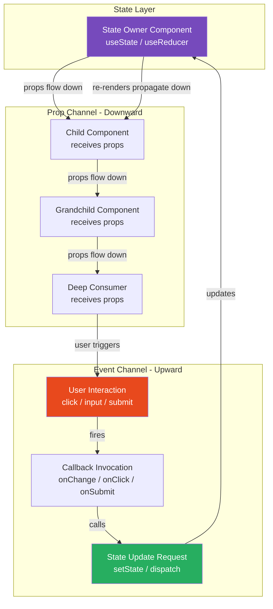
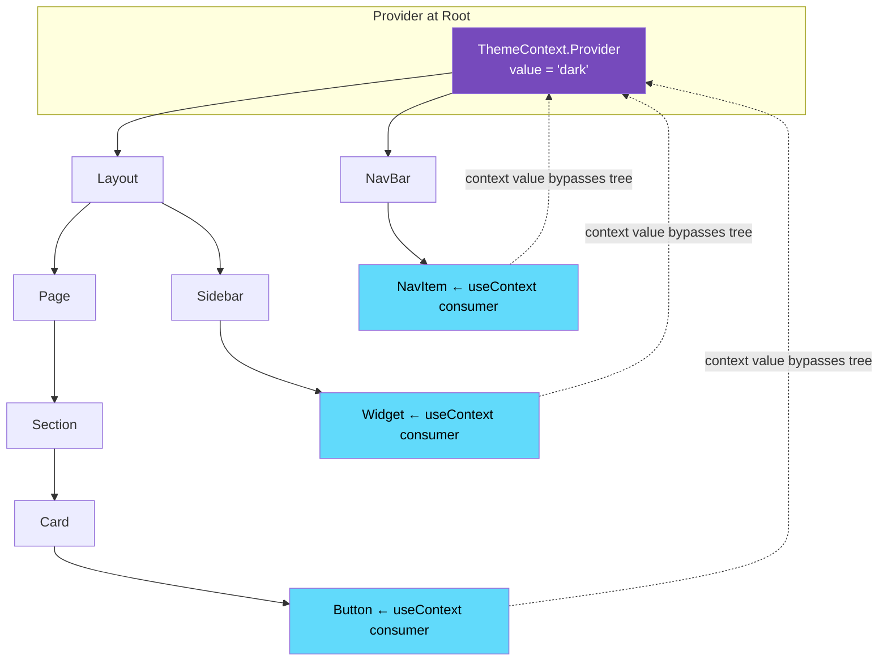
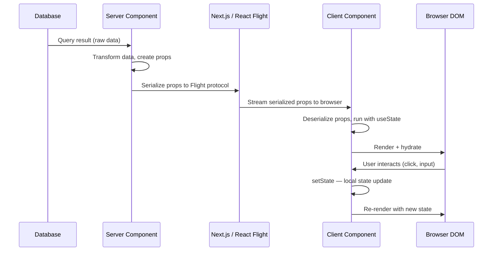

# 05 · Unidirectional Data Flow

> **Unidirectional data flow is not a style preference. It is a structural constraint that makes the relationship between state and UI deterministic, makes bugs reproducible, and makes large applications tractable to reason about. Understanding why React enforces it — and the precise mechanisms it uses — is foundational to writing correct React code.**

In most UI systems built before React, data could flow in any direction: child components could mutate parent state, event handlers could directly update sibling components, and global variables could change anything from anywhere. This freedom made individual interactions easy to implement and made debugging at scale nearly impossible. React replaced that freedom with a constraint: **data flows down, events flow up, and the UI is always a function of the current state.**

---

## Table of Contents

- [What Unidirectional Flow Actually Means](#what-unidirectional-flow-actually-means)
- [The Data Flow Directions](#the-data-flow-directions)
- [Props: The Downward Channel](#props-the-downward-channel)
- [Events: The Upward Channel](#events-the-upward-channel)
- [Why This Constraint Exists](#why-this-constraint-exists)
- [Prop Drilling: The Friction Signal](#prop-drilling-the-friction-signal)
- [Lifting State Up](#lifting-state-up)
- [Context API: Bypassing the Tree](#context-api-bypassing-the-tree)
- [Context Internals and Re-render Behavior](#context-internals-and-re-render-behavior)
- [When Unidirectional Flow Breaks Down](#when-unidirectional-flow-breaks-down)
- [State Management as Flow Infrastructure](#state-management-as-flow-infrastructure)
- [Data Flow in Next.js: Server to Client](#data-flow-in-nextjs-server-to-client)
- [Architecture Diagrams](#architecture-diagrams)
- [Good Practices](#good-practices)
- [Bad Practices](#bad-practices)
- [Mental Model](#mental-model)
- [Common Mistakes](#common-mistakes)
- [Exercises](#exercises)
- [Further Reading](#further-reading)

---

## What Unidirectional Flow Actually Means

In React, data flows in one direction: **from parent to child through props**. A child component cannot directly change its parent's state. A component cannot directly change a sibling's state. State lives in a component, and that component controls when and how it changes.

This is not the same as saying data is read-only. State changes all the time. The constraint is about _where_ state lives and _how_ it changes:

```
State lives in a component
         ↓ (props)
Child components receive data as props
         ↓ (props)
Grandchild components receive data as props
         ↑ (events / callbacks)
User interaction triggers a callback
         ↑ (events / callbacks)
Callback travels up to the state owner
         → State owner updates its state
         ↓ (props, re-render propagates down)
New data flows down to all children
```

Every cycle through this loop is deterministic. Given the same state, you always get the same UI. Given the same event, the same state change always occurs. There are no hidden channels, no mutation of shared objects, no surprise updates from unrelated components.

---

## The Data Flow Directions

React has exactly two legitimate channels for data movement:

### Channel 1: Props — downward

Props carry data from parent to child. They are read-only from the child's perspective.

```tsx
// Data flows: App → ProductPage → ProductCard → ProductPrice
function App() {
  const product = useProduct("123");
  return <ProductPage product={product} />;
}

function ProductPage({ product }: { product: Product }) {
  return <ProductCard product={product} />;
}

function ProductCard({ product }: { product: Product }) {
  return (
    <div>
      <h2>{product.name}</h2>
      <ProductPrice price={product.price} currency={product.currency} />
    </div>
  );
}

function ProductPrice({ price, currency }: PriceProps) {
  return <span>{formatPrice(price, currency)}</span>;
}
```

At every level, data comes _in_ as props and flows _down_ to children. No component reaches up into its parent.

### Channel 2: Callbacks — upward

Events and user interactions travel upward through callback functions passed as props.

```tsx
function App() {
  const [cart, setCart] = useState<CartItem[]>([]);

  // Callback passed down, called from below, executes here (at the top)
  const handleAddToCart = (product: Product) => {
    setCart((prev) => [...prev, { product, quantity: 1 }]);
  };

  return <ProductPage onAddToCart={handleAddToCart} />;
}

function ProductPage({ onAddToCart }: { onAddToCart: (p: Product) => void }) {
  const product = useProduct();
  // Receives callback, passes it further down
  return <AddToCartButton product={product} onAdd={onAddToCart} />;
}

function AddToCartButton({ product, onAdd }: AddToCartProps) {
  // User event triggers the callback, which executes in App
  return <button onClick={() => onAdd(product)}>Add to cart</button>;
}
```

The button click happens in `AddToCartButton`. The state change happens in `App`. The information travels up through callback invocations. The state update then propagates down as new props. The loop is complete.

---

## Props: The Downward Channel

Props are the mechanism of downward data flow. Understanding them completely — including what they can and cannot do — is fundamental.

### Props are a snapshot, not a live reference

When a parent renders and passes props to a child, the child receives the values _as they were at render time_. If the parent's state changes later, the child does not automatically see the update — the parent must re-render and pass new props.

```tsx
function Parent() {
  const [count, setCount] = useState(0);

  return (
    <>
      <button onClick={() => setCount((c) => c + 1)}>Increment</button>
      {/* Child receives count's value at this render.
          It does NOT get a live reference to the state variable.
          When count changes, Parent re-renders and passes the new value. */}
      <Child count={count} />
    </>
  );
}

function Child({ count }: { count: number }) {
  // count here is whatever was passed during the last render
  // It cannot change without the parent re-rendering
  return <p>{count}</p>;
}
```

### Props are read-only — enforced by convention, not runtime

React does not throw an error if you mutate a prop. But mutating props bypasses the entire unidirectional flow system:

```tsx
// ❌ Mutating props — legal JavaScript, wrong React
function BadChild({ items }: { items: Item[] }) {
  // This mutates the array in the parent's state directly
  // React has no way to know this happened
  // The UI may or may not update depending on how the parent renders
  items.push({ id: "new", name: "New item" });
  return (
    <ul>
      {items.map((i) => (
        <li key={i.id}>{i.name}</li>
      ))}
    </ul>
  );
}
```

**What happens:** The parent's state array is mutated in place. React's state comparison uses reference equality — the array reference has not changed, so React sees no update. The parent does not re-render. The UI shows stale data or is inconsistent across components that share the same array reference.

### Props spread and composition

```tsx
// Spreading props: convenient but carries risks
function Button({ variant, size, ...rest }: ButtonProps) {
  return (
    <button
      className={`btn-${variant} btn-${size}`}
      {...rest} // passes all remaining props to the DOM element
    />
  );
}

// ⚠️ Risk: passing non-HTML attributes to DOM elements
<Button
  variant="primary"
  size="lg"
  isLoading={true} // 'isLoading' is not a valid HTML attribute
/>;
// React warning: "Unknown prop `isLoading` on <button> tag."
// Fix: destructure and handle non-DOM props explicitly
function Button({ variant, size, isLoading, ...rest }: ButtonProps) {
  return (
    <button
      className={`btn-${variant} btn-${size}`}
      disabled={isLoading}
      {...rest}
    />
  );
}
```

---

## Events: The Upward Channel

React's synthetic event system provides a cross-browser abstraction over native DOM events. But the architectural pattern — passing callbacks down so events can travel up — is what matters for data flow.

### React's synthetic event system

```tsx
// React wraps native events in SyntheticEvent objects
function SearchInput({ onSearch }: { onSearch: (term: string) => void }) {
  const handleChange = (e: React.ChangeEvent<HTMLInputElement>) => {
    // e is a SyntheticEvent — a cross-browser wrapper
    // e.target, e.currentTarget, e.preventDefault() all work as expected
    onSearch(e.target.value);
  };

  return <input onChange={handleChange} />;
}
```

> 🔬 **Internals:** React uses a single event listener at the root of the application (the `root` DOM node) rather than attaching listeners to individual elements. When a native event fires, it bubbles to the root, React identifies which fiber it corresponds to, and dispatches a synthetic event by traversing the fiber tree upward — simulating native event bubbling in React's fiber graph. This is called **event delegation**. It means React can handle events even for dynamically created DOM elements without re-attaching listeners.

### Event propagation in React

React synthetic events propagate through the component tree following the same rules as native DOM events:

```tsx
function Parent() {
  const handleParentClick = () => console.log("Parent clicked");

  return (
    <div onClick={handleParentClick}>
      <Child />
    </div>
  );
}

function Child() {
  const handleChildClick = (e: React.MouseEvent) => {
    console.log("Child clicked");
    e.stopPropagation(); // prevents parent handler from firing
  };

  return <button onClick={handleChildClick}>Click me</button>;
}
// Without stopPropagation: "Child clicked" then "Parent clicked"
// With stopPropagation: "Child clicked" only
```

### Callback patterns for upward communication

```tsx
// Pattern 1: Simple value callback
<Input onChange={(value: string) => setName(value)} />

// Pattern 2: Event object callback (when you need event details)
<Form onSubmit={(e: React.FormEvent) => {
  e.preventDefault();
  submitForm();
}} />

// Pattern 3: Identifier + value (for list items)
<TaskItem
  id={task.id}
  onUpdate={(id: string, changes: Partial<Task>) => {
    updateTask(id, changes);
  }}
/>

// Pattern 4: Action object (Redux-style, for complex updates)
<Editor
  onAction={(action: EditorAction) => {
    dispatch(action);
  }}
/>
```

---

## Why This Constraint Exists

The unidirectional constraint is not arbitrary. It solves real problems that bidirectional data flow creates.

### Problem 1: Debugging becomes impossible

In a bidirectional system (like the classic MVC with two-way binding), when a bug causes unexpected UI state, you must answer: **which of the N possible writers changed this data?**

```
// Bidirectional system: data can change from anywhere
Model ←→ View A
Model ←→ View B
Model ←→ Controller
Model ←→ Timer
Model ←→ WebSocket handler

// Bug: Model has wrong value. Who changed it?
// Answer: could be any of the 5 writers. Check all of them.
// For 50 components: check all 50. Good luck.
```

In React's unidirectional system:

```
// Unidirectional: state has exactly one owner
State in ComponentA
    ↓ (props only, read-only)
    ComponentB
    ComponentC
    ComponentD

// Bug: ComponentA has wrong state. Who changed it?
// Answer: only ComponentA can change ComponentA's state.
// Look at ComponentA's event handlers and useEffects. That's it.
```

### Problem 2: UI/state sync bugs

In bidirectional systems, UI and state can drift. The view might update the model, which triggers a view update, which triggers another model update — infinite loops and race conditions are common.

React prevents this by making state immutable from the child's perspective. Children cannot change state — they can only invoke callbacks that _request_ a state change. The state owner decides whether and how to change.

### Problem 3: Cascading updates are unpredictable

In a system where any component can update any state, a single user action can trigger a cascade of updates: A updates B, B updates C, C updates A. The final state depends on the order of updates, which may not be deterministic.

React's unidirectional model makes the causality chain explicit and deterministic:

```
User clicks button
→ onClick callback fires
→ setState called (React batches this)
→ React schedules re-render
→ Component function runs
→ New props flow down
→ Children update
→ DOM updated
→ Effects run
(cycle complete — no re-entrant updates)
```

---

## Prop Drilling: The Friction Signal

Prop drilling occurs when data must pass through many intermediate components that do not use the data themselves — they only pass it down to children that do.

```tsx
// Data needs to go from App to DeepChild
// Four components in between don't use 'theme' — they only pass it
function App() {
  const [theme, setTheme] = useState<Theme>("light");
  return <Layout theme={theme} onThemeChange={setTheme} />;
}

function Layout({ theme, onThemeChange }: LayoutProps) {
  // Layout doesn't use theme — just passes it down
  return <Page theme={theme} onThemeChange={onThemeChange} />;
}

function Page({ theme, onThemeChange }: PageProps) {
  // Page doesn't use theme — just passes it down
  return <Section theme={theme} onThemeChange={onThemeChange} />;
}

function Section({ theme, onThemeChange }: SectionProps) {
  // Section doesn't use theme — just passes it down
  return <DeepChild theme={theme} onThemeChange={onThemeChange} />;
}

function DeepChild({ theme, onThemeChange }: DeepChildProps) {
  // DeepChild is the only one that actually uses theme
  return (
    <button onClick={() => onThemeChange(theme === "light" ? "dark" : "light")}>
      Current: {theme}
    </button>
  );
}
```

### Why prop drilling is a signal, not a problem

Prop drilling is often described as a problem to eliminate. The more accurate description: **prop drilling is a signal that your component architecture may need reconsideration**.

Before reaching for Context, ask:

1. **Can you colocate the consumer and the state?** Move the state down closer to where it is needed.
2. **Can you use component composition instead?** Pass components as children so intermediate components don't need to know about the data.
3. **Is the data truly global?** Only use Context for data that genuinely needs to be accessible across many unrelated components (theme, auth, locale).

```tsx
// Before Context: component composition often solves prop drilling
function App() {
  const [theme, setTheme] = useState<Theme>("light");

  // Create the button here, where state lives
  const themeButton = (
    <ThemeToggleButton
      theme={theme}
      onToggle={() => setTheme((t) => (t === "light" ? "dark" : "light"))}
    />
  );

  // Pass it as a prop — intermediaries don't need to know about theme
  return <Layout themeControl={themeButton} />;
}

function Layout({ themeControl }: { themeControl: React.ReactNode }) {
  return <Page themeControl={themeControl} />;
}

function Page({ themeControl }: { themeControl: React.ReactNode }) {
  // Just renders the node — doesn't need to know what it is
  return <header>{themeControl}</header>;
}
```

---

## Lifting State Up

When two sibling components need to share state, the state must be lifted to their **lowest common ancestor** — the nearest parent that contains both components.

```tsx
// Before lifting: each input manages its own state
// Problem: the temperature conversion display needs both values
function TemperatureConverter() {
  return (
    <div>
      <CelsiusInput /> {/* has its own state */}
      <FahrenheitInput /> {/* has its own state */}
      {/* No way to show conversion — neither input knows the other's value */}
    </div>
  );
}

// After lifting: shared state moved to the common ancestor
function TemperatureConverter() {
  const [celsius, setCelsius] = useState<number>(0);
  const fahrenheit = (celsius * 9) / 5 + 32; // derived, no separate state

  return (
    <div>
      <CelsiusInput value={celsius} onChange={setCelsius} />
      <FahrenheitInput
        value={fahrenheit}
        onChange={(f: number) => setCelsius(((f - 32) * 5) / 9)}
      />
      <p>
        {celsius}°C = {fahrenheit}°F
      </p>
    </div>
  );
}
```

### The lifting state algorithm

When you need to share state between two components:

1. Find the components that need the state
2. Find their lowest common ancestor
3. Move the state to that ancestor
4. Pass the state down as props to both components
5. Pass a setter callback down as a prop to whichever component(s) need to change the state

> 🏭 **Production Note:** Lifting state is the right answer for small to medium component trees. When the distance between the state owner and consumers grows to 5+ levels, or when many unrelated components need the same state, Context or a state management library becomes appropriate. The deciding factor is not "how many components need it" but "how many intermediate components are polluted with props they don't use."

---

## Context API: Bypassing the Tree

React Context provides a way to pass data through the component tree without prop drilling. It is a legitimate escape hatch from the prop chain — not a replacement for props.

### How Context works internally

```tsx
// 1. Create a context with a default value
const ThemeContext = React.createContext<Theme>("light");

// 2. Provide a value at some point in the tree
function App() {
  const [theme, setTheme] = useState<Theme>("light");

  return (
    // All descendants can access theme without props
    <ThemeContext.Provider value={theme}>
      <Layout />
    </ThemeContext.Provider>
  );
}

// 3. Consume anywhere in the tree below the Provider
function DeepChild() {
  const theme = useContext(ThemeContext);
  // No props needed — context bypassed the entire tree
  return <div className={`theme-${theme}`}>Content</div>;
}
```

---

## Context Internals and Re-render Behavior

Context is the most commonly misunderstood part of React's data flow system. Its re-render behavior surprises most engineers.

### What triggers a context re-render

When a Context Provider's `value` prop changes, **every component that calls `useContext` with that context re-renders** — regardless of whether the specific part of the value they use changed.

```tsx
// This context value is an object
const UserContext = React.createContext<UserContextValue | null>(null);

function App() {
  const [user, setUser] = useState<User>(initialUser);
  const [notifications, setNotifications] = useState<number>(0);

  return (
    // ⚠️ New object created on every render — always a new reference
    <UserContext.Provider value={{ user, notifications }}>
      <Layout />
    </UserContext.Provider>
  );
}

function Avatar() {
  const ctx = useContext(UserContext);
  // Avatar only uses ctx.user, but it re-renders when notifications changes
  // because the entire context value object is a new reference
  return ;
}
```

> 🔬 **Internals:** React uses `Object.is` to compare the new context value with the previous one. If they are not the same reference, React marks all consumers as needing re-render. For object values, a new object literal (`{ user, notifications }`) is never `===` to the previous object — even if all values inside are identical. This means every App re-render creates a new context value, and every context consumer re-renders. React does not do deep equality comparison of context values — it only checks reference identity.

### Fixing context re-render over-firing

**Solution 1: Split contexts by update frequency**

```tsx
// ✅ Separate stable data from frequently-changing data
const UserContext = React.createContext<User | null>(null); // changes rarely
const NotificationsContext = React.createContext<number>(0); // changes often

function App() {
  const [user, setUser] = useState<User>(initialUser);
  const [notifications, setNotifications] = useState<number>(0);

  return (
    <UserContext.Provider value={user}>
      <NotificationsContext.Provider value={notifications}>
        <Layout />
      </NotificationsContext.Provider>
    </UserContext.Provider>
  );
}

function Avatar() {
  const user = useContext(UserContext);
  // Now Avatar only re-renders when user changes, not when notifications changes
  return ;
}
```

**Solution 2: Memoize the context value**

```tsx
function App() {
  const [user, setUser] = useState<User>(initialUser);
  const [notifications, setNotifications] = useState<number>(0);

  // ✅ Stable reference when neither user nor notifications changed
  const contextValue = useMemo(
    () => ({ user, notifications }),
    [user, notifications],
  );

  return (
    <UserContext.Provider value={contextValue}>
      <Layout />
    </UserContext.Provider>
  );
}
```

**Solution 3: Separate state from dispatch**

```tsx
// ✅ The dispatch function never changes — stable reference
// Only components that need state re-render when state changes
const StateContext = React.createContext<AppState | null>(null);
const DispatchContext = React.createContext<React.Dispatch<Action> | null>(
  null,
);

function AppProvider({ children }: { children: React.ReactNode }) {
  const [state, dispatch] = useReducer(reducer, initialState);

  return (
    <DispatchContext.Provider value={dispatch}>
      {" "}
      {/* stable reference */}
      <StateContext.Provider value={state}>
        {" "}
        {/* changes when state changes */}
        {children}
      </StateContext.Provider>
    </DispatchContext.Provider>
  );
}

// Components that only dispatch never re-render due to state changes
function AddButton() {
  const dispatch = useContext(DispatchContext); // stable — never re-renders
  return <button onClick={() => dispatch({ type: "ADD" })}>Add</button>;
}
```

---

## When Unidirectional Flow Breaks Down

There are legitimate cases where strict props-down / events-up flow is impractical. Understanding these cases — and the correct React mechanisms for handling them — is important.

### Case 1: Imperative DOM access (refs)

Some DOM interactions are inherently imperative: focusing an input, playing a video, measuring element dimensions. React provides `useRef` for this:

```tsx
function SearchBar() {
  const inputRef = useRef<HTMLInputElement>(null);

  const focusInput = () => {
    // ✅ Imperative DOM access — correct use of ref
    inputRef.current?.focus();
  };

  return (
    <>
      <input ref={inputRef} type="search" />
      <button onClick={focusInput}>Focus</button>
    </>
  );
}
```

Refs bypass React's rendering system for this specific interaction — but they do not bypass state management. They are a valve for cases where you need imperative control over a DOM node.

### Case 2: Parent calling child methods (forwardRef + useImperativeHandle)

Sometimes a parent needs to trigger an action in a child (like clearing a form, playing an animation, resetting state). The idiomatic React approach is to use state: pass a prop that changes to trigger the reset. But when that is awkward, `useImperativeHandle` provides a controlled escape hatch:

```tsx
interface VideoPlayerHandle {
  play: () => void;
  pause: () => void;
  seek: (time: number) => void;
}

const VideoPlayer = React.forwardRef<VideoPlayerHandle, VideoProps>(
  function VideoPlayer(props, ref) {
    const videoRef = useRef<HTMLVideoElement>(null);

    // Expose specific methods — not the entire DOM node
    useImperativeHandle(ref, () => ({
      play: () => videoRef.current?.play(),
      pause: () => videoRef.current?.pause(),
      seek: (time) => {
        if (videoRef.current) videoRef.current.currentTime = time;
      },
    }));

    return <video ref={videoRef} src={props.src} />;
  },
);

function MediaControls() {
  const playerRef = useRef<VideoPlayerHandle>(null);

  return (
    <>
      <VideoPlayer ref={playerRef} src="/movie.mp4" />
      <button onClick={() => playerRef.current?.play()}>Play</button>
      <button onClick={() => playerRef.current?.pause()}>Pause</button>
    </>
  );
}
```

> ⚠️ **Anti-Pattern:** Using `useImperativeHandle` for anything other than DOM-adjacent imperative APIs (media control, focus management, scroll control, animation triggers). If you find yourself using it to read or set component state from outside the component, you have a design problem — that state should be lifted or managed through Context.

### Case 3: Cross-cutting concerns (portals)

Modals, tooltips, and dropdowns need to render outside their DOM parent (to escape `overflow: hidden` or `z-index` stacking contexts) while remaining in their React component tree position. `ReactDOM.createPortal` handles this:

```tsx
function Modal({ isOpen, onClose, children }: ModalProps) {
  if (!isOpen) return null;

  // Renders into document.body in the DOM —
  // but stays in the React component tree where Modal is declared
  return ReactDOM.createPortal(
    <div className="modal-overlay" onClick={onClose}>
      <div className="modal-content" onClick={(e) => e.stopPropagation()}>
        {children}
      </div>
    </div>,
    document.body, // DOM target for the portal
  );
}
```

The portal's React event handlers still propagate through the React component tree (not the DOM tree). Context is still accessible. The unidirectional data flow still applies. Only the DOM placement changes.

---

## State Management as Flow Infrastructure

As applications scale, passing state through props and callbacks becomes impractical for truly global state. State management libraries provide infrastructure for data flow at scale — but they do not change the fundamental principles, they implement them differently.

### The spectrum of state management approaches

```
Local state (useState)
    ↓ more sharing needed
Lifted state (lowest common ancestor)
    ↓ more sharing needed
Context API (tree-level state)
    ↓ more sharing / complexity / performance needed
Zustand / Jotai / Recoil (external store, selective subscriptions)
    ↓ more complex data flows
Redux Toolkit (explicit actions, reducers, time-travel debugging)
    ↓ server state specifically
TanStack Query / SWR (server cache as state)
```

Each step up has a cost: more infrastructure, more concepts, more indirection. The goal is to use the minimum level of infrastructure that correctly solves the problem.

> 🏭 **Production Note:** Most production React applications at scale use multiple layers simultaneously: `useState` for local UI state (dropdowns, form fields, toggles), Context for session-level state (auth, theme, locale), TanStack Query for server state (fetched data, cache), and Zustand or Redux for complex client-side state with many consumers (shopping cart, editor state, real-time data).

---

## Data Flow in Next.js: Server to Client

Next.js adds a new dimension to data flow: the server/client boundary. Data flows not just down the component tree but from server to client.

### Server Components as data sources

```tsx
// app/products/page.tsx — Server Component
// Runs on the server. Has direct database access. Zero client JS bundle.
async function ProductsPage() {
  // Data fetching happens on the server — no useEffect, no loading state
  const products = await db.products.findMany({ limit: 20 });

  return (
    // Products data flows down as props — same unidirectional principle
    <ProductGrid products={products} />
  );
}

// ProductGrid can be a Server Component too — rendered on the server
function ProductGrid({ products }: { products: Product[] }) {
  return (
    <div className="grid">
      {products.map((product) => (
        // Individual ProductCard might be a Client Component for interactivity
        <ProductCard key={product.id} product={product} />
      ))}
    </div>
  );
}
```

### The server → client boundary

```tsx
// 'use client' marks the boundary where React's client runtime takes over
"use client";

// ProductCard is a Client Component — runs in the browser
// It receives product as a prop — serialized from server, deserialized on client
function ProductCard({ product }: { product: Product }) {
  const [isInCart, setIsInCart] = useState(false);

  return (
    <div>
      <h2>{product.name}</h2>
      <button onClick={() => setIsInCart((v) => !v)}>
        {isInCart ? "Remove" : "Add to cart"}
      </button>
    </div>
  );
}
```

> 🔬 **Internals:** The server → client boundary is a serialization boundary. Props passed from Server Components to Client Components must be serializable to JSON (no functions, no class instances, no Dates — only plain data). Next.js serializes these props using the React Flight protocol, streams them to the client, and React deserializes them on the client side. This is why you cannot pass a function as a prop from a Server Component to a Client Component.

The unidirectional flow principle still applies — data flows from server (producer) to client (consumer) in one direction, via serialized props.

---

## Architecture Diagrams

### Full unidirectional data flow cycle



### Context as a tree-wide broadcast



### Server to client data flow in Next.js



---

## Good Practices

### ✅ Good Practice — Single source of truth for shared state

```tsx
/**
 * Good: One component owns the state.
 * All consumers receive it via props or context.
 * No risk of divergence — there is only one value.
 */
function CartProvider({ children }: { children: React.ReactNode }) {
  const [items, setItems] = useState<CartItem[]>([]);

  const addItem = useCallback((product: Product) => {
    setItems((prev) => {
      const existing = prev.find((i) => i.product.id === product.id);
      if (existing) {
        return prev.map((i) =>
          i.product.id === product.id ? { ...i, quantity: i.quantity + 1 } : i,
        );
      }
      return [...prev, { product, quantity: 1 }];
    });
  }, []);

  const removeItem = useCallback((productId: string) => {
    setItems((prev) => prev.filter((i) => i.product.id !== productId));
  }, []);

  const value = useMemo(
    () => ({ items, addItem, removeItem }),
    [items, addItem, removeItem],
  );

  return <CartContext.Provider value={value}>{children}</CartContext.Provider>;
}
```

**Why this works:** One source of truth means one place to look when debugging. The `items` array is never duplicated into local state in consumers. When a consumer calls `addItem`, the single `items` array updates and all consumers see the same new value.

---

## Bad Practices

### ⚠️ Bad Practice — Copying props into state (broken sync)

```tsx
/**
 * Bad: props copied into state on mount, then state and props diverge.
 * This is one of the most common React bugs in production.
 */
function UserForm({ user }: { user: User }) {
  // ❌ Copies user into state on mount — but user prop changes are IGNORED
  const [formData, setFormData] = useState({
    name: user.name,
    email: user.email,
  });

  // If parent re-renders with a different user (e.g., navigating between users),
  // formData still holds the OLD user's data.
  // useState initializer only runs on mount — prop changes do nothing.

  return (
    <form>
      <input
        value={formData.name}
        onChange={(e) =>
          setFormData((prev) => ({ ...prev, name: e.target.value }))
        }
      />
    </form>
  );
}
```

**What happens:** User navigates from `/users/alice` to `/users/bob`. The `user` prop changes to Bob's data. But `formData` still holds Alice's name and email because `useState` only uses its initializer argument on the first render. The form shows Alice's data for Bob's profile.

**The fix:** Either derive the form values from props directly (no state), use a `key` prop to reset the component when the user changes, or implement a proper `useEffect` that syncs the prop into state when it changes (the least preferred option).

```tsx
// ✅ Fix 1: Use key to reset component identity when user changes
<UserForm key={user.id} user={user} />;

// ✅ Fix 2: Derive from props, only store user edits
function UserForm({ user }: { user: User }) {
  const [edits, setEdits] = useState<Partial<User>>({});
  const formData = { ...user, ...edits }; // merge: user base + user edits
  // formData always reflects the current user + any unsaved changes
}
```

---

## Mental Model

> 💡 **The unidirectional flow mental model:**
>
> Think of your React application as a **river system**. State is the source (mountain lake). Props are rivers flowing downward — you cannot make water flow uphill. Events are messages sent upstream in bottles — they travel up, but they do not carry water (data), they carry _instructions_ (callbacks). The source decides whether to release more water based on the message. If you want water in two valleys, you need to put the source (state) at a height above both — their lowest common ancestor. Context is a pipe system that delivers water directly to distant locations without flowing through every valley in between.

---

## Common Mistakes

### Copying props into state

The most common source of stale data bugs. `useState(props.value)` only uses `props.value` on mount. Changes to the prop after mount are invisible to the state.

### Mutating props or context values directly

Bypasses React's change detection. React compares object references — mutating the object in place does not change the reference, so React does not see the change and does not re-render.

### Creating new objects in Context value without memoization

Every render creates a new object reference → Context comparison fails → all consumers re-render → potentially cascading re-renders through the whole tree.

### Using Context for state that belongs lower

Context is for genuinely cross-cutting concerns (theme, auth, locale). Using it for state that is only needed by a subtree means all Context consumers re-render for changes that only affect a small part of the UI.

### Not providing a stable identity for callbacks passed as props

Inline arrow functions create new references on every render. Children that receive them as props will re-render even with `React.memo` because the callback reference changed. Use `useCallback` for callbacks passed as props to memoized children.

---

## Exercises

### Exercise 1 — Trace the flow

Pick any form in a React application you have built. Draw (on paper or in a diagram tool) the exact path data takes:

- From user keypress → through component tree → to state owner → back down to UI
- From server fetch → through component props → to the component that displays it
- Where does the flow break? Where is state lifted higher than necessary?

### Exercise 2 — Fix the broken sync

Build this deliberately broken component and observe the bug:

```tsx
function UserCard({ userId }: { userId: string }) {
  const user = useUserById(userId);
  const [name, setName] = useState(user?.name ?? "");
  return <div>{name}</div>;
}
// <UserCard userId="alice" /> then change to <UserCard userId="bob" />
// The name will not update. Fix it without using useEffect.
```

### Exercise 3 — Context performance audit

Build a Context with a large value object (10+ fields). Add console.log to every consumer. Trigger a state change that only affects one field of the context value. Count how many consumers re-render. Now split the context into two contexts (stable data, frequently-changing data). Repeat the test. Compare the re-render count.

---

## Further Reading

- [React Docs: Sharing State Between Components](https://react.dev/learn/sharing-state-between-components) — Official lifting state guide
- [React Docs: Passing Data Deeply with Context](https://react.dev/learn/passing-data-deeply-with-context) — Context internals and patterns
- [React Source: ReactContext.js](https://github.com/facebook/react/blob/main/packages/react/src/ReactContext.js) — How Context objects are created
- [React Source: readContext](https://github.com/facebook/react/blob/main/packages/react-reconciler/src/ReactFiberNewContext.js) — How `useContext` reads and triggers re-renders
- [Overreacted: How Does setState Know What to Do?](https://overreacted.io/how-does-setstate-know-what-to-do/) — The relationship between React and the renderer
- Next in this handbook: [06 · The Render Phase](../react-rendering/01-render-phase.md)

---

_Part of the [React + Next.js Engineering Handbook](../../README.md)_
