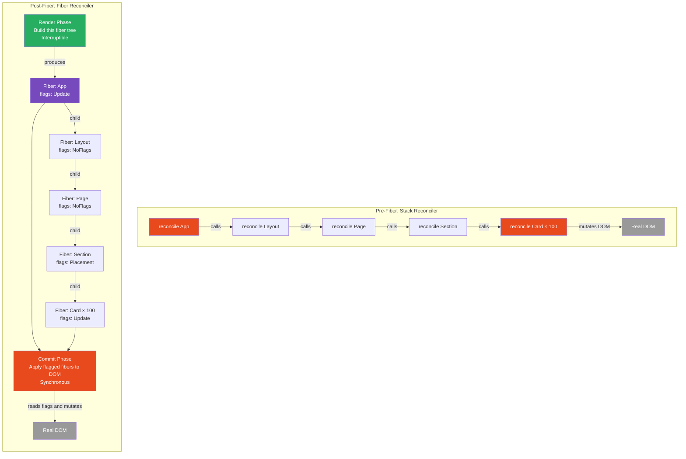
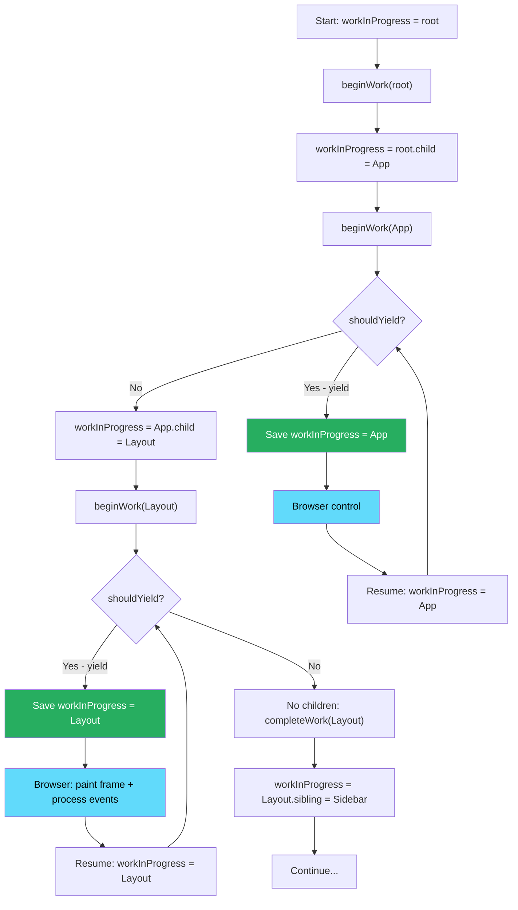

# 11 · Why Fiber Exists

> **React Fiber is a complete rewrite of React's core reconciliation algorithm — replacing a recursive, synchronous, uninterruptible call stack with an iterative, asynchronous, interruptible linked-list traversal. It was not built to make React faster in the conventional sense. It was built to make React capable of scheduling, prioritizing, and pausing work — to make the browser's main thread responsive while React renders large component trees.**

React Fiber shipped in React 16 in September 2017 after approximately two years of development. It was the largest internal change in React's history — a total rewrite of the reconciler that changed zero public APIs. Understanding why it was necessary, what constraints it had to satisfy, and what it enabled is foundational to understanding all of modern React: Suspense, concurrent rendering, `startTransition`, streaming server rendering, and React Server Components are all built on the foundation Fiber provides.

---

## Table of Contents

- [The Stack Reconciler: What React Was Before Fiber](#the-stack-reconciler-what-react-was-before-fiber)
- [The Fundamental Problem: Uninterruptible Recursion](#the-fundamental-problem-uninterruptible-recursion)
- [What Jank Actually Looks Like](#what-jank-actually-looks-like)
- [The Requirements for a New Reconciler](#the-requirements-for-a-new-reconciler)
- [Why Recursion Cannot Be Paused](#why-recursion-cannot-be-paused)
- [The Key Insight: Represent Work as Data](#the-key-insight-represent-work-as-data)
- [From Recursive Function Calls to a Linked List](#from-recursive-function-calls-to-a-linked-list)
- [What Fiber Enables: The Feature Roadmap](#what-fiber-enables-the-feature-roadmap)
- [The Two-Phase Model Fiber Makes Possible](#the-two-phase-model-fiber-makes-possible)
- [Fiber as the Foundation of Modern React](#fiber-as-the-foundation-of-modern-react)
- [Architecture Diagrams](#architecture-diagrams)
- [Good Practices](#good-practices)
- [Bad Practices](#bad-practices)
- [Mental Model](#mental-model)
- [Common Misconceptions](#common-misconceptions)
- [Exercises](#exercises)
- [Further Reading](#further-reading)

---

## The Stack Reconciler: What React Was Before Fiber

From React's open-source release in 2013 until React 16 in 2017, the reconciler was based on a straightforward recursive algorithm. When a component needed to update, React called its render function and then recursively called render on every child, every grandchild, and so on — all the way down to the leaf nodes.

```js
// The stack reconciler (simplified — this is how React 0.x through 15 worked)
function reconcile(component) {
  // Step 1: Call the component's render function
  const element = component.render();

  // Step 2: Compare against the previous render output
  const prevElement = component._prevElement;

  if (element.type !== prevElement.type) {
    // Different type: destroy old DOM subtree, create new one
    unmountComponent(component);
    mountComponent(element);
  } else {
    // Same type: update props, recurse into children
    updateComponent(component, element.props);

    // Step 3: Recurse into every child
    element.props.children.forEach((child, i) => {
      reconcile(prevElement.props.children[i], child);
      // This recursive call pushes a new frame onto the JavaScript call stack
      // It cannot be stopped until all frames return
    });
  }
}
```

This algorithm is a **depth-first tree traversal implemented as recursive function calls**. It is simple, correct, and has a fatal problem.

### What "recursive" means for the call stack

When `reconcile(App)` calls `reconcile(Layout)` which calls `reconcile(Page)` which calls `reconcile(Section)` — each call pushes a new frame onto the JavaScript call stack. The call stack grows one frame per component level:

```
reconcile(App)            ← frame 1
  reconcile(Layout)       ← frame 2
    reconcile(Page)       ← frame 3
      reconcile(Section)  ← frame 4
        reconcile(Card)   ← frame 5
          reconcile(Text) ← frame 6
```

When `reconcile(Text)` finishes, frame 6 pops. When `reconcile(Card)` finishes, frame 5 pops. And so on. The call stack only unwinds — **there is no mechanism to pause it in the middle and resume later**. A function call either returns or throws. It cannot be suspended.

---

## The Fundamental Problem: Uninterruptible Recursion

The entire reconciliation must complete before JavaScript yields control to the browser. This is not a quirk of React's implementation — it is a fundamental constraint of the JavaScript runtime.

```
User clicks button
  ↓
React.setState() called
  ↓
reconcile(App) begins — call stack grows
  reconcile(Layout)
    reconcile(Page)
      reconcile(Section)
        ... × 500 more components ...
          reconcile(DeepLeaf)  ← we are here, 50ms in
  ← call stack unwinds
  ← call stack unwinds
  ← call stack unwinds
reconcile(App) returns — entire tree processed
  ↓
Browser can now:
  - Paint the new frame
  - Process any user events that arrived during reconciliation
  - Execute any other JavaScript
```

If that reconciliation takes 50ms (not unusual for a large component tree), the browser was completely blocked for 50ms. During those 50ms:

- A user typing in an input saw their character appear 50ms late
- Animations stuttered or froze
- Scroll events were queued but not processed
- Any other JavaScript on the page was blocked

At 60fps, you have 16.67ms per frame. A 50ms block skips 3 frames. Users perceive frame drops above ~100ms as lag and above ~300ms as freezing.

### Measuring the actual problem

This was not theoretical. Facebook's engineering team had profiling data from real applications:

```
Typical React 15 reconciliation times for production apps:

Small apps (< 100 components):    2-5ms   → acceptable
Medium apps (100-500 components): 10-30ms → noticeable lag
Large apps (500+ components):     30-100ms → significant freezing
Complex lists (1000+ items):      100ms+  → unusable during updates
```

The problem was getting worse as React applications grew larger and more complex. There was no optimization path within the stack reconciler — you could not make recursive function calls interruptible. The algorithm had to be redesigned from scratch.

---

## What Jank Actually Looks Like

To understand what Fiber solves, it helps to see what the problem looks like from the user's perspective.

### Input lag

A user types in a search input. The onChange handler calls setState. The stack reconciler begins reconciling the entire tree — which includes a list of 1,000 search results that needs to re-render. For 80ms, nothing happens. Then everything updates at once.

```
User presses key: 't'         [0ms]
React starts reconciling      [1ms]
... 79ms of blocked main thread ...
React commits DOM mutations   [80ms]
Browser paints new frame      [82ms]
User SEES the 't' appear      [82ms]  ← 82ms delay feels like lag
```

### Animation jitter

An animation uses `requestAnimationFrame` to update a value 60 times per second. Every 16.67ms, the animation callback fires and calls setState. If reconciliation takes 30ms, the animation callback fires during reconciliation — it is queued but cannot run until reconciliation completes. The animation skips frames.

```
16.67ms: rAF callback fires, setState called, reconciliation starts
46.67ms: reconciliation completes (30ms block)
46.67ms: browser can now process the queued rAF from 33.34ms — already late
```

### The "frozen" feeling

During a large state update, the user's mouse cursor may not follow the mouse, scroll events may not process, and even native browser features (like text selection) may feel unresponsive. This is because all of these depend on the browser's event loop — which cannot run while JavaScript is executing.

---

## The Requirements for a New Reconciler

The React team identified the capabilities the new reconciler needed to have. These requirements directly shaped Fiber's design:

### Requirement 1: Pause work and resume later

The reconciler must be able to stop processing in the middle of a component tree and resume from exactly where it left off in a future frame.

### Requirement 2: Assign priority to different updates

Not all updates are equally urgent. A user's keypress must be processed immediately. A background data fetch can wait. The reconciler must prioritize high-priority work over low-priority work.

### Requirement 3: Reuse previously completed work

If the reconciler starts processing an update and a higher-priority update arrives, it must be able to throw away the in-progress low-priority work and restart — but it should be able to reuse work that was completed for unchanged subtrees.

### Requirement 4: Abort work if it becomes unnecessary

If a low-priority update is in progress and a new state update supersedes it (makes it obsolete), the reconciler must be able to abandon the in-progress work entirely.

### Requirement 5: Return multiple results from render

Class components' `render()` could only return one element. The new reconciler needed to support fragments, portals, and multiple return values.

The stack reconciler could not satisfy any of these requirements because they all require **interruptibility** — the ability to stop mid-way through processing. Recursive function calls on the JavaScript call stack are not interruptible.

---

## Why Recursion Cannot Be Paused

This is the core technical constraint that made Fiber necessary. To understand it, you need to understand how the JavaScript call stack works.

When a function calls another function, the runtime:

1. Pushes the current function's state (local variables, current instruction pointer) onto the call stack
2. Begins executing the new function
3. When the new function returns, pops the stack frame and resumes the calling function

```js
function a() {
  // Do some work
  b(); // pushes frame, transfers control
  // When b() returns, we resume here
}

function b() {
  // Do some work
  c(); // pushes frame, transfers control
  // When c() returns, we resume here
}
```

There is no way to:

- Pause execution in the middle of `b()` and transfer control elsewhere
- Resume `b()` from the exact point it was paused
- Inspect or modify the call stack from outside

The JavaScript runtime does not expose the call stack as a data structure. You cannot save it, restore it, or modify it. You can only add to it (function call) or remove from it (function return or throw).

### The generator exception

JavaScript generators (`function*`) provide a form of cooperative pausing via `yield`. In theory, the reconciler could have been implemented using generators:

```js
function* reconcileGenerator(component) {
  yield; // pause — resume in next frame
  const element = component.render();
  yield; // pause — resume in next frame
  for (const child of element.props.children) {
    yield* reconcileGenerator(child); // recursive generator
  }
}
```

The React team considered generators and rejected them for several reasons:

- Generators require the entire call chain to be generator functions — you cannot yield from a regular function
- Generators have significant performance overhead compared to regular function calls
- Generators are not available in all target environments without polyfills
- The React team wanted more control over the scheduling mechanism than generators provide

The solution was to **not use the call stack at all** — to build a custom data structure that represents the work to be done, independent of the JavaScript call stack.

---

## The Key Insight: Represent Work as Data

The fundamental insight behind Fiber is this: **instead of representing work as JavaScript function calls on the call stack, represent it as data structures (objects) in the heap**.

A JavaScript object can be:

- Saved (stored in a variable, on another object, in an array)
- Paused (just stop processing it and pick it up later)
- Prioritized (sorted or reordered before processing)
- Aborted (just stop referencing it and let it be garbage collected)
- Resumed (read its saved state and continue from where you left off)

None of these are possible with call stack frames. All of these are trivially possible with heap objects.

The "Fiber" in React Fiber is the name for this data structure — a unit of work represented as an object:

```js
// A Fiber node — a unit of work represented as a plain object
const fiber = {
  // Identity
  type: MyComponent, // what component this represents
  key: null, // reconciliation key

  // Tree structure (linked list — not call stack)
  return: parentFiber, // parent (where to go when done)
  child: firstChildFiber, // first child (next work to do when going down)
  sibling: nextSiblingFiber, // next sibling (next work to do when going right)

  // Work state
  pendingProps: newProps, // props for this render cycle
  memoizedProps: prevProps, // props from last completed render
  memoizedState: hookState, // state from last completed render
  updateQueue: pendingUpdates, // queued state updates

  // Output
  stateNode: domNode, // the real DOM node (or class instance)
  flags: EffectFlags, // what needs to happen in commit phase
  subtreeFlags: ChildFlags, // any effects in this subtree?

  // Scheduling
  lanes: Lane, // priority of pending work in this fiber
  childLanes: ChildLane, // priority of pending work in subtree

  // Double buffering
  alternate: otherFiber, // the other version of this fiber (WIP or current)
};
```

With this data structure, React can:

- **Pause**: just stop calling `performUnitOfWork` — the `workInProgress` pointer remembers where you are
- **Resume**: call `performUnitOfWork(workInProgress)` again — the fiber has all the state needed to continue
- **Prioritize**: process high-priority fiber subtrees before low-priority ones by checking `fiber.lanes`
- **Abort**: set `workInProgress = null` — in-progress work is abandoned, garbage collected
- **Reuse**: copy a committed fiber's state via `fiber.alternate` — reuse unchanged subtrees

---

## From Recursive Function Calls to a Linked List

The tree structure that was previously implicit in the call stack is now explicit in the Fiber linked list. The traversal algorithm changes from recursive to iterative:

### Stack reconciler traversal (recursive)

```js
// Depth-first tree traversal using the call stack
function reconcile(fiber) {
  processWork(fiber); // do work on this node
  fiber.children.forEach((child) => {
    reconcile(child); // recurse — stack grows
  });
  // Stack frame pops here — cannot pause here
}
// Entire tree must complete before any other code can run
```

### Fiber reconciler traversal (iterative)

```js
// Depth-first tree traversal using an explicit linked list
// workInProgress tracks "where are we in the tree"
let workInProgress = rootFiber;

function workLoop() {
  while (workInProgress !== null && !shouldYield()) {
    workInProgress = performUnitOfWork(workInProgress);
    // workInProgress is now the next fiber to process
    // If shouldYield() returns true, the loop exits
    // workInProgress still points to where we are — we can resume later
  }
}

function performUnitOfWork(fiber) {
  // Process this fiber (calls the component function for function components)
  beginWork(fiber);

  // Where to go next?
  if (fiber.child) {
    return fiber.child; // go down (has children — process them next)
  }

  // No children — go right or up
  let next = fiber;
  while (next !== null) {
    completeWork(next); // this fiber is done
    if (next.sibling) {
      return next.sibling; // go right (has sibling — process it next)
    }
    next = next.return; // go up (no sibling — complete parent and try its sibling)
  }

  return null; // reached root — work complete
}
```

The critical difference: after each call to `performUnitOfWork`, the loop checks `shouldYield()`. If it returns `true`, the loop exits. `workInProgress` still points to the next fiber to process. When React resumes (in the next frame via `MessageChannel`), it calls `workLoop` again and picks up exactly where it left off.


---

## What Fiber Enables: The Feature Roadmap

Andrew Clark, one of Fiber's primary authors, described Fiber as "infrastructure" — a foundation that makes a class of features possible that were previously impossible. Here is the feature roadmap that Fiber unlocked:

### React 16 (Fiber ships — synchronous concurrent features)

- **Error boundaries** — `componentDidCatch` and `getDerivedStateFromError`. Error boundaries require the reconciler to partially unwind a fiber tree and re-render with an error state. This is only possible with Fiber's explicit tree structure.
- **Portals** — rendering into DOM nodes outside the React root. Requires Fiber's separation of the component tree from the DOM tree.
- **Fragments** — returning multiple elements from render without a wrapper. Requires Fiber's ability to represent a component as multiple DOM outputs.
- **Return types** — rendering strings, numbers, arrays, and null from render functions.

### React 16.6 (Lazy and Suspense)

- **React.lazy** — loading component code dynamically. When a lazy component throws a promise (because its code hasn't loaded yet), Fiber catches it and waits.
- **Suspense** — the "throw a promise, show a fallback" mechanism. Only possible because Fiber can interrupt rendering mid-tree, show a fallback, and resume when the promise resolves.

### React 16.8 (Hooks)

- **Hooks** — the hook linked list (`memoizedState`) lives on the Fiber node. Without Fiber's explicit fiber nodes per component, hooks would have nowhere to store their state across renders.

### React 18 (Concurrent Features)

- **Concurrent rendering** — actually using Fiber's interruptibility in production. `startTransition` marks updates as low-priority. The Scheduler uses `shouldYield` to pause low-priority work.
- **Automatic batching** — all state updates in any context are batched.
- **`useTransition` and `useDeferredValue`** — priority-based rendering coordination.
- **Suspense for data fetching** — combined with Concurrent React, Suspense can show loading states while data fetches complete without blocking higher-priority updates.
- **Streaming server rendering** — the server can send HTML in chunks as components complete rendering, with Suspense boundaries acting as streaming insertion points.

### React 19 and beyond

- **React Server Components** — requires Fiber's ability to render components in different environments (server vs. client) and reconcile their outputs.
- **React Compiler** — the compiler emits code that works with Fiber's memoization model.

---

## The Two-Phase Model Fiber Makes Possible

One of Fiber's most important architectural contributions is the clean separation of the **render phase** (pure computation, interruptible) from the **commit phase** (side effects, uninterruptible).

### Why the stack reconciler couldn't separate phases

The stack reconciler mixed computation and DOM mutation in a single pass. As it traversed the tree, it both computed what changed and applied those changes to the DOM:

```js
// Stack reconciler: compute and mutate in the same pass
function reconcile(prevVDom, nextVDom, domNode) {
  if (prevVDom.type !== nextVDom.type) {
    domNode.replaceWith(createDom(nextVDom)); // ← DOM mutation during traversal
  } else {
    updateDomProperties(domNode, prevVDom.props, nextVDom.props); // ← DOM mutation
    reconcileChildren(prevVDom.children, nextVDom.children, domNode);
  }
}
```

This meant:

- You couldn't pause partway through — the DOM would be left in a partially-updated state
- You couldn't retry a render — DOM mutations had already been applied
- Effects ran during reconciliation — interleaved with DOM mutations

### How Fiber separates the phases

Fiber's render phase produces a **description of changes** (effect flags on fiber nodes). No DOM is touched. No effects run. The render phase can be interrupted, restarted, and retried freely because it is pure computation with no observable side effects.

Only when the render phase completes does the commit phase begin — applying all the DOM changes at once, synchronously, without interruption.

```
Render Phase (interruptible):
  Fiber A: pendingProps = new, flags = Update
  Fiber B: pendingProps = new, flags = Placement (new)
  Fiber C: flags = ChildDeletion
  ... all computed, nothing applied ...

Commit Phase (uninterruptible, applied all at once):
  Apply Update to Fiber A's DOM node
  Insert Fiber B's DOM node
  Delete Fiber C's DOM node
```

This phase separation is only possible because Fiber represents work as data — you can annotate data structures with "what needs to happen" without actually doing it yet.

---

## Fiber as the Foundation of Modern React

It is impossible to understand modern React without understanding Fiber's motivation. Every advanced React feature — concurrent rendering, Suspense, streaming, Server Components — is built directly on top of the mechanisms Fiber introduced:

| Modern React Feature                       | Fiber Mechanism Required                              |
| ------------------------------------------ | ----------------------------------------------------- |
| `startTransition` / low-priority rendering | Interruptible work loop, priority lanes               |
| `Suspense`                                 | Throw-a-promise catching in render phase              |
| Streaming SSR                              | Render phase can be paused, flush partial output      |
| React Server Components                    | Different fiber renderers for server and client       |
| React Compiler                             | Memoization at the fiber level (`memoizedState`)      |
| Error Boundaries                           | Partial tree unwinding in fiber tree                  |
| Hooks                                      | Hook state stored on fiber's `memoizedState`          |
| `React.lazy`                               | Promise throwing in render phase                      |
| Portals                                    | Fiber tree ≠ DOM tree — explicit host parent tracking |
| Fragments                                  | One fiber → multiple DOM nodes                        |

Without Fiber, none of these are possible. With Fiber, all of them fall out naturally from the core architecture.

---

## Architecture Diagrams

### The evolution: stack to fiber



### The fiber tree traversal algorithm



---

## Good Practices

### ✅ Good Practice — Write components that are safe to interrupt and restart

```tsx
/**
 * Good: Component function is pure — no side effects during render.
 * React can safely call it multiple times (Strict Mode double-invoke,
 * concurrent render restart) without incorrect behavior.
 *
 * Fiber makes rendering interruptible — this means your component
 * function may run more than once per committed update.
 * Purity is not just a style guide — it is a correctness requirement.
 */
function ExpensiveReport({ data, filters }: ReportProps) {
  // ✅ Pure computation — can run multiple times safely
  const processedData = useMemo(() => {
    return data
      .filter((row) => matchesFilters(row, filters))
      .map((row) => transformRow(row))
      .reduce(aggregateRows, initialAggregate);
  }, [data, filters]);

  // ✅ No side effects — no fetch, no console.log, no mutations
  return <ReportTable data={processedData} />;
}
```

**Why this matters with Fiber:** Because Fiber's render phase is interruptible and may restart, your component function may be called more times than you expect — especially in Concurrent React with `startTransition`. A function that mutates external state during render (logs analytics, updates a global, fires a request) will produce incorrect behavior when called multiple times.

---

## Bad Practices

### ⚠️ Bad Practice — Assuming component functions run exactly once per visible update

```tsx
/**
 * Bad: Side effect during render assumes the function runs exactly once
 * per committed update. With Fiber's concurrent mode, this assumption breaks.
 */
let renderCount = 0;
const analyticsBuffer: string[] = [];

function ProductPage({ productId }: { productId: string }) {
  // ❌ Side effect during render — runs on interrupted renders too
  renderCount++;
  analyticsBuffer.push(`render:${productId}:${Date.now()}`);
  // In concurrent mode with startTransition:
  // - Render starts (low priority)
  // - User types → render interrupted and restarted
  // - render() was called but no commit happened
  // - analyticsBuffer has a spurious entry
  // - renderCount is wrong

  // ❌ This also breaks in Strict Mode development
  // (component runs twice per committed render)

  return <Product id={productId} />;
}

/**
 * ✅ Correct: Side effects in useEffect — runs after commit, once per committed render
 */
function ProductPage({ productId }: { productId: string }) {
  useEffect(() => {
    // Guaranteed to run once per committed render — never on interrupted renders
    analytics.track("product_viewed", { productId });
  }, [productId]);

  return <Product id={productId} />;
}
```

**Production impact:** With Concurrent React, a render that gets interrupted by higher-priority work is discarded — its commit never happens. Any side effects that ran during that render (analytics events, counter increments, API calls) have fired even though the user never saw that render's output. This produces duplicate analytics, incorrect metrics, and spurious network requests.

---

## Mental Model

> 💡 **The Fiber mental model:**
>
> The stack reconciler was like a **phone call** — once started, you had to stay on the line until it finished. Nobody else could call you. The browser couldn't paint. The user's input went to voicemail. Fiber is like a **to-do list** — instead of having a phone call, you write down what needs to be done. You work through the list, item by item, and after every item you check: "Is there something more urgent?" If yes, you put the current item back on the list and handle the urgent thing. When you come back, you pick up exactly where you left off. The list (the fiber tree) is the data structure that makes this possible. The phone call (the call stack) could not be interrupted. The to-do list can be.

---

## Common Misconceptions

### "Fiber makes React render faster"

Fiber does not speed up individual renders. A component that takes 1ms to render still takes 1ms in Fiber. What Fiber does is make React _more responsive_ by distributing rendering work across multiple frames and prioritizing urgent work. The total work is the same; the scheduling is smarter.

### "Fiber is about virtual DOM performance"

Fiber is a scheduling and priority system, not a virtual DOM optimization. The diffing algorithm (reconciliation) is largely the same before and after Fiber. The key improvement is the ability to interrupt and resume the diffing process.

### "Fiber means React uses multiple threads"

JavaScript is single-threaded. Fiber does not change this. React renders on the main thread — the same thread as your other JavaScript, the browser's event handling, and layout/paint. Fiber creates the _illusion_ of concurrency by time-slicing on the single main thread.

### "Concurrent React is the same as Concurrent Mode"

"Concurrent Mode" was the term used during React 18's development. It was renamed to "Concurrent Features" before release. You don't opt into concurrent mode — you opt into individual concurrent features (`startTransition`, `useTransition`, `useDeferredValue`, Suspense) selectively.

### "You need to understand Fiber to write React components"

You don't need to understand Fiber's implementation to write React components — just as you don't need to understand a CPU's instruction pipeline to write C code. But you do need to understand Fiber's _implications_: that render functions may run multiple times, that rendering can be interrupted, and that effects are the correct place for side effects.

---

## Exercises

### Exercise 1 — Observe concurrent interruption

Build a component that logs to the console when it renders:

```tsx
function TraceRender({ label }: { label: string }) {
  console.log(`Rendering: ${label}`);
  // Add an expensive computation to make this slow
  const start = Date.now();
  while (Date.now() - start < 2) {} // 2ms artificial delay
  return <div>{label}</div>;
}
```

Render 50 of these inside a `startTransition`. While the transition is rendering, trigger another state update (click a button). Observe in the console: does the transition restart? Do renders appear that don't correspond to a committed update?

### Exercise 2 — Visualize the fiber tree

Install React DevTools. Inspect any React application. In the Components tab, every component you see corresponds to a Fiber node. Notice the tree structure. Open the browser console and run:

```js
// Get the fiber from a DOM node
const domNode = document.querySelector("#root");
const fiberKey = Object.keys(domNode).find((k) => k.startsWith("__reactFiber"));
const rootFiber = domNode[fiberKey];
console.log(rootFiber); // Inspect the fiber node structure
console.log(rootFiber.child); // First child fiber
console.log(rootFiber.child.sibling); // Sibling fiber
```

### Exercise 3 — Implement a minimal work loop

Build a simplified version of Fiber's work loop that processes units of work from a linked list with interruption:

```js
// Build this to understand the core Fiber concept
class WorkNode {
  constructor(label, children = []) {
    this.label = label;
    this.children = children;
    this.child = null; // first child fiber
    this.sibling = null; // next sibling fiber
    this.return = null; // parent fiber
  }
}

function buildFiberTree(node, parent = null) {
  node.return = parent;
  let prev = null;
  for (const child of node.children) {
    buildFiberTree(child, node);
    if (prev) prev.sibling = child;
    else node.child = child;
    prev = child;
  }
  return node;
}

function performUnitOfWork(fiber) {
  console.log("Processing:", fiber.label);
  if (fiber.child) return fiber.child;
  let next = fiber;
  while (next) {
    if (next.sibling) return next.sibling;
    next = next.return;
  }
  return null;
}

// Run the work loop with artificial yielding
async function workLoop(root) {
  let workInProgress = root;
  while (workInProgress) {
    workInProgress = performUnitOfWork(workInProgress);
    // Yield every 3 nodes to simulate shouldYield()
    if (/* every 3rd node */ Math.random() < 0.3) {
      await new Promise((r) => setTimeout(r, 16)); // simulate yielding to browser
    }
  }
}
```

---

## Further Reading

- [React Fiber Architecture — Andrew Clark](https://github.com/acdlite/react-fiber-architecture) — The original design document, written during development
- [React Source: ReactFiber.js](https://github.com/facebook/react/blob/main/packages/react-reconciler/src/ReactFiber.js) — The Fiber node creation and structure
- [React Source: ReactFiberWorkLoop.js](https://github.com/facebook/react/blob/main/packages/react-reconciler/src/ReactFiberWorkLoop.js) — The work loop implementation
- [Lin Clark: A Cartoon Intro to Fiber (ReactConf 2017)](https://www.youtube.com/watch?v=ZCuYPiUIONs) — The best visual explanation of Fiber's motivation
- [Sebastian Markbåge: React's Architecture (2019)](https://www.youtube.com/watch?v=crM1iRVGpGQ) — Fiber's role in React's long-term architecture
- Next in this handbook: [12 · Fiber Node Structure](./02-fiber-node.md)

---

_Part of the [React + Next.js Engineering Handbook](../../README.md)_
