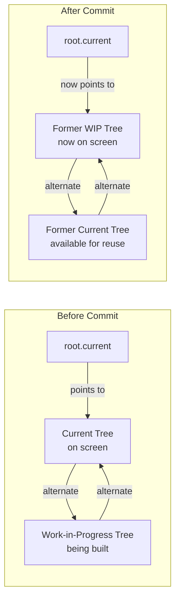
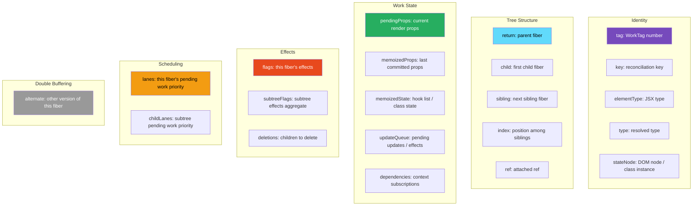
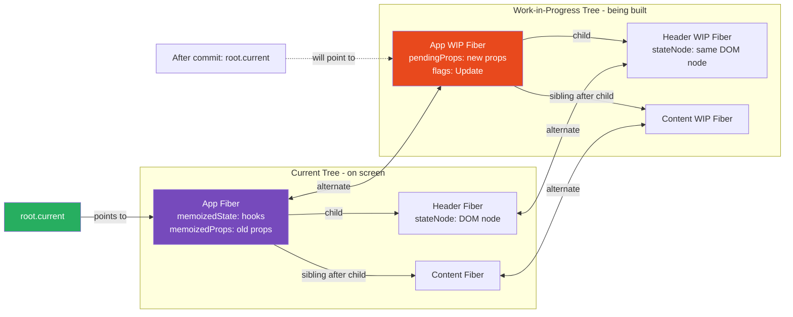

# 12 · Fiber Node Structure

> **A Fiber node is a JavaScript object — React's unit of work. One Fiber exists per component instance, per DOM element, per text node, per portal, per Suspense boundary. Every field on a Fiber node has a precise purpose: some track identity, some track tree structure, some track work state, some track scheduling priority, and some track effects. Understanding every field is understanding how React knows what to render, where to put it, what changed, and how urgent that change is.**

The Fiber node is the central data structure of React's reconciler. Everything React knows about a mounted component — its current props, its state, its effects, its position in the tree, its DOM node, its priority — lives on the Fiber. Reading the Fiber node structure is reading React's mind.

---

## Table of Contents

- [Fiber Node: The Complete Structure](#fiber-node-the-complete-structure)
- [Identity Fields](#identity-fields)
- [Tree Structure Fields](#tree-structure-fields)
- [Work State Fields](#work-state-fields)
- [Effect Fields](#effect-fields)
- [Scheduling Fields](#scheduling-fields)
- [Double Buffering: The Alternate Field](#double-buffering-the-alternate-field)
- [Fiber Tags: The Type System](#fiber-tags-the-type-system)
- [How Fiber Nodes Are Created](#how-fiber-nodes-are-created)
- [How Fiber Nodes Are Reused](#how-fiber-nodes-are-reused)
- [The Hook Linked List on memoizedState](#the-hook-linked-list-on-memoizedstate)
- [The Update Queue](#the-update-queue)
- [Fiber Node Lifecycle](#fiber-node-lifecycle)
- [Reading Fibers in the Browser](#reading-fibers-in-the-browser)
- [Architecture Diagrams](#architecture-diagrams)
- [Good Practices](#good-practices)
- [Bad Practices](#bad-practices)
- [Mental Model](#mental-model)
- [Common Misconceptions](#common-misconceptions)
- [Exercises](#exercises)
- [Further Reading](#further-reading)

---

## Fiber Node: The Complete Structure

Here is the complete Fiber node as it exists in React's source code, annotated with the purpose of every field:

```js
// From: packages/react-reconciler/src/ReactFiber.js
// Simplified and annotated for clarity

function FiberNode(tag, pendingProps, key, mode) {
  // ─────────────────────────────────────────────
  // IDENTITY: What is this fiber?
  // ─────────────────────────────────────────────
  this.tag = tag;
  // WorkTag number: FunctionComponent=0, ClassComponent=1,
  // HostRoot=3, HostComponent=5, HostText=6, Fragment=7,
  // ContextProvider=10, SuspenseComponent=13, MemoComponent=14...
  // Determines how beginWork and completeWork handle this fiber.

  this.key = key;
  // The React key prop — used for reconciliation of lists.
  // null if no key was provided.

  this.elementType = null;
  // The raw type from the React element: the function, class,
  // or string ('div', 'span'). Used for identity comparison.
  // Example: elementType = Button (the function reference)

  this.type = null;
  // Resolved component type. Usually the same as elementType,
  // but differs for lazy components (resolved after loading)
  // and memo/forwardRef wrappers (unwrapped type).

  this.stateNode = null;
  // The "output" of this fiber — what it produces in the host environment.
  // For HostComponent ('div'): the real DOM node
  // For ClassComponent: the class instance
  // For FunctionComponent: null (no instance)
  // For HostRoot: the FiberRoot object
  // For HostText: the real Text DOM node

  // ─────────────────────────────────────────────
  // TREE STRUCTURE: Where is this fiber in the tree?
  // ─────────────────────────────────────────────
  this.return = null;
  // Pointer to the parent fiber.
  // Named "return" because this is where the work loop returns
  // after completing this fiber. Not "parent" to avoid confusion
  // with the DOM parent (which may be different due to fragments/portals).

  this.child = null;
  // Pointer to the first child fiber.
  // Additional children are accessible via child.sibling.

  this.sibling = null;
  // Pointer to the next sibling fiber (same parent).
  // The last sibling's sibling is null.

  this.index = 0;
  // Position among siblings — used for list reconciliation
  // when no key is provided (position-based matching).

  this.ref = null;
  // The ref attached to this fiber (the ref prop value).
  // Can be a RefObject ({ current: null }) or a callback ref (function).
  // Attached to stateNode during the layout phase.

  this.refCleanup = null;
  // Cleanup function returned by callback refs (React 19+).

  // ─────────────────────────────────────────────
  // WORK STATE: What is React currently working on?
  // ─────────────────────────────────────────────
  this.pendingProps = pendingProps;
  // The props for the current render cycle.
  // Set at the start of beginWork.
  // Becomes memoizedProps after the render completes.

  this.memoizedProps = null;
  // The props from the last COMMITTED render.
  // Used for prop comparison during reconciliation.
  // If pendingProps !== memoizedProps → component needs to re-render.

  this.updateQueue = null;
  // For HostComponent: the prop diff payload (array of [key, value] pairs)
  //   computed during the render phase, applied in the commit phase.
  // For ClassComponent: a queue of setState updates.
  // For FunctionComponent: a queue of useEffect/useLayoutEffect objects.
  // For HostRoot: the initial element to render.

  this.memoizedState = null;
  // The state from the last COMMITTED render.
  // For FunctionComponent: the HEAD of the hook linked list.
  //   Each hook call adds a node to this list.
  // For ClassComponent: the component's this.state.
  // For HostRoot: the currently rendered element.

  this.dependencies = null;
  // Context dependencies for this fiber.
  // A linked list of contexts this component reads via useContext.
  // When any context value changes, React traverses this list
  // to find which fibers need to re-render.

  this.mode = mode;
  // Rendering mode flags:
  // ConcurrentMode, StrictLegacyMode, StrictEffectsMode, etc.
  // Inherited from parent — propagated down the tree.

  // ─────────────────────────────────────────────
  // EFFECTS: What needs to happen in the commit phase?
  // ─────────────────────────────────────────────
  this.flags = NoFlags;
  // Bitmask of effects on THIS fiber.
  // Common flags:
  //   Placement (0b10):      insert this node into the DOM
  //   Update (0b100):        update this node's DOM properties
  //   ChildDeletion (0b10000): one or more children need deletion
  //   Ref (0b1000000000):    attach/detach ref
  //   Passive (0b10000000000): has useEffect to run
  //   Layout (0b100000000000): has useLayoutEffect to run

  this.subtreeFlags = NoFlags;
  // Bitmask of effects in this fiber's SUBTREE (children, grandchildren...).
  // Computed by bubbleProperties during completeWork.
  // The commit phase uses this to skip entire subtrees with no effects —
  // only traversing branches where subtreeFlags !== NoFlags.

  this.deletions = null;
  // Array of child fibers that need to be deleted.
  // Populated during the render phase when a child is removed.
  // Processed in the mutation phase (commitDeletion).

  // ─────────────────────────────────────────────
  // SCHEDULING: How urgent is the work on this fiber?
  // ─────────────────────────────────────────────
  this.lanes = NoLanes;
  // The lanes (priorities) of PENDING WORK on this fiber.
  // Set when setState/dispatch is called.
  // Cleared when work is committed.
  // Example: SyncLane set → this fiber has synchronous work pending.

  this.childLanes = NoLanes;
  // The lanes of pending work in this fiber's SUBTREE.
  // Updated when any descendant receives a new update.
  // Allows the work loop to skip subtrees with no pending work:
  //   if (fiber.childLanes === NoLanes) → skip entire subtree.

  // ─────────────────────────────────────────────
  // DOUBLE BUFFERING: The alternate tree
  // ─────────────────────────────────────────────
  this.alternate = null;
  // Pointer to the OTHER version of this fiber.
  // Current fiber → alternate = work-in-progress fiber
  // Work-in-progress fiber → alternate = current fiber
  // Used for:
  //   - Reading committed state (memoizedProps, memoizedState) during render
  //   - Comparing old and new props/state for change detection
  //   - Reusing the old fiber as the WIP fiber for the next render
}
```

---

## Identity Fields

### `tag` — The Fiber Type

The `tag` field is a number from the `WorkTag` enum that tells the reconciler how to handle this fiber. It determines which code path runs in `beginWork`, `completeWork`, and the commit phase:

```js
// From ReactWorkTags.js — actual constants
export const FunctionComponent = 0; // function MyComponent() {}
export const ClassComponent = 1; // class MyComponent extends React.Component
export const IndeterminateComponent = 2; // function that might be a class (legacy)
export const HostRoot = 3; // the root fiber (ReactDOM.createRoot)
export const HostPortal = 4; // ReactDOM.createPortal
export const HostComponent = 5; // 'div', 'span', 'input', etc.
export const HostText = 6; // "hello world" (text node)
export const Fragment = 7; // React.Fragment / <>
export const Mode = 8; // React.StrictMode, React.ConcurrentMode
export const ContextConsumer = 9; // Context.Consumer
export const ContextProvider = 10; // Context.Provider
export const ForwardRef = 11; // React.forwardRef(...)
export const Profiler = 12; // React.Profiler
export const SuspenseComponent = 13; // React.Suspense
export const MemoComponent = 14; // React.memo(...)
export const SimpleMemoComponent = 15; // React.memo without compare fn
export const LazyComponent = 16; // React.lazy(...)
export const OffscreenComponent = 22; // used by Suspense and Activity
```

The `tag` is set when the fiber is created and never changes. A function component fiber always has `tag = 0`. A DOM div always has `tag = 5`.

### `key`, `elementType`, `type` — Identity for Reconciliation

```js
// For a React element: <Button key="submit" variant="primary" />
fiber.key = "submit"; // from key prop
fiber.elementType = Button; // the exact JSX type (may be wrapped)
fiber.type = Button; // resolved: same as elementType for most cases

// For React.memo:
// <React.memo(Button) key="submit" />
fiber.elementType = React.memo(Button); // the memo wrapper
fiber.type = Button; // unwrapped: the actual function

// For React.lazy:
// <LazyButton /> before loading
fiber.elementType = React.lazy(() => import("./Button")); // the lazy wrapper
fiber.type = null; // null until loaded

// After loading:
fiber.type = Button; // resolved to the actual component
```

### `stateNode` — The Host Output

`stateNode` is what the fiber "produces" in the host environment. This is the connection between the React fiber tree and the real world:

```js
// For a DOM element fiber (HostComponent):
fiber.stateNode = document.createElement("div"); // real DOM node

// For a class component fiber (ClassComponent):
fiber.stateNode = new MyComponent(props); // the class instance
// This is why this.setState works in class components:
// the class instance (stateNode) calls back into the reconciler

// For a function component fiber (FunctionComponent):
fiber.stateNode = null; // function components have no instance

// For the root fiber (HostRoot):
fiber.stateNode = fiberRoot; // the FiberRoot object (different from RootFiber)
// FiberRoot holds: containerInfo (the DOM node), current (the root fiber), etc.

// For a text node (HostText):
fiber.stateNode = document.createTextNode("hello"); // real Text DOM node
```

> 🔬 **Internals:** The `stateNode` for DOM elements is created during `completeWork` — not during `beginWork`. During the render phase, `beginWork` processes the fiber and reconciles its children. During `completeWork` (upward traversal after all children are processed), the actual DOM node is created and stored in `stateNode`. The DOM node is not inserted into the real DOM until the commit phase's mutation phase.

---

## Tree Structure Fields

The three pointer fields (`return`, `child`, `sibling`) form the fiber tree's linked-list structure. Understanding them precisely is essential for understanding how the work loop traverses the tree.

### The traversal algorithm in detail

```js
// How return/child/sibling encode a tree:
//
//        App
//       /   \
//   Layout  Sidebar
//     |
//   Page
//
// Encoded as:
// App.child    = Layout
// Layout.sibling = Sidebar
// Layout.child = Page
// Page.return  = Layout
// Layout.return = App
// Sidebar.return = App
// App.return   = null (root)
// Sidebar.child = null
// Page.child   = null

// Work loop traversal:
function performUnitOfWork(fiber) {
  beginWork(fiber);

  // Depth-first: go to first child if it exists
  if (fiber.child !== null) {
    return fiber.child; // next: process first child
  }

  // No children: complete this fiber and find next work
  let completedFiber = fiber;
  while (completedFiber !== null) {
    completeWork(completedFiber);

    // Go right to sibling
    if (completedFiber.sibling !== null) {
      return completedFiber.sibling; // next: process sibling
    }

    // No sibling: go up to parent and complete it
    completedFiber = completedFiber.return;
  }

  return null; // traversal complete
}
```

### Why `return` instead of `parent`

The field is named `return` (not `parent`) because it represents where the **work loop returns to** after completing a fiber — not just the DOM parent. Due to fragments, portals, and components that render multiple children, the "return" fiber may not be the DOM parent:

```jsx
// A Fragment has no DOM output — its children's DOM parent is Fragment's parent
<div>
  {" "}
  {/* DOM parent of p elements */}
  <>
    {" "}
    {/* Fragment: fiber.return for p elements, but NOT DOM parent */}
    <p>One</p> {/* fiber.return = Fragment fiber, but DOM parent = div */}
    <p>Two</p>
  </>
</div>
```

---

## Work State Fields

### `pendingProps` vs `memoizedProps`

```js
// At the START of beginWork:
fiber.pendingProps = { label: "New Label" }; // props for this render
fiber.memoizedProps = { label: "Old Label" }; // props from last commit

// If pendingProps === memoizedProps (same reference), React may bail out.
// If they differ, React calls the component function with pendingProps.

// At the END of completeWork (after successful render):
fiber.memoizedProps = fiber.pendingProps; // props are now "committed"

// On the next render:
// pendingProps = new incoming props
// memoizedProps = what was last rendered (for comparison)
```

### `memoizedState` — The Hook Linked List

For function components, `memoizedState` is the head of a linked list of hook state objects. Each hook call during a render adds one node to this list:

```js
// Component with 3 hooks:
function UserCard({ userId }) {
  const [name, setName] = useState('');       // hook 1
  const [loading, setLoading] = useState(true); // hook 2
  useEffect(() => { fetchUser(userId); }, [userId]); // hook 3
}

// After mount, fiber.memoizedState is:
{
  // Hook 1: useState('')
  memoizedState: '',           // current value
  baseState: '',
  baseQueue: null,
  queue: { pending: null, dispatch: setName, ... },
  next: {
    // Hook 2: useState(true)
    memoizedState: true,
    baseState: true,
    baseQueue: null,
    queue: { pending: null, dispatch: setLoading, ... },
    next: {
      // Hook 3: useEffect
      memoizedState: {
        tag: HookPassive,
        create: () => { fetchUser(userId); },
        destroy: undefined,
        deps: [userId],
        next: null,          // end of list
      },
      next: null,
    }
  }
}
```

> 🔬 **Internals:** This linked list is why hooks must always be called in the same order. React identifies which hook is which by its **position in the list** — hook 1 is always the first node, hook 2 is always the second, etc. There are no names, no identifiers. If a hook is conditionally skipped on one render, all subsequent hooks shift positions in the list — React reads the wrong state for each hook. The ESLint rule `rules-of-hooks` enforces this constraint.

### `updateQueue` — Multiple Roles

The `updateQueue` field serves different purposes for different fiber types:

```js
// For FunctionComponent:
// A circular linked list of useEffect/useLayoutEffect objects
fiber.updateQueue = {
  lastEffect: {
    // the last effect in the ring
    tag: HookPassive,
    create: setupFunction,
    destroy: cleanupFunction,
    deps: [dep1, dep2],
    next: firstEffect, // circular: last → first
  },
};

// For ClassComponent:
// A queue of setState/forceUpdate calls
fiber.updateQueue = {
  baseState: currentState,
  firstBaseUpdate: null,
  lastBaseUpdate: null,
  shared: {
    pending: null, // circular list of pending Update objects
    lanes: NoLanes,
    hiddenCallbacks: null,
  },
  callbacks: null, // setState callbacks (2nd arg to setState)
};

// For HostComponent (DOM elements):
// The prop diff array, computed during render, applied during commit
fiber.updateQueue = [
  "className",
  "active button", // [key, value] pairs
  "style",
  { color: "blue" },
  "disabled",
  true,
];
// null if no props changed
```

---

## Effect Fields

### `flags` — Per-Fiber Effects

The `flags` bitmask on a fiber tells the commit phase what actions need to be taken for this specific fiber. Flags are set during the render phase and read during the commit phase:

```js
// From ReactFiberFlags.js — actual constants (abbreviated)
export const NoFlags             = /*   */ 0b0000000000000000000000000000000;
export const PerformedWork       = /*   */ 0b0000000000000000000000000000001;
export const Placement           = /*   */ 0b0000000000000000000000000000010;
// Placement: insert this DOM node into the parent
// Set when: a new fiber is created (first mount, or new element in list)

export const DidCapture          = /*   */ 0b0000000000000000000000000001000;
// DidCapture: this Suspense boundary caught a thrown promise or error

export const ChildDeletion       = /*   */ 0b0000000000000000000000000010000;
// ChildDeletion: one or more children in fiber.deletions need to be removed

export const ContentReset        = /*   */ 0b0000000000000000000001000000000;
// ContentReset: text content needs to be cleared before update

export const Ref                 = /*   */ 0b0000000000000000001000000000000;
// Ref: attach or detach a ref in the layout phase

export const Update              = /*   */ 0b0000000000000000000000000000100;
// Update: this fiber's DOM node or class component needs updating

export const Snapshot            = /*   */ 0b0000000000000010000000000000000;
// Snapshot: call getSnapshotBeforeUpdate (class components)

export const Passive             = /*   */ 0b0000000000000100000000000000000;
// Passive: has useEffect hooks that need to run

export const PassiveUnmountPendingDev = 0b0000000000001000000000000000000;

export const BeforeMutationMask  = Snapshot | ChildDeletion | ...;
export const MutationMask        = Placement | Update | ChildDeletion | ContentReset | Ref | ...;
export const LayoutMask          = Update | Ref | Callback | Visibility;
export const PassiveMask         = Passive | ChildDeletion;
```

### `subtreeFlags` — Aggregated Effect Propagation

`subtreeFlags` is computed during `completeWork` (the upward traversal). It is the bitwise OR of all `flags` and `subtreeFlags` of all children:

```js
function bubbleProperties(completedWork) {
  let subtreeFlags = NoFlags;
  let child = completedWork.child;

  while (child !== null) {
    subtreeFlags |= child.subtreeFlags; // collect from child's subtree
    subtreeFlags |= child.flags; // collect from child itself
    child = child.sibling;
  }

  completedWork.subtreeFlags |= subtreeFlags;
}
```

During the commit phase, React uses `subtreeFlags` to skip entire branches of the tree:

```js
function commitMutationEffects(root, finishedWork, lanes) {
  recursivelyTraverseMutationEffects(root, finishedWork, lanes);
  commitReconciliationEffects(finishedWork);
}

function recursivelyTraverseMutationEffects(root, parentFiber, lanes) {
  // Check subtreeFlags BEFORE descending
  const deletions = parentFiber.deletions;
  if (deletions !== null) {
    // Process deletions
  }

  if (parentFiber.subtreeFlags & MutationMask) {
    // Only descend if SOME child has mutation effects
    let child = parentFiber.child;
    while (child !== null) {
      commitMutationEffectsOnFiber(child, root, lanes);
      child = child.sibling;
    }
  }
  // If subtreeFlags has no MutationMask bits → skip entire subtree
  // This makes commit O(effects) rather than O(tree size)
}
```

> 🔬 **Internals:** The `subtreeFlags` optimization means the commit phase is proportional to the number of changes, not the size of the tree. For a 10,000-node tree where 3 nodes changed, React only traverses the 3 changed nodes plus their ancestors — not all 10,000. This is why large React trees can commit quickly even though they're large.

---

## Scheduling Fields

### `lanes` and `childLanes`

```js
// When setState is called on a component:
fiber.lanes = mergeLanes(fiber.lanes, newLane);
// Example: SyncLane → fiber.lanes = SyncLane (0b10)

// And propagated up to all ancestors:
ancestor.childLanes = mergeLanes(ancestor.childLanes, newLane);
// Now every ancestor knows: "some descendant has work at SyncLane"

// During beginWork, React checks if this fiber has work:
function checkIfWorkInProgress(fiber, renderLanes) {
  if (!includesSomeLane(renderLanes, fiber.lanes)) {
    // This fiber has no work in the current render lanes
    // Check if any children do:
    if (!includesSomeLane(renderLanes, fiber.childLanes)) {
      // No work in this subtree at all → bail out
      return bailoutOnAlreadyFinishedWork(fiber);
    }
    // Children have work → clone children and continue down
    // but skip processing THIS fiber (it has no updates)
  }
  // This fiber has work → process it fully
}
```

The `lanes` + `childLanes` system allows React to do selective rendering:

- If `fiber.lanes` has bits in `renderLanes` → process this fiber
- If `fiber.childLanes` has bits in `renderLanes` → descend into children
- If neither → skip this entire subtree in O(1)

---

## Double Buffering: The Alternate Field

The `alternate` field implements React's double-buffering system — the mechanism that allows React to prepare a new tree while the current tree is still displayed.

```js
// At any point, there are two fiber trees:
// 1. The "current" tree — what is currently on screen
// 2. The "work-in-progress" (WIP) tree — what React is building

// Every fiber in the current tree has an alternate that is the WIP version:
currentFiber.alternate = wipFiber;
wipFiber.alternate = currentFiber;

// How a fiber becomes work-in-progress:
function createWorkInProgress(current, pendingProps) {
  let workInProgress = current.alternate;

  if (workInProgress === null) {
    // First render or first update after unmount:
    // Create a new fiber as the WIP version
    workInProgress = createFiber(
      current.tag,
      pendingProps,
      current.key,
      current.mode,
    );
    workInProgress.elementType = current.elementType;
    workInProgress.type = current.type;
    workInProgress.stateNode = current.stateNode; // share the DOM node

    // Wire up the alternate relationship
    workInProgress.alternate = current;
    current.alternate = workInProgress;
  } else {
    // Subsequent updates: REUSE the existing WIP fiber
    // Just reset its work-in-progress fields
    workInProgress.pendingProps = pendingProps;
    workInProgress.type = current.type;
    workInProgress.flags = NoFlags; // clear old effect flags
    workInProgress.subtreeFlags = NoFlags;
    workInProgress.deletions = null;
  }

  // Copy fields from current to WIP (these are "committed" values)
  workInProgress.childLanes = current.childLanes;
  workInProgress.lanes = current.lanes;
  workInProgress.child = current.child;
  workInProgress.memoizedProps = current.memoizedProps;
  workInProgress.memoizedState = current.memoizedState;
  workInProgress.updateQueue = current.updateQueue;
  workInProgress.dependencies = current.dependencies;

  return workInProgress;
}
```

### The tree swap

After the commit phase, React atomically swaps the trees by updating the root pointer:

```js
// In commitRoot — between mutation phase and layout phase:
root.current = finishedWork;
// finishedWork was the WIP tree → it becomes the current tree
// The old current tree becomes available for reuse as next WIP tree
```



> 🔬 **Internals:** The two-tree double buffer system is why React can show a consistent UI while preparing the next update. The current tree is never mutated during the render phase — only the WIP tree is modified. If the render is interrupted or abandoned, the current tree is still intact and the UI remains correct. The WIP tree is simply discarded and rebuilt from the current tree next time.

---

## Fiber Tags: The Type System

The `tag` field determines everything about how a fiber is processed. Here are the most important tags with what each fiber's fields look like:

### FunctionComponent (tag = 0)

```js
{
  tag: 0,                        // FunctionComponent
  type: UserCard,                // the function itself
  stateNode: null,               // no instance
  memoizedState: HookLinkedList, // hook state
  updateQueue: EffectList,       // useEffect/useLayoutEffect list
  pendingProps: { userId: '123' },
  memoizedProps: { userId: '123' },
}
```

### HostComponent (tag = 5)

```js
{
  tag: 5,                          // HostComponent
  type: 'div',                     // DOM element tag name
  stateNode: HTMLDivElement,       // the real DOM node
  memoizedState: null,             // no hook state for DOM elements
  updateQueue: ['className', 'active', 'style', {...}], // prop diff
  pendingProps: { className: 'active', style: {...} },
  memoizedProps: { className: 'inactive', style: {...} },
}
```

### HostText (tag = 6)

```js
{
  tag: 6,                          // HostText
  type: null,                      // no type — text nodes have no tag name
  stateNode: Text,                 // the real DOM Text node
  memoizedProps: 'Hello world',    // the text content
  pendingProps: 'Hello world',
  child: null,                     // text nodes have no children
  sibling: null,
  // Most fields are null/0 — text nodes are simple
}
```

### ContextProvider (tag = 10)

```js
{
  tag: 10,                         // ContextProvider
  type: ThemeContext.Provider,     // the Provider object
  stateNode: null,
  memoizedProps: { value: 'dark', children: [...] },
  // When value changes, React traverses all consumers
  // via the context dependency linked list
}
```

---

## How Fiber Nodes Are Created

Fiber nodes are created by `createFiber` — a factory function that initializes a `FiberNode` with the appropriate tag:

```js
// The main fiber creation factory
function createFiberFromElement(element, mode, lanes) {
  const { type, key } = element;
  const pendingProps = element.props;

  return createFiberFromTypeAndProps(
    type,
    key,
    pendingProps,
    null,
    mode,
    lanes,
  );
}

function createFiberFromTypeAndProps(
  type,
  key,
  pendingProps,
  owner,
  mode,
  lanes,
) {
  let tag = IndeterminateComponent; // default — refined below
  let resolvedType = type;

  if (typeof type === "function") {
    if (shouldConstruct(type)) {
      tag = ClassComponent; // has a prototype.isReactComponent marker
    } else {
      tag = FunctionComponent; // or IndeterminateComponent until first render
    }
  } else if (typeof type === "string") {
    tag = HostComponent; // 'div', 'span', 'input', etc.
  } else {
    switch (type) {
      case REACT_FRAGMENT_TYPE:
        tag = Fragment;
        break;
      case REACT_STRICT_MODE_TYPE:
        tag = Mode;
        break;
      case REACT_PROFILER_TYPE:
        tag = Profiler;
        break;
      case REACT_SUSPENSE_TYPE:
        tag = SuspenseComponent;
        break;
      default:
        if (typeof type === "object" && type !== null) {
          switch (type.$$typeof) {
            case REACT_PROVIDER_TYPE:
              tag = ContextProvider;
              break;
            case REACT_CONTEXT_TYPE:
              tag = ContextConsumer;
              break;
            case REACT_FORWARD_REF_TYPE:
              tag = ForwardRef;
              break;
            case REACT_MEMO_TYPE:
              tag = MemoComponent;
              break;
            case REACT_LAZY_TYPE:
              tag = LazyComponent;
              break;
          }
        }
    }
  }

  const fiber = createFiber(tag, pendingProps, key, mode);
  fiber.elementType = type;
  fiber.type = resolvedType;
  fiber.lanes = lanes;
  return fiber;
}
```

---

## How Fiber Nodes Are Reused

Fiber nodes are expensive to create (allocating objects, initializing fields). React reuses existing fibers whenever possible through the `alternate` system:

```js
// During reconciliation: try to reuse existing fiber for a new element
function useFiber(fiber, pendingProps) {
  // Create a WIP version of an existing fiber with new props
  const clone = createWorkInProgress(fiber, pendingProps);
  clone.index = 0;
  clone.sibling = null;
  return clone;
  // clone.alternate = fiber (the old fiber)
  // clone.stateNode = fiber.stateNode (share the DOM node)
  // clone.memoizedState = fiber.memoizedState (keep hook state)
}

// When can React reuse a fiber?
// 1. Same position in the tree (or same key)
// 2. Same type (same function/class/string)
// If both conditions are met: reuse and update props
// If either condition fails: create new fiber, delete old one
```

The fiber reuse is what preserves component state across re-renders. When React reuses a fiber, it carries over `memoizedState` (hook state), `stateNode` (DOM node), and `updateQueue`. This is why a component that re-renders keeps its state — the Fiber node is reused with its state intact.

---

## The Hook Linked List on memoizedState

Since this is a critical implementation detail, let's trace the exact hook state for a real component:

```tsx
function SearchInput({ onSearch }: Props) {
  // Hook 1: useState
  const [query, setQuery] = useState("");

  // Hook 2: useCallback
  const handleChange = useCallback(
    (e: React.ChangeEvent<HTMLInputElement>) => {
      setQuery(e.target.value);
      onSearch(e.target.value);
    },
    [onSearch],
  );

  // Hook 3: useEffect
  useEffect(() => {
    document.title = `Searching: ${query}`;
    return () => {
      document.title = "App";
    };
  }, [query]);

  return <input value={query} onChange={handleChange} />;
}
```

After mount, `fiber.memoizedState` for `SearchInput`:

```js
fiber.memoizedState = {
  // Node 1: useState('')
  memoizedState: '',        // current query value
  baseState: '',
  queue: {
    pending: null,          // no pending updates
    dispatch: setQuery,     // the dispatch function (bound to this fiber+queue)
    lastRenderedState: '',
    lastRenderedReducer: basicStateReducer,
  },
  next: {
    // Node 2: useCallback
    memoizedState: handleChange, // the memoized callback
    queue: { ... },              // has its own update queue for the dependencies
    next: {
      // Node 3: useEffect
      memoizedState: {
        tag: HookPassive,
        create: () => {
          document.title = `Searching: ${query}`;
          return () => { document.title = 'App'; };
        },
        destroy: () => { document.title = 'App'; }, // cleanup from last run
        deps: [''],                                  // last deps: [query]
        next: null,
      },
      next: null,  // end of hook list
    }
  }
}
```

> 🔬 **Internals:** When you call `setQuery('hello')`, React creates an `Update` object and appends it to `fiber.memoizedState.queue.pending` (the first hook's queue, since `setQuery` is bound to hook 1). On the next render, `processUpdateQueue` reads this queue and computes `query = 'hello'`. The hook list is traversed in order, and each hook reads its state from its corresponding list node. This is the complete mechanism of `useState`.

---

## Fiber Node Lifecycle

A fiber node goes through these states:

```
CREATION → RENDER PHASE PROCESSING → COMMIT → REUSE / DELETION

1. CREATION:
   - createFiber() called with tag, pendingProps, key
   - All fields initialized to defaults
   - alternate = null (first time) or reused WIP (subsequent updates)

2. RENDER PHASE — beginWork:
   - pendingProps set to new incoming props
   - Component function called (for FunctionComponent)
   - memoizedState populated/updated via hooks
   - flags set: what effects does this fiber need?
   - children reconciled: child/sibling pointers set

3. RENDER PHASE — completeWork:
   - For HostComponent: DOM node created or updateQueue computed
   - subtreeFlags computed by bubbling children's flags
   - stateNode created if new

4. COMMIT PHASE:
   - flags read: Placement, Update, Deletion executed on real DOM
   - Refs attached (layout phase)
   - Effects run (layout phase: useLayoutEffect, passive phase: useEffect)
   - memoizedProps = pendingProps (props "committed")

5. AFTER COMMIT:
   - This WIP fiber becomes the current fiber (root.current swap)
   - alternate (old current) available for reuse as next WIP
   - lanes cleared (work complete)

6. REUSE (next render):
   - createWorkInProgress: alternate becomes new WIP
   - pendingProps = new props
   - flags, subtreeFlags, deletions reset
   - memoizedState, memoizedProps preserved from last commit

7. DELETION (component removed):
   - Added to parent's deletions array
   - commitDeletion: cleanup effects run, DOM removed
   - Fiber becomes unreachable → garbage collected
```

---

## Reading Fibers in the Browser

You can inspect React's fiber tree from the browser console:

```js
// Get a fiber from any DOM node
function getFiber(domNode) {
  const key = Object.keys(domNode).find(
    (k) =>
      k.startsWith("__reactFiber") || k.startsWith("__reactInternalInstance"),
  );
  return domNode[key];
}

// Inspect the root fiber
const root = document.getElementById("root");
const rootFiber = getFiber(root);

console.log("Root fiber:", rootFiber);
console.log("Current tree root:", rootFiber.child); // first child of root
console.log("Flags:", rootFiber.flags.toString(2)); // binary for readability

// Walk the fiber tree
function walkFiberTree(fiber, depth = 0) {
  if (!fiber) return;
  const type = fiber.type?.name || fiber.type || `[${fiber.tag}]`;
  console.log(" ".repeat(depth * 2) + type, {
    flags: fiber.flags.toString(2),
    lanes: fiber.lanes.toString(2),
    memoizedState: fiber.memoizedState,
  });
  walkFiberTree(fiber.child, depth + 1);
  walkFiberTree(fiber.sibling, depth);
}

walkFiberTree(rootFiber.child);
```

> ⚠️ **Warning:** This technique works in development builds. In production builds, fiber properties may be minified. React DevTools provides a safer, more stable API for fiber inspection.

---

## Architecture Diagrams

### Complete fiber node fields by category



### Double buffering: current ↔ work-in-progress



---

## Good Practices

### ✅ Good Practice — Leverage stable fiber identity for performance

```tsx
/**
 * Good: The component's identity is stable across renders.
 * React reuses the same Fiber node — preserving memoizedState (hooks),
 * stateNode (DOM node), and the alternate relationship.
 *
 * Stable identity = preserved state, no DOM recreation,
 * efficient reconciliation.
 */
function StableList({ items }: { items: Item[] }) {
  return (
    <ul>
      {items.map((item) => (
        // ✅ Stable key = stable fiber identity = preserved state
        <ListItem key={item.id} item={item} />
      ))}
    </ul>
  );
}

function ListItem({ item }: { item: Item }) {
  // This component's state is preserved when items reorder
  // because the same Fiber node is reused (same key, same type)
  const [isExpanded, setIsExpanded] = useState(false);
  const [notes, setNotes] = useState("");

  return (
    <li>
      <span>{item.name}</span>
      <button onClick={() => setIsExpanded((v) => !v)}>
        {isExpanded ? "Collapse" : "Expand"}
      </button>
      {isExpanded && (
        <textarea value={notes} onChange={(e) => setNotes(e.target.value)} />
      )}
    </li>
  );
}
```

**Why this works:** When items reorder, React's reconciliation matches fibers by key. The `ListItem` fiber for `item.id = 'task-5'` is moved to its new position in the sibling chain, but the fiber's `memoizedState` (including `isExpanded` and `notes`) is preserved. No state is lost. No DOM recreation. Just a DOM node move operation.

---

## Bad Practices

### ⚠️ Bad Practice — Storing derived values in fiber state causes stale state

```tsx
/**
 * Bad: Copying props into state stores a value in the fiber's
 * memoizedState that becomes stale when props change.
 *
 * The Fiber's memoizedState only updates when setState is called.
 * Props changing does not automatically update the hook's memoizedState.
 */
function PriceDisplay({ price, currency }: PriceProps) {
  // ❌ Stored in fiber's hook memoizedState node 1
  // Only updates when setFormattedPrice is called
  // NOT automatically updated when price or currency props change
  const [formattedPrice, setFormattedPrice] = useState(
    formatPrice(price, currency), // only runs on mount
  );

  // This useEffect tries to sync, but causes an extra render:
  useEffect(() => {
    setFormattedPrice(formatPrice(price, currency));
  }, [price, currency]);

  return <span>{formattedPrice}</span>;
}

/**
 * ✅ Correct: Derive during render — computed fresh from props,
 * never stored in the Fiber's memoizedState unnecessarily.
 */
function PriceDisplay({ price, currency }: PriceProps) {
  // ✅ Not stored in fiber state — computed during render
  // Always accurate — no synchronization needed
  const formattedPrice = useMemo(
    () => formatPrice(price, currency),
    [price, currency],
  );

  return <span>{formattedPrice}</span>;
}
```

**Production impact:** Every prop change causes two renders: one with stale formatted price (immediately after prop change, before the effect fires) and one with the correct price (after the effect fires and calls setState). Users see the wrong price briefly. At scale — for example, a real-time pricing component updating every few seconds — this produces constant flickering.

---

## Mental Model

> 💡 **The Fiber node mental model:**
>
> A Fiber node is React's **personnel file** for a component. It contains everything React needs to know about that component: who it is (identity fields), where it sits in the organization (tree structure fields), what work it has pending (work state and scheduling fields), what side effects need to happen (effect fields), and a duplicate copy that's being updated while the original is still active (the alternate). When React renders, it doesn't reinterview the component from scratch — it reads the file, sees what changed, and updates only what's necessary. When a component unmounts, React shreds the file. When it remounts, React opens a new file. The hook linked list in `memoizedState` is the most detailed section of the file — a record of every piece of state that hook has ever tracked.

---

## Common Misconceptions

### "Fiber nodes are recreated every render"

Fiber nodes persist between renders. Only React elements (the objects returned by JSX) are created fresh each render. The reconciler creates new fibers only when a component mounts for the first time. On subsequent renders, existing fibers are reused via the `alternate` system.

### "memoizedState is the component's state object"

For class components, `memoizedState` is `this.state`. For function components, `memoizedState` is the **head of the hook linked list** — not a single state value. Each `useState`, `useEffect`, `useMemo`, etc. call adds a node to this list.

### "The alternate is a snapshot of the previous render"

The alternate is not a snapshot — it is the other live version of the fiber. After a commit, the WIP fiber becomes the current fiber and vice versa. The alternate is always the version from the previous render cycle, but it becomes the next WIP fiber on the next render (it is not discarded).

### "stateNode is always a DOM node"

`stateNode` is the host output — whatever the fiber produces in the target environment. For DOM fibers (`HostComponent`), it is a DOM node. For class components, it is the class instance. For function components, it is null. For the root fiber, it is the `FiberRoot` container object.

---

## Exercises

### Exercise 1 — Inspect a fiber's hook list

```js
// In your browser console on a React app:
const button = document.querySelector("button");
const fiberKey = Object.keys(button).find((k) => k.startsWith("__reactFiber"));
const fiber = button[fiberKey];

// Walk up to find the nearest function component fiber
let current = fiber;
while (current && current.tag !== 0) {
  // 0 = FunctionComponent
  current = current.return;
}

console.log("Function component fiber:", current);
console.log("Hook list head:", current.memoizedState);
console.log("Hook 1 (first useState):", current.memoizedState);
console.log("Hook 2:", current.memoizedState.next);
console.log("Hook 3:", current.memoizedState.next?.next);
```

### Exercise 2 — Trace a setState through the update queue

Add a button that calls setState. Before clicking, inspect `fiber.memoizedState.queue.pending` (it should be null). Click the button while paused in a debugger. Inspect `pending` — it should now be the Update object. Step through the render and watch `pending` get processed and cleared.

### Exercise 3 — Observe fiber reuse vs recreation

Build a list with two buttons: one that reorders items (same keys), one that changes item types (different keys). Use DevTools → Components. Notice that reordering preserves component state (inputs keep their values). Changing types destroys and recreates state. Correlate this behavior with fiber reuse vs recreation.

---

## Further Reading

- [React Source: ReactFiber.js](https://github.com/facebook/react/blob/main/packages/react-reconciler/src/ReactFiber.js) — The FiberNode constructor and createWorkInProgress
- [React Source: ReactFiberFlags.js](https://github.com/facebook/react/blob/main/packages/react-reconciler/src/ReactFiberFlags.js) — All effect flag constants
- [React Source: ReactWorkTags.js](https://github.com/facebook/react/blob/main/packages/react-reconciler/src/ReactWorkTags.js) — All fiber tag constants
- [React Source: ReactFiberHooks.js](https://github.com/facebook/react/blob/main/packages/react-reconciler/src/ReactFiberHooks.js) — How hook state is stored on memoizedState
- [React Source: ReactFiberLane.js](https://github.com/facebook/react/blob/main/packages/react-reconciler/src/ReactFiberLane.js) — The lane bitmask system
- Next in this handbook: [13 · Fiber Tree Traversal](./03-fiber-tree-traversal.md)

---

_Part of the [React + Next.js Engineering Handbook](../../README.md)_
