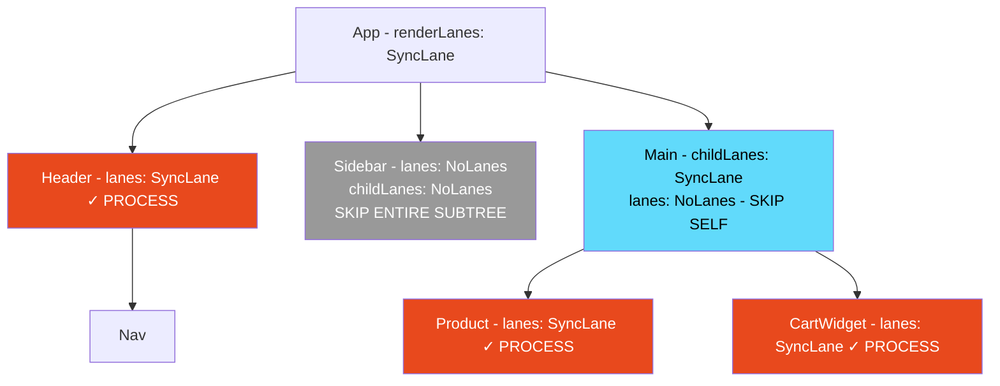

# 13 · Fiber Tree Traversal

> **Fiber tree traversal is the engine that drives React's rendering. The work loop walks the fiber tree in a precise depth-first pattern — descending through children via `beginWork`, ascending through parents via `completeWork` — and this walk is designed so that any individual step can be interrupted, yielded, and resumed without losing position. Understanding the traversal algorithm is understanding how React processes every component on every render.**

The traversal algorithm is deceptively simple in its structure but rich in its implications. Every optimization React makes — bailouts, priority skipping, subtree reuse — is expressed as a modification to this traversal. Every effect system — when effects run, in what order, for which fibers — is a product of the traversal's shape. Master the traversal and you master React's rendering engine.

---

## Table of Contents

- [The Traversal Algorithm: Overview](#the-traversal-algorithm-overview)
- [Phase 1: The Downward Pass — beginWork](#phase-1-the-downward-pass--beginwork)
- [Phase 2: The Upward Pass — completeWork](#phase-2-the-upward-pass--completework)
- [The Work Loop in Full Detail](#the-work-loop-in-full-detail)
- [Traversal with Interruption](#traversal-with-interruption)
- [Traversal Order: The Exact Sequence](#traversal-order-the-exact-sequence)
- [Bailouts: Skipping Subtrees](#bailouts-skipping-subtrees)
- [How Deletions Are Handled](#how-deletions-are-handled)
- [Traversal During the Commit Phase](#traversal-during-the-commit-phase)
- [Effect Execution Order from Traversal](#effect-execution-order-from-traversal)
- [Traversal and the Double Buffer](#traversal-and-the-double-buffer)
- [Traversal in Concurrent Mode](#traversal-in-concurrent-mode)
- [Implementing the Traversal Yourself](#implementing-the-traversal-yourself)
- [Architecture Diagrams](#architecture-diagrams)
- [Good Practices](#good-practices)
- [Bad Practices](#bad-practices)
- [Mental Model](#mental-model)
- [Common Misconceptions](#common-misconceptions)
- [Exercises](#exercises)
- [Further Reading](#further-reading)

---

## The Traversal Algorithm: Overview

React traverses the fiber tree using a **depth-first, iterative algorithm** based on three pointers on each fiber node:

- `child` → go **down** (to the first child)
- `sibling` → go **right** (to the next sibling)
- `return` → go **up** (to the parent)

The traversal has two phases for each node:

1. **`beginWork`** — called when first visiting a node (going **down**)
2. **`completeWork`** — called when a node has no more children to process (going **up**)

```
         App
        /   \
    Header  Main
      |      |  \
     Nav   Hero  List
                  |
                Item (×3)

Traversal order:
  beginWork(App)
    beginWork(Header)
      beginWork(Nav)
      completeWork(Nav)       ← Nav has no children
    completeWork(Header)
    beginWork(Main)
      beginWork(Hero)
      completeWork(Hero)
      beginWork(List)
        beginWork(Item[0])
        completeWork(Item[0])
        beginWork(Item[1])
        completeWork(Item[1])
        beginWork(Item[2])
        completeWork(Item[2])
      completeWork(List)
    completeWork(Main)
  completeWork(App)
```

This traversal visits every node exactly twice — once going down (`beginWork`), once coming up (`completeWork`). Every node in the tree is processed before the traversal is complete.

---

## Phase 1: The Downward Pass — beginWork

`beginWork` is called on a fiber when the work loop first visits it. Its job is to:

1. Determine if this fiber needs to re-render
2. If yes: call the component function (or update the class instance), producing new React elements
3. Reconcile those new elements against the existing child fibers
4. Return the first child fiber (or null if no children)

```js
// Simplified beginWork — from ReactFiberBeginWork.js
function beginWork(current, workInProgress, renderLanes) {
  // ─── OPTIMIZATION: can we bail out? ────────────────────────────
  if (current !== null) {
    // current !== null means this is an UPDATE (not first mount)
    const oldProps = current.memoizedProps;
    const newProps = workInProgress.pendingProps;

    if (
      oldProps === newProps && // props didn't change
      !includesSomeLane(renderLanes, workInProgress.lanes) && // no pending updates
      !didReceiveUpdate // no context changes
    ) {
      // ✅ BAIL OUT: skip this fiber and potentially its subtree
      return bailoutOnAlreadyFinishedWork(current, workInProgress, renderLanes);
    }
  }

  // ─── PROCESS: call the component ───────────────────────────────
  workInProgress.lanes = NoLanes; // clear lanes — we're processing this now

  switch (workInProgress.tag) {
    case FunctionComponent: {
      const Component = workInProgress.type;
      const resolvedProps = workInProgress.pendingProps;
      return updateFunctionComponent(
        current,
        workInProgress,
        Component,
        resolvedProps,
        renderLanes,
      );
    }
    case ClassComponent: {
      const Component = workInProgress.type;
      const resolvedProps = workInProgress.pendingProps;
      return updateClassComponent(
        current,
        workInProgress,
        Component,
        resolvedProps,
        renderLanes,
      );
    }
    case HostComponent: {
      return updateHostComponent(current, workInProgress, renderLanes);
    }
    case HostText: {
      return updateHostText(current, workInProgress);
    }
    case SuspenseComponent: {
      return updateSuspenseComponent(current, workInProgress, renderLanes);
    }
    case MemoComponent: {
      return updateMemoComponent(current, workInProgress, renderLanes);
    }
    // ... many more cases
  }
}
```

### beginWork for FunctionComponent

```js
function updateFunctionComponent(
  current,
  workInProgress,
  Component,
  nextProps,
  renderLanes,
) {
  // ─── Prepare context ────────────────────────────────────────────
  prepareToReadContext(workInProgress, renderLanes);

  // ─── Call the component function ────────────────────────────────
  // This is where YOUR code runs
  let nextChildren = renderWithHooks(
    current,
    workInProgress,
    Component, // your function
    nextProps, // new props
    null,
    renderLanes,
  );
  // nextChildren = what your function returned (React elements)

  // ─── Check if output changed ─────────────────────────────────────
  if (current !== null && !didReceiveUpdate) {
    // Component ran but didn't "receive" an update
    // (no hook state changed, no context changed)
    // Bail out — skip reconciling children
    bailoutHooks(current, workInProgress, renderLanes);
    return bailoutOnAlreadyFinishedWork(current, workInProgress, renderLanes);
  }

  // ─── Mark as having done work ────────────────────────────────────
  workInProgress.flags |= PerformedWork;

  // ─── Reconcile children ──────────────────────────────────────────
  reconcileChildren(current, workInProgress, nextChildren, renderLanes);

  // ─── Return first child (work loop's next step) ──────────────────
  return workInProgress.child;
}
```

### beginWork for HostComponent (DOM elements)

DOM element fibers don't call a component function — they process props directly:

```js
function updateHostComponent(current, workInProgress, renderLanes) {
  // Get the DOM element type ('div', 'span', etc.)
  const type = workInProgress.type;
  const nextProps = workInProgress.pendingProps;
  const prevProps = current !== null ? current.memoizedProps : null;

  let nextChildren = nextProps.children;

  // Special case: if children is a single string/number AND
  // there are no other nested React elements, treat as text content
  const isDirectTextChild = shouldSetTextContent(type, nextProps);
  if (isDirectTextChild) {
    // Optimization: don't create a HostText fiber for simple text
    // Just set the text content directly on the DOM node in completeWork
    nextChildren = null;
  }

  // Mark if content needs to be reset
  if (prevProps !== null && shouldSetTextContent(type, prevProps)) {
    workInProgress.flags |= ContentReset;
  }

  // Reconcile children
  reconcileChildren(current, workInProgress, nextChildren, renderLanes);
  return workInProgress.child;
}
```

---

## Phase 2: The Upward Pass — completeWork

`completeWork` is called when a fiber has no more children to process — either it had no children, or all its children have been completed. Its job is to:

1. Create or update the real DOM node (for host fibers)
2. Compute the prop diff (for updates)
3. Bubble effect flags upward to the parent

```js
// Simplified completeWork — from ReactFiberCompleteWork.js
function completeWork(current, workInProgress, renderLanes) {
  const newProps = workInProgress.pendingProps;

  switch (workInProgress.tag) {
    case FunctionComponent:
    case ClassComponent:
    case Fragment:
    case ContextProvider:
    case ContextConsumer: {
      // Non-host fibers: just bubble properties upward
      bubbleProperties(workInProgress);
      return null;
    }

    case HostComponent: {
      const rootContainerInstance = getRootHostContainer();
      const type = workInProgress.type;

      if (current !== null && workInProgress.stateNode != null) {
        // ─── UPDATE: this fiber already has a DOM node ───────────────
        updateHostComponent(current, workInProgress, type, newProps, rootContainerInstance);

        // Check if ref changed
        if (current.ref !== workInProgress.ref) {
          markRef(workInProgress); // set Ref flag
        }
      } else {
        // ─── MOUNT: create a new DOM node ────────────────────────────
        if (!newProps) {
          // This was a hydration-only fiber with no new work
          bubbleProperties(workInProgress);
          return null;
        }

        // Create the DOM node (but don't insert it yet)
        const instance = createInstance(
          type,           // 'div', 'span', etc.
          newProps,       // all props
          rootContainerInstance,
          workInProgress,
        );

        // Append all already-completed child DOM nodes to this new node
        appendAllChildren(instance, workInProgress, false, false);

        // Store the DOM node on the fiber
        workInProgress.stateNode = instance;

        // Set initial DOM properties
        finalizeInitialChildren(instance, type, newProps, rootContainerInstance);

        // Mark for Placement (insertion into parent) if needed
        if (workInProgress.ref !== null) {
          markRef(workInProgress); // Ref flag
        }
      }

      bubbleProperties(workInProgress);
      return null;
    }

    case HostText: {
      const newText = newProps; // the text string

      if (current !== null && workInProgress.stateNode != null) {
        // UPDATE: check if text changed
        const oldText = current.memoizedProps;
        updateHostText(current, workInProgress, oldText, newText);
      } else {
        // MOUNT: create text node
        workInProgress.stateNode = createTextInstance(newText, ...);
      }

      bubbleProperties(workInProgress);
      return null;
    }
  }
}
```

### appendAllChildren: building the DOM tree bottom-up

During `completeWork` for a new `HostComponent`, React calls `appendAllChildren` to attach already-completed child DOM nodes to the new parent:

```js
// Simplified appendAllChildren
function appendAllChildren(parent, workInProgress) {
  let node = workInProgress.child;

  while (node !== null) {
    if (node.tag === HostComponent || node.tag === HostText) {
      // Direct host child — append its DOM node
      appendChildToContainer(parent, node.stateNode);
    } else if (node.child !== null) {
      // Non-host child (function component, fragment, etc.)
      // Go deeper to find the host nodes
      node.child.return = node;
      node = node.child;
      continue;
    }

    if (node === workInProgress) return;

    // No more children — go to sibling or back up
    while (node.sibling === null) {
      if (node.return === null || node.return === workInProgress) return;
      node = node.return;
    }
    node.sibling.return = node.return;
    node = node.sibling;
  }
}
```

> 🔬 **Internals:** `appendAllChildren` is why React can build the entire DOM tree in memory before inserting it into the real document. Each `completeWork` call builds a DOM subtree by appending child DOM nodes to the current node's stateNode. By the time the root fiber completes, there is a complete in-memory DOM tree that only requires a single `appendChild` to insert into the real document. This minimizes browser reflows — instead of inserting each node individually (triggering layout after each), the entire tree is inserted at once.

### bubbleProperties: aggregating flags upward

```js
function bubbleProperties(completedWork) {
  const didBailout =
    completedWork.alternate !== null &&
    completedWork.alternate.child === completedWork.child;

  let newChildLanes = NoLanes;
  let subtreeFlags = NoFlags;

  if (!didBailout) {
    // Process all children's flags
    let child = completedWork.child;
    while (child !== null) {
      newChildLanes = mergeLanes(
        newChildLanes,
        mergeLanes(child.lanes, child.childLanes),
      );
      subtreeFlags |= child.subtreeFlags;
      subtreeFlags |= child.flags;
      child.return = completedWork; // ensure return pointer is set
      child = child.sibling;
    }

    completedWork.subtreeFlags |= subtreeFlags;
  } else {
    // Bailout: just check if any child has lanes (pending work)
    let child = completedWork.child;
    while (child !== null) {
      newChildLanes = mergeLanes(
        newChildLanes,
        mergeLanes(child.lanes, child.childLanes),
      );
      subtreeFlags |= child.subtreeFlags & StaticMask;
      subtreeFlags |= child.flags & StaticMask;
      child.return = completedWork;
      child = child.sibling;
    }
    completedWork.subtreeFlags |= subtreeFlags;
  }

  completedWork.childLanes = newChildLanes;
}
```

This upward propagation of `subtreeFlags` and `childLanes` is what makes the commit phase and future render optimization possible. A fiber at the top of the tree can know — in O(1) — whether any descendant has pending effects or pending work.

---

## The Work Loop in Full Detail

The work loop is the engine that drives traversal. Here is the complete algorithm with every decision point:

```js
// The synchronous work loop (React 18 legacy mode or flushSync)
function workLoopSync() {
  while (workInProgress !== null) {
    performUnitOfWork(workInProgress);
  }
}

// The concurrent work loop (React 18 default)
function workLoopConcurrent() {
  while (workInProgress !== null && !shouldYield()) {
    performUnitOfWork(workInProgress);
  }
}

function performUnitOfWork(unitOfWork) {
  // Get the currently committed version of this fiber (for comparison)
  const current = unitOfWork.alternate;

  // ─── Downward pass ───────────────────────────────────────────────
  // beginWork: process this fiber, returns next child to process (or null)
  let next = beginWork(current, unitOfWork, renderLanes);

  // Commit pendingProps → memoizedProps after beginWork
  unitOfWork.memoizedProps = unitOfWork.pendingProps;

  if (next === null) {
    // ─── Upward pass ─────────────────────────────────────────────────
    // No more children: complete this fiber and find next work
    completeUnitOfWork(unitOfWork);
  } else {
    // ─── Descend ──────────────────────────────────────────────────────
    // Has children: move workInProgress to the first child
    workInProgress = next;
  }
}

function completeUnitOfWork(unitOfWork) {
  let completedWork = unitOfWork;

  do {
    const current = completedWork.alternate;
    const returnFiber = completedWork.return; // parent

    // ─── Complete this fiber ────────────────────────────────────────
    if ((completedWork.flags & Incomplete) === NoFlags) {
      // Fiber completed successfully (no thrown error)
      let next = completeWork(current, completedWork, renderLanes);

      if (next !== null) {
        // completeWork can return a new unit of work (rare — Suspense retry)
        workInProgress = next;
        return;
      }
    } else {
      // Fiber threw: error boundaries, Suspense
      const next = unwindWork(current, completedWork, renderLanes);
      if (next !== null) {
        next.flags &= HostEffectMask;
        workInProgress = next;
        return;
      }
      // Propagate incomplete status upward
      if (returnFiber !== null) {
        returnFiber.flags |= Incomplete;
        returnFiber.subtreeFlags = NoFlags;
        returnFiber.deletions = null;
      } else {
        workInProgressRootExitStatus = RootDidNotComplete;
        workInProgress = null;
        return;
      }
    }

    // ─── Move to sibling ────────────────────────────────────────────
    const siblingFiber = completedWork.sibling;
    if (siblingFiber !== null) {
      // Process the sibling next
      workInProgress = siblingFiber;
      return;
    }

    // ─── Move to parent ─────────────────────────────────────────────
    // No sibling: move up and complete the parent
    completedWork = returnFiber;
    workInProgress = completedWork;
  } while (completedWork !== null);

  // Reached the root — traversal complete
  if (workInProgressRootExitStatus === RootInProgress) {
    workInProgressRootExitStatus = RootCompleted;
  }
}
```

---

## Traversal with Interruption

In concurrent mode, the work loop can be interrupted between any two calls to `performUnitOfWork`. The `workInProgress` pointer preserves the traversal position:

```js
function workLoopConcurrent() {
  while (workInProgress !== null && !shouldYield()) {
    performUnitOfWork(workInProgress);
    // After each unit:
    // workInProgress = next fiber to process (child or sibling or null)
    // shouldYield() = has the 5ms time slice expired?
  }

  // If we exit because shouldYield() = true:
  // workInProgress is NOT null — it points to where we stopped
  // The work loop will resume here in the next scheduled task
}
```

### What "resuming" means precisely

When the Scheduler resumes the work loop (via `MessageChannel`), it calls `performConcurrentWorkOnRoot` again. This function calls `renderRootConcurrent`, which calls `workLoopConcurrent`. The loop starts with `workInProgress` pointing to the fiber where it was interrupted:

```
Frame 1:
  workLoopConcurrent starts
  performUnitOfWork(App)    → workInProgress = Header
  performUnitOfWork(Header) → workInProgress = Nav
  performUnitOfWork(Nav)    → workInProgress = null (Nav has no children)
  completeUnitOfWork(Nav)   → workInProgress = Header.sibling = Main
  performUnitOfWork(Main)   → workInProgress = Main.child = Hero
  shouldYield() = true — 5ms elapsed
  EXIT LOOP: workInProgress = Hero

  [Browser paints, processes input events]

Frame 2:
  workLoopConcurrent starts — workInProgress = Hero (where we stopped)
  performUnitOfWork(Hero)   → workInProgress = ...
  ... continues from exactly where frame 1 stopped
```

### Pre-emption: abandoning in-progress work

When a high-priority update arrives during a low-priority render, React abandons the in-progress work:

```js
function renderRootConcurrent(root, lanes) {
  const prevWorkInProgressRoot = workInProgressRoot;

  // If a new render with different lanes is starting,
  // abandon the current work-in-progress tree
  if (workInProgressRoot !== root || workInProgressRootRenderLanes !== lanes) {
    // Abandon in-progress work — start fresh
    prepareFreshStack(root, lanes);
    // workInProgress = root fiber (start over)
  }

  // ... run the work loop
}

function prepareFreshStack(root, lanes) {
  root.finishedWork = null;
  root.finishedLanes = NoLanes;

  // Reset work-in-progress to root
  workInProgress = createWorkInProgress(root.current, null);
  workInProgressRootRenderLanes = lanes;
  workInProgressRootExitStatus = RootInProgress;
  // All previous WIP work is abandoned
  // The WIP fibers are discarded (they become garbage collectible)
}
```

---

## Traversal Order: The Exact Sequence

For a concrete tree, let's trace the exact traversal order with beginWork and completeWork:

```
Tree:
    A
   / \
  B   C
 / \   \
D   E   F

Traversal sequence:
1.  beginWork(A)      — enter A, returns B (A's first child)
2.  beginWork(B)      — enter B, returns D (B's first child)
3.  beginWork(D)      — enter D, returns null (D has no children)
4.  completeWork(D)   — complete D, move to D's sibling: E
5.  beginWork(E)      — enter E, returns null (E has no children)
6.  completeWork(E)   — complete E, E has no sibling, move to E's parent: B
7.  completeWork(B)   — complete B, move to B's sibling: C
8.  beginWork(C)      — enter C, returns F (C's first child)
9.  beginWork(F)      — enter F, returns null (F has no children)
10. completeWork(F)   — complete F, F has no sibling, move to F's parent: C
11. completeWork(C)   — complete C, C has no sibling, move to C's parent: A
12. completeWork(A)   — complete A, A has no parent (root), traversal complete

Summary:
  beginWork order:   A → B → D → E → C → F
  completeWork order: D → E → B → F → C → A
  (completeWork is always bottom-up)
```

This ordering has direct implications for effects:

- `useLayoutEffect` runs in completeWork order: D, E, B, F, C, A — children first
- `useEffect` runs in the same order: children before parents

---

## Bailouts: Skipping Subtrees

The bailout optimization is one of the most important aspects of the traversal. When React determines that a subtree has not changed, it can skip the entire subtree — not calling `beginWork` or `completeWork` for any fiber in it.

### The bailout conditions

```js
function bailoutOnAlreadyFinishedWork(current, workInProgress, renderLanes) {
  // Mark that no work was done on this fiber
  cancelWorkInProgressFiber(workInProgress);

  // ─── Check if any CHILDREN have pending work ─────────────────────
  if (!includesSomeLane(renderLanes, workInProgress.childLanes)) {
    // No children have work in the current render lanes
    // SKIP the ENTIRE SUBTREE — don't even look at children
    return null; // work loop moves to sibling or parent
  }

  // ─── Children have work, but this fiber doesn't ─────────────────
  // Clone the child fibers from the current tree (no changes)
  cloneChildFibers(current, workInProgress);
  // Return first child to continue traversal into children
  return workInProgress.child;
}
```

### The two levels of bailout

**Level 1: Subtree skip (strongest optimization)**

```
If: fiber.childLanes === NoLanes (no descendants have work)
Then: return null from bailoutOnAlreadyFinishedWork
Effect: work loop skips the ENTIRE subtree — O(1) regardless of subtree size
```

**Level 2: Fiber skip, children continue**

```
If: fiber.childLanes !== NoLanes (some descendant has work)
    but fiber.lanes === NoLanes (this fiber has no work)
Then: clone children, return first child
Effect: work loop continues into children but skips processing THIS fiber
```

### What triggers bailout

```js
// beginWork checks these conditions before calling the component:
const didPropsChange = oldProps !== newProps; // reference inequality
const didReceiveContextUpdate = didReceiveUpdate; // set by readContext
const hasPendingWork = includesSomeLane(renderLanes, fiber.lanes);

if (!didPropsChange && !didReceiveContextUpdate && !hasPendingWork) {
  // BAIL OUT: this fiber doesn't need to re-render
  return bailoutOnAlreadyFinishedWork(current, workInProgress, renderLanes);
}
```

### React.memo and bailout

`React.memo` works by adding an additional comparison before the default bailout check:

```js
function updateMemoComponent(current, workInProgress, Component, nextProps, renderLanes) {
  if (current !== null) {
    const prevProps = current.memoizedProps;

    // Custom comparison function (or default shallow equal)
    const compare = Component.compare;
    const customCompare = compare !== null ? compare : shallowEqual;

    if (customCompare(prevProps, nextProps) && current.ref === workInProgress.ref) {
      // Props are equal (by custom or shallow comparison)
      // Force a bailout — skip this component and its entire subtree
      return bailoutOnAlreadyFinishedWork(current, workInProgress, renderLanes);
    }
  }

  // Props changed: render the component
  workInProgress.flags |= PerformedWork;
  const nextChildren = renderWithHooks(current, workInProgress, Component.type, nextProps, ...);
  reconcileChildren(current, workInProgress, nextChildren, renderLanes);
  return workInProgress.child;
}
```

> 🔬 **Internals:** `React.memo` with a custom comparison function does a more expensive comparison (your function) but potentially skips a much more expensive reconciliation (the entire component subtree). The tradeoff is only beneficial if your comparison is cheap AND your component's render is expensive OR has many children that would otherwise re-render. For simple components, `React.memo` adds overhead without benefit.

---

## How Deletions Are Handled

When the reconciler determines that a child fiber should be removed (element not present in new render output), it adds the fiber to the parent's `deletions` array:

```js
// During reconcileChildFibers — when a child is no longer in the new output
function deleteChild(returnFiber, childToDelete) {
  const deletions = returnFiber.deletions;
  if (deletions === null) {
    returnFiber.deletions = [childToDelete];
    returnFiber.flags |= ChildDeletion; // mark parent as having deletions
  } else {
    deletions.push(childToDelete);
  }
}
```

Deletions are processed during the **commit phase's mutation phase**, not during the render phase traversal. This is important: the render phase only _records_ that something should be deleted. The actual DOM removal happens later, synchronously, in the commit phase.

```js
// During commit phase mutation traversal:
function recursivelyTraverseMutationEffects(root, parentFiber, lanes) {
  // Process deletions FIRST (before processing placements/updates)
  const deletions = parentFiber.deletions;
  if (deletions !== null) {
    for (let i = 0; i < deletions.length; i++) {
      const childToDelete = deletions[i];
      commitDeletion(root, childToDelete, parentFiber);
    }
  }

  // Then process remaining children
  if (parentFiber.subtreeFlags & MutationMask) {
    let child = parentFiber.child;
    while (child !== null) {
      commitMutationEffectsOnFiber(child, root, lanes);
      child = child.sibling;
    }
  }
}
```

---

## Traversal During the Commit Phase

The commit phase also traverses the fiber tree, but with different goals. It uses the `flags` and `subtreeFlags` system to skip fibers with no effects:

```js
// Commit phase traversal — processes only fibers with effects
function recursivelyTraverseMutationEffects(root, parentFiber, lanes) {
  // ─── Check subtreeFlags before descending ────────────────────────
  if (parentFiber.subtreeFlags & MutationMask) {
    // Some descendant has mutation effects — descend
    let child = parentFiber.child;
    while (child !== null) {
      commitMutationEffectsOnFiber(child, root, lanes);
      child = child.sibling;
    }
  }
  // If subtreeFlags has no MutationMask bits → skip entire subtree
}

function commitMutationEffectsOnFiber(finishedWork, root, lanes) {
  // Process THIS fiber's mutation effects
  const flags = finishedWork.flags;

  if (flags & ContentReset) {
    commitResetTextContent(finishedWork);
  }
  if (flags & Ref) {
    commitDetachRef(finishedWork);
  }
  if (flags & Visibility) {
    /* handle visibility */
  }

  // Then recursively traverse children
  recursivelyTraverseMutationEffects(root, finishedWork, lanes);

  // Commit this fiber's placement/update AFTER children
  commitReconciliationEffects(finishedWork);
}
```

The commit phase traversal is:

- **Top-down** for entering subtrees (check `subtreeFlags` before descending)
- **Bottom-up** for applying effects (children's effects before parents' effects — same as the render phase's `completeWork` order)

---

## Effect Execution Order from Traversal

The traversal order directly determines the order in which effects run. Since `completeWork` runs bottom-up, and effects are collected during `completeWork`, effects execute bottom-up:

```tsx
// Component tree:
function App() {
  useLayoutEffect(() => console.log("App layout"));
  useEffect(() => console.log("App effect"));
  return <Layout />;
}

function Layout() {
  useLayoutEffect(() => console.log("Layout layout"));
  useEffect(() => console.log("Layout effect"));
  return <Section />;
}

function Section() {
  useLayoutEffect(() => console.log("Section layout"));
  useEffect(() => console.log("Section effect"));
  return <div>Content</div>;
}

// completeWork order: Section → Layout → App
// Therefore effect order:
// Layout effects (synchronous, before paint):
//   1. Section layout
//   2. Layout layout
//   3. App layout

// Passive effects (async, after paint):
//   4. Section effect
//   5. Layout effect
//   6. App effect
```

This bottom-up order guarantees that when a parent's effect runs, all children's effects have already run. A parent can safely rely on state set by a child's effect.

---

## Traversal and the Double Buffer

The traversal always operates on the **work-in-progress** fiber tree, reading from the **current** tree via `fiber.alternate`:

```js
function beginWork(current, workInProgress, renderLanes) {
  // current = current fiber (what's on screen) — READ ONLY
  // workInProgress = WIP fiber (what we're building) — READ/WRITE

  const oldProps = current?.memoizedProps; // read from current (committed)
  const newProps = workInProgress.pendingProps; // read from WIP (incoming)

  // Compare: did props change?
  if (oldProps === newProps) {
    // ... possibly bail out
  }

  // Process using WIP fiber as output target
  // Modifies workInProgress, not current
}
```

The traversal never modifies the current tree during the render phase. The current tree remains intact and consistent — visible to the user — while the WIP tree is being built. Only after the commit phase swaps the trees does the WIP tree become the current tree.

---

## Traversal in Concurrent Mode

Concurrent mode introduces two additional behaviors in the traversal:

### 1. Priority-based traversal

Not all fibers are processed in every render. The `renderLanes` parameter passed to `beginWork` and `completeWork` specifies which priorities are being processed:

```js
// A fiber is only fully processed if its lanes intersect with renderLanes
if (!includesSomeLane(renderLanes, workInProgress.lanes)) {
  // This fiber's work is at a lower priority than what we're rendering
  // Skip it — include it in a future render at its priority
}
```

This means during a `SyncLane` render, only fibers with `SyncLane` in their `lanes` field are processed. Fibers with `TransitionLane` are bailed out — their children might still be traversed if they have `SyncLane` work, but the fibers themselves don't re-render.

### 2. Interrupted traversal state

When concurrent rendering is interrupted, the in-progress traversal state is preserved:

```js
// Global variables that track traversal state
let workInProgress: Fiber | null = null;        // current fiber being processed
let workInProgressRoot: FiberRoot | null = null; // which root we're rendering
let renderLanes: Lanes = NoLanes;                // which lanes we're processing
let workInProgressRootExitStatus = RootInProgress; // current render status
```

These globals survive between `MessageChannel` tasks — resumption picks up exactly where interruption left off.

---

## Implementing the Traversal Yourself

The best way to internalize the traversal algorithm is to implement it. Here is a complete, minimal implementation:

```ts
// Minimal fiber structure
interface Fiber {
  name: string;
  child: Fiber | null;
  sibling: Fiber | null;
  return: Fiber | null;
  // In React: also flags, lanes, memoizedState, etc.
}

// Build a fiber tree from a plain object tree
function buildFiberTree(node: { name: string; children?: any[] }): Fiber {
  const fiber: Fiber = {
    name: node.name,
    child: null,
    sibling: null,
    return: null,
  };

  if (node.children) {
    let prev: Fiber | null = null;
    for (const child of node.children) {
      const childFiber = buildFiberTree(child);
      childFiber.return = fiber;
      if (prev) {
        prev.sibling = childFiber;
      } else {
        fiber.child = childFiber;
      }
      prev = childFiber;
    }
  }

  return fiber;
}

// The work loop
function workLoop(root: Fiber) {
  let workInProgress: Fiber | null = root;

  while (workInProgress !== null) {
    workInProgress = performUnitOfWork(workInProgress);
  }
}

function performUnitOfWork(fiber: Fiber): Fiber | null {
  // beginWork: process this fiber
  console.log(`beginWork: ${fiber.name}`);

  // Return first child (go down)
  if (fiber.child) {
    return fiber.child;
  }

  // No child: complete this fiber and find next work
  return completeUnitOfWork(fiber);
}

function completeUnitOfWork(fiber: Fiber): Fiber | null {
  let completedWork: Fiber | null = fiber;

  while (completedWork !== null) {
    // completeWork: finish processing this fiber
    console.log(`completeWork: ${completedWork.name}`);

    // Try to go to sibling
    if (completedWork.sibling !== null) {
      return completedWork.sibling; // next: process sibling
    }

    // No sibling: go to parent and complete it
    completedWork = completedWork.return;
  }

  return null; // reached root, traversal complete
}

// Test it:
const tree = buildFiberTree({
  name: "App",
  children: [
    {
      name: "Header",
      children: [{ name: "Nav" }],
    },
    {
      name: "Main",
      children: [
        { name: "Hero" },
        {
          name: "List",
          children: [
            { name: "Item-1" },
            { name: "Item-2" },
            { name: "Item-3" },
          ],
        },
      ],
    },
  ],
});

workLoop(tree);

// Expected output:
// beginWork: App
// beginWork: Header
// beginWork: Nav
// completeWork: Nav
// completeWork: Header
// beginWork: Main
// beginWork: Hero
// completeWork: Hero
// beginWork: List
// beginWork: Item-1
// completeWork: Item-1
// beginWork: Item-2
// completeWork: Item-2
// beginWork: Item-3
// completeWork: Item-3
// completeWork: List
// completeWork: Main
// completeWork: App
```

Add `shouldYield()` to this implementation to simulate concurrent interruption:

```ts
function workLoopConcurrent(root: Fiber, timeSlice: number) {
  let workInProgress: Fiber | null = root;
  let stepCount = 0;

  while (workInProgress !== null) {
    if (stepCount >= timeSlice) {
      console.log(
        `--- YIELD after ${stepCount} steps, resuming from: ${workInProgress.name} ---`,
      );
      // In React: schedule MessageChannel continuation
      // Here: just reset counter to simulate next frame
      stepCount = 0;
    }
    workInProgress = performUnitOfWork(workInProgress);
    stepCount++;
  }
}
```

---

## Architecture Diagrams

### Complete depth-first traversal with beginWork and completeWork

```mermaid
graph TD
    subgraph "Tree Structure"
        A[App] -->|child| B[Header]
        A -->|child.sibling| C[Main]
        B -->|child| D[Nav]
        C -->|child| E[Hero]
        C -->|child.sibling| F[List]
        F -->|child| G[Item-1]
        G -->|sibling| H[Item-2]
        H -->|sibling| I[Item-3]
    end

    subgraph "Traversal Sequence"
        T1["① beginWork(App)"]
        T2["② beginWork(Header)"]
        T3["③ beginWork(Nav)"]
        T4["④ completeWork(Nav)"]
        T5["⑤ completeWork(Header)"]
        T6["⑥ beginWork(Main)"]
        T7["⑦ beginWork(Hero)"]
        T8["⑧ completeWork(Hero)"]
        T9["⑨ beginWork(List)"]
        T10["⑩ beginWork(Item-1)"]
        T11["⑪ completeWork(Item-1)"]
        T12["⑫ beginWork(Item-2)"]
        T13["⑬ completeWork(Item-2)"]
        T14["⑭ beginWork(Item-3)"]
        T15["⑮ completeWork(Item-3)"]
        T16["⑯ completeWork(List)"]
        T17["⑰ completeWork(Main)"]
        T18["⑱ completeWork(App)"]

        T1 --> T2 --> T3 --> T4 --> T5 --> T6 --> T7
        T7 --> T8 --> T9 --> T10 --> T11 --> T12 --> T13
        T13 --> T14 --> T15 --> T16 --> T17 --> T18
    end

    style T4 fill:#27ae60,color:#fff
    style T5 fill:#27ae60,color:#fff
    style T8 fill:#27ae60,color:#fff
    style T11 fill:#27ae60,color:#fff
    style T13 fill:#27ae60,color:#fff
    style T15 fill:#27ae60,color:#fff
    style T16 fill:#27ae60,color:#fff
    style T17 fill:#27ae60,color:#fff
    style T18 fill:#27ae60,color:#fff
```



### Bailout optimization: subtree skipping



---

## Good Practices

### ✅ Good Practice — Structure trees to enable maximum bailout

```tsx
/**
 * Good: State is colocated with the components that use it.
 * When state changes, only the minimum subtree re-renders.
 * The bailout optimization skips all sibling subtrees.
 */
function Dashboard() {
  // No state here — Dashboard never re-renders due to child state changes
  return (
    <div className="dashboard">
      <Sidebar /> {/* independent — bails out on UserCard state changes */}
      <MainContent /> {/* contains stateful UserCard */}
      <ActivityFeed /> {/* independent — bails out */}
    </div>
  );
}

function MainContent() {
  // State colocated here — only MainContent and below re-render
  return (
    <section>
      <UserCard /> {/* stateful — re-renders when user state changes */}
      <RecentActivity /> {/* independent — bails out */}
    </section>
  );
}

function UserCard() {
  const [isEditing, setIsEditing] = useState(false);
  // Only UserCard and its children re-render when isEditing changes
  return (
    <div>
      {isEditing ? <EditForm /> : <UserDisplay />}
      <button onClick={() => setIsEditing((v) => !v)}>Edit</button>
    </div>
  );
}
```

**Why this works:** When `isEditing` changes in `UserCard`, the traversal only processes `UserCard` and its children. `Sidebar` and `ActivityFeed` have `childLanes: NoLanes` — the bailout returns `null` for them, and the work loop skips their entire subtrees in O(1). The deeper the component tree and the more carefully state is colocated, the more work the bailout saves.

---

## Bad Practices

### ⚠️ Bad Practice — State too high in the tree defeats all bailout optimization

```tsx
/**
 * Bad: All state lives at the top level.
 * Any state change forces re-traversal of the ENTIRE tree.
 * No subtree can bail out because App re-renders → produces new elements
 * for all children → beginWork is called for every fiber.
 */
function App() {
  // ❌ State for every feature at the top level
  const [user, setUser] = useState<User | null>(null);
  const [isNavOpen, setIsNavOpen] = useState(false);
  const [selectedProduct, setSelectedProduct] = useState<string | null>(null);
  const [cartItems, setCartItems] = useState<CartItem[]>([]);
  const [notification, setNotification] = useState<string | null>(null);

  // When notification changes (e.g., toast appears):
  // App re-renders with new props for ALL children:
  // beginWork(Sidebar) → no bail out (App produced new element for it)
  // beginWork(NavBar) → no bail out
  // beginWork(ProductGrid) → no bail out
  // beginWork(CartWidget) → no bail out
  // ... all 500+ components in the tree re-render
  return (
    <div>
      <NavBar isOpen={isNavOpen} onToggle={() => setIsNavOpen((v) => !v)} />
      <Sidebar user={user} />
      <ProductGrid selectedId={selectedProduct} onSelect={setSelectedProduct} />
      <CartWidget items={cartItems} onChange={setCartItems} />
      <NotificationToast message={notification} />
    </div>
  );
}
```

**Production impact:** In a 500-component tree, every state change in `App` — including trivial ones like a notification toast appearing — forces 500+ component function calls, 500+ reconciliation comparisons, and potentially hundreds of DOM diff operations. At scale (100+ updates per minute in a real-time dashboard), this saturates the main thread and causes sustained jank. The fix is to push each piece of state down to the lowest common ancestor that needs it.

---

## Mental Model

> 💡 **The fiber traversal mental model:**
>
> Imagine React's traversal as a **hiker exploring a forest**. The hiker starts at the top of a hill (root fiber). They always try to go downhill first (`child` — `beginWork`). When they reach the bottom of a valley (leaf node with no children), they flag that valley as explored (`completeWork`) and walk to the right if there's another valley (`sibling`). When there are no more valleys to the right, they climb back up to the ridge (`return` — `completeWork` on parent) and look right from there. They keep going until they're back at the top of the hill (`completeWork` on root). The hiker can pause after exploring any single valley (time slice). They always know where they are (`workInProgress`). And if they spot a faster path that needs urgent attention (higher priority update), they can abandon the current exploration and start fresh on the urgent path.

---

## Common Misconceptions

### "React traverses the entire tree on every render"

React only fully traverses fibers that have pending work. Fibers with unchanged props and no pending state updates bail out — the traversal skips their subtrees entirely. For a 1000-component tree where 3 components changed, React's traversal visits O(log n) fibers (the changed fibers plus their ancestors up to the root).

### "beginWork and completeWork always run in pairs for every fiber"

Not true. When a fiber bails out completely (both it and its subtree have no work), `beginWork` returns `null` (via `bailoutOnAlreadyFinishedWork`), and `completeUnitOfWork` processes the fiber without calling `completeWork` for the subtree children. The bailout skips both beginWork and completeWork for the entire subtree.

### "The fiber tree and DOM tree have the same structure"

Function components, fragments, context providers, and other non-host fibers appear in the fiber tree but produce no DOM nodes. The DOM tree is a subset of the fiber tree — only `HostComponent` (tag=5) and `HostText` (tag=6) fibers have corresponding DOM nodes. This is why `completeWork`'s `appendAllChildren` must traverse past non-host fibers to find host children.

### "Interruption means React partially commits"

Interruption only happens during the render phase — before any commit. React never partially commits. If a render is interrupted, the WIP tree is discarded. The current tree (on screen) is unchanged. The user sees no intermediate state.

---

## Exercises

### Exercise 1 — Run the minimal traversal implementation

Copy the `buildFiberTree` + `workLoop` implementation from this document into a browser console or Node.js. Run it on the example tree. Verify the output matches the expected sequence. Then modify it to add simulated `shouldYield()` interruption and trace which fibers are processed in each "frame."

### Exercise 2 — Observe bailouts in React DevTools

Open React DevTools Profiler. Build a component tree with clearly separated subtrees. Trigger a state change in one subtree. In the flame graph, identify which components show as "Did not render" — these are bailout points. Correlate each bailout with the traversal algorithm: what would `beginWork` have returned for that fiber?

### Exercise 3 — Measure traversal cost vs tree size

```tsx
// Build trees of different sizes: 100, 500, 1000, 5000 components
// Trigger a top-level state change (no bailout possible)
// Measure render time with React.Profiler

function MeasuredTree({ size }: { size: number }) {
  const [count, setCount] = useState(0);

  return (
    <React.Profiler
      id="tree"
      onRender={(id, phase, actual) => {
        console.log(`${size} components: ${actual.toFixed(2)}ms`);
      }}
    >
      <button onClick={() => setCount((c) => c + 1)}>Render</button>
      {Array.from({ length: size }, (_, i) => (
        <SimpleComponent key={i} index={i} />
      ))}
    </React.Profiler>
  );
}

function SimpleComponent({ index }: { index: number }) {
  return <span>{index}</span>;
}
```

Graph the relationship between component count and render time. Is it linear? What does this tell you about the cost of the traversal and when optimization becomes necessary?

---

## Further Reading

- [React Source: ReactFiberWorkLoop.js — performUnitOfWork](https://github.com/facebook/react/blob/main/packages/react-reconciler/src/ReactFiberWorkLoop.js) — The complete work loop
- [React Source: ReactFiberBeginWork.js](https://github.com/facebook/react/blob/main/packages/react-reconciler/src/ReactFiberBeginWork.js) — beginWork for all fiber types
- [React Source: ReactFiberCompleteWork.js](https://github.com/facebook/react/blob/main/packages/react-reconciler/src/ReactFiberCompleteWork.js) — completeWork and appendAllChildren
- [Andrew Clark: React Fiber Architecture](https://github.com/acdlite/react-fiber-architecture) — The original design document describing the traversal
- [Lin Clark: A Cartoon Intro to Fiber](https://www.youtube.com/watch?v=ZCuYPiUIONs) — Visual walkthrough of the traversal algorithm
- Next in this handbook: [14 · Interruptible Rendering](./04-interruptible-rendering.md)

---

_Part of the [React + Next.js Engineering Handbook](../../README.md)_
