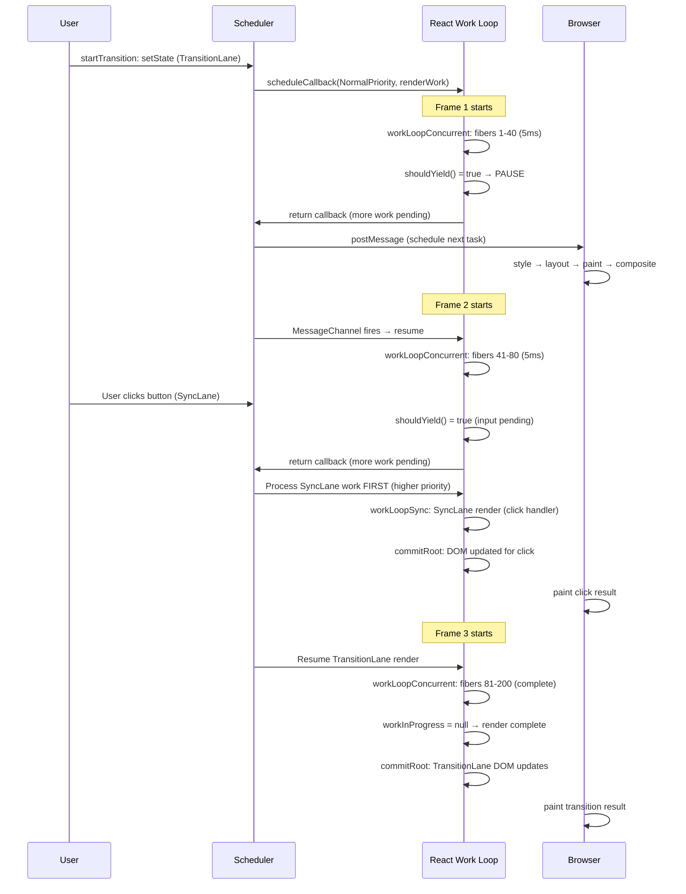
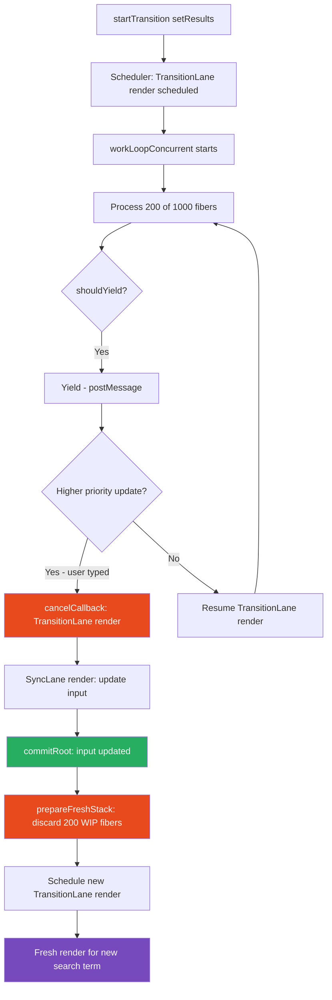

# 14 · Interruptible Rendering

> **Interruptible rendering is React's ability to pause a render in the middle of the component tree, yield control to the browser, and resume — or abandon — that render later. It is the mechanism that makes React 18's concurrent features possible and the reason large React applications can remain responsive during heavy state updates.**

Interruptibility is not a simple feature toggle. It is a carefully engineered property of React's entire architecture — the work loop, the fiber tree, the scheduler, the double-buffer system, and the render/commit phase separation all contribute to making interruption safe. Understanding how they coordinate is understanding how React maintains correctness while splitting rendering work across multiple frames.

---

## Table of Contents

- [What Interruptible Rendering Actually Means](#what-interruptible-rendering-actually-means)
- [The Conditions for Safe Interruption](#the-conditions-for-safe-interruption)
- [How Interruption Happens: shouldYield](#how-interruption-happens-shouldyield)
- [Resuming: How React Picks Up Where It Stopped](#resuming-how-react-picks-up-where-it-stopped)
- [Abandoning In-Progress Work](#abandoning-in-progress-work)
- [Pre-emption: High Priority Interrupts Low Priority](#pre-emption-high-priority-interrupts-low-priority)
- [The Purity Requirement Revisited](#the-purity-requirement-revisited)
- [What Happens to Component State During Interruption](#what-happens-to-component-state-during-interruption)
- [Interrupted Renders and Effects](#interrupted-renders-and-effects)
- [Suspense as Intentional Interruption](#suspense-as-intentional-interruption)
- [The Render Phase is Interruptible, The Commit Phase is Not](#the-render-phase-is-interruptible-the-commit-phase-is-not)
- [Measuring Interruption in Practice](#measuring-interruption-in-practice)
- [Architecture Diagrams](#architecture-diagrams)
- [Good Practices](#good-practices)
- [Bad Practices](#bad-practices)
- [Mental Model](#mental-model)
- [Common Misconceptions](#common-misconceptions)
- [Exercises](#exercises)
- [Further Reading](#further-reading)

---

## What Interruptible Rendering Actually Means

Before React 18, every render was a single, uninterruptible operation. Once React began reconciling a component tree, it ran to completion — no matter how long it took. The browser could not paint a new frame, process user input, or run any other JavaScript until the reconciliation finished.

Interruptible rendering changes this: React can stop reconciling in the middle of a component tree, yield control back to the browser for a frame, then continue reconciling from exactly where it stopped.

```
Without interruptible rendering:
[Frame 1]  ████████████████████████ React render (40ms, 3 dropped frames)
[Frame 2]  (dropped)
[Frame 3]  (dropped)
[Frame 4]  ██ Browser paints
[Frame 5]  ██████ User input finally processed

With interruptible rendering:
[Frame 1]  █████ React slice 1 (5ms)  ██ Browser paint  ██ Input processed
[Frame 2]  █████ React slice 2 (5ms)  ██ Browser paint
[Frame 3]  █████ React slice 3 (5ms)  ██ Browser paint  █████ Commit + paint
[Frame 4]  ██ User input processed immediately
```

The total rendering work is the same — the split doesn't make reconciliation faster. But the browser gets control between slices, so it can paint frames and process input. The user experiences a responsive UI even during heavy renders.

### When interruptible rendering activates

Not all React renders are interruptible. The mode depends on how the update was triggered:

| Update Source                         | Render Mode | Interruptible?  |
| ------------------------------------- | ----------- | --------------- |
| Discrete user event (click, keypress) | Synchronous | No              |
| `startTransition`                     | Concurrent  | Yes             |
| `useDeferredValue`                    | Concurrent  | Yes             |
| `React.lazy` loading                  | Concurrent  | Yes             |
| Default `useState` in concurrent root | Concurrent  | Yes (React 18+) |
| `flushSync`                           | Synchronous | No              |
| `ReactDOM.render` (legacy)            | Synchronous | No              |

---

## The Conditions for Safe Interruption

Interruption is only safe because React satisfies four strict conditions:

### Condition 1: Render phase is pure

The render phase calls component functions and builds fiber trees — nothing else. No DOM mutations, no network requests, no subscriptions. Pure computation can be interrupted and restarted without leaving any observable side effects.

```js
// SAFE to interrupt: pure computation
function WorkLoop() {
  // Interrupted here? No problem — nothing has changed in the world.
  beginWork(fiber); // calls component function, reconciles children
}

// UNSAFE if we interrupted here (the old stack reconciler):
function OldWorkLoop() {
  dom.setAttribute("class", newClass); // DOM already mutated
  // If interrupted now: DOM is partially updated — inconsistent state
}
```

### Condition 2: In-progress work is isolated in the WIP tree

The work-in-progress (WIP) fiber tree is completely separate from the current fiber tree. Interrupting a render leaves the current tree unchanged — the user continues to see the committed UI. The WIP tree is just data in memory; abandoning it has no visible effect.

### Condition 3: Position is preserved in workInProgress

The `workInProgress` global variable always points to the next fiber to process. Interrupting the work loop doesn't lose position — `workInProgress` still points to where work should resume.

### Condition 4: The commit phase is never interrupted

React only interrupts during the render phase. Once the commit phase begins, it runs to completion. This guarantees that the DOM is never left in a partially-updated state.

---

## How Interruption Happens: shouldYield

The mechanism for interruption is a single function call: `shouldYield()`. The concurrent work loop checks this after every fiber:

```js
// The concurrent work loop — from ReactFiberWorkLoop.js
function workLoopConcurrent() {
  while (workInProgress !== null && !shouldYield()) {
    performUnitOfWork(workInProgress);
  }
  // Loop exits when either:
  // 1. workInProgress === null → render complete → proceed to commit
  // 2. shouldYield() === true → time slice exhausted → yield to browser
}
```

### Inside shouldYield

```js
// From scheduler/src/forks/Scheduler.js
function shouldYieldToHost() {
  const timeElapsed = getCurrentTime() - startTime;

  if (timeElapsed < frameInterval) {
    // We haven't used up the current frame interval (5ms default)
    return false;
  }

  // Check if there's pending input that needs to be processed
  if (enableIsInputPending) {
    if (needsPaint) {
      // The browser has flagged that it needs to paint
      return true;
    }
    if (timeElapsed < continuousInputInterval) {
      // We're within the continuous input window (50ms)
      // Only yield if there's actually pending input
      if (isInputPending !== null) {
        return isInputPending(); // checks navigator.scheduling.isInputPending()
      }
    }
  }

  // Time slice exhausted — yield
  return true;
}

// frameInterval is typically 5ms
// This means React yields every 5ms to give the browser a chance to:
// - Paint pending frames
// - Process user input events
// - Run other JavaScript tasks
```

### navigator.scheduling.isInputPending()

React uses a browser API called `isInputPending()` when available. This API lets JavaScript check whether there are pending user input events (clicks, keypresses) without actually yielding:

```js
// React can query: "Is there user input waiting?"
if (
  navigator.scheduling &&
  navigator.scheduling.isInputPending(["click", "keypress"])
) {
  // User is trying to interact — yield NOW even if we have time left
  return true; // shouldYield returns true
}
// No pending input — continue rendering for the rest of the time slice
```

This is a significant optimization: React doesn't have to yield every 5ms blindly. It only yields when:

1. The time slice is exhausted (5ms), OR
2. There is pending user input (even mid-slice)

This allows React to use more of each frame for rendering when the user is not interacting, while immediately yielding when interaction occurs.

---

## Resuming: How React Picks Up Where It Stopped

When the work loop exits due to `shouldYield()`, the `workInProgress` variable still points to the next fiber that needs processing. The Scheduler schedules a continuation:

```js
// In performConcurrentWorkOnRoot — after the work loop exits
function performConcurrentWorkOnRoot(root) {
  // ... setup ...

  const exitStatus = renderRootConcurrent(root, lanes);

  if (exitStatus === RootInProgress) {
    // Work is incomplete — yield occurred
    // Return the callback itself — Scheduler sees this as "more work"
    return performConcurrentWorkOnRoot.bind(null, root);
    // The Scheduler reschedules this callback for the next available slot
  }

  // Work complete — proceed to commit
  const finishedWork = root.current.alternate;
  root.finishedWork = finishedWork;
  root.finishedLanes = lanes;
  finishConcurrentRender(root, exitStatus, lanes);
  return null;
}
```

The Scheduler receives the non-null return value and reschedules `performConcurrentWorkOnRoot` for the next task slot — after the browser has painted and processed any pending input.

### The resumption sequence

```
Frame 1:
  MessageChannel fires → performConcurrentWorkOnRoot(root) called
  workLoopConcurrent() runs for 5ms
  shouldYield() = true at fiber #47 of 200
  workInProgress = fiber #47
  workLoopConcurrent() exits
  performConcurrentWorkOnRoot returns itself (continuation)
  Scheduler reschedules it for next task

  [Browser: style → layout → paint → composite]
  [Browser: process pending input events]

Frame 2:
  MessageChannel fires → performConcurrentWorkOnRoot(root) called again
  workLoopConcurrent() starts — workInProgress = fiber #47 (still set)
  Continue from fiber #47, process fibers #47 through #94
  shouldYield() = true at fiber #94
  ... (same pattern repeats)

Frame N:
  workLoopConcurrent() runs — workInProgress completes on fiber #200
  workInProgress = null → render complete
  performConcurrentWorkOnRoot proceeds to commitRoot
```

### State preservation across yield points

The critical question: when rendering resumes, does React correctly pick up where it left off?

Yes — because all rendering state is in the fiber tree, not in the call stack:

```js
// State that survives yield:
workInProgress; // → which fiber to process next
workInProgressRoot; // → which root we're rendering
renderLanes; // → which lanes we're rendering

// State on each fiber (survives yield):
fiber.memoizedState; // → hook state computed so far
fiber.flags; // → effect flags set during beginWork/completeWork
fiber.subtreeFlags; // → bubbled flags from completed children
fiber.deletions; // → children marked for deletion
```

None of this state lives on the call stack (which is cleared between tasks). It lives on the heap — in the fiber tree — and persists between `MessageChannel` tasks.

---

## Abandoning In-Progress Work

When a higher-priority update arrives during a low-priority concurrent render, React abandons the in-progress work entirely:

```js
// When a new update arrives that has higher priority than current render:
function ensureRootIsScheduled(root) {
  const existingCallbackNode = root.callbackNode;
  const existingCallbackPriority = root.callbackPriority;

  const nextLanes = getNextLanes(root, NoLanes);
  const newCallbackPriority = getHighestPriorityLane(nextLanes);

  if (newCallbackPriority === existingCallbackPriority) {
    // Same priority — keep existing callback, new update will be included
    return;
  }

  // DIFFERENT PRIORITY — cancel the existing render and start fresh
  if (existingCallbackNode !== null) {
    cancelCallback(existingCallbackNode); // cancel the Scheduler callback
  }

  // Schedule a new render at the new (higher) priority
  let newCallbackNode;
  if (newCallbackPriority === SyncLane) {
    // Sync work: process immediately in microtask
    scheduleSyncCallback(performSyncWorkOnRoot.bind(null, root));
    newCallbackNode = null;
  } else {
    // Concurrent work: schedule with Scheduler
    newCallbackNode = scheduleCallback(
      lanesToSchedulerPriority(newCallbackPriority),
      performConcurrentWorkOnRoot.bind(null, root),
    );
  }

  root.callbackNode = newCallbackNode;
  root.callbackPriority = newCallbackPriority;
}
```

### prepareFreshStack: discarding the WIP tree

When rendering starts fresh, `prepareFreshStack` resets all work-in-progress state:

```js
function prepareFreshStack(root, lanes) {
  // Clear any completed work that hasn't been committed
  root.finishedWork = null;
  root.finishedLanes = NoLanes;

  // Reset the root's in-progress render state
  root.timeoutHandle = noTimeout;
  root.cancelPendingCommit = null;

  // Create a fresh work-in-progress starting from the root
  const rootWorkInProgress = createWorkInProgress(root.current, null);
  // All previous WIP fibers become garbage collectible —
  // nothing holds a reference to them anymore (except root.current.alternate
  // if we're reusing it, which createWorkInProgress may do)

  workInProgress = rootWorkInProgress;
  workInProgressRoot = root;
  workInProgressRootRenderLanes = lanes;
  workInProgressSuspendedReason = NotSuspended;
  workInProgressThrownValue = null;
  workInProgressRootExitStatus = RootInProgress;
  workInProgressRootFatalError = null;
  workInProgressRootPingedLanes = NoLanes;
  workInProgressRootConcurrentErrors = null;
  workInProgressRootRecoverableErrors = null;

  finishQueueingConcurrentUpdates();
}
```

### What happens to partially-computed WIP fibers

WIP fibers that were built during the abandoned render become garbage. The GC cleans them up:

```
Before abandonment:
  root.current → [Current Tree] (on screen)
                    ↕ alternate
  workInProgress → [Partial WIP Tree] (50% complete)

After prepareFreshStack:
  root.current → [Current Tree] (unchanged, still on screen)
                    ↕ alternate
  workInProgress → [Fresh WIP root] (back to the beginning)

Partial WIP fibers: no references → garbage collectible
```

The user sees no change. The current tree is untouched. The partial WIP work is simply discarded. React starts the WIP tree fresh for the new, higher-priority render.

---

## Pre-emption: High Priority Interrupts Low Priority

The most important application of interruption is priority pre-emption: user input (high priority) interrupts background data loading (low priority).

### A concrete scenario

```tsx
function SearchPage() {
  const [query, setQuery] = useState("");
  const [isPending, startTransition] = useTransition();
  const [results, setResults] = useState<Result[]>([]);

  const handleChange = (e: React.ChangeEvent<HTMLInputElement>) => {
    // 1. HIGH PRIORITY: update input immediately (SyncLane)
    setQuery(e.target.value);

    // 2. LOW PRIORITY: compute and render results (TransitionLane)
    startTransition(() => {
      setResults(searchIndex.query(e.target.value)); // potentially slow
    });
  };

  return (
    <>
      <input value={query} onChange={handleChange} />
      {isPending && <Spinner />}
      <ResultsList results={results} /> {/* may be 1000+ items */}
    </>
  );
}
```

### The pre-emption sequence

```
User types 'r':
  1. SyncLane update: setQuery('r')
  2. TransitionLane update: setResults(search('r'))

React processes:
  3. SyncLane render → commits 'r' to input (instant, synchronous)
  4. Scheduler: start TransitionLane render
  5. renderRootConcurrent: begin reconciling ResultsList (1000 items)
  6. [5ms time slice] — 200 items reconciled
  shouldYield() = true
  [Browser paints — user sees 'r' in input]

User types 'e' (before TransitionLane render completes):
  7. SyncLane update: setQuery('re')
  8. TransitionLane update: setResults(search('re'))

React detects higher-priority work:
  9. cancelCallback(existingTransitionCallback) — cancel the 'r' search render
  10. SyncLane render → commits 're' to input (instant)
  11. prepareFreshStack — discard partial 'r' results WIP tree
  12. Schedule new TransitionLane render for search('re')
  13. Start new TransitionLane render — reconcile ResultsList for 're' results

[User sees 're' immediately. Results update to 're' search when complete.]
```

This is the killer feature of interruptible rendering: the user's typing is never blocked, no matter how expensive the search results render is. The input always reflects the current keystroke immediately. The results catch up asynchronously.

### The cost of pre-emption: thrown-away work

When the 'r' results render is abandoned, all the work done for those 200 items (50% of the tree) is discarded. From a pure computation standpoint, this is wasteful — React did work that produced no visible output. But from a user experience standpoint, it is the correct tradeoff: a discarded render has zero user-visible cost, while a blocked input has massive user-visible cost.

> 🏭 **Production Note:** In applications with very expensive renders that update frequently (real-time data visualization, collaborative editors), you may see high GC pressure from repeated WIP tree creation and abandonment. This is a sign to consider: (1) reducing the frequency of low-priority updates (debouncing), (2) virtualizing the expensive list to reduce component count, (3) moving expensive computation to a Web Worker, or (4) using `useDeferredValue` instead of `useTransition` to let React manage the deferred value timing.

---

## The Purity Requirement Revisited

Interruptible rendering makes the render phase purity requirement more than a style guideline — it is a correctness requirement.

### What happens when render is impure during interruption

```tsx
// IMPURE component — behaves incorrectly with interruption
let requestCount = 0;

function ImpureProductList({ category }: { category: string }) {
  // ❌ Network request during render
  fetch(`/api/products?category=${category}`);
  requestCount++; // ❌ mutation of external state
  console.log(`Render #${requestCount}`); // ❌ observable side effect

  return <div>Loading...</div>;
}
```

With interruption:

1. Low-priority render starts, `ImpureProductList` renders → `fetch` fires (#1), `requestCount = 1`
2. User types → pre-emption → WIP tree discarded
3. High-priority render completes
4. Low-priority render restarts fresh → `ImpureProductList` renders again → `fetch` fires (#2), `requestCount = 2`
5. Result: 2 network requests for one visible render, wrong `requestCount`, two console.logs

With pure components:

1. Render starts, `PureProductList` renders → pure computation only
2. Pre-emption → WIP discarded → no observable effect
3. Render restarts → pure computation again
4. Result: correct behavior regardless of how many times render runs

### The "render may run N times" rule

In concurrent React, your component function may run:

- **0 times** — if a higher-priority update obsoletes the current render before it reaches this component
- **1 time** — normal case
- **2 times** — in StrictMode (deliberate double-invoke to surface impurity)
- **N times** — if the render is repeatedly pre-empted (rare but possible in high-frequency update scenarios)

Only one of those runs will ever result in a commit. The rest are "ghost renders" — real function calls with real execution cost, but no visible output. If your component is pure, ghost renders are harmless. If it is impure, ghost renders produce duplicate effects.

---

## What Happens to Component State During Interruption

When a render is interrupted and resumed, hook state behaves correctly because all state lives in the fiber tree, not in the call stack:

```tsx
function ComponentMidRender() {
  // State is in fiber.memoizedState — persists across yield points
  const [count, setCount] = useState(10);

  // This computation runs during render — if interrupted here...
  const doubled = count * 2; // purely local — fine

  return <div>{doubled}</div>;
}
```

If the work loop yields between processing this component and its children:

- `fiber.memoizedState` still holds the hook state (count = 10)
- `fiber.flags` still has any effect flags set during beginWork
- `workInProgress` still points to this fiber's first child
- On resumption: work continues from the child, not re-running this component

### What about hook state during abandonment?

When a render is abandoned (`prepareFreshStack`), the WIP fibers are discarded. Their accumulated state (memoizedState changes, updateQueue processing) is lost. On the fresh start, the hooks re-read from the current fiber's memoizedState — the committed state, not the in-progress state.

```js
// During fresh start:
workInProgress = createWorkInProgress(root.current, null);
// workInProgress.memoizedState = root.current.memoizedState
// (the last committed hook state — not the abandoned WIP state)

// When component re-runs:
// useState reads from workInProgress.memoizedState — the committed state
// All hook state starts from the last committed point
```

This is correct: if a user clicked a button during the low-priority render, the button's state update is in the high-priority SyncLane. The high-priority render commits the button state change. When the low-priority render restarts, it sees the committed button state — which is the right state to render with.

---

## Interrupted Renders and Effects

Effects (`useEffect`, `useLayoutEffect`) only run after a render **commits**. Interrupted renders never commit. Therefore:

- An interrupted render never runs `useEffect`
- An interrupted render never runs `useLayoutEffect`
- An interrupted render never runs `useInsertionEffect`
- An interrupted render never mutates the DOM
- An interrupted render never attaches refs

```tsx
function ComponentWithEffect() {
  useEffect(() => {
    // This ONLY fires when this render commits to the DOM
    // If this render is interrupted and abandoned: this never fires
    // If this render is interrupted and resumed, then commits: fires once
    analytics.track("rendered");
  }, []);
}
```

This is the guarantee that makes effects safe: they are a post-commit mechanism, decoupled from the potentially-multiple render phase calls.

### The "ghost render" problem with render-phase side effects

```tsx
// ❌ Side effect during render — affected by interruption
function ComponentWithRenderSideEffect() {
  // This fires during the render phase — not in an effect
  // It fires on EVERY render attempt, including abandoned ones
  someGlobalStore.recordRender(); // fires on every WIP render attempt

  return <div />;
}

// ✅ Correct: side effect in useEffect — fires only on commit
function ComponentWithEffect() {
  useEffect(() => {
    someGlobalStore.recordRender(); // fires only when this render commits
  });

  return <div />;
}
```

---

## Suspense as Intentional Interruption

Suspense is a form of deliberate interruption — a component throws a Promise to signal "I'm not ready to render yet." React catches this throw, pauses rendering that subtree, and shows a fallback.

```tsx
// A Suspense-capable component "interrupts" itself by throwing
function LazyUserProfile({ userId }: { userId: string }) {
  // This throws a Promise if the data isn't cached yet
  const user = userCache.read(userId);
  // If the above throws, React catches it and shows Suspense fallback
  // When the Promise resolves, React retries this render

  return <UserCard user={user} />;
}

function Page() {
  return (
    <Suspense fallback={<Skeleton />}>
      <LazyUserProfile userId="123" />
    </Suspense>
  );
}
```

### How Suspense works with the traversal

```js
// When a component throws during beginWork:
function beginWork(current, workInProgress, renderLanes) {
  try {
    // ... call component function ...
    const nextChildren = renderWithHooks(...);
    // Returns normally — no suspension
  } catch (thrownValue) {
    if (thrownValue instanceof Promise || typeof thrownValue.then === 'function') {
      // Caught a Promise — this component is suspended
      // Mark the fiber as incomplete
      workInProgress.flags |= DidCapture;
      workInProgressRootExitStatus = RootSuspended;
      throwException(root, returnFiber, workInProgress, thrownValue, renderLanes);
    } else {
      // Caught an Error — propagate to nearest error boundary
      throw thrownValue;
    }
  }
}

// throwException walks up the tree to find the nearest Suspense boundary
function throwException(root, returnFiber, sourceFiber, value, rootRenderLanes) {
  sourceFiber.flags |= Incomplete; // mark as incomplete

  // Walk up to find Suspense boundary
  let workInProgress = returnFiber;
  do {
    if (workInProgress.tag === SuspenseComponent && workInProgress.memoizedState === null) {
      // Found an unsuspended Suspense boundary — this will handle it
      const wakeables = workInProgress.updateQueue;
      // Add the Promise to the set of things this Suspense is waiting for
      workInProgress.updateQueue = new Set([value]);

      // Attach a listener: when Promise resolves, retry this render
      value.then(() => {
        if (workInProgress.tag === SuspenseComponent) {
          // Schedule a retry render for this Suspense subtree
          const retryLane = claimNextRetryLane();
          scheduleUpdateOnFiber(root, workInProgress, retryLane);
        }
      });

      return; // Suspense boundary found and configured
    }
    workInProgress = workInProgress.return;
  } while (workInProgress !== null);
}
```

### Suspense interruption vs priority interruption

|                 | Priority Interruption         | Suspense Interruption                           |
| --------------- | ----------------------------- | ----------------------------------------------- |
| Trigger         | `shouldYield()` returns true  | Component throws a Promise                      |
| WIP state       | Preserved                     | Fiber marked Incomplete, traversal continues up |
| Visible effect  | None — current tree unchanged | Fallback shown at Suspense boundary             |
| Resume trigger  | Next Scheduler task           | Promise resolution                              |
| Work discarded? | Possibly (if pre-empted)      | No — retried when Promise resolves              |

---

## The Render Phase is Interruptible, The Commit Phase is Not

This asymmetry is fundamental to React's correctness guarantees:

```
Render Phase:
  ✅ Interruptible — pure computation, no visible effect
  ✅ Restartable — same inputs, same output
  ✅ Abandonment-safe — WIP tree can be discarded
  ✅ Can run N times for 1 committed render

Commit Phase:
  ❌ Uninterruptible — DOM mutations must be atomic
  ❌ Runs exactly once per committed render
  ❌ Has observable effects (DOM changes, effects run)
  ❌ Cannot be abandoned once started
```

The commit phase's uninterruptibility is the guarantee that the user sees a consistent UI. If React could interrupt the commit phase:

```
User sees: button is red (before mutation)
React commits: changes button to blue (partial commit)
[interrupt]
User sees: button is blue (partially committed state)
React resumes: updates button text (rest of commit)
User sees: button is blue with new text
```

The intermediate "blue button with old text" state would be visible to the user — a state that never existed in the application model. The uninterruptible commit prevents this.

---

## Measuring Interruption in Practice

### Using Chrome DevTools to observe yield points

```
1. Open Chrome DevTools → Performance tab
2. Start recording
3. Trigger a startTransition with a heavy render (1000+ components)
4. While the transition renders, interact with the UI (click, type)
5. Stop recording

In the flame graph, look for:
- Short "Task" blocks for React's work slices (5ms each)
- "Animation Frame" or "Paint" blocks between React tasks
- "Input" tasks between React slices (if you interacted)
- The MessageChannel tasks that resume rendering
```

### Using React Profiler to identify transition renders

```tsx
function ProfiledApp() {
  return (
    <React.Profiler
      id="app"
      onRender={(
        id,
        phase, // 'mount' | 'update'
        actualDuration, // time this render took (ms)
        baseDuration, // time WITHOUT memoization (ms)
        startTime, // when render started
        commitTime, // when render committed
      ) => {
        const renderTime = commitTime - startTime;
        // A large renderTime with small actualDuration indicates yielding:
        // the render started long before it committed (it was yielded)
        if (renderTime > 100) {
          console.log(
            `Render took ${renderTime}ms wall time, ${actualDuration}ms CPU time`,
          );
          // Likely: was a concurrent render that yielded multiple times
        }
      }}
    >
      <App />
    </React.Profiler>
  );
}
```

### Detecting concurrent renders vs synchronous renders

```tsx
function useRenderType() {
  const isTransitioning = React.useTransition()[0];

  useEffect(() => {
    if (isTransitioning) {
      console.log("This render is part of a transition (concurrent)");
    }
  });
}
```

---

## Architecture Diagrams

### Interruptible render: timeline across frames



### Pre-emption: abandoning low-priority work



---

## Good Practices

### ✅ Good Practice — Give React accurate priority signals with startTransition

```tsx
/**
 * Good: startTransition explicitly marks the expensive render as non-urgent.
 * React can interrupt it for user input.
 * The input stays responsive even with 10,000+ item re-renders.
 */
function InventorySearch() {
  const [searchText, setSearchText] = useState("");
  const [filteredItems, setFilteredItems] = useState(inventory);
  const [isPending, startTransition] = useTransition();

  const handleSearch = useCallback((e: React.ChangeEvent<HTMLInputElement>) => {
    const value = e.target.value;

    // URGENT: update search text immediately (synchronous)
    // User must see their keystroke reflected instantly
    setSearchText(value);

    // NON-URGENT: filter and render inventory (concurrent, interruptible)
    // React can interrupt this if user types again
    startTransition(() => {
      const filtered = inventory.filter(
        (item) =>
          item.name.toLowerCase().includes(value.toLowerCase()) ||
          item.sku.includes(value) ||
          item.category.toLowerCase().includes(value.toLowerCase()),
      );
      setFilteredItems(filtered);
    });
  }, []);

  return (
    <div>
      <input
        value={searchText}
        onChange={handleSearch}
        placeholder="Search inventory..."
      />
      {isPending && <div className="search-indicator">Searching...</div>}
      <InventoryTable
        items={filteredItems}
        style={{ opacity: isPending ? 0.7 : 1 }}
      />
    </div>
  );
}
```

**Why this works:** `startTransition` assigns `TransitionLane` to the inventory render. When the user types another character, the SyncLane input update pre-empts the TransitionLane inventory render. The abandoned inventory render is restarted for the new search term. The user always sees their latest input immediately, with the inventory list catching up in the background.

---

## Bad Practices

### ⚠️ Bad Practice — Side effects during render that produce duplicates on interruption

```tsx
/**
 * Bad: Analytics tracking fires during render phase.
 * With concurrent rendering and interruption, this fires multiple
 * times per committed render — producing duplicate analytics events.
 *
 * Scenario: Component renders, gets interrupted, renders again.
 * Both renders call trackPageView — but only one commits.
 * You now have duplicate analytics for a single user action.
 */
function ProductDetailPage({ productId }: { productId: string }) {
  // ❌ Fires during render — may fire on interrupted renders too
  analytics.trackPageView({
    page: "product-detail",
    productId,
    timestamp: Date.now(),
  });

  // ❌ Fires on every render attempt — count will be wrong
  productViewsStore.increment(productId);

  return <ProductDetail id={productId} />;
}

/**
 * ✅ Correct: Analytics in useEffect — only fires on committed renders.
 * No matter how many times the component renders (interruption, StrictMode),
 * analytics fires exactly once per committed render cycle.
 */
function ProductDetailPage({ productId }: { productId: string }) {
  useEffect(() => {
    // Only fires AFTER commit — guaranteed once per productId change
    analytics.trackPageView({
      page: "product-detail",
      productId,
      timestamp: Date.now(),
    });
    productViewsStore.increment(productId);
  }, [productId]);

  return <ProductDetail id={productId} />;
}
```

**Production impact:** In a high-traffic e-commerce application with startTransition for product navigation, every product page view could generate 2-3 analytics events instead of 1 — depending on how many times the render was interrupted before committing. This inflates page view counts, corrupts funnel analysis, and produces incorrect A/B test data. The business impact of incorrect analytics can be significant.

---

## Mental Model

> 💡 **The interruptible rendering mental model:**
>
> Think of React's concurrent renderer as a **surgeon operating in short sessions**. The render phase is not an uninterrupted 4-hour surgery — it's 5-minute sessions of careful work, with the patient fully conscious and comfortable between sessions. After each session, the surgeon steps out (browser gets the thread), the patient can move and respond (browser processes input), and then the surgeon resumes exactly where they left off. The patient's condition (current fiber tree) is unchanged between sessions — only the surgeon's notes (WIP fiber tree) accumulate session by session. If an emergency comes in (SyncLane update), the surgeon pauses their current notes, handles the emergency, and when they return, starts the notes fresh with the latest patient status. The operating room is never used for two patients simultaneously — the commit phase is when the actual procedure happens, and it always runs to completion once begun.

---

## Common Misconceptions

### "startTransition makes renders faster"

`startTransition` makes updates lower priority — it does not speed up rendering. A 500ms render inside `startTransition` still takes 500ms total CPU time. It just doesn't block user input during that time, because React yields every 5ms to process input.

### "Interrupted renders are wasted work"

Abandoned renders have a cost (CPU time, GC pressure from discarded WIP fibers), but they produce zero user-visible latency. The user never sees the abandoned render's output. The cost is measured in microseconds of background CPU time. The benefit is measured in milliseconds of input responsiveness — usually a good trade.

### "All React 18 renders are concurrent"

Only renders triggered by `startTransition`, `useDeferredValue`, or React.lazy are concurrent. User events (click, keypress, form submit) trigger synchronous renders by default in React 18. Concurrent rendering is opt-in per update, not the default for all updates.

### "React can pause in the middle of a component function"

React can pause between component function calls — after `performUnitOfWork` returns and before the next call. It cannot pause inside a single component function. If your component function takes 50ms to run, React is blocked for all 50ms regardless of concurrent mode.

### "The current tree changes during a concurrent render"

The current tree (what's on screen) is never modified during the render phase. Only the WIP tree changes. The current tree is only updated during the commit phase — which is synchronous and uninterruptible.

---

## Exercises

### Exercise 1 — Observe interruption in the Performance tab

1. Build a component that renders 2000 items inside a `startTransition`
2. Open Chrome DevTools → Performance → Start recording
3. Click the button that triggers the transition
4. While the transition is rendering, click another button (a simple SyncLane update)
5. Stop recording

Identify in the flame graph:

- The React work slices for the transition render (short 5ms chunks)
- The SyncLane render for the button click (a single synchronous block)
- The transition render restart after the SyncLane commit
- The MessageChannel tasks between slices

### Exercise 2 — Prove that effects don't fire on interrupted renders

```tsx
let renderCount = 0;
let effectCount = 0;

function TrackedComponent() {
  renderCount++; // fires on every render attempt (including interrupted)

  useEffect(() => {
    effectCount++; // fires only on committed renders
    console.log(`Renders: ${renderCount}, Effects: ${effectCount}`);
    // In concurrent mode with pre-emption: renderCount > effectCount
    // Each effect corresponds to exactly one committed render
  });

  return <div>Tracked</div>;
}
```

Wrap this in a `startTransition` and rapidly trigger state changes to cause pre-emption. Observe that `renderCount` grows faster than `effectCount`.

### Exercise 3 — Build intuition for the 5ms time slice

```tsx
function TimedComponent({ size }: { size: number }) {
  const start = performance.now();
  // Simulate rendering work proportional to size
  const end = performance.now();

  useEffect(() => {
    console.log(`${size} items rendered in ${(end - start).toFixed(2)}ms`);
  });

  return (
    <ul>
      {Array.from({ length: size }, (_, i) => (
        <li key={i}>{i}</li>
      ))}
    </ul>
  );
}
```

Test with sizes 100, 500, 1000, 5000. Find the size where a single render exceeds 5ms — at this point, React will yield mid-render in concurrent mode. Wrap in startTransition and observe smooth UI vs without startTransition where the UI freezes.

---

## Further Reading

- [React Source: ReactFiberWorkLoop.js — workLoopConcurrent](https://github.com/facebook/react/blob/main/packages/react-reconciler/src/ReactFiberWorkLoop.js) — The interruptible work loop
- [React Source: Scheduler.js — shouldYieldToHost](https://github.com/facebook/react/blob/main/packages/scheduler/src/forks/Scheduler.js) — The yield decision logic
- [React Docs: startTransition](https://react.dev/reference/react/startTransition) — The user-facing API for concurrent rendering
- [React 18 Working Group: Concurrent Features](https://github.com/reactwg/react-18/discussions/64) — How concurrent features interact
- [WICG: isInputPending](https://github.com/WICG/is-input-pending) — The browser API React uses for smarter yielding
- [Andrew Clark: What's New in React 18](https://www.youtube.com/watch?v=FZ0cG47msEk) — ReactConf talk on concurrent features
- Next in this handbook: [15 · Time Slicing](./05-time-slicing.md)

---

_Part of the [React + Next.js Engineering Handbook](../../README.md)_
