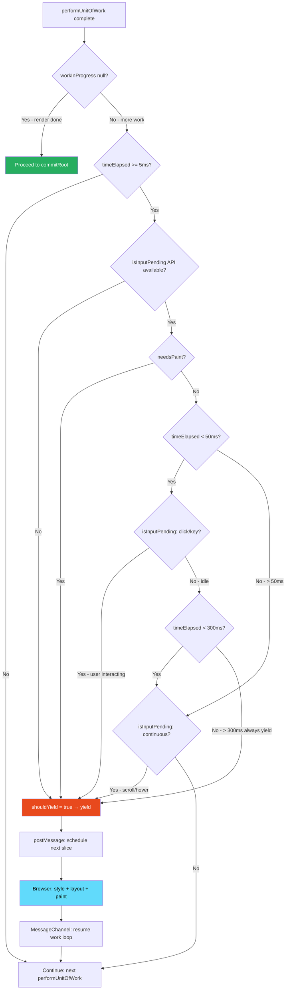

# 15 · Time Slicing

> **Time slicing is the technique React uses to break long rendering work into small chunks — "slices" — and distribute those chunks across multiple browser frames. Each slice is bounded to a maximum of 5 milliseconds. Between slices, the browser regains control to paint frames, process user input, and run other tasks. Time slicing is what makes React's concurrent features feel responsive on slow devices with large component trees.**

Time slicing is not a single feature — it is the cumulative effect of the Scheduler's time budget system, the work loop's yield mechanism, the `MessageChannel`-based task scheduling, and React's interruptible fiber traversal all working together. Understanding each piece and how they interact is the foundation for diagnosing and fixing responsiveness problems in production React applications.

---

## Table of Contents

- [The Core Problem: Long Tasks Block the Main Thread](#the-core-problem-long-tasks-block-the-main-thread)
- [What a Time Slice Is](#what-a-time-slice-is)
- [The 5ms Budget: Why That Number](#the-5ms-budget-why-that-number)
- [How React Measures Time](#how-react-measures-time)
- [The Slice Boundary: Between Fibers, Not Within](#the-slice-boundary-between-fibers-not-within)
- [Frame Budget Arithmetic](#frame-budget-arithmetic)
- [Time Slicing at Different Display Refresh Rates](#time-slicing-at-different-display-refresh-rates)
- [isInputPending: Smarter Yielding](#isinputpending-smarter-yielding)
- [The MessageChannel Task Queue](#the-messagechannel-task-queue)
- [Time Slicing vs Debouncing](#time-slicing-vs-debouncing)
- [What Time Slicing Cannot Fix](#what-time-slicing-cannot-fix)
- [Measuring Time Slice Behavior in Production](#measuring-time-slice-behavior-in-production)
- [Optimizing for Time Slicing](#optimizing-for-time-slicing)
- [Time Slicing in Server-Side Rendering](#time-slicing-in-server-side-rendering)
- [Architecture Diagrams](#architecture-diagrams)
- [Good Practices](#good-practices)
- [Bad Practices](#bad-practices)
- [Mental Model](#mental-model)
- [Common Misconceptions](#common-misconceptions)
- [Exercises](#exercises)
- [Further Reading](#further-reading)

---

## The Core Problem: Long Tasks Block the Main Thread

The browser's main thread is a single-threaded event loop. Every millisecond it spends executing JavaScript is a millisecond it cannot spend on:

- Parsing and rendering HTML/CSS changes
- Processing user events (clicks, keypresses, scroll, touch)
- Running `requestAnimationFrame` callbacks for animations
- Executing microtasks and other queued tasks

A task that runs longer than **50ms** is classified by the browser as a **Long Task**. Long Tasks are directly correlated with poor user experience — they are the primary cause of:

- Input delay (keystrokes appear late)
- Animation jank (dropped frames)
- Scroll stuttering
- "Frozen" feeling interfaces

```
Main Thread Timeline without time slicing:
─────────────────────────────────────────────────────────────

│░░░░░░░░░░░░░░░░░░░░░░░░░░░░░░│  ←React reconciliation: 80ms Long Task
                                │▓│  ←Paint (finally)
                                  │▒│  ←Input processed (80ms late)

User experience: input lag, frozen animation, janky scroll
─────────────────────────────────────────────────────────────

Main Thread Timeline with time slicing:
─────────────────────────────────────────────────────────────

│░░│ │▒│ │░░│ │▒│ │░░│ │▒│ │░░│ │▓│
  ↑     ↑     ↑     ↑     ↑     ↑
React  Input React  Input React  Paint
slice  proc  slice  proc  slice

Each React slice: 5ms. Input processed every 16ms. No Long Task.
─────────────────────────────────────────────────────────────
```

The Long Tasks API in browsers flags any task over 50ms. React's goal is to ensure no single JavaScript task runs longer than necessary — ideally staying under 16.67ms per task to match 60fps frame timing.

---

## What a Time Slice Is

A time slice is a bounded unit of React rendering work. Concretely:

```
One Time Slice =
  Process as many Fiber units as possible
  within a 5ms wall-clock budget,
  starting from the current workInProgress fiber,
  stopping when shouldYield() returns true or workInProgress is null.
```

```js
// The time slice in code
function workLoopConcurrent() {
  while (workInProgress !== null && !shouldYield()) {
    performUnitOfWork(workInProgress);
    // Each call processes one fiber: beginWork + potentially completeWork
    // After each fiber: check if 5ms has elapsed
  }
  // Exiting here = end of one time slice
}
```

A single time slice may process:

- **Many fibers** — if each fiber is cheap (simple function components)
- **Few fibers** — if each fiber is expensive (complex computations in render)
- **One fiber** — if a single fiber's render takes >5ms (pathological case)

The number of fibers per slice is not fixed — it depends entirely on how expensive each component's render function is.

### Fiber granularity

Time slicing yields between fibers, not within a fiber. This means:

```
Time slice budget: 5ms

Fiber A render: 1ms → process (1ms used)
Fiber B render: 1ms → process (2ms used)
Fiber C render: 1ms → process (3ms used)
Fiber D render: 1ms → process (4ms used)
shouldYield() → false (4ms < 5ms)
Fiber E render: 3ms → process (7ms used)
shouldYield() → true AFTER E completes (7ms > 5ms)
→ END OF SLICE: 7ms total, 5 fibers processed

[Browser gets control]

Next slice:
Fiber F render: 2ms → process (2ms used)
...
```

Fiber E was allowed to complete even though it pushed the slice over 5ms. React yields between fibers — it does not interrupt in the middle of `performUnitOfWork`. This means a single slow component can extend a time slice beyond 5ms.

---

## The 5ms Budget: Why That Number

The 5ms default is not arbitrary. It is derived from the browser's rendering model and the goal of maintaining 60fps:

```
At 60fps:
  Frame budget: 1000ms / 60 = 16.67ms per frame

Frame budget allocation:
  Browser rendering (style + layout + paint + composite): ~6-8ms
  Input event processing: ~1-2ms
  Other JavaScript (animations, libraries): ~2-3ms
  React rendering budget: ~5ms

  Total: ~14-18ms (fits within one frame)
```

React claims 5ms per slice — approximately 30% of a frame — leaving 70% for the browser's own work and other JavaScript. This allows React to make progress on large renders while keeping the UI responsive.

### Why not 1ms? Why not 16ms?

**1ms slices:** Too little work per slice. The overhead of yielding (MessageChannel round trip, task queue processing) becomes significant relative to the work done. Renders take more total wall-clock time due to yield overhead.

**16ms slices:** Too long. If React uses the entire frame budget for rendering, there is no time left for the browser to paint. The user sees one new frame every 32ms instead of every 16ms — effectively 30fps with jank.

**5ms:** Calibrated to leave enough frame time for browser rendering while giving React enough time to make meaningful progress per slice.

### The frameInterval can be adjusted

React exposes `unstable_setDefaultYieldInterval` in the scheduler package (unstable API) for environments with different timing requirements:

```js
// Internal Scheduler API — subject to change
import { unstable_setDefaultYieldInterval } from "scheduler";

// For environments with more CPU budget (e.g., desktop-only)
// unstable_setDefaultYieldInterval(8); // 8ms slices

// For environments with less budget (e.g., mobile-first, 90fps screens)
// unstable_setDefaultYieldInterval(3); // 3ms slices
```

> ⚠️ This is an unstable internal API. Do not use it in production without careful measurement.

---

## How React Measures Time

React uses `performance.now()` for all time measurements. This is a high-resolution timer with sub-millisecond precision:

```js
// From Scheduler.js
let localPerformance = typeof performance === "object" ? performance : null;

function getCurrentTime() {
  if (localPerformance !== null) {
    return localPerformance.now(); // sub-millisecond precision
  }
  return Date.now(); // fallback: millisecond precision
}
```

### The shouldYield implementation in full

```js
// From Scheduler.js — the complete shouldYield logic
let startTime = -1;
let frameInterval = 5; // ms

function shouldYieldToHost() {
  const timeElapsed = getCurrentTime() - startTime;

  if (timeElapsed < frameInterval) {
    // We're still within the time slice — continue
    return false;
  }

  // Time slice exhausted. Should we yield?

  // Option 1: isInputPending API available
  if (enableIsInputPending) {
    if (needsPaint) {
      // Browser explicitly flagged that paint is needed
      return true;
    }

    if (timeElapsed < continuousInputInterval) {
      // Within 50ms — only yield if there's actual user input waiting
      if (isInputPending !== null) {
        return isInputPending();
        // true = there's a click/keypress waiting → yield now
        // false = no input → keep rendering a bit longer
      }
    } else if (timeElapsed < maxInterval) {
      // Between 50ms and 300ms
      if (isInputPending !== null) {
        return isInputPending(continuousOptions);
        // Includes mousemove, scroll
      }
    } else {
      // Over 300ms — always yield regardless
      return true;
    }
  }

  // Default: yield based purely on time
  return true;
}

// startTime is set at the beginning of each work loop iteration
function performWorkUntilDeadline() {
  if (scheduledHostCallback !== null) {
    const currentTime = getCurrentTime();
    startTime = currentTime; // ← reset timer for this slice

    // ... run the work ...
  }
}
```

### Time measurement precision matters

`performance.now()` has sub-millisecond precision on most platforms, but browsers may reduce its precision to mitigate timing attacks (Spectre). Chromium reduced it from nanosecond to microsecond in 2018. React's 5ms budget is comfortably above any measurement noise.

---

## The Slice Boundary: Between Fibers, Not Within

This is one of the most important and most misunderstood aspects of time slicing. React can only yield at fiber boundaries — not in the middle of a component's render function.

```
Time slice budget: 5ms

React yields BETWEEN these:
  [performUnitOfWork(A)] [performUnitOfWork(B)] [performUnitOfWork(C)]
  ↑ can yield here ↑    ↑ can yield here ↑

React CANNOT yield inside:
  performUnitOfWork(B) = beginWork(B) + completeWork(B)
                         ↑ B's render function runs here
                         ↑ React is committed until B returns
```

### Practical consequence: slow components block their slice

```tsx
// This component takes 20ms to render
function SlowDataProcessorComponent({ data }: { data: DataPoint[] }) {
  // 20ms of synchronous computation
  const result = data.reduce((acc, point) => {
    // ... expensive algorithm ...
    return acc;
  }, initialValue);

  return <Chart data={result} />;
}
```

Even in concurrent mode with `startTransition`, if `SlowDataProcessorComponent` renders in a 5ms time slice, that slice extends to 20ms. The browser is blocked for 20ms — not 5ms.

Time slicing doesn't fix expensive component functions. It only allows React to yield between component renders, not within them. The per-component render time must be kept under ~5ms for time slicing to work as intended.

```
What time slicing DOES:
  200 components × 1ms each = 200ms total
  Split into 40 slices × 5ms each = 200ms total, but with 39 yield points
  Browser gets control 39 times during the render

What time slicing CANNOT DO:
  1 component × 200ms = 200ms, no yield possible mid-component
  Browser blocked for 200ms regardless of concurrent mode
```

---

## Frame Budget Arithmetic

Understanding time slicing requires understanding frame budget arithmetic precisely.

### At 60fps (most common)

```
Frame duration: 16.67ms
React time budget: 5ms (30% of frame)
Browser rendering budget: ~11ms (66%)
Overhead (yield, task queue): ~0.67ms (4%)

Number of React slices per second: 1000ms / 16.67ms ≈ 60 slices
React CPU time per second: 60 × 5ms = 300ms (30% of thread)
```

### At 120Hz (high refresh rate screens: newer iPhones, gaming monitors)

```
Frame duration: 8.33ms
React time budget: 5ms (60% of frame — more of each frame goes to React)
Browser rendering budget: ~3ms (36%)
Overhead: ~0.33ms (4%)

Number of React slices per second: 1000ms / 8.33ms ≈ 120 slices
React CPU time per second: 120 × 5ms = 600ms
```

At 120Hz, React gets 600ms of CPU time per second — twice as much as 60Hz. Large renders complete faster on high-refresh displays, but the browser has less time per frame for its own rendering work.

### At 30fps (constrained environments: older devices, battery saver mode)

```
Frame duration: 33.33ms
React time budget: 5ms (15% of frame)
Browser rendering budget: ~28ms (84%)

Number of React slices per second: 1000ms / 33.33ms ≈ 30 slices
React CPU time per second: 30 × 5ms = 150ms
```

At 30fps, React gets far less CPU time per second. Large transitions that feel smooth at 60fps may feel sluggish at 30fps — not because React's time slicing is wrong, but because there are fewer slices per second to make progress.

> 🏭 **Production Note:** When optimizing for mobile performance, test on devices that run at 30fps under load (budget Android devices, older iPhones in battery saver mode). A transition that takes 10 slices at 60fps (completes in ~170ms) takes the same 10 slices at 30fps but completes in ~350ms — still not blocking input, but visibly slower in producing the final result.

---

## Time Slicing at Different Display Refresh Rates

React's Scheduler does not automatically adjust the frame interval based on the display's refresh rate. It always uses 5ms regardless of whether the display runs at 30Hz, 60Hz, or 120Hz:

```js
// From Scheduler.js — frameInterval is fixed
let frameInterval = 5; // ms — same for all refresh rates
```

This is a pragmatic choice: detecting the actual display refresh rate reliably across all browsers is complex (it requires `requestAnimationFrame` timing, which varies). The 5ms conservative budget works acceptably across refresh rates — it's not optimal for 120Hz (where you could safely use 4ms) but doesn't break at 30Hz.

### requestAnimationFrame vs MessageChannel timing

An early version of React's Scheduler used `requestAnimationFrame` to synchronize with display refresh:

```js
// Old approach (deprecated in React Scheduler)
requestAnimationFrame(function (frameStartTime) {
  const frameDeadline = frameStartTime + frameInterval;
  performWork(frameDeadline);
});
```

This was abandoned for three reasons:

1. `rAF` fires at the display's refresh rate — at 30fps, React could only get work done 30 times per second
2. `rAF` doesn't fire in background tabs — background rendering stops entirely
3. `rAF` fires at the start of a frame — React work could push into the paint budget of that frame

`MessageChannel` is better: it fires as often as the task queue allows (limited by execution cost, not display rate), fires in background tabs, and doesn't align with frame boundaries (letting the browser decide when to paint).

---

## isInputPending: Smarter Yielding

`navigator.scheduling.isInputPending()` is a browser API that allows JavaScript to check whether there are pending input events without actually yielding:

```js
// Standard approach: yield every 5ms regardless of input
// Problem: yields even when user is not interacting → wastes frame time

// isInputPending approach: only yield when input is actually pending
if (timeElapsed >= 5ms && isInputPending(['click', 'keydown', 'keypress'])) {
  // User is trying to interact — yield NOW
  return true;
}
// No pending input — keep rendering, use more of the frame
return false;
```

### The performance impact of isInputPending

```
Without isInputPending (fixed 5ms slices):
  Render work per frame: 5ms (fixed, regardless of user activity)
  Yield frequency: every 5ms (wasteful when no input pending)

With isInputPending (adaptive slices):
  No user interaction: use up to ~50ms before yielding
  User interaction: yield as soon as input detected (sub-5ms response)

Result: same frame rate, faster renders when user is idle,
        instant response when user interacts
```

React 18 uses `isInputPending` when available (Chrome 87+, Edge 87+). In browsers without it, React falls back to fixed 5ms slices.

```js
// Scheduler.js — isInputPending integration
const isInputPending =
  typeof navigator !== "undefined" &&
  navigator.scheduling !== undefined &&
  navigator.scheduling.isInputPending !== undefined
    ? navigator.scheduling.isInputPending.bind(navigator.scheduling)
    : null;

// Default input types to check
const continuousOptions = { includeContinuous: true };
// includeContinuous = true: also check for mousemove, scroll, touch events
```

---

## The MessageChannel Task Queue

React's time slicing mechanism is built on `MessageChannel`. Understanding exactly how it fits into the browser's task queue is essential for understanding the timing of slices.

### Task queue position

JavaScript tasks execute from the task queue in FIFO order. Between tasks, the browser can render (paint) a frame. React's `MessageChannel` posts tasks to this queue:

```
Task Queue at any moment:
  [Task 1: React slice N]           ← currently executing
  [Task 2: setTimeout callback]     ← queued, waiting
  [Task 3: React slice N+1]         ← posted by Task 1's MessageChannel

Between Task 1 and Task 2:
  Browser checks: does a frame need painting?
  If yes: run style + layout + paint + composite
  Then execute Task 2
```

### The exact timing of a yield

```js
// Inside React's Scheduler when shouldYield() fires:
function performWorkUntilDeadline() {
  if (scheduledHostCallback !== null) {
    const currentTime = getCurrentTime();
    startTime = currentTime;
    let hasMoreWork = true;

    try {
      // Run the work loop
      hasMoreWork = scheduledHostCallback(currentTime);
    } finally {
      if (hasMoreWork) {
        // Schedule the next slice via MessageChannel
        port.postMessage(null);
        // ↑ This adds a new task to the task queue
        // The browser processes any pending rendering between now and when
        // this task executes
      }
    }
  }
}

// port is channel.port2 from:
const channel = new MessageChannel();
channel.port1.onmessage = performWorkUntilDeadline;
const port = channel.port2;
```

### The round-trip cost

Each yield incurs a `MessageChannel` round-trip: posting a message and receiving it in the next task. This has an overhead of ~0.01-0.1ms depending on the browser and system load. For React's 5ms slices, this overhead is small (< 2% per slice).

### Microtasks vs macrotasks

`MessageChannel` posts a **macrotask** — it waits for all pending microtasks to complete before executing. React's batching uses microtasks (`queueMicrotask`/`Promise.resolve()`) to collect synchronous state updates before the render begins. The render itself (via Scheduler) uses macrotasks:

```
User event handler runs:
  setQuery('new value')   → enqueues microtask to flush batch
  setResults([...])       → reuses pending microtask

Event handler returns
  ↓ microtasks run
  flushBatchedUpdates()   → schedules render via MessageChannel (macrotask)

  ↓ browser may paint here (between microtasks and next macrotask)

  MessageChannel task fires → work loop runs → render slice 1
```

---

## Time Slicing vs Debouncing

Time slicing and debouncing are both techniques for keeping UIs responsive under heavy load, but they solve different problems:

### Debouncing: delay work until the user stops

```tsx
// Debouncing: don't even start the expensive work until 300ms after last input
function SearchWithDebounce() {
  const [query, setQuery] = useState("");
  const [results, setResults] = useState([]);

  const debouncedSearch = useMemo(
    () =>
      debounce((q: string) => {
        setResults(searchIndex.query(q)); // starts after 300ms of no input
      }, 300),
    [],
  );

  const handleChange = (e: React.ChangeEvent<HTMLInputElement>) => {
    setQuery(e.target.value);
    debouncedSearch(e.target.value);
  };

  return <input value={query} onChange={handleChange} />;
}
```

**Debouncing tradeoff:** Results are delayed by 300ms from the last keystroke. For fast typists, this is 300ms of no feedback. For slow connection scenarios, it can feel sluggish.

### Time slicing: start immediately, yield to input

```tsx
// Time slicing: start immediately, but yield to user input
function SearchWithTransition() {
  const [query, setQuery] = useState("");
  const [results, setResults] = useState([]);
  const [isPending, startTransition] = useTransition();

  const handleChange = (e: React.ChangeEvent<HTMLInputElement>) => {
    setQuery(e.target.value); // input: immediate

    startTransition(() => {
      setResults(searchIndex.query(e.target.value)); // results: concurrent
    });
  };

  return (
    <>
      <input value={query} onChange={handleChange} />
      {isPending && <Spinner />}
      <ResultsList results={results} style={{ opacity: isPending ? 0.7 : 1 }} />
    </>
  );
}
```

**Time slicing tradeoff:** Results start rendering immediately. If the user keeps typing, each keystroke pre-empts the results render and it restarts for the new query. More total CPU work than debouncing (restarts the render), but more responsive feedback (results update continuously, even if with slight delay).

### When to use each

| Scenario                                   | Debounce                             | Time Slicing                      |
| ------------------------------------------ | ------------------------------------ | --------------------------------- |
| API call on each keystroke                 | ✅ Debounce (reduce requests)        | ❌ (each keystroke = one request) |
| Local filtering (no API)                   | ❌ (artificial delay)                | ✅ Time slicing                   |
| Heavy computation, results not needed live | ✅ Debounce (avoid unnecessary work) | ✅ Either                         |
| Real-time feedback required                | ❌ (300ms delay)                     | ✅ Time slicing                   |
| Very slow client computation (>1s)         | ✅ + web worker                      | ✅ + web worker                   |

### useDeferredValue: time slicing with automatic deferred updates

`useDeferredValue` is React's built-in mechanism for deferred rendering — similar to time slicing + debounce combined:

```tsx
function SearchWithDeferred() {
  const [query, setQuery] = useState("");
  // deferredQuery: updated at lower priority, after the urgent query update
  const deferredQuery = useDeferredValue(query);

  // This expensive component uses deferredQuery, not query
  // It renders at lower priority — can be interrupted by typing
  const results = useMemo(
    () => searchIndex.query(deferredQuery),
    [deferredQuery],
  );

  const isStale = query !== deferredQuery; // showing stale results

  return (
    <>
      <input value={query} onChange={(e) => setQuery(e.target.value)} />
      <ResultsList results={results} style={{ opacity: isStale ? 0.7 : 1 }} />
    </>
  );
}
```

`useDeferredValue` automatically creates a deferred copy that renders at lower priority — without requiring explicit `startTransition` calls on every event handler.

---

## What Time Slicing Cannot Fix

Time slicing is a powerful tool with real limitations. Understanding what it cannot do prevents misuse:

### 1. Single slow component functions

If one component takes 20ms to render, that 20ms is uninterruptible. Time slicing cannot split a single `performUnitOfWork` call.

```tsx
// Time slicing cannot help here — 20ms is uninterruptible
function SlowComponent({ data }: { data: DataPoint[] }) {
  const processed = data.reduce(expensiveAlgorithm, initial); // 20ms
  return <Chart data={processed} />;
}

// Solutions:
// 1. Move computation out of render:
const processed = useMemo(
  () => data.reduce(expensiveAlgorithm, initial),
  [data],
);

// 2. Move to Web Worker:
const processed = useWebWorker(expensiveAlgorithm, data);

// 3. Virtualize (if it's a list):
// Only render visible items — reduce component count
```

### 2. Synchronous renders (SyncLane)

Discrete user events (click, keypress, form submit) always trigger synchronous renders. Time slicing does not apply:

```tsx
// This render is synchronous — time slicing does NOT apply
<button onClick={() => setState(newState)}>Click</button>
// setState inside onClick triggers SyncLane → workLoopSync → no shouldYield checks

// Solution: wrap expensive update in startTransition
<button onClick={() => startTransition(() => setState(newState))}>Click</button>
```

### 3. The commit phase

Even in concurrent renders, the commit phase is uninterruptible. If the commit involves many DOM mutations, that work runs synchronously.

### 4. Network latency

Time slicing is about CPU time on the main thread. Network requests, server response times, and data loading are not affected.

### 5. Memory constraints

Creating and discarding WIP fiber trees under high-frequency pre-emption creates GC pressure. On memory-constrained devices, frequent GC pauses can appear as jank that looks like time slicing is failing — but is actually GC interrupting the thread.

---

## Measuring Time Slice Behavior in Production

### Chrome DevTools: Performance tab

The Performance tab is the most reliable tool for observing time slicing:

```
What to look for:
  "Task" blocks in the main thread timeline
  → Short tasks (5-10ms): React is time slicing correctly
  → Long tasks (>50ms, highlighted red): something is blocking

  "Paint" blocks between Task blocks
  → Paint happening between slices = time slicing working

  "Forced Reflow" markers
  → Layout thrashing — may be causing each slice to be slower than expected
```

### Long Tasks API

```js
// Observe long tasks programmatically
const observer = new PerformanceObserver((list) => {
  for (const entry of list.getEntries()) {
    if (entry.duration > 50) {
      console.warn(`Long Task detected: ${entry.duration.toFixed(1)}ms`);
      // Identify: which React renders are producing long tasks?
      // A long task from React means either:
      // 1. A synchronous render (SyncLane — expected for user input)
      // 2. A slow component function that exceeds the time slice
      // 3. A commit phase with many DOM mutations
    }
  }
});

observer.observe({ entryTypes: ["longtask"] });
```

### React Profiler: actualDuration vs commitTime - startTime

```tsx
<React.Profiler
  id="my-component"
  onRender={(id, phase, actualDuration, baseDuration, startTime, commitTime) => {
    const wallClockTime = commitTime - startTime;
    const cpuTime = actualDuration;

    if (wallClockTime > cpuTime * 2) {
      // Wall clock time much larger than CPU time
      // → This render was yielded multiple times
      // → It was a concurrent render that used time slicing
      console.log(`${id}: ${cpuTime.toFixed(1)}ms CPU, ${wallClockTime.toFixed(1)}ms wall`);
    }
  }}
>
```

The ratio `(commitTime - startTime) / actualDuration` indicates how many yields occurred:

- Ratio ~1: synchronous render, no yields
- Ratio ~3: render was interrupted and resumed ~2 times
- Ratio ~10: render was frequently interrupted (many pre-emptions or many yield points)

### Scheduler tracing (internal API)

```js
// React DevTools Profiler tracks scheduled work — look for:
// "render" events: how long was React's render phase?
// "commit" events: how long was the commit phase?
// "passive" events: how long did useEffect take?

// In development, React DevTools shows these automatically in the Profiler tab
// Look for:
// - Orange "startTransition" markers: beginning of concurrent renders
// - Blue "render" bars: individual component render times
// - Gray "deferred" renders: renders that were pre-empted
```

---

## Optimizing for Time Slicing

The goal is to ensure that individual fiber renders stay under 5ms, so time slicing can work effectively.

### 1. Identify slow component functions

```tsx
// Profile each component's render time
function useRenderTime(componentName: string) {
  const startRef = useRef(0);

  // Before render: record start (runs during render)
  startRef.current = performance.now();

  useEffect(() => {
    const duration = performance.now() - startRef.current;
    if (duration > 5) {
      console.warn(
        `${componentName} render: ${duration.toFixed(1)}ms (exceeds time slice budget)`,
      );
    }
  });
}

function MyComponent() {
  useRenderTime("MyComponent");
  // ... component logic
}
```

### 2. Move expensive computation out of render

```tsx
// ❌ Expensive computation in render — every render takes 15ms
function DataTable({ rows }: { rows: Row[] }) {
  const sorted = rows.sort((a, b) => /* expensive sort */);
  const filtered = sorted.filter(/* expensive filter */);
  const aggregated = filtered.reduce(/* expensive aggregation */, {});
  return <Table data={aggregated} />;
}

// ✅ Memoized computation — only recalculates when rows changes
function DataTable({ rows }: { rows: Row[] }) {
  const processed = useMemo(() => {
    const sorted = [...rows].sort((a, b) => /* ... */);
    const filtered = sorted.filter(/* ... */);
    return filtered.reduce(/* ... */, {});
  }, [rows]);

  return <Table data={processed} />;
}
```

### 3. Virtualize large lists

```tsx
// ❌ 10,000 DOM nodes — each item is a fiber that needs rendering
function HugeList({ items }: { items: Item[] }) {
  return (
    <ul>
      {items.map((item) => (
        <ListItem key={item.id} item={item} />
      ))}
    </ul>
  );
}

// ✅ Only render visible items — 10 fibers instead of 10,000
import { FixedSizeList } from "react-window";

function HugeList({ items }: { items: Item[] }) {
  return (
    <FixedSizeList height={600} itemCount={items.length} itemSize={50}>
      {({ index, style }) => <ListItem style={style} item={items[index]} />}
    </FixedSizeList>
  );
}
```

### 4. Use Web Workers for truly heavy computation

```tsx
// Move CPU-intensive work off the main thread entirely
function useWebWorkerComputation(data: DataPoint[]) {
  const [result, setResult] = useState<Result | null>(null);

  useEffect(() => {
    const worker = new Worker(
      new URL("./computation.worker.ts", import.meta.url),
    );

    worker.postMessage({ data });
    worker.onmessage = (e) => setResult(e.data);

    return () => worker.terminate();
  }, [data]);

  return result;
}

function DataVisualization({ data }: { data: DataPoint[] }) {
  // Computation runs in worker — doesn't block main thread at all
  // Time slicing not needed: the main thread is free
  const result = useWebWorkerComputation(data);

  if (!result) return <Skeleton />;
  return <Chart data={result} />;
}
```

---

## Time Slicing in Server-Side Rendering

Time slicing as described here is a **client-side** technique — it requires the browser's task queue and `MessageChannel`. Server-side rendering (SSR) in Node.js has different constraints.

### Node.js is also single-threaded

Node.js has the same single-thread constraint. A blocking SSR render prevents the Node server from processing other requests. However, SSR uses React's **synchronous** or **streaming** rendering paths — not concurrent rendering:

```js
// Traditional SSR — synchronous, blocking, no time slicing
const html = ReactDOMServer.renderToString(<App />);
// Blocks the Node.js event loop for the entire render duration

// Streaming SSR — chunked, yields to Node between chunks
const stream = ReactDOMServer.renderToPipeableStream(<App />, {
  onShellReady() {
    stream.pipe(res); // start streaming HTML to browser
  },
});
// Yields between Suspense boundary flushes — similar principle to time slicing
```

### Streaming SSR as server-side time slicing

React 18's streaming SSR (`renderToPipeableStream`) implements a form of server-side cooperative scheduling through Suspense boundaries:

```tsx
// Suspense boundaries act as "yield points" in streaming SSR
function Page() {
  return (
    <html>
      <body>
        <Header /> {/* renders first — streamed immediately */}
        <Suspense fallback={<Skeleton />}>
          <MainContent /> {/* renders when data ready — streamed then */}
        </Suspense>
        <Suspense fallback={<Skeleton />}>
          <Sidebar /> {/* renders independently — streamed when ready */}
        </Suspense>
      </body>
    </html>
  );
}
```

The server streams `<Header>` immediately, then flushes each Suspense boundary as its data resolves — without blocking other requests between flushes. This is not exactly time slicing (there's no 5ms budget), but it shares the principle of incremental work with yields between units.

---

## Architecture Diagrams

### Time slice anatomy: one slice in the main thread timeline

```mermaid
gantt
    title Main Thread Timeline: Time Slicing at 60fps
    dateFormat X
    axisFormat %Lms

    section Frame 1 (16.67ms)
    React Slice 1 - 5ms          :active, r1, 0, 5
    Browser: style+layout+paint  :b1, 5, 11
    Input processing             :i1, 11, 13
    React Slice 2 - 5ms          :active, r2, 13, 18

    section Frame 2 (16.67ms)
    Browser: composite + paint   :b2, 18, 22
    React Slice 3 - 5ms          :active, r3, 22, 27
    Input processing             :i2, 27, 29
    React Slice 4 - 5ms          :active, r4, 29, 34

    section Frame 3 (16.67ms)
    Browser: paint               :b3, 34, 38
    React Commit - sync          :crit, c1, 38, 41
    Browser: final paint         :b4, 41, 46
```



### shouldYield decision flowchart



---

## Good Practices

### ✅ Good Practice — Profile component render times and enforce budgets

```tsx
/**
 * Good: Each component's render time is measured and bounded.
 * Components that exceed the 5ms budget are identified and optimized.
 * Expensive computation is moved to useMemo or Web Workers.
 */

// Development-only render time profiler
const createTimedComponent = <P extends object>(
  Component: React.ComponentType<P>,
  budget: number = 5, // ms
) => {
  if (process.env.NODE_ENV !== "development") return Component;

  function TimedComponent(props: P) {
    const startTime = useRef(performance.now());

    useEffect(() => {
      const duration = performance.now() - startTime.current;
      if (duration > budget) {
        console.warn(
          `[Performance] ${Component.displayName || Component.name} ` +
            `rendered in ${duration.toFixed(2)}ms ` +
            `(budget: ${budget}ms). ` +
            `Consider useMemo for expensive computations.`,
        );
      }
      startTime.current = performance.now(); // reset for next render
    });

    return <Component {...props} />;
  }

  TimedComponent.displayName = `Timed(${Component.displayName || Component.name})`;
  return TimedComponent;
};

// Usage:
const TimedDataGrid = createTimedComponent(DataGrid, 5);
const TimedChart = createTimedComponent(Chart, 10); // charts get 10ms budget
```

**Why this works:** Systematically measuring render times surfaces components that exceed the time slice budget — these are the components that cause time slicing to fail. Early detection during development prevents performance regressions in production.

---

## Bad Practices

### ⚠️ Bad Practice — Assuming startTransition makes all renders responsive

```tsx
/**
 * Bad: startTransition used, but individual component renders are >5ms.
 * Time slicing yields between components, but a single slow component
 * blocks the thread for its entire render duration.
 *
 * User still experiences jank because the slow component's render
 * cannot be interrupted.
 */
function ReportPage() {
  const [reportData, setReportData] = useState<ReportData | null>(null);
  const [isPending, startTransition] = useTransition();

  const handleGenerate = () => {
    startTransition(() => {
      const data = generateReport(rawData); // 50ms computation
      setReportData(data);
    });
  };

  return (
    <>
      <button onClick={handleGenerate}>Generate Report</button>
      {/* ⚠️ SlowReportTable.render() takes 30ms per render */}
      {/* Time slicing CAN'T interrupt within a single component's render */}
      {/* Those 30ms are uninterruptible even with startTransition */}
      {reportData && <SlowReportTable data={reportData} />}
    </>
  );
}

/**
 * ✅ Fix: Move heavy computation to useMemo (or Web Worker),
 * virtualize the table, and keep individual renders under 5ms.
 */
function ReportPage() {
  const [rawData, setRawData] = useState(initialRawData);
  const [isPending, startTransition] = useTransition();

  // Move 50ms computation to useMemo with explicit triggering
  const reportData = useMemo(
    () => (rawData ? generateReport(rawData) : null),
    [rawData],
  );

  const handleGenerate = () => {
    startTransition(() => {
      setRawData(fetchLatestRawData()); // triggers useMemo recalculation
    });
  };

  return (
    <>
      <button onClick={handleGenerate} disabled={isPending}>
        {isPending ? "Generating..." : "Generate Report"}
      </button>
      {/* VirtualizedReportTable only renders visible rows: ~5 rows × 1ms = 5ms per slice */}
      {reportData && <VirtualizedReportTable data={reportData} />}
    </>
  );
}
```

**Production impact:** Engineers often add `startTransition` expecting responsiveness improvements, then see no change and conclude concurrent rendering "doesn't work." The real issue is that slow individual component renders still block the thread for their entire duration. `startTransition` makes the render interruptible between components — but only components that individually stay under ~5ms benefit from the interruption.

---

## Mental Model

> 💡 **The time slicing mental model:**
>
> Imagine React's rendering as a **road construction crew** paving a highway. Without time slicing, the crew closes the highway entirely until they finish — traffic (user input, browser rendering) is completely blocked. With time slicing, the crew works in 5-minute sessions: pave for 5 minutes, open the road for traffic to pass, pave another 5 minutes, open again. The highway takes the same total paving time, but traffic never waits more than 5 minutes. Each paver (fiber) must finish their section before the road opens — if one paver has a 20-minute section (slow component), traffic waits 20 minutes for that section regardless of the 5-minute policy. The solution is to break 20-minute sections into smaller 5-minute segments (smaller components, virtualization) or hire specialized crews (Web Workers) to work off the road entirely.

---

## Common Misconceptions

### "startTransition makes renders faster"

`startTransition` makes renders lower priority and interruptible. Total CPU time is the same or higher (due to possible restarts from pre-emption). The benefit is responsiveness — input is processed between slices — not speed.

### "Time slicing eliminates jank"

Time slicing eliminates jank from React's rendering work. It does not eliminate jank from slow component functions, expensive DOM mutations in the commit phase, layout thrashing, CSS animations on the wrong layer, or network latency.

### "5ms per slice is optimal for all applications"

5ms is a conservative default that works acceptably across device categories. High-performance desktop apps could use 10ms. Mobile-first apps might benefit from 3ms. The right budget depends on your slowest target device's frame budget.

### "Time slicing works in SSR"

React's time slicing (concurrent mode with `shouldYield`) is a browser-side technique. SSR rendering in Node.js uses streaming (Suspense-based chunked rendering) which is conceptually similar but mechanically different — there is no 5ms budget in SSR, and yields happen at Suspense boundaries, not between every fiber.

### "Yielding between every fiber is free"

Each yield has `MessageChannel` round-trip overhead (~0.01-0.1ms) plus task queue processing overhead. For very fast component renders (sub-0.1ms), the yield overhead becomes a meaningful fraction of the work. React balances this by only yielding when `shouldYield()` returns true — batching many fibers per slice rather than yielding after every single fiber.

---

## Exercises

### Exercise 1 — Find your application's time slice violations

```tsx
// Add this to your app in development to surface slow renders
function SliceViolationDetector() {
  useEffect(() => {
    const observer = new PerformanceObserver((list) => {
      for (const entry of list.getEntries()) {
        if (entry.entryType === "longtask" && entry.duration > 16) {
          console.warn(
            `Long Task: ${entry.duration.toFixed(1)}ms at ${entry.startTime.toFixed(1)}ms`,
            entry,
          );
        }
      }
    });
    observer.observe({ entryTypes: ["longtask"] });
    return () => observer.disconnect();
  }, []);

  return null;
}
```

Add `<SliceViolationDetector />` to your app root. Interact with the app. Count long tasks. Identify which user interactions trigger them. Profile those interactions with React DevTools to find the slow components.

### Exercise 2 — Measure the cost of component rendering

```tsx
// Find the break-even point: how many components can render in 5ms?
function BenchmarkComponent({ index }: { index: number }) {
  return <div className="item">{index}</div>;
}

function Benchmark() {
  const [count, setCount] = useState(0);
  const [size, setSize] = useState(100);

  return (
    <React.Profiler
      id="bench"
      onRender={(_, __, actual) => {
        console.log(`${size} components: ${actual.toFixed(2)}ms`);
        console.log(
          `Renders per 5ms budget: ${Math.floor(5 / (actual / size))}`,
        );
      }}
    >
      <button onClick={() => setCount((c) => c + 1)}>
        Re-render ({count})
      </button>
      <input
        type="range"
        min={10}
        max={10000}
        value={size}
        onChange={(e) => setSize(Number(e.target.value))}
      />
      <div>
        {Array.from({ length: size }, (_, i) => (
          <BenchmarkComponent key={i} index={i} />
        ))}
      </div>
    </React.Profiler>
  );
}
```

### Exercise 3 — Compare debounce vs startTransition

Build a filter for 5,000 items. Implement it three ways:

1. Synchronous (no optimization)
2. Debounced 300ms
3. `startTransition`

For each: measure input lag (time between keypress and character appearing), time to first results update, and total render time. Compare the user experience tradeoffs on your machine and on a throttled CPU (Chrome DevTools → Performance → CPU: 4x slowdown).

---

## Further Reading

- [React Source: Scheduler.js — shouldYieldToHost](https://github.com/facebook/react/blob/main/packages/scheduler/src/forks/Scheduler.js) — The complete shouldYield implementation
- [WICG: isInputPending Explainer](https://github.com/WICG/is-input-pending/blob/main/README.md) — The browser API React uses
- [web.dev: Long Tasks API](https://web.dev/articles/long-tasks-devtools) — Measuring long tasks in production
- [React Docs: useTransition](https://react.dev/reference/react/useTransition) — The user-facing concurrent rendering API
- [React Docs: useDeferredValue](https://react.dev/reference/react/useDeferredValue) — Automatic deferred rendering
- [Lin Clark: Inside Fiber](https://www.youtube.com/watch?v=ZCuYPiUIONs) — Visual explanation of time slicing
- Next in this handbook: [16 · The Diffing Algorithm](../reconciliation/01-diffing-algorithm.md)

---

_Part of the [React + Next.js Engineering Handbook](../../README.md)_
