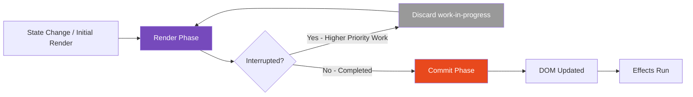
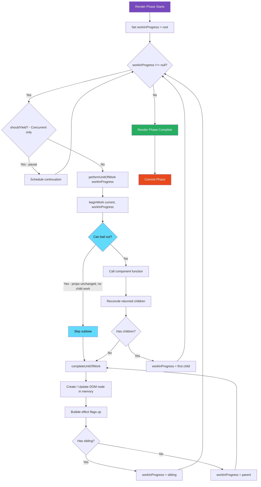
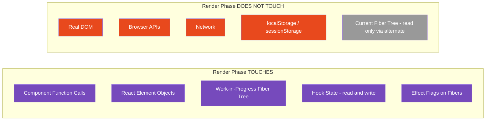

# 06 · The Render Phase

> **The render phase is the part of React's work cycle where component functions are called, a new Fiber tree is built, and the minimum set of DOM changes is computed — all without touching the DOM. It is pure computation: no side effects, no browser interaction, no mutation of anything the user can see.**

The render phase is where React does its thinking. The commit phase is where React acts on those thoughts. Keeping these two phases conceptually separate — and understanding exactly what happens in each — is the single most important mental model for reasoning about React performance, debugging, and correctness.

---

## Table of Contents

- [The Two Phases of React's Work Cycle](#the-two-phases-of-reacts-work-cycle)
- [What Triggers the Render Phase](#what-triggers-the-render-phase)
- [The Work Loop](#the-work-loop)
- [Beginning Work: Walking Down the Tree](#beginning-work-walking-down-the-tree)
- [Completing Work: Walking Back Up](#completing-work-walking-back-up)
- [How Component Functions Are Called](#how-component-functions-are-called)
- [Reconciling Children During the Render Phase](#reconciling-children-during-the-render-phase)
- [The Purity Requirement](#the-purity-requirement)
- [Why Side Effects in Render Are Dangerous](#why-side-effects-in-render-are-dangerous)
- [Strict Mode and Double Rendering](#strict-mode-and-double-rendering)
- [Render Phase in Concurrent React](#render-phase-in-concurrent-react)
- [What the Render Phase Produces](#what-the-render-phase-produces)
- [Render Phase Performance](#render-phase-performance)
- [Architecture Diagrams](#architecture-diagrams)
- [Good Practices](#good-practices)
- [Bad Practices](#bad-practices)
- [Mental Model](#mental-model)
- [Common Mistakes](#common-mistakes)
- [Exercises](#exercises)
- [Further Reading](#further-reading)

---

## The Two Phases of React's Work Cycle

Every React update — from the first render to every subsequent re-render — flows through two distinct phases:

### Phase 1: Render Phase (also called the Reconciliation Phase)

- **What:** React calls component functions, builds a new Fiber tree, and computes what changed
- **DOM touched:** No
- **Side effects run:** No
- **Can be interrupted:** Yes (in Concurrent React)
- **Can run multiple times:** Yes (React may restart render if higher priority work arrives)
- **Pure:** Yes — same input must produce same output

### Phase 2: Commit Phase

- **What:** React applies the computed changes to the real DOM
- **DOM touched:** Yes
- **Side effects run:** Yes (`useLayoutEffect`, `useEffect`)
- **Can be interrupted:** No — always runs to completion once started
- **Runs multiple times for one update:** No — runs exactly once per completed render
- **Pure:** No — intentionally has side effects

This document covers the render phase in full. The commit phase has its own document.



---

## What Triggers the Render Phase

The render phase begins when React has work to do. Work is enqueued by:

### 1. Initial render

```tsx
// The very first render — mounts the entire component tree
const root = ReactDOM.createRoot(document.getElementById("root")!);
root.render(<App />);
```

### 2. State updates

```tsx
// useState setter
const [count, setCount] = useState(0);
setCount(1); // enqueues a render for this component and its subtree

// useReducer dispatch
const [state, dispatch] = useReducer(reducer, initialState);
dispatch({ type: "INCREMENT" }); // enqueues a render
```

### 3. Parent re-render

```tsx
// When a parent re-renders, it produces new React element objects for its children.
// Each child element triggers reconciliation of that child's fiber.
// By default, all children re-render when a parent re-renders.
function Parent() {
  const [x, setX] = useState(0);
  return <Child />; // new element object every render — Child reconciles
}
```

### 4. Context value change

```tsx
// When a Provider's value changes, all useContext consumers are marked
// for re-render regardless of where they are in the tree
<ThemeContext.Provider value={newTheme}>
```

### 5. Force update (class components only)

```tsx
// forceUpdate bypasses shouldComponentUpdate and always re-renders
this.forceUpdate();
```

### How React enqueues work

When `setState` is called, React does not immediately re-render. It enqueues an update object on the Fiber's update queue and schedules work with the Scheduler:

```js
// Simplified: what happens when setState is called
function dispatchSetState(fiber, queue, action) {
  const update = {
    lane: requestUpdateLane(fiber), // priority level
    action, // the new value or updater function
    next: null, // links to next update in queue
  };

  // Append to the circular update queue on this fiber
  enqueueUpdate(fiber, update);

  // Ask the scheduler to schedule work at the appropriate priority
  scheduleUpdateOnFiber(fiber, lane);
}
```

> 🔬 **Internals:** React uses a circular linked list for update queues — not a plain array. The last update's `next` points back to the first update. This makes it efficient to append to the end and process from the front in O(1). Multiple rapid state updates to the same fiber accumulate in this queue and are processed together in the next render (batching).

---

## The Work Loop

The render phase executes inside a loop called the **work loop**. This is the heart of React's rendering engine.

```js
// Simplified work loop (from ReactFiberWorkLoop.js)
function workLoopSync() {
  // Process work units until there are none left
  while (workInProgress !== null) {
    performUnitOfWork(workInProgress);
  }
}

// The concurrent version checks for interruption on each iteration
function workLoopConcurrent() {
  while (workInProgress !== null && !shouldYield()) {
    performUnitOfWork(workInProgress);
  }
  // shouldYield() returns true when the time slice is exhausted (5ms default)
  // React will resume this loop in the next scheduled task
}
```

### What `performUnitOfWork` does

```js
function performUnitOfWork(unitOfWork) {
  const current = unitOfWork.alternate; // the current (previously rendered) fiber

  // beginWork: process this fiber, produce its children
  const next = beginWork(current, unitOfWork, renderLanes);

  unitOfWork.memoizedProps = unitOfWork.pendingProps;

  if (next === null) {
    // No more children to process — complete this fiber and move up
    completeUnitOfWork(unitOfWork);
  } else {
    // Move to the first child and process it next
    workInProgress = next;
  }
}
```

The work loop processes one Fiber node at a time. After processing each node, it either moves to the first child (going deeper) or completes the node and moves to a sibling or parent (going back up). This traversal pattern is a **depth-first tree walk**.

---

## Beginning Work: Walking Down the Tree

`beginWork` is called for each Fiber during the downward traversal. Its job is to determine what the Fiber should render and produce child fibers.

```js
// Simplified beginWork
function beginWork(current, workInProgress, renderLanes) {
  // Check if we can bail out early (optimization)
  if (current !== null) {
    const oldProps = current.memoizedProps;
    const newProps = workInProgress.pendingProps;

    if (
      oldProps === newProps &&
      !includesSomeLane(renderLanes, workInProgress.lanes)
    ) {
      // Props didn't change and no pending work for this fiber
      // Bail out — skip this subtree entirely
      return bailoutOnAlreadyFinishedWork(current, workInProgress, renderLanes);
    }
  }

  // Different handling based on fiber type
  switch (workInProgress.tag) {
    case FunctionComponent:
      return updateFunctionComponent(current, workInProgress, renderLanes);

    case ClassComponent:
      return updateClassComponent(current, workInProgress, renderLanes);

    case HostComponent: // 'div', 'span', etc.
      return updateHostComponent(current, workInProgress, renderLanes);

    case HostText:
      return updateHostText(current, workInProgress);

    case ContextProvider:
      return updateContextProvider(current, workInProgress, renderLanes);

    case SuspenseComponent:
      return updateSuspenseComponent(current, workInProgress, renderLanes);

    // ... many more cases
  }
}
```

### The bailout optimization

The early bailout is one of React's most important optimizations. If a Fiber's props have not changed and it has no pending work (no state updates in its subtree), React can **skip the entire subtree** without calling any component functions.

This is the mechanism that makes `React.memo` and `shouldComponentUpdate` work — they affect whether the props comparison in `beginWork` passes, which determines whether the subtree is skipped or processed.

```js
function bailoutOnAlreadyFinishedWork(current, workInProgress, renderLanes) {
  // Check if any children have pending work
  if (!includesSomeLane(renderLanes, workInProgress.childLanes)) {
    // No children have pending work either — skip the entire subtree
    return null; // null tells the work loop to complete this fiber immediately
  }

  // Children have pending work — clone them and continue down
  cloneChildFibers(current, workInProgress);
  return workInProgress.child;
}
```

> 🔬 **Internals:** Every Fiber has two lane fields: `lanes` (does this fiber have pending work?) and `childLanes` (does any fiber in this subtree have pending work?). When React schedules work, it propagates the lane up the tree from the updated fiber to the root — updating `childLanes` on every ancestor. This means React can look at any fiber's `childLanes` and immediately know whether any descendant needs work, without traversing the entire subtree. This propagation is what makes selective re-rendering efficient at scale.

---

## Completing Work: Walking Back Up

After processing a fiber and all its children, React calls `completeWork`. This is the upward traversal — walking back through parent fibers after their subtrees are processed.

```js
function completeWork(current, workInProgress, renderLanes) {
  switch (workInProgress.tag) {
    case HostComponent: {
      // For DOM elements: create or update the actual DOM node
      if (current !== null && workInProgress.stateNode != null) {
        // Update existing DOM node — compute prop changes
        updateHostComponent(current, workInProgress, ...);
      } else {
        // Create new DOM node (but don't insert into real DOM yet)
        const instance = createDOMElement(workInProgress.type, workInProgress.pendingProps);
        workInProgress.stateNode = instance; // store the DOM node on the fiber
        appendAllChildren(instance, workInProgress); // attach child DOM nodes
      }
      break;
    }

    case FunctionComponent:
    case ClassComponent:
      // Bubble up effect flags — if a child has effects, propagate to parent
      bubbleProperties(workInProgress);
      break;
  }

  return null; // signals to work loop: move to sibling or parent
}
```

### Effect flag bubbling

During `completeWork`, React bubbles effect flags upward through the tree. If any descendant has an effect (a DOM update, a new effect to run), the ancestor's `subtreeFlags` field is updated to reflect this.

```js
function bubbleProperties(completedWork) {
  let subtreeFlags = NoFlags;
  let child = completedWork.child;

  while (child !== null) {
    subtreeFlags |= child.subtreeFlags; // collect flags from child's subtree
    subtreeFlags |= child.flags; // collect flags from child itself
    child = child.sibling;
  }

  completedWork.subtreeFlags |= subtreeFlags;
}
```

During the commit phase, React walks only the fibers with non-zero flags — skipping branches of the tree with no effects. This makes the commit phase efficient even for large trees.

---

## How Component Functions Are Called

When `beginWork` processes a `FunctionComponent` fiber, it calls `renderWithHooks` — the function responsible for calling your component function with the correct hooks dispatcher.

```js
// Simplified renderWithHooks
function renderWithHooks(current, workInProgress, Component, props) {
  // Set the global "current fiber" so hooks know which fiber to attach to
  currentlyRenderingFiber = workInProgress;

  // Reset the hook work-in-progress state
  workInProgress.memoizedState = null;
  workInProgress.updateQueue = null;

  // Install the appropriate hooks dispatcher
  // On mount: hooks initialize state
  // On update: hooks read existing state
  ReactCurrentDispatcher.current =
    current === null || current.memoizedState === null
      ? HooksDispatcherOnMount
      : HooksDispatcherOnUpdate;

  // ← Your component function is called right here
  let children = Component(props);
  // ↑ All the JSX you return is evaluated here

  // Clean up
  currentlyRenderingFiber = null;
  ReactCurrentDispatcher.current = ContextOnlyDispatcher;

  return children; // the React elements your component returned
}
```

### The hooks dispatcher switch

The reason `ReactCurrentDispatcher.current` switches between `HooksDispatcherOnMount` and `HooksDispatcherOnUpdate` is that hooks behave differently on first call vs subsequent calls:

```js
// On mount: useState initializes state and creates hook node
const HooksDispatcherOnMount = {
  useState: mountState,
  useEffect: mountEffect,
  useMemo: mountMemo,
  // ...
};

// On update: useState reads existing state from fiber's hook list
const HooksDispatcherOnUpdate = {
  useState: updateState,
  useEffect: updateEffect,
  useMemo: updateMemo,
  // ...
};

// Outside a component: hooks throw an error
const ContextOnlyDispatcher = {
  useState: throwInvalidHookError,
  useEffect: throwInvalidHookError,
  // ...
};
```

This is why calling a hook outside a component function throws: `ReactCurrentDispatcher.current` is set to `ContextOnlyDispatcher` when no component is rendering, and every hook call throws.

### What happens when your component function runs

```tsx
function ProductCard({ product }: { product: Product }) {
  // 1. useState call: reads from / writes to hook node at position 0 in fiber's hook list
  const [isExpanded, setIsExpanded] = useState(false);

  // 2. useMemo call: reads from / writes to hook node at position 1
  const formattedPrice = useMemo(
    () => formatPrice(product.price, product.currency),
    [product.price, product.currency],
  );

  // 3. useEffect call: reads from / writes to hook node at position 2
  useEffect(() => {
    trackProductView(product.id);
  }, [product.id]);

  // 4. JSX evaluates — produces React element objects
  return (
    <article>
      <h2>{product.name}</h2>
      <p>{formattedPrice}</p>
      <button onClick={() => setIsExpanded((v) => !v)}>
        {isExpanded ? "Less" : "More"}
      </button>
    </article>
  );
  // The returned React elements are passed back to beginWork
  // which then creates child fibers for each element
}
```

Each hook call reads or writes from a linked list node on the current fiber's `memoizedState`. The order of hook calls must be stable across renders — this is why hooks cannot be called conditionally.

---

## Reconciling Children During the Render Phase

After your component function returns its React elements, `beginWork` calls `reconcileChildren` to turn those elements into fibers:

```js
function reconcileChildren(current, workInProgress, nextChildren, renderLanes) {
  if (current === null) {
    // This is a new component being mounted for the first time
    // Create new fibers for all children — no diffing needed
    workInProgress.child = mountChildFibers(
      workInProgress,
      null,
      nextChildren,
      renderLanes,
    );
  } else {
    // This component already exists — diff the new elements against existing fibers
    workInProgress.child = reconcileChildFibers(
      workInProgress,
      current.child,
      nextChildren,
      renderLanes,
    );
  }
}
```

### Child fiber creation vs reuse

```js
// Simplified reconcileChildFibers — the actual diffing
function reconcileChildFibers(returnFiber, currentFirstChild, newChild, lanes) {
  // Handle array of children (most common case)
  if (Array.isArray(newChild)) {
    return reconcileChildrenArray(
      returnFiber,
      currentFirstChild,
      newChild,
      lanes,
    );
  }

  // Handle single element child
  if (isObject(newChild)) {
    return reconcileSingleElement(
      returnFiber,
      currentFirstChild,
      newChild,
      lanes,
    );
  }

  // Handle text children
  if (typeof newChild === "string" || typeof newChild === "number") {
    return reconcileSingleTextNode(
      returnFiber,
      currentFirstChild,
      "" + newChild,
      lanes,
    );
  }

  // null, undefined, boolean → delete existing children
  return deleteRemainingChildren(returnFiber, currentFirstChild);
}
```

```js
// Simplified: single element reconciliation
function reconcileSingleElement(
  returnFiber,
  currentFirstChild,
  element,
  lanes,
) {
  const key = element.key;
  let child = currentFirstChild;

  while (child !== null) {
    if (child.key === key) {
      // Found a fiber with matching key
      if (child.type === element.type) {
        // Same type too — reuse this fiber, delete any siblings
        deleteRemainingChildren(returnFiber, child.sibling);
        const existing = useFiber(child, element.props); // update props
        existing.return = returnFiber;
        return existing; // REUSE
      }
      // Same key, different type — delete old subtree
      deleteRemainingChildren(returnFiber, child);
      break;
    } else {
      deleteChild(returnFiber, child); // key doesn't match — delete
    }
    child = child.sibling;
  }

  // No matching fiber found — create a new one
  const created = createFiberFromElement(element, lanes);
  created.return = returnFiber;
  return created; // CREATE NEW
}
```

---

## The Purity Requirement

The render phase has one non-negotiable requirement: **component functions must be pure with respect to their inputs**.

A pure function:

1. Returns the same output for the same input
2. Has no observable side effects during its execution

```tsx
// ✅ Pure component — always produces same output for same input
function PureGreeting({
  name,
  time,
}: {
  name: string;
  time: "morning" | "evening";
}) {
  const greeting = time === "morning" ? "Good morning" : "Good evening";
  return (
    <h1>
      {greeting}, {name}!
    </h1>
  );
}

// ❌ Impure — reads external mutable state
let globalCounter = 0;

function ImpureCounter() {
  globalCounter++; // side effect during render — modifies external state
  return <p>Rendered {globalCounter} times</p>;
  // This value is wrong if React renders this component multiple times
  // (which it does in StrictMode and Concurrent React)
}
```

### What "pure" means in practice

Your component function should not:

- Mutate variables that existed before the render call (no mutation of props, no mutation of variables from outer scope)
- Perform network requests
- Read from mutable browser APIs (no `Date.now()`, no `Math.random()` outside of initialization)
- Write to the DOM
- Set timers
- Trigger other state updates (calling `setState` of another component during render)

Your component function can:

- Read from props
- Read from state (via hooks)
- Compute new values
- Call other pure functions
- Create new objects and arrays (local to the render)
- Call hooks (which are themselves pure during the render phase)

---

## Why Side Effects in Render Are Dangerous

The render phase can be **interrupted, paused, and restarted** in Concurrent React. If your component function has side effects, those effects may run multiple times, in unexpected order, or not run at all for an interrupted render.

### Scenario 1: Render runs multiple times (Strict Mode)

React's Strict Mode deliberately calls component functions twice (in development) to surface impurity bugs:

```tsx
let renderCount = 0;

function BadComponent() {
  renderCount++; // ❌ mutates external state
  console.log("Render count:", renderCount);
  // In Strict Mode: logs 1, 2, 3, 4... on each "single" render
  // Because React calls the function twice per render to detect side effects
  return <div>{renderCount}</div>;
  // Shows 2 instead of 1 because the function ran twice
}
```

### Scenario 2: Interrupted render

In Concurrent React, a high-priority update can interrupt a low-priority render:

```tsx
// Imagine this render is in progress
function ExpensiveReport({ data }: { data: ReportData }) {
  // ❌ Side effect during render: making a network request
  fetch("/api/log-report-view"); // This runs...
  // ...but the render gets interrupted by a user keystroke
  // The fetch fires but the render never completes
  // The component may re-render from scratch
  // The fetch fires AGAIN
  // Now you have duplicate log entries
  return <ReportTable data={data} />;
}
```

### Scenario 3: Render without commit

React may render a component (call its function, build fibers) but decide not to commit the result — for example, if a higher priority update replaces the work-in-progress before it completes.

```tsx
function ComponentWithSideEffect() {
  // ❌ This console.log fires during render
  // In Concurrent React, this render may be thrown away
  // The log appears but the user never sees this version of the component
  console.log("Rendering with data:", importantData);
  return <div>{importantData}</div>;
}
```

> 🏭 **Production Note:** The practical consequence is this: any observable action you take during render (logging analytics events, firing network requests, writing to localStorage, updating external stores) may happen zero, one, or multiple times for what you intended to be a single render. This produces duplicate events, incorrect analytics, and inconsistent external state. Always use `useEffect` for side effects — it runs after commit, guaranteed, once per dependency change.

---

## Strict Mode and Double Rendering

React's `<React.StrictMode>` component activates several checks in development, including **double-invoking component functions**:

```tsx
function App() {
  return (
    <React.StrictMode>
      <YourApp />
    </React.StrictMode>
  );
}
```

In Strict Mode (development only):

- Component functions run **twice** per render
- `useState` initializers run **twice**
- `useReducer` reducers run **twice**
- `useMemo` and `useCallback` factory functions run **twice**
- `useEffect` cleanup and setup run **twice** on mount

The second invocation's output is discarded — React only uses the first. The purpose is to surface components that behave differently on first vs second call, which indicates hidden side effects.

```tsx
// Strict Mode surfaces this bug:
const usedIds = new Set<string>();

function UniqueIdConsumer({ id }: { id: string }) {
  // ❌ Modifies external set during render
  if (usedIds.has(id)) {
    throw new Error(`Duplicate ID: ${id}`);
  }
  usedIds.add(id); // Strict Mode: this runs twice → error on second call
  return <div id={id}>Content</div>;
}
```

> 🔬 **Internals:** Strict Mode double-invoking runs synchronously — the component function is called, its output is recorded, then it is called again and its second output is used. Between the two calls, React resets the hooks dispatcher to the same state as before the first call, so the hook invocations see exactly the same initial state. Any external mutation from the first call (like adding to a Set) persists into the second call — which is exactly what causes the bug to surface.

---

## Render Phase in Concurrent React

In React 18 with concurrent features, the render phase gains new behaviors:

### Interruptible rendering

The work loop in concurrent mode checks `shouldYield()` between processing each fiber. If the check returns `true` (the time slice is exhausted), React pauses the work loop and yields control back to the browser.

```js
function workLoopConcurrent() {
  while (workInProgress !== null && !shouldYield()) {
    performUnitOfWork(workInProgress);
  }
  // If we exited because of shouldYield(), workInProgress is not null
  // React will schedule continuation via MessageChannel
}
```

### Lanes and priority

Different types of updates have different priority levels (lanes):

| Update Type                               | Lane                | Priority                      |
| ----------------------------------------- | ------------------- | ----------------------------- |
| Discrete user input (click, keypress)     | SyncLane            | Highest — must be synchronous |
| Continuous user input (mousemove, scroll) | InputContinuousLane | High                          |
| Default state updates                     | DefaultLane         | Normal                        |
| `startTransition` updates                 | TransitionLane      | Low                           |
| Offscreen / deferred                      | OffscreenLane       | Lowest                        |

When a higher-priority update arrives during a lower-priority render, React may abandon the in-progress work and start over with the higher-priority update.

```tsx
function SearchResults({ query }: { query: string }) {
  const [results, setResults] = useState<Result[]>([]);

  // startTransition marks this update as low priority (TransitionLane)
  // Typing in the input is high priority (SyncLane)
  // If user types while results are loading, React prioritizes typing
  const [isPending, startTransition] = useTransition();

  const handleSearch = (q: string) => {
    startTransition(() => {
      setResults(computeResults(q)); // low priority — can be interrupted
    });
  };

  return (/* ... */);
}
```

---

## What the Render Phase Produces

When the render phase completes successfully (not interrupted), it has produced:

### 1. A complete work-in-progress Fiber tree

Every component that needed to render has been called. Every fiber has updated `memoizedProps`, `memoizedState`, and effect flags.

### 2. An effect list (encoded as subtreeFlags)

Every fiber that has effects (DOM insertions, updates, deletions, effects to run) has been flagged. The flags are bubbled upward so the commit phase knows where to look.

### 3. The `finishedWork` pointer

The root fiber holds a reference to the completed work-in-progress tree. The commit phase reads this to know what to apply.

```js
// After the render phase completes:
root.finishedWork = workInProgress; // the completed tree
root.finishedLanes = renderLanes; // which lanes were processed

// The commit phase then takes over:
commitRoot(root);
```

---

## Render Phase Performance

The render phase is where most React performance optimization opportunities exist. The commit phase is usually fast (few DOM mutations in a well-optimized app). The render phase is where expensive work accumulates.

### What makes the render phase slow

**1. Too many component functions called**
Every component in the subtree of an updated component re-renders by default. For a 500-component tree where the top-level component updates, 500 functions are called.

**2. Expensive computations inside component functions**

```tsx
function ProductList({ products }: { products: Product[] }) {
  // ❌ Runs on every render — O(n log n) sort
  const sorted = products.sort((a, b) => b.rating - a.rating);
  // ✅ Memoize expensive computation
  const sorted = useMemo(
    () => [...products].sort((a, b) => b.rating - a.rating),
    [products],
  );
}
```

**3. Object and array creation in render**

```tsx
function Component() {
  // ❌ New object on every render — breaks React.memo on children
  const style = { color: "red", fontSize: 14 };
  // ✅ Stable reference
  const style = useMemo(() => ({ color: "red", fontSize: 14 }), []);
  // Or outside the component entirely if it doesn't depend on props/state
}

const STYLE = { color: "red", fontSize: 14 }; // defined once at module scope
```

**4. Deep context re-renders**
Context updates trigger re-renders in all consumers — even those that don't use the changed value.

### Measuring render phase cost

```tsx
// React Profiler API — measure render time programmatically
<React.Profiler
  id="ProductList"
  onRender={(id, phase, actualDuration, baseDuration) => {
    console.log({
      id,
      phase, // 'mount' or 'update'
      actualDuration, // time taken for this render (ms)
      baseDuration, // estimated time without memoization (ms)
    });
  }}
>
  <ProductList products={products} />
</React.Profiler>
```

---

## Architecture Diagrams

### The complete render phase work loop



### Render phase: what is touched and what is not



---

## Good Practices

### ✅ Good Practice — Keep component functions pure and fast

```tsx
/**
 * Good: All computation is pure. Expensive derivations are memoized.
 * No side effects during render. Stable references for child props.
 */
function OrderSummary({ orders, currency }: OrderSummaryProps) {
  // Pure computation — memoized because it's expensive (sorting + reducing)
  const summary = useMemo(() => {
    const total = orders.reduce((sum, order) => sum + order.amount, 0);
    const sorted = [...orders].sort(
      (a, b) => b.date.getTime() - a.date.getTime(),
    );
    return { total, sorted, count: orders.length };
  }, [orders]);

  // Stable callback reference — won't break memoized children
  const handleExport = useCallback(() => {
    exportOrders(orders, currency);
  }, [orders, currency]);

  return (
    <div>
      <SummaryHeader
        total={summary.total}
        count={summary.count}
        currency={currency}
        onExport={handleExport}
      />
      <OrderList orders={summary.sorted} />
    </div>
  );
}
```

**Why this works:** The render phase does only what it should — pure computation. The DOM isn't touched, no network requests fire, and no external state is mutated. React can safely call this function twice (Strict Mode), interrupt it, or restart it without any incorrect behavior.

---

## Bad Practices

### ⚠️ Bad Practice — Side effects during render

```tsx
/**
 * Bad: Multiple side effects directly in the render path.
 * These produce incorrect behavior in StrictMode and Concurrent React.
 */
function AnalyticsDashboard({ reportId }: { reportId: string }) {
  // ❌ Network request fires during render — may fire multiple times
  fetch(`/api/log-view?reportId=${reportId}`);

  // ❌ Reading mutable external state — value may differ between renders
  const timestamp = Date.now();

  // ❌ Writing to external store during render — may run on interrupted render
  analyticsStore.currentReport = reportId;

  // ❌ console.log fires during render — Strict Mode: fires twice per render
  console.log("Rendering report:", reportId);

  return <Report id={reportId} timestamp={timestamp} />;
}

/**
 * ✅ Correct version: all side effects in useEffect
 */
function AnalyticsDashboard({ reportId }: { reportId: string }) {
  // Stable timestamp — only recalculated when reportId changes
  const timestampRef = useRef(Date.now());

  useEffect(() => {
    // Fires once after render, after commit, guaranteed
    fetch(`/api/log-view?reportId=${reportId}`);
    analyticsStore.currentReport = reportId;
    timestampRef.current = Date.now();
  }, [reportId]);

  return <Report id={reportId} timestamp={timestampRef.current} />;
}
```

**Production impact of side effects in render:** Duplicate analytics events, duplicate network requests, race conditions between interrupted renders and network responses, incorrect timestamps, and impossible-to-debug state inconsistencies that only appear under load or in concurrent rendering scenarios.

---

## Mental Model

> 💡 **The render phase mental model:**
>
> The render phase is React's **planning session**. It is like an architect drawing blueprints — no construction happens, no materials are moved, no ground is broken. The architect can redraw the blueprints as many times as needed until they are right. The render phase is the same: React calls your functions, produces descriptions (fibers with effect flags), and figures out the minimum set of real-world changes needed. The actual construction — touching the DOM, running effects — only happens in the commit phase, and only once per completed render. Your component function is an input to the planning process. Keep it pure so the planning can restart freely.

---

## Common Mistakes

### Calling setState inside the render function (infinite loop)

```tsx
function Bad() {
  const [x, setX] = useState(0);
  setX(1); // ❌ setState during render → schedules another render → infinite loop
  return <div>{x}</div>;
}
```

### Reading mutable external state during render

`Date.now()`, `Math.random()`, `document.title`, global variables — these break purity. The same props may produce different output on different calls.

### Performing async operations during render

Fetch calls, `setTimeout`, `setInterval` in render — these fire outside React's control and may duplicate on interrupted renders.

### Assuming render only runs once per visible update

In Strict Mode, render runs twice. In Concurrent React, render may be interrupted and restarted. Any code in the render path may run more than once per committed update.

---

## Exercises

### Exercise 1 — Profile the render phase

Open React DevTools Profiler. Record a profile while interacting with a React app. Identify:

- Which component's render phase takes the most time
- Which components re-render but don't need to (candidates for `React.memo`)
- How `actualDuration` compares to `baseDuration` (the memoization efficiency ratio)

### Exercise 2 — Find the impure component

Add `<React.StrictMode>` to your app if it is not already there. Look for console.logs, network requests, or errors that appear twice. Track each one to its source in the render phase. Move it to `useEffect`.

### Exercise 3 — Trace beginWork bailouts

Add a `console.count('beginWork:' + fiber.type?.name)` call in your imagination (or by temporarily patching React's dev build) — or observe in the React DevTools Profiler which components show as "Render (prevented)" vs "Render". Wrap one expensive component with `React.memo`. Observe which renders it prevents.

---

## Further Reading

- [React Source: ReactFiberWorkLoop.js](https://github.com/facebook/react/blob/main/packages/react-reconciler/src/ReactFiberWorkLoop.js) — The work loop implementation
- [React Source: ReactFiberBeginWork.js](https://github.com/facebook/react/blob/main/packages/react-reconciler/src/ReactFiberBeginWork.js) — The beginWork function for all fiber types
- [React Source: ReactFiberCompleteWork.js](https://github.com/facebook/react/blob/main/packages/react-reconciler/src/ReactFiberCompleteWork.js) — The completeWork function
- [React Source: ReactFiberHooks.js](https://github.com/facebook/react/blob/main/packages/react-reconciler/src/ReactFiberHooks.js) — renderWithHooks and the hooks dispatcher
- [Overreacted: How Does React Tell a Class from a Function?](https://overreacted.io/how-does-react-tell-a-class-from-a-function/) — Component type detection
- Next in this handbook: [07 · The Commit Phase](./02-commit-phase.md)

---

_Part of the [React + Next.js Engineering Handbook](../../README.md)_
