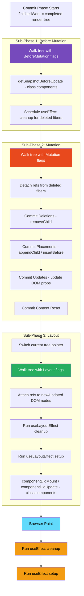
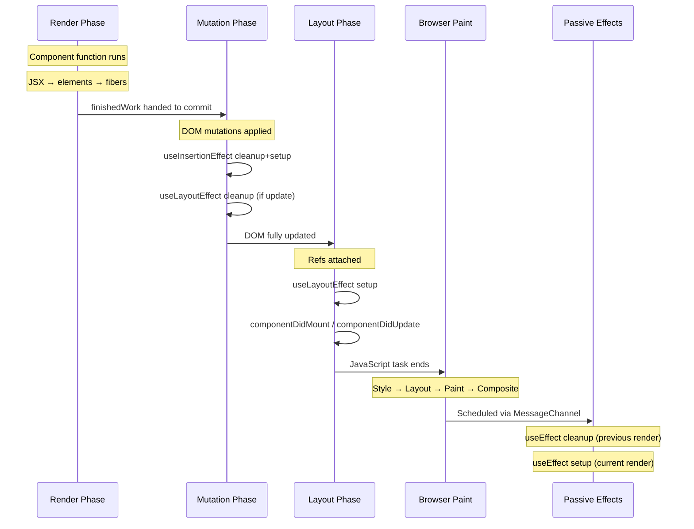
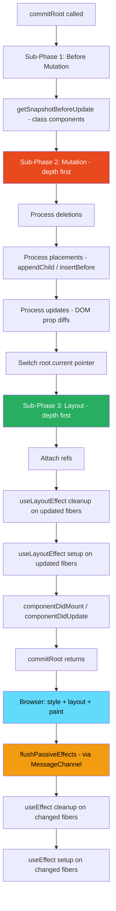

# 07 · The Commit Phase

> **The commit phase is where React's computed plan meets reality. After the render phase determines what needs to change, the commit phase applies those changes to the real DOM — synchronously, without interruption, in three precisely ordered sub-phases. Every DOM mutation, every ref attachment, every effect runs here.**

If the render phase is thinking, the commit phase is acting. It is the only phase where the browser DOM is touched, the only phase where `useLayoutEffect` and `useEffect` run, and the only phase that cannot be interrupted. Understanding the commit phase in detail explains why certain patterns cause visual flickering, why reading DOM measurements must happen in `useLayoutEffect`, and why effects run in a specific order relative to paint.

---

## Table of Contents

- [The Three Sub-Phases of Commit](#the-three-sub-phases-of-commit)
- [How the Commit Phase Begins](#how-the-commit-phase-begins)
- [Sub-Phase 1: Before Mutation](#sub-phase-1-before-mutation)
- [Sub-Phase 2: Mutation Phase](#sub-phase-2-mutation-phase)
- [Sub-Phase 3: Layout Phase](#sub-phase-3-layout-phase)
- [The Passive Effects Phase](#the-passive-effects-phase)
- [Effect Execution Order](#effect-execution-order)
- [Ref Attachment and Detachment](#ref-attachment-and-detachment)
- [Why the Commit Phase Cannot Be Interrupted](#why-the-commit-phase-cannot-be-interrupted)
- [Commit Phase and the Browser Paint](#commit-phase-and-the-browser-paint)
- [Double Buffering: Current and Work-in-Progress Trees](#double-buffering-current-and-work-in-progress-trees)
- [Deletion Handling](#deletion-handling)
- [Architecture Diagrams](#architecture-diagrams)
- [Good Practices](#good-practices)
- [Bad Practices](#bad-practices)
- [Mental Model](#mental-model)
- [Common Mistakes](#common-mistakes)
- [Exercises](#exercises)
- [Further Reading](#further-reading)

---

## The Three Sub-Phases of Commit

The commit phase is divided into three sequential sub-phases, each walking the fiber tree and processing a different type of work:

| Sub-Phase           | What It Does                                               | DOM State                      |
| ------------------- | ---------------------------------------------------------- | ------------------------------ |
| **Before Mutation** | Snapshots DOM state, calls class `getSnapshotBeforeUpdate` | Not yet mutated                |
| **Mutation**        | Applies all DOM insertions, updates, deletions             | Being mutated                  |
| **Layout**          | Attaches refs, runs `useLayoutEffect`                      | Fully mutated, not yet painted |

After all three sub-phases complete, React switches the current fiber tree to the work-in-progress tree (double buffering), then schedules passive effects (`useEffect`) to run after the browser paints.



---

## How the Commit Phase Begins

The commit phase starts immediately after a successful render phase. The root fiber holds a reference to the completed work-in-progress tree:

```js
// Simplified: entry point to commit phase (ReactFiberWorkLoop.js)
function commitRoot(root) {
  const finishedWork = root.finishedWork; // the completed WIP tree
  const finishedLanes = root.finishedLanes; // which lanes were processed

  root.finishedWork = null;
  root.finishedLanes = NoLanes;

  // Check subtreeFlags and flags at the root to determine if there's any work
  const subtreeHasEffects =
    (finishedWork.subtreeFlags & (MutationMask | LayoutMask | PassiveMask)) !==
    NoFlags;
  const rootHasEffect =
    (finishedWork.flags & (MutationMask | LayoutMask | PassiveMask)) !==
    NoFlags;

  if (subtreeHasEffects || rootHasEffect) {
    // Run the three sub-phases
    commitBeforeMutationEffects(root, finishedWork);
    commitMutationEffects(root, finishedWork, lanes);

    // Switch trees BETWEEN mutation and layout phases
    root.current = finishedWork; // ← this is the double-buffer swap

    commitLayoutEffects(finishedWork, root, lanes);

    // Schedule passive effects (useEffect) for after paint
    scheduleCallback(NormalSchedulerPriority, () => {
      flushPassiveEffects();
    });
  } else {
    // No effects anywhere in the tree — just switch the tree
    root.current = finishedWork;
  }
}
```

> 🔬 **Internals:** The critical detail here is **when** `root.current = finishedWork` happens — between the mutation phase and the layout phase, not at the very end. This placement is deliberate. During `useLayoutEffect`, you can call `setState`. If `root.current` pointed to the old tree, calling `setState` inside `useLayoutEffect` would enqueue an update on the old tree's fiber — the wrong fiber. By switching the pointer before layout effects run, any state updates triggered by `useLayoutEffect` are correctly enqueued on the new current fibers.

---

## Sub-Phase 1: Before Mutation

The before mutation phase runs before any DOM is changed. Its primary purpose is capturing DOM state _before_ mutation, so components can compare pre- and post-mutation values.

```js
function commitBeforeMutationEffects(root, firstChild) {
  // Walk all fibers with BeforeMutation flags
  let fiber = firstChild;
  while (fiber !== null) {
    // Class components: call getSnapshotBeforeUpdate
    if ((fiber.flags & Snapshot) !== NoFlags) {
      const current = fiber.alternate;
      commitBeforeMutationEffectsOnFiber(fiber);
    }

    // Schedule useEffect cleanup for fibers being deleted
    if ((fiber.flags & Passive) !== NoFlags) {
      schedulePassiveEffects(fiber);
    }

    fiber = fiber.nextEffect; // walk the effect list
  }
}
```

### getSnapshotBeforeUpdate (class components)

The only function that runs in the before mutation phase for most applications:

```tsx
class ScrollableList extends React.Component {
  getSnapshotBeforeUpdate(prevProps, prevState) {
    // DOM is NOT YET MUTATED here
    // Safe to read scroll position BEFORE React changes the list
    if (prevProps.items.length < this.props.items.length) {
      const list = this.listRef.current;
      return list.scrollHeight - list.scrollTop; // capture scroll distance from bottom
    }
    return null;
  }

  componentDidUpdate(prevProps, prevState, snapshot) {
    // DOM IS now mutated — snapshot contains the pre-mutation value
    if (snapshot !== null) {
      const list = this.listRef.current;
      // Restore scroll position relative to bottom — prevents scroll jump
      list.scrollTop = list.scrollHeight - snapshot;
    }
  }
}
```

> 🔬 **Internals:** The return value from `getSnapshotBeforeUpdate` is stored on the fiber's `updateQueue.lastEffect.tag` field and passed as the third argument to `componentDidUpdate`. This is the one mechanism React provides for class components to read DOM state before mutation and use that reading after mutation — bridging the before-mutation and layout phases.

### No hook equivalent for before mutation

There is no hook that runs in the before mutation phase. `useLayoutEffect` runs after mutation. If you need pre-mutation DOM measurements in function components, you must read them synchronously during the render phase (via `useRef`) or accept that your measurement reflects the post-mutation state in `useLayoutEffect`.

---

## Sub-Phase 2: Mutation Phase

The mutation phase is where the real DOM is changed. This is the most consequential part of the commit phase — where React's computed plan becomes visible to the user (after the paint that follows).

```js
function commitMutationEffects(root, finishedWork, lanes) {
  // Walk all fibers with Mutation flags
  commitMutationEffectsOnFiber(finishedWork, root, lanes);
}

function commitMutationEffectsOnFiber(finishedWork, root, lanes) {
  const flags = finishedWork.flags;

  // Reset text content (before inserting new content)
  if (flags & ContentReset) {
    commitResetTextContent(finishedWork);
  }

  // Detach refs from fibers being deleted or replaced
  if (flags & Ref) {
    const current = finishedWork.alternate;
    if (current !== null) {
      commitDetachRef(current); // set ref.current = null
    }
  }

  // Handle based on fiber type
  switch (finishedWork.tag) {
    case FunctionComponent:
    case ForwardRef:
    case MemoComponent: {
      // Run useInsertionEffect (CSS-in-JS hooks — fires before DOM mutations)
      commitHookEffectListUnmount(HookInsertion | HookHasEffect, finishedWork, ...);
      commitHookEffectListMount(HookInsertion | HookHasEffect, finishedWork, ...);
      // Then handle placement/update/deletion
      break;
    }
    case HostComponent: {
      // Actual DOM manipulation happens here
      break;
    }
  }

  // Handle placement, update, and deletion flags
  if (flags & Placement) {
    commitPlacement(finishedWork); // insertBefore or appendChild
  }
  if (flags & Update) {
    commitWork(current, finishedWork); // update DOM properties
  }
}
```

### Placement: inserting new DOM nodes

```js
// Simplified commitPlacement
function commitPlacement(finishedWork) {
  // Find the nearest host (DOM) ancestor
  const parentFiber = getHostParentFiber(finishedWork);
  const parentDOM = parentFiber.stateNode; // the real DOM node

  // Find the next DOM sibling (for insertBefore)
  const before = getHostSibling(finishedWork);

  if (before) {
    parentDOM.insertBefore(getStateNode(finishedWork), before);
  } else {
    parentDOM.appendChild(getStateNode(finishedWork));
  }
}
```

The `getHostSibling` function is one of the most complex in React's codebase. It must find the correct DOM sibling even when React component trees do not map 1:1 to DOM trees (due to fragments, portals, and components that render multiple children).

### Update: changing DOM properties

```js
// Simplified: updating a host component's DOM properties
function commitWork(current, finishedWork) {
  switch (finishedWork.tag) {
    case HostComponent: {
      const domNode = finishedWork.stateNode; // real DOM node
      const updatePayload = finishedWork.updateQueue; // prop diff from render phase

      if (updatePayload !== null) {
        // Apply the computed prop diff to the real DOM node
        updateDOMProperties(domNode, updatePayload, ...);
      }
      break;
    }
    case HostText: {
      const textNode = finishedWork.stateNode;
      textNode.nodeValue = finishedWork.memoizedProps; // update text content
      break;
    }
    case FunctionComponent: {
      // Run useLayoutEffect cleanup before running setup (on updates)
      commitHookEffectListUnmount(HookLayout | HookHasEffect, finishedWork, ...);
      break;
    }
  }
}
```

### How DOM properties are updated

The prop diff computed during the render phase (`completeWork`) is stored as an `updatePayload` — a flat array of alternating key-value pairs:

```js
// updatePayload format: [key1, value1, key2, value2, ...]
// Example: className changed, style.color changed
["className", "active button", "style", { color: "blue" }];

// Applied to the real DOM node:
function updateDOMProperties(domNode, updatePayload) {
  for (let i = 0; i < updatePayload.length; i += 2) {
    const propKey = updatePayload[i];
    const propValue = updatePayload[i + 1];

    if (propKey === "style") {
      setValueForStyles(domNode, propValue); // apply each style property
    } else if (propKey === "dangerouslySetInnerHTML") {
      setInnerHTML(domNode, propValue);
    } else if (propKey === "children") {
      setTextContent(domNode, propValue);
    } else {
      setValueForProperty(domNode, propKey, propValue); // attribute or property
    }
  }
}
```

> 🔬 **Internals:** React maintains a mapping of prop names to whether they should be set as DOM properties or HTML attributes. `className` is set as `domNode.className` (property). `data-*` and `aria-*` attributes use `setAttribute`. Event listeners are managed through React's event system at the root, not as individual element attributes. This distinction matters for correctness — setting `value` on an input as a property vs attribute behaves differently in the browser.

### useInsertionEffect: the CSS-in-JS hook

`useInsertionEffect` is a rarely-used hook that fires during the mutation phase — before DOM nodes are inserted. It exists specifically for CSS-in-JS libraries that need to inject `<style>` tags before React adds new DOM nodes, preventing a flash of unstyled content:

```tsx
// Used internally by CSS-in-JS libraries — not for application code
function useStyledComponent(styles: string) {
  useInsertionEffect(() => {
    // Inject the CSS rule into a style sheet
    // This runs before the new DOM nodes are inserted
    // So the styles are ready when the elements appear
    const sheet = document.styleSheets[0];
    sheet.insertRule(styles, sheet.cssRules.length);

    return () => {
      // Remove the rule when component unmounts
    };
  }, [styles]);
}
```

> ⚠️ **Anti-Pattern:** Using `useInsertionEffect` in application code. It cannot access DOM state (DOM mutations haven't happened yet), cannot call other hooks inside it, and provides no advantage over `useLayoutEffect` for non-CSS-injection use cases. It exists for library authors only.

---

## Sub-Phase 3: Layout Phase

The layout phase runs after all DOM mutations are complete but before the browser has painted the new frame. At this point, the DOM reflects the new state — any measurements you take here will be accurate.

```js
function commitLayoutEffects(finishedWork, root, committedLanes) {
  // Walk all fibers with Layout flags
  commitLayoutEffectOnFiber(root, current, finishedWork, committedLanes);
}

function commitLayoutEffectOnFiber(root, current, finishedWork, committedLanes) {
  switch (finishedWork.tag) {
    case FunctionComponent: {
      // Run useLayoutEffect setup (cleanup already ran in mutation phase)
      commitHookEffectListMount(HookLayout | HookHasEffect, finishedWork, ...);
      break;
    }
    case ClassComponent: {
      if (current === null) {
        // First mount: call componentDidMount
        finishedWork.stateNode.componentDidMount();
      } else {
        // Update: call componentDidUpdate with prev props, prev state, snapshot
        finishedWork.stateNode.componentDidUpdate(
          current.memoizedProps,
          current.memoizedState,
          finishedWork.updateQueue.lastEffect // the snapshot from getSnapshotBeforeUpdate
        );
      }
      break;
    }
    case HostRoot: {
      // If ReactDOM.render was called with a callback, invoke it
      const onRenderCallback = finishedWork.updateQueue;
      if (onRenderCallback !== null) onRenderCallback();
      break;
    }
  }
}
```

### useLayoutEffect: synchronous DOM measurements

`useLayoutEffect` is the correct place to read DOM measurements and synchronously update state or styles based on them:

```tsx
function Tooltip({ targetRef, children }: TooltipProps) {
  const tooltipRef = useRef<HTMLDivElement>(null);
  const [position, setPosition] = useState({ top: 0, left: 0 });

  useLayoutEffect(() => {
    // DOM is fully mutated — measurements are accurate
    const target = targetRef.current;
    const tooltip = tooltipRef.current;

    if (!target || !tooltip) return;

    const targetRect = target.getBoundingClientRect();
    const tooltipRect = tooltip.getBoundingClientRect();

    // Position tooltip above the target, centered
    setPosition({
      top: targetRect.top - tooltipRect.height - 8,
      left: targetRect.left + (targetRect.width - tooltipRect.width) / 2,
    });
    // ↑ setState inside useLayoutEffect triggers a synchronous re-render
    //   BEFORE the browser paints — so user never sees the wrong position
  }, [targetRef]);

  return (
    <div
      ref={tooltipRef}
      style={{ position: "fixed", top: position.top, left: position.left }}
    >
      {children}
    </div>
  );
}
```

> 🔬 **Internals:** When you call `setState` inside `useLayoutEffect`, React synchronously performs another render and commit cycle before releasing control to the browser. This is why `useLayoutEffect` → `setState` does not cause visible flicker — the browser has not painted the intermediate state. However, this also means that expensive `useLayoutEffect` work delays the browser's paint and can cause perceived lag. Use it only when synchronous DOM measurement is required.

### useLayoutEffect vs useEffect timing

```tsx
function TimingExample() {
  useLayoutEffect(() => {
    // Runs: after DOM mutation, before browser paint
    // Blocks paint until complete
    console.log("useLayoutEffect setup");
    return () => console.log("useLayoutEffect cleanup");
  });

  useEffect(() => {
    // Runs: after browser paint (asynchronously)
    // Does NOT block paint
    console.log("useEffect setup");
    return () => console.log("useEffect cleanup");
  });

  console.log("render");
}

// Order of output on mount:
// 1. render
// 2. [browser paint does NOT happen here yet]
// 3. useLayoutEffect setup
// 4. [browser paint happens here]
// 5. useEffect setup

// Order on update:
// 1. render
// 2. useLayoutEffect cleanup (from previous render)
// 3. useLayoutEffect setup (from new render)
// 4. [browser paint]
// 5. useEffect cleanup (from previous render)
// 6. useEffect setup (from new render)
```

---

## The Passive Effects Phase

Passive effects (`useEffect`) run after the commit phase completes and after the browser has painted the new frame. They are called "passive" because they do not block paint.

```js
// Scheduled after commitRoot, runs after browser paint
function flushPassiveEffects() {
  // First: run all cleanup functions from the previous render
  commitPassiveUnmountEffects(root.current);

  // Then: run all setup functions for the current render
  commitPassiveMountEffects(root, root.current);
}

function commitPassiveUnmountEffects(finishedWork) {
  // Walk the tree, find fibers with Passive | HasEffect flags
  // Run the cleanup function returned by the previous useEffect setup
  commitHookEffectListUnmount(HookPassive | HookHasEffect, finishedWork, ...);
}

function commitPassiveMountEffects(root, finishedWork) {
  // Walk the tree, find fibers with Passive | HasEffect flags
  // Run the setup function for the current render
  commitHookEffectListMount(HookPassive | HookHasEffect, finishedWork, ...);
}
```

### Why effects run cleanup before setup

When a component updates and a `useEffect` dependency changes, React runs the **previous render's cleanup** before running the **new render's setup**:

```tsx
function ChatRoom({ roomId }: { roomId: string }) {
  useEffect(() => {
    const connection = createConnection(roomId);
    connection.connect();

    return () => {
      // Cleanup: disconnect before connecting to the new room
      connection.disconnect();
    };
  }, [roomId]);
}

// When roomId changes from 'general' to 'engineering':
// 1. Cleanup from previous render: disconnect from 'general'
// 2. Setup for new render: connect to 'engineering'
// Order guarantees: you are never connected to two rooms simultaneously
```

> 🔬 **Internals:** React stores effect cleanup functions on the effect object in the fiber's `updateQueue`. After the passive effects phase runs cleanup, it sets the cleanup field to `null`. If the component unmounts, React runs the cleanup one final time. The cleanup is always the function returned by the _most recently committed_ setup — not the cleanup from the render that is currently being committed (which may be interrupted).

### Effect execution and React's scheduling

Passive effects are scheduled using the Scheduler at `NormalPriority`. This means they run in a separate task from the commit phase — after the browser has had a chance to paint:

```js
// Conceptual scheduling (simplified)
commitRoot(root); // synchronous: before mutation, mutation, layout

// After commitRoot returns, the browser can paint the new frame.
// Then, in a separate scheduled task:
scheduleCallback(NormalPriority, () => {
  flushPassiveEffects(); // cleanup + setup for useEffect
});
```

This scheduling is why `useEffect` fires "after render" — it does not fire immediately after `commitRoot` returns. The browser paints, then the scheduled callback runs.

---

## Effect Execution Order

Understanding the exact order in which effects run is essential for avoiding race conditions and incorrect DOM state.

### On initial mount

```
1. React renders the entire component tree (render phase)
2. React commits DOM mutations for the entire tree (mutation phase)
3. For every fiber with layout effects, bottom-up:
   a. useLayoutEffect setup runs
4. Browser paints
5. For every fiber with passive effects, bottom-up:
   a. useEffect setup runs
```

### On update

```
1. React renders the updated subtree (render phase)
2. React commits DOM mutations (mutation phase)
   a. useInsertionEffect cleanup + setup (for changed deps)
3. For every fiber with changed layout effects, bottom-up:
   a. useLayoutEffect cleanup (from previous render)
   b. useLayoutEffect setup (for new render)
4. Browser paints
5. For every fiber with changed passive effects, bottom-up:
   a. useEffect cleanup (from previous render)
   b. useEffect setup (for new render)
```

### On unmount

```
1. React processes deletions in mutation phase
2. useLayoutEffect cleanup runs synchronously (before DOM removal)
3. DOM node removed from real DOM
4. After browser paint:
   a. useEffect cleanup runs
```

### The "bottom-up" detail

Effects run **bottom-up** — children's effects run before parents' effects:

```tsx
function Parent() {
  useEffect(() => {
    console.log("Parent effect");
  });
  return <Child />;
}

function Child() {
  useEffect(() => {
    console.log("Child effect");
  });
  return <div>Child</div>;
}

// Output order:
// 1. Child effect
// 2. Parent effect
```

This order ensures that when a parent's effect runs, all child effects have already run. If a parent's effect depends on some DOM state set by a child's effect, it will see the correct state.

---

## Ref Attachment and Detachment

Refs are attached and detached during the commit phase, not the render phase.

### When refs attach

Refs are attached in the **layout phase**, after DOM mutations are complete. At the point `ref.current` is set, the DOM node is fully in the document and accurate measurements can be taken.

```js
// Simplified ref attachment (in layout phase)
function commitAttachRef(finishedWork) {
  const ref = finishedWork.ref;
  if (ref !== null) {
    const instanceToAttach = finishedWork.stateNode; // real DOM node or class instance

    if (typeof ref === "function") {
      ref(instanceToAttach); // callback ref: call with the DOM node
    } else {
      ref.current = instanceToAttach; // ref object: set .current
    }
  }
}
```

### When refs detach

Refs are detached in the **mutation phase**, before new refs are attached. This ensures that if a component is replaced, the ref briefly points to `null` between the old node being removed and the new node being attached:

```js
// In mutation phase: detach old ref
function commitDetachRef(current) {
  const currentRef = current.ref;
  if (currentRef !== null) {
    if (typeof currentRef === "function") {
      currentRef(null); // callback ref: called with null
    } else {
      currentRef.current = null; // ref object: set to null
    }
  }
}
```

### The ref timing implication

```tsx
function Example() {
  const divRef = useRef<HTMLDivElement>(null);

  useEffect(() => {
    // ✅ Safe: ref is attached in layout phase (before passive effects)
    console.log(divRef.current); // → <div>
  });

  useLayoutEffect(() => {
    // ✅ Also safe: ref is attached in layout phase, before this runs
    console.log(divRef.current); // → <div>
  });

  // ❌ Unsafe: ref is NOT attached during render phase
  console.log(divRef.current); // → null (first render) or stale (updates)

  return <div ref={divRef}>Content</div>;
}
```

---

## Why the Commit Phase Cannot Be Interrupted

The commit phase is always synchronous and uninterruptible. This is a deliberate constraint — not a limitation.

### The consistency argument

DOM mutations must be atomic from the user's perspective. If React applied some mutations but paused before applying others, the user would see a partially-updated UI — a state that is impossible in your application's state model. This would be a visual glitch that is difficult to reproduce and impossible to reason about.

```
// If commit could be interrupted halfway:
// [button clicked, state changes]
// React commits: removes old header text
// [interrupt — yields to browser]
// [browser paints — user sees page with no header text]
// React resumes: adds new header text
// [browser paints — user sees new header text]

// The intermediate "no header text" state never existed in application state
// but the user saw it. This is the race condition the synchronous commit prevents.
```

### The effect ordering argument

Effects (`useLayoutEffect`, then `useEffect`) must run in relation to each other and to DOM mutations in a defined order. Interruption would break these ordering guarantees and make effects impossible to reason about.

### Practical implication

If your commit phase is slow (many DOM mutations, expensive `useLayoutEffect`), users will experience jank. The browser cannot paint between commits. This is why minimizing DOM mutations (through correct memoization and key usage) and keeping `useLayoutEffect` fast are performance-critical practices.

---

## Commit Phase and the Browser Paint

The exact timing relationship between the commit phase and browser paint:

```
JavaScript execution (your code + React)
├── Render phase (may be split across frames in Concurrent React)
└── Commit phase (single synchronous block)
    ├── Before Mutation
    ├── Mutation        ← DOM changes applied here
    └── Layout          ← useLayoutEffect runs here

[JavaScript task ends — browser gets control]

Browser rendering pipeline:
├── Style recalculation
├── Layout (reflow)
├── Paint
└── Composite         ← user sees new pixels here

[Next JavaScript task — scheduled by React]

Passive effects:
├── useEffect cleanup
└── useEffect setup
```

> 🔬 **Internals:** React schedules the passive effects using `MessageChannel.postMessage`. When the commit phase's JavaScript task ends, the browser runs its rendering pipeline (style → layout → paint → composite). After the paint, the browser processes the next task in the queue — the `MessageChannel` message that triggers `flushPassiveEffects`. This is the mechanism that guarantees `useEffect` runs after paint.

---

## Double Buffering: Current and Work-in-Progress Trees

Throughout the commit phase, React maintains two fiber trees and switches between them at a precise moment.

```js
// Before commit: root.current = old (committed) fiber tree
//                root.finishedWork = new (work-in-progress) fiber tree

// Sub-phase 1: Before Mutation
// root.current still points to old tree
// getSnapshotBeforeUpdate reads from the old committed state

// Sub-phase 2: Mutation
// DOM is being updated to reflect the new tree
// root.current still points to old tree
// useLayoutEffect cleanup uses old fiber state

// ← THE SWITCH HAPPENS HERE ←
root.current = finishedWork; // work-in-progress becomes current

// Sub-phase 3: Layout
// root.current now points to the new tree
// useLayoutEffect setup uses new fiber state
// setState inside useLayoutEffect enqueues on new fibers

// Passive Effects
// root.current points to the new tree
// useEffect runs against the new committed state
```

### Why the switch happens between mutation and layout

If the switch happened before mutation:

- `useLayoutEffect` cleanup (which reads old props via `current.memoizedProps`) would read new props instead

If the switch happened after layout:

- `setState` inside `useLayoutEffect` would enqueue on old fibers — potentially lost or processed in wrong tree

The placement between mutation and layout is the only position that satisfies both constraints.

---

## Deletion Handling

When a fiber is deleted (element removed from the tree), React handles the deletion in the mutation phase with particular care:

```js
function commitDeletion(root, returnFiber, deletedFiber) {
  // Walk the entire subtree of the deleted fiber
  // Must run effects in reverse order (deepest children first)
  commitNestedUnmounts(root, deletedFiber);

  // Remove the DOM node
  const hostParent = getHostParent(deletedFiber);
  const hostParentIsContainer = getIsContainer(deletedFiber);

  if (hostParentIsContainer) {
    removeChildFromContainer(hostParent, deletedFiber.stateNode);
  } else {
    removeChild(hostParent, deletedFiber.stateNode);
  }
}

function commitNestedUnmounts(root, deletedFiber) {
  // Depth-first traversal of deleted subtree
  let fiber = deletedFiber;
  while (true) {
    // Run useLayoutEffect cleanup for this fiber
    commitUnmountEffects(fiber);

    if (fiber.child !== null) {
      fiber.child.return = fiber;
      fiber = fiber.child; // go deeper
      continue;
    }

    // Reached a leaf — go back up
    if (fiber === deletedFiber) return;
    while (fiber.sibling === null) {
      if (fiber.return === null || fiber.return === deletedFiber) return;
      fiber = fiber.return;
    }
    fiber.sibling.return = fiber.return;
    fiber = fiber.sibling;
  }
}
```

This ensures that every component in a deleted subtree runs its cleanup effects before the DOM node is removed — even deeply nested ones.

---

## Architecture Diagrams

### Effect hook lifecycle across renders



### Commit phase order for a tree update



---

## Good Practices

### ✅ Good Practice — Use useLayoutEffect only for synchronous DOM measurements

```tsx
/**
 * Good: useLayoutEffect used precisely for its intended purpose —
 * reading DOM measurements after mutation and before paint,
 * to set position without a flash of incorrect layout.
 */
function AutoResizeTextarea({ value }: { value: string }) {
  const ref = useRef<HTMLTextAreaElement>(null);

  useLayoutEffect(() => {
    const textarea = ref.current;
    if (!textarea) return;

    // Reset height so scrollHeight reflects actual content height
    textarea.style.height = "auto";

    // Set height to scrollHeight — shrinks or grows with content
    textarea.style.height = `${textarea.scrollHeight}px`;

    // ✅ No state update needed — direct style manipulation
    // ✅ Runs before paint — user never sees the 'auto' height
  }, [value]);

  return (
    <textarea
      ref={ref}
      value={value}
      style={{ overflow: "hidden", resize: "none" }}
      onChange={() => {}} // controlled
    />
  );
}
```

**Why this works:** The height adjustment happens in `useLayoutEffect` — after the DOM reflects the new value but before the browser paints. The user sees the textarea at the correct height immediately, with no flash of the wrong size. Using `useEffect` here would cause a visible layout jump because the browser would paint the wrong height first.

---

## Bad Practices

### ⚠️ Bad Practice — Expensive synchronous work in useLayoutEffect

```tsx
/**
 * Bad: Heavy computation inside useLayoutEffect.
 * Blocks the browser paint until computation finishes.
 * User experiences jank — frames take longer than 16ms.
 */
function DataVisualization({ dataset }: { dataset: number[] }) {
  const canvasRef = useRef<HTMLCanvasElement>(null);

  useLayoutEffect(() => {
    // ❌ Expensive synchronous computation blocks paint
    const processedData = dataset
      .filter(validateDataPoint) // O(n) filter
      .map(transformToCoordinates) // O(n) transform
      .reduce(clusterPoints, []); // O(n²) clustering

    // ❌ Canvas drawing also blocks paint
    drawVisualization(canvasRef.current, processedData); // may take 50ms+

    // Result: every dataset update blocks the browser for 50ms+
    // At 60fps budget = 16ms per frame → severe jank
  }, [dataset]);

  return <canvas ref={canvasRef} />;
}

/**
 * ✅ Better: use useEffect for non-layout work
 * Canvas drawing does not require pre-paint execution
 */
function DataVisualization({ dataset }: { dataset: number[] }) {
  const canvasRef = useRef<HTMLCanvasElement>(null);

  useEffect(() => {
    // Runs after paint — browser paints first, then this executes
    // No impact on frame timing for the current render
    const processedData = dataset
      .filter(validateDataPoint)
      .map(transformToCoordinates)
      .reduce(clusterPoints, []);

    drawVisualization(canvasRef.current, processedData);
  }, [dataset]);

  return <canvas ref={canvasRef} />;
}
```

**Production impact:** Every state update that triggers the `useLayoutEffect` delays the browser's paint by the duration of the expensive computation. At 50ms of work per update, you drop to a maximum of 20 updates per second before jank becomes visible. Users on slower devices experience freezing.

---

## Mental Model

> 💡 **The commit phase mental model:**
>
> Think of the commit phase as a **surgical operation**. The render phase is the pre-surgery planning — diagnosis, imaging, deciding what to cut. The commit phase is the surgery itself — the patient is on the table, no interruptions allowed, every step must happen in order. Before Mutation is checking the patient's vitals one last time. Mutation is the incision and repair. Layout is closing the wound and checking that everything is in the right place. Then the patient wakes up (browser paints). After recovery (passive effects), you do post-op checks. The operation cannot be paused in the middle — a half-operated patient would be worse than no operation at all.

---

## Common Mistakes

### Using useLayoutEffect when useEffect would work

`useLayoutEffect` blocks the browser paint. Any work done there delays when the user sees the new UI. Only use it when you need synchronous DOM measurements before paint.

### Reading refs during the render phase

Refs are attached in the layout phase. During render, `ref.current` is `null` (first render) or holds the previous render's DOM node (updates). Reading it during render produces incorrect values.

### Not cleaning up effects

Every effect that sets up a subscription, timer, or event listener must return a cleanup function. Without cleanup: subscriptions accumulate across renders, timers fire after unmount (memory leak), and event listeners fire on detached DOM nodes.

### Setting state in useEffect without a dependency array

```tsx
// ❌ Infinite loop: effect runs after every render, setState triggers another render
useEffect(() => {
  setCount((c) => c + 1); // no dep array → runs after every render
});

// ✅ Runs once on mount
useEffect(() => {
  setCount((c) => c + 1);
}, []); // empty dep array
```

### Stale closures in effects

```tsx
// ❌ Stale closure: effect closes over initial value of count
useEffect(() => {
  const id = setInterval(() => {
    setCount(count + 1); // count is always 0 — stale closure
  }, 1000);
  return () => clearInterval(id);
}, []); // empty dep array → effect never re-runs → count is always 0

// ✅ Updater function: doesn't close over count
useEffect(() => {
  const id = setInterval(() => {
    setCount((c) => c + 1); // always increments current value
  }, 1000);
  return () => clearInterval(id);
}, []);
```

---

## Exercises

### Exercise 1 — Map the commit phase in DevTools

Open Chrome DevTools → Performance tab. Record a React state update. In the flame graph, identify:

- The synchronous `commitRoot` call and its sub-phases
- The browser's style/layout/paint work after commit
- The async `flushPassiveEffects` call in a later task

This makes the render → commit → paint → effects sequence concrete and visible.

### Exercise 2 — useLayoutEffect vs useEffect timing

Build a component that logs timestamps in both hooks and in the component function itself. Record the timestamps to microsecond precision using `performance.now()`. Verify the exact order: render → layout → [paint gap] → passive effects.

### Exercise 3 — Ref attachment timing

Build a component that tries to access `ref.current` in three places:

1. During render (inside the component function)
2. In `useLayoutEffect`
3. In `useEffect`

Log the value in each location across mount and update. Observe when the ref is null, stale, or current.

---

## Further Reading

- [React Source: ReactFiberCommitWork.js](https://github.com/facebook/react/blob/main/packages/react-reconciler/src/ReactFiberCommitWork.js) — The complete commit phase implementation
- [React Source: ReactFiberWorkLoop.js — commitRoot](https://github.com/facebook/react/blob/main/packages/react-reconciler/src/ReactFiberWorkLoop.js) — commitRoot and the three sub-phases
- [React Docs: useLayoutEffect](https://react.dev/reference/react/useLayoutEffect) — When to use layout effects
- [React Docs: useInsertionEffect](https://react.dev/reference/react/useInsertionEffect) — The CSS-in-JS hook
- [Philip Walton: Rendering Performance](https://developers.google.com/web/fundamentals/performance/rendering) — Browser rendering pipeline that follows React's commit phase
- Next in this handbook: [08 · The React Scheduler](./03-scheduler.md)

---

_Part of the [React + Next.js Engineering Handbook](../../README.md)_
