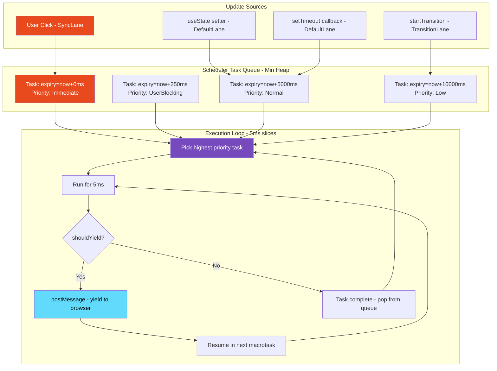

# 08 · The React Scheduler

> **The React Scheduler is a cooperative multitasking system built entirely in JavaScript. It gives React the ability to pause rendering work, yield control to the browser, prioritize urgent updates over non-urgent ones, and resume interrupted work — all without any native OS-level threading or browser API for true concurrency.**

JavaScript is single-threaded. There is one call stack, one heap, and one event loop. React runs on that single thread alongside your application code, browser rendering, and everything else. The Scheduler exists to answer a fundamental question: given that React cannot run in a separate thread, how can it render large component trees without freezing the UI?

The answer is cooperative scheduling — React voluntarily yields control of the thread at regular intervals, letting the browser paint frames and process user input between chunks of rendering work.

---

## Table of Contents

- [The Problem: JavaScript is Single-Threaded](#the-problem-javascript-is-single-threaded)
- [What the Scheduler Actually Is](#what-the-scheduler-actually-is)
- [The Priority System: Lanes](#the-priority-system-lanes)
- [Task Scheduling: How Work Gets Queued](#task-scheduling-how-work-gets-queued)
- [Time Slicing: The 5ms Budget](#time-slicing-the-5ms-budget)
- [MessageChannel: The Yield Mechanism](#messagechannel-the-yield-mechanism)
- [The Scheduler's Task Queue](#the-schedulers-task-queue)
- [How Scheduler Interacts with the Work Loop](#how-scheduler-interacts-with-the-work-loop)
- [Priority Inversion and Starvation](#priority-inversion-and-starvation)
- [Scheduler in Synchronous Mode](#scheduler-in-synchronous-mode)
- [requestIdleCallback: Why React Doesn't Use It](#requestidlecallback-why-react-doesnt-use-it)
- [Lane Model: The Update Priority System](#lane-model-the-update-priority-system)
- [Scheduling in Practice: startTransition](#scheduling-in-practice-starttransition)
- [Architecture Diagrams](#architecture-diagrams)
- [Good Practices](#good-practices)
- [Bad Practices](#bad-practices)
- [Mental Model](#mental-model)
- [Common Mistakes](#common-mistakes)
- [Exercises](#exercises)
- [Further Reading](#further-reading)

---

## The Problem: JavaScript is Single-Threaded

Before understanding the Scheduler, you need to feel the problem it solves.

The browser's main thread handles everything:

- Executing JavaScript
- Parsing HTML and CSS
- Computing styles
- Performing layout (reflow)
- Painting pixels
- Compositing layers
- Processing user input (clicks, keystrokes, scroll)

Every 16.67 milliseconds, the browser needs to produce a new frame to maintain 60fps. If any task on the main thread takes longer than 16.67ms, a frame is dropped. If it takes longer than 100ms, users perceive the interface as unresponsive.

### The pre-Fiber problem

React's original stack reconciler was a single recursive function call:

```js
// Stack reconciler (pre-2016) — simplified
function reconcile(component) {
  component.render();
  component.children.forEach((child) => reconcile(child)); // recursive, unstoppable
}

// For a tree of 1000 components, each taking 0.1ms:
// Total: 100ms of uninterruptible JavaScript
// During those 100ms:
// - User clicks are ignored
// - Scroll events are queued but not processed
// - Browser cannot paint any frames
// - UI appears completely frozen
```

This was not a hypothetical — large React applications in 2015-2016 had measurable input lag and jank during heavy state updates. The Fiber rewrite and the Scheduler were the solution.

### The Scheduler's answer

Break rendering work into small units. After each unit, check:

1. Has the time budget been exceeded? (5ms default)
2. Is there higher-priority work waiting?

If yes to either: stop, yield to the browser, resume later.

```js
// Work loop with yielding — the Scheduler's core mechanism
function workLoop() {
  while (currentTask !== null && !shouldYield()) {
    const task = currentTask;
    task.callback(); // process one unit of work
    advanceToNextTask();
  }

  if (currentTask !== null) {
    // More work to do, but we yielded
    // Schedule a continuation via MessageChannel
    scheduleHostCallback(workLoop);
    return true; // signals: more work pending
  }

  return false; // signals: all work complete
}
```

---

## What the Scheduler Actually Is

The Scheduler (`@react/scheduler`) is a **separate package** from React. It is not specific to React — it is a general-purpose priority task queue for JavaScript. React uses it, but it could theoretically be used by any JavaScript application that needs cooperative multitasking.

The Scheduler provides two things:

### 1. A priority queue of tasks

Tasks are scheduled with a priority level. The Scheduler always processes the highest-priority task first. Within the same priority level, tasks are processed in FIFO order.

### 2. A time-sliced execution loop

The Scheduler processes tasks in 5ms chunks. After each chunk, it yields to the browser and schedules the next chunk via `MessageChannel`.

```js
// The Scheduler's public API (what React uses)
import {
  scheduleCallback, // schedule a task with a priority
  cancelCallback, // cancel a scheduled task
  shouldYield, // should the current task yield?
  getCurrentPriorityLevel, // what priority is currently executing?
  NoPriority,
  ImmediatePriority,
  UserBlockingPriority,
  NormalPriority,
  LowPriority,
  IdlePriority,
} from "scheduler";

// React schedules rendering work like this:
scheduleCallback(
  NormalPriority, // priority level
  performConcurrentWorkOnRoot.bind(null, root), // the work to do
);
```

> 🔬 **Internals:** The Scheduler package is published separately as `scheduler` on npm. React 18 uses it internally but does not expose it as a public API. The Scheduler has gone through multiple iterations — early versions used `requestAnimationFrame` + `postMessage`, then `MessageChannel` alone, with ongoing experimentation. The current implementation is optimized for the specific patterns React needs.

---

## The Priority System: Lanes

React uses two interrelated priority systems: **Scheduler priorities** (for the Scheduler package) and **Lanes** (for React's internal reconciler). They map to each other but serve different purposes.

### Scheduler Priorities

The Scheduler has 5 priority levels:

| Priority | Name                   | Timeout            | Use Case                                          |
| -------- | ---------------------- | ------------------ | ------------------------------------------------- |
| 1        | `ImmediatePriority`    | -1ms (synchronous) | Discrete user input: click, keypress, form submit |
| 2        | `UserBlockingPriority` | 250ms              | Continuous input: hover, scroll, drag             |
| 3        | `NormalPriority`       | 5000ms             | Default state updates, data fetching              |
| 4        | `LowPriority`          | 10000ms            | Prefetching, pre-rendering                        |
| 5        | `IdlePriority`         | Never expires      | Offscreen work, analytics                         |

The **timeout** is the maximum time a task can wait before it becomes "overdue." Overdue tasks are elevated — they must run before lower-priority work, even if they exceed their time slice.

### React's Lane Model

Lanes are React's internal priority system, built on top of Scheduler priorities. Lanes are represented as 31-bit integers (bitmasks), which makes combining and testing multiple lanes extremely fast:

```js
// From ReactFiberLane.js — actual lane constants
export const NoLanes = 0b0000000000000000000000000000000;
export const NoLane = 0b0000000000000000000000000000000;
export const SyncHydrationLane = 0b0000000000000000000000000000001;
export const SyncLane = 0b0000000000000000000000000000010; // highest priority
export const InputContinuousHydrationLane = 0b0000000000000000000000000000100;
export const InputContinuousLane = 0b0000000000000000000000000001000;
export const DefaultHydrationLane = 0b0000000000000000000000000010000;
export const DefaultLane = 0b0000000000000000000000000100000;
export const SyncUpdateLanes =
  SyncLane | InputContinuousHydrationLane | InputContinuousLane;
export const TransitionHydrationLane = 0b0000000000000000000000001000000;
export const TransitionLanes = 0b0000000001111111111111110000000; // 16 transition lanes
export const RetryLanes = 0b0000111110000000000000000000000;
export const OffscreenLane = 0b1000000000000000000000000000000; // lowest priority
```

### Why bitmasks for lanes?

Using bitmasks allows React to perform lane operations in O(1) with bitwise operators:

```js
// Check if a fiber has work in a specific set of lanes
function includesSomeLane(a, b) {
  return (a & b) !== NoLanes; // bitwise AND
}

// Merge two sets of lanes
function mergeLanes(a, b) {
  return a | b; // bitwise OR
}

// Remove a lane from a set
function removeLanes(set, subset) {
  return set & ~subset; // bitwise AND NOT
}

// Get the highest priority lane from a set
function getHighestPriorityLane(lanes) {
  return lanes & -lanes; // isolate the lowest set bit
}

// Example: Does this fiber have work in SyncLane or InputContinuousLane?
const hasSyncWork = includesSomeLane(
  fiber.lanes,
  SyncLane | InputContinuousLane,
); // Single instruction — no loops, no array iteration
```

> 🔬 **Internals:** The 16 `TransitionLanes` (not just one) exist to support **lane entanglement** — when multiple transitions are in-flight simultaneously, React can track them independently and commit them in order without confusion. Each `startTransition` call gets its own lane from the pool. When a transition lane is committed, it is released back to the pool for reuse.

---

## Task Scheduling: How Work Gets Queued

When React needs to render (triggered by `setState`, context updates, etc.), it calls `scheduleUpdateOnFiber`. This function determines the priority and either renders synchronously or schedules with the Scheduler:

```js
// Simplified: how a state update becomes scheduled work
function scheduleUpdateOnFiber(root, fiber, lane) {
  // Propagate the lane up to the root (updating childLanes on ancestors)
  markRootUpdated(root, lane);

  // Decide how to process this update
  if (lane === SyncLane) {
    // Highest priority: render synchronously
    // (this is what happens for discrete user events like clicks)
    if (executionContext === NoContext) {
      // Not inside a React batch — flush immediately
      performSyncWorkOnRoot(root);
    } else {
      // Inside a batch (e.g., inside React event handler) — defer to batch end
      ensureRootIsScheduled(root);
    }
  } else {
    // Lower priority: schedule with the Scheduler
    ensureRootIsScheduled(root);
  }
}

function ensureRootIsScheduled(root) {
  const nextLanes = getNextLanes(root, root.pingedLanes | root.expiredLanes);
  const newCallbackPriority = getHighestPriorityLane(nextLanes);

  // Convert React lane priority to Scheduler priority
  let schedulerPriorityLevel;
  switch (lanesToEventPriority(nextLanes)) {
    case DiscreteEventPriority:
      schedulerPriorityLevel = ImmediatePriority;
      break;
    case ContinuousEventPriority:
      schedulerPriorityLevel = UserBlockingPriority;
      break;
    case DefaultEventPriority:
      schedulerPriorityLevel = NormalPriority;
      break;
    case IdleEventPriority:
      schedulerPriorityLevel = IdlePriority;
      break;
    default:
      schedulerPriorityLevel = NormalPriority;
  }

  // Schedule the rendering work
  const newCallbackNode = scheduleCallback(
    schedulerPriorityLevel,
    performConcurrentWorkOnRoot.bind(null, root),
  );

  root.callbackNode = newCallbackNode;
  root.callbackPriority = newCallbackPriority;
}
```

---

## Time Slicing: The 5ms Budget

The Scheduler allocates a **5ms time slice** to each task by default. After 5ms, `shouldYield()` returns `true` and the work loop stops, even if there is more work to do.

Why 5ms? At 60fps, each frame is 16.67ms. React aims to use no more than 5ms of each frame for rendering, leaving at least 11ms for:

- Browser style calculation
- Layout (reflow)
- Paint
- Composite
- Other JavaScript (input handlers, animations)

```js
// Simplified shouldYield implementation
let deadline = 0;

function shouldYield() {
  const currentTime = getCurrentTime(); // performance.now()
  return currentTime >= deadline;
}

// Called at the start of each time slice
function advanceTimers(currentTime) {
  deadline = currentTime + 5; // 5ms time slice
}
```

### What happens when shouldYield returns true

```js
function workLoopConcurrent() {
  while (workInProgress !== null && !shouldYield()) {
    performUnitOfWork(workInProgress);
  }
  // Loop exits because:
  // 1. workInProgress === null → render complete → proceed to commit
  // 2. shouldYield() === true → time exceeded → yield and resume later
}

// After workLoopConcurrent exits:
function renderRootConcurrent(root, lanes) {
  // ...
  const exitStatus = workLoopConcurrent();

  if (workInProgress !== null) {
    // We yielded — more work to do
    // Return a signal indicating the work is incomplete
    return RootInProgress;
  } else {
    // Work complete — proceed to commit
    return workInProgressRootExitStatus;
  }
}
```

When the work loop yields (`RootInProgress`), the Scheduler's `workLoop` resumes and finds the pending task. It schedules a continuation via `MessageChannel`, which runs in the next task after the browser has had a chance to process frames.

---

## MessageChannel: The Yield Mechanism

The Scheduler uses `MessageChannel` to schedule continuations between frames. This is a non-obvious but important implementation detail.

### Why not setTimeout(fn, 0)?

`setTimeout(fn, 0)` has a **minimum delay of 1ms** in most browsers, and in background tabs it is throttled to 1000ms. For React's 5ms time slices, a 1ms minimum delay means 20% overhead. For background tabs, it means rendering essentially stops.

### Why not requestAnimationFrame?

`requestAnimationFrame` fires once per animation frame — at 60fps that is 16.67ms intervals. React's time slices are 5ms. Using `rAF` would mean React can only start new work at most 60 times per second, even if each work unit takes only 1ms. This wastes potential throughput.

Also, `rAF` does not fire when the tab is in the background, which would prevent React from doing any background work.

### Why MessageChannel?

`MessageChannel.postMessage` schedules a **macrotask** — it goes into the task queue immediately, with no minimum delay, and is not throttled in background tabs. It fires as soon as the current task and any pending microtasks complete.

```js
// Simplified Scheduler yield mechanism
const channel = new MessageChannel();
const port = channel.port2;

// When the Scheduler needs to yield and resume:
channel.port1.onmessage = function () {
  // This runs as a macrotask — after browser has processed frames
  isMessageLoopRunning = true;
  try {
    const hasMoreWork = workLoop(getCurrentTime());
    if (hasMoreWork) {
      // More work — schedule another continuation
      port.postMessage(null);
    } else {
      isMessageLoopRunning = false;
    }
  } catch (error) {
    // Re-schedule even on error
    port.postMessage(null);
    throw error;
  }
};

function scheduleHostCallback(callback) {
  scheduledHostCallback = callback;
  if (!isMessageLoopRunning) {
    isMessageLoopRunning = true;
    port.postMessage(null); // trigger the macrotask
  }
}
```

### The task queue flow

```
React setState() called
       ↓
scheduleCallback(NormalPriority, workTask)
       ↓
Scheduler adds task to priority queue
       ↓
port.postMessage(null) → schedules macrotask
       ↓
[Current JavaScript task completes]
[Browser processes microtasks]
[Browser renders current frame if needed]
       ↓
MessageChannel message fires (macrotask)
       ↓
Scheduler workLoop starts
       ↓
performUnitOfWork × N (for 5ms)
       ↓
shouldYield() = true
       ↓
port.postMessage(null) → schedules next macrotask
       ↓
[Browser gets control again between tasks]
       ↓
Next MessageChannel message fires
       ↓
Continue rendering...
       ↓
Work complete → commitRoot()
```

> 🔬 **Internals:** Between each `MessageChannel` message, the browser runs the rendering pipeline if it needs to. This is the mechanism that makes 60fps possible during long renders — React renders for 5ms, yields via `MessageChannel`, browser paints a frame, React renders for another 5ms, and so on. The user sees smooth animations while React continues building the updated tree in the background.

---

## The Scheduler's Task Queue

The Scheduler maintains two queues — a **task queue** for tasks ready to run, and a **timer queue** for tasks scheduled to start in the future (delayed tasks):

```js
// Simplified data structures
// Min-heap sorted by expiration time (soonest expiration = highest priority)
let taskQueue = []; // tasks ready to run NOW
let timerQueue = []; // tasks scheduled to run in the FUTURE (via scheduleCallback with delay)

// A task object:
const task = {
  id: taskIdCounter++,
  callback: performConcurrentWorkOnRoot, // the work function
  priorityLevel: NormalPriority,
  startTime: currentTime, // when was it scheduled
  expirationTime: currentTime + 5000, // when does it expire (NormalPriority = 5 seconds)
  sortIndex: expirationTime, // used for heap ordering
};
```

### Min-heap ordering

The task queue is a **min-heap** sorted by `expirationTime`. The Scheduler always picks the task with the smallest `expirationTime` (i.e., the task that will expire soonest):

```js
// The Scheduler's peek function — O(1): top of the heap
function peek(heap) {
  return heap.length === 0 ? null : heap[0];
}

// The Scheduler's pop function — O(log n): remove from heap and rebalance
function pop(heap) {
  const first = heap[0];
  const last = heap.pop();
  if (last !== first) {
    heap[0] = last;
    siftDown(heap, last, 0); // rebalance the heap
  }
  return first;
}

// The Scheduler's push function — O(log n): add and bubble up
function push(heap, node) {
  const index = heap.length;
  heap.push(node);
  siftUp(heap, node, index); // bubble up to correct position
}
```

> 🔬 **Internals:** Using a min-heap instead of a sorted array gives O(log n) insertion and O(1) access to the highest-priority task. For React applications with many simultaneous updates (common in data-heavy apps), this is significantly faster than maintaining a sorted array. The heap is re-sorted after every task completion.

### Task expiration and starvation prevention

Lower-priority tasks have longer timeouts before they expire. But they do eventually expire. When a task's expiration time passes, it becomes "overdue" and is treated as though it has `ImmediatePriority`:

```js
function advanceTimers(currentTime) {
  // Move tasks from timerQueue to taskQueue when their start time arrives
  let timer = peek(timerQueue);
  while (timer !== null) {
    if (timer.callback === null) {
      pop(timerQueue); // cancelled task
    } else if (timer.startTime <= currentTime) {
      pop(timerQueue);
      timer.sortIndex = timer.expirationTime;
      push(taskQueue, timer); // move to active queue
    } else {
      break; // timers are sorted — stop when we find one not ready
    }
    timer = peek(timerQueue);
  }
}
```

This prevents **starvation** — a scenario where low-priority tasks never run because high-priority work keeps arriving. Even the lowest priority `IdlePriority` task will eventually be promoted when its timeout expires.

---

## How Scheduler Interacts with the Work Loop

The Scheduler and React's work loop are connected through a callback:

```js
// React's concurrent work entry point — this is the callback the Scheduler calls
function performConcurrentWorkOnRoot(root) {
  // Before doing any work, check if there's synchronous work to do first
  const originalCallbackNode = root.callbackNode;

  // Determine which lanes to work on this time slice
  const lanes = getNextLanes(root, NoLanes);

  if (includesSomeLane(lanes, NonIdleLanes)) {
    // Do the render
    renderRootConcurrent(root, lanes);
  }

  // Check the result
  if (root.callbackNode === originalCallbackNode) {
    // Scheduler is asking: "do you have more work?"
    if (workInProgress !== null) {
      // Yield — return the same function as the continuation
      return performConcurrentWorkOnRoot.bind(null, root);
      // The Scheduler sees a non-null return → reschedules this callback
    }
  }

  // Work complete (or pre-empted by higher priority) — return null
  return null; // The Scheduler sees null → task is done
}
```

The key mechanism: **the callback returns itself** when there is more work. The Scheduler interprets a non-null return value as "this task has more work — reschedule it." This creates a continuation — the same task runs across multiple time slices.

---

## Priority Inversion and Starvation

### Priority inversion

Priority inversion occurs when a high-priority task cannot proceed because a low-priority task is holding a resource. In React's single-threaded model, this manifests differently — as a scenario where a low-priority render is in progress when a high-priority update arrives.

```
Low-priority render in progress (TransitionLane)
   ↓ processing fiber 47 of 500...
User clicks a button (SyncLane — highest priority)
   ↓
React's work loop checks shouldYield()
   ↓ shouldYield() = true (time slice exceeded OR higher priority work detected)
Abandon work-in-progress render
   ↓
Start synchronous render for the click handler
   ↓
Commit click handler result
   ↓
Restart the low-priority render from scratch
```

The low-priority render is discarded and restarted. This is intentional — user input must be processed immediately even if it means throwing away partially-completed work.

> 🔬 **Internals:** React detects that higher priority work has arrived through the `lanes` field on the root fiber. When a `SyncLane` update arrives, it is immediately processed (it bypasses the Scheduler entirely for the initial synchronous render). This pre-empts any in-progress concurrent render by checking `getNextLanes` at the start of each time slice.

### Starvation

Starvation is when a low-priority task never gets to run because high-priority work keeps arriving. React's Scheduler prevents starvation through task expiration — all tasks eventually expire and are elevated to run.

```tsx
// This scenario could theoretically cause starvation:
function RealTimeApp() {
  // High-priority updates firing 60x/second
  const [position, setPosition] = useState({ x: 0, y: 0 });

  // Low-priority transition update
  const [, startTransition] = useTransition();
  const [searchResults, setSearchResults] = useState([]);

  const handleMouseMove = (e: React.MouseEvent) => {
    setPosition({ x: e.clientX, y: e.clientY }); // SyncLane
    startTransition(() => {
      setSearchResults(computeNearbyItems(e.clientX, e.clientY)); // TransitionLane
    });
  };
}
// If mouse moves continuously, does the transition ever commit?
// Yes — eventually the transition's expiration time passes and it is promoted.
// React guarantees all updates eventually commit.
```

---

## Scheduler in Synchronous Mode

Not all React rendering goes through the Scheduler. Synchronous updates bypass the Scheduler's time-slicing and run to completion without yielding:

```js
// Synchronous work loop — no shouldYield check
function workLoopSync() {
  while (workInProgress !== null) {
    performUnitOfWork(workInProgress); // process ALL fibers without checking time
  }
}
```

This runs for:

- Discrete user events (clicks, keypresses) — always synchronous
- `ReactDOM.flushSync()` — forces synchronous rendering
- Initial render in legacy mode
- `useLayoutEffect` setState calls — synchronous re-renders

```tsx
// flushSync: bypasses Scheduler, renders synchronously immediately
import { flushSync } from "react-dom";

function handlePrint() {
  // Need the DOM to be updated before window.print() is called
  flushSync(() => {
    setIsPrintMode(true); // renders synchronously right here
  });
  window.print(); // DOM is already updated — correct print layout
}
```

> ⚠️ **Anti-Pattern:** Overusing `flushSync`. Every `flushSync` call forces a synchronous render + commit, blocking the thread until complete. If called inside an event handler that fires frequently (scroll, mousemove), it defeats the entire purpose of concurrent rendering and causes jank.

---

## requestIdleCallback: Why React Doesn't Use It

`requestIdleCallback` (rIC) is a browser API that fires a callback when the main thread is idle — when the browser has finished its current frame's work and has spare time. It seems like the perfect API for background rendering work.

React experimented with `rIC` and ultimately rejected it for several reasons:

### 1. Insufficient browser support

`rIC` is not available in Safari (as of 2024 — WebKit has been slow to implement it). A polyfill is needed in all environments.

### 2. Too infrequent

`rIC` fires at most once per frame — 60 times per second. React's Scheduler fires after every 5ms time slice, potentially multiple times per frame if work is available. This higher frequency gives React more throughput.

### 3. Idle time is unpredictable

`rIC` only fires when the browser considers itself idle. During heavy user interaction (fast scrolling, mouse movement), the browser may never be "idle," so `rIC` never fires and transitions never make progress.

### 4. Priority is all-or-nothing

`rIC` has a single priority level — "idle." React needs multiple priority levels for different types of work. Building that on top of `rIC` would require custom priority management anyway.

### 5. The deadline API is different

`rIC` provides a `deadline` object with a `timeRemaining()` method that returns how much idle time is left. This is great for the idle case but does not work for non-idle high-priority work. React's `shouldYield` needs to work for all priority levels.

React's custom Scheduler gives it full control over timing, priority, and the yield mechanism — at the cost of being more complex than using a native browser API.

---

## Lane Model: The Update Priority System

Lanes are the mechanism by which React tracks which updates are pending, which are in progress, and which have been committed. Every state update is stamped with a lane.

### How lanes are assigned

```js
// When setState is called, React determines the current event priority
// and assigns the corresponding lane
function requestUpdateLane(fiber) {
  // Check if we're inside an event handler
  const updateLane = getCurrentUpdatePriority();
  if (updateLane !== NoLane) {
    return updateLane;
  }

  // Check the current event type from React's event system
  const eventLane = getCurrentEventPriority();
  return eventLane;
}

// Event priority to lane mapping:
// Click, keypress, focus → SyncLane (highest)
// mousemove, scroll, wheel → InputContinuousLane
// setTimeout, fetch callback → DefaultLane
// startTransition → TransitionLane (lower)
// requestIdleCallback → IdleLane (lowest)
```

### Lane propagation up the tree

When a fiber receives an update, its lane is propagated upward — every ancestor's `childLanes` is updated to include the new lane. This lets React know which subtrees have pending work without scanning the entire tree:

```js
function markUpdateLaneFromFiberToRoot(sourceFiber, lane) {
  // Mark the source fiber
  sourceFiber.lanes = mergeLanes(sourceFiber.lanes, lane);

  // Walk up to root, updating childLanes
  let alternate = sourceFiber.alternate;
  if (alternate !== null) {
    alternate.lanes = mergeLanes(alternate.lanes, lane);
  }

  let node = sourceFiber.return; // parent
  while (node !== null) {
    node.childLanes = mergeLanes(node.childLanes, lane);
    if (node.alternate !== null) {
      node.alternate.childLanes = mergeLanes(node.alternate.childLanes, lane);
    }
    node = node.return; // keep going up
  }
}
```

---

## Scheduling in Practice: startTransition

`startTransition` is the primary user-facing API for interacting with the Scheduler's priority system. It marks a state update as non-urgent — allowing React to prioritize other work (like user input) over the transition.

```tsx
function SearchPage() {
  const [query, setQuery] = useState("");
  const [results, setResults] = useState<Result[]>([]);
  const [isPending, startTransition] = useTransition();

  const handleChange = (e: React.ChangeEvent<HTMLInputElement>) => {
    // Urgent: update the input immediately (SyncLane)
    setQuery(e.target.value);

    // Non-urgent: compute and render search results (TransitionLane)
    startTransition(() => {
      setResults(searchIndex(e.target.value));
    });
  };

  return (
    <>
      <input value={query} onChange={handleChange} />
      {isPending && <Spinner />}
      <ResultsList results={results} />
    </>
  );
}
```

### What startTransition does internally

```js
function startTransition(scope) {
  const prevTransition = ReactCurrentBatchConfig.transition;

  // Set the transition flag — any setState inside scope gets a TransitionLane
  ReactCurrentBatchConfig.transition = {};

  try {
    scope(); // your setState calls happen here — each gets TransitionLane
  } finally {
    ReactCurrentBatchConfig.transition = prevTransition; // restore
  }
}
```

When `setResults()` is called inside `scope`, `requestUpdateLane` sees `ReactCurrentBatchConfig.transition !== null` and assigns a `TransitionLane` instead of the default lane. This lane has lower priority — the Scheduler will process it after `SyncLane` and `InputContinuousLane` work is complete.

> 🏭 **Production Note:** `startTransition` is most valuable when: (1) the state update causes expensive re-rendering (large lists, complex charts), (2) the user interaction (typing, clicking) must feel instant, and (3) you can show a pending state (spinner, grayed-out results) while the transition renders. The three-part requirement is key — if your re-render is fast (< 16ms), `startTransition` adds no visible benefit.

---

## Architecture Diagrams

### Scheduler priority queue and time-slice execution



### Time slice visualization across browser frames

```mermaid
gantt
    title React Scheduler Time Slicing (60fps = 16.67ms per frame)
    dateFormat  X
    axisFormat  %Lms

    section Frame 1
    React render slice 1 (5ms)     :active, r1, 0, 5
    Browser style+layout+paint     :b1, 5, 11
    React render slice 2 (5ms)     :active, r2, 11, 16

    section Frame 2
    Browser composite              :b2, 16, 20
    React render slice 3 (5ms)     :active, r3, 20, 25
    User input processing          :u1, 25, 27
    React commit (sync)            :crit, c1, 27, 30

    section Frame 3
    Browser paint committed result :b3, 33, 38
    useEffect runs                 :e1, 38, 42
```



---

## Good Practices

### ✅ Good Practice — Use startTransition for expensive non-urgent updates

```tsx
/**
 * Good: Separates urgent UI feedback (input update) from
 * expensive non-urgent work (filtering 10,000 items).
 * The input stays responsive while filtering happens in the background.
 */
function FilterableList({ items }: { items: Item[] }) {
  const [filterText, setFilterText] = useState("");
  const [filteredItems, setFilteredItems] = useState(items);
  const [isPending, startTransition] = useTransition();

  const handleFilterChange = (e: React.ChangeEvent<HTMLInputElement>) => {
    const value = e.target.value;

    // Urgent: update input immediately — user must see their keystrokes
    setFilterText(value);

    // Non-urgent: filter the list — can wait if user keeps typing
    startTransition(() => {
      setFilteredItems(
        items.filter((item) =>
          item.name.toLowerCase().includes(value.toLowerCase()),
        ),
      );
    });
  };

  return (
    <div>
      <input
        value={filterText}
        onChange={handleFilterChange}
        placeholder="Filter items..."
      />
      {isPending && <span>Filtering...</span>}
      <ul style={{ opacity: isPending ? 0.7 : 1 }}>
        {filteredItems.map((item) => (
          <li key={item.id}>{item.name}</li>
        ))}
      </ul>
    </div>
  );
}
```

**Why this works:** The Scheduler gives `setFilterText` a `SyncLane` (discrete user input). The input updates immediately. `startTransition` gives `setFilteredItems` a `TransitionLane` — lower priority. If the user keeps typing, each new keystroke pre-empts the in-progress filter render, discards it, and starts a new filter render for the latest query. The list only fully re-renders when the user pauses typing.

---

## Bad Practices

### ⚠️ Bad Practice — Long synchronous tasks blocking the Scheduler

```tsx
/**
 * Bad: Heavy computation runs synchronously during the render phase.
 * The Scheduler cannot yield during a single component's render —
 * it can only yield BETWEEN component renders.
 * One slow component blocks the entire thread.
 */
function DataGrid({ rows }: { rows: Row[] }) {
  // ❌ 50ms synchronous computation inside render
  // The Scheduler yielded to run this component, but now it can't
  // yield again until this component function returns.
  const processedRows = rows
    .map((row) => expensiveTransform(row)) // O(n) expensive
    .filter((row) => complexValidation(row)) // O(n) expensive
    .sort((a, b) => multiKeySort(a, b)); // O(n log n) expensive
  // Even if shouldYield() is true, we can't stop here.
  // This entire computation runs to completion before the Scheduler
  // can yield to the browser.

  return (
    <table>
      {processedRows.map((row) => (
        <Row key={row.id} data={row} />
      ))}
    </table>
  );
}

/**
 * ✅ Better: Move expensive computation outside render
 * Use useMemo to prevent re-computation, or
 * use a Web Worker for truly heavy computation
 */
function DataGrid({ rows }: { rows: Row[] }) {
  // useMemo prevents recomputation when rows hasn't changed
  const processedRows = useMemo(() => {
    return rows
      .map((row) => expensiveTransform(row))
      .filter((row) => complexValidation(row))
      .sort((a, b) => multiKeySort(a, b));
  }, [rows]);

  return (
    <table>
      {processedRows.map((row) => (
        <Row key={row.id} data={row} />
      ))}
    </table>
  );
}
```

**Production impact:** A component that takes 50ms to render blocks the Scheduler from yielding for 50ms. During those 50ms, no user input is processed and no frames are painted. Users experience a 50ms freeze on every render of this component. `useMemo` helps by avoiding recomputation when props haven't changed, but if the computation genuinely needs to run frequently with large data, a Web Worker is the correct solution.

---

## Mental Model

> 💡 **The Scheduler mental model:**
>
> Imagine a restaurant kitchen with one chef (the JavaScript thread) and many orders (React updates). The Scheduler is the head chef who manages the order queue. Urgent orders (user clicks) jump to the front of the queue. Regular orders (state updates) wait their turn. The head chef works on one order for 5 minutes (5ms), then checks the queue — if a more urgent order arrived, they put the current order on hold and start the urgent one. Regular orders that have been waiting long enough get priority before they go cold (expiration). The chef never works for more than 5 minutes without checking the queue, so urgent orders are always handled quickly. Your job as an engineer is to avoid writing 30-minute recipes (expensive render work) that force the chef to ignore the queue for too long.

---

## Common Mistakes

### Putting expensive synchronous work inside component functions

The Scheduler yields between fiber units — not within a single component's render. A component that takes 50ms to render blocks the Scheduler for 50ms regardless of `startTransition` or other priority settings.

### Using flushSync unnecessarily

`flushSync` bypasses the Scheduler and forces synchronous rendering. Use it only when you genuinely need DOM updates to be synchronous before your next line of code executes (e.g., before calling `window.print()`).

### Expecting startTransition to make slow renders fast

`startTransition` changes _priority_ — not _speed_. A slow render inside a transition is still slow; it just does not block urgent work. For truly fast renders, optimize the render itself (memoization, virtualization, code splitting).

### Not providing isPending feedback

When using `useTransition`, the `isPending` flag is true while the transition is in progress. Not using it means users see no feedback during potentially long background renders — the UI appears frozen even though it is not.

---

## Exercises

### Exercise 1 — Observe the Scheduler in DevTools

Open Chrome DevTools → Performance tab. Record while rapidly typing in a search input with `startTransition`. In the flame graph, look for:

- Short bursts of React rendering work separated by browser frame boundaries
- The `MessageChannel` tasks (look for `onmessage` handlers)
- How user input tasks pre-empt React rendering tasks

### Exercise 2 — Measure transition impact

Build a list of 5,000 items that filters on input. Measure:

1. Without `startTransition`: input lag (time between keypress and character appearing)
2. With `startTransition`: same measurement
   Use `performance.mark()` and `performance.measure()` to get precise numbers.

### Exercise 3 — Lane assignment

Add temporary logging to understand lane assignment:

```tsx
function useTrackLane(label: string) {
  const renderCount = useRef(0);
  renderCount.current++;

  // Read the current scheduler priority from the React DevTools hook
  // or observe timing differences between transition and non-transition renders
  console.log(
    `${label} render #${renderCount.current} at ${performance.now().toFixed(2)}ms`,
  );
}
```

Observe how quickly transition renders run vs synchronous renders by comparing timestamps.

---

## Further Reading

- [React Source: scheduler/src/Scheduler.js](https://github.com/facebook/react/blob/main/packages/scheduler/src/forks/Scheduler.js) — The full Scheduler implementation
- [React Source: ReactFiberLane.js](https://github.com/facebook/react/blob/main/packages/react-reconciler/src/ReactFiberLane.js) — The lane bitmask constants and operations
- [React Source: ReactFiberWorkLoop.js — ensureRootIsScheduled](https://github.com/facebook/react/blob/main/packages/react-reconciler/src/ReactFiberWorkLoop.js) — How React interacts with the Scheduler
- [React RFC: Scheduler](https://github.com/facebook/react/blob/main/packages/scheduler/README.md) — Design notes
- [Lin Clark: A Cartoon Intro to Fiber](https://www.youtube.com/watch?v=ZCuYPiUIONs) — Visual explanation of cooperative scheduling
- [WHATWG: Event loop](https://html.spec.whatwg.org/multipage/webappapis.html#event-loops) — The browser event loop spec that the Scheduler works within
- Next in this handbook: [09 · Batching & Update Queues](./04-batching.md)

---

_Part of the [React + Next.js Engineering Handbook](../../README.md)_
