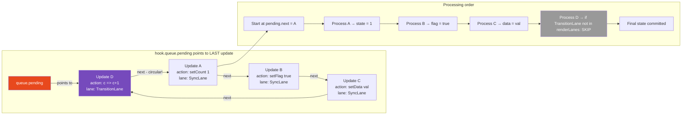
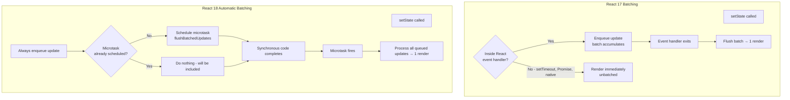
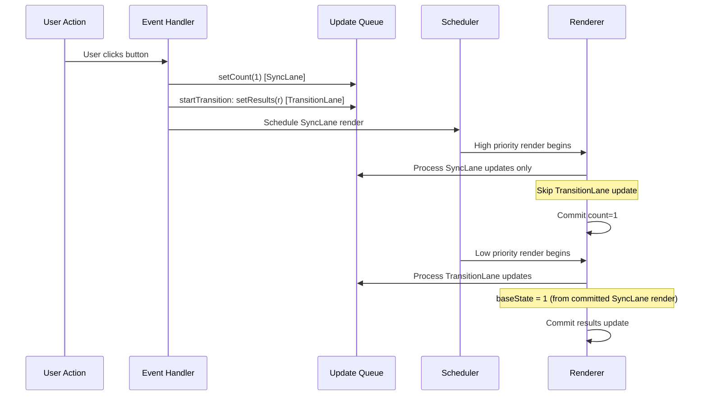

# 09 · Batching & Update Queues

> **Batching is React's mechanism for collecting multiple state updates that occur in the same synchronous execution context and processing them in a single render cycle. Without batching, every individual `setState` call would trigger its own render — producing incorrect intermediate UI states and destroying performance. With batching, React renders once per logical user action, always producing a consistent UI.**

Batching is one of those features that is so fundamental you rarely notice it — until it breaks. Understanding exactly when batching happens, how update queues work internally, and when React renders once versus many times is essential knowledge for debugging state update bugs and reasoning about render count.

---

## Table of Contents

- [What Batching Is and Why It Exists](#what-batching-is-and-why-it-exists)
- [The Update Queue Internals](#the-update-queue-internals)
- [How setState Enqueues an Update](#how-setstate-enqueues-an-update)
- [Batching in React 17 and Earlier](#batching-in-react-17-and-earlier)
- [Automatic Batching in React 18](#automatic-batching-in-react-18)
- [How Automatic Batching Works Internally](#how-automatic-batching-works-internally)
- [Opting Out: flushSync](#opting-out-flushsync)
- [Update Queue Processing](#update-queue-processing)
- [The Updater Function Pattern](#the-updater-function-pattern)
- [Batching with useReducer](#batching-with-usereducer)
- [Batching and Concurrent React](#batching-and-concurrent-react)
- [State Update Ordering Guarantees](#state-update-ordering-guarantees)
- [Architecture Diagrams](#architecture-diagrams)
- [Good Practices](#good-practices)
- [Bad Practices](#bad-practices)
- [Mental Model](#mental-model)
- [Common Mistakes](#common-mistakes)
- [Exercises](#exercises)
- [Further Reading](#further-reading)

---

## What Batching Is and Why It Exists

Batching is the practice of collecting multiple state updates and processing them together in a single render, rather than processing each one individually.

### The problem without batching

Imagine a form submission handler that updates three pieces of state:

```tsx
function handleSubmit() {
  setIsLoading(true); // would trigger render #1
  setError(null); // would trigger render #2
  setData(formValues); // would trigger render #3
}
```

Without batching, React would render three times:

- **Render #1:** `isLoading=true`, `error=previousError`, `data=previousData` — incorrect intermediate state
- **Render #2:** `isLoading=true`, `error=null`, `data=previousData` — another incorrect intermediate state
- **Render #3:** `isLoading=true`, `error=null`, `data=formValues` — correct final state

The user might see the intermediate states briefly, producing visual glitches. Two extra renders also means two extra reconciliation cycles, two extra DOM diffing passes, and potentially two extra browser paints.

With batching, React collects all three updates, processes them together in a single render, and produces the correct final state in one commit:

- **Render #1 (the only render):** `isLoading=true`, `error=null`, `data=formValues` — correct

### Batching is also a correctness guarantee

Beyond performance, batching ensures that React always renders a **consistent state** — a state that actually exists in your application model. The intermediate state `{ isLoading: true, error: "previous error", data: undefined }` is a state your application never intended to exist. Batching prevents React from rendering states that are transient artifacts of imperative update ordering.

---

## The Update Queue Internals

Every fiber that uses `useState` or `useReducer` has an **update queue** associated with each hook. The update queue is a circular singly-linked list of update objects.

```js
// The shape of an update object (from ReactFiberHooks.js)
const update = {
  lane: SyncLane, // priority at which this update was scheduled
  action: newValue, // the new value OR an updater function (v => v + 1)
  hasEagerState: false, // optimization: was the state pre-computed?
  eagerState: null, // the pre-computed state (if hasEagerState)
  next: update, // pointer to next update — circular!
};

// The queue object on the hook's memoizedState
const queue = {
  pending: update, // the LAST update in the circular list
  // pending.next = FIRST update
  dispatch: boundDispatch, // the setState function bound to this hook
  lastRenderedReducer: basicStateReducer, // for useState
  lastRenderedState: currentState, // for eager state optimization
};
```

### Why circular linked list?

The queue is **circular** so that you can access both the first and last element in O(1) without tracking two pointers:

```js
// Add to the circular list:
// queue.pending always points to the LAST update
// queue.pending.next always points to the FIRST update

function enqueueUpdate(queue, update) {
  const pending = queue.pending;
  if (pending === null) {
    // First update: create a cycle with itself
    update.next = update;
  } else {
    // Append: insert between current last and current first
    update.next = pending.next; // new update's next = old first
    pending.next = update; // old last's next = new update
  }
  queue.pending = update; // new update becomes the last
}

// To iterate: start at pending.next (first), stop when you reach pending (last)
function processUpdateQueue(queue) {
  const first = queue.pending.next; // first update
  let update = first;
  do {
    processUpdate(update);
    update = update.next;
  } while (update !== first); // circular — stop when we wrap around
}
```

> 🔬 **Internals:** The circular linked list is a classic CS optimization for a queue where you frequently append to the end and iterate from the beginning. With a standard linked list, you either track both head and tail (two pointers, extra complexity) or appending is O(n). With a circular list, the single `pending` pointer gives O(1) access to both head (`pending.next`) and tail (`pending`), and O(1) append.

---

## How setState Enqueues an Update

When you call the `setState` function returned by `useState`, several things happen:

```js
// The dispatch function returned by useState — simplified
function dispatchSetState(fiber, queue, action) {
  // 1. Determine the priority lane for this update
  const lane = requestUpdateLane(fiber);

  // 2. Create the update object
  const update = {
    lane,
    action, // new value or updater function
    hasEagerState: false,
    eagerState: null,
    next: null,
  };

  // 3. Eager state optimization:
  // If there are no pending updates and we're not currently rendering,
  // pre-compute the new state immediately to check if it changed.
  if (isRenderPhaseUpdate(fiber)) {
    // Called during render — handle as a render-phase update
    didScheduleRenderPhaseUpdate = true;
  } else {
    // 4. Try eager state evaluation (optimization)
    const currentState = queue.lastRenderedState;
    const eagerState = queue.lastRenderedReducer(currentState, action);
    update.hasEagerState = true;
    update.eagerState = eagerState;

    if (Object.is(eagerState, currentState)) {
      // New state is identical to current state — bail out early!
      // No render needed at all.
      enqueueUpdate(fiber, queue, update, lane);
      return; // ← EARLY RETURN: skip scheduling a render
    }
  }

  // 5. Append update to the hook's queue
  enqueueUpdate(fiber, queue, update, lane);

  // 6. Schedule a render via the Scheduler
  scheduleUpdateOnFiber(fiber, lane, eventTime);
}
```

### The eager state optimization

Step 4 is a critical optimization. Before scheduling a render, React tries to compute the new state immediately and compares it with the current state using `Object.is`. If they are equal, React skips scheduling a render entirely.

```tsx
const [count, setCount] = useState(5);

// This triggers a render:
setCount(6); // eagerState = 6, currentState = 5, 6 !== 5 → render

// This does NOT trigger a render (eager state optimization):
setCount(5); // eagerState = 5, currentState = 5, Object.is(5, 5) = true → bail out

// This DOES trigger a render (object reference):
setCount({ value: 5 }); // eagerState = {value:5}, currentState = {value:5}
// Object.is({value:5}, {value:5}) = false → different references → render
// Even if deeply equal, reference inequality triggers a render
```

> 🔬 **Internals:** The eager state optimization only applies when the queue has no pending updates (`queue.pending === null`). If there are already pending updates (e.g., we're inside an event handler that has already called setState once), the optimization is skipped — the new state must be computed as part of the full update queue processing during render, where earlier updates in the queue affect the final state.

---

## Batching in React 17 and Earlier

In React 17 and earlier, batching only happened **inside React event handlers**. Any state updates outside of React's event handling system were not batched:

```tsx
// React 17 batching behavior

// ✅ BATCHED: inside a React event handler (onClick, onChange, etc.)
function handleClick() {
  setCount((c) => c + 1); // update 1
  setFlag(true); // update 2
  // React batches both → 1 render
}

// ❌ NOT BATCHED in React 17: inside setTimeout
function handleClick() {
  setTimeout(() => {
    setCount((c) => c + 1); // render #1 ← immediately after this
    setFlag(true); // render #2 ← immediately after this
    // 2 separate renders — potentially shows intermediate state
  }, 0);
}

// ❌ NOT BATCHED in React 17: inside a Promise callback
async function handleClick() {
  const data = await fetchData();
  setData(data); // render #1
  setLoading(false); // render #2
  // 2 separate renders
}

// ❌ NOT BATCHED in React 17: inside a native event listener
document.addEventListener("click", () => {
  setCount((c) => c + 1); // render #1
  setFlag(true); // render #2
});
```

### Why React 17 couldn't batch outside event handlers

React 17 used the **execution context** to track when it was inside an event handler. When `setState` was called, React checked `executionContext`:

```js
// Simplified React 17 batching check
function scheduleUpdateOnFiber(fiber, lane) {
  if (executionContext !== NoContext) {
    // Inside a React event handler — batch it
    // (don't render yet, just enqueue the update)
    markUpdateLaneFromFiberToRoot(fiber, lane);
    return;
  }

  // NOT inside a React event handler — render immediately (unbatched)
  performSyncWorkOnRoot(fiber.stateNode);
}
```

The `executionContext` was set when React's event handling system entered and cleared when it exited. `setTimeout`, Promise callbacks, and native event listeners ran outside that context.

---

## Automatic Batching in React 18

React 18 introduced **automatic batching** — all state updates are batched regardless of where they originate:

```tsx
// React 18 automatic batching — ALL of these are batched

// ✅ Still batched: React event handlers
function handleClick() {
  setCount((c) => c + 1);
  setFlag(true);
  // 1 render (same as before)
}

// ✅ NOW ALSO BATCHED: setTimeout
setTimeout(() => {
  setCount((c) => c + 1);
  setFlag(true);
  // 1 render (new in React 18)
}, 0);

// ✅ NOW ALSO BATCHED: Promise callbacks
async function handleClick() {
  const data = await fetchData();
  setData(data);
  setLoading(false);
  // 1 render (new in React 18)
}

// ✅ NOW ALSO BATCHED: native event listeners
document.addEventListener("click", () => {
  setCount((c) => c + 1);
  setFlag(true);
  // 1 render (new in React 18)
});
```

> 🔬 **Internals:** Automatic batching works differently from React 17's batching. React 18 does not rely on a React-controlled execution context. Instead, it uses the Scheduler's **microtask batching** — when a state update is scheduled, React queues a microtask (via `queueMicrotask` or `Promise.resolve().then()`) to process the batch. Any subsequent `setState` calls in the same synchronous code add to the pending batch. When the microtask fires (after all synchronous code completes), React processes the entire accumulated batch in one render.

---

## How Automatic Batching Works Internally

```js
// Simplified: React 18 batching mechanism
let isBatchingUpdates = false;
let pendingBatch = [];

function dispatchSetState(fiber, queue, action) {
  // Add this update to the fiber's queue
  enqueueUpdate(fiber, queue, action);
  pendingBatch.push(fiber);

  if (!isBatchingUpdates) {
    isBatchingUpdates = true;
    // Schedule a microtask to flush the batch
    queueMicrotask(flushBatchedUpdates);
    // Alternative: Promise.resolve().then(flushBatchedUpdates)
  }
  // If isBatchingUpdates = true, this update just gets added to the batch
  // flushBatchedUpdates will process all of them together
}

function flushBatchedUpdates() {
  isBatchingUpdates = false;
  const batch = pendingBatch;
  pendingBatch = [];

  // Find all unique roots affected by this batch
  const roots = new Set(batch.map((fiber) => getFiberRoot(fiber)));

  // Render each affected root once
  roots.forEach((root) => {
    performSyncWorkOnRoot(root); // or performConcurrentWorkOnRoot for concurrent mode
  });
}
```

### The microtask timing detail

Microtasks run after the current synchronous task completes but before the browser's next task (no browser paint happens between them):

```
Synchronous code runs:
  setCount(c => c + 1)  → enqueues update, schedules microtask (first call)
  setFlag(true)         → enqueues update (microtask already scheduled)
  // ... more synchronous code

Current task ends
  ↓
Microtask queue drains:
  flushBatchedUpdates() → processes all pending updates → 1 render → 1 commit
  ↓
[Browser can now paint if DOM was mutated]
```

This is why React 18's automatic batching is more correct than React 17's manual batching — all synchronous state updates in any context are collected before any rendering happens.

---

## Opting Out: flushSync

Sometimes you genuinely need a state update to be applied immediately, before any subsequent code runs. `flushSync` forces React to render synchronously:

```tsx
import { flushSync } from "react-dom";

function handleClick() {
  // Force this update to render immediately
  flushSync(() => {
    setCount((c) => c + 1);
    // React renders synchronously here, before flushSync returns
  });

  // By here, the DOM reflects the new count
  // Safe to read DOM state that depends on the new count
  console.log(divRef.current.scrollHeight); // accurate

  // This update is in a separate flushSync call → separate render
  flushSync(() => {
    setFlag(true);
  });
}
```

### flushSync internal mechanism

```js
// Simplified flushSync
function flushSync(fn) {
  // Temporarily override batching behavior
  const prevExecutionContext = executionContext;
  executionContext |= BatchedContext;

  try {
    // Run the callback — state updates inside are enqueued
    fn();
  } finally {
    executionContext = prevExecutionContext;
    // Immediately flush all pending work synchronously
    flushSyncCallbacks();
  }
  // When flushSync returns, the DOM reflects the new state
}
```

> ⚠️ **Anti-Pattern:** Using `flushSync` inside loops or event handlers that fire frequently. Each `flushSync` call is a synchronous render + commit. Calling it inside a `scroll` event handler (60+ times per second) means 60+ synchronous renders per second, destroying the entire benefit of React's batching and Scheduler. The browser cannot paint between `flushSync` calls within the same task, causing visual freezes.

### When flushSync is appropriate

```tsx
// ✅ Legitimate use: need DOM updated before window.print()
function handlePrint() {
  flushSync(() => setShowPrintView(true));
  window.print(); // DOM must show print view before printing
}

// ✅ Legitimate use: need to measure DOM immediately after state change
function handleExpand() {
  flushSync(() => setIsExpanded(true));
  const height = panelRef.current.scrollHeight; // accurate measurement
  startAnimation(height); // animate to this height
}

// ✅ Legitimate use: third-party library that reads DOM after React update
function syncWithExternalLibrary() {
  flushSync(() => setData(newData));
  externalLibrary.update(containerRef.current); // reads DOM
}
```

---

## Update Queue Processing

During the render phase, React processes all accumulated updates in the queue to compute the final state. The updates are processed in order (FIFO), and each update can either provide a new value directly or a function that computes the new value from the current state:

```js
// Simplified: processUpdateQueue for useState
function processUpdateQueue(workInProgress, props, instance, renderLanes) {
  const queue = workInProgress.updateQueue;
  let pendingQueue = queue.pending;

  if (pendingQueue !== null) {
    queue.pending = null; // clear the queue

    // Start from the FIRST update (pending.next in circular list)
    const firstPendingUpdate = pendingQueue.next;
    let update = firstPendingUpdate;

    let newState = queue.baseState; // start from the last committed state

    do {
      const updateLane = update.lane;

      if (!isSubsetOfLanes(renderLanes, updateLane)) {
        // This update has a lower priority than what we're rendering
        // Skip it — it will be included in a future render
        // But save it to the base queue for next time
        newFirstBaseUpdate = cloneUpdate(update);
        if (newFirstBaseUpdate === null) newBaseState = newState;
      } else {
        // Process this update
        if (update.hasEagerState) {
          // Use the pre-computed eager state
          newState = update.eagerState;
        } else {
          // Apply the action
          const action = update.action;
          if (typeof action === "function") {
            newState = action(newState); // updater function: f(prevState) → newState
          } else {
            newState = action; // direct value replacement
          }
        }
      }

      update = update.next;
    } while (update !== null && update !== firstPendingUpdate);

    queue.baseState = newState;
    workInProgress.memoizedState = newState; // the new state to use in render
  }
}
```

### Priority-aware update processing

A critical insight: not all updates in the queue are processed in every render. If a low-priority update is in the queue when a high-priority render runs, that update is **skipped** for this render and saved for a future render:

```tsx
// Scenario: two updates at different priorities
const [value, setValue] = useState(0);

// User types in input (SyncLane — high priority)
setValue(1); // update A: lane = SyncLane

startTransition(() => {
  // Non-urgent computation (TransitionLane — lower priority)
  setValue(computeExpensiveValue()); // update B: lane = TransitionLane
});

// High-priority render (SyncLane):
// Queue: [A: lane=Sync, B: lane=Transition]
// Process: A is in renderLanes (Sync) → apply → newState = 1
//          B is NOT in renderLanes → skip, save for later
// Committed state: 1

// Low-priority render (TransitionLane) runs later:
// Queue: [B: lane=Transition] (A was cleared after commit)
// baseState: 1 (the committed state from the Sync render)
// Process: B is in renderLanes → apply f(1) → newState = result
// Committed state: result of computeExpensiveValue() applied to 1
```

> 🔬 **Internals:** This priority-based skipping is why **updater functions** (`setState(prev => prev + 1)`) are critical for correctness when updates from different priorities interact. If update A sets state to `1` (direct value) and update B's function is `prev => prev + 10`, the final state should be `11` (apply B starting from A's result). React achieves this through the `baseState` mechanism — when some updates are skipped in a high-priority render, the base state for the next render starts from the last fully-applied state, ensuring skipped updates see the correct previous state.

---

## The Updater Function Pattern

When state updates depend on the previous state, always use the updater function form:

```tsx
const [count, setCount] = useState(0);

// ❌ Stale closure — may use an old value of count
function incrementThreeTimes() {
  setCount(count + 1); // uses count from closure = 0 → state becomes 1
  setCount(count + 1); // uses count from closure = 0 → state becomes 1
  setCount(count + 1); // uses count from closure = 0 → state becomes 1
  // All three updates say "set to 1" — result is 1, not 3
}

// ✅ Updater function — always uses the latest queued state
function incrementThreeTimes() {
  setCount((c) => c + 1); // queued state = 0 → new state = 1
  setCount((c) => c + 1); // queued state = 1 → new state = 2
  setCount((c) => c + 1); // queued state = 2 → new state = 3
  // All three updaters chain — result is 3
}
```

### How updater functions chain in the queue

```js
// Queue after incrementThreeTimes():
// pending: { action: c => c+1, next: { action: c => c+1, next: { action: c => c+1, next: [circular] }}}

// During processUpdateQueue:
let newState = 0; // baseState

// Update 1: action is a function
newState = ((c) => c + 1)(newState); // newState = 1

// Update 2: action is a function
newState = ((c) => c + 1)(newState); // newState = 2

// Update 3: action is a function
newState = ((c) => c + 1)(newState); // newState = 3

// Final memoizedState = 3 ✓
```

### The rule: use updaters when the new state depends on the old state

```tsx
// These are safe as direct values — no dependency on previous state:
setIsLoading(true);
setError(null);
setActiveTab("settings");

// These MUST use updater functions — depend on previous state:
setCount((c) => c + 1); // depends on previous count
setItems((prev) => [...prev, newItem]); // depends on previous items
setMap((prev) => ({ ...prev, [key]: value })); // depends on previous map
```

---

## Batching with useReducer

`useReducer` is inherently batching-friendly. Because the reducer is a pure function that takes state and returns new state, multiple dispatches in the same batch produce a clear, deterministic result:

```tsx
const [state, dispatch] = useReducer(reducer, initialState);

// Multiple dispatches — always batched in React 18
function handleFormSubmit(data: FormData) {
  dispatch({ type: "SET_LOADING", payload: true });
  dispatch({ type: "CLEAR_ERROR" });
  dispatch({ type: "SET_DATA", payload: data });
  // One render — all three actions applied in order
}

// The reducer processes all three in sequence:
// state → { loading: true, error: null, data: null } (after SET_LOADING)
// → { loading: true, error: null, data: null } (after CLEAR_ERROR — error was already null)
// → { loading: true, error: null, data: formData } (after SET_DATA)
// That final state is what gets committed
```

### useReducer vs multiple useState for related state

```tsx
// ❌ Multiple useState for related state — can desync
const [isLoading, setIsLoading] = useState(false);
const [error, setError] = useState<Error | null>(null);
const [data, setData] = useState<Data | null>(null);

// Even though these are batched in React 18, the state is three
// separate variables. Logic that depends on combinations
// (isLoading && !error && data) is correct only in the committed state,
// but if some renders slip through (due to concurrent features),
// intermediate combinations may be possible.

// ✅ useReducer for state that transitions together
type State =
  | { status: "idle" }
  | { status: "loading" }
  | { status: "error"; error: Error }
  | { status: "success"; data: Data };

const [state, dispatch] = useReducer(reducer, { status: "idle" });

// Only valid state combinations can exist — impossible states are impossible
// The reducer enforces the state machine transitions
```

> 🏭 **Production Note:** Using a discriminated union type (`{ status: 'idle' } | { status: 'loading' } | ...`) with `useReducer` eliminates an entire class of bugs: impossible state combinations. If you use three separate `useState` calls for `isLoading`, `error`, and `data`, there are 8 possible state combinations, many of which are impossible (`isLoading: true, error: Error, data: Data`). With a discriminated union, only valid combinations exist.

---

## Batching and Concurrent React

In React 18's concurrent mode, batching interacts with priorities in ways that require careful understanding:

### Batching within a priority level

Updates at the same priority level are always batched together:

```tsx
// All in TransitionLane — batched together
startTransition(() => {
  setFilter(newFilter); // TransitionLane
  setPage(1); // TransitionLane
  setSortOrder("asc"); // TransitionLane
  // 1 render for all three
});
```

### Updates at different priority levels are NOT batched together

```tsx
function handleChange(value: string) {
  setInputValue(value); // SyncLane — rendered immediately

  startTransition(() => {
    setSearchResults(search(value)); // TransitionLane — rendered later
  });
  // Two separate renders: one for SyncLane, one for TransitionLane
  // But within each priority: only 1 render each
}
```

### Batching and `useDeferredValue`

`useDeferredValue` creates a "deferred" copy of a value that renders at a lower priority:

```tsx
function SearchPage() {
  const [query, setQuery] = useState("");
  const deferredQuery = useDeferredValue(query); // lower-priority copy

  // Urgent render: query updates immediately (SyncLane)
  // Deferred render: deferredQuery updates when React has time (DefaultLane or lower)
  // These are two separate renders — not batched together
}
```

---

## State Update Ordering Guarantees

React provides specific ordering guarantees that you can rely on:

### 1. Updates from the same event handler are always processed in order

```tsx
function handleClick() {
  setA(1); // processed first
  setB(2); // processed second, sees A=1 if using updater
  setC(3); // processed third
}
```

### 2. Batched updates all apply before re-render

No partial renders occur within a single synchronous batch. You either see the state before the batch or after the batch — never in the middle.

### 3. The committed state is always a valid state

React never commits a partial update. If rendering is interrupted (concurrent mode), the commit only happens when the entire render completes. Partial renders are discarded, not committed.

### 4. setState in event handlers runs before setState in effects

If you call setState in both an event handler and a useEffect triggered by that event, the event handler's update is committed first, then the effect runs (seeing the updated state), then the effect's setState is committed.

---

## Architecture Diagrams

### Update queue as circular linked list



### Batching across React 17 vs React 18



### Update priority interaction



---

## Good Practices

### ✅ Good Practice — Always use updater functions for state that depends on previous state

```tsx
/**
 * Good: All state updates that depend on previous state use updater functions.
 * Works correctly whether called once, multiple times, or in concurrent mode.
 */
function ShoppingCart() {
  const [items, setItems] = useState<CartItem[]>([]);
  const [total, setTotal] = useState(0);

  const addItem = useCallback((product: Product, quantity: number) => {
    // ✅ Updater: depends on previous items
    setItems((prev) => {
      const existing = prev.find((i) => i.product.id === product.id);
      if (existing) {
        return prev.map((i) =>
          i.product.id === product.id
            ? { ...i, quantity: i.quantity + quantity }
            : i,
        );
      }
      return [...prev, { product, quantity }];
    });

    // ✅ Updater: depends on previous total
    setTotal((prev) => prev + product.price * quantity);
  }, []);

  const removeItem = useCallback(
    (productId: string, price: number, quantity: number) => {
      setItems((prev) => prev.filter((i) => i.product.id !== productId));
      setTotal((prev) => prev - price * quantity);
    },
    [],
  );

  return (
    <CartView
      items={items}
      total={total}
      onAdd={addItem}
      onRemove={removeItem}
    />
  );
}
```

**Why this works:** Using updater functions ensures that even if `addItem` is called multiple times in rapid succession (batched), each call sees the result of the previous one. Direct value assignment (`setItems([...items, newItem])`) closes over the current `items` value — if two `addItem` calls are batched, both use the same stale `items` and only the second item gets added.

---

## Bad Practices

### ⚠️ Bad Practice — Relying on state being updated synchronously after setState

```tsx
/**
 * Bad: Assuming state is updated immediately after setState.
 * setState is asynchronous — state updates are enqueued, not applied immediately.
 */
function Counter() {
  const [count, setCount] = useState(0);

  const handleDouble = () => {
    setCount(count + 1); // enqueue: new value = 1
    // ❌ count is still 0 here! setState doesn't update synchronously.
    console.log(count); // logs 0, not 1
    setCount(count + 1); // enqueue: new value = 1 (NOT 2 — count is still 0)
    // Both updates set count to 1 — result is 1, not 2
  };

  const handleDoubleCorrect = () => {
    // ✅ Updater function: each sees the accumulated state
    setCount((c) => c + 1); // queued state: 0 → 1
    setCount((c) => c + 1); // queued state: 1 → 2
    // Result: 2 ✓
  };
}
```

**What happens:** `setState` enqueues an update — it does not mutate the state variable. `count` is a const captured in the closure at the start of this render. No `setState` call can change that closure value. The state will be updated in the next render cycle. Reading state immediately after calling `setState` always reads the old value.

**Production impact:** In production apps, this pattern produces subtle bugs: off-by-one errors in counters, items not added to arrays, maps not updated with expected keys. They are particularly insidious because they work correctly when operations are infrequent but fail when the same operation is called multiple times quickly.

---

## Mental Model

> 💡 **The batching mental model:**
>
> Think of `setState` as dropping a note in an **inbox**, not as immediately making a change. During an event handler, you drop multiple notes in the inbox. When the event handler finishes, an assistant (the Scheduler) picks up all the notes, reads them in order, and applies all the changes at once — producing one final, consistent result. If you write "set count to 5" and then "set count to 6" in the inbox, the assistant reads both and applies only the last one (direct value) or chains them (updater functions). The key insight: **the inbox is not read until you finish writing**. Reading state immediately after writing to the inbox reads the old state — the notes haven't been processed yet.

---

## Common Mistakes

### Reading state immediately after setState

State variables are constants in each render closure. `setState` schedules a future render — it does not change the current closure's value. Read state in the next render, not immediately after calling `setState`.

### Using direct value assignment for dependent updates

If the new state depends on the previous state, use an updater function. Direct value (`setState(count + 1)`) closes over the current render's `count`. Updater function (`setState(c => c + 1)`) receives the latest queued state.

### Not using useReducer for complex interdependent state

Multiple `useState` calls for state that always changes together produces complex update code and risks state inconsistency. `useReducer` with a discriminated union type is cleaner and safer.

### Using flushSync in hot paths

`flushSync` forces synchronous rendering. In event handlers that fire many times per second (scroll, mousemove, input), this defeats batching and causes jank. Only use `flushSync` when you genuinely need the DOM updated before your next line of code.

### Expecting React 18 automatic batching to replace all optimization

Batching reduces render count. It does not reduce render cost. If a single render of your component takes 50ms, batching 5 setState calls into 1 render still takes 50ms. Batching is necessary but not sufficient for performance.

---

## Exercises

### Exercise 1 — Count renders with batching

```tsx
let renderCount = 0;
function Counter() {
  renderCount++;
  const [a, setA] = useState(0);
  const [b, setB] = useState(0);
  const [c, setC] = useState(0);

  const update = () => {
    setA(1);
    setB(2);
    setC(3);
  };

  // Measure: how many renders after clicking?
  // Then move update() into a setTimeout and measure again
  // Then add startTransition and measure again
  return <button onClick={update}>Update ({renderCount} renders)</button>;
}
```

### Exercise 2 — Updater vs direct value

Build a counter that has a "Triple increment" button. Implement it two ways:

1. Using direct value: `setCount(count + 1)` three times
2. Using updater: `setCount(c => c + 1)` three times

Verify that the direct value version increments by 1 (not 3) and the updater version increments by 3.

### Exercise 3 — Visualize the update queue

Using React DevTools, inspect a component's fiber while updates are pending. In the "State" tab, try to find the update queue on a fiber node using the `__reactFiber` property on a DOM element. Examine the `memoizedState.queue.pending` linked list structure.

---

## Further Reading

- [React Source: ReactFiberHooks.js — dispatchSetState](https://github.com/facebook/react/blob/main/packages/react-reconciler/src/ReactFiberHooks.js) — The full setState implementation
- [React Source: ReactFiberClassUpdateQueue.js](https://github.com/facebook/react/blob/main/packages/react-reconciler/src/ReactFiberClassUpdateQueue.js) — Update queue processing
- [React Docs: Batching](https://react.dev/blog/2022/03/29/react-v18#new-feature-automatic-batching) — Official React 18 automatic batching announcement
- [RFC: Automatic Batching](https://github.com/reactwg/react-18/discussions/21) — The design discussion and rationale
- [Overreacted: A Complete Guide to useEffect](https://overreacted.io/a-complete-guide-to-useeffect/) — Stale closure problems and updater functions
- Next in this handbook: [10 · Effects: Layout vs Passive](./05-effects.md)

---

_Part of the [React + Next.js Engineering Handbook](../../README.md)_
