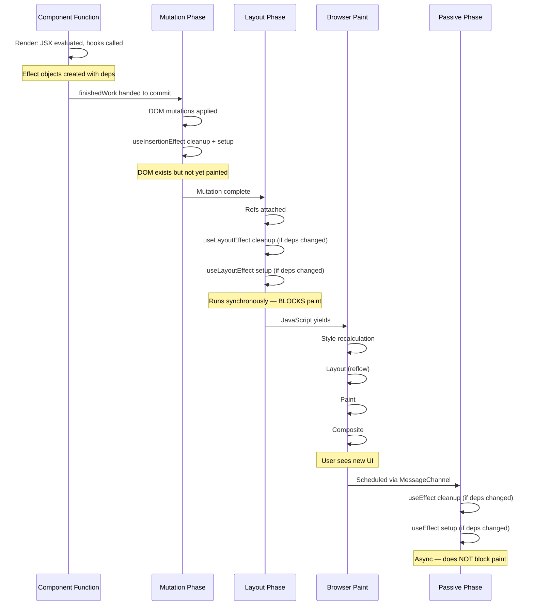
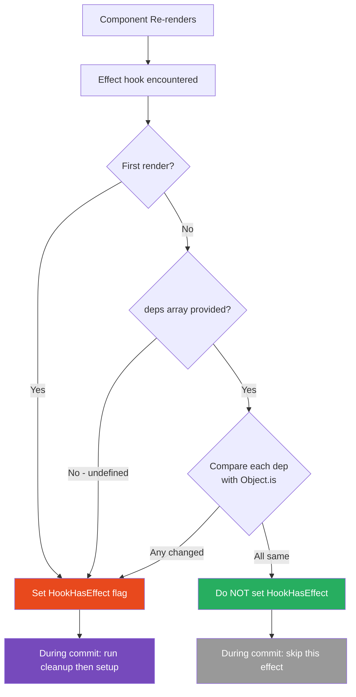

# 10 · Effects: Layout vs Passive

> **Effects are React's escape hatch from the pure render model — the mechanism for synchronizing your component with systems outside React's control. Understanding the precise difference between layout effects and passive effects, when each fires, what each can safely do, and how cleanup works is the difference between correct, leak-free React code and subtle production bugs.**

React's rendering model is intentionally pure: component functions produce descriptions, React applies them. But real applications must interact with systems that don't speak React — the DOM, browser APIs, network services, external stores, timers, subscriptions. Effects are the bridge between React's declarative world and the imperative world outside it.

---

## Table of Contents

- [What Effects Actually Are](#what-effects-actually-are)
- [The Three Effect Types](#the-three-effect-types)
- [useEffect: Passive Effects](#useeffect-passive-effects)
- [useLayoutEffect: Layout Effects](#uselayouteffect-layout-effects)
- [useInsertionEffect: Insertion Effects](#useinsertioneffect-insertion-effects)
- [Effect Dependencies: The Dependency Array](#effect-dependencies-the-dependency-array)
- [How React Compares Dependencies](#how-react-compares-dependencies)
- [The Cleanup Function](#the-cleanup-function)
- [Effect Execution Order in the Tree](#effect-execution-order-in-the-tree)
- [Effect Internals: The Effect List](#effect-internals-the-effect-list)
- [Common Effect Patterns](#common-effect-patterns)
- [When NOT to Use Effects](#when-not-to-use-effects)
- [The useEffectEvent Pattern](#the-useeffectevent-pattern)
- [Effects and Strict Mode](#effects-and-strict-mode)
- [Memory Leaks from Effects](#memory-leaks-from-effects)
- [Architecture Diagrams](#architecture-diagrams)
- [Good Practices](#good-practices)
- [Bad Practices](#bad-practices)
- [Mental Model](#mental-model)
- [Common Mistakes](#common-mistakes)
- [Exercises](#exercises)
- [Further Reading](#further-reading)

---

## What Effects Actually Are

An effect is a side effect — an observable interaction with something outside the component function's pure input-output relationship. In React, effects are code that:

1. **Runs after render** — not during render
2. **Interacts with external systems** — DOM, browser APIs, network, timers, subscriptions
3. **Has cleanup** — undoes what it did when the component updates or unmounts
4. **Is tied to specific state or prop changes** — via the dependency array

Effects solve the fundamental problem: your component describes the desired UI state, but some things (a WebSocket connection, a DOM measurement, a subscription) cannot be described in JSX — they must be imperatively controlled.

```tsx
// Without effects: you'd have to somehow express this in JSX (impossible)
// "Connect to WebSocket room X and disconnect when X changes or component unmounts"

// With useEffect: express it as an effect
function ChatRoom({ roomId }: { roomId: string }) {
  useEffect(() => {
    const socket = new WebSocket(`wss://chat.example.com/${roomId}`);
    socket.onmessage = handleMessage;

    return () => {
      socket.close(); // cleanup: disconnect when roomId changes or unmounts
    };
  }, [roomId]); // re-run when roomId changes
}
```

---

## The Three Effect Types

React has three effect hooks, each running at a different point in the commit cycle:

| Hook                 | When It Runs                                 | Blocks Paint?           | Typical Use                               |
| -------------------- | -------------------------------------------- | ----------------------- | ----------------------------------------- |
| `useInsertionEffect` | During mutation phase, before DOM insertions | Yes (before DOM exists) | CSS-in-JS style injection                 |
| `useLayoutEffect`    | After mutation phase, before browser paint   | Yes                     | DOM measurements, synchronous DOM updates |
| `useEffect`          | After browser paint (async)                  | No                      | Data fetching, subscriptions, analytics   |

---

## useEffect: Passive Effects

`useEffect` is the most commonly used effect hook. It runs **after** the browser has painted the new frame — making it the correct choice for most effects.

### Timing

```
React render phase
       ↓
React commit phase (DOM mutations)
       ↓
useLayoutEffect runs (synchronous)
       ↓
Browser paints new frame  ← useEffect does NOT block this
       ↓
useEffect cleanup (from previous render, if deps changed)
       ↓
useEffect setup (new render)
```

### Why "after paint" matters

Because `useEffect` runs after paint, it cannot cause the user to see an intermediate UI state. The browser paints the final state first, then your effect runs. This is usually what you want — effects that don't need to block paint should run after it.

```tsx
// ✅ Good use of useEffect — does not need to happen before paint
function UserProfile({ userId }: { userId: string }) {
  const [user, setUser] = useState<User | null>(null);

  useEffect(() => {
    let cancelled = false;

    async function fetchUser() {
      const data = await api.getUser(userId);
      if (!cancelled) setUser(data);
    }

    fetchUser();

    return () => {
      cancelled = true;
    }; // cleanup: prevent stale update
  }, [userId]);

  if (!user) return <Skeleton />;
  return <ProfileCard user={user} />;
}
```

### All the things useEffect can do

```tsx
function ExhaustiveEffectExamples() {
  // 1. Data fetching
  useEffect(() => {
    fetchData().then(setData);
    return () => {
      /* cancel fetch if needed */
    };
  }, [query]);

  // 2. Subscriptions
  useEffect(() => {
    const sub = eventBus.subscribe("event", handler);
    return () => sub.unsubscribe();
  }, [handler]);

  // 3. DOM event listeners (not handled by React)
  useEffect(() => {
    window.addEventListener("resize", handleResize);
    return () => window.removeEventListener("resize", handleResize);
  }, [handleResize]);

  // 4. Timer setup
  useEffect(() => {
    const id = setInterval(tick, 1000);
    return () => clearInterval(id);
  }, [tick]);

  // 5. Third-party library initialization
  useEffect(() => {
    const chart = new Chart(canvasRef.current, config);
    return () => chart.destroy();
  }, [config]);

  // 6. Analytics / logging (fire-and-forget)
  useEffect(() => {
    analytics.track("page_viewed", { page: currentPage });
    // No cleanup needed — analytics events don't need to be "undone"
  }, [currentPage]);

  // 7. Syncing with external store
  useEffect(() => {
    return externalStore.subscribe(() =>
      setSnapshot(externalStore.getSnapshot()),
    );
  }, []);
}
```

---

## useLayoutEffect: Layout Effects

`useLayoutEffect` runs **synchronously after DOM mutations but before the browser paints**. It blocks the browser from painting until it completes.

### When you genuinely need useLayoutEffect

The narrow set of legitimate use cases:

**1. Reading DOM measurements before paint**

```tsx
function Tooltip({ children, label }: TooltipProps) {
  const ref = useRef<HTMLDivElement>(null);
  const [coords, setCoords] = useState({ top: 0, left: 0 });

  useLayoutEffect(() => {
    // DOM is mutated — measurements are accurate
    // Runs BEFORE paint — user never sees wrong position
    const rect = ref.current!.getBoundingClientRect();
    const viewportWidth = window.innerWidth;

    setCoords({
      top: rect.bottom + 8,
      // Flip left if tooltip would overflow right edge
      left: rect.right + 200 > viewportWidth ? rect.right - 200 : rect.left,
    });
  }, []);

  return (
    <div ref={ref}>
      {children}
      <TooltipContent style={{ top: coords.top, left: coords.left }}>
        {label}
      </TooltipContent>
    </div>
  );
}
```

**2. Synchronously preventing a flash of incorrect UI**

```tsx
function AutoScrollList({ messages }: { messages: Message[] }) {
  const listRef = useRef<HTMLUListElement>(null);

  useLayoutEffect(() => {
    // Runs after new messages are in the DOM, before paint
    // User never sees the list in an un-scrolled state
    const list = listRef.current!;
    list.scrollTop = list.scrollHeight;
  }, [messages]);

  return (
    <ul ref={listRef} style={{ overflowY: "auto", maxHeight: 400 }}>
      {messages.map((m) => (
        <li key={m.id}>{m.text}</li>
      ))}
    </ul>
  );
}
```

**3. Matching React state to external imperative state**

```tsx
function AnimatedPanel({ isOpen }: { isOpen: boolean }) {
  const panelRef = useRef<HTMLDivElement>(null);

  useLayoutEffect(() => {
    const panel = panelRef.current!;
    // Synchronously apply animation start state before paint
    // Then trigger animation — user sees smooth transition from the start
    if (isOpen) {
      panel.style.height = "0px";
      panel.style.overflow = "hidden";
      // requestAnimationFrame to trigger CSS transition after height=0 is painted
      requestAnimationFrame(() => {
        panel.style.height = panel.scrollHeight + "px";
      });
    } else {
      panel.style.height = panel.scrollHeight + "px";
      requestAnimationFrame(() => {
        panel.style.height = "0px";
      });
    }
  }, [isOpen]);

  return (
    <div ref={panelRef} className="panel">
      {/* content */}
    </div>
  );
}
```

### The cost of useLayoutEffect

Every millisecond spent in `useLayoutEffect` is a millisecond the browser cannot paint. At 60fps, you have 16.67ms per frame total — including React's render, commit, and all layout effects. An expensive `useLayoutEffect` directly causes frame drops.

```tsx
// ⚠️ This useLayoutEffect takes 40ms — drops below 25fps
useLayoutEffect(() => {
  // Expensive DOM measurement + computation
  const allCards = document.querySelectorAll(".card");
  const positions = Array.from(allCards).map((card) => {
    return card.getBoundingClientRect(); // triggers layout for each card
  });
  // O(n²) matching algorithm
  computeOptimalLayout(positions);
}, [cards]);
```

---

## useInsertionEffect: Insertion Effects

`useInsertionEffect` is a specialized hook that fires **during the mutation phase, before DOM nodes are inserted**. It has severe restrictions:

- Cannot read refs (DOM doesn't exist yet)
- Cannot schedule state updates
- Cannot access current DOM state

It exists exclusively for CSS-in-JS libraries to inject `<style>` tags before React adds new DOM nodes:

```tsx
// Usage inside a CSS-in-JS library (not application code)
function useStyledComponent(styles: Record<string, string>) {
  const className = generateClassName(styles);

  useInsertionEffect(() => {
    if (!styleSheet.hasRule(className)) {
      styleSheet.insertRule(`.${className} { ${serializeStyles(styles)} }`);
    }
    // No cleanup — CSS rules persist for the session
  }, [className]);

  return className;
}
```

> ⚠️ **Anti-Pattern:** Using `useInsertionEffect` in application code. If you find yourself reaching for it, you almost certainly want `useLayoutEffect` (for post-DOM-mutation work) or `useEffect` (for everything else). `useInsertionEffect` is intentionally restricted and unsuitable for application logic.

---

## Effect Dependencies: The Dependency Array

The dependency array controls when an effect re-runs. React compares the previous dependency values with the new ones using `Object.is`. If any value changed, the effect cleanup runs and the setup runs again.

### The three forms

```tsx
// Form 1: No dependency array — runs after EVERY render
useEffect(() => {
  console.log("Rendered");
});
// Use case: almost none. Nearly always a mistake. Performance cost: high.

// Form 2: Empty dependency array — runs once after mount, cleanup on unmount
useEffect(() => {
  const subscription = subscribe();
  return () => subscription.unsubscribe();
}, []);
// Use case: one-time setup that doesn't depend on any props or state

// Form 3: Specific dependencies — runs when any dependency changes
useEffect(() => {
  const socket = connect(url, roomId);
  return () => socket.disconnect();
}, [url, roomId]);
// Use case: most effects — synchronize with specific changing values
```

### What goes in the dependency array

The rule: **every reactive value used inside the effect must be in the dependency array**.

A reactive value is any value that:

- Is a prop
- Is state (from `useState` or `useReducer`)
- Is computed from props or state
- Is a function defined inside the component

```tsx
function SearchResults({ query, userId }: Props) {
  const [results, setResults] = useState<Result[]>([]);
  const pageSize = 20; // constant — does NOT need to be in deps

  useEffect(() => {
    // query and userId are reactive — they go in deps
    // pageSize is a constant — technically doesn't need to be in deps
    // but it's safer to include it
    fetchResults(query, userId, pageSize).then(setResults);
  }, [query, userId]); // pageSize could also be included safely
}
```

### ESLint exhaustive-deps rule

The `eslint-plugin-react-hooks` rule `react-hooks/exhaustive-deps` enforces that all reactive values used in an effect are declared as dependencies. **Always follow this rule** — the cases where you genuinely need to suppress it are rare and almost always indicate a design problem.

```tsx
// ESLint will warn: 'onDataChange' is missing from deps
useEffect(() => {
  fetchData().then((data) => {
    onDataChange(data); // reactive value — must be in deps
  });
}, []); // ← missing onDataChange

// Fix 1: Add to deps (may cause the effect to re-run too often)
useEffect(() => {
  fetchData().then((data) => {
    onDataChange(data);
  });
}, [onDataChange]);

// Fix 2: Stabilize the function with useCallback (recommended)
const stableOnDataChange = useCallback(onDataChange, [
  /* stable deps */
]);
useEffect(() => {
  fetchData().then((data) => {
    stableOnDataChange(data);
  });
}, [stableOnDataChange]);

// Fix 3: Use useEffectEvent (React 19+) for event-like callbacks
```

---

## How React Compares Dependencies

React uses `Object.is` for dependency comparison — the same algorithm as `===` but with two differences:

```js
Object.is(NaN, NaN); // true (=== returns false)
Object.is(0, -0); // false (=== returns true)
```

This means:

```tsx
// Primitive values: compared by value
useEffect(() => {}, [42]); // re-runs when 42 changes
useEffect(() => {}, ["hello"]); // re-runs when 'hello' changes
useEffect(() => {}, [true]); // re-runs when true changes

// Objects and arrays: compared by REFERENCE
useEffect(() => {}, [{ id: 1 }]); // re-runs on EVERY render
// because {} !== {} (new object each render)

useEffect(() => {}, [[1, 2, 3]]); // re-runs on EVERY render
// because [] !== [] (new array each render)

// Functions: compared by REFERENCE
useEffect(() => {}, [() => {}]); // re-runs on EVERY render
// because () => {} !== () => {} (new function each render)
```

### The reference identity problem

```tsx
// ❌ Effect re-runs on every render — options is a new object each time
function DataFetcher({ userId }: { userId: string }) {
  const options = { includeDeleted: false, limit: 20 }; // new object every render

  useEffect(() => {
    fetchUser(userId, options);
  }, [userId, options]); // options is always a new reference → always re-runs
}

// ✅ Solution 1: Move stable objects outside the component
const DEFAULT_OPTIONS = { includeDeleted: false, limit: 20 };

function DataFetcher({ userId }: { userId: string }) {
  useEffect(() => {
    fetchUser(userId, DEFAULT_OPTIONS);
  }, [userId]); // DEFAULT_OPTIONS is stable — not needed in deps
}

// ✅ Solution 2: useMemo for options that depend on props/state
function DataFetcher({ userId, includeDeleted }: Props) {
  const options = useMemo(
    () => ({ includeDeleted, limit: 20 }),
    [includeDeleted],
  );

  useEffect(() => {
    fetchUser(userId, options);
  }, [userId, options]); // options reference is stable when includeDeleted hasn't changed
}

// ✅ Solution 3: Use primitive dependencies directly
function DataFetcher({ userId, includeDeleted }: Props) {
  useEffect(() => {
    fetchUser(userId, { includeDeleted, limit: 20 });
    // Don't put the object in deps — put its primitive parts
  }, [userId, includeDeleted]); // primitives — stable comparison
}
```

---

## The Cleanup Function

The cleanup function returned from an effect runs in two scenarios:

1. **Before the effect re-runs** (when dependencies change)
2. **When the component unmounts**

```tsx
useEffect(() => {
  // SETUP: runs after every render where deps changed
  const subscription = subscribe(topic);

  return () => {
    // CLEANUP: runs before next setup OR on unmount
    subscription.unsubscribe();
  };
}, [topic]);
```

### Cleanup timing details

```
Render 1 (topic = 'react'):
  → setup runs: subscribe('react')

Props change: topic = 'nextjs'

Render 2 (topic = 'nextjs'):
  → cleanup from render 1 runs: unsubscribe from 'react'
  → setup from render 2 runs: subscribe('nextjs')

Component unmounts:
  → cleanup from render 2 runs: unsubscribe from 'nextjs'
```

### The cancelled fetch pattern

Network requests are not cancellable by default. The cleanup pattern for fetch:

```tsx
function UserCard({ userId }: { userId: string }) {
  const [user, setUser] = useState<User | null>(null);

  useEffect(() => {
    let cancelled = false; // flag to prevent stale updates

    async function load() {
      try {
        const data = await fetchUser(userId);
        if (!cancelled) {
          setUser(data); // only update if still relevant
        }
      } catch (error) {
        if (!cancelled) {
          console.error(error);
        }
      }
    }

    load();

    return () => {
      cancelled = true; // flag: don't update state after this
    };
  }, [userId]);
}
```

### AbortController for proper fetch cancellation

```tsx
function useUserData(userId: string) {
  const [user, setUser] = useState<User | null>(null);

  useEffect(() => {
    const controller = new AbortController();

    fetch(`/api/users/${userId}`, { signal: controller.signal })
      .then((r) => r.json())
      .then(setUser)
      .catch((error) => {
        if (error.name !== "AbortError") {
          console.error(error);
        }
      });

    return () => {
      controller.abort(); // actually cancels the in-flight request
    };
  }, [userId]);

  return user;
}
```

> 🏭 **Production Note:** In production applications, use TanStack Query, SWR, or a similar data-fetching library instead of raw `useEffect` + fetch. These libraries handle cancellation, deduplication, caching, revalidation, loading states, and error states — all the things you'd otherwise build yourself. The raw pattern above is useful for understanding, but managing fetch in `useEffect` manually at scale is error-prone.

---

## Effect Execution Order in the Tree

Effects run **bottom-up** — children's effects run before parents' effects. This ordering is consistent for both `useLayoutEffect` and `useEffect`:

```tsx
function Parent() {
  useEffect(() => {
    console.log("4. Parent passive effect");
  });
  useLayoutEffect(() => {
    console.log("2. Parent layout effect");
  });
  return <Child />;
}

function Child() {
  useEffect(() => {
    console.log("3. Child passive effect");
  });
  useLayoutEffect(() => {
    console.log("1. Child layout effect");
  });
  return <div>Child</div>;
}

// On mount:
// 1. Child layout effect
// 2. Parent layout effect
// [browser paints]
// 3. Child passive effect
// 4. Parent passive effect
```

The bottom-up order ensures that when a parent's effect runs, all child effects have already run. A parent can safely read DOM state that a child's effect may have set.

---

## Effect Internals: The Effect List

Effects are stored on the fiber as a linked list of `Effect` objects in the `updateQueue.lastEffect` ring:

```js
// Effect object structure (simplified from ReactFiberHooks.js)
const effect = {
  tag: HookPassive | HookHasEffect, // what kind of effect, should it run?
  create: () => {
    // the setup function
    const sub = subscribe();
    return () => sub.unsubscribe(); // the cleanup function
  },
  destroy: undefined, // populated with cleanup return value after running
  deps: [topic], // dependency array
  next: effect, // next effect in the ring (circular)
};
```

### How React decides which effects to run

The `HookHasEffect` flag is set or cleared based on dependency comparison:

```js
// Simplified: checking if an effect needs to run
function areHookInputsEqual(nextDeps, prevDeps) {
  if (prevDeps === null) return false; // first render — always run

  for (let i = 0; i < nextDeps.length; i++) {
    if (!Object.is(nextDeps[i], prevDeps[i])) {
      return false; // dependency changed — run the effect
    }
  }
  return true; // all deps same — skip this effect
}

function updateEffectImpl(fiberFlags, hookFlags, create, deps) {
  const effect = workInProgress.memoizedState; // current effect
  const nextDeps = deps;
  const prevDeps = effect.deps;

  if (!areHookInputsEqual(nextDeps, prevDeps)) {
    // Deps changed — mark effect as needing to run
    effect.tag |= HookHasEffect;
  } else {
    // Deps same — do NOT add HookHasEffect flag
    // This effect will be skipped during commit
  }

  effect.deps = nextDeps;
}
```

During the commit phase, React only runs effects that have `HookHasEffect` set. Effects without this flag exist in the list but are skipped — their cleanup and setup do not run.

---

## Common Effect Patterns

### The event listener pattern

```tsx
function useWindowSize() {
  const [size, setSize] = useState({
    width: window.innerWidth,
    height: window.innerHeight,
  });

  useEffect(() => {
    const handler = () =>
      setSize({
        width: window.innerWidth,
        height: window.innerHeight,
      });

    window.addEventListener("resize", handler);
    return () => window.removeEventListener("resize", handler);
  }, []); // stable: handler is defined inside the effect

  return size;
}
```

### The synchronization pattern

```tsx
// Effect that keeps external state in sync with React state
function useDocumentTitle(title: string) {
  useEffect(() => {
    const prev = document.title;
    document.title = title;
    return () => {
      document.title = prev;
    }; // restore on unmount
  }, [title]);
}
```

### The interval pattern

```tsx
function useInterval(callback: () => void, delay: number | null) {
  const savedCallback = useRef(callback);

  // Keep the ref current — no re-run of the interval needed
  useLayoutEffect(() => {
    savedCallback.current = callback;
  }, [callback]);

  useEffect(() => {
    if (delay === null) return; // null delay = paused

    const id = setInterval(() => savedCallback.current(), delay);
    return () => clearInterval(id);
  }, [delay]); // only recreate interval when delay changes
}
```

> 🔬 **Internals:** The `useRef` + `useLayoutEffect` combination here solves the stale closure problem for intervals. Instead of including `callback` in the interval effect's dependencies (which would restart the interval every time `callback` changes), we store the latest callback in a ref and always call `savedCallback.current`. The interval restarts only when `delay` changes. This pattern is a common idiom for working with intervals and timeouts in React.

### The external store subscription pattern

```tsx
// The recommended pattern for subscribing to external stores
// (Used by Redux, Zustand, and similar libraries internally)
function useSyncExternalStore<T>(
  subscribe: (callback: () => void) => () => void,
  getSnapshot: () => T,
): T {
  // React 18's built-in hook handles this correctly
  return React.useSyncExternalStore(subscribe, getSnapshot);
}

// Usage:
function CartCount() {
  const count = React.useSyncExternalStore(
    cartStore.subscribe, // called when store changes
    cartStore.getCount, // returns current count
  );
  return <span>{count}</span>;
}
```

---

## When NOT to Use Effects

The React team has documented many patterns where developers reach for `useEffect` unnecessarily. These create extra render cycles and brittle code.

### Don't use effects to transform data for rendering

```tsx
// ❌ useEffect to derive filtered list
function FilteredList({ items, filter }: Props) {
  const [filtered, setFiltered] = useState(items);

  useEffect(() => {
    setFiltered(items.filter((i) => i.matches(filter)));
  }, [items, filter]);
  // Extra render: first render shows old filtered, then effect runs and re-renders

  return <List items={filtered} />;
}

// ✅ Derive during render
function FilteredList({ items, filter }: Props) {
  // Computed synchronously during render — always correct, no extra render
  const filtered = useMemo(
    () => items.filter((i) => i.matches(filter)),
    [items, filter],
  );
  return <List items={filtered} />;
}
```

### Don't use effects to initialize state from props

```tsx
// ❌ useEffect to sync prop into state
function Form({ defaultValues }: { defaultValues: FormValues }) {
  const [values, setValues] = useState(defaultValues);

  useEffect(() => {
    setValues(defaultValues); // causes extra render on every prop change
  }, [defaultValues]);
}

// ✅ Use key to reset component state
// When defaultValues changes, the parent passes a new key → component remounts
<Form key={userId} defaultValues={userDefaults} />;

// ✅ Or: derive editable state directly
function Form({ defaultValues }: { defaultValues: FormValues }) {
  const [edits, setEdits] = useState<Partial<FormValues>>({});
  const values = { ...defaultValues, ...edits }; // always in sync
}
```

### Don't use effects to notify parent components of state changes

```tsx
// ❌ useEffect to call parent callback when state changes
function Toggle({ onChange }: { onChange: (v: boolean) => void }) {
  const [isOn, setIsOn] = useState(false);

  useEffect(() => {
    onChange(isOn); // extra render cycle
  }, [isOn, onChange]);

  return (
    <button onClick={() => setIsOn((v) => !v)}>{isOn ? "On" : "Off"}</button>
  );
}

// ✅ Call the callback directly in the event handler
function Toggle({ onChange }: { onChange: (v: boolean) => void }) {
  const [isOn, setIsOn] = useState(false);

  const handleClick = () => {
    const newValue = !isOn;
    setIsOn(newValue);
    onChange(newValue); // synchronous, no extra render
  };

  return <button onClick={handleClick}>{isOn ? "On" : "Off"}</button>;
}
```

---

## The useEffectEvent Pattern

React 19 introduces `useEffectEvent` (formerly called `useEvent`) to solve the common problem of needing to access the latest props/state inside an effect without making them dependencies:

```tsx
// The problem: onReceive changes on every render (new function reference)
// But we don't want the effect to re-run when onReceive changes
// because that would disconnect and reconnect the WebSocket unnecessarily
function ChatRoom({ roomId, onReceive }: Props) {
  useEffect(() => {
    const socket = connect(roomId);
    socket.onmessage = (msg) => {
      onReceive(msg); // ← using onReceive here requires it in deps
    };
    return () => socket.disconnect();
  }, [roomId, onReceive]); // ← but onReceive changes → socket reconnects on every render
}

// React 19 solution: useEffectEvent
function ChatRoom({ roomId, onReceive }: Props) {
  // onReceiveEvent is always current but not reactive
  const onReceiveEvent = useEffectEvent(onReceive);

  useEffect(() => {
    const socket = connect(roomId);
    socket.onmessage = (msg) => {
      onReceiveEvent(msg); // always calls the latest onReceive
    };
    return () => socket.disconnect();
  }, [roomId]); // ← onReceiveEvent is NOT in deps — effect only re-runs when roomId changes
}
```

> 🔬 **Internals:** `useEffectEvent` creates a ref-backed wrapper function whose implementation always points to the latest version of the callback. It is similar to the `useRef` + `useLayoutEffect` pattern shown in the interval example, but with explicit React support. The resulting function is not reactive — changes to it do not re-trigger effects. This breaks the rule that all reactive values must be in the dependency array, but does so in a controlled, intentional way.

---

## Effects and Strict Mode

React Strict Mode deliberately **mounts → unmounts → remounts** every component in development. This means every effect runs its setup, then its cleanup, then its setup again:

```tsx
function StrictModeEffect() {
  useEffect(() => {
    console.log("setup");
    return () => console.log("cleanup");
  }, []);
}

// In Strict Mode development:
// setup
// cleanup    ← deliberate unmount
// setup      ← deliberate remount
// (cleanup runs again on actual unmount)

// In production (no Strict Mode):
// setup
// (cleanup on unmount)
```

This behavior reveals bugs in effects that are not written to handle remounting:

```tsx
// ❌ Breaks with Strict Mode — connects twice, only disconnects once
useEffect(() => {
  const client = createClient();
  clientRegistry.set(id, client); // adds to registry

  return () => {
    // Only removes one — but registry was added to twice
    // Second client is leaked
    clientRegistry.delete(id);
  };
}, [id]);

// ✅ Correct — cleanup fully reverses setup
useEffect(() => {
  const client = createClient();
  clientRegistry.set(id, client);

  return () => {
    client.close();
    clientRegistry.delete(id); // removes the specific client we added
  };
}, [id]);
```

> 🏭 **Production Note:** If your effect breaks in Strict Mode, it will also break in production when users navigate away and back to the same page (causing remount), when React uses concurrent features that may restart renders, or when hot module replacement occurs during development. Strict Mode is making your development environment match production edge cases — fix the effect, don't disable Strict Mode.

---

## Memory Leaks from Effects

Effects that don't clean up properly are the primary source of memory leaks in React applications:

### Common leak patterns

```tsx
// ❌ Leak: addEventListener without removeEventListener
useEffect(() => {
  document.addEventListener("keydown", handler);
  // Missing cleanup — handler stays attached after component unmounts
  // Every remount adds another handler — memory grows unboundedly
}, []);

// ❌ Leak: setInterval without clearInterval
useEffect(() => {
  const id = setInterval(updateClock, 1000);
  // Missing cleanup — interval fires forever after unmount
  // Each tick tries to setState on unmounted component
}, []);

// ❌ Leak: WebSocket without close
useEffect(() => {
  const ws = new WebSocket(url);
  ws.onmessage = handleMessage;
  // Missing cleanup — connection stays open
  // handleMessage tries to setState on unmounted component
}, [url]);

// ❌ Leak: Observer without disconnect
useEffect(() => {
  const observer = new IntersectionObserver(callback);
  observer.observe(elementRef.current!);
  // Missing cleanup — observer stays active
}, []);

// ✅ All of the above, correctly cleaned up:
useEffect(() => {
  document.addEventListener("keydown", handler);
  return () => document.removeEventListener("keydown", handler);
}, [handler]);

useEffect(() => {
  const id = setInterval(updateClock, 1000);
  return () => clearInterval(id);
}, []);

useEffect(() => {
  const ws = new WebSocket(url);
  ws.onmessage = handleMessage;
  return () => ws.close();
}, [url, handleMessage]);

useEffect(() => {
  const observer = new IntersectionObserver(callback);
  observer.observe(elementRef.current!);
  return () => observer.disconnect();
}, [callback]);
```

### Detecting leaks

The React warning "Can't perform a React state update on an unmounted component" (removed in React 18 but still a valid concern) indicates that an effect is updating state after unmount — a symptom of missing cleanup.

---

## Architecture Diagrams

### Effect timing across the full render/commit/paint cycle



### Effect dependency comparison and re-run logic



---

## Good Practices

### ✅ Good Practice — Effects that are resilient to remounting

```tsx
/**
 * Good: Every resource acquired in setup is released in cleanup.
 * Works correctly in Strict Mode (double-mount).
 * Works correctly after navigation (unmount + remount).
 * No state updates after unmount.
 */
function RealTimeChart({ metric }: { metric: string }) {
  const [data, setData] = useState<DataPoint[]>([]);

  useEffect(() => {
    let mounted = true;
    const connection = createMetricStream(metric);

    connection.onData((point: DataPoint) => {
      if (mounted) {
        setData((prev) => [...prev.slice(-99), point]); // keep last 100 points
      }
    });

    connection.onError((err: Error) => {
      if (mounted) console.error("Stream error:", err);
    });

    return () => {
      mounted = false;
      connection.close(); // stop the stream
    };
  }, [metric]); // reconnect when metric changes

  return <LineChart data={data} />;
}
```

**Why this works:** The `mounted` flag prevents state updates after unmount. `connection.close()` stops the stream. If the component remounts (Strict Mode), a new connection is established with a new `mounted` flag — the previous connection was correctly closed. If `metric` changes, the old stream is closed and a new one is opened.

---

## Bad Practices

### ⚠️ Bad Practice — Effect that transforms data (causes extra render)

```tsx
/**
 * Bad: useEffect used to derive filtered list from props.
 * Causes an extra render cycle:
 * 1. Render with stale filtered list
 * 2. Effect runs, calls setFiltered
 * 3. Re-render with correct filtered list
 * User may see the stale data briefly. Always one render behind.
 */
function ProductList({ products, category }: ProductListProps) {
  const [filtered, setFiltered] = useState<Product[]>([]);

  // ❌ Unnecessary effect — this is data transformation, not synchronization
  useEffect(() => {
    setFiltered(
      category ? products.filter((p) => p.category === category) : products,
    );
  }, [products, category]);

  return (
    <ul>
      {filtered.map((p) => (
        <ProductItem key={p.id} product={p} />
      ))}
    </ul>
  );
}

/**
 * ✅ Correct: Derive during render — always in sync, no extra render
 */
function ProductList({ products, category }: ProductListProps) {
  const filtered = useMemo(
    () =>
      category ? products.filter((p) => p.category === category) : products,
    [products, category],
  );

  return (
    <ul>
      {filtered.map((p) => (
        <ProductItem key={p.id} product={p} />
      ))}
    </ul>
  );
}
```

**Production impact:** The effect version causes every `products` or `category` change to produce two renders: one with stale data (immediately after prop change) and one with correct data (after the effect fires). In lists with many items, this doubles the reconciliation cost for every filter change. Users on slow devices see the stale list flash briefly before the correct one appears.

---

## Mental Model

> 💡 **The effects mental model:**
>
> Think of effects as **synchronization jobs**. Your component renders and describes what the UI should look like. But your component also needs to keep some external system synchronized with that UI — a WebSocket should be connected to the current room, the document title should reflect the current page, a timer should be ticking at the current interval. Effects are the jobs that do that synchronization. Like any job, they need a **start** (setup), a **stop** (cleanup), and a **trigger** (dependencies). The three effect hooks differ only in _when_ they run their jobs — insertion effects before DOM nodes are added, layout effects before paint, passive effects after paint. The job model is the same for all three.

---

## Common Mistakes

### Missing cleanup function

Any effect that sets up a subscription, timer, event listener, or connection must return a cleanup function. Without it: memory leaks, ghost event handlers, stale state updates on unmounted components.

### Missing dependencies

Using reactive values inside an effect without putting them in the dependency array creates stale closures — the effect uses the value from when it was created, not the current value. ESLint's `exhaustive-deps` rule catches this.

### Over-specifying dependencies (object references)

Creating new object/array/function literals in the component and putting them in the dependency array causes the effect to run on every render. Move the value outside the component or use `useMemo`/`useCallback` to stabilize it.

### Using useEffect for data transformation

If you're calling `setState` inside `useEffect` with a value derived from props or state, you almost always want `useMemo` instead. Effects are for synchronizing with _external systems_, not for computing values from existing React state.

### useLayoutEffect when useEffect would work

`useLayoutEffect` blocks the browser paint. Every millisecond spent in `useLayoutEffect` is a millisecond of jank. Use `useEffect` unless you specifically need pre-paint DOM measurements.

---

## Exercises

### Exercise 1 — Map effect timing

Add `performance.now()` logging to a component with both `useLayoutEffect` and `useEffect`. Render the component and record the timestamps. Calculate the gap between layout effect and passive effect — this is approximately the time the browser spent painting.

### Exercise 2 — Deliberate memory leak + fix

Build a component with a missing cleanup:

```tsx
function LeakyComponent({ id }: { id: string }) {
  useEffect(() => {
    const handler = () => console.log("resize", id);
    window.addEventListener("resize", handler);
    // Missing cleanup
  }, [id]);
  return <div>Component {id}</div>;
}
```

Mount and unmount it 10 times. Resize the window. Count how many times the handler fires. Add the cleanup. Verify the count drops to 0 after unmount.

### Exercise 3 — Eliminate unnecessary effects

Audit your own codebase or a sample project. Find all `useEffect` calls. For each one, ask:

1. Is this transforming data for rendering? → Replace with `useMemo`
2. Is this calling a parent callback when state changes? → Move to event handler
3. Is this initializing state from props? → Use `key` prop reset
4. Is this genuinely synchronizing with an external system? → Keep it

---

## Further Reading

- [React Source: ReactFiberHooks.js — mountEffect, updateEffect](https://github.com/facebook/react/blob/main/packages/react-reconciler/src/ReactFiberHooks.js) — Effect implementation internals
- [React Docs: Synchronizing with Effects](https://react.dev/learn/synchronizing-with-effects) — The definitive official guide
- [React Docs: You Might Not Need an Effect](https://react.dev/learn/you-might-not-need-an-effect) — When NOT to use effects
- [Overreacted: A Complete Guide to useEffect](https://overreacted.io/a-complete-guide-to-useeffect/) — Deep dive by Dan Abramov
- [React Docs: useEffectEvent](https://react.dev/reference/react/experimental_useEffectEvent) — The experimental hook for non-reactive event handlers in effects
- Next in this handbook: [11 · What Causes Re-renders](./06-what-causes-rerenders.md)

---

_Part of the [React + Next.js Engineering Handbook](../../README.md)_
