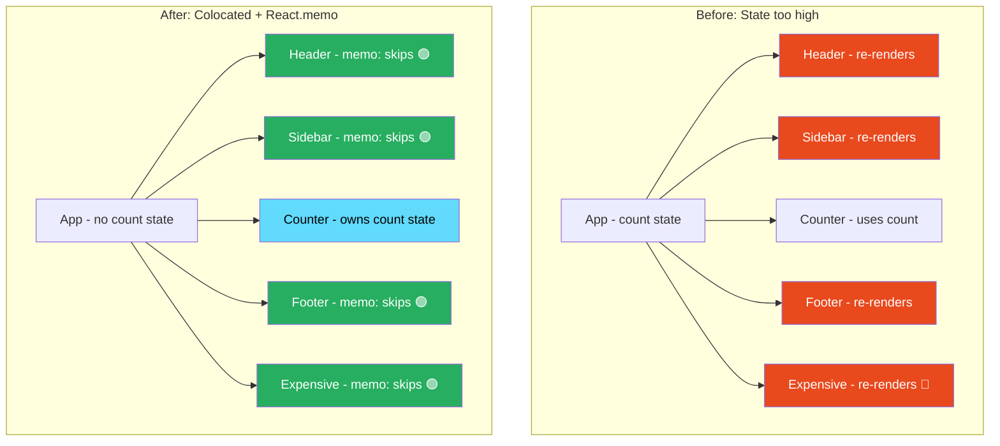
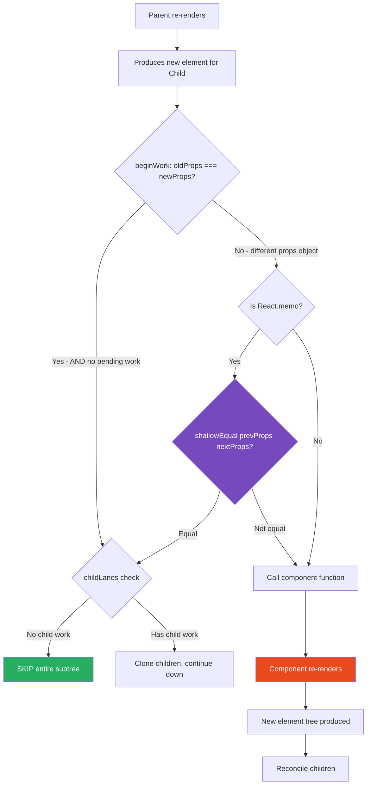

# 26 · What Causes Re-renders

> **A React re-render is the reconciler calling your component function again to produce a new element tree. It is triggered by exactly four mechanisms: state updates, parent re-renders, context value changes, and hooks whose subscribed values changed. Understanding each mechanism precisely — what triggers it, what it does to the fiber tree, and how to prevent it when unnecessary — is the foundation of React performance engineering.**

Most React performance problems come down to unnecessary re-renders: components running when nothing they display actually changed. The first step to fixing unnecessary re-renders is understanding exactly what causes them. This document traces each trigger to its implementation, explains the propagation through the fiber tree, and shows the optimization for each.

---

## Table of Contents

- [The Four Causes of Re-renders](#the-four-causes-of-re-renders)
- [Cause 1: State Updates](#cause-1-state-updates)
- [Cause 2: Parent Re-renders](#cause-2-parent-re-renders)
- [Cause 3: Context Value Changes](#cause-3-context-value-changes)
- [Cause 4: Hook Subscriptions](#cause-4-hook-subscriptions)
- [Re-render Propagation Through the Tree](#re-render-propagation-through-the-tree)
- [The Bailout System: Preventing Re-renders](#the-bailout-system-preventing-re-renders)
- [React.memo: Component-Level Bailout](#reactmemo-component-level-bailout)
- [The Children Prop Escape Hatch](#the-children-prop-escape-hatch)
- [State Colocation as Re-render Prevention](#state-colocation-as-re-render-prevention)
- [Measuring Re-renders](#measuring-re-renders)
- [Architecture Diagrams](#architecture-diagrams)
- [Good Practices](#good-practices)
- [Bad Practices](#bad-practices)
- [Mental Model](#mental-model)
- [Common Misconceptions](#common-misconceptions)
- [Exercises](#exercises)
- [Further Reading](#further-reading)

---

## The Four Causes of Re-renders

```
Re-render triggers:
1. STATE UPDATE       → useState setter or useReducer dispatch called
2. PARENT RE-RENDER   → parent component re-renders and produces new element for this child
3. CONTEXT CHANGE     → a Context.Provider value changes and this component reads that context
4. HOOK SUBSCRIPTION  → a hook (useSyncExternalStore, etc.) signals a change
```

These four are exhaustive. If a component is re-rendering and you don't know why, one of these four is the cause. The goal of React performance optimization is to eliminate the unnecessary instances of each.

---

## Cause 1: State Updates

The most direct cause. Calling the setter from `useState` or dispatching to `useReducer` queues an update and schedules a render:

```tsx
function Counter() {
  const [count, setCount] = useState(0);
  // setCount(1) → dispatchSetState → enqueueUpdate → scheduleUpdateOnFiber → RENDER
  return <button onClick={() => setCount((c) => c + 1)}>{count}</button>;
}
```

### Propagation from state update

When a state update triggers a render, the render starts at the component that owns the state and propagates **downward** through all its children (unless bailout stops it):

```
Counter re-renders
  → Child of Counter re-renders (by default)
  → Grandchild of Counter re-renders (by default)
  → ... (all descendants)
```

### The eager state optimization prevents renders

If the new state equals the current state (via `Object.is`), React skips scheduling a render entirely:

```tsx
const [count, setCount] = useState(5);
setCount(5); // Object.is(5, 5) = true → NO RENDER scheduled
```

### Batching prevents multiple renders

Multiple state updates in the same synchronous execution batch into one render:

```tsx
function handleClick() {
  setA(1); // queued
  setB(2); // queued
  setC(3); // queued
  // ONE render processes all three updates
}
```

---

## Cause 2: Parent Re-renders

When a component re-renders, it produces new React element objects for all its children. The reconciler processes each child element against the existing fiber. By default, a child component re-renders whenever its parent re-renders — even if the child's props didn't change.

```tsx
function Parent() {
  const [count, setCount] = useState(0);

  return (
    <div>
      <button onClick={() => setCount((c) => c + 1)}>+</button>
      {/* Child re-renders on every count change — even if its props didn't change */}
      <Child label="Static label" />
    </div>
  );
}

function Child({ label }: { label: string }) {
  // This function runs again every time Parent renders
  // Even though label is always "Static label"
  return <div>{label}</div>;
}
```

### Why child re-renders even when props are the same

Parent re-renders produce a new React element for `<Child>`:

```js
// Parent render N: createElement(Child, { label: 'Static label' }) → new object A
// Parent render N+1: createElement(Child, { label: 'Static label' }) → new object B

// Object A !== Object B (different references)
// beginWork sees pendingProps !== memoizedProps (they are different objects, even if equal)
// React calls the Child function again

// But: if both renderers produce the same output, reconciliation
// may bail out at the grandchild level (no DOM mutations)
```

This is the fundamental reason React.memo exists: to prevent re-rendering children when their props are the same.

### The bailout check in beginWork

```js
// In beginWork for FunctionComponent:
if (current !== null) {
  const oldProps = current.memoizedProps;
  const newProps = workInProgress.pendingProps;

  if (
    oldProps === newProps && // ← reference equality
    !includesSomeLane(renderLanes, workInProgress.lanes) &&
    !didReceiveUpdate
  ) {
    return bailoutOnAlreadyFinishedWork(current, workInProgress, renderLanes);
  }
}
```

`oldProps === newProps` uses reference equality. For a component like `<Child label="Static label" />`, the parent produces a new props object every render — even though the content is identical. Reference equality fails → no bailout → Child re-renders.

---

## Cause 3: Context Value Changes

Every component that calls `useContext(SomeContext)` re-renders when `SomeContext.Provider`'s value changes (by reference):

```tsx
const ThemeContext = React.createContext("light");

function App() {
  const [theme, setTheme] = useState("light");

  return (
    // When theme changes: ALL consumers of ThemeContext re-render
    <ThemeContext.Provider value={theme}>
      <Layout />
    </ThemeContext.Provider>
  );
}

function Layout() {
  // Does NOT use ThemeContext — does NOT re-render due to theme change
  return <Section />;
}

function Section() {
  const theme = useContext(ThemeContext); // ← re-renders when theme changes
  return <div className={theme}>...</div>;
}

function Unrelated() {
  // Does NOT use ThemeContext
  // Does NOT re-render due to theme change
  // But WILL re-render if Layout re-renders (parent re-render propagation)
  return <span>Unrelated</span>;
}
```

### How context propagation works

1. Provider fiber processes with new value
2. React calls `propagateContextChange` — walks entire subtree
3. Any fiber with a `dependencies.firstContext` pointing to this context gets `fiber.lanes` set
4. The render phase visits those fibers and re-renders them

Importantly: React does NOT automatically skip non-consumers. Only components that called `useContext(ThemeContext)` are marked for re-render. Components that didn't call it are skipped during context propagation (though they may still re-render due to parent re-render propagation).

---

## Cause 4: Hook Subscriptions

`useSyncExternalStore` (and hooks built on it) subscribe to external stores. When the store notifies subscribers of a change, React schedules a re-render:

```tsx
function useWindowWidth() {
  return React.useSyncExternalStore(
    // subscribe: called to set up subscription
    (callback) => {
      window.addEventListener("resize", callback);
      return () => window.removeEventListener("resize", callback);
    },
    // getSnapshot: returns current value
    () => window.innerWidth,
    // getServerSnapshot: for SSR
    () => 1920,
  );
}

function ResponsiveComponent() {
  const width = useWindowWidth();
  // Re-renders whenever window is resized
  return <div style={{ fontSize: width > 768 ? 16 : 14 }}>...</div>;
}
```

### The useSyncExternalStore mechanism

```js
// When the external store notifies React of a change:
// The callback passed to subscribe() is called
// React's implementation of that callback:
function handleStoreChange() {
  // Check if snapshot changed
  const currentSnapshot = getSnapshot();
  if (!Object.is(currentSnapshot, lastSnapshot)) {
    // Schedule a re-render for all subscribers
    scheduleUpdateOnFiber(fiber, SyncLane);
  }
}
```

This is a subscription mechanism that bridges non-React state to React's rendering system — used internally by Zustand, Redux (via react-redux), and many other libraries.

---

## Re-render Propagation Through the Tree

Understanding how re-renders propagate is essential for designing efficient component trees.

### Default behavior: top-down propagation

```
Parent state changes → Parent re-renders
  ↓ Parent produces new element for Child
  ↓ Child re-renders (new props object)
    ↓ Child produces new elements for Grandchildren
    ↓ Grandchildren re-render
      ...and so on down the tree
```

### The propagation boundary: same fibers, same props

Propagation stops when React can bail out. Bailout requires:

- Same fiber (same type, same key)
- `pendingProps === memoizedProps` (reference equality for the whole props object)
- No pending state updates in this fiber
- No context changes for this fiber

In practice, the only reliable way to stop propagation at a component boundary is `React.memo`.

### Propagation vs re-rendering

A critical distinction: a component being "processed by the reconciler" (beginWork called) is not the same as the component "re-rendering" (component function called). The bailout system in `beginWork` can skip the component function call even if the reconciler visits the fiber:

```js
// beginWork called → check for bailout → if all conditions met: skip component function
// Result: fiber is "processed" but component function is NOT called → no re-render
```

---

## The Bailout System: Preventing Re-renders

React's bailout system is a multi-level optimization that prevents unnecessary re-renders at different points in the render cycle.

### Level 1: Eager state optimization (prevents render scheduling)

```js
// In dispatchSetState — before any render is scheduled
if (Object.is(eagerState, currentState)) {
  return; // NO RENDER SCHEDULED
}
```

This is the earliest possible prevention — the render never enters the Scheduler.

### Level 2: Fiber-level bailout in beginWork

```js
// In beginWork — render is scheduled, fiber is being processed
if (oldProps === newProps && !hasPendingWork && !didReceiveContext) {
  return bailoutOnAlreadyFinishedWork(current, workInProgress, renderLanes);
  // Component function is NOT called
  // Children may still be visited if childLanes has pending work
}
```

This prevents calling the component function, but the fiber is still visited.

### Level 3: Subtree bailout in bailoutOnAlreadyFinishedWork

```js
function bailoutOnAlreadyFinishedWork(current, workInProgress, renderLanes) {
  if (!includesSomeLane(renderLanes, workInProgress.childLanes)) {
    // No children have pending work — skip ENTIRE SUBTREE
    return null; // work loop moves to sibling, not child
  }
  // Some children have work — clone and continue down
  cloneChildFibers(current, workInProgress);
  return workInProgress.child;
}
```

If the entire subtree has no pending work, it's skipped in O(1).

### Level 4: React.memo (props comparison before rendering)

```js
function updateMemoComponent(
  current,
  workInProgress,
  Component,
  nextProps,
  renderLanes,
) {
  if (current !== null) {
    const prevProps = current.memoizedProps;
    if (
      shallowEqual(prevProps, nextProps) &&
      current.ref === workInProgress.ref
    ) {
      didReceiveUpdate = false;
      return bailoutOnAlreadyFinishedWork(current, workInProgress, renderLanes);
    }
  }
  // Props changed: render the component
}
```

React.memo adds a props comparison step using `shallowEqual` — not reference equality but one-level deep equality for each prop.

---

## React.memo: Component-Level Bailout

`React.memo` wraps a component and prevents re-renders when props are shallowly equal:

```tsx
// Without React.memo: re-renders on every Parent render
function ExpensiveChild({ items, config }: Props) {
  // 50ms to render...
  return <div>{/* complex UI */}</div>;
}

// With React.memo: only re-renders when props change
const ExpensiveChild = React.memo(function ExpensiveChild({
  items,
  config,
}: Props) {
  return <div>{/* complex UI */}</div>;
});
```

### React.memo's shallow equality

`shallowEqual` checks:

1. `Object.is(oldProps, newProps)` — if same reference, equal
2. For each key in oldProps: `Object.is(oldProps[key], newProps[key])`

```js
function shallowEqual(objA: Record<string, unknown>, objB: Record<string, unknown>): boolean {
  if (Object.is(objA, objB)) return true;

  const keysA = Object.keys(objA);
  const keysB = Object.keys(objB);

  if (keysA.length !== keysB.length) return false;

  for (let i = 0; i < keysA.length; i++) {
    const key = keysA[i];
    if (!objB.hasOwnProperty(key) || !Object.is(objA[key], objB[key])) {
      return false;
    }
  }

  return true;
}
```

For `React.memo` to work, each prop must be reference-stable when unchanged:

- Primitive values: always stable when value unchanged
- Object values: need `useMemo` to stabilize reference
- Function values: need `useCallback` to stabilize reference
- Array values: need `useMemo` to stabilize reference

### Custom comparison function

```tsx
// Custom comparison: only re-render when specific properties change
const ExpensiveChart = React.memo(
  function Chart({ data, config }: ChartProps) {
    return <canvas>{/* render */}</canvas>;
  },
  (prevProps, nextProps) => {
    // Return true = equal (don't re-render)
    // Return false = not equal (re-render)
    return (
      prevProps.data === nextProps.data && // reference equality for data
      prevProps.config.type === nextProps.config.type // deep check for specific field
    );
  },
);
```

> ⚠️ **Anti-Pattern:** Custom comparison functions that are expensive to run. If the comparison takes longer than just running the component, you've made things slower. Keep comparisons O(1) or O(n) where n is small.

---

## The Children Prop Escape Hatch

One of the most powerful and underused patterns for preventing re-renders: passing components as `children` so they are created in a parent scope that doesn't re-render:

```tsx
// ❌ ExpensiveChild re-renders on every scroll
function ScrollContainer() {
  const [scrollY, setScrollY] = useState(0);

  return (
    <div onScroll={(e) => setScrollY(e.currentTarget.scrollTop)}>
      <ExpensiveChild />{" "}
      {/* re-renders when scrollY changes — parent re-renders */}
    </div>
  );
}

// ✅ ExpensiveChild doesn't re-render on scroll
function ScrollContainer({ children }: { children: React.ReactNode }) {
  const [scrollY, setScrollY] = useState(0);

  return (
    <div onScroll={(e) => setScrollY(e.currentTarget.scrollTop)}>
      {children} {/* created by a parent that doesn't re-render on scroll */}
    </div>
  );
}

function App() {
  return (
    <ScrollContainer>
      <ExpensiveChild /> {/* created here — in App's render scope */}
    </ScrollContainer>
  );
}
```

### Why this works

When `ScrollContainer` re-renders (due to `scrollY` change), it receives `children` as a prop — a reference to element objects created in `App`'s render scope. `App` didn't re-render, so the `children` reference is the same object as last render. React sees the same element objects → `pendingProps.children === memoizedProps.children` → reconciler reuses the existing child fibers → `ExpensiveChild` is not re-rendered.

This pattern avoids the overhead of `React.memo` and is often a cleaner architectural solution to the re-render problem.

---

## State Colocation as Re-render Prevention

The most impactful re-render optimization often requires no memoization — just moving state to where it belongs:

```tsx
// ❌ State too high: entire parent re-renders for local UI state
function ProductPage({ product }: { product: Product }) {
  const [isExpanded, setIsExpanded] = useState(false);
  // isExpanded only matters for Description — but ProductPage re-renders for it
  // ProductImages, ProductMeta, RelatedProducts all re-render on expand toggle

  return (
    <div>
      <ProductImages product={product} />
      <ProductMeta product={product} />
      <Description
        product={product}
        isExpanded={isExpanded}
        onToggle={() => setIsExpanded((v) => !v)}
      />
      <RelatedProducts product={product} />
    </div>
  );
}

// ✅ State colocated: only Description re-renders on expand toggle
function ProductPage({ product }: { product: Product }) {
  // No isExpanded state here — ProductPage never re-renders for expand toggle
  return (
    <div>
      <ProductImages product={product} />
      <ProductMeta product={product} />
      <Description product={product} />{" "}
      {/* Description owns its own expand state */}
      <RelatedProducts product={product} />
    </div>
  );
}

function Description({ product }: { product: Product }) {
  const [isExpanded, setIsExpanded] = useState(false); // colocated
  return (
    <div>
      <p>{isExpanded ? product.fullDescription : product.shortDescription}</p>
      <button onClick={() => setIsExpanded((v) => !v)}>
        {isExpanded ? "Less" : "More"}
      </button>
    </div>
  );
}
```

With colocation: toggling expand only re-renders `Description` and its children. Without colocation: toggling expand re-renders `ProductImages`, `ProductMeta`, `Description`, `RelatedProducts`, and all their children — potentially hundreds of unnecessary renders per toggle.

---

## Measuring Re-renders

### React DevTools Profiler

The most reliable tool. Records which components rendered, why, and how long:

```
1. Open React DevTools → Profiler tab
2. Click "Record"
3. Interact with the application
4. Click "Stop"
5. Examine the flame graph

For each component, DevTools shows:
- Did it render? (blue = rendered, gray = did not render)
- Why did it render?
  - "Props changed" → parent re-render with different props
  - "State changed" → useState/useReducer update
  - "Context changed" → context value changed
  - "Parent component rendered" → parent re-rendered (but bailout possible)
  - "Hooks changed" → hook subscription triggered
```

### The Highlight Updates feature

React DevTools → Settings → "Highlight updates when components render"

This highlights components with a colored border when they render, directly in the browser. Fast flashing = many re-renders. Look for components that highlight when you wouldn't expect them to.

### Adding render tracking in code

```tsx
function useRenderReason(componentName: string) {
  if (process.env.NODE_ENV !== "development") return;

  const renders = useRef(0);
  renders.current++;

  console.log(`${componentName} render #${renders.current}`);
}

// Or: track which props changed
function useWhyDidYouRender<T extends object>(componentName: string, props: T) {
  const prevProps = useRef<T>(props);

  useEffect(() => {
    const changed: Partial<Record<keyof T, { from: unknown; to: unknown }>> =
      {};
    for (const key in props) {
      if (!Object.is(props[key], prevProps.current[key])) {
        changed[key] = { from: prevProps.current[key], to: props[key] };
      }
    }
    if (Object.keys(changed).length > 0) {
      console.group(`${componentName} re-rendered`);
      console.log("Changed props:", changed);
      console.groupEnd();
    }
    prevProps.current = props;
  });
}
```

### React's Profiler API

```tsx
function AppWithProfiling() {
  return (
    <React.Profiler
      id="ProductList"
      onRender={(
        id,
        phase,
        actualDuration,
        baseDuration,
        startTime,
        commitTime,
      ) => {
        if (actualDuration > 16) {
          // more than one frame
          console.warn(`${id} took ${actualDuration.toFixed(1)}ms to render`);
        }
      }}
    >
      <ProductList />
    </React.Profiler>
  );
}
```

---

## Architecture Diagrams

### Re-render propagation: before and after optimization



### The bailout decision tree for a re-rendering parent



---

## Good Practices

### ✅ Good Practice — Colocate state + memo children that can't be colocated

```tsx
/**
 * Good: A real-world combination of colocation and memoization.
 * Local UI state stays local. Expensive components are protected by memo.
 * The children prop pattern prevents notification re-renders from
 * affecting the entire page.
 */

// Expensive analytics component — memoized because data doesn't change often
const AnalyticsDashboard = React.memo(
  function AnalyticsDashboard({ data, config }: DashboardProps) {
    // Expensive rendering: many charts, large data sets
    return <div className="dashboard">{/* ... */}</div>;
  },
  // Custom comparator: only re-render when data or config.period changes
  (prev, next) =>
    prev.data === next.data && prev.config.period === next.config.period,
);

// Main page: notification count doesn't affect dashboard
function ReportsPage({ analyticsData, reportConfig }: PageProps) {
  const [notificationCount, setNotificationCount] = useState(0);

  // ✅ Memoize config object to prevent spurious dashboard re-renders
  const config = useMemo(
    () => ({ period: reportConfig.period, filters: reportConfig.filters }),
    [reportConfig.period, reportConfig.filters],
  );

  return (
    <div>
      {/* NotificationBar: local state kept local */}
      <NotificationBar
        count={notificationCount}
        onDismiss={() => setNotificationCount(0)}
      />
      {/* Dashboard: only re-renders when data or period changes */}
      <AnalyticsDashboard data={analyticsData} config={config} />
    </div>
  );
}
```

**Why this works:** `notificationCount` state is owned by `ReportsPage`. When it changes, `ReportsPage` re-renders. But `AnalyticsDashboard` is memoized with a custom comparator — `notificationCount` is not a prop of Dashboard, so the comparator returns `true` (equal), and Dashboard's function is never called. Dashboard only re-renders when `analyticsData` (by reference) or `config.period` changes.

---

## Bad Practices

### ⚠️ Bad Practice — Memoizing everything without addressing the root cause

```tsx
/**
 * Bad: Using React.memo on all children instead of fixing the root cause.
 * The root cause: state too high in the tree.
 * The symptom: all siblings re-render when any state changes.
 * The wrong fix: wrap every component in React.memo.
 * The right fix: colocate state.
 *
 * React.memo adds overhead (shallow comparison on every parent render).
 * When applied everywhere "just in case," that overhead accumulates.
 * And it still doesn't address the architectural problem.
 */
function App() {
  const [isDropdownOpen, setIsDropdownOpen] = useState(false);
  // ❌ dropdown state at app level — toggles cause app-level re-renders

  return (
    <div>
      <MemoizedHeader /> {/* ❌ memo needed because of bad state placement */}
      <MemoizedNavigation />{" "}
      {/* ❌ memo needed because of bad state placement */}
      <MemoizedProductGrid />{" "}
      {/* ❌ memo needed because of bad state placement */}
      <Dropdown
        isOpen={isDropdownOpen}
        onToggle={() => setIsDropdownOpen((v) => !v)}
      />
      <MemoizedFooter /> {/* ❌ memo needed because of bad state placement */}
    </div>
  );
}

// ✅ Fix: colocate dropdown state
function App() {
  // No dropdown state here
  return (
    <div>
      <Header /> {/* No memo needed — App never re-renders for dropdown */}
      <Navigation /> {/* No memo needed */}
      <ProductGrid /> {/* No memo needed */}
      <Dropdown />{" "}
      {/* Owns its own isOpen state — only it re-renders on toggle */}
      <Footer /> {/* No memo needed */}
    </div>
  );
}
```

**Production impact:** The memoized version has 5 `React.memo` wraps, each running a shallow comparison on every App render (any state change). The colocated version has 0 `React.memo` wraps because App never re-renders for dropdown state. The colocated version has both less overhead AND correct architecture. Memoization without colocation is treating a symptom, not the disease.

---

## Mental Model

> 💡 **The re-render mental model:**
>
> Think of re-renders as **notifications on a bulletin board**. State update = posting a new notice. Parent re-render = the parent posts notices for all its tenants. Context change = the building manager posts notices for everyone who subscribed. Each tenant (component) sees the notice and can either: (1) go to work (re-render), or (2) check if the notice is relevant and ignore it if not (bailout). React.memo gives a tenant a selective filter — "only wake me up if something in this list changed." State colocation means the notice only goes to the relevant tenant's floor (the component and its descendants), not the entire building. The goal is architectural: reduce how many floors get notices, not just add more filters at each door.

---

## Common Misconceptions

### "React re-renders the entire page when state changes"

React re-renders only the component that owns the changed state and its descendants (by default). Components in separate subtrees are unaffected.

### "React.memo prevents all re-renders of a component"

React.memo prevents re-renders caused by parent re-renders with unchanged props. It does not prevent re-renders caused by the component's own state changes, context changes, or hook subscriptions.

### "Re-renders always cause DOM updates"

Re-renders cause the component function to run and reconciliation to occur. If the output is identical to the previous render, zero DOM mutations happen. Re-render ≠ DOM update.

### "Fewer re-renders is always better"

Re-renders are the mechanism by which React keeps the UI up to date. Unnecessary re-renders are bad. Necessary re-renders are required. The goal is not zero re-renders — it is zero _unnecessary_ re-renders.

### "useMemo prevents child re-renders"

`useMemo` memoizes a value — it doesn't prevent child re-renders by itself. If the memoized value is a prop passed to a `React.memo` component, and the memoized value's reference is stable, then the child is protected from re-render. The chain requires both `useMemo` on the value AND `React.memo` on the child.

---

## Exercises

### Exercise 1 — Identify the re-render source

```tsx
function App() {
  const [user, setUser] = useState<User>({ name: "Alice", role: "admin" });
  const [searchTerm, setSearchTerm] = useState("");
  const [darkMode, setDarkMode] = useState(false);

  return (
    <ThemeProvider darkMode={darkMode}>
      <UserProvider user={user}>
        <Header onSearch={setSearchTerm} />
        <ProductGrid searchTerm={searchTerm} />
        <UserProfile />
        <Footer />
      </UserProvider>
    </ThemeProvider>
  );
}
```

For each scenario, predict which components re-render and why:

1. User types in the search bar (setSearchTerm called)
2. User toggles dark mode
3. User updates their profile (setUser called)
4. Window is resized (if any component uses useWindowWidth)

Then verify with React DevTools Profiler.

### Exercise 2 — Fix unnecessary re-renders without React.memo

Given this component tree, fix the re-renders using ONLY state colocation and the children prop pattern — no React.memo:

```tsx
function Dashboard() {
  const [isFilterOpen, setIsFilterOpen] = useState(false);
  const [filterValues, setFilterValues] = useState({});

  return (
    <div>
      <ExpensiveMetrics /> {/* re-renders on every filter change */}
      <FilterPanel
        isOpen={isFilterOpen}
        values={filterValues}
        onToggle={() => setIsFilterOpen((v) => !v)}
        onChange={setFilterValues}
      />
      <ExpensiveDataTable filterValues={filterValues} />
    </div>
  );
}
```

### Exercise 3 — Measure the React.memo benefit

Build two versions of a parent + expensive child:

1. Without React.memo
2. With React.memo

Profile 100 parent renders (triggered by a counter). Calculate:

- Total time with React.memo vs without
- Time saved per render
- When does the break-even point occur (how expensive must the child be for React.memo to pay off)?

---

## Further Reading

- [React Source: ReactFiberBeginWork.js — bailout conditions](https://github.com/facebook/react/blob/main/packages/react-reconciler/src/ReactFiberBeginWork.js)
- [React Source: ReactShallowRenderer.js — shallowEqual](https://github.com/facebook/react/blob/main/packages/shared/shallowEqual.js)
- [React Docs: Render and Commit](https://react.dev/learn/render-and-commit) — The official render cycle explanation
- [Overreacted: Before You memo()](https://overreacted.io/before-you-memo/) — State colocation over memoization
- [Kent C. Dodds: State Colocation](https://kentcdodds.com/blog/state-colocation-will-make-your-react-app-faster) — Deep dive on colocation for performance
- [Alex Sidorenko: React re-renders guide](https://www.developerway.com/posts/react-re-renders-guide) — Visual guide to re-render causes and prevention
- Next in this handbook: [27 · Reference Equality & Object Identity](./07-reference-equality.md)

---

_Part of the [React + Next.js Engineering Handbook](../../README.md)_
