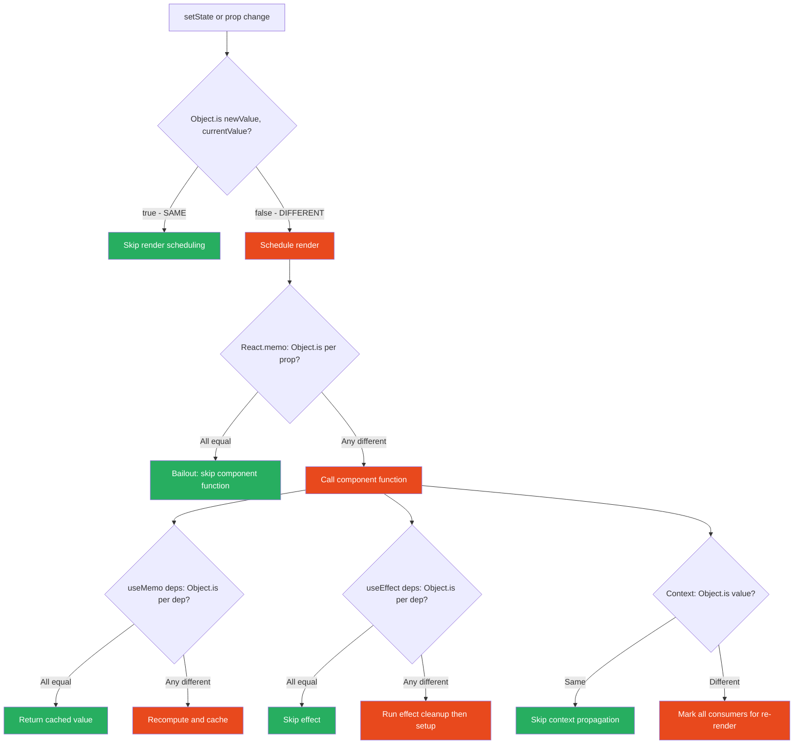
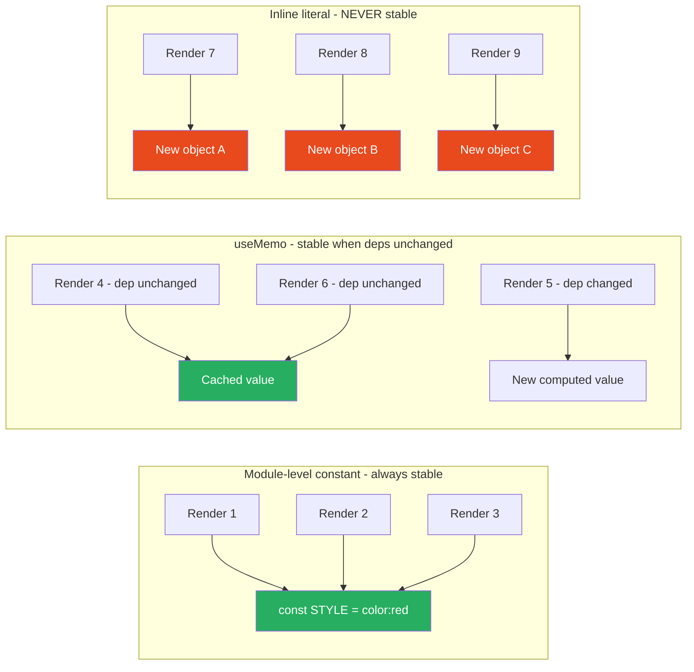

# 27 · Reference Equality & Object Identity

> **React's entire optimization system — bailouts, React.memo, useMemo, useCallback, useEffect deps, context propagation — is built on a single comparison primitive: Object.is. Every optimization in React either prevents a new reference from being created, or benefits from a stable reference remaining unchanged. Understanding reference equality at the implementation level transforms "add useMemo everywhere" from a cargo cult into a principled engineering decision.**

JavaScript developers intuitively understand value equality for primitives but often misapply it to objects. `{ id: 1 } === { id: 1 }` is `false`. `[1, 2, 3] === [1, 2, 3]` is `false`. `() => {} === () => {}` is `false`. These are not React quirks — they are fundamental JavaScript semantics. React uses reference equality because it is O(1), always deterministic, and correct for the common case. Deep equality would be slower, could infinite-loop on circular structures, and would cause more re-renders (when you want cache invalidation on structural change). This document explains every place React uses reference equality and what that means for your architecture.

---

## Table of Contents

- [Object.is: The Comparison Primitive](#objectis-the-comparison-primitive)
- [Where React Uses Reference Equality](#where-react-uses-reference-equality)
- [Why React Chose Reference Equality Over Deep Equality](#why-react-chose-reference-equality-over-deep-equality)
- [The Immutability Requirement](#the-immutability-requirement)
- [Reference Stability: What it Means](#reference-stability-what-it-means)
- [JavaScript Memory Model: Why New Objects Are Never Equal](#javascript-memory-model-why-new-objects-are-never-equal)
- [Props and Reference Equality](#props-and-reference-equality)
- [State and Reference Equality](#state-and-reference-equality)
- [useEffect Dependencies and Reference Equality](#useeffect-dependencies-and-reference-equality)
- [Context Value and Reference Equality](#context-value-and-reference-equality)
- [Achieving Reference Stability](#achieving-reference-stability)
- [When Object Identity Must Change](#when-object-identity-must-change)
- [The Mutation Trap](#the-mutation-trap)
- [Architecture Diagrams](#architecture-diagrams)
- [Good Practices](#good-practices)
- [Bad Practices](#bad-practices)
- [Mental Model](#mental-model)
- [Common Misconceptions](#common-misconceptions)
- [Exercises](#exercises)
- [Further Reading](#further-reading)

---

## Object.is: The Comparison Primitive

React uses `Object.is` everywhere it needs to compare values. It is nearly identical to `===` with two edge case fixes:

```js
// Object.is vs === comparison:
Object.is(NaN, NaN); // true  (=== returns false)
Object.is(0, -0); // false (=== returns true)

// For everything else: identical to ===
Object.is(5, 5); // true
Object.is("a", "a"); // true
Object.is(null, null); // true
Object.is(undefined, undefined); // true
Object.is(true, false); // false

// Objects: reference equality
Object.is({}, {}); // false — different object instances
Object.is([], []); // false — different array instances
Object.is(
  () => {},
  () => {},
); // false — different function instances

// Same reference: true
const obj = {};
Object.is(obj, obj); // true — same reference
```

The NaN and -0 fixes matter for use cases like:

- Tracking `NaN` in state: `setCount(NaN); setCount(NaN)` → no re-render (same NaN)
- Tracking `-0` in math: `-0` vs `0` correctly treated as different

### How Object.is is implemented

```js
// Polyfill that matches the spec:
function is(x, y) {
  if (x === y) {
    // Handle -0 vs 0
    return x !== 0 || 1 / x === 1 / y;
  } else {
    // Handle NaN
    return x !== x && y !== y;
  }
}
```

---

## Where React Uses Reference Equality

Every optimization-critical comparison in React uses `Object.is`:

### 1. Eager state optimization (in dispatchSetState)

```js
// Prevents render when new state === current state
if (Object.is(eagerState, currentState)) {
  return; // NO RENDER SCHEDULED
}
```

### 2. State change detection (in processUpdateQueue)

```js
// Determines if component function ran and state changed
if (!Object.is(newState, hook.memoizedState)) {
  markWorkInProgressReceivedUpdate();
  // → component doesn't bail out → will re-render
}
```

### 3. Props bailout in beginWork

```js
// For function components: skip if props reference unchanged
if (oldProps === newProps && ...) { // ← Object.is equivalent (=== for objects)
  return bailoutOnAlreadyFinishedWork(...);
}
```

### 4. React.memo's shallowEqual

```js
// For each prop: Object.is comparison
for (let i = 0; i < keysA.length; i++) {
  if (!Object.is(objA[keysA[i]], objB[keysA[i]])) {
    return false; // prop changed → re-render
  }
}
```

### 5. useMemo / useCallback dependency comparison

```js
// areHookInputsEqual: Object.is for each dependency
if (Object.is(nextDeps[i], prevDeps[i])) {
  continue; // same → keep cached value
}
return false; // different → recompute
```

### 6. useEffect dependency comparison

```js
// Same areHookInputsEqual — Object.is for each dependency
if (areHookInputsEqual(nextDeps, prevDeps)) {
  // deps unchanged → effect does NOT run
}
```

### 7. Context value propagation

```js
// Object.is to decide if consumers need to re-render
if (Object.is(oldValue, newValue)) {
  // unchanged → no propagation to consumers
}
```

The pattern is consistent: **same reference = skip work. Different reference = do work.**

---

## Why React Chose Reference Equality Over Deep Equality

React could have used deep equality (`JSON.stringify`, `lodash.isEqual`, recursive comparison). It deliberately did not. The reasons:

### 1. Performance is O(1) vs O(n)

```js
// Object.is: O(1) — single pointer comparison
Object.is(objA, objB); // one instruction

// Deep equality: O(n) — proportional to object size
deepEqual(objA, objB); // traverses every property, every nested object
```

For a component with 10 props, each a complex object with 20 properties nested 3 levels deep: reference equality is ~10 comparisons; deep equality could be ~10,000 comparisons.

### 2. Deep equality can infinite loop on circular structures

```js
const a = {};
const b = {};
a.self = a; // circular
b.self = b;

deepEqual(a, b); // → infinite loop
Object.is(a, b); // → false (O(1))
```

### 3. Deep equality has no correct definition for functions

```js
// Are these "equal"?
const fn1 = () => fetch("/api/user/" + userId);
const fn2 = () => fetch("/api/user/" + userId);

deepEqual(fn1, fn2); // toString comparison? Too slow, misses closures
Object.is(fn1, fn2); // false — they are different functions
```

Functions are identity-compared in React. If you want two function references to be "equal" to React, they must be the literal same function (same reference).

### 4. Deep equality has counter-intuitive semantics for dates, sets, maps

```js
const d1 = new Date(2024, 0, 1);
const d2 = new Date(2024, 0, 1);

Object.is(d1, d2); // false — different instances, clear behavior
deepEqual(d1, d2); // true or false depending on implementation
```

Reference equality has one clear, predictable definition. Deep equality varies by implementation.

---

## The Immutability Requirement

Because React uses reference equality, **state must be treated as immutable**. Mutating state directly breaks React's change detection:

```tsx
// ❌ MUTATION: breaks React's change detection
const [items, setItems] = useState([1, 2, 3]);

function addItem() {
  items.push(4); // mutates the array in place
  setItems(items); // passes the SAME reference — Object.is(items, items) = true → NO RE-RENDER
}

// React sees: old reference === new reference → no change → no render
// The array has 4 items now but the UI shows 3 items forever
```

```tsx
// ✅ IMMUTABLE UPDATE: creates a new reference
const [items, setItems] = useState([1, 2, 3]);

function addItem() {
  setItems([...items, 4]); // creates NEW array → new reference
  // Object.is([1,2,3,4], [1,2,3]) = false → re-render triggered
}
```

### Why mutations cause silent failures

```js
// The sequence:
const arr = [1, 2, 3]; // array at memory address 0x1234
arr.push(4); // mutates 0x1234: now [1, 2, 3, 4]
setItems(arr); // passes reference to 0x1234

// In dispatchSetState:
const currentState = hook.queue.lastRenderedState; // [1,2,3] at 0x1234? NO.
// lastRenderedState IS the same array (0x1234) — it was mutated in place
// Object.is(0x1234, 0x1234) = true → eagerState === currentState → NO RENDER

// Even if render happens (e.g., from other state):
// Old memoizedProps stored the same 0x1234 reference
// New pendingProps is also 0x1234 (same reference)
// Object.is(0x1234, 0x1234) = true → React thinks nothing changed
```

The bug is invisible: no error, no warning, just stale UI.

---

## Reference Stability: What it Means

A value is "reference-stable" across renders when the same JavaScript object/function/array instance is returned in multiple render cycles.

```tsx
// Reference-STABLE values:

// 1. Primitives (always stable when value unchanged)
const label = "Submit"; // same string across renders

// 2. useState dispatch functions (created once on mount, never changes)
const [, setCount] = useState(0);
// setCount is the SAME function reference on every render

// 3. Module-level constants
const STYLE = { color: "red", fontSize: 14 }; // created once, module scope

// 4. useMemo result (when deps unchanged)
const config = useMemo(() => ({ pageSize: 10 }), []); // stable until deps change

// 5. useCallback result (when deps unchanged)
const handleClick = useCallback(() => doSomething(), []); // stable until deps change

// 6. useRef (the object — not .current)
const ref = useRef(null); // same object every render
```

```tsx
// Reference-UNSTABLE values (new reference every render):

// 1. Object literals
const style = { color: "red" }; // new object every render

// 2. Array literals
const ids = [1, 2, 3]; // new array every render

// 3. Arrow functions
const handleClick = () => doSomething(); // new function every render

// 4. .map() and .filter() results
const filtered = items.filter((i) => i.active); // new array every render

// 5. Template literals (stable because strings are primitives, but...)
const key = `user-${userId}`; // stable if userId doesn't change
```

---

## JavaScript Memory Model: Why New Objects Are Never Equal

Understanding why objects are always new references requires understanding JavaScript's memory model:

```js
// Every object literal creates a new allocation:
const a = { x: 1 }; // allocate memory at address 0x1234, store { x: 1 }
const b = { x: 1 }; // allocate memory at address 0x5678, store { x: 1 }

// a and b contain different ADDRESSES, not the values themselves
console.log(a === b); // false: 0x1234 !== 0x5678

// Only the same memory address is equal to itself:
const c = a; // c contains address 0x1234 (same as a)
console.log(a === c); // true: 0x1234 === 0x1234
```

### Why arrow functions are always new references

```js
// In JavaScript, each function expression creates a new function object:
function Component() {
  const fn1 = () => "hello"; // new function object at 0x1111
  const fn2 = () => "hello"; // new function object at 0x2222

  // fn1 and fn2 have identical source code but are different objects
  console.log(fn1 === fn2); // false

  // Even the same expression creates a new function each call:
  return fn1; // returns 0x1111
}
// Component() → 0x1111
// Component() → different 0x3333 (new call, new function object)
```

This is why every inline arrow function in JSX creates a "new" function on every render — and why `useCallback` exists.

### Why React renders cannot reuse object literals from render to render

```tsx
function Component() {
  // Every call to Component() creates a new execution context
  // Every expression in the function body re-evaluates
  const config = { pageSize: 10 }; // new object, every call
  const handler = () => console.log("clicked"); // new function, every call

  return <Child config={config} onClick={handler} />;
  // Child receives new config and handler references every render
  // React.memo's shallowEqual: config !== prevConfig → re-render
}
```

---

## Props and Reference Equality

React compares props using reference equality for the **props object** in the default bailout check, and `Object.is` per-prop in `React.memo`:

### Default bailout (no React.memo)

```js
// In beginWork for FunctionComponent:
if (oldProps === newProps) {
  // reference equality of the WHOLE props object
  // bail out
}
```

The props object itself must be the same reference. Since JSX creates a new props object on every render:

```jsx
<Child id={1} />
// Compiles to: createElement(Child, { id: 1 })
// New { id: 1 } object every render — never same reference as previous
// Default bailout: NEVER triggers for any component with any JSX
```

This is why the default behavior is "always re-render on parent re-render."

### React.memo (shallow per-prop comparison)

```js
// shallowEqual: Object.is for each prop value individually
Object.is(prevProps.id, nextProps.id); // 1 === 1 → true
Object.is(prevProps.config, nextProps.config); // { } !== { } → false → re-render
Object.is(prevProps.onClick, nextProps.onClick); // fn !== fn → false → re-render
```

For React.memo to skip a re-render, every prop must pass `Object.is`:

- Primitive props: pass when value unchanged
- Object/array/function props: pass only when reference is the same instance

---

## State and Reference Equality

State updates use `Object.is` to determine if the state actually changed:

```tsx
const [user, setUser] = useState({ name: "Alice", age: 30 });

// ❌ Mutates and sets same reference — no re-render:
const handleUpdate = () => {
  user.age = 31; // mutate
  setUser(user); // Object.is(user, user) = true → NO RE-RENDER
};

// ✅ Creates new reference — triggers re-render:
const handleUpdate = () => {
  setUser({ ...user, age: 31 }); // new object → re-render
};

// ✅ Immutable update patterns:
// Arrays:
setItems((prev) => [...prev, newItem]); // spread
setItems((prev) => prev.filter((i) => i.id !== id)); // filter (new array)
setItems((prev) => prev.map((i) => (i.id === id ? { ...i, ...update } : i))); // map (new array)

// Objects:
setConfig((prev) => ({ ...prev, pageSize: 20 })); // spread
setUser((prev) => ({ ...prev, name: newName })); // spread

// Nested objects:
setData((prev) => ({
  ...prev,
  user: {
    ...prev.user,
    preferences: {
      ...prev.user.preferences,
      theme: "dark",
    },
  },
}));
```

### The immer pattern for deep immutable updates

For complex nested state, `immer` provides a mutable API that produces immutable results:

```tsx
import produce from "immer";

const [state, setState] = useState(complexNestedState);

// Update deeply nested state immutably
setState(
  produce((draft) => {
    draft.user.preferences.notifications.email = true;
    draft.settings.theme = "dark";
    draft.cart.items.push({ id: "new", quantity: 1 });
  }),
);
// produce creates a NEW object with only the changed paths updated
// All unchanged references are preserved (structural sharing)
```

---

## useEffect Dependencies and Reference Equality

Effect dependencies are compared with `Object.is` per-element. Object and function dependencies that are recreated on each render cause effects to re-run on every render:

```tsx
// ❌ Effect re-runs on every render: options is a new object each time
function Component({ userId }: { userId: string }) {
  const options = { includeDeleted: false, limit: 20 };

  useEffect(() => {
    fetchUser(userId, options);
  }, [userId, options]); // Object.is({...}, {...}) = false every render → effect always runs
}

// ✅ Solution 1: use primitives directly in deps
function Component({ userId }: { userId: string }) {
  useEffect(() => {
    fetchUser(userId, { includeDeleted: false, limit: 20 });
  }, [userId]); // no object dep needed

// ✅ Solution 2: move stable objects outside component
const DEFAULT_OPTIONS = { includeDeleted: false, limit: 20 };
function Component({ userId }: { userId: string }) {
  useEffect(() => {
    fetchUser(userId, DEFAULT_OPTIONS);
  }, [userId]); // DEFAULT_OPTIONS is stable (module-level)
}

// ✅ Solution 3: useMemo for objects that depend on props/state
function Component({ userId, role }: { userId: string; role: string }) {
  const options = useMemo(
    () => ({ includeDeleted: role === 'admin', limit: 20 }),
    [role]
  );
  useEffect(() => {
    fetchUser(userId, options);
  }, [userId, options]); // stable reference when role unchanged
}
```

### The function dep problem

```tsx
// ❌ New function on every render → effect re-runs every render
function Component({ onLoaded }: { onLoaded: (data: Data) => void }) {
  useEffect(() => {
    fetchData().then(onLoaded);
  }, [onLoaded]); // onLoaded is always a new function → effect always runs
}

// Parent must stabilize the function:
function Parent() {
  const handleLoaded = useCallback((data: Data) => {
    processData(data);
  }, []); // stable reference

  return <Component onLoaded={handleLoaded} />;
}
```

---

## Context Value and Reference Equality

Context consumers re-render when the Provider's value fails `Object.is`:

```tsx
// ❌ New object every render → all consumers re-render on every App render
function App() {
  const [user, setUser] = useState(null);
  const [theme, setTheme] = useState("light");

  return (
    <AppContext.Provider value={{ user, theme, setUser, setTheme }}>
      {/* All consumers re-render even when only user changed (not theme) */}
      {children}
    </AppContext.Provider>
  );
}

// ✅ Memoized value: stable reference when content unchanged
function App() {
  const [user, setUser] = useState(null);
  const [theme, setTheme] = useState("light");

  const value = useMemo(
    () => ({ user, theme, setUser, setTheme }),
    [user, theme], // setUser and setTheme are stable (dispatch functions)
  );

  return <AppContext.Provider value={value}>{children}</AppContext.Provider>;
}

// Even better: split into separate contexts by update frequency
function App() {
  const [user, setUser] = useState(null);
  const [theme, setTheme] = useState("light");

  return (
    <ThemeContext.Provider value={theme}>
      {/* themeConsumers only re-render when theme changes */}
      <UserContext.Provider value={user}>
        {/* userConsumers only re-render when user changes */}
        <UserActionsContext.Provider value={setUser}>
          {/* actionConsumers NEVER re-render (setUser is stable) */}
          {children}
        </UserActionsContext.Provider>
      </UserContext.Provider>
    </ThemeContext.Provider>
  );
}
```

---

## Achieving Reference Stability

The toolkit for creating stable references in React:

### For primitive values: just use them

```tsx
const label = "Submit"; // always stable
const count = 42; // always stable when value unchanged
const isEnabled = true; // always stable when value unchanged
```

### For objects with no dependencies: module-level constants

```tsx
// Defined once, shared across all instances of the component
const BUTTON_STYLE = { padding: "8px 16px", borderRadius: "4px" };
const DEFAULT_OPTIONS = { pageSize: 20, sortBy: "name" };
const NOOP = () => {};

function Button({ style = BUTTON_STYLE, onEmpty = NOOP }: ButtonProps) {
  // BUTTON_STYLE and NOOP are stable references
}
```

### For objects that depend on props/state: useMemo

```tsx
function Chart({ data, colorScheme }: ChartProps) {
  const chartConfig = useMemo(
    () => ({
      colors: getColorsForScheme(colorScheme),
      animations: { duration: 300 },
      tooltips: { enabled: true },
    }),
    [colorScheme], // only recreate when colorScheme changes
  );

  return <CanvasChart data={data} config={chartConfig} />;
}
```

### For functions: useCallback

```tsx
function Form({ onSubmit }: { onSubmit: (data: FormData) => void }) {
  const [formData, setFormData] = useState(initialData);

  const handleSubmit = useCallback(() => {
    validateForm(formData);
    onSubmit(formData);
  }, [formData, onSubmit]); // recreate when formData or onSubmit changes

  return <SubmitButton onClick={handleSubmit} />;
}
```

### For dispatch functions from useState/useReducer: nothing needed

```tsx
const [, setCount] = useState(0);
const [, dispatch] = useReducer(reducer, initial);

// setCount and dispatch are already stable — bound to the fiber on mount
// No useCallback needed for these
```

### For refs: the ref object is always stable

```tsx
const inputRef = useRef<HTMLInputElement>(null);
// inputRef is the SAME object every render
// inputRef.current changes, but inputRef itself is stable
```

---

## When Object Identity Must Change

Stable references are not always correct. Sometimes a new reference is semantically required:

### When data actually changes

```tsx
// Items changed → new array is correct
setItems((prev) => [...prev, newItem]); // ← new reference is correct here
// If we reused the same array reference, React would think nothing changed
```

### When resetting component state

```tsx
// Key-based reset: changing the key forces component remount
// The key change signals: this is a different "identity" of the component
<Form key={selectedRecordId} recordId={selectedRecordId} />
```

### When structural sharing matters

With `immer` or similar tools: only the changed paths get new references, unchanged parts keep their old references. This is optimal — it invalidates only what actually changed:

```js
// immer structural sharing:
const state1 = { user: { name: "Alice" }, settings: { theme: "light" } };
const state2 = produce(state1, (draft) => {
  draft.user.name = "Bob";
});

// state2.user is a NEW object (changed)
// state2.settings is the SAME object as state1.settings (unchanged)
Object.is(state1.settings, state2.settings); // true → components using settings don't re-render
```

---

## The Mutation Trap

The most dangerous reference equality mistake: mutating an object and expecting React to notice.

```tsx
// The mutation trap — three forms:

// Form 1: Direct mutation of state object
const [config, setConfig] = useState({ pageSize: 20 });
function updatePageSize(size: number) {
  config.pageSize = size; // ❌ mutation
  setConfig(config); // ❌ same reference → no re-render
  // Also: if render does happen for other reasons, the "old" memoizedProps
  // also reflects the mutated value — bugs compound
}

// Form 2: Mutation of nested state
const [data, setData] = useState({ items: [], total: 0 });
function addItem(item: Item) {
  data.items.push(item); // ❌ mutates the items array
  setData({ ...data }); // ❌ new top-level object, BUT items is same mutated array
  // Downstream: Object.is(prevData.items, nextData.items) = true (same array reference)
  // Children using data.items won't re-render via React.memo
}

// Form 3: Mutation of prop
function Child({ items }: { items: Item[] }) {
  items.push(newItem); // ❌ mutates parent's state directly
  // Parent: Object.is(items, items) = true → no re-render
  // React DevTools: "State updated outside React" warning
}
```

### Why mutation is particularly insidious

The mutation trap produces bugs that:

- Have no error messages
- Show no obvious wrong behavior initially
- Appear inconsistently (sometimes the UI updates, sometimes it doesn't)
- Are invisible to React DevTools (DevTools shows the current state, which may already be mutated)
- Cause cascading consistency issues as more state depends on the mutated value

---

## Architecture Diagrams

### Object.is in React's optimization chain



### Reference stability: module constant vs computed vs inline



---

## Good Practices

### ✅ Good Practice — Systematic reference stability

```tsx
/**
 * Good: Reference stability is achieved at every level:
 * - Primitive props are naturally stable
 * - Object props are memoized when they depend on reactive values
 * - Function props are useCallback'd
 * - Context value is memoized
 * - State is updated immutably
 */
function DataManagementPage({ userId }: { userId: string }) {
  const [filters, setFilters] = useState({ category: "all", dateRange: "7d" });
  const [sortOrder, setSortOrder] = useState<"asc" | "desc">("asc");

  // ✅ Memoized query params object — stable when filters/sortOrder unchanged
  const queryParams = useMemo(
    () => ({
      ...filters,
      sortOrder,
      userId, // string: naturally stable when unchanged
    }),
    [filters, sortOrder, userId],
  );

  // ✅ Stable callbacks — no new function references for memoized children
  const handleCategoryChange = useCallback(
    (category: string) => setFilters((prev) => ({ ...prev, category })),
    [], // setFilters is stable
  );

  const handleSortToggle = useCallback(
    () => setSortOrder((prev) => (prev === "asc" ? "desc" : "asc")),
    [],
  );

  return (
    <>
      <FilterBar
        filters={filters} // ✅ stable when filters state unchanged
        onCategoryChange={handleCategoryChange} // ✅ stable function
      />
      <SortButton
        order={sortOrder} // ✅ string: stable when unchanged
        onToggle={handleSortToggle} // ✅ stable function
      />
      <DataGrid
        queryParams={queryParams} // ✅ stable reference when params unchanged
      />
    </>
  );
}
```

**Why this works:** Every prop passed to child components is either a stable primitive, a memoized object, or a stable callback. `React.memo` on `DataGrid`, `FilterBar`, and `SortButton` will correctly prevent re-renders when the user doesn't change anything relevant to that component. `queryParams` only gets a new reference when `filters`, `sortOrder`, or `userId` actually changes — not on unrelated state changes.

---

## Bad Practices

### ⚠️ Bad Practice — Mutating state objects directly

```tsx
/**
 * Bad: Direct mutation of state objects.
 * React cannot detect the change via reference equality.
 * UI becomes permanently stale.
 * Bugs are invisible and inconsistent.
 */
function ItemManager() {
  const [items, setItems] = useState<Item[]>([
    { id: 1, name: "Alpha", active: true },
    { id: 2, name: "Beta", active: false },
  ]);

  const toggleItem = (id: number) => {
    // ❌ Mutates the existing item object in place
    const item = items.find((i) => i.id === id);
    if (item) {
      item.active = !item.active; // mutation!
    }

    // ❌ Mutates the array in place (or: same reference even with spread)
    setItems(items); // Object.is(items, items) = true → NO RE-RENDER
    // OR, even worse:
    setItems([...items]); // new array, but item objects inside are SAME references
    // React.memo children: Object.is(prevItem, nextItem) = true for each item
    // → children don't re-render even though item.active changed
  };

  // ✅ Correct: immutable update
  const toggleItemCorrect = (id: number) => {
    setItems((prev) =>
      prev.map(
        (item) =>
          item.id === id
            ? { ...item, active: !item.active } // new object for changed item
            : item, // same reference for unchanged items
      ),
    );
  };
}
```

**What happens with the mutation approach:** `item.active` changes in memory, but React never schedules a re-render (same reference). If a re-render happens for another reason (another state change), React's `memoizedProps` comparison for item-based child components would see `Object.is(prevItem, nextItem) = true` (same mutated object). The UI shows the wrong state. The bug is intermittent — sometimes the UI updates (after a coincidental re-render), sometimes it doesn't. Debugging is extremely difficult because `console.log(items)` shows the correct current state (already mutated), making it look like React should have updated.

---

## Mental Model

> 💡 **The reference equality mental model:**
>
> Think of JavaScript object references like **room key cards**. A key card gives you access to a specific room. Two key cards that look identical but are programmed for different rooms are _different key cards_ even though they look the same. JavaScript is the same: two object literals `{a: 1}` and `{a: 1}` look identical but are programmed for different memory rooms — they are different references. React's entire optimization system is a **doorman** who checks key cards: "Is this the same card as last time?" If yes (same reference): "You're already in the room, no need to move." If no (different reference): "You need to move to a new room." `useMemo` and `useCallback` are like getting a laminated copy of your key card — instead of getting a new card every time you visit, you keep your original laminated card as long as your room assignment (deps) hasn't changed.

---

## Common Misconceptions

### "Object.is performs deep comparison for objects"

`Object.is` for objects compares identity (memory address), not content. `Object.is({a:1}, {a:1})` is `false`. Two different objects with identical content are not equal by `Object.is`.

### "React.memo performs deep comparison"

`React.memo` uses `shallowEqual` — one level of `Object.is` per prop. It compares prop values with `Object.is`, not the content of nested objects. `Object.is({nested: {a:1}}, {nested: {a:1}})` is `false` — React.memo would re-render even if the content is the same.

### "Spread operator creates a shallow copy that React sees as equal"

`{...oldObj}` creates a new object with a new reference. `Object.is(newObj, oldObj)` is `false` regardless of how similar their contents are. Spread does not produce reference stability.

### "useState's setter creates a new state reference"

`setState({...state, key: value})` creates a new reference, yes. But `setState(state)` after mutating `state` does NOT — it's the same reference. And `setState(current => current)` doesn't (same reference returned from updater).

### "Stabilizing references with useMemo/useCallback always helps"

Only helps if the stable reference prevents downstream work. If no child uses the stable reference as a prop or dep, the stability provides zero benefit but still costs the dep comparison overhead.

---

## Exercises

### Exercise 1 — Verify reference equality behavior

```js
// Run these in the browser console:
const a = { x: 1 };
const b = { x: 1 };
const c = a;

console.log(Object.is(a, b)); // false — different instances
console.log(Object.is(a, c)); // true — same instance
console.log(Object.is(a.x, b.x)); // true — same primitive value

// Mutation:
a.x = 2;
console.log(Object.is(a, c)); // still true — same reference, mutated in place
console.log(c.x); // 2 — c sees the mutation because it IS a
```

### Exercise 2 — Find the mutation bug

```tsx
function BuggyTodoList() {
  const [todos, setTodos] = useState([
    { id: 1, text: 'Buy groceries', done: false },
    { id: 2, text: 'Write tests', done: false },
  ]);

  const toggleTodo = (id: number) => {
    const todo = todos.find(t => t.id === id)!;
    todo.done = !todo.done; // BUG
    setTodos([...todos]);
  };

  return (
    <ul>
      {todos.map(todo => (
        <React.memo(TodoItem)
          key={todo.id}
          todo={todo}
          onToggle={toggleTodo}
        />
      ))}
    </ul>
  );
}
```

Questions:

1. Why does toggling not work? (React.memo sees same todo reference)
2. Why does `[...todos]` not fix it? (individual todo objects are still mutated same refs)
3. What is the correct fix? (map and spread the changed todo)

### Exercise 3 — Audit reference stability

In a component you've written, identify every value created in the component body:

1. Is it a primitive? → Stable. No action needed.
2. Is it an object/array? → New reference every render. Does anything downstream care?
3. Is it a function? → New reference every render. Is it passed to a memoized consumer?
4. For each unstable reference: what is the cost of the instability? What is the cost of stabilizing it?

---

## Further Reading

- [MDN: Object.is](https://developer.mozilla.org/en-US/docs/Web/JavaScript/Reference/Global_Objects/Object/is) — The spec definition
- [React Source: shared/ObjectIs.js](https://github.com/facebook/react/blob/main/packages/shared/objectIs.js) — React's implementation
- [React Source: shared/shallowEqual.js](https://github.com/facebook/react/blob/main/packages/shared/shallowEqual.js) — React.memo's comparison
- [Immer.js](https://immerjs.github.io/immer/) — Immutable updates with mutable syntax
- [React Docs: Updating Objects in State](https://react.dev/learn/updating-objects-in-state) — Immutable update patterns
- [React Docs: Updating Arrays in State](https://react.dev/learn/updating-arrays-in-state) — Immutable array patterns
- Next in this handbook: [28 · Context Re-render Propagation](./08-context-rerenders.md)

---

_Part of the [React + Next.js Engineering Handbook](../../README.md)_
