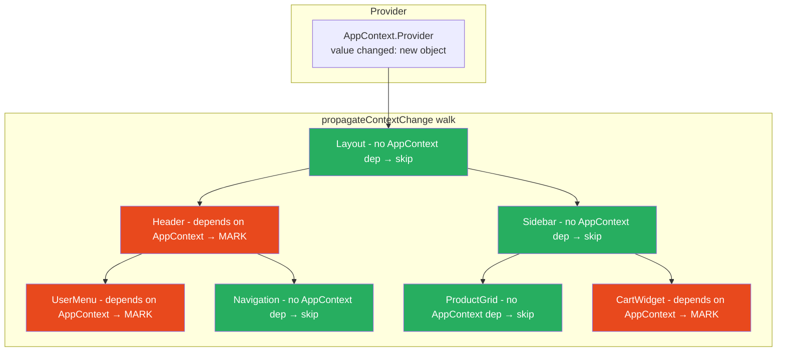
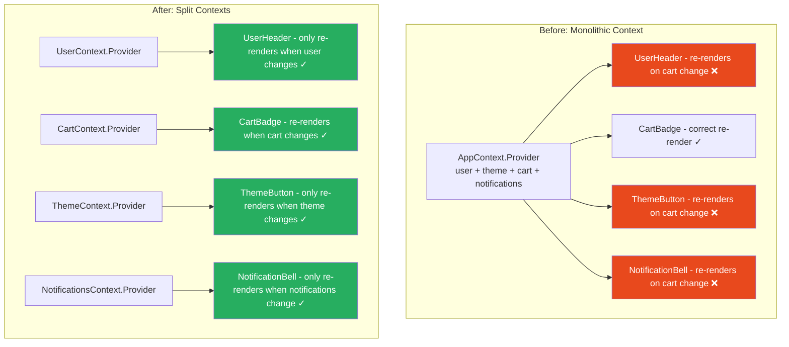

# 28 · Context Re-render Propagation

> **Context re-renders are the most misunderstood performance problem in React. The common belief is "context is slow." The truth is more precise: context with unstable values causes every consumer to re-render, regardless of which part of the value they use. Context with stable values causes zero unnecessary re-renders. The problem is not Context — it is the object references stored in context and the architectural decisions about how many contexts to use and what they contain.**

Every `useContext(SomeContext)` call subscribes the component to that context. When the Provider's value changes by reference, React propagates that change through the entire fiber subtree to find and re-render all subscribers. Understanding this propagation mechanism in detail reveals why certain context architectures are catastrophically slow and others are fast.

---

## Table of Contents

- [How Context Re-renders Are Triggered](#how-context-re-renders-are-triggered)
- [The propagateContextChange Walk](#the-propagatecontextchange-walk)
- [The Consumer Registration Mechanism](#the-consumer-registration-mechanism)
- [Why All Consumers Re-render (Not Just Affected Ones)](#why-all-consumers-re-render-not-just-affected-ones)
- [The Context Stack: How Values Are Read](#the-context-stack-how-values-are-read)
- [Nested Providers: How They Interact](#nested-providers-how-they-interact)
- [Measuring Context Re-render Impact](#measuring-context-re-render-impact)
- [The Monolithic Context Anti-Pattern](#the-monolithic-context-anti-pattern)
- [Context Splitting Strategies](#context-splitting-strategies)
- [The Memoized Value Pattern](#the-memoized-value-pattern)
- [The State-Dispatch Split Pattern](#the-state-dispatch-split-pattern)
- [Context Selectors: Working Around React's Limitations](#context-selectors-working-around-reacts-limitations)
- [When to Use Context vs Other State Solutions](#when-to-use-context-vs-other-state-solutions)
- [Architecture Diagrams](#architecture-diagrams)
- [Good Practices](#good-practices)
- [Bad Practices](#bad-practices)
- [Mental Model](#mental-model)
- [Common Misconceptions](#common-misconceptions)
- [Exercises](#exercises)
- [Further Reading](#further-reading)

---

## How Context Re-renders Are Triggered

A context consumer re-renders when its Provider's `value` prop changes. The comparison uses `Object.is`:

```js
// In ReactFiberBeginWork.js — processing a ContextProvider fiber
if (Object.is(oldValue, newValue)) {
  // VALUE UNCHANGED: no re-renders needed for consumers
  // (but Provider's children still reconcile normally)
} else {
  // VALUE CHANGED: find all consumers and mark them for re-render
  propagateContextChange(workInProgress, context, renderLanes);
}
```

The trigger conditions:

```tsx
// ✅ NO consumer re-render: primitive value unchanged
<ThemeContext.Provider value="dark">    // "dark" === "dark"
<ThemeContext.Provider value={42}>      // 42 === 42

// ❌ YES consumer re-render: new object reference
<AppContext.Provider value={{ user, count }}> // new object every render
// Object.is({}, {}) = false even with identical content

// ❌ YES consumer re-render: parent re-renders
// If the component containing the Provider re-renders:
function App() {
  const [count, setCount] = useState(0);
  return (
    // New { user: ..., theme: ... } object every time App renders
    <AppContext.Provider value={{ user, theme }}>
      {children}
    </AppContext.Provider>
  );
}
// Every count increment → App re-renders → new context value → ALL consumers re-render
```

---

## The propagateContextChange Walk

When a context value changes, React walks the entire fiber subtree of the Provider looking for consumers:

```js
function propagateContextChange(workInProgress, context, renderLanes) {
  let fiber = workInProgress.child; // start at first child

  while (fiber !== null) {
    let nextFiber;

    // Check this fiber's context dependencies
    const dependencies = fiber.dependencies;
    if (dependencies !== null) {
      nextFiber = fiber.child;
      let dependency = dependencies.firstContext;

      // Walk this fiber's dependency linked list
      while (dependency !== null) {
        if (dependency.context === context) {
          // ✅ MATCH: this component reads from the changed context
          // Mark it as needing re-render

          if (fiber.tag === ClassComponent) {
            // Class component: create a force update
            const update = createUpdate(NoTimestamp, renderLanes);
            update.tag = ForceUpdate;
            enqueueUpdate(fiber, update, renderLanes);
          }

          // Mark this fiber's lanes with the render lane
          fiber.lanes = mergeLanes(fiber.lanes, renderLanes);

          // Also mark the alternate (for double-buffering)
          const alternate = fiber.alternate;
          if (alternate !== null) {
            alternate.lanes = mergeLanes(alternate.lanes, renderLanes);
          }

          // Propagate childLanes up to the Provider
          // (ensures the work loop descends into this subtree)
          scheduleContextWorkOnParentPath(
            fiber.return,
            renderLanes,
            workInProgress,
          );

          // Update the dependency's stored lanes
          dependencies.lanes = mergeLanes(dependencies.lanes, renderLanes);
          break; // found match, done checking this fiber's deps
        }
        dependency = dependency.next; // check next context dependency
      }
    } else if (fiber.tag === ContextProvider) {
      // Nested Provider for the SAME context: don't propagate into it
      // (it has its own value and consumers below it read from the inner provider)
      nextFiber = fiber.type === workInProgress.type ? null : fiber.child;
    } else if (fiber.tag === DehydratedFragment) {
      // SSR dehydrated fragment — handle separately
      // ...
    } else {
      // Regular fiber with no context deps: continue into children
      nextFiber = fiber.child;
    }

    // Tree traversal: depth-first with sibling backtracking
    if (nextFiber !== null) {
      nextFiber.return = fiber;
    } else {
      nextFiber = fiber;
      while (nextFiber !== null) {
        if (nextFiber === workInProgress) return; // reached the Provider: done
        const sibling = nextFiber.sibling;
        if (sibling !== null) {
          sibling.return = nextFiber.return;
          nextFiber = sibling;
          break;
        }
        nextFiber = nextFiber.return;
      }
    }
    fiber = nextFiber;
  }
}
```

### The walk complexity

This traversal is O(n) where n is the number of fibers in the Provider's subtree. For a root-level Provider with 5,000 fibers in the tree, every context value change triggers a 5,000-fiber walk just to find consumers — before any consumer actually re-renders.

> 🔬 **Internals:** The `scheduleContextWorkOnParentPath` call that propagates `childLanes` upward is critical. Without it, the render phase work loop wouldn't know to descend into branches containing context consumers. By setting `childLanes` on every ancestor between the consumer and the Provider, React ensures the traversal reaches the consumer during the render phase.

---

## The Consumer Registration Mechanism

When `useContext(SomeContext)` is called inside a component, React registers a dependency:

```js
// From ReactFiberHooks.js — called by useContext
function readContext(context) {
  return readContextForConsumer(currentlyRenderingFiber, context);
}

function readContextForConsumer(consumer, context) {
  const value = isPrimaryRenderer
    ? context._currentValue
    : context._currentValue2;

  // Create a dependency record for this context
  const contextItem = {
    context: context,
    memoizedValue: value, // value at time of registration
    next: null,
  };

  // Add to this fiber's dependency linked list
  if (lastContextDependency === null) {
    consumer.dependencies = {
      lanes: NoLanes,
      firstContext: contextItem,
    };
    lastContextDependency = contextItem;
  } else {
    lastContextDependency = lastContextDependency.next = contextItem;
  }

  return value;
}
```

After a component calls `useContext(ThemeContext)` and `useContext(UserContext)`, its fiber's `dependencies` field looks like:

```js
fiber.dependencies = {
  lanes: NoLanes,
  firstContext: {
    context: ThemeContext,
    memoizedValue: "dark",
    next: {
      context: UserContext,
      memoizedValue: { name: "Alice", role: "admin" },
      next: null,
    },
  },
};
```

The `propagateContextChange` walk searches for `dependency.context === context` to find matching consumers.

---

## Why All Consumers Re-render (Not Just Affected Ones)

React does not track which properties of a context value a consumer reads. It only tracks whether a consumer reads from a particular context at all.

```tsx
// Context with multiple fields:
const AppContext = React.createContext({
  user: null,
  notifications: 0,
  theme: "light",
  language: "en",
});

function Avatar() {
  const { user } = useContext(AppContext); // reads only user
  return ;
}

function NotificationBadge() {
  const { notifications } = useContext(AppContext); // reads only notifications
  return <span>{notifications}</span>;
}
```

When `notifications` changes:

- React calls `Object.is(oldValue, newValue)` on the full context value → `false` (new object)
- `propagateContextChange` walks the tree
- Finds `Avatar`'s fiber: `dependency.context === AppContext` → **marks Avatar for re-render**
- Finds `NotificationBadge`'s fiber: same → marks for re-render

Avatar re-renders even though `user` didn't change. React has no way to know that Avatar only reads `user` — it only knows Avatar reads from `AppContext`.

### Why React doesn't implement fine-grained tracking

To track which properties are read from a context value, React would need to:

1. Wrap the context value in a Proxy that intercepts property accesses
2. Record which properties were accessed during each render
3. Compare only those specific properties when the context value changes

This is exactly what fine-grained reactivity systems (MobX, Solid.js) do. React deliberately chose not to do this for several reasons:

- Proxy has performance overhead on every property access
- It adds complexity to the mental model
- Most context values either change entirely (theme: 'light'→'dark') or don't change at all
- The fix is architectural (split contexts), not runtime (track properties)

---

## The Context Stack: How Values Are Read

React maintains an internal stack of context values as it renders. When a Provider is processed, it pushes its value onto the stack. When it completes, it pops. Consumers read from the top of the stack for their context:

```js
// Conceptual context stack:
// App renders: stack = []
// ThemeProvider renders: stack = [theme:'dark']
// Layout renders: stack = [theme:'dark'] (no push)
// NestedThemeProvider renders: stack = [theme:'dark', theme:'light'] (inner provider)
// NestedChild renders: reads theme → 'light' (reads from top of stack)
// NestedThemeProvider completes: stack = [theme:'dark']
// Sibling renders: reads theme → 'dark' (reads from top again)
```

### The actual implementation: cursor-based

React uses a cursor into a stack array rather than a JavaScript array:

```js
// From ReactFiberNewContext.js
// Each context has its own stack slot
function pushProvider(providerFiber, context, nextValue) {
  const index = context._threadCount; // unique slot for this context

  // Push value for this context
  valueCursor.current = context._currentValue; // save old value
  context._currentValue = nextValue; // set new value
}

function popProvider(providerFiber, context) {
  const currentValue = valueCursor.current; // restore old value
  context._currentValue = currentValue;
}
```

This is why nested providers work: the inner provider overwrites `_currentValue` for its subtree, and the outer value is restored when it pops.

---

## Nested Providers: How They Interact

Multiple Providers of the same context create a stack of values. Consumers receive the nearest ancestor's value:

```tsx
const ThemeContext = React.createContext("light");

function App() {
  return (
    <ThemeContext.Provider value="dark">
      {" "}
      // outer: dark
      <Header /> // reads: dark
      <ThemeContext.Provider value="light">
        {" "}
        // inner: light
        <Sidebar /> // reads: light
      </ThemeContext.Provider>
      <Footer /> // reads: dark
    </ThemeContext.Provider>
  );
}
```

### Nested Provider behavior in propagateContextChange

The `propagateContextChange` walk stops at nested Providers of the same context:

```js
} else if (fiber.tag === ContextProvider) {
  // Nested Provider for the SAME context: stop propagating into it
  nextFiber = fiber.type === workInProgress.type ? null : fiber.child;
  // fiber.type === workInProgress.type: same context type → null (don't descend)
  // Different context type → fiber.child (continue descending)
}
```

Consumers under a nested Provider only re-render when the inner Provider's value changes, not when the outer Provider's value changes. This isolation is the foundation of a useful optimization pattern: wrapping frequently-changing context updates in a nested Provider scope.

---

## Measuring Context Re-render Impact

### Finding context-triggered re-renders in DevTools

```
React DevTools → Profiler → record interaction

After recording, click each re-rendered component:
"Why did this render?"
→ "Context changed" = triggered by context update
→ "Parent re-rendered" = triggered by parent, NOT context

If many components show "Context changed":
→ Your context value is changing too frequently
→ Too many components consuming the same context
→ Context value is a new object reference on every Provider re-render
```

### Programmatic measurement

```tsx
// Count context-triggered renders:
let contextRenderCount = 0;
let totalRenderCount = 0;

function TrackedContextConsumer() {
  totalRenderCount++;
  const value = useContext(MyContext);
  // Can't distinguish "context changed" vs "parent rendered" without DevTools API
  // But: if parent doesn't change often and this component does, suspect context
  return <div>{value}</div>;
}
```

### The render cascade test

```tsx
// Test: does a specific state change cause unexpected context consumers to re-render?
function ContextAudit() {
  const [localState, setLocalState] = useState(0);

  return (
    <div>
      {/* This state change should NOT affect ExpensiveChart */}
      <button onClick={() => setLocalState((s) => s + 1)}>
        Increment local state ({localState})
      </button>

      <ContextProviderThatMightHaveProblem>
        <ExpensiveChart /> {/* should NOT re-render on local state change */}
      </ContextProviderThatMightHaveProblem>
    </div>
  );
}
```

If `ExpensiveChart` re-renders when only `localState` changes, the Provider is creating a new value on each render triggered by the parent.

---

## The Monolithic Context Anti-Pattern

The most common context performance problem: a single large context containing all application state:

```tsx
// ❌ Monolithic context: every consumer re-renders for every state change
interface AppState {
  user: User | null;
  theme: "light" | "dark";
  notifications: Notification[];
  cart: CartItem[];
  searchQuery: string;
  isLoading: boolean;
  error: Error | null;
}

const AppContext = React.createContext<AppState | null>(null);

function AppProvider({ children }: { children: React.ReactNode }) {
  const [user, setUser] = useState<User | null>(null);
  const [theme, setTheme] = useState<"light" | "dark">("light");
  const [notifications, setNotifications] = useState<Notification[]>([]);
  const [cart, setCart] = useState<CartItem[]>([]);
  const [searchQuery, setSearchQuery] = useState("");
  const [isLoading, setIsLoading] = useState(false);
  const [error, setError] = useState<Error | null>(null);

  // ❌ New object every render — triggers ALL consumers on ANY state change
  const value = {
    user,
    setUser,
    theme,
    setTheme,
    notifications,
    setNotifications,
    cart,
    setCart,
    searchQuery,
    setSearchQuery,
    isLoading,
    setIsLoading,
    error,
    setError,
  };

  return <AppContext.Provider value={value}>{children}</AppContext.Provider>;
}

// Real-world scenario:
// User types in search box → searchQuery changes → entire AppContext value changes
// → ALL consumers re-render: UserMenu, CartBadge, ThemeButton, NotificationBell, etc.
// For 30 consumers in a medium app: 30 unnecessary re-renders per keystroke
```

---

## Context Splitting Strategies

The primary fix for monolithic context: split by update frequency and by who cares about what.

### Strategy 1: Split by domain

```tsx
// ✅ Each context only triggers re-renders for related consumers
const UserContext = React.createContext<User | null>(null);
const ThemeContext = React.createContext<"light" | "dark">("light");
const CartContext = React.createContext<CartState>({ items: [], total: 0 });
const NotificationsContext = React.createContext<Notification[]>([]);
const SearchContext = React.createContext<string>("");

// Search consumer: only re-renders when searchQuery changes
function SearchBar() {
  const searchQuery = useContext(SearchContext);
  return <input value={searchQuery} />;
}

// Cart consumer: never re-renders when user types in search bar
function CartBadge() {
  const cart = useContext(CartContext);
  return <span>{cart.items.length}</span>;
}
```

### Strategy 2: Split by update frequency

Some data changes often (search query, notifications), some rarely (user identity, theme):

```tsx
// High-frequency: changes many times per session
const RealtimeContext = React.createContext<RealtimeData | null>(null);

// Low-frequency: changes once per session or less
const UserContext = React.createContext<User | null>(null);
const ThemeContext = React.createContext<Theme>("light");
const LocaleContext = React.createContext<Locale>("en-US");
```

### Strategy 3: Split state from actions

Actions (setState functions) never change. State changes on every update. Separating them means action-only components (buttons, forms) never re-render due to state changes:

```tsx
// State: changes frequently
const CartStateContext = React.createContext<CartState | null>(null);
// Actions: NEVER change (dispatch is stable)
const CartActionsContext = React.createContext<CartActions | null>(null);

function CartProvider({ children }: { children: React.ReactNode }) {
  const [state, dispatch] = useReducer(cartReducer, initialCart);

  const actions = useMemo<CartActions>(
    () => ({
      addItem: (item: CartItem) => dispatch({ type: "ADD", item }),
      removeItem: (id: string) => dispatch({ type: "REMOVE", id }),
      clearCart: () => dispatch({ type: "CLEAR" }),
    }),
    [dispatch],
  ); // dispatch is stable → actions are stable

  return (
    <CartActionsContext.Provider value={actions}>
      {/* Actions NEVER change → action consumers NEVER re-render from cart changes */}
      <CartStateContext.Provider value={state}>
        {children}
      </CartStateContext.Provider>
    </CartActionsContext.Provider>
  );
}

// Action-only component: NEVER re-renders due to cart state changes
function AddToCartButton({ product }: { product: Product }) {
  const { addItem } = useContext(CartActionsContext)!;
  return <button onClick={() => addItem(product)}>Add</button>;
}

// State consumer: re-renders when cart changes (correct behavior)
function CartTotal() {
  const { total } = useContext(CartStateContext)!;
  return <span>${total.toFixed(2)}</span>;
}
```

---

## The Memoized Value Pattern

When you can't split contexts, memoize the value to prevent unnecessary re-renders:

```tsx
function ThemeProvider({
  children,
  initialMode = "light",
}: {
  children: React.ReactNode;
  initialMode?: "light" | "dark";
}) {
  const [mode, setMode] = useState<"light" | "dark">(initialMode);
  const [fontSize, setFontSize] = useState(16);
  const [colorScheme, setColorScheme] = useState<"blue" | "green">("blue");

  // ✅ Memoized: only new object when mode, fontSize, or colorScheme changes
  const value = useMemo(
    () => ({
      mode,
      fontSize,
      colorScheme,
      toggleMode: () => setMode((m) => (m === "light" ? "dark" : "light")),
      setFontSize,
      setColorScheme,
    }),
    [mode, fontSize, colorScheme],
    // setMode, setFontSize, setColorScheme are stable (dispatch functions)
    // toggleMode is recreated when mode changes (but that's correct — mode IS changing)
  );

  return (
    <ThemeContext.Provider value={value}>{children}</ThemeContext.Provider>
  );
}
```

### When memoization isn't enough

If the Provider's parent re-renders frequently (e.g., it's inside an animation loop), every parent render triggers the useMemo comparison — and if any dep changes, all consumers re-render. Memoization prevents spurious re-renders from parent re-renders; it doesn't prevent re-renders from actual value changes.

---

## The State-Dispatch Split Pattern

The cleanest pattern for complex state management with context:

```tsx
// Complete implementation: shopping cart with state-dispatch split

type CartItem = {
  id: string;
  productId: string;
  quantity: number;
  price: number;
};
type CartState = {
  items: CartItem[];
  total: number;
  itemCount: number;
};
type CartAction =
  | { type: "ADD"; item: Omit<CartItem, "id"> }
  | { type: "REMOVE"; id: string }
  | { type: "UPDATE"; id: string; quantity: number }
  | { type: "CLEAR" };

// Separate contexts
const CartStateContext = React.createContext<CartState | undefined>(undefined);
const CartDispatchContext = React.createContext<
  React.Dispatch<CartAction> | undefined
>(undefined);

// Custom hooks for type-safe access
export function useCartState(): CartState {
  const ctx = useContext(CartStateContext);
  if (!ctx) throw new Error("useCartState must be used inside CartProvider");
  return ctx;
}

export function useCartDispatch(): React.Dispatch<CartAction> {
  const ctx = useContext(CartDispatchContext);
  if (!ctx) throw new Error("useCartDispatch must be used inside CartProvider");
  return ctx;
}

// Reducer
function cartReducer(state: CartState, action: CartAction): CartState {
  switch (action.type) {
    case "ADD": {
      const id = crypto.randomUUID();
      const items = [...state.items, { ...action.item, id }];
      return {
        items,
        total: items.reduce((sum, i) => sum + i.price * i.quantity, 0),
        itemCount: items.reduce((sum, i) => sum + i.quantity, 0),
      };
    }
    case "REMOVE": {
      const items = state.items.filter((i) => i.id !== action.id);
      return {
        items,
        total: items.reduce((sum, i) => sum + i.price * i.quantity, 0),
        itemCount: items.reduce((sum, i) => sum + i.quantity, 0),
      };
    }
    case "CLEAR":
      return { items: [], total: 0, itemCount: 0 };
    default:
      return state;
  }
}

// Provider
export function CartProvider({ children }: { children: React.ReactNode }) {
  const [state, dispatch] = useReducer(cartReducer, {
    items: [],
    total: 0,
    itemCount: 0,
  });

  // dispatch is stable — never changes after mount
  // CartDispatchContext consumers: NEVER re-render due to cart changes

  return (
    <CartDispatchContext.Provider value={dispatch}>
      <CartStateContext.Provider value={state}>
        {children}
      </CartStateContext.Provider>
    </CartDispatchContext.Provider>
  );
}
```

---

## Context Selectors: Working Around React's Limitations

React's built-in `useContext` re-renders on any value change. For fine-grained subscriptions, you need to implement selectors:

### Approach 1: `use-context-selector` library

```tsx
import { createContext, useContextSelector } from "use-context-selector";

const AppContext = createContext(initialState);

// Only re-renders when user.name changes — not when other fields change
function UserName() {
  const name = useContextSelector(AppContext, (state) => state.user.name);
  return <span>{name}</span>;
}

// Only re-renders when notifications.length changes
function NotificationCount() {
  const count = useContextSelector(
    AppContext,
    (state) => state.notifications.length,
  );
  return <span>{count}</span>;
}
```

`use-context-selector` uses a subscription model with an external store — it doesn't use React's built-in `useContext` at all. Instead, it subscribes each consumer to the store and only triggers re-renders when the selected value changes.

### Approach 2: `useSyncExternalStore` for context-like behavior

```tsx
// Implementing selector-based context with useSyncExternalStore
function createSelectableContext<T>(initialValue: T) {
  // External store (not React state)
  let currentValue = initialValue;
  const listeners = new Set<() => void>();

  const store = {
    getSnapshot: () => currentValue,
    subscribe: (callback: () => void) => {
      listeners.add(callback);
      return () => listeners.delete(callback);
    },
    setValue: (newValue: T) => {
      if (!Object.is(currentValue, newValue)) {
        currentValue = newValue;
        listeners.forEach((l) => l()); // notify subscribers
      }
    },
  };

  function Provider({
    value,
    children,
  }: {
    value: T;
    children: React.ReactNode;
  }) {
    useEffect(() => {
      store.setValue(value);
    }, [value]);

    return <>{children}</>;
  }

  function useSelector<S>(selector: (value: T) => S): S {
    return React.useSyncExternalStore(
      store.subscribe,
      () => selector(store.getSnapshot()),
      () => selector(initialValue), // SSR snapshot
    );
  }

  return { Provider, useSelector };
}
```

### Approach 3: React 18's `useTransition` for deferred context

```tsx
// Mark expensive context consumers as non-urgent
function ExpensiveConsumer() {
  const [isPending, startTransition] = useTransition();

  // The context subscription is still there
  // But state updates to this component can be deferred
  // when higher-priority work is pending
  const { expensiveData } = useContext(DataContext);

  return (
    <div style={{ opacity: isPending ? 0.7 : 1 }}>
      <ExpensiveVisualization data={expensiveData} />
    </div>
  );
}
```

---

## When to Use Context vs Other State Solutions

Context is the right tool when:

- Data is genuinely global (theme, locale, auth state, feature flags)
- Data changes infrequently or synchronously
- All consumers need the exact same data (no subsetting)
- The component tree is not extremely large

Context is the wrong tool when:

- Many components need fine-grained subscriptions to slices of large state
- State changes very frequently (100+ times/second)
- You need optimistic updates, caching, or server synchronization
- Performance is critical and consumers are scattered throughout large trees

| Scenario           | Best Tool                                       |
| ------------------ | ----------------------------------------------- |
| Theme (dark/light) | Context (changes rarely, all consumers need it) |
| Auth state         | Context (global, stable)                        |
| User preferences   | Context (stable)                                |
| API request state  | TanStack Query / SWR                            |
| Form state         | Local useState or React Hook Form               |
| Complex UI state   | Zustand / Jotai (fine-grained subscriptions)    |
| Real-time data     | useSyncExternalStore with external store        |
| Shopping cart      | Context (state-dispatch split) or Zustand       |

---

## Architecture Diagrams

### Context value change: who re-renders and who doesn't



### Context splitting: before and after



---

## Good Practices

### ✅ Good Practice — Context hierarchy matched to update frequency

```tsx
/**
 * Good: Contexts are layered from most to least stable.
 * Each context layer only affects consumers that need it.
 * High-frequency updates don't cascade to stable data consumers.
 */
function AppProviders({ children }: { children: React.ReactNode }) {
  return (
    // Level 1: Never changes after login (user session)
    <AuthContext.Provider value={authValue}>
      {/* Level 2: Changes at most once per session (theme, locale) */}
      <PreferencesContext.Provider value={preferencesValue}>
        {/* Level 3: Changes periodically (minutes) */}
        <FeatureFlagsContext.Provider value={featureFlagsValue}>
          {/* Level 4: Changes frequently (seconds) — wrapped with useMemo */}
          <NotificationsContext.Provider value={notificationsValue}>
            {/* Level 5: Changes on every user action (cart, search) — split state/dispatch */}
            <CartDispatchContext.Provider value={cartDispatch}>
              <CartStateContext.Provider value={cartState}>
                {children}
              </CartStateContext.Provider>
            </CartDispatchContext.Provider>
          </NotificationsContext.Provider>
        </FeatureFlagsContext.Provider>
      </PreferencesContext.Provider>
    </AuthContext.Provider>
  );
}
```

**Why this works:** Each context is isolated. A notification arriving does not re-render auth consumers, theme buttons, or feature flag gates. Cart updates do not re-render notification badges. The nesting ensures consumers only subscribe to the contexts they need, and each context only changes when its specific data changes.

---

## Bad Practices

### ⚠️ Bad Practice — Object created inline in Provider value

```tsx
/**
 * Bad: Provider value is an object literal created inline.
 * Every render of the containing component creates a new object.
 * ALL consumers re-render on EVERY parent render.
 *
 * Scenario: App has a document title state (changes on navigation).
 * Navigation → App re-renders → new AppContext value → ALL 50 consumers re-render.
 * Even CartBadge, UserAvatar, ThemeButton — completely unrelated to navigation.
 */
function App() {
  const [title, setTitle] = useState("Home");
  const [user, setUser] = useState<User | null>(null);
  const [theme, setTheme] = useState<"light" | "dark">("light");

  return (
    // ❌ New object every time App renders (on any state change)
    <AppContext.Provider
      value={{
        title,
        user,
        theme,
        setTitle,
        setUser,
        setTheme,
      }}
    >
      <Router>
        <header>
          <h1>{title}</h1>
          <UserAvatar /> {/* re-renders on title change ❌ */}
          <ThemeToggle /> {/* re-renders on title change ❌ */}
          <CartBadge /> {/* re-renders on title change ❌ */}
          <NotificationBell /> {/* re-renders on title change ❌ */}
        </header>
        <MainContent />
      </Router>
    </AppContext.Provider>
  );
}

/**
 * ✅ Fix 1: Split into focused contexts
 */
function App() {
  return (
    <TitleContext.Provider value={title}>
      <UserContext.Provider value={user}>
        <ThemeContext.Provider value={theme}>
          <Router>
            <header>
              <h1>
                <TitleDisplay />
              </h1>{" "}
              {/* only re-renders when title changes */}
              <UserAvatar /> {/* only re-renders when user changes */}
              <ThemeToggle /> {/* only re-renders when theme changes */}
              <CartBadge /> {/* has its own context - unaffected */}
              <NotificationBell /> {/* has its own context - unaffected */}
            </header>
          </Router>
        </ThemeContext.Provider>
      </UserContext.Provider>
    </TitleContext.Provider>
  );
}
```

**Production impact:** In a medium-complexity app with 50 context consumers and navigation that changes the title (PageTitle component updates on route change), every navigation event triggers 50 re-renders instead of 1. At 50 components averaging 1ms each = 50ms of blocking work on every navigation. Users experience page transitions that feel sluggish because 50ms of blocking work delays the browser from painting the new page content.

---

## Mental Model

> 💡 **The context re-render mental model:**
>
> Context is like a **company-wide email list**. When the company sends an email to the "AllStaff" list, every employee who subscribed gets it and must stop to read it — even if the email is only relevant to the accounting department. React's context works the same way: when the value changes, every subscriber (useContext consumer) receives a notification and must re-render — even if the part they use didn't change. The fix is not one giant email list but many focused lists: "Accounting," "Engineering," "Marketing." Employees only subscribe to the lists relevant to their work. When accounting sends an update, only accounting employees are interrupted — engineering continues working. This is context splitting: one context per concern, sized to its audience.

---

## Common Misconceptions

### "Context is inherently slow"

Context with stable references and appropriate splitting is fast. Context with unstable references (new object every render) and a monolithic structure is slow. The performance characteristic is a function of how you use it, not the API itself.

### "useMemo in the Provider fixes all context performance issues"

`useMemo` prevents re-renders caused by the Provider's parent re-rendering (when the memoized deps haven't changed). It doesn't prevent re-renders when the actual context data changes — those should cause re-renders. And it doesn't address the "I used only one property but re-render when any property changes" issue.

### "Splitting into more contexts always helps"

Splitting helps when consumers only need a subset of the monolithic context. If you split into 10 contexts but every component still uses all 10, you've added complexity without performance benefit.

### "Context consumers can opt out of re-renders with React.memo"

`React.memo` prevents re-renders caused by parent re-renders with unchanged props. Context changes bypass `React.memo` — they go directly through the `propagateContextChange` walk, which marks fibers regardless of `React.memo`.

### "The context propagation walk is only expensive for large trees"

The propagation walk is O(n) where n is the subtree size. For any tree size, the walk visits every fiber between the Provider and the consumers. For a root Provider with 10,000 fibers, every value change costs a 10,000-fiber traversal even if there are only 3 consumers. This is why root-level Providers with frequently-changing values are particularly problematic.

---

## Exercises

### Exercise 1 — Measure the propagation walk

Build an app with a root-level Provider and 100 child components (some consumers, some not). Using `performance.mark()`:

```tsx
function measure() {
  performance.mark("context-change-start");
  setContextValue(newValue); // triggers propagateContextChange
  // After re-render:
  performance.mark("context-change-end");
  performance.measure(
    "context-change",
    "context-change-start",
    "context-change-end",
  );
}
```

Measure the time with 100, 500, 1000, 5000 total components. How does it scale? Then reduce consumer count while keeping total component count the same — does time decrease?

### Exercise 2 — Observe context bailout for nested Providers

```tsx
const ThemeContext = React.createContext("light");

function App() {
  const [outerTheme, setOuterTheme] = useState("dark");

  return (
    <ThemeContext.Provider value={outerTheme}>
      <Outer />
      <ThemeContext.Provider value="light">
        {/* This subtree uses a different Provider */}
        <Inner />
      </ThemeContext.Provider>
    </ThemeContext.Provider>
  );
}

let outerRenders = 0,
  innerRenders = 0;
function Outer() {
  outerRenders++;
  return useContext(ThemeContext);
}
function Inner() {
  innerRenders++;
  return useContext(ThemeContext);
}
```

Change `outerTheme`. Observe: does `Inner` re-render? Why or why not?

### Exercise 3 — Implement context with selector

Build a `createSelectorContext` function that:

1. Accepts an initial value
2. Returns a `Provider` component and a `useSelector` hook
3. `useSelector` accepts a selector function: `(value) => selectedValue`
4. Only re-renders when the selected value changes (not when the entire value changes)

Test: put 3 components that each select a different field. Change one field. Only the component that selected that field should re-render.

---

## Further Reading

- [React Source: ReactFiberNewContext.js](https://github.com/facebook/react/blob/main/packages/react-reconciler/src/ReactFiberNewContext.js) — Complete context implementation including propagateContextChange
- [React Source: ReactFiberBeginWork.js — updateContextProvider](https://github.com/facebook/react/blob/main/packages/react-reconciler/src/ReactFiberBeginWork.js) — When context value change is detected
- [use-context-selector library](https://github.com/dai-shi/use-context-selector) — Selector-based context subscriptions
- [Daishi Kato: Why you should not use Context in React](https://blog.axlight.com/posts/why-you-should-not-use-context-in-react/) — Deep performance analysis
- [Alex Sidorenko: How to use React Context effectively](https://www.developerway.com/posts/how-to-use-react-context-effectively) — Architecture patterns
- [React Docs: Passing Data Deeply with Context](https://react.dev/learn/passing-data-deeply-with-context) — Official guide
- Next in this handbook: [29 · Re-render Optimization Patterns](./09-optimization-patterns.md)

---

_Part of the [React + Next.js Engineering Handbook](../../README.md)_
