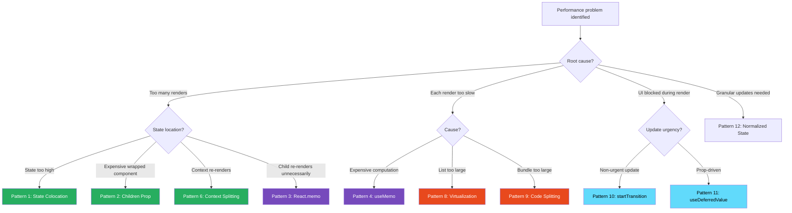
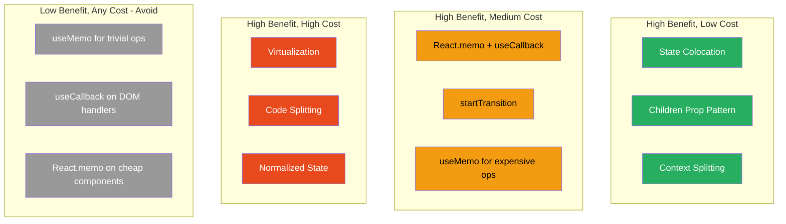

# 29 · Re-render Optimization Patterns

> **Re-render optimization is the discipline of ensuring React's reconciler only calls component functions when the UI actually needs to change. The patterns in this document form a complete toolkit — from the cheapest architectural solutions (colocation, children prop) to targeted memoization (React.memo, useMemo, useCallback) to advanced techniques (virtualization, windowing, granular subscriptions). Each pattern has a cost, a benefit, and a precise set of conditions where it applies.**

The most expensive mistake in React optimization is applying expensive solutions (useMemo, useCallback, React.memo) to cheap problems — or solving symptoms rather than causes. This document presents every meaningful optimization pattern with its cost model, when to apply it, and how to measure whether it's working.

---

## Table of Contents

- [The Optimization Decision Framework](#the-optimization-decision-framework)
- [Pattern 1: State Colocation](#pattern-1-state-colocation)
- [Pattern 2: The Children Prop Escape Hatch](#pattern-2-the-children-prop-escape-hatch)
- [Pattern 3: React.memo](#pattern-3-reactmemo)
- [Pattern 4: useMemo for Expensive Computations](#pattern-4-usememo-for-expensive-computations)
- [Pattern 5: useCallback for Stable Function References](#pattern-5-usecallback-for-stable-function-references)
- [Pattern 6: Context Splitting](#pattern-6-context-splitting)
- [Pattern 7: State-Dispatch Separation](#pattern-7-state-dispatch-separation)
- [Pattern 8: Virtualization and Windowing](#pattern-8-virtualization-and-windowing)
- [Pattern 9: Code Splitting and Lazy Loading](#pattern-9-code-splitting-and-lazy-loading)
- [Pattern 10: startTransition for Non-Urgent Updates](#pattern-10-starttransition-for-non-urgent-updates)
- [Pattern 11: useDeferredValue for Stale-While-Computing](#pattern-11-usedeferredvalue-for-stale-while-computing)
- [Pattern 12: Granular State Updates](#pattern-12-granular-state-updates)
- [Measuring Optimization Effectiveness](#measuring-optimization-effectiveness)
- [The Optimization Priority Order](#the-optimization-priority-order)
- [Architecture Diagrams](#architecture-diagrams)
- [Good Practices](#good-practices)
- [Bad Practices](#bad-practices)
- [Mental Model](#mental-model)
- [Exercises](#exercises)
- [Further Reading](#further-reading)

---

## The Optimization Decision Framework

Before applying any optimization, answer these questions in order:

```
1. Is there actually a performance problem?
   → Measure first. React DevTools Profiler → find the slow renders.
   → Don't optimize what you haven't measured.

2. What is the root cause?
   → Too many renders? → Colocation, children prop, React.memo
   → Each render too slow? → useMemo, virtualization, code splitting
   → Blocked thread? → startTransition, Web Workers

3. What is the cheapest fix?
   → Architecture first (colocation, children prop) — zero runtime cost
   → Memoization second (React.memo, useMemo) — small runtime cost
   → Virtualization for large lists — significant complexity cost
   → Concurrent features last (startTransition) — API complexity

4. Did the fix work?
   → Measure again. Compare before/after Profiler data.
   → If not improved: remove the optimization (avoid dead code).
```

---

## Pattern 1: State Colocation

**Cost:** Zero. No added runtime overhead.
**Benefit:** Eliminates entire subtrees from re-render scope.
**When to use:** When state lives higher in the tree than necessary.

```tsx
// ❌ State too high: all siblings re-render on toggle
function ProductPage({ product }: { product: Product }) {
  const [showDetails, setShowDetails] = useState(false);
  // showDetails only matters for Description
  // But ProductImages, Reviews, RelatedProducts all re-render on toggle

  return (
    <>
      <ProductImages product={product} />
      <Description
        product={product}
        showDetails={showDetails}
        onToggle={() => setShowDetails((v) => !v)}
      />
      <Reviews productId={product.id} />
      <RelatedProducts category={product.category} />
    </>
  );
}

// ✅ State colocated: only Description subtree re-renders on toggle
function ProductPage({ product }: { product: Product }) {
  // No showDetails here — ProductPage never re-renders for toggle
  return (
    <>
      <ProductImages product={product} />
      <Description product={product} /> {/* owns its own toggle state */}
      <Reviews productId={product.id} />
      <RelatedProducts category={product.category} />
    </>
  );
}

function Description({ product }: { product: Product }) {
  const [showDetails, setShowDetails] = useState(false); // ← colocated
  return (
    <div>
      <p>{showDetails ? product.fullDescription : product.shortDescription}</p>
      <button onClick={() => setShowDetails((v) => !v)}>
        {showDetails ? "Less" : "More"}
      </button>
    </div>
  );
}
```

### When colocation isn't possible

Colocation fails when multiple siblings genuinely need the same state. In that case, use the children prop pattern or lift state to the lowest common ancestor.

---

## Pattern 2: The Children Prop Escape Hatch

**Cost:** Zero. No added runtime overhead.
**Benefit:** Prevents re-renders of stable subtrees inside re-rendering containers.
**When to use:** When a component manages its own state that causes re-renders, and that component wraps other expensive components.

```tsx
// ❌ Without children prop: ExpensiveContent re-renders on every scroll
function ScrollTracker() {
  const [scrollY, setScrollY] = useState(0);

  return (
    <div
      style={{ height: "100vh", overflow: "auto" }}
      onScroll={(e) => setScrollY(e.currentTarget.scrollTop)}
    >
      <div style={{ position: "sticky", top: 0 }}>Scroll: {scrollY}px</div>
      <ExpensiveContent />{" "}
      {/* re-renders 60+ times per second while scrolling */}
    </div>
  );
}

// ✅ With children prop: ExpensiveContent never re-renders from scroll
function ScrollTracker({ children }: { children: React.ReactNode }) {
  const [scrollY, setScrollY] = useState(0);

  return (
    <div
      style={{ height: "100vh", overflow: "auto" }}
      onScroll={(e) => setScrollY(e.currentTarget.scrollTop)}
    >
      <div style={{ position: "sticky", top: 0 }}>Scroll: {scrollY}px</div>
      {children} {/* element objects from caller — not created here */}
    </div>
  );
}

// Usage: ExpensiveContent is created in App's scope, not ScrollTracker's
function App() {
  return (
    <ScrollTracker>
      <ExpensiveContent /> {/* stable element objects passed as children */}
    </ScrollTracker>
  );
}
```

### The slot pattern: multiple stable regions

```tsx
function AnimatedLayout({
  header,
  sidebar,
  main,
}: {
  header: React.ReactNode;
  sidebar: React.ReactNode;
  main: React.ReactNode;
}) {
  const [animationStep, setAnimationStep] = useState(0);

  // All three regions are stable — created by parent, not this component
  // animationStep changes don't cause them to re-render

  return (
    <div className={`layout step-${animationStep}`}>
      <nav>{header}</nav>
      <aside>{sidebar}</aside>
      <main>{main}</main>
    </div>
  );
}
```

---

## Pattern 3: React.memo

**Cost:** Shallow equality check on every parent render.
**Benefit:** Skips component function call when props are shallowly equal.
**When to use:** When a parent re-renders frequently, a child is expensive to render, and the child's props are stable when the parent re-renders.

```tsx
// Requires: parent re-renders, child props don't always change, child is expensive
const ExpensiveChart = React.memo(function Chart({
  data,
  config,
  onDataPointClick,
}: ChartProps) {
  // Expensive: renders 1000+ SVG elements
  return (
    <svg>
      {data.map((point, i) => (
        <circle
          key={i}
          cx={point.x}
          cy={point.y}
          onClick={() => onDataPointClick(point)}
        />
      ))}
    </svg>
  );
});

function Dashboard() {
  const [filterPeriod, setFilterPeriod] = useState("7d");
  const [notifications, setNotifications] = useState<Notification[]>([]);

  const chartData = useChartData(filterPeriod); // data for the chart

  // Stable: only changes when filterPeriod changes
  const chartConfig = useMemo(
    () => ({ period: filterPeriod, animated: true }),
    [filterPeriod],
  );

  // Stable: doesn't depend on anything that changes frequently
  const handleDataPointClick = useCallback(
    (point: DataPoint) => showDetailPanel(point),
    [],
  );

  return (
    <div>
      <FilterBar period={filterPeriod} onChange={setFilterPeriod} />
      <NotificationList notifications={notifications} /> {/* changes often */}
      <ExpensiveChart
        data={chartData} // stable until filterPeriod changes
        config={chartConfig} // memoized: stable ref
        onDataPointClick={handleDataPointClick} // stable ref
      />
    </div>
  );
}
// Notifications changing does NOT cause ExpensiveChart to re-render ✅
// filterPeriod changing DOES cause ExpensiveChart to re-render ✅ (data changed)
```

### React.memo with custom comparison

```tsx
// Custom comparison: control exactly what counts as "changed"
const DataRow = React.memo(
  function DataRow({ row, isSelected, onSelect }: DataRowProps) {
    return (
      <tr
        className={isSelected ? "selected" : ""}
        onClick={() => onSelect(row.id)}
      >
        <td>{row.name}</td>
        <td>{row.value}</td>
      </tr>
    );
  },
  (prev, next) => {
    // Only re-render when id, name, value, or isSelected changes
    // Ignore: changes to onSelect (stable via useCallback)
    return (
      prev.row.id === next.row.id &&
      prev.row.name === next.row.name &&
      prev.row.value === next.row.value &&
      prev.isSelected === next.isSelected
    );
    // Note: if onSelect is NOT useCallback'd in parent, this custom
    // comparator correctly ignores the new function reference
  },
);
```

### When React.memo is NOT worth it

```tsx
// ❌ React.memo on components that:
// 1. Always receive new props (nothing stable to bail out on)
const AlwaysNew = React.memo(({ timestamp }: { timestamp: number }) => {
  // timestamp changes every render → memo never bails out
  // But comparison still runs → overhead with zero benefit
  return <span>{new Date(timestamp).toLocaleString()}</span>;
});

// 2. Have very cheap renders
const SimpleLabel = React.memo(({ text }: { text: string }) => {
  // <span>{text}</span> takes ~0.01ms — comparison costs ~0.005ms
  // Not worth the cognitive overhead and maintenance cost
  return <span>{text}</span>;
});

// 3. Are not in performance-critical paths
// If the parent renders rarely (user clicks), the savings don't matter
```

---

## Pattern 4: useMemo for Expensive Computations

**Cost:** Dep comparison + cache lookup on every render.
**Benefit:** Skips expensive computation when deps unchanged.
**When to use:** Computation takes >1ms AND runs on non-trivially frequent renders AND deps are stable.

```tsx
function ReportBuilder({ rawData, config }: ReportBuilderProps) {
  // ✅ useMemo: aggregateReport takes 50ms on large datasets
  const report = useMemo(
    () => aggregateReport(rawData, config),
    [rawData, config], // only recompute when data or config changes
  );

  // ✅ useMemo: produces stable reference for memoized child
  const chartConfig = useMemo(
    () => ({
      type: config.chartType,
      colors: config.colorScheme,
      animated: !config.exportMode,
    }),
    [config.chartType, config.colorScheme, config.exportMode],
  );

  // ❌ NOT useMemo: these are trivial
  const hasData = rawData.length > 0; // 0.001ms
  const title = `Report: ${config.name}`; // 0.001ms
  const itemCount = report.sections.length; // 0.001ms

  return (
    <div>
      <h1>{title}</h1>
      {hasData && <ReportSummary data={report} />}
      <MemoizedChart config={chartConfig} />
    </div>
  );
}
```

### useMemo for reference stability (not computation savings)

```tsx
// useMemo to produce stable object reference — even if computation is trivial
function ThemeProvider({ mode, children }: ThemeProviderProps) {
  // ✅ useMemo for stable Context value — not because object creation is expensive
  const contextValue = useMemo(
    () => ({
      mode,
      colors: getColorScheme(mode), // fast call — but we need stable reference
      toggleMode: () => setMode((m) => (m === "light" ? "dark" : "light")),
    }),
    [mode], // only new object when mode changes
  );

  return (
    <ThemeContext.Provider value={contextValue}>
      {children}
    </ThemeContext.Provider>
  );
}
```

---

## Pattern 5: useCallback for Stable Function References

**Cost:** Dep comparison + cache lookup on every render.
**Benefit:** Returns same function reference when deps unchanged.
**When to use:** Function is passed to a React.memo'd component OR used as a useEffect dep AND caller re-renders frequently.

```tsx
function SearchPage() {
  const [query, setQuery] = useState("");
  const [results, setResults] = useState<Result[]>([]);
  const [page, setPage] = useState(1);

  // ✅ useCallback: passed to React.memo'd ResultsList, stable when neither dep changes
  const handleResultClick = useCallback(
    (result: Result) => {
      trackClick(result.id);
      navigateTo(result.url);
    },
    [], // no deps: trackClick and navigateTo are module-level stable
  );

  // ✅ useCallback: used as useEffect dependency
  const fetchResults = useCallback(
    async (q: string, p: number) => {
      const data = await searchAPI(q, p);
      setResults(data.items);
    },
    [], // setResults is stable
  );

  useEffect(() => {
    if (query) fetchResults(query, page);
  }, [query, page, fetchResults]); // fetchResults is stable → effect only re-runs when query/page changes

  // ❌ NOT useCallback:
  // Functions only passed to regular DOM elements
  const handleFormSubmit = (e: React.FormEvent) => {
    e.preventDefault();
    fetchResults(query, 1);
  };
  // <form onSubmit={handleFormSubmit}>: DOM elements don't check prop equality

  return (
    <form onSubmit={handleFormSubmit}>
      <input value={query} onChange={(e) => setQuery(e.target.value)} />
      <ResultsList results={results} onResultClick={handleResultClick} />
    </form>
  );
}
```

---

## Pattern 6: Context Splitting

**Cost:** More Provider components in tree. Conceptually more complex.
**Benefit:** Eliminates cross-concern re-renders.
**When to use:** Multiple unrelated pieces of state in one context.

(Fully covered in the previous document — see [Context Re-render Propagation](./08-context-rerenders.md))

```tsx
// Quick reference: the split pattern
// Instead of one monolithic context:
const AppContext = React.createContext<AppState | null>(null);

// Use focused contexts:
const AuthContext = React.createContext<User | null>(null); // stable
const ThemeContext = React.createContext<Theme>("light"); // rare changes
const CartContext = React.createContext<CartState | null>(null); // frequent changes
const CartDispatchContext = React.createContext<CartDispatch | null>(null); // stable
```

---

## Pattern 7: State-Dispatch Separation

**Cost:** Two contexts per feature instead of one.
**Benefit:** Action-dispatching components never re-render from state changes.
**When to use:** Components that only dispatch (buttons, forms) are expensive and shouldn't re-render when state changes.

```tsx
// Full pattern with custom hooks:
export function useAppState() {
  const ctx = useContext(AppStateContext);
  if (!ctx) throw new Error("useAppState must be inside AppProvider");
  return ctx;
}

export function useAppDispatch() {
  const ctx = useContext(AppDispatchContext);
  if (!ctx) throw new Error("useAppDispatch must be inside AppProvider");
  return ctx;
}

// Pure action component: NEVER re-renders from state changes
function SubmitOrderButton() {
  const dispatch = useAppDispatch(); // stable dispatch
  return (
    <button onClick={() => dispatch({ type: "SUBMIT_ORDER" })}>
      Submit Order
    </button>
  );
}

// Pure display component: re-renders when order state changes
function OrderSummary() {
  const { order } = useAppState();
  return <div>Total: ${order.total}</div>;
}
```

---

## Pattern 8: Virtualization and Windowing

**Cost:** Significantly more complex rendering logic. Scroll position tracking.
**Benefit:** O(viewport) rendering instead of O(total items). Essential for 1000+ item lists.
**When to use:** Lists/grids with 100+ items where each item is non-trivial to render.

```tsx
import { FixedSizeList, VariableSizeList } from "react-window";
import AutoSizer from "react-virtualized-auto-sizer";

// Fixed-height items
function VirtualizedProductList({ products }: { products: Product[] }) {
  const renderProduct = useCallback(
    ({ index, style }: { index: number; style: React.CSSProperties }) => (
      <div style={style}>
        <ProductCard product={products[index]} />
      </div>
    ),
    [products],
  );

  return (
    <AutoSizer>
      {({ height, width }) => (
        <FixedSizeList
          height={height}
          width={width}
          itemCount={products.length}
          itemSize={120} // pixels per item
          overscanCount={5} // render 5 extra items above/below viewport
        >
          {renderProduct}
        </FixedSizeList>
      )}
    </AutoSizer>
  );
}

// Variable-height items (e.g., messages with different content lengths)
function VirtualizedMessageList({ messages }: { messages: Message[] }) {
  const listRef = useRef<VariableSizeList>(null);
  const heightCache = useRef<{ [index: number]: number }>({});

  const getItemHeight = useCallback(
    (index: number) => heightCache.current[index] ?? 80, // default 80px
    [],
  );

  const renderMessage = useCallback(
    ({ index, style }: { index: number; style: React.CSSProperties }) => (
      <div
        style={style}
        ref={(el) => {
          if (el) {
            const height = el.getBoundingClientRect().height;
            if (heightCache.current[index] !== height) {
              heightCache.current[index] = height;
              listRef.current?.resetAfterIndex(index); // recalculate from this index
            }
          }
        }}
      >
        <MessageBubble message={messages[index]} />
      </div>
    ),
    [messages],
  );

  return (
    <AutoSizer>
      {({ height, width }) => (
        <VariableSizeList
          ref={listRef}
          height={height}
          width={width}
          itemCount={messages.length}
          itemSize={getItemHeight}
        >
          {renderMessage}
        </VariableSizeList>
      )}
    </AutoSizer>
  );
}
```

### When virtualization is necessary

```
List item render time: 1ms
List items: 10,000
Without virtualization: 10,000ms to render full list (10 seconds — unusable)
With virtualization (20 visible items): 20ms to render (acceptable)

List item render time: 0.1ms
List items: 100
Without virtualization: 10ms (acceptable)
With virtualization: adds complexity for no meaningful benefit
```

**Rule of thumb:** Virtualize when `itemCount × itemRenderTime > 100ms`.

---

## Pattern 9: Code Splitting and Lazy Loading

**Cost:** Loading spinner during first load of each chunk. Build complexity.
**Benefit:** Initial bundle smaller. Faster first meaningful paint.
**When to use:** Routes, heavy components, rarely-used features.

```tsx
import { lazy, Suspense } from "react";

// Route-level code splitting (most impactful)
const Dashboard = lazy(() => import("./pages/Dashboard"));
const Analytics = lazy(() => import("./pages/Analytics"));
const Settings = lazy(() => import("./pages/Settings"));
const AdminPanel = lazy(() => import("./pages/AdminPanel"));

function App() {
  const { route } = useRouter();

  return (
    <Suspense fallback={<PageSkeleton />}>
      {route === "/" && <Dashboard />}
      {route === "/analytics" && <Analytics />}
      {route === "/settings" && <Settings />}
      {route === "/admin" && <AdminPanel />}
    </Suspense>
  );
}

// Component-level lazy loading for heavy features
const RichTextEditor = lazy(() => import("./components/RichTextEditor"));
const DataVisualization = lazy(() => import("./components/DataVisualization"));
const VideoPlayer = lazy(() => import("./components/VideoPlayer"));

// Preloading on hover (better UX)
const preloadComponent = (importFn: () => Promise<unknown>) => {
  const modulePromise = importFn();
  return () => {}; // cleanup (nothing to clean up)
};

function NavigationLink({ to, label }: { to: string; label: string }) {
  return (
    <a
      href={to}
      onMouseEnter={() => {
        // Preload on hover — usually loads before click
        if (to === "/analytics") import("./pages/Analytics");
        if (to === "/settings") import("./pages/Settings");
      }}
    >
      {label}
    </a>
  );
}
```

### Bundle splitting strategy

```
Priority order for code splitting:
1. Routes (biggest impact — user only loads what they visit)
2. Modals and overlays (loaded on trigger, not on page load)
3. Heavy third-party libraries (chart libraries, editors, players)
4. Admin/privileged features (rarely accessed by most users)
5. Below-the-fold content (defer until visible)
```

---

## Pattern 10: startTransition for Non-Urgent Updates

**Cost:** UI shows stale content during transition (must handle isPending state).
**Benefit:** Input stays responsive during expensive renders.
**When to use:** User input must be instant AND the resulting render is expensive (>16ms).

```tsx
function SearchInterface() {
  const [inputValue, setInputValue] = useState("");
  const [searchResults, setSearchResults] = useState<Result[]>([]);
  const [isPending, startTransition] = useTransition();

  const handleInput = (e: React.ChangeEvent<HTMLInputElement>) => {
    const value = e.target.value;

    // Urgent: input must reflect immediately
    setInputValue(value);

    // Non-urgent: results can lag behind
    startTransition(() => {
      const results = computeSearchResults(value); // potentially expensive
      setSearchResults(results);
    });
  };

  return (
    <div>
      <input
        value={inputValue}
        onChange={handleInput}
        placeholder="Search..."
      />
      {/* Visual feedback while transition is pending */}
      <div style={{ opacity: isPending ? 0.6 : 1, transition: "opacity 0.2s" }}>
        <SearchResults results={searchResults} />
      </div>
      {isPending && <LoadingIndicator />}
    </div>
  );
}
```

### When startTransition helps vs doesn't

```tsx
// ✅ HELPS: results render takes >16ms
// User types at 10 chars/second = update every 100ms
// Results render takes 50ms → without transition: input lags 50ms per keystroke
// With transition: input updates immediately, results follow when CPU is free

// ❌ DOESN'T HELP: individual component renders take >5ms
// startTransition makes the render interruptible between components
// But a single component that takes 20ms cannot be interrupted
// Solution: combine with virtualization or memoization

// ❌ DOESN'T HELP: API calls
// startTransition is for expensive CLIENT-SIDE renders
// API call latency is not affected by React's scheduler
// For API calls: use Suspense with TanStack Query
```

---

## Pattern 11: useDeferredValue for Stale-While-Computing

**Cost:** Two render cycles for the deferred update.
**Benefit:** UI stays responsive with automatic visual feedback via stale content.
**When to use:** Same as startTransition but when you don't control the state update site.

```tsx
function FilteredList({
  items,
  filterFn,
}: {
  items: Item[];
  filterFn: (i: Item) => boolean;
}) {
  // Caller provides the filter function — we can't wrap their setState in startTransition
  // But we can defer our own expensive computation
  const deferredItems = useDeferredValue(items);
  const deferredFilterFn = useDeferredValue(filterFn);

  const filteredItems = useMemo(
    () => deferredItems.filter(deferredFilterFn),
    [deferredItems, deferredFilterFn],
  );

  const isStale = items !== deferredItems || filterFn !== deferredFilterFn;

  return (
    <ul style={{ opacity: isStale ? 0.7 : 1 }}>
      {filteredItems.map((item) => (
        <Item key={item.id} item={item} />
      ))}
    </ul>
  );
}
```

### startTransition vs useDeferredValue

|               | startTransition                   | useDeferredValue                |
| ------------- | --------------------------------- | ------------------------------- |
| Where to use  | When you call setState            | When you receive a prop         |
| Control       | You call startTransition          | React defers automatically      |
| Pending state | `useTransition` gives `isPending` | Compare value !== deferredValue |
| Use case      | Event handlers                    | Component-level deferral        |

---

## Pattern 12: Granular State Updates

**Cost:** More complex state structure. Need to carefully maintain relationships.
**Benefit:** Only components that display changed data re-render.
**When to use:** Large collections where individual items change independently.

```tsx
// ❌ Monolithic state: every item change re-renders everything
function TodoList() {
  const [todos, setTodos] = useState<Todo[]>([...]);

  const toggle = (id: string) => {
    setTodos(prev => prev.map(t =>
      t.id === id ? { ...t, done: !t.done } : t
    ));
  };
  // Entire todos array is new reference → all TodoItem children re-render
  // Even if their specific todo didn't change
}

// ✅ Normalized state: only changed item's component re-renders
function TodoList({ todoIds }: { todoIds: string[] }) {
  // todoIds never changes (same IDs, same order)
  // Each TodoItem manages its own state from a store/context
  return (
    <ul>
      {todoIds.map(id => (
        <TodoItem key={id} id={id} />
        // TodoItem reads its own todo from normalized store
        // Only re-renders when ITS todo changes
      ))}
    </ul>
  );
}

// Normalized state store (via Context or Zustand/Jotai):
function TodoItem({ id }: { id: string }) {
  const todo = useTodo(id); // selector: only re-renders when this todo changes
  const toggleTodo = useToggleTodo();

  return (
    <li>
      <input
        type="checkbox"
        checked={todo.done}
        onChange={() => toggleTodo(id)}
      />
      {todo.text}
    </li>
  );
}
```

### Jotai/atom-per-entity pattern

```tsx
import { atom, useAtom } from "jotai";

// Atoms are granular — each entity gets its own atom
const todosAtom = atom<Record<string, Todo>>({});

function todoAtom(id: string) {
  return atom(
    (get) => get(todosAtom)[id],
    (get, set, update: Partial<Todo>) => {
      set(todosAtom, {
        ...get(todosAtom),
        [id]: { ...get(todosAtom)[id], ...update },
      });
    },
  );
}

// Component only subscribes to one todo's atom
function TodoItem({ id }: { id: string }) {
  const [todo, updateTodo] = useAtom(todoAtom(id));
  // Only re-renders when todo[id] changes — not when other todos change
  return <li onClick={() => updateTodo({ done: !todo.done })}>{todo.text}</li>;
}
```

---

## Measuring Optimization Effectiveness

### Before-after comparison workflow

```tsx
// 1. Baseline measurement
// Add Profiler, record 10 interactions, note actualDuration and render count

// 2. Apply optimization
// 3. Re-measure: same 10 interactions

// 4. Compare:
// actualDuration decreased by >20%? → optimization works
// actualDuration same or higher? → optimization is unnecessary or counterproductive

// Using React Profiler API:
const measurements: { phase: string; duration: number }[] = [];

function MeasuredComponent() {
  return (
    <React.Profiler
      id="OptimizationTarget"
      onRender={(id, phase, actualDuration) => {
        measurements.push({ phase, duration: actualDuration });
        if (measurements.length % 10 === 0) {
          const avg =
            measurements.slice(-10).reduce((s, m) => s + m.duration, 0) / 10;
          console.log(`${id}: avg ${avg.toFixed(2)}ms over last 10 renders`);
        }
      }}
    >
      <YourComponent />
    </React.Profiler>
  );
}
```

### The render count metric

```tsx
// Track: did the optimization reduce render count?
const renderCounts = new Map<string, number>();

function useRenderCount(name: string) {
  if (process.env.NODE_ENV === "development") {
    renderCounts.set(name, (renderCounts.get(name) ?? 0) + 1);
    // Log after each interaction to see if count decreased
  }
}

// Compare: before optimization vs after optimization
// Did React.memo reduce the render count per interaction?
// Did colocation eliminate renders from unrelated state changes?
```

---

## The Optimization Priority Order

Apply these in order — earlier patterns are cheaper and have no runtime cost:

```
1. ARCHITECTURE (zero runtime cost)
   a. State colocation: push state down to where it's used
   b. Children prop: pass stable elements through unstable containers
   c. Context splitting: separate contexts by domain and update frequency

2. MEMOIZATION (small guaranteed cost, large potential savings)
   a. React.memo: for expensive child components with stable props
   b. useMemo: for expensive computations with stable deps
   c. useCallback: for functions passed to memoized children

3. CONCURRENT FEATURES (user experience improvement)
   a. startTransition: for expensive non-urgent renders
   b. useDeferredValue: for component-level deferral

4. STRUCTURAL OPTIMIZATION (significant complexity cost)
   a. Virtualization: for large lists/grids
   b. Code splitting: for route-level and feature-level chunks
   c. Web Workers: for CPU-intensive computation off the main thread
   d. Normalized state: for large collections with granular updates

5. LAST RESORT (measure first — rarely needed)
   a. Custom reconciliation strategies
   b. React.memo with custom comparators
   c. Offscreen rendering / Activity API
```

---

## Architecture Diagrams

### Optimization pattern decision tree



### Cost vs benefit matrix



---

## Good Practices

### ✅ Good Practice — Layered optimization starting with architecture

```tsx
/**
 * Good: Optimization applied in priority order.
 * 1. State colocated (FilterPanel owns its own state)
 * 2. Children prop for expensive stable content
 * 3. React.memo only where remaining re-renders are expensive
 * 4. useMemo only for genuinely expensive computation
 * 5. startTransition for non-urgent heavy render
 */
function ProductCatalog() {
  // 1. ARCHITECTURE: page-level state stays here
  const [selectedProduct, setSelectedProduct] = useState<string | null>(null);

  return (
    <div className="catalog">
      {/* 1. ARCHITECTURE: filter state colocated in FilterPanel */}
      <FilterPanel onResultsChange={/* handled internally */} />

      {/* 2. ARCHITECTURE: expensive sidebar passed as children to avoid re-render */}
      <ProductSidebar>
        {selectedProduct && <ProductDetail id={selectedProduct} />}
      </ProductSidebar>

      {/* 3. React.memo: ProductGrid is expensive, only re-renders when data changes */}
      <MemoizedProductGrid onSelect={setSelectedProduct} />
    </div>
  );
}

function FilterPanel({ onResultsChange }: FilterPanelProps) {
  // Filter state is colocated — ProductCatalog never re-renders for filter changes
  const [filters, setFilters] = useState<Filters>(defaultFilters);
  const [isPending, startTransition] = useTransition();

  const handleFilterChange = (newFilters: Filters) => {
    setFilters(newFilters); // immediate — shows filter UI instantly
    // 5. startTransition: expensive grid re-render is non-urgent
    startTransition(() => {
      onResultsChange(applyFilters(allProducts, newFilters));
    });
  };

  return (
    <aside>
      <FilterControls filters={filters} onChange={handleFilterChange} />
      {isPending && <span>Filtering...</span>}
    </aside>
  );
}
```

---

## Bad Practices

### ⚠️ Bad Practice — Optimization without measurement

```tsx
/**
 * Bad: Applying every optimization pattern "just in case."
 * Without measurement, you don't know:
 * - Which components are actually slow
 * - Whether the optimization made things better or worse
 * - Whether the complexity is justified
 *
 * This is "optimization theater" — looks like performance engineering,
 * performs worse than the simple version.
 */
function OverOptimized() {
  const [a, setA] = useState(0);
  const [b, setB] = useState("");

  // ❌ useMemo on a trivial concatenation (added 3 dep comparisons, saved 0.001ms)
  const combined = useMemo(() => `${a}-${b}`, [a, b]);

  // ❌ useCallback on a handler for a non-memoized child (zero benefit)
  const handleChange = useCallback((e: React.ChangeEvent<HTMLInputElement>) => {
    setB(e.target.value);
  }, []);

  // ❌ useMemo on a string operation that's already instant
  const label = useMemo(() => b.toUpperCase(), [b]);

  // ❌ React.memo on a component that always receives new props
  const MemoizedAlwaysNew = React.memo(
    ({ timestamp }: { timestamp: number }) => <span>{timestamp}</span>,
  );

  return (
    <div>
      <span>{combined}</span>
      <input value={b} onChange={handleChange} />
      <span>{label}</span>
      <MemoizedAlwaysNew timestamp={Date.now()} />
    </div>
  );
}

/**
 * ✅ Correct: measure first, optimize only what's slow
 */
function Measured() {
  const [a, setA] = useState(0);
  const [b, setB] = useState("");

  // No useMemo, no useCallback — trivial operations don't need them
  const combined = `${a}-${b}`;
  const label = b.toUpperCase();

  return (
    <div>
      <span>{combined}</span>
      <input value={b} onChange={(e) => setB(e.target.value)} />
      <span>{label}</span>
      <span>{Date.now()}</span>
    </div>
  );
}
```

---

## Mental Model

> 💡 **The optimization mental model:**
>
> Think of React optimization like **traffic management**. The city (component tree) has congestion (unnecessary re-renders). The wrong approach: install traffic lights at every intersection (add useMemo/useCallback everywhere). The right approach: (1) find which intersections actually have congestion (profile), (2) fix the road design first (state colocation — route traffic around congestion), (3) install lights only at proven bottlenecks (React.memo, useMemo where measured slow), (4) add express lanes for urgent traffic (startTransition for non-urgent renders). Traffic lights at empty intersections just add delay for no benefit. Road design changes eliminate the problem at its source.

---

## Exercises

### Exercise 1 — Profile before and after colocation

Take a component with state higher than necessary. Profile 10 interactions. Move the state down. Profile 10 identical interactions. Compare:

- Which components re-render in each version?
- How does actualDuration compare?
- How many renders occur per interaction?

### Exercise 2 — Find the React.memo break-even point

Build a parent that renders N times per second. Build a child with configurable render time (use `performance.now()` loop to simulate). Measure:

- At what child render time does React.memo start paying off?
- At what parent render frequency does React.memo become essential?

### Exercise 3 — Implement virtualization from scratch

Without using react-window, implement a simple virtualized list:

- Renders only items in viewport + 5 overscan items
- Uses requestAnimationFrame for scroll handling
- Maintains total scroll height with a spacer
- Updates visible items on scroll

This forces you to understand exactly what react-window does and why it's complex.

---

## Further Reading

- [React Docs: Performance](https://react.dev/learn/render-and-commit) — Official performance guide
- [React DevTools Profiler](https://react.dev/learn/react-developer-tools) — Measuring before optimizing
- [react-window](https://react-window.vercel.app/) — Virtualization library
- [Overreacted: Before You memo()](https://overreacted.io/before-you-memo/) — Architecture before memoization
- [Kent C. Dodds: State Colocation](https://kentcdodds.com/blog/state-colocation-will-make-your-react-app-faster) — The colocation principle
- [Web Vitals: Core Web Vitals](https://web.dev/vitals/) — What performance metrics actually matter
- Next in this handbook: [30 · Concurrent Rendering Model](../concurrent-react/01-concurrent-model.md)

---

_Part of the [React + Next.js Engineering Handbook](../../README.md)_
