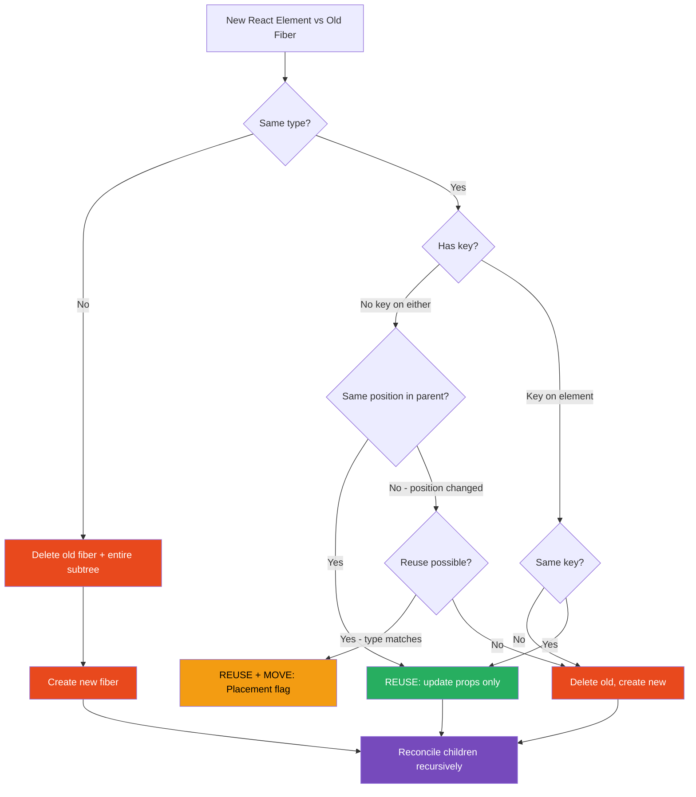
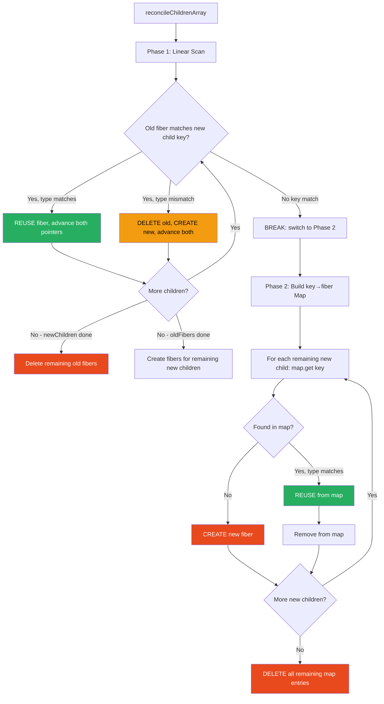

# 16 · The Diffing Algorithm

> **React's diffing algorithm is a set of heuristics that reduces an O(n³) general tree comparison problem to O(n) in practice. It achieves this by making two deliberate, high-value assumptions about how UI trees evolve — and by trading correctness in rare edge cases for speed in the common case. Understanding the algorithm is understanding why certain React patterns are fast, why others are catastrophically slow, and why keys exist.**

Every render in React produces a new tree of React elements. The reconciler must compare this new tree against the existing fiber tree and compute the minimum set of DOM changes. The naive approach — comparing every node against every other node — is O(n³) for a tree of n nodes. For a real application with 1,000 components, that's 1 billion operations per render. The algorithm React actually uses is O(n) — linear in the number of nodes. The gap between these is React's most important engineering contribution.

---

## Table of Contents

- [The Theoretical Problem: General Tree Diffing](#the-theoretical-problem-general-tree-diffing)
- [The Two Heuristics](#the-two-heuristics)
- [Heuristic 1: Type Identity](#heuristic-1-type-identity)
- [Heuristic 2: Key Identity](#heuristic-2-key-identity)
- [The Diffing Algorithm Step by Step](#the-diffing-algorithm-step-by-step)
- [Single Element Reconciliation](#single-element-reconciliation)
- [Child List Reconciliation](#child-list-reconciliation)
- [The Key Map: Matching Children Efficiently](#the-key-map-matching-children-efficiently)
- [The Cost Model of Reconciliation](#the-cost-model-of-reconciliation)
- [What Reconciliation Produces](#what-reconciliation-produces)
- [Reconciliation and DOM Mutation](#reconciliation-and-dom-mutation)
- [Edge Cases and Limitations](#edge-cases-and-limitations)
- [Architecture Diagrams](#architecture-diagrams)
- [Good Practices](#good-practices)
- [Bad Practices](#bad-practices)
- [Mental Model](#mental-model)
- [Common Misconceptions](#common-misconceptions)
- [Exercises](#exercises)
- [Further Reading](#further-reading)

---

## The Theoretical Problem: General Tree Diffing

Comparing two arbitrary trees to find the minimum edit distance is a well-studied computer science problem. The state-of-the-art algorithm for general tree diffing runs in O(n³) time:

```
For a tree with n nodes:
- Compare every node to every other node: O(n²)
- For each pair, consider all possible moves: O(n)
- Total: O(n³)

At n = 1000 components:
  O(1000³) = 1,000,000,000 operations per render
  At 100M operations/second: 10 seconds per render
  This is completely unusable.
```

General tree diffing is too expensive for UI rendering. React doesn't solve the general problem — it solves a more constrained problem by making assumptions about how UI trees change. These assumptions hold for the vast majority of real applications. The cost of being wrong (the rare case where the heuristic fails) is a full subtree remount — expensive but correct.

---

## The Two Heuristics

React's O(n) diffing is based on two heuristics:

### Heuristic 1: Elements of different types produce entirely different trees

If the `type` of an element changes between renders, React does not attempt to reconcile the old and new subtrees. It destroys the old subtree entirely and creates a new one from scratch.

**Why this holds in practice:** When you change a `<div>` to a `<section>`, or a `<Header>` to a `<Footer>`, the underlying UI structure is fundamentally different. Attempting to map old nodes to new nodes would be expensive and the result would typically be to replace everything anyway. By assuming "different type = different tree," React avoids the expensive comparison entirely.

**Cost when it fails:** If you accidentally change the type of a long-lived component (e.g., by defining it inline or swapping between similar wrapper types), the entire subtree unmounts and remounts — losing all state and causing full DOM recreation.

### Heuristic 2: Keys identify stable elements across renders

When reconciling lists of children, React uses the `key` prop to match elements from the new render against elements from the previous render. Elements with matching keys are considered to be the "same" element — even if their position in the list changes.

**Why this holds in practice:** In virtually every real list (to-do items, user profiles, products), each item has a stable identity (a database ID, a UUID). Keys let React express this identity explicitly.

**Cost when it fails:** Using unstable keys (like array index when the list can be reordered, or `Math.random()`) causes React to see "different" elements on every render — forcing full remounts of every item.

---

## Heuristic 1: Type Identity

Type identity is the most foundational rule of React's diffing. It applies at every level of the tree:

```js
// React element types to compare:
// Previous: { type: 'div', props: { className: 'container', ... } }
// Next:     { type: 'section', props: { className: 'container', ... } }

// type 'div' !== 'section' → DESTROY old tree, CREATE new tree
// Even though the props are identical and the children might be the same
```

### Type comparison in detail

```js
// From ReactChildFiber.js — single element reconciliation
function reconcileSingleElement(
  returnFiber,
  currentFirstChild,
  element,
  lanes,
) {
  const key = element.key;
  let child = currentFirstChild;

  while (child !== null) {
    // First: check key match
    if (child.key === key) {
      const elementType = element.type;

      if (elementType === REACT_FRAGMENT_TYPE) {
        if (child.tag === Fragment) {
          // Key match + Fragment type match → REUSE
          deleteRemainingChildren(returnFiber, child.sibling);
          const existing = useFiber(child, element.props.children);
          existing.return = returnFiber;
          return existing;
        }
      } else if (
        child.type === elementType ||
        // Handle lazy and other special types
        (typeof elementType === "object" &&
          elementType !== null &&
          elementType.$$typeof === REACT_LAZY_TYPE &&
          resolveLazyType(elementType) === child.type)
      ) {
        // Key match + type match → REUSE this fiber
        deleteRemainingChildren(returnFiber, child.sibling);
        const existing = useFiber(child, element.props);
        existing.ref = coerceRef(returnFiber, child, element);
        existing.return = returnFiber;
        return existing; // ← REUSE: same fiber, new props
      }

      // Key match but type MISMATCH → delete and break
      deleteRemainingChildren(returnFiber, child);
      break;
    } else {
      // Key mismatch → delete this child, try next
      deleteChild(returnFiber, child);
    }
    child = child.sibling;
  }

  // No match found → CREATE a new fiber
  const created = createFiberFromElement(element, returnFiber.mode, lanes);
  created.ref = coerceRef(returnFiber, currentFirstChild, element);
  created.return = returnFiber;
  return created; // ← CREATE: new fiber
}
```

### The type change cascade

When a type changes, the entire subtree is affected:

```tsx
// Before render:
<div className="card">
  <UserAvatar userId="123" />
  <UserDetails user={user} />
</div>

// After render (type changed from div to article):
<article className="card">
  <UserAvatar userId="123" />
  <UserDetails user={user} />
</article>
```

What React does:

1. Sees `div` → `article`: type mismatch
2. Schedules entire subtree for deletion (including UserAvatar and UserDetails)
3. Creates new `article` fiber
4. Mounts new UserAvatar and UserDetails fibers from scratch
5. `UserAvatar` and `UserDetails` **lose all local state**
6. Two new DOM nodes created from scratch

The children look identical. React doesn't care — the parent type changed, so the entire subtree remounts. This is the correct behavior for the heuristic, but it can be surprising.

### Class components and type identity

For class components, type identity means the class reference:

```tsx
// These are different types — even though they look similar
class CardA extends React.Component {
  render() {
    return <div>A</div>;
  }
}
class CardB extends React.Component {
  render() {
    return <div>B</div>;
  }
}

// Switching between CardA and CardB → full remount
// Even if their render output is identical
```

### Function components and type identity

For function components, type identity means the function reference:

```tsx
// Same definition, but different references → different types
function ComponentA() {
  return <div>A</div>;
}

function Parent() {
  // ❌ Creates a new function reference on every render
  function ComponentB() {
    return <div>A</div>;
  }

  // ComponentA: stable reference across renders → REUSE
  // ComponentB: new reference every render → REMOUNT every render
  return (
    <>
      <ComponentA />
      <ComponentB /> // ← full remount every time Parent renders
    </>
  );
}
```

---

## Heuristic 2: Key Identity

Keys are React's mechanism for identifying which element in a new list corresponds to which element in the previous list. Without keys, React falls back to positional matching — which breaks when items are inserted, removed, or reordered.

### Positional matching (no keys)

```tsx
// Previous render:
<ul>
  <li>Alice</li>   {/* position 0 */}
  <li>Bob</li>     {/* position 1 */}
  <li>Carol</li>   {/* position 2 */}
</ul>

// New render (Alice removed):
<ul>
  <li>Bob</li>     {/* position 0 */}
  <li>Carol</li>   {/* position 1 */}
</ul>

// React (no keys): position-based matching
// Position 0: "Alice" → "Bob" → UPDATE text (keep li fiber, change text)
// Position 1: "Bob" → "Carol" → UPDATE text (keep li fiber, change text)
// Position 2: "Carol" → nothing → DELETE this li fiber

// Result: 2 text updates + 1 deletion
// But: li at position 0 is now displaying Bob's content in Alice's DOM node
// If li had component state (selected, expanded), Alice's state is now on Bob
```

### Key-based matching

```tsx
// Previous render:
<ul>
  <li key="alice">Alice</li>
  <li key="bob">Bob</li>
  <li key="carol">Carol</li>
</ul>

// New render (Alice removed):
<ul>
  <li key="bob">Bob</li>
  <li key="carol">Carol</li>
</ul>

// React (with keys): key-based matching
// "alice" key: in old, not in new → DELETE alice's fiber
// "bob" key: in both → REUSE bob's fiber (may move position)
// "carol" key: in both → REUSE carol's fiber (may move position)

// Result: 1 deletion (alice)
// Bob and Carol's DOM nodes are preserved — just repositioned
// Bob and Carol's component state is preserved
```

---

## The Diffing Algorithm Step by Step

Here is the complete reconciliation algorithm for a list of children:

```js
// From ReactChildFiber.js — reconcileChildrenArray (simplified)
function reconcileChildrenArray(
  returnFiber,
  currentFirstChild,
  newChildren,
  lanes,
) {
  let resultingFirstChild = null; // head of new child fiber list
  let previousNewFiber = null; // tail of new child fiber list

  let oldFiber = currentFirstChild; // current child fiber being matched
  let lastPlacedIndex = 0; // optimization: tracking DOM positions
  let newIdx = 0; // index into newChildren array
  let nextOldFiber = null;

  // ─── PHASE 1: Linear scan ─────────────────────────────────────────────
  // Process new children in order, matching against old fibers
  for (; oldFiber !== null && newIdx < newChildren.length; newIdx++) {
    if (oldFiber.index > newIdx) {
      // Old fiber is at a higher index than current new child
      // This old fiber doesn't match the current new child
      nextOldFiber = oldFiber;
      oldFiber = null;
    } else {
      nextOldFiber = oldFiber.sibling;
    }

    // Try to match: same key AND same type → reuse
    const newFiber = updateSlot(
      returnFiber,
      oldFiber,
      newChildren[newIdx],
      lanes,
    );

    if (newFiber === null) {
      // Key mismatch — stop linear scan, fall through to map phase
      if (oldFiber === null) oldFiber = nextOldFiber;
      break;
    }

    if (oldFiber && newFiber.alternate === null) {
      // We created a new fiber instead of reusing — delete the old one
      deleteChild(returnFiber, oldFiber);
    }

    lastPlacedIndex = placeChild(newFiber, lastPlacedIndex, newIdx);

    if (previousNewFiber === null) {
      resultingFirstChild = newFiber;
    } else {
      previousNewFiber.sibling = newFiber;
    }
    previousNewFiber = newFiber;
    oldFiber = nextOldFiber;
  }

  // ─── EARLY EXIT: new children exhausted ──────────────────────────────
  if (newIdx === newChildren.length) {
    // All new children processed — delete remaining old fibers
    deleteRemainingChildren(returnFiber, oldFiber);
    return resultingFirstChild;
  }

  // ─── EARLY EXIT: old fibers exhausted ─────────────────────────────────
  if (oldFiber === null) {
    // No more old fibers — create new fibers for remaining new children
    for (; newIdx < newChildren.length; newIdx++) {
      const newFiber = createChild(returnFiber, newChildren[newIdx], lanes);
      if (newFiber === null) continue;
      lastPlacedIndex = placeChild(newFiber, lastPlacedIndex, newIdx);
      if (previousNewFiber === null) resultingFirstChild = newFiber;
      else previousNewFiber.sibling = newFiber;
      previousNewFiber = newFiber;
    }
    return resultingFirstChild;
  }

  // ─── PHASE 2: Map phase ─────────────────────────────────────────────────
  // Build a map of key → fiber for all remaining old fibers
  const existingChildren = mapRemainingChildren(returnFiber, oldFiber);

  // Process remaining new children using the map
  for (; newIdx < newChildren.length; newIdx++) {
    const newFiber = updateFromMap(
      existingChildren,
      returnFiber,
      newIdx,
      newChildren[newIdx],
      lanes,
    );
    if (newFiber !== null) {
      if (newFiber.alternate !== null) {
        // Reused an existing fiber — remove from map to avoid double-use
        existingChildren.delete(newFiber.key !== null ? newFiber.key : newIdx);
      }
      lastPlacedIndex = placeChild(newFiber, lastPlacedIndex, newIdx);
      if (previousNewFiber === null) resultingFirstChild = newFiber;
      else previousNewFiber.sibling = newFiber;
      previousNewFiber = newFiber;
    }
  }

  // ─── CLEANUP: delete unmatched old fibers ──────────────────────────────
  existingChildren.forEach((child) => deleteChild(returnFiber, child));

  return resultingFirstChild;
}
```

### The two-phase approach

Phase 1 (linear scan) handles the common case: insertions and deletions at the end of a list, where the beginning is stable. If all keys match in order, Phase 2 never runs — O(n) with minimal overhead.

Phase 2 (map lookup) handles the complex case: reordering, insertions in the middle, deletions in the middle. It builds a hash map of key → fiber, then looks up each new element in the map — O(1) per lookup.

---

## Single Element Reconciliation

When a component renders a single child (not a list), the reconciliation is simpler:

```js
function reconcileSingleElement(
  returnFiber,
  currentFirstChild,
  element,
  lanes,
) {
  const key = element.key;
  let child = currentFirstChild;

  while (child !== null) {
    if (child.key === key) {
      // Key matches — check type
      if (child.type === element.type) {
        // KEY + TYPE match → REUSE
        deleteRemainingChildren(returnFiber, child.sibling);
        return useFiber(child, element.props);
      }
      // Key matches but type doesn't → must delete all and create new
      deleteRemainingChildren(returnFiber, child);
      break;
    } else {
      // Key doesn't match → delete this child, try next
      deleteChild(returnFiber, child);
    }
    child = child.sibling;
  }

  // No match → create new fiber
  return createFiberFromElement(element, returnFiber.mode, lanes);
}
```

For a single element with no key (the common case), this is:

1. Does `currentFirstChild.type === element.type`?
2. If yes: reuse. If no: delete and create.

Two comparisons, O(1).

---

## The Key Map: Matching Children Efficiently

Phase 2 of the list reconciliation builds a `Map<key, Fiber>` for fast lookup:

```js
function mapRemainingChildren(returnFiber, currentFirstChild) {
  // Build a map: key → fiber for all remaining old children
  const existingChildren = new Map();

  let existingChild = currentFirstChild;
  while (existingChild !== null) {
    if (existingChild.key !== null) {
      existingChildren.set(existingChild.key, existingChild);
    } else {
      // No key: use index as implicit key
      existingChildren.set(existingChild.index, existingChild);
    }
    existingChild = existingChild.sibling;
  }

  return existingChildren;
}
```

Lookup during Phase 2:

```js
function updateFromMap(existingChildren, returnFiber, newIdx, newChild, lanes) {
  if (typeof newChild === "string" || typeof newChild === "number") {
    // Text nodes: no keys, use index
    const matchedFiber = existingChildren.get(newIdx) || null;
    return updateTextNode(returnFiber, matchedFiber, "" + newChild, lanes);
  }

  if (typeof newChild === "object" && newChild !== null) {
    const key = newChild.key !== null ? newChild.key : newIdx;
    const matchedFiber = existingChildren.get(key) || null;
    return updateElement(returnFiber, matchedFiber, newChild, lanes);
  }

  return null;
}
```

The map lookup is O(1). Building the map is O(remaining old children). For a list of n items where k items have been reordered, total cost is O(n) for Phase 1 + O(n-matched) for the map + O(n-matched) for Phase 2 = O(n) overall.

---

## The Cost Model of Reconciliation

Understanding reconciliation cost helps you write components that are fast to reconcile.

### Fiber reuse (cheapest)

```tsx
// Same type + same key → fiber reused
// Cost: prop comparison + updateQueue processing
// No DOM creation, no state reset
<UserCard key={user.id} user={updatedUser} />
// → useFiber: copy pendingProps, reset flags
// → DOM: only changed props written
// Total cost: O(changed props)
```

### Fiber creation (moderate)

```tsx
// New element, no matching fiber → new fiber created
// Cost: FiberNode allocation + all props initialized
// DOM: createElement + all attributes set
<NewUserCard user={newUser} />
// → createFiberFromElement: allocate FiberNode
// → completeWork: createElement + initialProps
// → commitPlacement: insertBefore or appendChild
// Total cost: O(1) for fiber + O(props) for DOM
```

### Subtree deletion (expensive for large trees)

```tsx
// Type changed or element removed → entire subtree deleted
// Cost: O(subtree size) — must run cleanup effects on every descendant
<section>
  {" "}
  {/* was <div> → everything below remounts */}
  <UserAvatar /> {/* unmounted + remounted */}
  <UserDetails /> {/* unmounted + remounted */}
  <UserSettings /> {/* unmounted + remounted */}
</section>
```

### Full list reconciliation (moderate for large lists)

```tsx
// n items, all with stable keys, none changed:
// Cost: n × (key lookup + type check) = O(n)

// n items, all with stable keys, 1 item changed:
// Cost: n × key lookup + 1 × prop diff = O(n) + O(changed props)

// n items, all keys changed (Math.random()):
// Cost: n × no match found + n × create new = O(n) creates, O(n) deletes
// = O(n) but with maximum DOM work (all DOM nodes recreated)
```

### The placeChild function and DOM moves

When a fiber is reused but its position changes (reordering), React tracks whether it needs a DOM move:

```js
function placeChild(newFiber, lastPlacedIndex, newIndex) {
  newFiber.index = newIndex;

  const current = newFiber.alternate;
  if (current !== null) {
    // This fiber existed before — it's being REUSED
    const oldIndex = current.index;

    if (oldIndex < lastPlacedIndex) {
      // This fiber was before lastPlacedIndex in the old tree
      // but needs to be after it in the new tree → MOVE (insert before)
      newFiber.flags |= Placement;
      return lastPlacedIndex;
    } else {
      // This fiber is already in a valid position → NO MOVE needed
      return oldIndex;
    }
  } else {
    // New fiber — needs insertion
    newFiber.flags |= Placement;
    return lastPlacedIndex;
  }
}
```

> 🔬 **Internals:** The `lastPlacedIndex` optimization means React can determine which reused fibers need DOM moves without comparing all pairs. It works like an "insertion sort" — fibers that are already in order don't need moving. Only fibers that moved backward in the list need `Placement` flags (DOM moves). For a simple reversal of n items, all n items get `Placement` flags — all n DOM nodes move. For a single item prepended to a list with stable keys, only the prepended item gets `Placement` — one DOM insertion.

---

## What Reconciliation Produces

After reconciliation, each fiber has been tagged with the appropriate flags:

```js
// Possible outcomes for each fiber after reconciliation:

// 1. REUSED, UPDATED — same fiber, new props
fiber.flags |= Update; // update DOM properties in commit
fiber.pendingProps = newProps;

// 2. NEWLY CREATED — no previous fiber
fiber.flags |= Placement; // insert into DOM in commit

// 3. MOVED — reused but position changed
fiber.flags |= Placement; // move in DOM (treated as re-insert)

// 4. DELETED — no new element matches this fiber
// Added to parent.deletions array
// fiber.flags not modified (fiber will be deleted, not committed)
```

These flags are what the commit phase reads and acts on.

---

## Reconciliation and DOM Mutation

Reconciliation computes what needs to change. The commit phase makes those changes. This separation is crucial:

```
Render Phase (Reconciliation):
  Old fiber: { type: 'input', props: { value: 'hello', className: 'old' } }
  New element: { type: 'input', props: { value: 'world', className: 'new' } }

  Reconciler computes:
    - Same type ('input') → REUSE
    - props changed: value 'hello'→'world', className 'old'→'new'
    - updatePayload = ['value', 'world', 'className', 'new']
    - fiber.flags |= Update
    - fiber.updateQueue = updatePayload

Commit Phase (DOM Mutation):
  Read fiber.updateQueue = ['value', 'world', 'className', 'new']
  Execute: input.value = 'world'
  Execute: input.className = 'new'

  Only 2 DOM property writes — not a full re-render of the input element
```

The diffing algorithm is what makes "only 2 DOM property writes" possible — it computes exactly what changed, not just that something changed.

---

## Edge Cases and Limitations

### 1. Cross-level movement is O(subtree)

```tsx
// React's diffing only compares elements at the same level
// Moving an element to a different level = delete + create

// Before:
<div>
  <Card />      {/* level 1 */}
</div>

// After:
<div>
  <section>
    <Card />   {/* level 2 — "moved" from level 1 */}
  </section>
</div>

// React: div → section → different type → delete div subtree, create section
// Card inside section is treated as a new Card, not the moved Card
// Card's state is lost — even though it "looks" like a move
```

### 2. Key uniqueness within a level only

Keys only need to be unique among siblings — not globally. The same key value can appear in different parts of the tree:

```tsx
// Valid: same keys at different levels
<ul>
  <li key="1">Item 1</li>  {/* key="1" is fine here */}
</ul>
<ol>
  <li key="1">List 1</li>  {/* key="1" is fine here too — different parent */}
</ol>
```

### 3. Fragment key requirement for mapped lists

When using fragments in a `.map()`, the `key` must go on the `Fragment`, not on a child:

```tsx
// ❌ Key on inner element — Fragment has no key
items.map((item) => (
  <>
    <dt key={item.id}>{item.term}</dt> {/* wrong place for key */}
    <dd>{item.definition}</dd>
  </>
));

// ✅ Key on Fragment
items.map((item) => (
  <React.Fragment key={item.id}>
    <dt>{item.term}</dt>
    <dd>{item.definition}</dd>
  </React.Fragment>
));
```

### 4. Key must be a string (coerced if not)

```js
// React coerces key to string using toString()
// Numeric keys: 1 → "1", 2 → "2"
// But: these are the same key:
key={1}    // "1"
key={"1"}  // "1"
// Using numbers and strings from the same ID space can cause key collisions
```

### 5. The type comparison is reference equality for components

```tsx
// Function components: compared by reference
const Component = () => <div />;
const ComponentCopy = Component; // same reference → same type → REUSE

// Arrow function in JSX: new reference every render → always REMOUNT
const Parent = () => (
  <Child render={() => <div />} />
  // () => <div /> is a new function reference every Parent render
  // But this is the render prop, not the component type — different issue
);
```

---

## Architecture Diagrams

### The diffing decision tree



### Child list reconciliation: two-phase algorithm



---

## Good Practices

### ✅ Good Practice — Stable, data-driven keys for all lists

```tsx
/**
 * Good: Keys derived from stable data identifiers.
 * The reconciler can match fibers across renders precisely.
 * Reordering, filtering, and pagination preserve component state.
 */
function TaskBoard({ columns }: { columns: Column[] }) {
  return (
    <div className="board">
      {columns.map((column) => (
        // Stable key: column database ID
        <Column key={column.id} column={column}>
          {column.tasks.map((task) => (
            // Stable key: task database ID
            // When tasks reorder, their fibers (and state) follow them
            <TaskCard key={task.id} task={task} />
          ))}
        </Column>
      ))}
    </div>
  );
}

function TaskCard({ task }: { task: Task }) {
  // This state is preserved when task reorders between columns
  const [isExpanded, setIsExpanded] = useState(false);
  const [notes, setNotes] = useState("");

  // isExpanded and notes survive drag-and-drop reordering
  // because TaskCard's fiber is reused (key is stable)
  return (
    <div className="task-card">
      <h3>{task.title}</h3>
      <button onClick={() => setIsExpanded((v) => !v)}>
        {isExpanded ? "▲" : "▼"}
      </button>
      {isExpanded && (
        <textarea
          value={notes}
          onChange={(e) => setNotes(e.target.value)}
          placeholder="Add notes..."
        />
      )}
    </div>
  );
}
```

**Why this works:** Each `TaskCard` has a fiber identified by `task.id`. When tasks reorder (drag-and-drop), the reconciler matches `key="task-1"` old fiber to `key="task-1"` new element — regardless of position. The fiber is reused, `isExpanded` and `notes` are preserved, and the DOM node is moved (not recreated). The user's notes and expanded state survive the reorder.

---

## Bad Practices

### ⚠️ Bad Practice — Unstable keys that destroy component state and DOM

```tsx
/**
 * Bad: Three different anti-patterns that break reconciliation.
 * Each causes unnecessary DOM recreation and state loss.
 */
function TaskList({ tasks }: { tasks: Task[] }) {
  return (
    <ul>
      {/* ❌ Anti-pattern 1: Array index as key */}
      {/* When a task is deleted from the middle, all subsequent tasks
          get a new index key → fiber mismatch → full remount for each */}
      {tasks.map((task, index) => (
        <TaskItem key={index} task={task} />
      ))}

      {/* ❌ Anti-pattern 2: Random key */}
      {/* New random key on EVERY render → no fiber ever reused */}
      {/* All TaskItems remount on every parent render */}
      {/* O(n) full DOM recreation per render */}
      {tasks.map((task) => (
        <TaskItem key={Math.random()} task={task} />
      ))}

      {/* ❌ Anti-pattern 3: Composite unstable key */}
      {/* task.status changes when task is completed → key changes */}
      {/* Completing a task causes its fiber to remount */}
      {/* Loses "isExpanded" state, refocuses, resets animations */}
      {tasks.map((task) => (
        <TaskItem key={`${task.id}-${task.status}`} task={task} />
      ))}
    </ul>
  );
}

/**
 * ✅ Correct: Stable, identity-based key
 */
function TaskList({ tasks }: { tasks: Task[] }) {
  return (
    <ul>
      {tasks.map((task) => (
        <TaskItem key={task.id} task={task} />
      ))}
    </ul>
  );
}
```

**What happens with index keys:** A user has a list `[A, B, C]`. They delete B. The new list is `[A, C]`. With index keys: A has key=0 (matches), C gets key=1 (was B's key) → C's fiber gets B's props, C must update its content, C's local state (focus, animation, scroll position) is B's old state. With id keys: A=key-a (matches), B is deleted, C=key-c (matches). C's fiber is reused with its own state intact.

**Production impact:** In a production task manager with 50 tasks, every task deletion or reorder with index keys triggers 50+ fiber comparisons that mostly fail, followed by up to 50 DOM text updates (updating each `li`'s content to match the shifted position). With ID keys: 1 deletion + 0 DOM updates for unchanged items.

---

## Mental Model

> 💡 **The diffing algorithm mental model:**
>
> React's diffing is like a **librarian restocking shelves after an inventory change**. The librarian has two lists: the old shelf arrangement (previous fiber tree) and the new arrangement (new element tree). Instead of removing all books and replacing them from scratch (O(n) DOM recreations), the librarian uses two rules: (1) if a book has a different cover (different type), treat it as a different book — remove the old, shelve the new; (2) if a book has a catalog number (key), use that to find where it should go — even if it moved shelves. The librarian works row by row (same level only). Books that stayed in place don't move. Books that moved get repositioned. Books with no catalog number are matched by their original position. The genius is that most books don't move — the catalog numbers make the few that do move fast to find. Your job: give every book a catalog number (key) that matches its identity, not its current position.

---

## Common Misconceptions

### "Diffing compares the entire old and new tree"

React's diffing is level-by-level, same-parent-only. It never compares children of one parent against children of another parent. Cross-level moves are always treated as delete + create, not as moves.

### "React.memo prevents diffing"

`React.memo` prevents the component function from being called — but the fiber's props are still compared (by `React.memo`'s shallow equality check). Diffing of the fiber's children still happens when the component re-renders. `React.memo` is a pre-diffing optimization, not a replacement for diffing.

### "Keys must be globally unique"

Keys only need to be unique among siblings. The same key value can exist in different parts of the tree without conflict.

### "Using Math.random() as key is just slow"

It is more than slow — it is **semantically wrong**. It tells React that every element is a different element on every render. React deletes all old fibers and creates all new fibers. This destroys all component state, forces all DOM nodes to be recreated, loses focus, loses scroll position, and loses any animations. It is O(n) full DOM recreation on every parent render.

### "Diffing accounts for cross-level element moves"

No. React's algorithm only compares elements at the same level in the tree. Moving an element deeper in the tree (wrapping it in a new parent) always produces a delete + create, regardless of the element's key.

---

## Exercises

### Exercise 1 — Observe fiber reuse vs recreation

Build a list of `<input>` elements. Type something in each input (creating local state). Then:

1. Without keys: delete the first item — observe that remaining inputs shift content but keep focus/value from wrong position
2. With stable keys: delete the first item — observe that remaining inputs keep their values correctly

The difference is visible without any devtools — it's the direct user-facing consequence of fiber reuse vs recreation.

### Exercise 2 — Measure reconciliation cost

```tsx
let reconcileCount = 0;

function TrackedListItem({ item }: { item: Item }) {
  reconcileCount++;
  const [selected, setSelected] = useState(false);
  return (
    <li
      onClick={() => setSelected((v) => !v)}
      style={{ background: selected ? "yellow" : "white" }}
    >
      {item.name}
    </li>
  );
}

function List({ items }: { items: Item[] }) {
  reconcileCount = 0;
  const result = (
    <ul>
      {items.map((item, i) => (
        // Test with key={i}, then key={item.id}, then key={Math.random()}
        <TrackedListItem key={i} item={item} />
      ))}
    </ul>
  );
  console.log(`Reconciled ${reconcileCount} items`);
  return result;
}
```

Measure reconcile count for: initial render, no-change re-render, one item changed, one item deleted, list reversed.

### Exercise 3 — Trace the reconciler's decisions

Open React DevTools → Components tab. Enable "Highlight updates when components render." Build a list of 10 items. Perform these operations and observe which components highlight (re-render):

1. Add an item at the end (with stable keys)
2. Add an item at the beginning (with stable keys)
3. Delete the middle item (with stable keys vs index keys)
4. Reorder the list (with stable keys vs index keys)

The highlight pattern directly shows what the reconciler decided to reuse vs recreate.

---

## Further Reading

- [React Source: ReactChildFiber.js](https://github.com/facebook/react/blob/main/packages/react-reconciler/src/ReactChildFiber.js) — The complete reconciliation implementation
- [React Docs: Lists and Keys](https://react.dev/learn/rendering-lists) — The official keys guide
- [React Docs: Reconciliation](https://legacy.reactjs.org/docs/reconciliation.html) — The original reconciliation documentation
- [Andrew Clark: React Fiber Architecture — Reconciliation](https://github.com/acdlite/react-fiber-architecture#reconciliation-vs-rendering) — Design notes
- [Vlad Shirinkin: Inside React's Reconciler](https://indepth.dev/posts/1008/inside-fiber-in-depth-overview-of-the-new-reconciliation-algorithm-in-react) — Deep dive into reconciliation internals
- Next in this handbook: [17 · Element Identity & Keys](./02-keys.md)

---

_Part of the [React + Next.js Engineering Handbook](../../README.md)_
