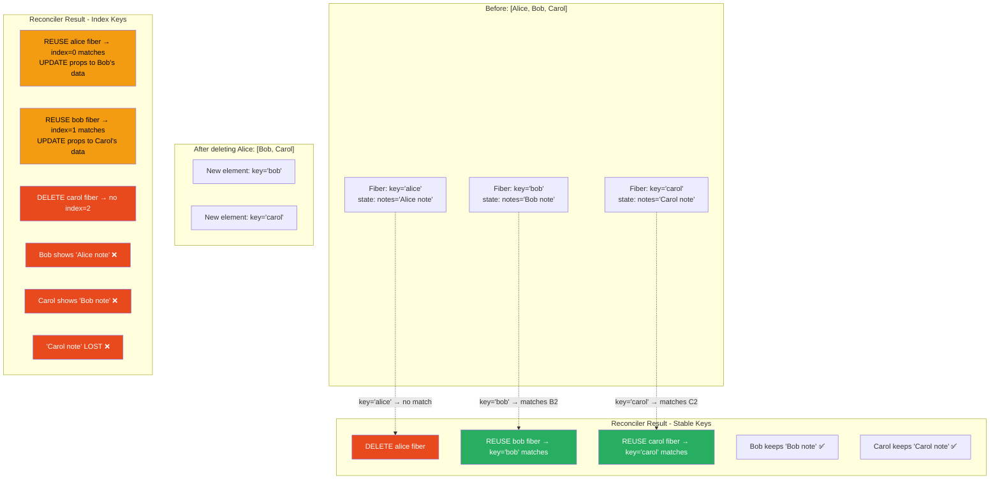

# 17 · Element Identity & Keys

> **A React key is not a performance hint. It is a declaration of identity — you are telling React "this element represents the same logical entity as the element with the same key from the previous render." React uses this identity to decide whether to reuse a fiber (preserving state, reusing DOM) or destroy and recreate it. The wrong key is worse than no key at all.**

Keys are one of React's most misunderstood features. Developers add them to silence console warnings without understanding what they do. They use `Math.random()` thinking it "helps performance." They use `index` when their list is sorted, not realizing that filtering or reordering breaks it entirely. This document explains exactly what a key is, how React uses it at the fiber level, and how to reason correctly about key choice in every situation.

---

## Table of Contents

- [What a Key Actually Is at Runtime](#what-a-key-actually-is-at-runtime)
- [The Key Comparison Mechanism](#the-key-comparison-mechanism)
- [When React Uses Keys](#when-react-uses-keys)
- [The Three Sources of Keys](#the-three-sources-of-keys)
- [Index Keys: When They Work and When They Fail](#index-keys-when-they-work-and-when-they-fail)
- [Stable ID Keys: The Correct Default](#stable-id-keys-the-correct-default)
- [Random Keys: Never Do This](#random-keys-never-do-this)
- [The Key-as-State-Reset Pattern](#the-key-as-state-reset-pattern)
- [Keys and Component Instances](#keys-and-component-instances)
- [Keys in Nested Lists](#keys-in-nested-lists)
- [Fragment Keys](#fragment-keys)
- [Keys Across Conditional Rendering](#keys-across-conditional-rendering)
- [Debugging Key Problems](#debugging-key-problems)
- [Performance Implications of Key Choices](#performance-implications-of-key-choices)
- [Architecture Diagrams](#architecture-diagrams)
- [Good Practices](#good-practices)
- [Bad Practices](#bad-practices)
- [Mental Model](#mental-model)
- [Common Misconceptions](#common-misconceptions)
- [Exercises](#exercises)
- [Further Reading](#further-reading)

---

## What a Key Actually Is at Runtime

At the JavaScript level, a key is a string stored on a React element:

```js
// When you write:
<UserCard key={user.id} user={user} />

// The JSX compiles to:
_jsx(UserCard, { user }, user.id)
//                       ↑ third argument: the key

// Which produces a React element:
{
  $$typeof: Symbol(react.element),
  type: UserCard,
  key: String(user.id), // ← coerced to string
  ref: null,
  props: { user },
}
```

The key is stored on the element, not in props. You cannot access `props.key` inside a component — it is `undefined`. React reads it before calling your component and uses it exclusively for reconciliation.

At the fiber level, the key is stored on the fiber node:

```js
// After reconciliation creates or reuses a fiber:
fiber.key = "user-123"; // the string key

// During child reconciliation:
// React builds a Map<key, fiber> of existing children
// Then matches each new element's key against this map
```

The key's role: **it identifies which fiber from the previous render corresponds to which element in the current render.**

---

## The Key Comparison Mechanism

Keys are compared with strict string equality (`===` after coercion to string):

```js
// From ReactChildFiber.js — the key comparison
function updateSlot(returnFiber, oldFiber, newChild, lanes) {
  const key = oldFiber !== null ? oldFiber.key : null;

  if (typeof newChild === "object" && newChild !== null) {
    switch (newChild.$$typeof) {
      case REACT_ELEMENT_TYPE: {
        if (newChild.key === key) {
          // ← Key comparison: strict string equality
          return updateElement(returnFiber, oldFiber, newChild, lanes);
          // Returns updated (reused) fiber
        }
        return null;
        // Returns null: key mismatch → reconciler will create a new fiber
      }
    }
  }
  return null;
}
```

### Key coercion

React coerces keys to strings using `String()`:

```js
// Number keys:
key={1}    → fiber.key = "1"
key={1.5}  → fiber.key = "1.5"

// String keys:
key={"abc"} → fiber.key = "abc"

// Boolean (not recommended):
key={true}  → fiber.key = "true"

// null/undefined → no key
key={null}      → fiber.key = null (same as no key)
key={undefined} → fiber.key = null
```

### Key collision: the silent bug

```tsx
// ❌ Key collision: number 1 and string "1" produce the same key
{
  items.map((item, index) => <Item key={index} data={item} />);
}
// If index 1 (number) is used: key = "1"
// If somewhere else key="1" (string) is also used in the same list: collision
// React sees two elements with the same key — undefined behavior
```

---

## When React Uses Keys

Keys are used in exactly one context: **reconciling a list of children**. This includes:

```tsx
// 1. Array map (most common)
items.map((item) => <Item key={item.id} item={item} />);

// 2. Explicit array
const elements = [<Item key="a" />, <Item key="b" />, <Item key="c" />];

// 3. Conditional arrays
[
  isLoggedIn && <UserMenu key="user-menu" />,
  <NavBar key="navbar" />,
  isAdmin && <AdminPanel key="admin-panel" />,
].filter(Boolean);

// 4. Fragment-wrapped pairs
items.map((item) => (
  <React.Fragment key={item.id}>
    <dt>{item.term}</dt>
    <dd>{item.definition}</dd>
  </React.Fragment>
));
```

Keys are NOT used for:

```tsx
// Single children — no key needed (only one possible match)
<Container>
  <Child /> {/* no key needed — single child, no ambiguity */}
</Container>;

// Conditional rendering (not a list)
{
  isLoggedIn ? <UserView /> : <GuestView />;
}
// This is a single element in each render — not a list
```

---

## The Three Sources of Keys

### Source 1: Database/API IDs (best)

```tsx
// User's database ID
{
  users.map((user) => <UserCard key={user.id} user={user} />);
}

// Product SKU
{
  products.map((product) => (
    <ProductCard key={product.sku} product={product} />
  ));
}

// Composite ID for join table entries
{
  orderItems.map((item) => (
    <OrderItem key={`${item.orderId}-${item.productId}`} item={item} />
  ));
}
```

Database IDs are ideal because:

- Guaranteed unique within the collection
- Stable across operations (sort, filter, paginate)
- Survive session (same item always has same ID)
- Match the item's logical identity

### Source 2: Stable computed values

```tsx
// URL slug (stable, unique, readable)
{
  posts.map((post) => <PostCard key={post.slug} post={post} />);
}

// Hash of content (for items without IDs)
{
  suggestions.map((suggestion) => (
    <Suggestion key={hashString(suggestion.text)} suggestion={suggestion} />
  ));
}

// Enum value (for small fixed sets)
{
  tabs.map((tab) => <Tab key={tab.type} tab={tab} />);
}
// 'type' is from an enum — stable and unique
```

### Source 3: Index (only for static lists)

```tsx
// ✅ Acceptable: static list, never reordered, never filtered
const MENU_ITEMS = ["Home", "About", "Contact"];
{
  MENU_ITEMS.map((item, index) => <MenuItem key={index} label={item} />);
}

// ✅ Acceptable: rendered once, no interaction
{
  staticBreadcrumbs.map((crumb, index) => (
    <Breadcrumb key={index} crumb={crumb} />
  ));
}
```

---

## Index Keys: When They Work and When They Fail

The key question for index keys: **can the list be reordered, filtered, or have items inserted/deleted from the middle?**

If no: index keys are fine.
If yes: index keys produce bugs.

### The failure modes in detail

**Failure mode 1: Item deletion**

```tsx
// List: ['Alice', 'Bob', 'Carol'] with index keys
// User: each <Input> has typed text in local state

// Before deletion:
// key=0: Alice → input value "Alice note"
// key=1: Bob   → input value "Bob note"
// key=2: Carol → input value "Carol note"

// Delete Alice (index 0)
// New list: ['Bob', 'Carol']

// Reconciler: positional matching with index keys
// New key=0: 'Bob' — matches old key=0 'Alice'
//   → REUSE old fiber (Alice's fiber)
//   → fiber.memoizedState still has "Alice note"
//   → prop update: label becomes 'Bob'
//   → Input shows 'Bob' label but "Alice note" value ← WRONG

// New key=1: 'Carol' — matches old key=1 'Bob'
//   → REUSE old fiber (Bob's fiber)
//   → Input shows 'Carol' label but "Bob note" value ← WRONG

// Old key=2: 'Carol' — no new element at key=2
//   → DELETE Carol's fiber (and "Carol note" state)

// Result: visually broken UI, state is scrambled
```

**Failure mode 2: Middle insertion**

```tsx
// List: ['A', 'B', 'C'] → insert 'X' at position 1 → ['A', 'X', 'B', 'C']

// With index keys:
// key=0: 'A' → 'A' — REUSE (correct)
// key=1: 'B' → 'X' — UPDATE (wrong fiber, wrong state!)
// key=2: 'C' → 'B' — UPDATE (wrong fiber, wrong state!)
// key=3: none → 'C' — CREATE (new fiber, lost 'C's state)

// With stable IDs:
// key='a': 'A' → 'A' — REUSE (correct)
// key='x': none → 'X' — CREATE (correct: new item)
// key='b': 'B' → 'B' — REUSE (correct)
// key='c': 'C' → 'C' — REUSE (correct)
```

**Failure mode 3: Sort/filter operations**

```tsx
function SortableList({ items }: { items: Item[] }) {
  const [sortKey, setSortKey] = useState<"name" | "date">("name");
  const sorted = [...items].sort((a, b) =>
    a[sortKey].localeCompare(b[sortKey]),
  );

  return (
    <ul>
      {sorted.map((item, index) => (
        // ❌ Index key: sort changes index → all fibers remount
        <ListItem key={index} item={item} />
      ))}
    </ul>
  );
}
// When sort changes: key=0 was 'Alice', now 'Bob'
// All 10 items appear different to React → 10 full remounts
// All local state (selected, expanded, animating) is lost
// Animation: all items flash instead of smoothly reordering
```

### When index keys are genuinely acceptable

```tsx
// ✅ Static: list never changes
const NAVIGATION_LINKS = [
  { href: "/", label: "Home" },
  { href: "/about", label: "About" },
];
{
  NAVIGATION_LINKS.map((link, i) => <NavLink key={i} {...link} />);
}

// ✅ Append-only: items only added at the end, never removed from middle
function MessageFeed({ messages }: { messages: Message[] }) {
  return messages.map((msg, i) => (
    // New messages always go at the end — index 0 always corresponds to oldest
    <Message key={i} message={msg} />
    // But even here: if you ever delete old messages, index breaks
    // Better: key={msg.id}
  ));
}

// ✅ Purely presentational: no local state in list items
{
  ["red", "green", "blue"].map((color, i) => (
    <ColorSwatch key={i} color={color} />
    // ColorSwatch has no state → fiber reuse vs creation is irrelevant
  ));
}
```

---

## Stable ID Keys: The Correct Default

The default choice for any dynamic list should be a stable ID from your data:

```tsx
// ✅ Always prefer data IDs
{
  tasks.map((task) => <TaskCard key={task.id} task={task} />);
}

// What "stable" means:
// - Same item → same key across renders (task.id doesn't change)
// - Unique within the list (no two tasks have the same id)
// - Not derived from mutable properties (don't use task.status, task.sortOrder)
```

### Generating stable IDs for items without natural IDs

Sometimes your data doesn't have IDs (e.g., inline arrays, computed options):

```tsx
// Option 1: Add ID at data creation time
const [items, setItems] = useState(() => [
  { id: crypto.randomUUID(), value: "First" },
  { id: crypto.randomUUID(), value: "Second" },
]);
// IDs assigned once — stable for item's lifetime

// Option 2: Use a stable property combination
{
  suggestions.map((suggestion) => (
    // Combine multiple stable properties if no single ID exists
    <Suggestion
      key={`${suggestion.category}-${suggestion.value}`}
      suggestion={suggestion}
    />
  ));
}

// Option 3: For pure data with no state, content as key
{
  staticOptions.map((option) => (
    // Safe only if values are unique and never change
    <Option key={option.value} option={option} />
  ));
}

// Option 4: useId for dynamically created items in controlled context
function DynamicFieldList() {
  const [fields, setFields] = useState<Array<{ id: string; value: string }>>(
    [],
  );

  const addField = () => {
    setFields((prev) => [...prev, { id: crypto.randomUUID(), value: "" }]);
  };

  return (
    <>
      {fields.map((field) => (
        <DynamicField key={field.id} field={field} />
      ))}
      <button onClick={addField}>Add Field</button>
    </>
  );
}
```

---

## The Key-as-State-Reset Pattern

One of the most powerful (and least known) uses of keys: deliberately changing a key to reset a component's state.

### The problem it solves

```tsx
// Without key reset: form retains previous user's data
function UserProfileForm({ userId }: { userId: string }) {
  const [name, setName] = useState("");
  const [bio, setBio] = useState("");

  useEffect(() => {
    fetchUser(userId).then((user) => {
      setName(user.name);
      setBio(user.bio);
    });
  }, [userId]);

  // Problem: when userId changes, the form shows old data until the effect fires
  // (at minimum one render with stale data)
  // Even with the effect, setName/setBio cause an extra re-render
}

// With key reset: form reinitializes completely when userId changes
function UserProfilePage({ userId }: { userId: string }) {
  return (
    // ✅ key changes when userId changes → form component remounts
    // All state resets to initial values immediately
    // No stale data flash, no extra renders
    <UserProfileForm key={userId} userId={userId} />
  );
}

function UserProfileForm({ userId }: { userId: string }) {
  const [name, setName] = useState("");
  const [bio, setBio] = useState("");

  useEffect(() => {
    fetchUser(userId).then((user) => {
      setName(user.name);
      setBio(user.bio);
    });
  }, [userId]);
}
```

### When to use key reset

```tsx
// Pattern: <Component key={identity} {...props} />
// Use when: changing identity should completely reset the component

// ✅ Form for different records
<CommentForm key={postId} postId={postId} />
// When postId changes, the form resets — correct behavior

// ✅ Chart for different datasets
<Chart key={datasetId} data={data} />
// When dataset changes, chart reinitializes — avoids stale animation state

// ✅ Video player for different videos
<VideoPlayer key={videoId} src={videoUrl} />
// When video changes, player reinitializes — avoids resume-at-wrong-position

// ✅ Paginated list for different pages
<ItemList key={currentPage} items={pageItems} />
// When page changes, list state resets — avoids stale scroll/selection state
```

> 🔬 **Internals:** Key reset works because changing a key tells the reconciler that this is a _different_ element — even if the type is the same. The reconciler sees: old fiber key="user-123", new element key="user-456". Key mismatch → delete old fiber (destroy state, unmount effects) → create new fiber (initialize state, mount effects). The user sees no transition — the new component renders in the same position.

### The key reset trade-off

```tsx
// ✅ Key reset: clean, simple, correct
<ComponentWithComplexState key={relevantId} />
// Cost: component mounts fresh — initial render, effects mount
// Benefit: guaranteed clean state, no synchronization bugs

// Alternative: useEffect sync
// Cost: extra render cycle, potential stale-state flash, complex logic
// Benefit: preserves unrelated state (scroll position, other UI state)

// Rule of thumb:
// Key reset when: the identity change means ALL state should reset
// useEffect sync when: only SOME state should change, rest should persist
```

---

## Keys and Component Instances

For class components, key changes destroy the class instance:

```tsx
class Counter extends React.Component<{}, { count: number }> {
  state = { count: 0 };
  render() {
    return <div>{this.state.count}</div>;
  }
}

// When key changes from "a" to "b":
// - Old instance (count: 5) is destroyed
// - componentWillUnmount fires on old instance
// - New instance created (count: 0)
// - componentDidMount fires on new instance
```

For function components, key changes destroy the fiber and its hook state:

```tsx
function Counter() {
  const [count, setCount] = useState(0);
  return <div onClick={() => setCount((c) => c + 1)}>{count}</div>;
}

// When key changes:
// - Old fiber (memoizedState: count=5) is deleted
// - useEffect cleanup runs on old fiber
// - New fiber created (memoizedState: count=0)
// - useEffect setup runs on new fiber
```

---

## Keys in Nested Lists

In nested lists, each list level needs its own keys:

```tsx
function BoardView({ columns }: { columns: Column[] }) {
  return columns.map((column) => (
    <Column
      key={column.id} // ← key for column within the columns list
      column={column}
    >
      {column.cards.map((card) => (
        <Card
          key={card.id} // ← key for card within THIS column's cards list
          card={card}
        />
      ))}
    </Column>
  ));
}
```

Key uniqueness is local to the parent:

```
Column key="col-1":
  Card key="card-1"   ← unique within col-1's children
  Card key="card-2"
  Card key="card-3"

Column key="col-2":
  Card key="card-1"   ← same key value, but different parent → no conflict
  Card key="card-4"
```

`card-1` appears in both columns with the same key — this is fine because they have different parents. React's key matching is parent-scoped.

---

## Fragment Keys

When using fragments in mapped lists, the key goes on the Fragment:

```tsx
// ❌ No key on Fragment — React warning, and unstable reconciliation
{
  items.map((item) => (
    <>
      <dt>{item.term}</dt>
      <dd>{item.definition}</dd>
    </>
  ));
}

// ❌ Key on child element — wrong, Fragment has no key
{
  items.map((item) => (
    <>
      <dt key={item.id}>{item.term}</dt>
      <dd>{item.definition}</dd>
    </>
  ));
}

// ✅ Key on Fragment (must use long-form React.Fragment, not <>)
{
  items.map((item) => (
    <React.Fragment key={item.id}>
      <dt>{item.term}</dt>
      <dd>{item.definition}</dd>
    </React.Fragment>
  ));
}
```

> 🔬 **Internals:** The short-form `<>` syntax compiles to `React.createElement(React.Fragment, null, ...children)` — without a props object. The long-form `<React.Fragment key={id}>` compiles to `React.createElement(React.Fragment, { key: id }, ...children)`. Only the long form can accept the `key` prop because the short form has no props object slot to receive it.

---

## Keys Across Conditional Rendering

When elements appear conditionally, keys help React track which element is which:

```tsx
// ❌ No keys — React may reuse wrong fiber when conditions change
function StatusPanel({ status }: { status: "error" | "success" | "warning" }) {
  return (
    <div>
      {status === "error" && <ErrorPanel />}
      {status === "success" && <SuccessPanel />}
      {status === "warning" && <WarningPanel />}
    </div>
  );
}
// When status: error → success:
// Position 0: was <ErrorPanel />, now false (nothing)
// Position 1: was false, now <SuccessPanel />
// React sees: position 1 changed from nothing → something → new SuccessPanel
// This is actually fine: each appears at a unique position

// ✅ Explicit keys: clearer intent and protects against refactoring
function StatusPanel({ status }: { status: "error" | "success" | "warning" }) {
  const panels = {
    error: <ErrorPanel key="error" />,
    success: <SuccessPanel key="success" />,
    warning: <WarningPanel key="warning" />,
  };
  return <div>{panels[status]}</div>;
}

// ✅ Conditional with explicit key reset
{
  showForm ? (
    <ContactForm key="contact" /> // key ensures clean state when toggled
  ) : (
    <LoginForm key="login" /> // key ensures clean state when toggled
  );
}
// Without keys: same position → React tries to reuse fiber
// ContactForm → LoginForm: same position, different types → remount anyway
// But explicit keys make intent clear and protect against same-type swaps
```

---

## Debugging Key Problems

### Symptom: Wrong state after list operations

```tsx
// Diagnosis: index key with dynamic list
function debug() {
  // Check: are you using index as key for a list that can be filtered/sorted/reordered?
  // Check: does local state (input values, selected, expanded) scramble after deletion?
  // Fix: use stable IDs as keys

  // Before:
  {
    items.map((item, index) => <Item key={index} item={item} />);
  }

  // After:
  {
    items.map((item) => <Item key={item.id} item={item} />);
  }
}
```

### Symptom: All list items re-render on every parent render

```tsx
// Diagnosis: unstable key (Math.random(), or derived from mutable property)
// Check: is key computed from something that changes on every render?

// Diagnose with React DevTools:
// Profiler → Record → trigger parent re-render → check which children re-render
// All children re-rendering? Likely unstable keys.

// Before:
{
  items.map((item) => <Item key={Math.random()} item={item} />);
}

// After:
{
  items.map((item) => <Item key={item.id} item={item} />);
}
```

### Symptom: Component doesn't reset when props change

```tsx
// Diagnosis: component has stale state that should reset on identity change
// Check: does the component have local state that should reset when a prop changes?

// Diagnosis: using useEffect to sync props into state (the derived state antipattern)
// useEffect fires AFTER render → one render with stale state is visible

// Fix: key reset
// Before:
function Form({ recordId }: { recordId: string }) {
  const [draft, setDraft] = useState("");
  useEffect(() => {
    setDraft("");
  }, [recordId]); // lags behind by one render
}

// After:
<Form key={recordId} recordId={recordId} />;
// Form mounts fresh → draft starts as '' immediately → no stale state
```

### Using React DevTools to debug keys

```
React DevTools → Components tab:
  - Look for component names that don't match what you'd expect in the tree
  - A component appearing twice with the same name at the same level suggests key collision
  - A component that should be stable but appears to remount → check its key

React DevTools → Profiler tab:
  - "Why did this render?" → "The parent component rendered"
  - This doesn't mean keys are wrong — it means the parent re-rendered and passed new props
  - "Did not render" in the same session → element was reused (key matched)
  - "First render" for elements that should have been reused → key mismatch/change
```

---

## Performance Implications of Key Choices

### Stable keys → minimal DOM operations

```
List: [A, B, C, D, E]
Operation: Remove C, Insert X after D
Result: [A, B, D, E, X]... wait — let me simplify

List: [A, B, C, D, E]
Operation: Reverse to [E, D, C, B, A]

With stable keys:
  Reconciler: A stays (reuse), B stays (reuse), C stays (reuse), D stays (reuse), E stays (reuse)
  All in wrong positions → 5 DOM node moves
  (insertBefore for each)
  State preserved for all 5 items

With index keys:
  key=0: A → E (text update)
  key=1: B → D (text update)
  key=2: C → C (no change)
  key=3: D → B (text update)
  key=4: E → A (text update)
  4 text content updates — but all state is now scrambled
  (appears "cheaper" but is semantically wrong)

With random keys:
  key=rand1: nothing matches → CREATE E
  key=rand2: nothing matches → CREATE D
  key=rand3: nothing matches → CREATE C
  key=rand4: nothing matches → CREATE B
  key=rand5: nothing matches → CREATE A
  old key=randX: nothing matches → DELETE A, B, C, D, E
  10 DOM operations + 5 full component mounts + GC pressure
```

### The true cost of key decisions

| Key Strategy   | DOM Operations (reverse 5 items) | State Preserved | Semantic Correctness |
| -------------- | -------------------------------- | --------------- | -------------------- |
| Stable ID keys | 5 DOM moves                      | ✅ Yes          | ✅ Correct           |
| Index keys     | 4 text updates                   | ❌ No           | ❌ Wrong             |
| Random keys    | 5 creates + 5 deletes            | ❌ No           | ❌ Wrong             |

Stable keys produce more DOM operations (5 moves vs 4 text updates) — but they are semantically correct. The 5 text "updates" with index keys are also wrong — they update the wrong fibers with the wrong content.

---

## Architecture Diagrams

### Key matching: stable ID vs index vs random



### Key reset: changing key forces remount

```mermaid
sequenceDiagram
    participant P as Parent Component
    participant R as Reconciler
    participant F as Fiber Tree
    participant D as DOM

    P->>R: New render: <Form key="user-456" />
    Note over R: Previous: key="user-123"
    R->>R: key mismatch: "user-123" ≠ "user-456"
    R->>F: DELETE fiber for key="user-123"
    R->>F: Run cleanup effects on old fiber
    R->>D: Remove DOM node (if any)
    R->>F: CREATE new fiber for key="user-456"
    F->>F: Initialize hook state (all useState back to initial)
    F->>D: Create new DOM node
    R->>F: Run mount effects on new fiber
    Note over D: Form appears fresh — no stale state
```



---

## Good Practices

### ✅ Good Practice — Data-driven keys with state-aware reset

```tsx
/**
 * Good: Stable ID keys for list items preserve component state correctly.
 * Key reset for the whole form ensures clean state when context changes.
 */
function OrderManagement() {
  const [selectedOrderId, setSelectedOrderId] = useState<string | null>(null);
  const [orders, setOrders] = useState<Order[]>([]);

  return (
    <div className="order-management">
      {/* List: stable keys preserve each row's state (expanded, selected) */}
      <OrderTable>
        {orders.map((order) => (
          <OrderRow
            key={order.id} // ← stable: database ID
            order={order}
            isSelected={order.id === selectedOrderId}
            onSelect={() => setSelectedOrderId(order.id)}
          />
        ))}
      </OrderTable>

      {/* Detail panel: key reset when selected order changes */}
      {selectedOrderId && (
        <OrderDetail
          key={selectedOrderId} // ← key reset: clean state per order
          orderId={selectedOrderId}
        />
      )}
    </div>
  );
}

function OrderRow({ order, isSelected, onSelect }: OrderRowProps) {
  // This state is preserved when orders reorder (stable key)
  const [isExpanded, setIsExpanded] = useState(false);
  const [notes, setNotes] = useState("");

  return (
    <tr onClick={onSelect} className={isSelected ? "selected" : ""}>
      <td>{order.id}</td>
      <td>{order.status}</td>
      <td>
        <button onClick={() => setIsExpanded((v) => !v)}>
          {isExpanded ? "Less" : "More"}
        </button>
        {isExpanded && (
          <textarea value={notes} onChange={(e) => setNotes(e.target.value)} />
        )}
      </td>
    </tr>
  );
}
```

**Why this works:** `OrderRow` uses `order.id` as key — when orders are sorted, filtered, or paginated, each row keeps its `isExpanded` and `notes` state. `OrderDetail` uses `selectedOrderId` as key — switching to a different order gives a fresh detail panel with no stale data from the previous order.

---

## Bad Practices

### ⚠️ Bad Practice — Index key on a filterable/sortable list

```tsx
/**
 * Bad: Index key on a list with sort and filter controls.
 * When sort order changes: all items get new index keys → all fibers remount.
 * When filter applied: visible items get reindexed → state scrambled.
 *
 * User impact:
 * - Expanded rows collapse unexpectedly after sorting
 * - Selected items deselect after filtering
 * - Input values shift to wrong rows after deletion
 * - Animations reset incorrectly
 */
function ProductCatalog({ products }: { products: Product[] }) {
  const [sortBy, setSortBy] = useState<"name" | "price" | "rating">("name");
  const [filter, setFilter] = useState("");

  const displayed = products
    .filter((p) => p.name.toLowerCase().includes(filter.toLowerCase()))
    .sort((a, b) => (a[sortBy] > b[sortBy] ? 1 : -1));

  return (
    <>
      <SortControls sortBy={sortBy} onSort={setSortBy} />
      <FilterInput filter={filter} onFilter={setFilter} />
      <div className="product-grid">
        {displayed.map((product, index) => (
          // ❌ Index key: filter or sort makes index meaningless
          <ProductCard key={index} product={product} />
        ))}
      </div>
    </>
  );
}

/**
 * ✅ Correct: Stable ID key — sort/filter doesn't affect fiber identity
 */
function ProductCatalog({ products }: { products: Product[] }) {
  const [sortBy, setSortBy] = useState<"name" | "price" | "rating">("name");
  const [filter, setFilter] = useState("");

  const displayed = products
    .filter((p) => p.name.toLowerCase().includes(filter.toLowerCase()))
    .sort((a, b) => (a[sortBy] > b[sortBy] ? 1 : -1));

  return (
    <>
      <SortControls sortBy={sortBy} onSort={setSortBy} />
      <FilterInput filter={filter} onFilter={setFilter} />
      <div className="product-grid">
        {displayed.map((product) => (
          // ✅ Stable ID: sort and filter don't change product.id
          <ProductCard key={product.id} product={product} />
        ))}
      </div>
    </>
  );
}
```

**Production impact:** In an e-commerce catalog with 50 products and sort/filter controls, using index keys means: every sort change triggers 50 component unmounts + 50 remounts. Users lose: "added to wishlist" toggle state, "expanded description" state, hover animation state. With a 50ms render per sort change (50 × 1ms per component), sorts feel sluggish. With stable ID keys: sorts trigger 50 position comparisons + DOM node reordering — fast and state-preserving.

---

## Mental Model

> 💡 **The key mental model:**
>
> A React key is like a **passport** for a component. When you travel (re-render), React checks everyone's passport at the border (reconciler). If your passport matches an existing resident (old fiber), you get through quickly — your house, your belongings (state), and your history (DOM node) are preserved. If your passport doesn't match any existing resident, you get a new house from scratch — empty, with no history. Array indices are like using "first person in line, second person in line..." as passport numbers — fine if the line never changes, disastrous if people leave or join the middle. Database IDs are like real passport numbers — they identify you no matter where you are in the line. `Math.random()` is like issuing everyone a new passport every time they try to enter — guaranteed chaos, everyone loses their house every time.

---

## Common Misconceptions

### "Keys improve React's performance"

Keys don't improve performance — they ensure correctness. An unstable key (index) can appear to be "fast" (fewer DOM operations in some cases) while producing semantically wrong output. Stable keys enable correct reconciliation, which happens to also be efficient.

### "React requires keys for all lists"

React only requires keys for lists where disambiguation is needed. Single-child rendering, small static lists, and purely presentational lists (no state in children) work without keys. The console warning fires when React detects a list without keys.

### "The key prop is accessible inside the component"

`props.key` is always `undefined`. React reads the key before calling your component and never puts it in props. If you need the key's value inside the component, pass it as a separate prop: `<Item key={item.id} id={item.id} item={item} />`.

### "Same key means same component type"

Same key with different type means: delete old, create new. Key alone doesn't guarantee reuse — both key AND type must match for fiber reuse.

### "Setting key={0} is the same as not setting a key"

Setting `key={0}` gives a key of `"0"` (string). Not setting a key gives `null`. React treats these differently — explicit `"0"` key is matched against other explicit keys; `null` key uses positional matching. Both are potentially problematic for dynamic lists, but for different reasons.

---

## Exercises

### Exercise 1 — See index key failure in the browser

```tsx
function IndexKeyBug() {
  const [items, setItems] = useState(["A", "B", "C", "D", "E"]);

  return (
    <div>
      <button onClick={() => setItems(items.filter((_, i) => i !== 0))}>
        Delete First Item
      </button>
      <ul>
        {items.map((item, index) => (
          <li key={index}>
            <span>{item}</span>
            {/* Type something in each input, then delete first item */}
            <input placeholder={`Notes for ${item}`} />
          </li>
        ))}
      </ul>
    </div>
  );
}
```

1. Render this component
2. Type "Note A" in the first input, "Note B" in the second, "Note C" in the third
3. Click "Delete First Item"
4. Observe: items A, B, C are gone. But the notes shift! "Note A" is now in the first input (B's row), "Note B" is in the second (C's row)

Now change `key={index}` to `key={item}` and repeat. The notes stay with the correct items.

### Exercise 2 — Key reset vs useEffect sync

Build a form component two ways for editing different records:

```tsx
// Version 1: useEffect sync
function FormWithEffect({ recordId }: { recordId: string }) {
  const [title, setTitle] = useState("");
  useEffect(() => {
    setTitle("");
  }, [recordId]); // how many renders until correct?
  return <input value={title} onChange={(e) => setTitle(e.target.value)} />;
}

// Version 2: key reset
function FormParent({ recordId }: { recordId: string }) {
  return <FormWithEffect key={recordId} recordId={recordId} />;
}
```

Measure: how many renders occur when `recordId` changes in each version? Which version shows stale data for at least one render?

### Exercise 3 — Audit your codebase for index key usage

Search your codebase for `.map((item, index) => ... key={index}`. For each result:

1. Can the list be filtered? → Unsafe → replace with stable ID
2. Can the list be sorted? → Unsafe → replace with stable ID
3. Can items be deleted from the middle? → Unsafe → replace with stable ID
4. Is it purely presentational? → May be acceptable
5. Is it truly static (hardcoded array, never changes)? → Acceptable

---

## Further Reading

- [React Source: ReactChildFiber.js — key comparison](https://github.com/facebook/react/blob/main/packages/react-reconciler/src/ReactChildFiber.js) — Exact key matching implementation
- [React Docs: Rendering Lists](https://react.dev/learn/rendering-lists) — Official keys guide
- [React Docs: You Might Not Need an Effect — Resetting state with a key](https://react.dev/learn/you-might-not-need-an-effect#resetting-all-state-when-a-prop-changes) — Key reset pattern
- [Robin Pokorny: Index as a key is an anti-pattern](https://robinpokorny.com/blog/index-as-a-key-is-an-anti-pattern/) — The definitive index-key argument
- [Kent C. Dodds: Understanding React's key prop](https://kentcdodds.com/blog/understanding-reacts-key-prop) — Practical key usage patterns
- Next in this handbook: [18 · Child Reconciliation](./03-child-reconciliation.md)

---

_Part of the [React + Next.js Engineering Handbook](../../README.md)_
