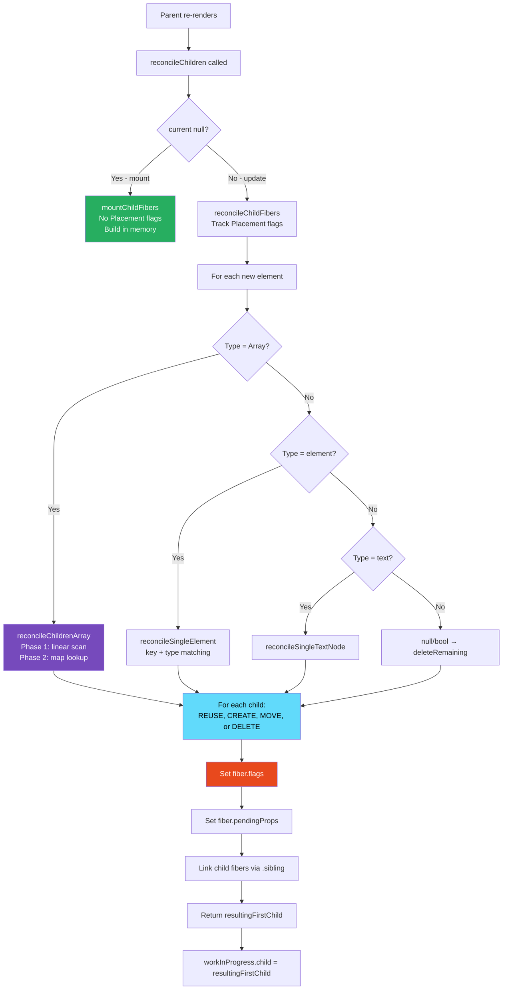
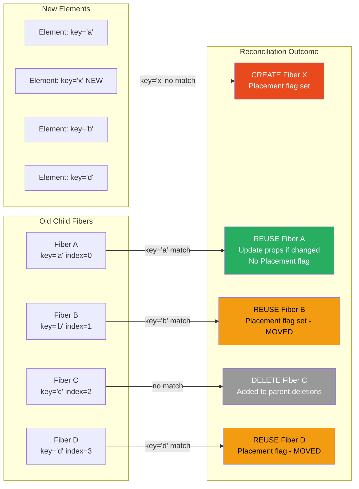

# 18 · Child Reconciliation

> **Child reconciliation is the process React uses to compare a component's new children (returned from its render function) against its existing child fibers, and determine the exact set of create, update, move, and delete operations required. It is where the diffing algorithm meets actual fiber management — where abstract "what changed" becomes concrete "which DOM nodes to touch."**

Every time a component re-renders, React must reconcile its new output against its previous output. The component might return the same children, different children, more children, fewer children, or children in a completely different order. Child reconciliation handles all of these cases with a single unified algorithm that is simultaneously O(n) and correct for the common patterns real applications exhibit.

---

## Table of Contents

- [What Child Reconciliation Does](#what-child-reconciliation-does)
- [The Reconciliation Entry Points](#the-reconciliation-entry-points)
- [Mount vs Update: Different Code Paths](#mount-vs-update-different-code-paths)
- [reconcileChildFibers: The Core Function](#reconcilechildfibers-the-core-function)
- [Text Node Reconciliation](#text-node-reconciliation)
- [Single Element Reconciliation in Depth](#single-element-reconciliation-in-depth)
- [Array Reconciliation in Depth](#array-reconciliation-in-depth)
- [The placeChild Optimization](#the-placechild-optimization)
- [How Deletions Are Tracked](#how-deletions-are-tracked)
- [Reconciling Portals](#reconciling-portals)
- [Reconciling Lazy Components](#reconciling-lazy-components)
- [The Effect of Reconciliation on the Fiber Tree](#the-effect-of-reconciliation-on-the-fiber-tree)
- [Re-render Propagation Through Children](#re-render-propagation-through-children)
- [When Children Can Be Skipped](#when-children-can-be-skipped)
- [Architecture Diagrams](#architecture-diagrams)
- [Good Practices](#good-practices)
- [Bad Practices](#bad-practices)
- [Mental Model](#mental-model)
- [Common Misconceptions](#common-misconceptions)
- [Exercises](#exercises)
- [Further Reading](#further-reading)

---

## What Child Reconciliation Does

When a component's render function runs, it produces React elements — plain JavaScript objects describing what should be in the UI. Child reconciliation takes those elements and produces a linked list of child fibers for the work-in-progress fiber tree.

For each new element, reconciliation decides one of four outcomes:

```
1. CREATE    → element has no matching existing fiber
               Action: create new FiberNode, mark Placement flag
               Result: new DOM node created in commit phase

2. UPDATE    → element matches existing fiber (same type + key)
               Action: reuse FiberNode, update pendingProps
               Result: existing DOM node's properties updated in commit phase

3. MOVE      → element matches existing fiber but position changed
               Action: reuse FiberNode, mark Placement flag
               Result: existing DOM node moved in commit phase

4. DELETE    → existing fiber has no matching new element
               Action: add to parent.deletions array
               Result: DOM node removed in commit phase
```

This four-way decision drives everything in the commit phase. The commit phase doesn't compute what changed — it only executes what reconciliation already decided.

---

## The Reconciliation Entry Points

Reconciliation is triggered from `beginWork` after a component's render function runs:

```js
// In ReactFiberBeginWork.js — called after component function runs
function reconcileChildren(current, workInProgress, nextChildren, renderLanes) {
  if (current === null) {
    // ─── MOUNT: first render — no existing children to compare against
    workInProgress.child = mountChildFibers(
      workInProgress,
      null, // no existing children
      nextChildren, // elements from render()
      renderLanes,
    );
  } else {
    // ─── UPDATE: re-render — compare against existing child fibers
    workInProgress.child = reconcileChildFibers(
      workInProgress,
      current.child, // existing first child fiber
      nextChildren, // new elements from render()
      renderLanes,
    );
  }
}
```

### The reconciler factory

Both `mountChildFibers` and `reconcileChildFibers` are produced by the same factory function, with one critical difference:

```js
// From ReactChildFiber.js
export const reconcileChildFibers = createChildReconciler(true);
//                                                         ↑ shouldTrackSideEffects = true
//                                                         Tracks Placement flags

export const mountChildFibers = createChildReconciler(false);
//                                                     ↑ shouldTrackSideEffects = false
//                                                     Does NOT track Placement flags
```

### Why shouldTrackSideEffects matters

During initial mount (`mountChildFibers`), React does not set `Placement` flags on child fibers. Instead, it relies on the root fiber having a single `Placement` flag — the entire tree is inserted in one DOM operation:

```js
// During mount: only the root gets a Placement flag
// All children are built in memory, attached to each other
// Then in commit phase: ONE insertBefore/appendChild for the entire tree

// During update: each new/moved child gets its own Placement flag
// In commit phase: individual DOM insertions for each flagged node
```

This optimization is significant: inserting a complete DOM subtree in one operation is much faster than inserting each node individually. During mount, React builds the entire DOM tree in memory (via `appendAllChildren` in `completeWork`), then inserts the root in a single DOM call.

> 🔬 **Internals:** The `shouldTrackSideEffects = false` optimization during mount is one of React's most impactful performance decisions. Creating a component tree with 100 nodes: during mount, 1 DOM insertion. During an update that adds 100 new nodes: 100 DOM insertions. This is why initial render is fast even for large trees, while updates that add many nodes at once can be slower.

---

## Mount vs Update: Different Code Paths

The behavior of reconciliation differs significantly between initial mount and updates:

### During mount (shouldTrackSideEffects = false)

```js
// Mount path — for each new element:
function createChild(returnFiber, newChild, lanes) {
  if (typeof newChild === "string" || typeof newChild === "number") {
    // Create text fiber
    const created = createFiberFromText("" + newChild, returnFiber.mode, lanes);
    created.return = returnFiber;
    return created;
    // Note: NO Placement flag set
  }

  if (typeof newChild === "object" && newChild !== null) {
    const created = createFiberFromElement(newChild, returnFiber.mode, lanes);
    created.ref = coerceRef(returnFiber, null, newChild);
    created.return = returnFiber;
    return created;
    // Note: NO Placement flag set
  }

  return null;
}
```

### During update (shouldTrackSideEffects = true)

```js
// Update path — for each new element without a matching existing fiber:
function placeSingleChild(newFiber) {
  // If tracking side effects AND this is a newly created fiber:
  if (shouldTrackSideEffects && newFiber.alternate === null) {
    // Set Placement flag — this fiber's DOM node needs insertion
    newFiber.flags |= Placement;
  }
  return newFiber;
}
```

The `alternate === null` check is important: if `alternate !== null`, the fiber was reused from the existing tree — it doesn't need insertion (it's already in the DOM). Only freshly created fibers need Placement flags.

---

## reconcileChildFibers: The Core Function

The main reconciliation dispatcher:

```js
// From ReactChildFiber.js — the reconciler's dispatch function
function reconcileChildFibersImpl(
  returnFiber,
  currentFirstChild,
  newChild,
  lanes,
) {
  // ─── Handle fragments at the top level ────────────────────────────────
  const isUnkeyedTopLevelFragment =
    typeof newChild === "object" &&
    newChild !== null &&
    newChild.type === REACT_FRAGMENT_TYPE &&
    newChild.key === null;

  if (isUnkeyedTopLevelFragment) {
    // Unwrap unkeyed top-level fragments — treat their children as the new children
    newChild = newChild.props.children;
  }

  // ─── Dispatch based on new child type ─────────────────────────────────
  if (typeof newChild === "object" && newChild !== null) {
    switch (newChild.$$typeof) {
      case REACT_ELEMENT_TYPE:
        // JSX element: <Component /> or <div />
        return placeSingleChild(
          reconcileSingleElement(
            returnFiber,
            currentFirstChild,
            newChild,
            lanes,
          ),
        );

      case REACT_PORTAL_TYPE:
        // ReactDOM.createPortal(...)
        return placeSingleChild(
          reconcileSinglePortal(
            returnFiber,
            currentFirstChild,
            newChild,
            lanes,
          ),
        );

      case REACT_LAZY_TYPE:
        // React.lazy(...)
        const payload = newChild._payload;
        const init = newChild._init;
        return reconcileChildFibersImpl(
          returnFiber,
          currentFirstChild,
          init(payload), // resolve the lazy and recurse
          lanes,
        );
    }

    if (isArray(newChild)) {
      // Array: [<A />, <B />, <C />] or items.map(...)
      return reconcileChildrenArray(
        returnFiber,
        currentFirstChild,
        newChild,
        lanes,
      );
    }

    if (getIteratorFn(newChild)) {
      // Iterable: anything with Symbol.iterator (generators, Set, Map, etc.)
      return reconcileChildrenIterator(
        returnFiber,
        currentFirstChild,
        newChild,
        lanes,
      );
    }

    // Object that doesn't match any known type
    throwOnInvalidObjectType(returnFiber, newChild);
  }

  // ─── Handle primitive children ─────────────────────────────────────────
  if (
    (typeof newChild === "string" && newChild !== "") ||
    typeof newChild === "number"
  ) {
    // Text node: "hello" or 42
    return placeSingleChild(
      reconcileSingleTextNode(
        returnFiber,
        currentFirstChild,
        "" + newChild,
        lanes,
      ),
    );
  }

  // ─── Handle null/undefined/boolean — renders nothing ──────────────────
  // null, undefined, false, true → delete all existing children
  return deleteRemainingChildren(returnFiber, currentFirstChild);
}
```

---

## Text Node Reconciliation

Text nodes are simpler than element nodes — they have no type, no key, no children:

```js
function reconcileSingleTextNode(
  returnFiber,
  currentFirstChild,
  textContent,
  lanes,
) {
  // Check if there's an existing text node to reuse
  if (currentFirstChild !== null && currentFirstChild.tag === HostText) {
    // Existing text node — delete all siblings, reuse this one
    deleteRemainingChildren(returnFiber, currentFirstChild.sibling);
    const existing = useFiber(currentFirstChild, textContent);
    existing.return = returnFiber;
    return existing; // ← REUSE: just update the text content
  }

  // No existing text node (or wrong type) — delete all, create new
  deleteRemainingChildren(returnFiber, currentFirstChild);
  const created = createFiberFromText(textContent, returnFiber.mode, lanes);
  created.return = returnFiber;
  return created; // ← CREATE
}
```

In the commit phase, updating a text node is the cheapest DOM operation:

```js
// Commit phase: update text content
function commitTextUpdate(textInstance, oldText, newText) {
  textInstance.nodeValue = newText;
  // Single property assignment — no style recalc, no layout, no paint
  // (unless the text change affects layout)
}
```

### Text content optimization for simple host components

React detects when a host component (`div`, `span`, etc.) has only a single text child and treats the text as a direct content update — no separate HostText fiber is created:

```js
// In updateHostComponent during beginWork:
function shouldSetTextContent(type, props) {
  return (
    type === "textarea" ||
    type === "noscript" ||
    typeof props.children === "string" ||
    typeof props.children === "number" ||
    (typeof props.dangerouslySetInnerHTML === "object" &&
      props.dangerouslySetInnerHTML !== null &&
      props.dangerouslySetInnerHTML.__html != null)
  );
}

// If shouldSetTextContent returns true:
// - No HostText fiber is created for the child
// - nextChildren = null (don't recurse into children)
// - Text content is set directly on the DOM node in completeWork
```

This means `<p>Hello</p>` creates one fiber (the `p`) not two (the `p` and a text node). For a list of 1000 paragraphs, this halves the fiber count.

---

## Single Element Reconciliation in Depth

The single-element reconciler handles the common case of one element replacing another:

```js
function reconcileSingleElement(
  returnFiber,
  currentFirstChild,
  element,
  lanes,
) {
  const key = element.key;
  let child = currentFirstChild;

  // ─── Walk existing children looking for a key or type match ───────────
  while (child !== null) {
    if (child.key === key) {
      // Keys match — check type
      const elementType = element.type;

      if (child.type === elementType) {
        // ✅ KEY + TYPE match: REUSE this fiber
        // Delete any remaining siblings (this is now the only child)
        deleteRemainingChildren(returnFiber, child.sibling);

        const existing = useFiber(child, element.props);
        existing.ref = coerceRef(returnFiber, child, element);
        existing.return = returnFiber;

        if (__DEV__) {
          existing._debugSource = element._source;
          existing._debugOwner = element._owner;
        }
        return existing;
      }

      // Key matches but type doesn't — delete ALL existing children
      // (including this one and all siblings)
      deleteRemainingChildren(returnFiber, child);
      break;
    } else {
      // Key doesn't match — delete this child only, try next sibling
      deleteChild(returnFiber, child);
    }
    child = child.sibling;
  }

  // ─── No match found: create a new fiber ───────────────────────────────
  if (element.type === REACT_FRAGMENT_TYPE) {
    const created = createFiberFromFragment(
      element.props.children,
      returnFiber.mode,
      lanes,
      element.key,
    );
    created.return = returnFiber;
    return created;
  } else {
    const created = createFiberFromElement(element, returnFiber.mode, lanes);
    created.ref = coerceRef(returnFiber, currentFirstChild, element);
    created.return = returnFiber;
    return created;
  }
}
```

### The sibling deletion detail

When a single element replaces multiple existing children, all extra children are deleted:

```tsx
// Previous render:
<div>
  <span>A</span>
  <span>B</span>
  <span>C</span>
</div>

// New render (conditional — only one child now):
<div>
  <span>A</span>
</div>

// reconcileSingleElement called with:
// currentFirstChild = SpanA fiber
// element = new <span>A</span>

// SpanA.key === null, element.key === null → key match (both null)
// SpanA.type === 'span', element.type === 'span' → type match
// REUSE SpanA fiber
// deleteRemainingChildren(returnFiber, SpanA.sibling)
//   → deletes SpanB and SpanC fibers
```

---

## Array Reconciliation in Depth

The array reconciler is the most complex part of child reconciliation — it handles all list scenarios:

```js
function reconcileChildrenArray(
  returnFiber,
  currentFirstChild,
  newChildren,
  lanes,
) {
  let resultingFirstChild = null;
  let previousNewFiber = null;
  let oldFiber = currentFirstChild;
  let lastPlacedIndex = 0;
  let newIdx = 0;
  let nextOldFiber = null;

  // ════════════════════════════════════════════════════════════════
  // PHASE 1: LINEAR SCAN
  // Process new children in order, matching against old fibers
  // Stops when keys don't match (reordering detected) or lists end
  // ════════════════════════════════════════════════════════════════
  for (; oldFiber !== null && newIdx < newChildren.length; newIdx++) {
    if (oldFiber.index > newIdx) {
      nextOldFiber = oldFiber;
      oldFiber = null;
    } else {
      nextOldFiber = oldFiber.sibling;
    }

    const newFiber = updateSlot(
      returnFiber,
      oldFiber,
      newChildren[newIdx],
      lanes,
    );

    if (newFiber === null) {
      // updateSlot returns null when keys don't match
      // Stop linear scan — switch to map-based matching
      if (oldFiber === null) oldFiber = nextOldFiber;
      break;
    }

    if (shouldTrackSideEffects && oldFiber && newFiber.alternate === null) {
      // updateSlot created a new fiber (type mismatch with same key)
      // Delete the old fiber
      deleteChild(returnFiber, oldFiber);
    }

    lastPlacedIndex = placeChild(newFiber, lastPlacedIndex, newIdx);

    // Build the new fiber list
    if (previousNewFiber === null) {
      resultingFirstChild = newFiber;
    } else {
      previousNewFiber.sibling = newFiber;
    }
    previousNewFiber = newFiber;
    oldFiber = nextOldFiber;
  }

  // ════════════════════════════════════════════════════════════════
  // EARLY EXIT CASES
  // ════════════════════════════════════════════════════════════════

  // Case 1: Consumed all new children — delete remaining old fibers
  if (newIdx === newChildren.length) {
    deleteRemainingChildren(returnFiber, oldFiber);
    if (getIsHydrating()) pushTreeFork(returnFiber, newIdx);
    return resultingFirstChild;
  }

  // Case 2: Consumed all old fibers — create new fibers for remaining new children
  if (oldFiber === null) {
    for (; newIdx < newChildren.length; newIdx++) {
      const newFiber = createChild(returnFiber, newChildren[newIdx], lanes);
      if (newFiber === null) continue;
      lastPlacedIndex = placeChild(newFiber, lastPlacedIndex, newIdx);
      if (previousNewFiber === null) {
        resultingFirstChild = newFiber;
      } else {
        previousNewFiber.sibling = newFiber;
      }
      previousNewFiber = newFiber;
    }
    return resultingFirstChild;
  }

  // ════════════════════════════════════════════════════════════════
  // PHASE 2: MAP-BASED MATCHING
  // Build a map of remaining old fibers, match each remaining new child
  // ════════════════════════════════════════════════════════════════
  const existingChildren = mapRemainingChildren(returnFiber, oldFiber);

  for (; newIdx < newChildren.length; newIdx++) {
    const newFiber = updateFromMap(
      existingChildren,
      returnFiber,
      newIdx,
      newChildren[newIdx],
      lanes,
    );
    if (newFiber !== null) {
      if (shouldTrackSideEffects && newFiber.alternate !== null) {
        // Fiber was reused — remove from map to prevent re-use
        existingChildren.delete(newFiber.key !== null ? newFiber.key : newIdx);
      }
      lastPlacedIndex = placeChild(newFiber, lastPlacedIndex, newIdx);
      if (previousNewFiber === null) {
        resultingFirstChild = newFiber;
      } else {
        previousNewFiber.sibling = newFiber;
      }
      previousNewFiber = newFiber;
    }
  }

  // Delete all remaining old fibers that weren't matched
  if (shouldTrackSideEffects) {
    existingChildren.forEach((child) => deleteChild(returnFiber, child));
  }

  return resultingFirstChild;
}
```

### What Phase 1 handles well

Phase 1 (linear scan) is optimized for the common case: the beginning of the list is stable, and changes happen at the end:

```tsx
// Phase 1 handles these in O(n) with no map overhead:

// Append items:
// Before: [A, B, C]
// After:  [A, B, C, D, E]
// Phase 1: A→A (reuse), B→B (reuse), C→C (reuse)
// oldFiber = null → early exit → create D and E

// Delete from end:
// Before: [A, B, C, D, E]
// After:  [A, B, C]
// Phase 1: A→A, B→B, C→C, newIdx=3=newChildren.length
// Early exit → delete D and E

// Update middle item:
// Before: [A, B, C]
// After:  [A, X, C]
// Phase 1: A→A (reuse), B→X (same position, type match → update), C→C (reuse)
```

### What Phase 2 handles

Phase 2 handles reordering and insertions in the middle:

```tsx
// Phase 2 handles these:

// Prepend:
// Before: [A, B, C]
// After:  [X, A, B, C]
// Phase 1: key(X) vs key(A) → mismatch → BREAK
// Phase 2: map = {A→fiberA, B→fiberB, C→fiberC}
//   X: not in map → CREATE
//   A: map.get('a') → REUSE fiberA
//   B: map.get('b') → REUSE fiberB
//   C: map.get('c') → REUSE fiberC

// Reverse:
// Before: [A, B, C]
// After:  [C, B, A]
// Phase 1: key(C) vs key(A) → mismatch → BREAK
// Phase 2: map = {A→fiberA, B→fiberB, C→fiberC}
//   C: map.get('c') → REUSE fiberC (placed at index 0)
//   B: map.get('b') → REUSE fiberB (placed at index 1)
//   A: map.get('a') → REUSE fiberA (placed at index 2)
```

---

## The placeChild Optimization

The `placeChild` function determines whether a reused fiber needs a DOM move. It uses `lastPlacedIndex` to track the rightmost stable position:

```js
function placeChild(newFiber, lastPlacedIndex, newIndex) {
  newFiber.index = newIndex;

  if (!shouldTrackSideEffects) {
    // Mount path: no placement flags needed
    newFiber.flags |= Forked; // only for hydration
    return lastPlacedIndex;
  }

  const current = newFiber.alternate;
  if (current !== null) {
    // Reused fiber — check if it needs to move
    const oldIndex = current.index;

    if (oldIndex < lastPlacedIndex) {
      // This fiber was BEFORE lastPlacedIndex in the old tree
      // but appears AFTER some fibers in the new tree
      // → It needs to MOVE (DOM node repositioned)
      newFiber.flags |= Placement;
      return lastPlacedIndex;
    } else {
      // This fiber's old position >= lastPlacedIndex
      // → It's already in a valid relative position — NO MOVE needed
      return oldIndex; // update lastPlacedIndex to this fiber's old position
    }
  } else {
    // New fiber — needs insertion
    newFiber.flags |= Placement;
    return lastPlacedIndex;
  }
}
```

### Tracing placeChild for a reversal

```
Old fibers: A(index=0), B(index=1), C(index=2), D(index=3)
New order:  D, C, B, A

Phase 2 (map = {a→fiberA, b→fiberB, c→fiberC, d→fiberD}):

Process D (newIdx=0):
  fiberD found in map (oldIndex=3)
  lastPlacedIndex=0
  3 >= 0 → NO MOVE → lastPlacedIndex = 3

Process C (newIdx=1):
  fiberC found in map (oldIndex=2)
  lastPlacedIndex=3
  2 < 3 → NEEDS MOVE → fiberC.flags |= Placement → lastPlacedIndex stays 3

Process B (newIdx=2):
  fiberB found in map (oldIndex=1)
  lastPlacedIndex=3
  1 < 3 → NEEDS MOVE → fiberB.flags |= Placement → lastPlacedIndex stays 3

Process A (newIdx=3):
  fiberA found in map (oldIndex=0)
  lastPlacedIndex=3
  0 < 3 → NEEDS MOVE → fiberA.flags |= Placement → lastPlacedIndex stays 3

Result: D stays, C/B/A get Placement flags
Commit phase: 3 insertBefore operations (C, B, A each moved before D's original position)
```

> 🔬 **Internals:** React always keeps the first element in the new order stable (D in this case) and moves everything else around it. This is not the optimal algorithm for minimizing DOM moves — a Longest Increasing Subsequence (LIS) algorithm would produce fewer moves in some cases. React deliberately uses a simpler algorithm because LIS is O(n log n) and the common case (one item moved, rest stable) is handled well by the `lastPlacedIndex` heuristic.

### Why prepending is expensive

```
Old fibers: A(0), B(1), C(2), D(3), E(4)
New order:  X, A, B, C, D, E (prepend X)

Phase 1: key(X) vs key(A) → mismatch → BREAK immediately
Phase 2 map: {A→0, B→1, C→2, D→3, E→4}

Process X (newIdx=0): not in map → CREATE, lastPlacedIndex=0
Process A (newIdx=1): oldIndex=0, lastPlacedIndex=0, 0 >= 0 → NO MOVE, lastPlacedIndex=0
Process B (newIdx=2): oldIndex=1, lastPlacedIndex=0, 1 >= 0 → NO MOVE, lastPlacedIndex=1
Process C (newIdx=3): oldIndex=2, lastPlacedIndex=1, 2 >= 1 → NO MOVE, lastPlacedIndex=2
Process D (newIdx=4): oldIndex=3, lastPlacedIndex=2, 3 >= 2 → NO MOVE, lastPlacedIndex=3
Process E (newIdx=5): oldIndex=4, lastPlacedIndex=3, 4 >= 3 → NO MOVE, lastPlacedIndex=4

Result: Only X is created (1 DOM insert). A, B, C, D, E don't move!
```

Prepending a single item with stable keys is very efficient: 1 DOM creation, 0 DOM moves. The `lastPlacedIndex` correctly identifies that A-E are all already in valid relative positions.

Compare this to prepending without keys (positional matching):

```
Old positions: A=0, B=1, C=2, D=3, E=4
New positions: X=0, A=1, B=2, C=3, D=4, E=5

Without keys: all positions shift
Position 0: A → X → UPDATE (text)
Position 1: B → A → UPDATE (text)
...
Position 4: E → D → UPDATE (text)
Position 5: none → E → CREATE

Result: 5 text updates + 1 create = 6 DOM operations (and state is scrambled)
```

---

## How Deletions Are Tracked

React tracks deletions on the parent fiber, not by flagging the deleted fibers themselves:

```js
function deleteChild(returnFiber, childToDelete) {
  if (!shouldTrackSideEffects) {
    return; // mount path: no deletions to track
  }

  const deletions = returnFiber.deletions;
  if (deletions === null) {
    // First deletion for this parent
    returnFiber.deletions = [childToDelete];
    returnFiber.flags |= ChildDeletion; // flag parent: has children to delete
  } else {
    // Add to existing deletion list
    deletions.push(childToDelete);
  }
}

function deleteRemainingChildren(returnFiber, currentFirstChild) {
  if (!shouldTrackSideEffects) return null;

  let childToDelete = currentFirstChild;
  while (childToDelete !== null) {
    deleteChild(returnFiber, childToDelete);
    childToDelete = childToDelete.sibling;
  }
  return null;
}
```

### Processing deletions in the commit phase

During the commit phase's mutation traversal, deletions are processed first (before placements and updates):

```js
function recursivelyTraverseMutationEffects(root, parentFiber, lanes) {
  // ─── Process deletions FIRST ───────────────────────────────────────────
  const deletions = parentFiber.deletions;
  if (deletions !== null) {
    for (let i = 0; i < deletions.length; i++) {
      const childToDelete = deletions[i];
      commitDeletion(root, childToDelete, parentFiber);
    }
  }

  // ─── Then process remaining children ──────────────────────────────────
  if (parentFiber.subtreeFlags & MutationMask) {
    let child = parentFiber.child;
    while (child !== null) {
      commitMutationEffectsOnFiber(child, root, lanes);
      child = child.sibling;
    }
  }
}
```

`commitDeletion` recursively walks the deleted subtree to run cleanup effects on every component before removing the DOM node:

```js
function commitDeletion(root, deletedFiber, nearestMountedAncestor) {
  // Walk the entire subtree of deletedFiber
  // Run useLayoutEffect cleanup on every function component
  // Run componentWillUnmount on every class component
  // Set all refs to null
  // Then remove the root DOM node of the deleted subtree

  commitNestedUnmounts(root, deletedFiber, nearestMountedAncestor);

  const hostParent = getHostParent(deletedFiber);
  const hostParentIsContainer = getHostParentIsContainer(deletedFiber);

  detachFiberMutation(deletedFiber);

  if (hostParentIsContainer) {
    removeChildFromContainer(hostParent, deletedFiber.stateNode);
  } else {
    removeChild(hostParent, deletedFiber.stateNode);
  }
}
```

---

## Reconciling Portals

Portals are children that render into a different DOM container than their parent. The reconciler handles them with a special fiber type:

```js
function reconcileSinglePortal(returnFiber, currentFirstChild, portal, lanes) {
  const key = portal.key;
  let child = currentFirstChild;

  while (child !== null) {
    if (child.key === key) {
      if (
        child.tag === HostPortal &&
        child.stateNode.containerInfo === portal.containerInfo &&
        child.stateNode.implementation === portal.implementation
      ) {
        // Existing portal with same container → REUSE
        deleteRemainingChildren(returnFiber, child.sibling);
        const existing = useFiber(child, portal.children || []);
        existing.return = returnFiber;
        return existing;
      }
      // Different container → delete and create new portal fiber
      deleteRemainingChildren(returnFiber, child);
      break;
    } else {
      deleteChild(returnFiber, child);
    }
    child = child.sibling;
  }

  const created = createFiberFromPortal(portal, returnFiber.mode, lanes);
  created.return = returnFiber;
  return created;
}
```

The portal fiber's `stateNode` contains the container DOM node. During the commit phase, portal children are inserted into their target container (not their React parent's DOM subtree).

---

## Reconciling Lazy Components

Lazy components are resolved at reconciliation time:

```js
// In reconcileChildFibersImpl:
case REACT_LAZY_TYPE: {
  const payload = newChild._payload;
  const init = newChild._init;

  try {
    // Attempt to resolve the lazy component
    return reconcileChildFibersImpl(
      returnFiber,
      currentFirstChild,
      init(payload), // calls the lazy's init function
      lanes,
    );
  } catch (x) {
    if (typeof x === 'object' && x !== null && typeof x.then === 'function') {
      // Not resolved yet — threw a Promise
      // Propagates up to be caught by the nearest Suspense boundary
      throw x;
    }
    throw x; // re-throw non-Promise errors
  }
}
```

When a lazy component's Promise resolves, React re-renders the Suspense boundary containing it, which re-runs `reconcileChildFibersImpl`, which now successfully resolves the lazy to an actual component and continues normally.

---

## The Effect of Reconciliation on the Fiber Tree

After reconciliation runs for all components in the render phase, the work-in-progress fiber tree reflects the new UI state. The key data that reconciliation has set:

```
For each fiber after reconciliation:

fiber.child          → linked list of child fibers (ordered left to right)
fiber.sibling        → next sibling fiber
fiber.flags          → Placement | Update | ChildDeletion | Ref | etc.
fiber.subtreeFlags   → aggregated flags from all descendants
fiber.deletions      → array of child fibers to delete
fiber.pendingProps   → new props for this fiber
fiber.updateQueue    → prop diff for HostComponent, effect list for FunctionComponent
```

The commit phase reads these fields and executes the operations. It never re-examines the component's render output — reconciliation has already computed everything the commit phase needs.

---

## Re-render Propagation Through Children

When a parent component re-renders, all its children are re-reconciled by default. But React's bailout optimization can skip children that haven't changed:

```js
// In beginWork, for each child fiber processed during reconciliation:
function updateElement(returnFiber, current, element, lanes) {
  const elementType = element.type;

  if (current !== null) {
    if (current.elementType === elementType) {
      // Same type — attempt to reuse
      const existing = useFiber(current, element.props);
      // ...
      return existing;
    }
  }

  // Create new (type changed or new element)
  const created = createFiberFromElement(element, returnFiber.mode, lanes);
  // ...
  return created;
}
```

After reconciliation creates the WIP fiber for a child, `beginWork` processes that child. If the child's props haven't changed and it has no pending work of its own, `beginWork` can bail out — skipping the child's render and all of its children.

This is why React.memo works: it intercepts the props comparison before `beginWork` runs the component function, and if props are equal (by shallow comparison), it forces a bailout — even though the parent re-rendered and produced new element objects for the child.

---

## When Children Can Be Skipped

Reconciliation always produces child fibers — there is no way to "skip" creating fibers for elements that the parent returned. But after fibers are created, `beginWork` can skip actually running the component function:

```js
// beginWork can bail out if:
// 1. props didn't change (oldProps === newProps — reference equality)
// 2. no pending work (fiber.lanes has no bits in renderLanes)
// 3. no context changes

if (
  oldProps === newProps &&
  !includesSomeLane(renderLanes, workInProgress.lanes) &&
  !didReceiveUpdate
) {
  return bailoutOnAlreadyFinishedWork(current, workInProgress, renderLanes);
}
```

For this to trigger, the parent must pass the **exact same object reference** for the child's props. This is only guaranteed when:

1. The props object itself is stable (not recreated on every parent render)
2. The component is wrapped with `React.memo` (which does shallow comparison instead of reference comparison)
3. The parent doesn't re-render at all (the child is passed via the `children` prop from a higher ancestor that didn't re-render)

---

## Architecture Diagrams

### Child reconciliation flow for a list update



### Fiber outcomes after child reconciliation



---

## Good Practices

### ✅ Good Practice — Structure children to maximize reuse

```tsx
/**
 * Good: Children are structured so reconciliation can maximize fiber reuse.
 * - Static children defined outside render (stable references)
 * - Dynamic children with stable keys
 * - Conditional children use explicit keys to prevent type-confusion
 */
function AnalyticsDashboard({
  metrics,
  showComparison,
  comparisonPeriod,
}: DashboardProps) {
  // Static: these never change — React reconciles them on every render
  // but they have no local state, so reuse vs create doesn't matter much
  const staticHeader = <DashboardHeader />;

  return (
    <div className="dashboard">
      {staticHeader}

      {/* Dynamic list: stable keys enable fiber reuse across filter/sort */}
      <MetricsGrid>
        {metrics.map((metric) => (
          <MetricCard
            key={metric.id} // stable ID → fiber reused when metrics reorder
            metric={metric}
          />
        ))}
      </MetricsGrid>

      {/* Conditional: key ensures clean state when period changes */}
      {showComparison && (
        <ComparisonPanel
          key={comparisonPeriod} // key reset when period changes
          period={comparisonPeriod}
        />
      )}
    </div>
  );
}
```

**Why this works:** `MetricCard` fibers are reused when metrics sort/filter (stable key). `ComparisonPanel` resets completely when `comparisonPeriod` changes (key reset). The static `DashboardHeader` is always reconciled but its reconciliation is trivially cheap (no children with state).

---

## Bad Practices

### ⚠️ Bad Practice — Conditional rendering that silently reuses the wrong fiber

```tsx
/**
 * Bad: Two different components at the same position with no explicit differentiation.
 * When condition switches, React sees the same position in the child list.
 * If they have the same type, React reuses the fiber — keeping stale state.
 * This is the most common source of "stale state in forms" bugs.
 */
function UserPanel({ view }: { view: "profile" | "settings" }) {
  return (
    <div>
      {/* ❌ Both are <Form> type at position 0 */}
      {/* When view changes profile → settings: */}
      {/* Same type (Form) at same position → REUSE fiber */}
      {/* ProfileForm's state becomes SettingsForm's starting state */}
      {view === "profile" ? (
        <Form fields={profileFields} onSubmit={saveProfile} />
      ) : (
        <Form fields={settingsFields} onSubmit={saveSettings} />
      )}
    </div>
  );
}

/**
 * ✅ Fix Option 1: Explicit key differentiation
 * Different keys → fiber reuse prevented even though types match
 */
function UserPanel({ view }: { view: "profile" | "settings" }) {
  return (
    <div>
      {view === "profile" ? (
        <Form key="profile" fields={profileFields} onSubmit={saveProfile} />
      ) : (
        <Form key="settings" fields={settingsFields} onSubmit={saveSettings} />
      )}
    </div>
  );
}

/**
 * ✅ Fix Option 2: Different component types (always forces remount)
 */
function UserPanel({ view }: { view: "profile" | "settings" }) {
  return (
    <div>
      {view === "profile" ? (
        <ProfileForm fields={profileFields} onSubmit={saveProfile} />
      ) : (
        <SettingsForm fields={settingsFields} onSubmit={saveSettings} />
      )}
    </div>
  );
}

/**
 * ✅ Fix Option 3: key on the parent (resets entire panel)
 */
function UserPanelPage({ view }: { view: "profile" | "settings" }) {
  return <UserPanel key={view} view={view} />;
}
```

**What happens with bad code:** User fills in the profile form (local state: name, bio, avatar). Switches to settings view. The `Form` component's fiber is reused (same type, same position). `useState` returns the profile form's stale state — name, bio, avatar values appear in the settings form. Settings form fields show wrong initial values. User submits settings → saves profile data to settings endpoint → data corruption.

**Production impact:** This exact bug has caused data corruption in production systems. A user editing their name accidentally overwrites a system setting with the same value because the form was reused from a previous context. Always use explicit keys when the same component type is used for logically different purposes at the same position.

---

## Mental Model

> 💡 **The child reconciliation mental model:**
>
> Child reconciliation is like a **hotel front desk** managing room assignments. When guests check in (new render), the desk has a list of incoming guests (new elements) and a record of who's currently in each room (existing fibers). The desk tries to keep guests in their same room if possible (fiber reuse). It matches guests by their reservation ID (key). If a guest has no ID, they get the same room number they had before (positional matching). New guests get new rooms (fiber creation). Guests who didn't return get checked out (fiber deletion). Guests who moved rooms (reordered) get escorted to their new room (DOM move). The desk never demolishes and rebuilds a room for an existing guest — it updates the room's amenities instead (prop update). Demolition only happens when a completely different type of accommodation is needed (type mismatch).

---

## Common Misconceptions

### "React compares all old children against all new children"

React uses a two-phase algorithm: Phase 1 is a linear scan (O(n)) that handles ordered lists efficiently. Phase 2 uses a hash map (O(1) per lookup) only when reordering is detected. Total complexity is O(n), not O(n²).

### "Reconciliation happens in the commit phase"

Reconciliation is the render phase process of comparing trees and computing changes. The commit phase only executes the changes reconciliation computed. By the time the commit phase starts, every fiber is already tagged with its required action.

### "React always creates a new fiber when a component re-renders"

React reuses existing fibers for the same component at the same position (or with the same key). A re-render means the component function is called again, but the fiber it runs in is the same fiber from the previous render — the same object, with updated `pendingProps` and potentially updated `memoizedState`.

### "Returning null from render deletes the component"

Returning `null` deletes the _children_ of a component, not the component itself. The fiber for the component that returned `null` still exists. `reconcileChildFibers` is called with `newChild = null`, which calls `deleteRemainingChildren(returnFiber, currentFirstChild)` — deleting all of that component's previous children.

---

## Exercises

### Exercise 1 — Observe mount vs update insertion behavior

```tsx
function InsertionObserver() {
  const [showList, setShowList] = useState(false);

  return (
    <div>
      <button onClick={() => setShowList(true)}>Show List (mount)</button>
      {showList && (
        <ul>
          {[1, 2, 3, 4, 5].map((i) => (
            <li key={i}>{i}</li>
          ))}
        </ul>
      )}
    </div>
  );
}
```

Open DevTools → Performance → Record. Click "Show List." Stop recording. Look at the flame graph: how many DOM operations does the mount trigger? (Answer: should be 1 appendChild for the entire `ul` subtree.) Compare with adding one item to an existing list — observe individual node insertions.

### Exercise 2 — Trace placeChild for different reorder patterns

For each of these list transformations, predict which fibers will get Placement flags before testing:

```
[A, B, C, D] → [D, A, B, C]  (move last to first)
[A, B, C, D] → [A, B, D, C]  (swap last two)
[A, B, C, D] → [B, A, C, D]  (swap first two)
[A, B, C, D] → [D, C, B, A]  (full reverse)
```

Verify with React DevTools Profiler — which components show "re-rendered" vs "did not render" after each transformation?

### Exercise 3 — The same-type conditional state bug

```tsx
function SameTypeBug() {
  const [which, setWhich] = useState<"A" | "B">("A");

  return (
    <div>
      <button onClick={() => setWhich((w) => (w === "A" ? "B" : "A"))}>
        Switch
      </button>
      {/* Both use <input> — same type, same position */}
      {which === "A" ? (
        <input placeholder="Form A" />
      ) : (
        <input placeholder="Form B" />
      )}
    </div>
  );
}
```

1. Type something in the input (Form A)
2. Click Switch
3. Does the text stay? (Yes — fiber reused!)
4. Add `key="a"` and `key="b"` to each input
5. Repeat — does the text stay? (No — different keys → different fibers)

---

## Further Reading

- [React Source: ReactChildFiber.js](https://github.com/facebook/react/blob/main/packages/react-reconciler/src/ReactChildFiber.js) — Complete child reconciliation implementation
- [React Source: ReactFiberBeginWork.js — reconcileChildren](https://github.com/facebook/react/blob/main/packages/react-reconciler/src/ReactFiberBeginWork.js) — Where reconciliation is triggered
- [React Source: ReactFiberCommitWork.js — commitDeletion](https://github.com/facebook/react/blob/main/packages/react-reconciler/src/ReactFiberCommitWork.js) — How deleted fibers are processed
- [React Docs: Preserving and Resetting State](https://react.dev/learn/preserving-and-resetting-state) — The user-facing guide to fiber identity
- [Rodrigo Pombo: Build your own React](https://pomb.us/build-your-own-react/) — Implementing reconciliation from scratch
- Next in this handbook: [19 · DOM Reuse Strategies](./04-dom-reuse.md)

---

_Part of the [React + Next.js Engineering Handbook](../../README.md)_
