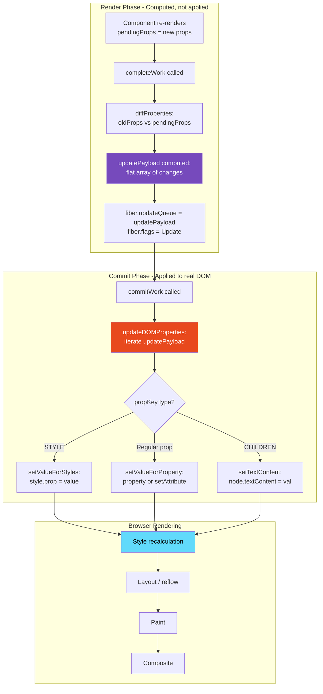
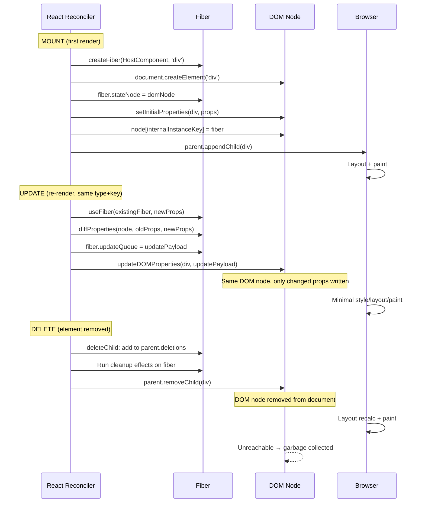

# 19 · DOM Reuse Strategies

> **React's goal in reconciliation is not to produce correct HTML — it is to produce the minimum possible set of DOM mutations. DOM operations are expensive. Every property assignment, every attribute change, every node insertion triggers work in the browser's rendering engine. React's DOM reuse strategy is a system of heuristics and algorithms designed to turn "something changed" into the precise smallest set of DOM API calls needed to reflect that change.**

Most developers understand that React diffs the virtual DOM. Fewer understand what happens on the other side of that diff — how React decides which DOM properties to update, in what order, and what the browser actually does with each mutation. This document covers the complete DOM reuse pipeline: from fiber flags to DOM property assignment to browser rendering impact.

---

## Table of Contents

- [What DOM Reuse Actually Means](#what-dom-reuse-actually-means)
- [The stateNode Connection](#the-statenode-connection)
- [The Prop Diffing Algorithm](#the-prop-diffing-algorithm)
- [How updatePayload is Constructed](#how-updatepayload-is-constructed)
- [Applying the Prop Diff: updateDOMProperties](#applying-the-prop-diff-updatedomproperties)
- [Property vs Attribute: The React Decision](#property-vs-attribute-the-react-decision)
- [Style Object Diffing](#style-object-diffing)
- [Event Listener Management](#event-listener-management)
- [Controlled Inputs: A Special Case](#controlled-inputs-a-special-case)
- [DOM Node Creation: createInstance](#dom-node-creation-createinstance)
- [What React Never Touches](#what-react-never-touches)
- [The Browser Cost Model for DOM Mutations](#the-browser-cost-model-for-dom-mutations)
- [DOM Reuse and Layout Thrashing](#dom-reuse-and-layout-thrashing)
- [Architecture Diagrams](#architecture-diagrams)
- [Good Practices](#good-practices)
- [Bad Practices](#bad-practices)
- [Mental Model](#mental-model)
- [Common Misconceptions](#common-misconceptions)
- [Exercises](#exercises)
- [Further Reading](#further-reading)

---

## What DOM Reuse Actually Means

When React "reuses" a DOM node, it means the existing DOM node (the C++ object inside the browser) is kept in the document and only its properties are updated. The node is not removed and reinserted — it stays exactly where it is. Only the specific properties that changed are written.

This is the fundamental operation that makes React efficient for updates:

```
Browser DOM tree (what exists):
  <div id="card" class="inactive">
    <h2>Old Title</h2>
    <p>Old body text</p>
  </div>

React's diff result:
  class: "inactive" → "active"    (changed)
  children[0].text: "Old Title" → "New Title"  (changed)
  children[1].text: unchanged

React's DOM operations (minimum set):
  1. div.className = 'active'          (1 property write)
  2. h2.firstChild.nodeValue = 'New Title'  (1 text update)
  Total: 2 DOM mutations

What React does NOT do:
  - Remove the div and recreate it
  - Update the <p> element (unchanged)
  - Create new <h2> and <p> elements
  - Re-attach any event listeners
```

The stateNode on each fiber is the pointer to the existing DOM node. React reads from this pointer, computes what changed, and writes only those changes back.

---

## The stateNode Connection

Every `HostComponent` (DOM element) fiber has a `stateNode` field pointing to the real DOM node:

```js
// Fiber for <div className="card">
{
  tag: 5,                    // HostComponent
  type: 'div',               // DOM element type
  stateNode: HTMLDivElement, // ← the actual DOM node (C++ object via JS binding)
  memoizedProps: {           // props from last committed render
    className: 'inactive',
    onClick: handler,
    children: [...]
  },
  pendingProps: {            // props from current render
    className: 'active',
    onClick: handler,        // same reference
    children: [...]
  },
  updateQueue: [             // computed prop diff (set during completeWork)
    'className', 'active'   // only what changed
  ],
  flags: Update,             // tells commit phase: update this fiber's DOM
}
```

The `stateNode` is created once (during initial mount in `completeWork`) and never replaced for the same fiber. As long as the fiber is reused (same type, same key), its `stateNode` — the DOM node — is also reused.

### stateNode creation and DOM lifecycle

```
Mount:
  completeWork(fiber) → createInstance(type, props)
                        → document.createElement(type)
                        → stateNode = domNode

First commit (Placement):
  commitPlacement(fiber)
  → parentDOM.appendChild(fiber.stateNode) or insertBefore
  → DOM node enters the document

Subsequent renders (Update):
  fiber.stateNode still points to the same DOM node
  commitWork(fiber) → apply updateQueue to stateNode
  → DOM node stays in place, only properties change

Unmount (Deletion):
  commitDeletion(fiber)
  → parentDOM.removeChild(fiber.stateNode)
  → DOM node removed from document
  → fiber.stateNode becomes unreachable → garbage collected
```

---

## The Prop Diffing Algorithm

React computes the prop diff during `completeWork` in the render phase — before the commit phase runs. This separation means the expensive "what changed" computation happens in the interruptible render phase, and the commit phase only executes pre-computed operations.

### prepareUpdate: computing the diff

```js
// From ReactDOMHostConfig.js
function prepareUpdate(
  domElement,
  type,
  oldProps,
  newProps,
  rootContainerInstance,
) {
  return diffProperties(
    domElement,
    type,
    oldProps,
    newProps,
    rootContainerInstance,
  );
}

// diffProperties produces a flat array: [key1, value1, key2, value2, ...]
// null if no changes
function diffProperties(
  domElement,
  tag,
  lastRawProps,
  nextRawProps,
  rootContainerInstance,
) {
  let updatePayload = null;
  let lastProps = lastRawProps;
  let nextProps = nextRawProps;

  // Handle form elements (value/checked need special treatment)
  switch (tag) {
    case "input":
      lastProps = ReactDOMInputGetHostProps(domElement, lastRawProps);
      nextProps = ReactDOMInputGetHostProps(domElement, nextRawProps);
      updatePayload = [];
      break;
    case "select":
    case "textarea":
      // Similar special handling
      break;
  }

  assertValidProps(tag, nextProps);

  let propKey;
  let styleName;
  let styleUpdates = null;

  // ─── Phase 1: Find removed props ──────────────────────────────────────
  for (propKey in lastProps) {
    if (
      nextProps.hasOwnProperty(propKey) || // still present in new props
      !lastProps.hasOwnProperty(propKey) || // wasn't an own property
      lastProps[propKey] == null // was null/undefined anyway
    ) {
      continue; // skip — either still present or never really set
    }

    // This prop existed in old but not in new → need to remove it
    if (propKey === STYLE) {
      // Remove all style properties
      const lastStyle = lastProps[propKey];
      for (styleName in lastStyle) {
        if (lastStyle.hasOwnProperty(styleName)) {
          if (!styleUpdates) styleUpdates = {};
          styleUpdates[styleName] = ""; // empty string = remove
        }
      }
    } else if (propKey === CHILDREN) {
      if (
        typeof lastProps[propKey] === "string" ||
        typeof lastProps[propKey] === "number"
      ) {
        // Text content will be reset by ContentReset flag
      }
    } else if (
      propKey === SUPPRESS_CONTENT_EDITABLE_WARNING ||
      propKey === SUPPRESS_HYDRATION_WARNING
    ) {
      // Internal props — skip
    } else if (propKey === AUTOFOCUS) {
      // Skip — handled differently
    } else if (registeredEventPluginsByName.hasOwnProperty(propKey)) {
      // Event listener being removed
      if (!updatePayload) updatePayload = [];
      // Event listeners are removed lazily — not in updatePayload
    } else {
      // DOM attribute being removed
      (updatePayload = updatePayload || []).push(propKey, null);
    }
  }

  // ─── Phase 2: Find changed or added props ─────────────────────────────
  for (propKey in nextProps) {
    const nextProp = nextProps[propKey];
    const lastProp = lastProps != null ? lastProps[propKey] : undefined;

    if (
      !nextProps.hasOwnProperty(propKey) ||
      nextProp === lastProp ||
      (nextProp == null && lastProp == null)
    ) {
      continue; // not changed
    }

    if (propKey === STYLE) {
      if (lastProp) {
        // Style changed: find which properties changed
        for (styleName in lastProp) {
          if (
            lastProp.hasOwnProperty(styleName) &&
            (!nextProp || !nextProp.hasOwnProperty(styleName))
          ) {
            if (!styleUpdates) styleUpdates = {};
            styleUpdates[styleName] = ""; // removed style property
          }
        }
        for (styleName in nextProp) {
          if (
            nextProp.hasOwnProperty(styleName) &&
            lastProp[styleName] !== nextProp[styleName]
          ) {
            if (!styleUpdates) styleUpdates = {};
            styleUpdates[styleName] = nextProp[styleName]; // changed style property
          }
        }
      } else {
        // New style object
        if (!styleUpdates) styleUpdates = nextProp;
      }
    } else if (propKey === CHILDREN) {
      if (typeof nextProp === "string" || typeof nextProp === "number") {
        (updatePayload = updatePayload || []).push(propKey, "" + nextProp);
      }
    } else if (
      propKey === SUPPRESS_CONTENT_EDITABLE_WARNING ||
      propKey === SUPPRESS_HYDRATION_WARNING
    ) {
      // Internal — skip
    } else if (registeredEventPluginsByName.hasOwnProperty(propKey)) {
      // Event handler changed
      if (!updatePayload) updatePayload = [];
      // Event listener changes are processed by the event system
    } else {
      // Regular DOM property — add to updatePayload
      (updatePayload = updatePayload || []).push(propKey, nextProp);
    }
  }

  // Add style updates to payload
  if (styleUpdates) {
    (updatePayload = updatePayload || []).push(STYLE, styleUpdates);
  }

  return updatePayload; // null if nothing changed, array if something changed
}
```

### The updatePayload format

```js
// updatePayload is a flat alternating-key-value array
// Example: className changed, style.color changed, 'data-id' removed
updatePayload = [
  "className",
  "active card", // key, new value
  "style",
  { color: "red" }, // key, delta style object
  "data-id",
  null, // key, null = remove attribute
];
```

The flat array format avoids the overhead of creating many small objects. React iterates it with `i += 2` (every other entry is a key, every other entry is a value).

---

## Applying the Prop Diff: updateDOMProperties

During the commit phase's mutation phase, React applies the pre-computed `updatePayload` to the real DOM node:

```js
// From ReactDOMComponent.js
function updateDOMProperties(
  domElement,
  updatePayload,
  wasCustomComponentTag,
  isCustomComponentTag,
) {
  // Iterate the flat array: [key1, val1, key2, val2, ...]
  for (let i = 0; i < updatePayload.length; i += 2) {
    const propKey = updatePayload[i];
    const propValue = updatePayload[i + 1];

    if (propKey === STYLE) {
      // Apply style object
      setValueForStyles(domElement, propValue);
    } else if (propKey === DANGEROUSLY_SET_INNER_HTML) {
      // Set innerHTML
      const nextHtml = propValue ? propValue[HTML] : undefined;
      if (nextHtml != null) {
        setInnerHTML(domElement, nextHtml);
      }
    } else if (propKey === CHILDREN) {
      // Set text content (for simple text children)
      setTextContent(domElement, propValue);
    } else {
      // Set individual property or attribute
      setValueForProperty(domElement, propKey, propValue, isCustomComponentTag);
    }
  }
}
```

### setValueForStyles: applying style changes

```js
function setValueForStyles(node, styles) {
  const style = node.style;
  for (let styleName in styles) {
    if (!styles.hasOwnProperty(styleName)) continue;

    const isCustomProperty = styleName.indexOf("--") === 0; // CSS custom property
    const styleValue = dangerousStyleValue(
      styleName,
      styles[styleName],
      isCustomProperty,
    );

    if (styleName === "float") {
      // 'float' is 'cssFloat' in JavaScript
      styleName = "cssFloat";
    }

    if (isCustomProperty) {
      style.setProperty(styleName, styleValue);
    } else {
      style[styleName] = styleValue;
      // Direct property assignment — fastest path for CSS properties
    }
  }
}
```

Only the specific style properties that changed are written. If `style={{ color: 'red', fontSize: 14 }}` and only `color` changes to `'blue'`, only `style.color = 'blue'` is executed — `fontSize` is not touched.

---

## Property vs Attribute: The React Decision

React must decide for each prop whether to set it as a DOM **property** (JavaScript object property) or an HTML **attribute** (string attribute via `setAttribute`). This matters because:

- Properties can hold any JavaScript value (objects, functions, booleans)
- Attributes are always strings
- Some properties and attributes have different names or semantics
- Some values must go through specific DOM APIs

```js
// From ReactDOMComponent.js — the property vs attribute routing
function setValueForProperty(node, name, value, isCustomComponent) {
  // Handle null/undefined → remove the attribute
  if (value === null) {
    removeValueForProperty(node, name);
    return;
  }

  // Custom elements (web components): always use setAttribute
  if (isCustomComponent) {
    if (value === "") {
      node.removeAttribute(name);
    } else {
      node.setAttribute(name, "" + value);
    }
    return;
  }

  // Look up React's property info for this prop name
  const propertyInfo = getPropertyInfo(name);

  if (propertyInfo !== null) {
    // React knows about this property
    switch (propertyInfo.type) {
      case BOOLEAN:
        // Boolean attributes: set presence/absence, not value
        if (value) {
          node.setAttribute(propertyInfo.attributeName, "");
        } else {
          node.removeAttribute(propertyInfo.attributeName);
        }
        return;

      case OVERLOADED_BOOLEAN:
        if (value === false) {
          node.removeAttribute(propertyInfo.attributeName);
          return;
        }
        break;

      case NUMERIC:
      case POSITIVE_NUMERIC:
        // Validate numeric constraints
        if (
          !isFinite(value) ||
          (propertyInfo.type === POSITIVE_NUMERIC && value < 1)
        ) {
          return; // skip invalid values
        }
        break;
    }

    if (propertyInfo.mustUseProperty) {
      // Must set as property (not attribute) for correct behavior
      // Examples: value, checked, selected
      node[propertyInfo.propertyName] = value;
    } else {
      const attributeName = propertyInfo.attributeName;
      const attributeNamespace = propertyInfo.attributeNamespace;

      if (attributeNamespace) {
        // SVG attributes with namespaces
        node.setAttributeNS(attributeNamespace, attributeName, "" + value);
      } else if (propertyInfo.sanitizeURL) {
        // URL attributes: sanitize before setting (prevent javascript: injection)
        const sanitizedValue = sanitizeURL("" + value);
        node.setAttribute(attributeName, sanitizedValue);
      } else {
        node.setAttribute(attributeName, "" + value);
      }
    }
  } else {
    // Unknown property (custom data attributes, unknown HTML attrs)
    if (isAttributeNameSafe(name)) {
      node.setAttribute(name, "" + value);
    }
  }
}
```

### The prop name translation table

React translates JSX prop names to DOM property/attribute names:

| JSX Prop    | DOM Property     | DOM Attribute | Notes                          |
| ----------- | ---------------- | ------------- | ------------------------------ |
| `className` | `node.className` | `class`       | `class` is reserved in JS      |
| `htmlFor`   | `node.htmlFor`   | `for`         | `for` is reserved in JS        |
| `tabIndex`  | `node.tabIndex`  | `tabindex`    | camelCase → lowercase          |
| `style`     | `node.style.*`   | `style`       | Object → individual properties |
| `onClick`   | —                | —             | React event system (not DOM)   |
| `value`     | `node.value`     | `value`       | `mustUseProperty: true`        |
| `checked`   | `node.checked`   | `checked`     | `mustUseProperty: true`        |
| `selected`  | `node.selected`  | `selected`    | `mustUseProperty: true`        |
| `disabled`  | `node.disabled`  | `disabled`    | Boolean attribute              |
| `readOnly`  | `node.readOnly`  | `readonly`    | camelCase → lowercase          |
| `srcSet`    | —                | `srcset`      | lowercase attribute name       |
| `data-*`    | —                | `data-*`      | Custom data attributes         |
| `aria-*`    | —                | `aria-*`      | ARIA attributes                |

### Why `mustUseProperty` matters

For `value`, `checked`, and `selected`, React sets the DOM **property**, not the HTML attribute:

```js
// ✅ Correct: sets the INPUT's value property
input.value = "hello";

// ❌ Wrong for current value: sets the DEFAULT value attribute
input.setAttribute("value", "hello");
// After a user has typed, this no longer reflects the displayed value
// The 'value' property and 'value' attribute diverge after user interaction
```

The HTML attribute `value` sets the **default value** (what the input starts with). The DOM property `value` reflects the **current value** (what the input currently shows). For React's controlled inputs, the property must be set — not the attribute — to correctly reflect current state.

---

## Style Object Diffing

React's style diffing is more sophisticated than simple object comparison. It diffs at the property level:

```js
// Previous render:
style={{ color: 'red', fontSize: 14, fontWeight: 'bold' }}

// Current render:
style={{ color: 'blue', fontSize: 14 }}
// fontSize unchanged, fontWeight removed, color changed

// diffProperties computes:
styleUpdates = {
  color: 'blue',    // changed
  fontWeight: '',   // removed (empty string = reset)
  // fontSize not included — unchanged
}

// In commit phase, setValueForStyles applies:
style.color = 'blue';
style.fontWeight = ''; // resets to inherited value
// style.fontSize NOT touched
```

### Why empty string removes a style

Setting a CSS property to an empty string removes the inline style declaration, allowing the property to inherit its value from the cascade:

```js
element.style.fontWeight = "";
// Equivalent to removing `font-weight` from the `style` attribute
// Element now inherits fontWeight from its CSS class or parent
```

### CSS custom properties (variables)

For CSS custom properties (`--my-color`), React uses `setProperty` instead of direct assignment:

```js
if (styleName.indexOf("--") === 0) {
  // CSS custom property
  style.setProperty(styleName, styleValue);
} else {
  // Regular CSS property
  style[styleName] = styleValue;
}
```

`style.setProperty` is needed because `style['--my-color']` doesn't work in all browsers — CSS custom properties are not reflected as direct properties of the `CSSStyleDeclaration` object.

---

## Event Listener Management

React does not attach event listeners to individual DOM nodes. Instead, it uses **event delegation** — a single set of event listeners at the root container:

```js
// When React root is created:
const root = ReactDOM.createRoot(container);

// React attaches listeners to `container` — not to individual elements
// All clicks, inputs, keypresses, etc. bubble up to container
container.addEventListener("click", dispatchEvent, false);
container.addEventListener("input", dispatchEvent, false);
// ... etc for all supported events
```

When a DOM event fires, it bubbles to the root container. React's dispatch system:

1. Identifies which React fiber the event occurred on (via `__reactFiber` property on the DOM node)
2. Synthesizes a `SyntheticEvent` object
3. Traverses the fiber tree upward, collecting all matching event handlers
4. Dispatches the synthetic event through the captured/bubbled handler chain

### What this means for DOM reuse

Because event listeners are on the root container (not individual elements), React never needs to add or remove event listeners when:

- A component re-renders with a different `onClick` function
- A component mounts with an event handler
- A component unmounts

The listener is always at the root. React's internal mapping (fiber → handler function) is updated during reconciliation, but no actual `addEventListener`/`removeEventListener` calls are made to the element.

```js
// This does NOT call element.addEventListener or element.removeEventListener:
<button onClick={newHandler}>Click</button>
// React just updates its internal fiber → handler mapping
// The root container listener is already there
```

### Exceptions: passive event listeners and capture phase

For certain events that need capture-phase handling or must be passive (for scroll performance), React does attach listeners to specific DOM nodes:

```js
// Certain events attached directly:
element.addEventListener('scroll', ..., { passive: true });
// passive: true tells browser this handler won't call preventDefault()
// Browser can proceed with scroll without waiting for JS to complete
// → smooth scrolling even under heavy JavaScript load
```

---

## Controlled Inputs: A Special Case

Controlled inputs in React are one of the most complex DOM interactions. The browser has strong opinions about input state that React must override:

```tsx
function ControlledInput() {
  const [value, setValue] = useState("hello");

  return (
    <input
      value={value} // controlled: React owns the value
      onChange={(e) => setValue(e.target.value)}
    />
  );
}
```

### The controlled input problem

When a user types in an input, the browser immediately updates `input.value`. If React's `value` prop hasn't changed, React must reset `input.value` back to the React-controlled value. This creates a feedback loop:

```
1. User types 'x' → browser sets input.value = 'hellox'
2. onChange fires → setValue('hellox') → React state updates
3. React re-renders → new render has value='hellox'
4. Commit: input.value is already 'hellox' → no DOM update needed (already correct)

But what if the onChange handler doesn't update state?
1. User types 'x' → browser sets input.value = 'hellox'
2. onChange fires → handler does nothing (or validates and rejects)
3. React re-renders (due to parent) → render has value='hello' (unchanged)
4. Commit: current DOM value='hellox', React wants 'hello'
   → input.value = 'hello' (override the browser)
```

React enforces controlled input values by **always** setting `input.value` in the commit phase when the `value` prop is controlled, even if React believes the value hasn't changed:

```js
// From ReactDOMInputComponent.js
function updateWrapper(element, props) {
  const node = element;

  // Always set value for controlled inputs
  if (props.hasOwnProperty("value") || props.hasOwnProperty("defaultValue")) {
    const type = props.type;
    const isSubmitOrReset = type === "submit" || type === "reset";

    if (
      isSubmitOrReset &&
      (props.value === undefined || props.value === null)
    ) {
      return;
    }

    const toString = isCheckable ? props.checked : props.value;
    const node_value = isCheckable ? node.checked : node.value;

    const newValue =
      toString !== null && toString !== undefined ? "" + toString : node_value;

    if (
      newValue !== node_value ||
      (isCheckable && props.defaultChecked !== undefined)
    ) {
      // Browser value differs from React value → override
      setInputValue(node, newValue);
    }

    node.defaultValue = "";
  }
}
```

> 🔬 **Internals:** React's controlled input handling is notoriously complex. It must handle: text inputs, checkboxes, radio buttons, select elements, textareas, and number inputs — each with different browser behaviors. The React source for input handling is one of the densest parts of the codebase, with special-case handling for browser quirks (Chrome's handling of number inputs, Safari's select behavior, IE's file input restrictions, etc.).

### The cursor position problem

When React sets `input.value = 'new value'`, the browser resets the cursor position to the end of the input. For controlled inputs where the user is typing, this causes cursor jumps:

```js
// React 16+ handles this by preserving selection:
function setInputValue(node, value) {
  // Read current selection before update
  const selectionStart = node.selectionStart;
  const selectionEnd = node.selectionEnd;

  // Set the new value
  node.value = value;

  // Restore selection if possible
  if (selectionStart !== null && selectionEnd !== null) {
    try {
      node.setSelectionRange(selectionStart, selectionEnd, selectionDirection);
    } catch (e) {
      // Some input types don't support setSelectionRange
    }
  }
}
```

---

## DOM Node Creation: createInstance

When a new DOM node needs to be created (first mount, or type changed), React calls `createInstance`:

```js
// From ReactDOMHostConfig.js
function createInstance(
  type,
  newProps,
  rootContainerInstance,
  currentHostContext,
  workInProgress,
) {
  let parentNamespace = currentHostContext;

  // Determine namespace (HTML, SVG, MathML)
  const domElement = createElement(
    type,
    newProps,
    rootContainerInstance,
    parentNamespace,
  );

  // Pre-cache React fiber reference on the DOM node
  // This allows the event system to find the fiber from a DOM node
  precacheFiberNode(workInProgress, domElement);

  // Pre-cache React props on the DOM node
  // This allows the event system to read current props without going through fiber
  updateFiberProps(domElement, newProps);

  return domElement;
}

function createElement(type, props, rootContainerElement, parentNamespace) {
  let ownerDocument = getOwnerDocumentFromRootContainer(rootContainerElement);
  let domElement;
  let namespaceURI = parentNamespace;

  if (namespaceURI === SVG_NAMESPACE) {
    // SVG element
    if (type === "svg") {
      namespaceURI = SVG_NAMESPACE;
    }
    domElement = ownerDocument.createElementNS(namespaceURI, type);
  } else if (type === "script") {
    // Script elements need special treatment
    const div = ownerDocument.createElement("div");
    div.innerHTML = "<script></" + "script>";
    const firstChild = div.firstChild;
    domElement = div.removeChild(firstChild);
  } else if (typeof props.is === "string") {
    // Custom element with `is` attribute
    domElement = ownerDocument.createElement(type, { is: props.is });
  } else {
    // Standard HTML element
    domElement = ownerDocument.createElement(type);
  }

  return domElement;
}
```

### Precaching the fiber on the DOM node

After creating a DOM node, React stores a reference to the fiber on the DOM node itself:

```js
function precacheFiberNode(hostInst, node) {
  node[internalInstanceKey] = hostInst;
  // internalInstanceKey = '__reactFiber$' + randomKey
}

// This enables:
// 1. Event system: find fiber from event.target
// 2. DevTools: inspect fiber from DOM node
// 3. Debugging: window.$r in DevTools after clicking a component
```

---

## What React Never Touches

Understanding what React does NOT touch is as important as understanding what it does:

### Browser-managed DOM state

React never reads or writes these through its rendering pipeline:

```js
// React doesn't manage these (browser controls them):
element.scrollTop; // scroll position
element.scrollLeft;
element.offsetHeight; // layout dimensions
element.getBoundingClientRect();
element.focus(); // focus state
window.getSelection(); // text selection
```

These are read by React only when explicitly needed in effects (`useLayoutEffect`, `useEffect`) or in event handlers. React's rendering pipeline never reads layout properties — doing so would force the browser to synchronously reflow.

### Computed styles

React never reads computed styles during rendering:

```js
// React never does this during rendering:
window.getComputedStyle(element).color; // NEVER in render phase

// Reading computed styles forces a layout flush:
// All pending style changes must be applied before the computation
// This is called "forced synchronous layout" or "layout thrashing"
```

### DOM node identity

React tracks DOM nodes through fiber `stateNode` pointers. It never searches the DOM by selector or traverses `parentNode`/`childNodes` chains during normal rendering.

---

## The Browser Cost Model for DOM Mutations

Not all DOM mutations are equal. Understanding which mutations are expensive determines where optimization effort pays off:

### Property changes (cheapest for non-layout)

```js
element.className = "new-class"; // Style recalc on next frame
element.textContent = "new text"; // Text node update + potential reflow
element.style.color = "red"; // Style recalc on next frame
element.setAttribute("data-x", "y"); // Attribute update
```

Cost breakdown:

- No immediate work (browser batches style changes)
- On next frame: style recalculation for affected elements
- If layout properties changed: reflow (layout calculation)
- If visual properties changed: repaint

### Layout-affecting property changes (moderate)

```js
element.style.width = "200px"; // Style recalc + layout (reflow)
element.style.display = "none"; // Style recalc + layout
element.style.fontSize = "18px"; // Style recalc + layout (text layout)
```

When you change a property that affects layout (dimensions, display, position, font), the browser must recompute the layout of the affected element and potentially all its ancestors and siblings. This is **reflow**.

### DOM structure changes (most expensive)

```js
parent.appendChild(child); // Layout + paint for inserted subtree
parent.removeChild(child); // Layout recalculation + paint
parent.insertBefore(child, ref); // Layout + paint
```

Inserting or removing DOM nodes forces the browser to:

1. Update the DOM tree structure
2. Recalculate styles for all affected elements
3. Perform layout for the affected subtree
4. Repaint the affected region
5. Composite layers

### Reading layout properties (forces synchronous reflow)

```js
// These FORCE a synchronous reflow before returning:
element.offsetHeight; // forces layout
element.offsetWidth;
element.getBoundingClientRect();
element.scrollTop; // forces layout (usually)
element.clientHeight;
```

If you read a layout property after making style changes, the browser must synchronously calculate all pending layouts before returning the value. This is **layout thrashing** — one of the most common performance problems.

### React's approach: write-only during commit

React's commit phase writes DOM properties but never reads layout properties. All DOM mutations happen in a single synchronous pass:

```js
// Commit phase: all writes, no reads
fiber.stateNode.className = newClass; // write
fiber.stateNode.textContent = newText; // write
parent.appendChild(newChild); // write

// React never does this during commit:
element.offsetHeight; // would force intermediate reflow
```

After the commit phase completes, the browser applies all pending style/layout work in a single pass — much more efficient than interleaving reads and writes.

---

## DOM Reuse and Layout Thrashing

Layout thrashing occurs when JavaScript alternates between reading layout properties and writing style properties, forcing multiple reflows:

```js
// ❌ Layout thrashing: 10 reads + 10 writes = 10 reflows
items.forEach((item) => {
  const height = item.offsetHeight; // READ → forced reflow
  item.style.height = height + 10 + "px"; // WRITE → invalidates layout
});

// ✅ Batch reads then writes: 1 read pass + 1 write pass = 1 reflow
const heights = items.map((item) => item.offsetHeight); // all reads
items.forEach((item, i) => {
  item.style.height = heights[i] + 10 + "px"; // all writes
});
```

### React's protection against layout thrashing

React's two-phase rendering model naturally prevents layout thrashing in most cases:

1. **Render phase** — pure computation, no DOM reads or writes
2. **Commit phase** — all DOM writes in a single synchronous pass, no reads

Layout thrashing can only occur in React code via `useLayoutEffect`:

```tsx
// ❌ Layout thrashing in useLayoutEffect
useLayoutEffect(() => {
  items.forEach((ref) => {
    const height = ref.current.offsetHeight; // READ → reflow
    ref.current.style.height = height + 10 + "px"; // WRITE → invalidate
  });
});

// ✅ Batch reads and writes in useLayoutEffect
useLayoutEffect(() => {
  const heights = items.map((ref) => ref.current.offsetHeight); // batch reads
  items.forEach((ref, i) => {
    ref.current.style.height = heights[i] + 10 + "px"; // batch writes
  });
});
```

---

## Architecture Diagrams

### The complete DOM mutation pipeline



### DOM node lifecycle: create → reuse → delete



---

## Good Practices

### ✅ Good Practice — Minimize DOM mutations by stabilizing props

```tsx
/**
 * Good: Props are stable references where possible.
 * diffProperties finds no changes → updatePayload = null → no DOM writes.
 * Zero DOM mutations = zero style recalculation = zero reflow.
 */

// Style object defined outside component — stable reference
const CARD_STYLE: React.CSSProperties = {
  padding: "16px",
  borderRadius: "8px",
  backgroundColor: "#fff",
};

// Class name computed once, not concatenated on every render
const ACTIVE_CLASS = "card card--active";
const INACTIVE_CLASS = "card card--inactive";

function Card({ isActive, title, children }: CardProps) {
  return (
    <div
      className={isActive ? ACTIVE_CLASS : INACTIVE_CLASS}
      style={CARD_STYLE} // ← stable reference: not recreated each render
    >
      <h2>{title}</h2>
      {children}
    </div>
  );
}

// When Card re-renders with same isActive and same title:
// diffProperties: CARD_STYLE reference unchanged → no style changes
// className: same string → no change
// updatePayload: null → commitWork does nothing → NO DOM mutations
```

**Why this works:** When `diffProperties` computes `nextProp === lastProp` for every prop, `updatePayload` remains `null`. The fiber gets no `Update` flag. The commit phase skips DOM operations entirely for this fiber. Zero DOM mutations means zero browser rendering work for this node.

---

## Bad Practices

### ⚠️ Bad Practice — Object and array literals in JSX props force unnecessary DOM updates

```tsx
/**
 * Bad: Inline object literals create new references on every render.
 * diffProperties compares references — new object !== old object.
 * React schedules DOM updates even when the values are identical.
 *
 * For deeply equal but referentially different style objects,
 * React computes a full style diff and writes all changed properties.
 */
function BadCard({ isActive, title }: CardProps) {
  return (
    <div
      // ❌ New object on every render — diffProperties will compare each property
      style={{ padding: 16, borderRadius: 8, backgroundColor: "#fff" }}
      // Even if values are identical to last render, the object reference changed
      // diffProperties: lastProp !== nextProp → iterate all style properties
      // styleUpdates computed → setValueForStyles called
      // style.padding = 16, style.borderRadius = 8, style.backgroundColor = '#fff'
      // 3 DOM style property writes per render — even with no visual change
    >
      {title}
    </div>
  );
}

/**
 * ✅ Fix: Stable reference prevents unnecessary DOM updates
 */
const CARD_STYLE = { padding: 16, borderRadius: 8, backgroundColor: "#fff" };

function GoodCard({ isActive, title }: CardProps) {
  return (
    <div
      style={CARD_STYLE}
      // Same reference every render → lastProp === nextProp → no style diff
      // diffProperties returns null → no DOM updates → zero browser work
    >
      {title}
    </div>
  );
}

/**
 * ⚠️ High-frequency render scenario: the cost multiplies
 * Animation at 60fps: 60 renders/second
 * 60 renders × 3 style writes = 180 DOM style writes/second for no visual change
 * vs. 0 DOM writes/second with stable reference
 */
```

**Production impact:** In a dashboard with 100 cards, each with an inline style object, every parent re-render triggers 100 × N style property writes (where N = number of style properties). For a common case of 5 style properties × 100 cards × 60 renders/second = 30,000 DOM style writes per second — all for zero visual change. This is measurable CPU load on budget devices and can cause the dashboard to feel sluggish under data updates.

---

## Mental Model

> 💡 **The DOM reuse mental model:**
>
> Think of each DOM node as a **whiteboard** in an office. React owns a detailed record of what's currently written on every whiteboard (memoizedProps). When new work comes in (re-render), React computes a list of eraser + marker operations (diffProperties → updatePayload). In the commit phase, one person goes to each whiteboard and makes only the changes on the list — they don't erase the whole board and rewrite it from scratch. If the new content is identical to the old content, the list is empty and nobody visits that whiteboard (zero DOM mutations). The faster path is to not change the whiteboard at all — which means passing the same reference to props so diffProperties computes an empty list. Your job as an engineer: minimize how often the lists have content, and minimize how many items are on each list when they do.

---

## Common Misconceptions

### "React re-renders means the DOM is recreated"

A re-render is React calling your component function again. The DOM is only touched in the commit phase, and only for properties that actually changed. If your component re-renders but its output is identical, zero DOM mutations occur.

### "Setting the same style value still triggers a browser repaint"

If React writes `style.color = 'red'` and the color was already `'red'`, the browser is smart enough to recognize this as a no-op and skip style recalculation. However, React shouldn't be making this write at all — proper reference stability in style props prevents the `setValueForStyles` call from running.

### "React uses innerHTML for updates"

React uses `innerHTML` only for `dangerouslySetInnerHTML`. For all other updates, React uses targeted property assignments and `setAttribute` calls. `innerHTML` is avoided because it: destroys event listener references, loses form state, is a common XSS vector, and triggers full re-parsing of the HTML string.

### "Event listeners are attached to each DOM element"

React uses a single event delegation system at the root container. No individual element has event listeners added by React during normal rendering. This is why React event handling doesn't appear in Chrome DevTools' "Event Listeners" tab for individual elements.

### "Changing className causes a full repaint"

Changing `className` triggers style recalculation — React must determine what styles the new class applies. Whether a repaint follows depends on which CSS properties changed. Changing only layout-independent properties (color, opacity, transform) may trigger repaint but not reflow. Only layout-affecting properties (width, height, padding, display) trigger both reflow and repaint.

---

## Exercises

### Exercise 1 — Observe the updatePayload

```tsx
// Add a debug wrapper to see what React computes as changed props
function DebugWrapper({ children }: { children: React.ReactNode }) {
  const divRef = useRef<HTMLDivElement>(null);

  useLayoutEffect(() => {
    // In React DevTools console, access the fiber and see updateQueue
    const fiber =
      divRef.current?.[
        Object.keys(divRef.current).find((k) => k.startsWith("__reactFiber")) ||
          ""
      ];
    if (fiber) {
      console.log("updateQueue:", fiber.updateQueue);
      // null = no changes, array = list of [key, value] pairs
    }
  });

  return <div ref={divRef}>{children}</div>;
}
```

Wrap a component and observe `updateQueue` on each render. Note when it's null (no DOM updates needed) vs when it contains items.

### Exercise 2 — Measure the cost of inline style objects

```tsx
function BenchmarkStyles() {
  const [count, setCount] = useState(0);

  return (
    <React.Profiler
      id="styles-bench"
      onRender={(_, __, actual) => {
        console.log(`Render: ${actual.toFixed(2)}ms`);
      }}
    >
      <button onClick={() => setCount((c) => c + 1)}>
        Re-render ({count})
      </button>
      <div>
        {Array.from({ length: 100 }, (_, i) => (
          // Test 1: inline style object (recreated every render)
          <div key={i} style={{ padding: 16, margin: 8, color: "#333" }}>
            Item {i}
          </div>
        ))}
      </div>
    </React.Profiler>
  );
}
```

1. Measure render time with inline style objects
2. Extract style to a constant outside the component
3. Compare render times

### Exercise 3 — Trace a DOM mutation to the browser

1. Open Chrome DevTools → Performance tab
2. Enable "Screenshots" and "Paint"
3. Record a simple React state change that changes a class name
4. Examine the flame graph: find the "Recalculate Style" entry after React's commit
5. Expand it: which elements had their styles recalculated?
6. If you see "Layout" after Recalculate Style: the class change affected layout

---

## Further Reading

- [React Source: ReactDOMComponent.js](https://github.com/facebook/react/blob/main/packages/react-dom-bindings/src/client/ReactDOMComponent.js) — diffProperties, updateDOMProperties, setValueForStyles
- [React Source: ReactDOMHostConfig.js](https://github.com/facebook/react/blob/main/packages/react-dom-bindings/src/client/ReactFiberConfigDOM.js) — createInstance, prepareUpdate
- [React Source: setValueForProperty.js](https://github.com/facebook/react/blob/main/packages/react-dom-bindings/src/client/DOMPropertyOperations.js) — Property vs attribute routing
- [web.dev: Avoid large, complex layouts and layout thrashing](https://web.dev/articles/avoid-large-complex-layouts-and-layout-thrashing) — Browser layout cost model
- [Google: Rendering Performance](https://developer.chrome.com/blog/rendering-performance) — Chrome's rendering pipeline
- [Paul Lewis: What forces layout/reflow](https://gist.github.com/paulirish/5d52fb081b3570c81e3a) — Complete list of layout-forcing DOM operations
- Next in this handbook: [20 · useState Internals](../hooks-internals/01-usestate.md)

---

_Part of the [React + Next.js Engineering Handbook](../../README.md)_
