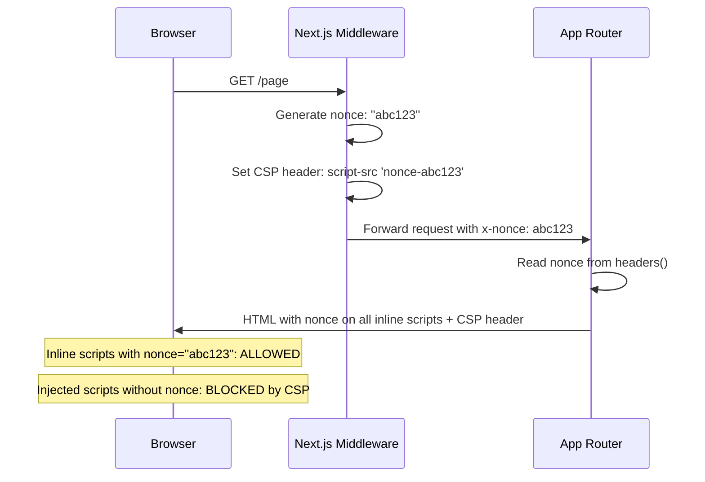

# 104 · XSS & Content Security Policy

> **Cross-Site Scripting (XSS) is the most prevalent web security vulnerability — it occurs when attacker-controlled content is executed as JavaScript in a victim's browser, enabling session hijacking, credential theft, and arbitrary actions on behalf of the victim. React's JSX escaping prevents the most common XSS vectors by default, but React applications have specific escape hatches (dangerouslySetInnerHTML, eval, dynamic script injection) and Next.js-specific attack surfaces (server-side rendering of user data into HTML, Route Handler response headers) that require explicit security engineering. Content Security Policy (CSP) is the browser-side defense that limits what scripts can execute even if XSS injection succeeds — a defense-in-depth mechanism that React and Next.js require specific configuration to support correctly.**

Security engineering in frontend applications is often treated as "backend responsibility" — until an XSS vulnerability exfiltrates session tokens from ten thousand users' browsers, and the investigation reveals user-controlled content was rendered unsanitized in a React component three deployments ago. This document covers the actual attack vectors in React/Next.js applications, how React's default escaping works and where it doesn't, and how to configure CSP for a React application that uses inline scripts (which Next.js does by default).

---

## Table of Contents

- [How XSS Works: The Core Mechanism](#how-xss-works-the-core-mechanism)
- [React's Default XSS Protection](#reacts-default-xss-protection)
- [dangerouslySetInnerHTML: The Escape Hatch](#dangerouslysetinnerhtml-the-escape-hatch)
- [Server-Side XSS in Next.js](#server-side-xss-in-nextjs)
- [DOM-Based XSS in React](#dom-based-xss-in-react)
- [href and src Injection Vectors](#href-and-src-injection-vectors)
- [Content Security Policy: How It Works](#content-security-policy-how-it-works)
- [CSP Directives Reference](#csp-directives-reference)
- [CSP in Next.js: The Inline Script Problem](#csp-in-nextjs-the-inline-script-problem)
- [Implementing CSP with Nonces in Next.js](#implementing-csp-with-nonces-in-nextjs)
- [CSP Reporting: Learning from Violations](#csp-reporting-learning-from-violations)
- [Sanitization Libraries](#sanitization-libraries)
- [Architecture Diagrams](#architecture-diagrams)
- [Good Practices](#good-practices)
- [Bad Practices](#bad-practices)
- [Mental Model](#mental-model)
- [Common Misconceptions](#common-misconceptions)
- [Exercises](#exercises)
- [Further Reading](#further-reading)

---

## How XSS Works: The Core Mechanism

```
THE FUNDAMENTAL XSS ATTACK:

1. ATTACKER INPUTS malicious content to the application:
   - A product review containing: <script>stealCookies()</script>
   - A username containing: ">
   - A search query containing: javascript:alert(document.cookie)

2. APPLICATION stores or reflects this content WITHOUT sanitization

3. APPLICATION renders the content in another user's browser:
   <div class="review">
     <script>stealCookies()</script>  ← EXECUTED AS JAVASCRIPT
   </div>

4. BROWSER executes the injected script in the VICTIM'S BROWSER,
   with access to:
   - All cookies (including session tokens)
   - localStorage and sessionStorage
   - DOM content (including forms, passwords, credit card fields)
   - Network requests (can make API calls AS the victim)
   - Browser permissions the site has (camera, geolocation, etc.)

THE THREE XSS TYPES:
  STORED XSS: malicious content saved to database, served to all visitors
  REFLECTED XSS: malicious content in the URL/request, reflected in the response
  DOM-BASED XSS: malicious content processed by JavaScript on the client
                  (never reaches the server — server-side filtering misses it)
```

---

## React's Default XSS Protection

```tsx
// React JSX AUTOMATICALLY ESCAPES string content rendered via JSX:

function ProductReview({ review }: { review: string }) {
  return <div>{review}</div>;
}

// If review = '<script>stealCookies()</script>':
// React renders: <div>&lt;script&gt;stealCookies()&lt;/script&gt;</div>
// Browser displays: the literal text "<script>stealCookies()</script>"
// JavaScript executed: NONE — the < > are HTML-escaped, making it text, not tags

// HOW REACT'S ESCAPING WORKS:
// JSX compiles to React.createElement('div', null, review)
// React's renderer converts the string to a TEXT NODE via
// document.createTextNode(review) — which NEVER interprets HTML
// React does NOT create innerHTML from string content unless you
// explicitly use dangerouslySetInnerHTML

// WHAT REACT ESCAPES:
// & → &amp;
// < → &lt;
// > → &gt;
// " → &quot; (in attribute context)
// ' → &#x27; (in attribute context)

// WHAT THIS PREVENTS:
// ✅ <script> injection via text content
// ✅ HTML tag injection via text content
// ✅ Event handler injection via text content
// ✅ Style injection via text content

// WHAT THIS DOES NOT PREVENT:
// ❌ dangerouslySetInnerHTML (deliberately bypasses escaping)
// ❌ href="javascript:..." on anchor tags
// ❌ Dynamic script tag creation in useEffect
// ❌ Server-side interpolation OUTSIDE React's rendering system
```

---

## dangerouslySetInnerHTML: The Escape Hatch

```tsx
// dangerouslySetInnerHTML bypasses React's escaping:
function UserBio({ bio }: { bio: string }) {
  // ❌ DANGEROUS: if `bio` contains attacker-controlled HTML:
  return <div dangerouslySetInnerHTML={{ __html: bio }} />;
  // If bio = ''
  // → The browser executes the onerror handler as JavaScript
}

// WHEN dangerouslySetInnerHTML IS LEGITIMATELY NEEDED:
// - Rendering rich text from a CMS (Markdown converted to HTML)
// - Embedding trusted third-party HTML widgets
// - Rendering server-generated HTML that you CONTROL COMPLETELY

// THE RULE: if the HTML comes from ANY user-influenced source,
// it MUST be sanitized before being set via dangerouslySetInnerHTML.

// SANITIZED APPROACH using DOMPurify:
import DOMPurify from "dompurify";

function SafeUserBio({ bio }: { bio: string }) {
  const sanitized = DOMPurify.sanitize(bio, {
    ALLOWED_TAGS: ["b", "i", "em", "strong", "a", "p", "br"],
    ALLOWED_ATTR: ["href", "target", "rel"],
    FORCE_HTTPS: true,
  });
  return <div dangerouslySetInnerHTML={{ __html: sanitized }} />;
}

// SSR CONSIDERATION: DOMPurify requires a DOM environment.
// For server-side sanitization, use isomorphic-dompurify or sanitize-html:
import sanitizeHtml from "sanitize-html";

function SafeContent({ html }: { html: string }) {
  const clean = sanitizeHtml(html, {
    allowedTags: ["b", "i", "em", "strong", "a", "p", "br"],
    allowedAttributes: { a: ["href", "rel"] },
    allowedSchemes: ["https", "mailto"],
  });
  return <div dangerouslySetInnerHTML={{ __html: clean }} />;
}
```

---

## Server-Side XSS in Next.js

```tsx
// VECTOR 1: Interpolating user data into <script> tags via metadata or JSON

// ❌ DANGEROUS: user data directly interpolated into script content
export default async function Page({
  searchParams,
}: {
  searchParams: { q: string };
}) {
  const query = searchParams.q;
  return (
    <>
      <script
        dangerouslySetInnerHTML={{
          // If query = '; alert(document.cookie); var x='
          // The resulting script content becomes valid executable JS:
          __html: `var initialSearch = '${query}';`,
        }}
      />
    </>
  );
}

// ✅ SAFE: use JSON.stringify for ALL values interpolated into scripts
export default async function Page({
  searchParams,
}: {
  searchParams: { q: string };
}) {
  const query = searchParams.q;
  return (
    <>
      <script
        dangerouslySetInnerHTML={{
          // JSON.stringify escapes quotes, backslashes, and control chars:
          // query = '"; alert(1); //' → `"\\"; alert(1); //"`
          // No injection possible — it's now a valid JSON string
          __html: `var initialSearch = ${JSON.stringify(query)};`,
        }}
      />
    </>
  );
}

// VECTOR 2: The __NEXT_DATA__ attack surface
// Next.js embeds page props as JSON in a <script id="__NEXT_DATA__"> tag.
// If those props contain HTML-like strings, they're JSON-encoded (safe).
// BUT: never put raw HTML that needs innerHTML rendering directly into page props —
// that HTML bypasses React's escaping when the consuming component uses
// dangerouslySetInnerHTML without sanitizing.
```

---

## DOM-Based XSS in React

```tsx
// DOM-based XSS occurs entirely client-side — the server never sees
// the payload, making server-side filtering ineffective.

// VECTOR: URL hash or query params read and rendered without escaping
"use client";
function SearchHighlighter() {
  const searchParams = useSearchParams();
  const term = searchParams.get("q") ?? "";

  // ❌ DANGEROUS: using innerHTML with URL parameter
  useEffect(() => {
    const container = document.getElementById("content");
    if (container) {
      // If ?q=
      // → The onerror executes as JavaScript
      container.innerHTML = container.innerHTML.replace(
        term,
        `<mark>${term}</mark>`, // ← term is not escaped!
      );
    }
  }, [term]);

  // ✅ SAFE: use the DOM API to create text nodes, never set innerHTML
  //    with user content, or use a safe highlighting library:
  return (
    <div id="content">
      {/* React's JSX handles escaping: */}
      {content.split(term).map((part, i) => (
        <React.Fragment key={i}>
          {part}
          {i < content.split(term).length - 1 && <mark>{term}</mark>}
        </React.Fragment>
      ))}
    </div>
  );
}

// OTHER DOM-BASED VECTORS:
// ❌ document.write(location.hash)       → classic DOM XSS
// ❌ eval(userInput)                      → direct execution
// ❌ new Function(userInput)()            → indirect execution
// ❌ setTimeout(userInput, 0)             → string-form setTimeout
// ❌ element.src = userInput              → if not sanitized
// ❌ window.location = userInput          → open redirect / javascript:
```

---

## href and src Injection Vectors

```tsx
// href and src can contain javascript: protocol — React doesn't block by default:

// ❌ DANGEROUS: user-controlled href
function UserLink({ url, label }: { url: string; label: string }) {
  // If url = "javascript:alert(document.cookie)"
  // → Clicking this link executes the JavaScript
  return <a href={url}>{label}</a>;
}

// ✅ SAFE: validate URL scheme before rendering
function SafeUserLink({ url, label }: { url: string; label: string }) {
  const isSafeUrl = (url: string): boolean => {
    try {
      const parsed = new URL(url);
      return ["https:", "http:", "mailto:"].includes(parsed.protocol);
    } catch {
      return false; // invalid URL
    }
  };

  if (!isSafeUrl(url)) {
    return <span>{label}</span>; // render as plain text if URL is unsafe
  }

  return (
    <a
      href={url}
      rel="noopener noreferrer" // prevents window.opener access from opened page
      target="_blank"
    >
      {label}
    </a>
  );
}

// React 16.9+ will warn about javascript: hrefs in development:
// "Warning: A future version of React will block javascript: URLs..."
// But it doesn't block them in production — validation is YOUR responsibility.
```

---

## Content Security Policy: How It Works

```
CSP is an HTTP response header (or <meta> tag) that tells the browser
which sources of content are trusted and allowed:

Content-Security-Policy:
  default-src 'self';
  script-src 'self' https://cdn.trusted.com;
  style-src 'self' 'unsafe-inline';
  img-src 'self' data: https:;

WHEN CSP IS IN PLACE:
  If an attacker injects: <script>stealCookies()</script>
  The browser sees: this script has no nonce and isn't from an allowed source
  The browser BLOCKS execution and logs a CSP violation
  The attack FAILS even though injection succeeded

CSP DOESN'T PREVENT INJECTION — it prevents EXECUTION.
It's defense-in-depth: even if your app has an XSS vulnerability,
CSP limits the damage.

HOW THE BROWSER ENFORCES CSP:
  For every resource the browser is about to load or execute:
  1. Check if it matches any CSP directive
  2. If yes: allow
  3. If no: block + log violation

  This check happens BEFORE execution — the malicious script never runs.
```

---

## CSP Directives Reference

```
MOST IMPORTANT DIRECTIVES:

script-src: controls JavaScript execution sources
  'self'              → same origin only
  'nonce-{random}'    → this specific inline script (requires new nonce per request)
  'strict-dynamic'    → trust scripts loaded by trusted scripts (with nonce)
  https://cdn.example.com → specific external domain
  'unsafe-inline'     → ANY inline script (defeats XSS protection — avoid)
  'unsafe-eval'       → eval(), new Function() etc. (avoid)

style-src: controls CSS sources
  'self' 'unsafe-inline' → common (inline styles needed for dynamic theming)

img-src: controls image sources
  'self' data: https: → common (allows self, data URIs, any HTTPS)

connect-src: controls fetch/XHR/WebSocket destinations
  'self' https://api.example.com → only your own API and a specific external API

frame-ancestors: controls what can embed this page in an iframe
  'none'    → can't be embedded (prevents clickjacking)
  'self'    → only same-origin pages can embed

form-action: controls where forms can submit to
  'self'    → forms can only submit to the same origin

base-uri: controls <base href> values
  'self'    → prevents base tag injection attacks

upgrade-insecure-requests: auto-upgrade HTTP requests to HTTPS
  (no value needed — the presence of the directive activates it)

RECOMMENDED STRICT CSP:
  Content-Security-Policy:
    default-src 'self';
    script-src 'nonce-{RANDOM}' 'strict-dynamic';
    style-src 'self' 'unsafe-inline';
    img-src 'self' data: https:;
    font-src 'self';
    connect-src 'self' https://api.example.com;
    frame-ancestors 'none';
    base-uri 'self';
    form-action 'self';
    upgrade-insecure-requests;
```

---

## CSP in Next.js: The Inline Script Problem

```
THE CHALLENGE:
  Next.js embeds multiple inline <script> tags in every page:
  - The __NEXT_DATA__ JSON embedding page props
  - The Next.js runtime bootstrap script
  - Inline scripts for streaming RSC payloads

  A strict CSP that blocks all inline scripts ('script-src 'self'')
  WILL BREAK NEXT.JS — the inline scripts are blocked by the browser.

THE TWO SOLUTIONS:

SOLUTION 1 (BAD): 'unsafe-inline' in script-src
  Content-Security-Policy: script-src 'self' 'unsafe-inline';
  This allows ALL inline scripts — including injected ones.
  This COMPLETELY DEFEATS the XSS protection of CSP.
  Never use 'unsafe-inline' for script-src in production.

SOLUTION 2 (CORRECT): Nonces
  A "nonce" (number used once) is a random value generated PER REQUEST.
  The server sets the nonce in the CSP header AND on each inline script.
  The browser only executes inline scripts whose nonce matches the CSP header's nonce.
  An attacker cannot predict or inject a valid nonce — their injected scripts
  lack the correct nonce and are blocked.

  Content-Security-Policy: script-src 'nonce-RANDOM_VALUE' 'strict-dynamic';

  <script nonce="RANDOM_VALUE">/* Next.js bootstrap code */</script>
  <script nonce="RANDOM_VALUE" id="__NEXT_DATA__">{"props":...}</script>

  The nonce MUST be:
  - Cryptographically random (not guessable)
  - Different on EVERY request (not reused)
  - At least 128 bits of entropy (16 bytes / 24 base64 chars)
```

---

## Implementing CSP with Nonces in Next.js

```ts
// middleware.ts — generate nonce and set CSP header on every request
import { NextResponse } from "next/server";
import type { NextRequest } from "next/server";

export function middleware(request: NextRequest) {
  // Generate a cryptographically random nonce for this request:
  const nonce = Buffer.from(crypto.randomUUID()).toString("base64");

  const cspHeader = [
    `default-src 'self'`,
    // 'nonce-...' allows Next.js's own inline scripts;
    // 'strict-dynamic' allows scripts loaded by nonced scripts (3rd party SDKs loaded by next.js)
    `script-src 'nonce-${nonce}' 'strict-dynamic'`,
    `style-src 'self' 'unsafe-inline'`, // inline styles needed for CSS-in-JS / theme vars
    `img-src 'self' data: https:`,
    `font-src 'self'`,
    `connect-src 'self'`,
    `frame-ancestors 'none'`,
    `base-uri 'self'`,
    `form-action 'self'`,
    `upgrade-insecure-requests`,
  ].join("; ");

  const requestHeaders = new Headers(request.headers);
  // Pass the nonce to Next.js (for it to add to inline scripts):
  requestHeaders.set("x-nonce", nonce);

  const response = NextResponse.next({ request: { headers: requestHeaders } });
  // Set the CSP header on the response:
  response.headers.set("Content-Security-Policy", cspHeader);

  return response;
}

export const config = {
  matcher: [
    // Apply to all pages except static assets:
    "/((?!_next/static|_next/image|favicon.ico).*)",
  ],
};
```

```tsx
// app/layout.tsx — read the nonce and pass it to Next.js scripts
import { headers } from "next/headers";

export default function RootLayout({
  children,
}: {
  children: React.ReactNode;
}) {
  const nonce = headers().get("x-nonce") ?? "";

  return (
    <html lang="en">
      <head>{/* Pass the nonce to Next.js's Script component: */}</head>
      <body>
        {children}
        {/* Any third-party script also needs the nonce: */}
        <script
          nonce={nonce}
          dangerouslySetInnerHTML={{
            __html: `window.analytics = ${JSON.stringify({ debug: false })};`,
          }}
        />
      </body>
    </html>
  );
}

// next.config.js — tell Next.js to use the nonce for its own inline scripts
/** @type {import('next').NextConfig} */
module.exports = {
  // Next.js 14+ reads the 'x-nonce' header automatically and applies
  // the nonce to its internally generated inline scripts:
  // No additional configuration needed IF middleware sets x-nonce header
};
```

---

## CSP Reporting: Learning from Violations

```
CSP REPORT-ONLY MODE: deploy CSP without blocking anything first —
just observe what WOULD be blocked. Essential for gradual rollout.

Content-Security-Policy-Report-Only:
  default-src 'self';
  script-src 'nonce-{RANDOM}' 'strict-dynamic';
  report-uri https://your-csp-report-endpoint.com/csp;

// OR use the newer report-to directive:
Reporting-Endpoints: default="https://your-csp-report-endpoint.com/csp"
Content-Security-Policy-Report-Only:
  default-src 'self';
  report-to default;

// app/api/csp-report/route.ts — a simple CSP violation collection endpoint
export async function POST(request: Request) {
  const report = await request.json();

  // Log to your observability platform:
  console.error('CSP Violation:', {
    documentUri: report['csp-report']?.['document-uri'],
    violatedDirective: report['csp-report']?.['violated-directive'],
    blockedUri: report['csp-report']?.['blocked-uri'],
  });

  // In production: send to your logging/monitoring system
  // (Sentry, Datadog, custom logging)

  return new Response(null, { status: 204 });
}
```

---

## Sanitization Libraries

```
FOR CLIENT-SIDE SANITIZATION:
  DOMPurify (https://github.com/cure53/DOMPurify)
    - Gold standard for browser-side HTML sanitization
    - Actively maintained by security researchers
    - Works with dangerouslySetInnerHTML

FOR SERVER-SIDE / UNIVERSAL SANITIZATION:
  sanitize-html (https://github.com/apostrophecms/sanitize-html)
    - Works in Node.js and browser
    - Configurable allowedTags, allowedAttributes, allowedSchemes

  isomorphic-dompurify (wraps DOMPurify for SSR contexts)

FOR MARKDOWN (convert Markdown → safe HTML):
  marked + DOMPurify: parse markdown, then sanitize the resulting HTML
  remark + rehype: configurable pipeline with rehype-sanitize for safe output

WHAT SANITIZERS DO:
  Input: '<p>Hello</p><script>alert(1)</script><b>World</b>'
  Output: '<p>Hello</p><b>World</b>'  (script tag removed)

  Input: '<a href="javascript:alert(1)">Click</a>'
  Output: '<a>Click</a>'  (javascript: href removed; href attribute stripped)

  Input: ''
  Output: ''  (event handler attribute stripped)

WHAT SANITIZERS DON'T DO:
  They don't validate content meaning (an allowed <a href="https://evil.com">
  is safe from XSS but may still be a phishing link).
  They don't protect against CSS injection if style= is allowed.
  They can have bypasses — use actively maintained, security-reviewed libraries.
```

---

## Architecture Diagrams

### XSS attack flow and React's defense

```mermaid
sequenceDiagram
    participant A as Attacker
    participant S as Server/DB
    participant B as Victim Browser
    participant R as React Runtime

    A->>S: Submit review: "<script>steal()</script>"
    S->>S: Store without sanitization
    B->>S: Request product page
    S->>B: HTML with review content
    B->>R: React renders review via JSX: {review}
    R->>B: Creates TEXT NODE: "&lt;script&gt;steal()&lt;/script&gt;"
    Note over B: ✅ Browser shows text, doesn't execute it
```

### CSP nonce flow in Next.js



---

## Good Practices

### ✅ Good Practice — Nonce-based CSP with DOMPurify for user HTML

```tsx
/**
 * Good: A complete pattern for handling rich user-generated content
 * safely — sanitizing the HTML server-side before storage, sanitizing
 * again client-side before rendering, and operating under a nonce-based
 * CSP that would block XSS even if sanitization had a gap.
 * Defense in depth: multiple layers, each independently effective.
 */

// Server Action: sanitize BEFORE storing
"use server";
import sanitizeHtml from "sanitize-html";

export async function saveComment(formData: FormData) {
  const rawContent = formData.get("content") as string;

  // Sanitize at the point of ingestion:
  const sanitizedContent = sanitizeHtml(rawContent, {
    allowedTags: ["b", "i", "em", "strong", "a", "p", "br", "ul", "ol", "li"],
    allowedAttributes: { a: ["href", "rel"] },
    allowedSchemes: ["https", "mailto"],
    disallowedTagsMode: "discard",
  });

  await db.comments.create({ data: { content: sanitizedContent } });
}

// Component: sanitize AGAIN at render time (belt AND suspenders)
("use client");
import DOMPurify from "dompurify";

function CommentBody({ html }: { html: string }) {
  const sanitized = useMemo(
    () =>
      DOMPurify.sanitize(html, {
        ALLOWED_TAGS: [
          "b",
          "i",
          "em",
          "strong",
          "a",
          "p",
          "br",
          "ul",
          "ol",
          "li",
        ],
        ALLOWED_ATTR: ["href", "rel"],
        FORCE_HTTPS: true,
      }),
    [html],
  );

  return <div dangerouslySetInnerHTML={{ __html: sanitized }} />;
}

// Middleware: nonce-based CSP so that even a sanitizer bypass can't execute:
// (see the middleware.ts example above)
// → Three independent layers: sanitize-on-save, sanitize-on-render, CSP-blocks-execution
```

---

## Bad Practices

### ⚠️ Bad Practice — The 'unsafe-inline' CSP that defeats its own purpose

```ts
/**
 * Bad: Adding CSP to the application but including 'unsafe-inline'
 * in script-src "because Next.js needs it." This is the most common
 * CSP implementation mistake — it creates the FALSE belief of CSP
 * protection while providing none for inline script injection attacks.
 */

// ❌ middleware.ts — CSP with unsafe-inline (provides no XSS protection):
const cspHeader = [
  `default-src 'self'`,
  `script-src 'self' 'unsafe-inline'`, // ← COMPLETELY NEGATES CSP's XSS defense
  `style-src 'self' 'unsafe-inline'`,
].join("; ");

// 'unsafe-inline' means: "any inline script may execute."
// If an attacker injects: <script>stealCookies()</script>
// → This inline script matches 'unsafe-inline' → CSP ALLOWS it → attack succeeds
// The CSP header exists but provides ZERO additional protection vs no CSP at all.

/**
 * The correct approach: use nonces (see "Implementing CSP with Nonces" above).
 * A nonce-based CSP IS compatible with Next.js AND provides real protection.
 * The perception that "CSP requires unsafe-inline for Next.js" is outdated
 * — nonce support was specifically added to Next.js to enable strict CSP.
 */
```

---

## Mental Model

> 💡 **The XSS and CSP mental model:**
>
> XSS is like **a forged letter being read aloud by a trusted official**: the attacker sneaks their own instructions (malicious script) into a document that the browser treats as coming from the trusted website. The browser faithfully "reads aloud" (executes) whatever it finds in the page, regardless of who actually wrote it. React's JSX escaping is like **the official refusing to read anything that looks like instructions** — content between HTML tags is treated as words to be spoken (displayed), not commands to be followed (executed). But if you hand the official a letter marked "read this literally, verbatim" (dangerouslySetInnerHTML), they'll execute whatever's inside. CSP is the **building security policy** — even if a forged letter gets through, the policy says "only execute instructions that come with the secret stamp issued this morning" (the nonce). Without the daily stamp (which attackers can't know), injected instructions are simply refused at the door, regardless of how convincing the forged letter looks.

---

## Common Misconceptions

### "React prevents all XSS attacks"

React prevents XSS via JSX text rendering (the most common attack vector), but does NOT prevent: `dangerouslySetInnerHTML` with unsanitized HTML, `href="javascript:..."` injection, DOM-based XSS via direct DOM manipulation in `useEffect`, or server-side template injection outside React's rendering system. React's protection is strong but not comprehensive.

### "CSP with 'unsafe-inline' still provides some protection"

A CSP with `script-src 'self' 'unsafe-inline'` provides ZERO protection against inline script injection. The `'unsafe-inline'` directive explicitly permits all inline scripts, which is exactly what XSS payloads are. CSP only protects against XSS when inline scripts require nonces or hashes.

### "Sanitizing HTML once (at storage or at display) is sufficient"

Defense in depth argues for sanitizing at BOTH ingestion and rendering. Storage sanitization protects against database dump scenarios and ensures clean data; render-time sanitization protects against: data that was stored before sanitization was added, sanitizer bypasses in older library versions, and data originating from systems that don't sanitize. Two independent sanitization layers with different libraries (sanitize-html server-side, DOMPurify client-side) is the robust pattern.

### "HTTPS prevents XSS"

HTTPS protects data in transit — it prevents network-level interception and modification of your pages. It does NOT prevent XSS attacks where the malicious content originates from the server itself (stored or reflected XSS in your own application). XSS and HTTPS address different threat models.

### "CSP breaks the application, so we can't use it"

A CSP that breaks the application is incorrectly configured — the application is using script patterns (eval, inline scripts without nonces) that conflict with a strict CSP. The correct response is to audit and fix those patterns (remove eval, add nonces to inline scripts), not to add `'unsafe-inline'` to suppress violations. A properly configured nonce-based CSP is fully compatible with Next.js.

---

## Exercises

### Exercise 1 — Find the XSS vulnerabilities

Given this React/Next.js component, identify every XSS vulnerability:

```tsx
async function UserProfile({ params }: { params: { username: string } }) {
  const user = await db.users.findByUsername(params.username);
  return (
    <div>
      <h1>{user.displayName}</h1>
      <div dangerouslySetInnerHTML={{ __html: user.bio }} />
      <a href={user.website}>Visit website</a>
      <script
        dangerouslySetInnerHTML={{ __html: `var userId = '${user.id}';` }}
      />
    </div>
  );
}
```

For each vulnerability: explain the attack vector, what an attacker could do, and how to fix it.

### Exercise 2 — Implement nonce-based CSP

Take a Next.js project and implement:

1. A middleware that generates a nonce and sets a strict CSP header
2. Passes the nonce as `x-nonce` header to the App Router
3. Reads the nonce in `app/layout.tsx` and uses it for any inline scripts
4. Verify in Chrome DevTools (Security panel) that CSP is active
5. Intentionally test: add a `<script>alert(1)</script>` via an eval-like mechanism and verify CSP blocks it

### Exercise 3 — Set up CSP reporting

Configure your application with `Content-Security-Policy-Report-Only` mode and a reporting endpoint. Trigger violations intentionally (load a resource from a non-allowed domain) and verify the violation appears in your endpoint. What information does the violation report contain?

---

## Further Reading

- [OWASP: Cross Site Scripting (XSS)](https://owasp.org/www-community/attacks/xss/) — comprehensive XSS reference
- [MDN: Content Security Policy](https://developer.mozilla.org/en-US/docs/Web/HTTP/CSP) — official CSP documentation
- [CSP Evaluator](https://csp-evaluator.withgoogle.com/) — Google's tool for analyzing CSP strength
- [Next.js docs: Content Security Policy](https://nextjs.org/docs/app/building-your-application/configuring/content-security-policy) — official Next.js CSP guide with nonce examples
- [DOMPurify](https://github.com/cure53/DOMPurify) — the trusted HTML sanitizer
- [web.dev: Mitigate XSS with a Strict CSP](https://web.dev/articles/strict-csp) — the nonce+strict-dynamic approach explained
- Next in this handbook: [105 · CSRF & Authentication Security](./02-csrf-auth.md)

---

_Part of the [React + Next.js Engineering Handbook](../../README.md)_
