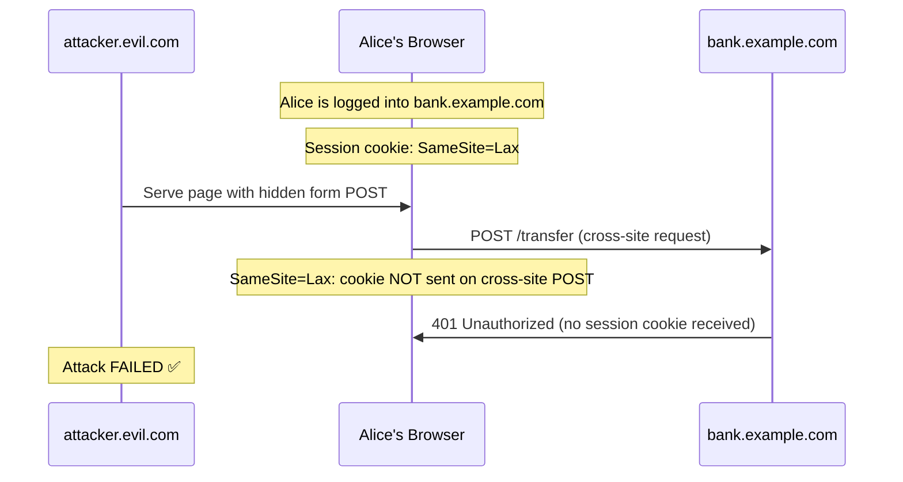
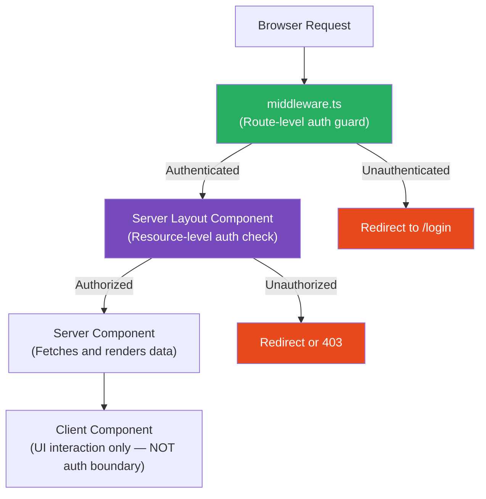

# 105 · CSRF & Authentication Security

> **Cross-Site Request Forgery (CSRF) tricks a user's browser into making authenticated requests to a web application without the user's knowledge — exploiting the browser's automatic inclusion of cookies with every request to the target origin. In Next.js, the introduction of Server Actions creates a new CSRF surface that requires explicit understanding: Server Actions are POST endpoints, which changes the traditional CSRF threat model in both directions — they're partially protected by the browser's SameSite cookie defaults, and they introduce a new attack surface that differs from traditional REST APIs. Authentication security in Next.js spans session management, JWT handling, OAuth flows, and the boundary between Server and Client Components — each requiring different security considerations.**

Authentication and CSRF are tightly coupled: CSRF attacks work by abusing authenticated sessions, so the session management strategy determines both the attack surface and the appropriate defenses. This document covers the technical mechanisms of CSRF (not just "add a CSRF token"), the specific protections built into Next.js's Server Actions, the security properties of different authentication token storage strategies, and the engineering patterns that make auth code correct by construction.

---

## Table of Contents

- [How CSRF Works: The Core Mechanism](#how-csrf-works-the-core-mechanism)
- [The Same-Origin Policy and Why CSRF Exists](#the-same-origin-policy-and-why-csrf-exists)
- [SameSite Cookies: The Modern CSRF Defense](#samesite-cookies-the-modern-csrf-defense)
- [CSRF in Next.js Server Actions](#csrf-in-nextjs-server-actions)
- [Traditional CSRF Tokens](#traditional-csrf-tokens)
- [Authentication Token Storage: Cookies vs localStorage](#authentication-token-storage-cookies-vs-localstorage)
- [JWT Security Considerations](#jwt-security-considerations)
- [Session Management in Next.js](#session-management-in-nextjs)
- [OAuth 2.0 / PKCE in Next.js](#oauth-20--pkce-in-nextjs)
- [Auth Libraries for Next.js](#auth-libraries-for-nextjs)
- [Protecting Route Handlers and Server Actions](#protecting-route-handlers-and-server-actions)
- [The Authentication Boundary in App Router](#the-authentication-boundary-in-app-router)
- [Architecture Diagrams](#architecture-diagrams)
- [Good Practices](#good-practices)
- [Bad Practices](#bad-practices)
- [Mental Model](#mental-model)
- [Common Misconceptions](#common-misconceptions)
- [Exercises](#exercises)
- [Further Reading](#further-reading)

---

## How CSRF Works: The Core Mechanism

```
THE CSRF ATTACK SCENARIO:

1. Alice logs into her bank at bank.example.com.
   The bank sets a session cookie: session=alice-session-token

2. Alice (still logged in) visits attacker.evil.com,
   which contains this hidden form:

   <form action="https://bank.example.com/transfer" method="POST">
     <input type="hidden" name="amount" value="1000">
     <input type="hidden" name="to" value="attacker-account">
   </form>
   <script>document.forms[0].submit();</script>

3. Alice's browser automatically:
   - Makes a POST to bank.example.com/transfer
   - Includes Alice's session cookie (browsers attach cookies to ALL
     requests to the matching domain, regardless of which site initiated)
   - The bank sees a valid session cookie and an authenticated request

4. The bank processes the transfer — Alice loses $1000.

WHY THIS WORKS:
  The Same-Origin Policy prevents attacker.evil.com from READING
  the response from bank.example.com (no cross-origin read).
  But it does NOT prevent the browser from MAKING the request —
  including the session cookie. The attack doesn't need to read
  the response; it just needs the state-changing request to execute.
```

---

## The Same-Origin Policy and Why CSRF Exists

```
THE SAME-ORIGIN POLICY (SOP):
  The browser allows a page at origin A to make requests to origin B,
  but PREVENTS origin A from READING the response from origin B
  (unless origin B explicitly allows it via CORS).

  For "simple requests" (GET, POST with specific content types),
  the request IS sent — the browser just doesn't give origin A
  access to the response body.

  This is why CSRF works: the attack doesn't need to read the response —
  it just needs the state-changing request to be made (and the bank
  to process it). The attacker doesn't get Alice's account balance;
  they just get the transfer executed.

THE CORS DISTINCTION:
  CORS protects against unauthorized cross-origin READS.
  CSRF protection is needed to guard against unauthorized cross-origin WRITES
  (state-changing requests).
  They solve different problems — configuring CORS does NOT protect against CSRF.

  A common mistake: "we have CORS configured, so CSRF doesn't apply."
  WRONG. CORS with credentials: 'include' in a fetch request from evil.com
  IS blocked by CORS. But a traditional form submission from evil.com IS NOT —
  it's a "simple request" that bypasses CORS preflight.
```

---

## SameSite Cookies: The Modern CSRF Defense

```
SameSite is a cookie attribute that controls when the browser sends
a cookie in cross-site requests:

  SameSite=Strict: Cookie NEVER sent in cross-site requests
    → Maximum CSRF protection
    → Breaks: clicking a link from another site logs you out (or loses session)
    → Not appropriate for session cookies in most web apps

  SameSite=Lax (browser default since ~2020): Cookie sent in
    cross-site requests ONLY for top-level navigations (GET, not POST)
    → Protects against CSRF form submissions (POST from another site)
    → Allows: clicking a link to your site from another site (GET nav)
    → Modern browsers default to Lax when SameSite is omitted

  SameSite=None: Cookie sent in ALL cross-site requests
    → No CSRF protection from this attribute alone
    → Required for: embedded widgets, cross-site auth, payment iframes
    → MUST be paired with Secure (HTTPS-only)

HOW LAX PROTECTS AGAINST THE BANK ATTACK:
  The bank attack uses a form POST from attacker.evil.com.
  With SameSite=Lax: the session cookie is NOT sent on cross-site POSTs.
  The bank receives the POST request WITHOUT Alice's session cookie.
  The bank correctly rejects it as unauthenticated.
  ATTACK PREVENTED.

MODERN CSRF THREAT MODEL WITH SAMESITE=LAX:
  The most common CSRF attacks (cross-site form POST) are blocked by
  SameSite=Lax on modern browsers (Chrome 80+, Firefox 79+, Safari 13+).

  REMAINING RISKS:
  - Subdomains: SameSite=Lax allows same-site cookies from subdomains
    (subdomain.example.com can CSRF example.com — they're "same site")
  - Older browsers without SameSite support
  - SameSite=None cookies (deliberate opt-out)
  - Same-site scripts (XSS gives attacker same-origin rights)
```

---

## CSRF in Next.js Server Actions

```
SERVER ACTIONS AND CSRF:
  Next.js Server Actions are invoked via POST requests (the framework
  handles this — the developer just calls an async function).

  BUILT-IN PROTECTIONS (as of Next.js 14):
  1. Origin header validation: Next.js verifies that the Origin
     header matches the application's expected origin. Requests
     from foreign origins are rejected.
  2. The 'Content-Type: text/plain;charset=UTF-8' header check:
     Server Action requests use a specific Content-Type that cannot
     be set by a standard HTML form (which uses
     application/x-www-form-urlencoded or multipart/form-data).
     A CSRF form attack can't set this Content-Type, so it fails
     the Server Action's request validation.

  THESE PROTECTIONS MEAN: standard cross-site form submission attacks
  against Server Actions are blocked by Next.js's built-in validation
  WITHOUT requiring additional CSRF tokens in most cases.

  REMAINING RESPONSIBILITIES (not handled by Next.js):
  - Authentication: Server Actions don't check if the user is
    authenticated — you must check auth yourself
  - Authorization: verify the user has permission for the action
  - Rate limiting: prevent abuse via automated requests

  IMPORTANT CAVEAT: these protections apply when accessing Server
  Actions through Next.js's standard invocation mechanism. Custom
  API endpoints (Route Handlers) do NOT get these automatic protections
  — Route Handlers are standard HTTP endpoints requiring your own
  CSRF protection strategy.
```

---

## Traditional CSRF Tokens

```tsx
// The traditional CSRF defense: a secret token that attackers can't predict

// HOW CSRF TOKENS WORK:
// 1. Server generates a random token per session or per request
// 2. Server embeds the token in the HTML form (as a hidden field) or in
//    the response headers (for AJAX requests to read and include)
// 3. Server validates that the token in the request matches the expected token
// 4. An attacker's cross-site form can't include the token because:
//    a. They can't READ the victim's HTML (SOP prevents cross-origin reads)
//    b. They can't predict the random token

// IMPLEMENTING A CSRF TOKEN IN A NEXT.JS ROUTE HANDLER:
import { cookies } from "next/headers";
import crypto from "crypto";

function generateCsrfToken(): string {
  return crypto.randomBytes(32).toString("hex");
}

function getCsrfToken(): string {
  const cookieStore = cookies();
  let token = cookieStore.get("csrf-token")?.value;
  if (!token) {
    token = generateCsrfToken();
    cookieStore.set("csrf-token", token, {
      httpOnly: false, // must be readable by JavaScript (for AJAX)
      sameSite: "strict",
      secure: process.env.NODE_ENV === "production",
    });
  }
  return token;
}

// Route Handler: validate CSRF token for sensitive state-changing requests:
// app/api/transfer/route.ts
export async function POST(request: Request) {
  const submittedToken = request.headers.get("x-csrf-token");
  const expectedToken = getCsrfToken();

  if (!submittedToken || submittedToken !== expectedToken) {
    return Response.json({ error: "CSRF token mismatch" }, { status: 403 });
  }

  // Proceed with the transfer...
}

// Client: include the CSRF token in every state-changing request:
async function transfer(amount: number, to: string) {
  const csrfToken = document.cookie
    .split("; ")
    .find((row) => row.startsWith("csrf-token="))
    ?.split("=")[1];

  await fetch("/api/transfer", {
    method: "POST",
    headers: {
      "Content-Type": "application/json",
      "x-csrf-token": csrfToken ?? "",
    },
    body: JSON.stringify({ amount, to }),
  });
}
```

---

## Authentication Token Storage: Cookies vs localStorage

```
THE CHOICE WITH MAJOR SECURITY IMPLICATIONS:

OPTION 1: HTTP-ONLY COOKIES
  Set-Cookie: session=token; HttpOnly; Secure; SameSite=Lax; Path=/

  ✅ Inaccessible to JavaScript (XSS CANNOT steal the token — even a
     successful XSS attack can't read document.cookie for HttpOnly cookies)
  ✅ Automatically sent with requests by the browser
  ✅ SameSite=Lax provides CSRF protection for most cases
  ❌ Subject to CSRF (mitigated by SameSite=Lax)
  ❌ Requires backend cooperation to set/clear (server sets the cookie)
  RECOMMENDED for session tokens and auth tokens

OPTION 2: localStorage
  localStorage.setItem('auth-token', token);

  ✅ Not subject to CSRF (cookies aren't sent automatically for fetch requests)
  ✅ Easy to implement (JavaScript can set/read/clear directly)
  ❌ FULLY ACCESSIBLE TO JAVASCRIPT — XSS can steal the token with
     localStorage.getItem('auth-token') in one line
  ❌ An XSS vulnerability = complete authentication bypass
  ❌ No automatic inclusion in requests (must manually add to Authorization header)
  NEVER USE for session tokens or auth tokens in production

OPTION 3: sessionStorage
  Similar to localStorage but cleared when the tab/browser closes.
  SAME XSS vulnerability as localStorage — not appropriate for auth tokens.

OPTION 4: In-memory (JavaScript variable, React state)
  const [token, setToken] = useState(null);

  ✅ Inaccessible to localStorage-reading XSS attacks
  ✅ Cleared on page refresh (limits window of exposure)
  ❌ Lost on page refresh — user must re-authenticate
  ❌ Accessible to XSS that injects code into your page (same JavaScript context)
  ❌ Doesn't persist across tabs
  Use for short-lived tokens and refresh token workflows

THE VERDICT: HTTP-only cookies for auth tokens.
  The CSRF risk (mitigated by SameSite=Lax + CSRF tokens) is
  LOWER than the XSS risk of localStorage exposure (which has no
  mitigation if XSS succeeds — the token is simply gone).
```

---

## JWT Security Considerations

```
JSON Web Tokens (JWTs) are widely used for auth — often incorrectly.

JWT STRUCTURE:
  header.payload.signature
  base64({"alg":"HS256","typ":"JWT"}) +
  base64({"sub":"user123","exp":1700000000}) +
  HMAC-SHA256(header + "." + payload, secret)

SECURITY PROPERTIES:
  ✅ The PAYLOAD is readable by anyone (it's just base64 encoded, not encrypted)
     → Never put sensitive data (passwords, SSNs, PII) in JWT payload
  ✅ The SIGNATURE verifies the payload hasn't been tampered with
     → A valid JWT with a modified payload will fail signature verification
  ❌ JWTs cannot be "invalidated" before expiry (no server-side state)
     → If a JWT is stolen, it's valid until it expires
     → This is why JWT expiry should be SHORT (15 minutes for access tokens)
     → Refresh token rotation mitigates this (short-lived access token + longer-lived
        refresh token stored in HTTP-only cookie)

STORAGE:
  JWT access tokens: in-memory (state or closure) — cleared on refresh
  JWT refresh tokens: HTTP-only cookie — persistent, safe from XSS

COMMON VULNERABILITIES:
  ALGORITHM CONFUSION ATTACK ("alg: none"):
    An attacker modifies the JWT to use alg: "none" and removes the signature.
    A naive validator that trusts the algorithm from the token header accepts
    the unsigned token.
    FIX: always explicitly specify the expected algorithm when validating.
    NEVER accept "none" as a valid algorithm.

  WEAK SECRET:
    HS256 with a short or guessable secret can be brute-forced.
    FIX: use ≥256-bit secrets for HS256, or prefer RS256/ES256 (asymmetric)
    where the private key signs and the public key verifies.

  EXPIRY NOT CHECKED:
    Some validators check the signature but not the exp claim.
    FIX: always validate the exp claim; reject expired tokens.
```

---

## Session Management in Next.js

```tsx
// Pattern: HTTP-only cookie sessions with Server Components

// lib/auth/session.ts
import { cookies } from "next/headers";
import { jwtVerify, SignJWT } from "jose";

const SESSION_COOKIE = "session";
const SECRET = new TextEncoder().encode(process.env.SESSION_SECRET!);

interface Session {
  userId: string;
  role: "user" | "admin";
  expires: number;
}

export async function createSession(userId: string, role: string) {
  const expires = Date.now() + 7 * 24 * 60 * 60 * 1000; // 7 days
  const token = await new SignJWT({ userId, role, expires })
    .setProtectedHeader({ alg: "HS256" })
    .setExpirationTime("7d")
    .sign(SECRET);

  cookies().set(SESSION_COOKIE, token, {
    httpOnly: true, // CRITICAL: not accessible via JavaScript
    secure: process.env.NODE_ENV === "production",
    sameSite: "lax", // CSRF protection for standard requests
    maxAge: 60 * 60 * 24 * 7, // 7 days
    path: "/",
  });
}

export async function getSession(): Promise<Session | null> {
  const token = cookies().get(SESSION_COOKIE)?.value;
  if (!token) return null;

  try {
    const { payload } = await jwtVerify(token, SECRET);
    const session = payload as unknown as Session;

    // Verify not expired (jose also checks exp, but being explicit):
    if (Date.now() > session.expires) {
      await clearSession();
      return null;
    }

    return session;
  } catch {
    return null; // Invalid or tampered token
  }
}

export async function clearSession() {
  cookies().delete(SESSION_COOKIE);
}

// Usage in a Server Component:
export default async function Dashboard() {
  const session = await getSession();
  if (!session) redirect("/login");

  return <DashboardContent userId={session.userId} />;
}

// Usage in a Server Action:
("use server");
export async function updateProfile(formData: FormData) {
  const session = await getSession();
  if (!session) throw new Error("Unauthorized");

  // Perform the update for session.userId only:
  await db.users.update({
    where: { id: session.userId }, // use session, not user-provided userId!
    data: { name: formData.get("name") as string },
  });
}
```

---

## OAuth 2.0 / PKCE in Next.js

```
OAUTH 2.0 WITH PKCE (Proof Key for Code Exchange):
  Used when authenticating with third-party providers (Google, GitHub, etc.)

THE PKCE FLOW (secure, recommended for web apps):
  1. App generates a random code_verifier (cryptographically random string)
  2. App hashes it: code_challenge = base64url(sha256(code_verifier))
  3. App redirects user to provider with code_challenge:
     GET https://provider.com/auth?
       response_type=code
       &client_id=CLIENT_ID
       &redirect_uri=https://app.example.com/auth/callback
       &code_challenge=CHALLENGE_HASH
       &code_challenge_method=S256
       &state=RANDOM_STATE_VALUE  ← prevents CSRF in the OAuth flow itself

  4. User authenticates with the provider
  5. Provider redirects back with: ?code=AUTH_CODE&state=RANDOM_STATE_VALUE
  6. App verifies the state value matches what was sent (CSRF check)
  7. App exchanges code for tokens:
     POST https://provider.com/token
       code=AUTH_CODE
       &code_verifier=ORIGINAL_CODE_VERIFIER  ← proves it's the original requester
       &client_id=CLIENT_ID
       &redirect_uri=...
  8. Provider verifies: sha256(code_verifier) == code_challenge
     (only the original requester knows code_verifier)
  9. Provider returns: access_token, refresh_token, id_token

THE STATE PARAMETER IS CSRF PROTECTION FOR OAUTH:
  Without state validation: an attacker can initiate an OAuth flow with
  their own provider account, capture the authorization code redirect,
  and send it to the victim's browser — logging the victim into the
  attacker's account (account linking attack).
  WITH state validation: the victim's browser validates the state matches
  what it originally sent, detecting the attack.
```

---

## Auth Libraries for Next.js

```
OPTION 1: Auth.js (formerly NextAuth.js) — the most widely used
  - Handles OAuth, email/password, magic links
  - Built-in CSRF protection for all auth endpoints
  - Session management via HTTP-only cookies
  - Adapters for major databases (Prisma, Drizzle, etc.)
  - Native App Router support in v5

  import NextAuth from 'next-auth';
  import GitHub from 'next-auth/providers/github';

  export const { handlers, signIn, signOut, auth } = NextAuth({
    providers: [GitHub],
  });

OPTION 2: Clerk — managed auth-as-a-service
  - Full auth UI components + backend
  - Handles MFA, social login, magic links
  - Next.js middleware for route protection
  - More opinionated but much faster to ship

OPTION 3: Lucia — auth library (not auth service)
  - Session management library you control
  - No managed components — more flexibility
  - Database-agnostic (adapters for most ORMs)

OPTION 4: Roll your own (for specific requirements)
  - Maximum control and no external dependency
  - Highest implementation risk
  - Only appropriate if auth requirements are highly custom
  - Use the session management pattern in the previous section as a foundation

RECOMMENDATION: use Auth.js for most Next.js projects — it handles
the security details (CSRF tokens, session management, OAuth PKCE)
correctly out of the box.
```

---

## Protecting Route Handlers and Server Actions

```tsx
// PATTERN: A reusable auth guard for Route Handlers and Server Actions

// lib/auth/guard.ts
import { getSession } from "./session";

type Role = "user" | "admin";

export async function requireAuth(requiredRole?: Role) {
  const session = await getSession();

  if (!session) {
    throw new AuthError("UNAUTHORIZED", 401);
  }

  if (
    requiredRole &&
    session.role !== requiredRole &&
    session.role !== "admin"
  ) {
    throw new AuthError("FORBIDDEN", 403);
  }

  return session;
}

class AuthError extends Error {
  constructor(
    public code: string,
    public status: number,
  ) {
    super(code);
  }
}

// Route Handler usage:
// app/api/admin/users/route.ts
import { requireAuth } from "@/lib/auth/guard";

export async function GET() {
  try {
    const session = await requireAuth("admin");
    const users = await db.users.findMany();
    return Response.json(users);
  } catch (e) {
    if (e instanceof AuthError) {
      return Response.json({ error: e.code }, { status: e.status });
    }
    throw e;
  }
}

// Server Action usage:
("use server");
import { requireAuth } from "@/lib/auth/guard";

export async function deletePost(postId: string) {
  const session = await requireAuth();

  // Also verify the user OWNS the resource they're modifying:
  const post = await db.posts.findUnique({ where: { id: postId } });
  if (!post || post.authorId !== session.userId) {
    throw new Error("Forbidden");
  }

  await db.posts.delete({ where: { id: postId } });
}
```

---

## The Authentication Boundary in App Router

```tsx
// CRITICAL PATTERN: the auth check must happen SERVER-SIDE
// Client Components can be rendered BEFORE auth is verified if
// auth is only in the component tree's Client Component layer

// ❌ WRONG: auth check in a Client Component
"use client";
function AdminPanel() {
  const { user } = useAuth(); // auth state from React context
  if (!user?.isAdmin) return <div>Access denied</div>; // client-side only check
  return <AdminContent />;
  // PROBLEM: the server rendered the full AdminContent HTML and sent it to
  // the browser — the client-side check is just UI decoration,
  // not actual access control. The data is already in the HTML.
}

// ✅ CORRECT: auth check in a Server Component (or middleware)
// app/admin/layout.tsx
import { getSession } from "@/lib/auth/session";
import { redirect } from "next/navigation";

export default async function AdminLayout({
  children,
}: {
  children: React.ReactNode;
}) {
  const session = await getSession();

  if (!session || session.role !== "admin") {
    redirect("/login"); // server-side redirect — nothing is sent to the browser
  }

  // Children are only rendered (and their data fetched) if auth passes:
  return <div className="admin-layout">{children}</div>;
}

// MIDDLEWARE: the most robust layer — runs before ANY response is generated
// middleware.ts
export async function middleware(request: NextRequest) {
  if (request.nextUrl.pathname.startsWith("/admin")) {
    const session = await verifySessionFromCookie(request);
    if (!session || session.role !== "admin") {
      return NextResponse.redirect(new URL("/login", request.url));
    }
  }
}
```

---

## Architecture Diagrams

### CSRF attack vs SameSite=Lax defense



### Next.js Auth boundary layers



---

## Good Practices

### ✅ Good Practice — Auth-checked Server Action with ownership verification

```tsx
/**
 * Good: A Server Action that correctly validates authentication,
 * authorization (role), AND resource ownership — never trusting
 * user-supplied IDs for authorization decisions.
 */
"use server";
import { getSession } from "@/lib/auth/session";
import { revalidatePath } from "next/cache";

export async function updateComment(
  commentId: string,
  content: string,
): Promise<{ success: boolean; error?: string }> {
  // 1. Verify authentication:
  const session = await getSession();
  if (!session) {
    return { success: false, error: "Unauthorized" };
  }

  // 2. Verify the resource exists AND belongs to this user:
  const comment = await db.comments.findUnique({
    where: { id: commentId },
    select: { id: true, authorId: true, postId: true },
  });

  if (!comment) {
    return { success: false, error: "Not found" };
  }

  // 3. Authorization: user must own the comment (or be an admin):
  if (comment.authorId !== session.userId && session.role !== "admin") {
    return { success: false, error: "Forbidden" };
  }

  // 4. Validate input:
  if (content.length > 10000 || content.trim().length === 0) {
    return { success: false, error: "Invalid content" };
  }

  // 5. Perform the operation:
  await db.comments.update({
    where: { id: commentId },
    data: { content: content.trim(), updatedAt: new Date() },
  });

  revalidatePath(`/posts/${comment.postId}`);
  return { success: true };
}
```

---

## Bad Practices

### ⚠️ Bad Practice — Trusting user-supplied IDs for authorization

```tsx
/**
 * Bad: Using the userId from the request body (user-supplied)
 * to authorize the action — instead of using the authenticated session.
 * An attacker can modify the userId in the request to perform
 * actions on behalf of ANY user.
 */

// ❌ Server Action trusting user-supplied userId:
"use server";
export async function deleteUserAccount(formData: FormData) {
  const userId = formData.get("userId") as string; // ← attacker controls this!

  // If attacker sends userId = "admin-user-id-123", this deletes admin's account
  await db.users.delete({ where: { id: userId } });
}

/**
 * ✅ Fix: ALWAYS use the server-side session for authorization decisions
 */
("use server");
export async function deleteUserAccount() {
  const session = await getSession();
  if (!session) throw new Error("Unauthorized");

  // Use session.userId — attacker cannot modify this;
  // it comes from the server-side cookie, not the request body:
  await db.users.delete({ where: { id: session.userId } });
}

/**
 * THE INSECURE DIRECT OBJECT REFERENCE (IDOR) PATTERN:
 * A related vulnerability: accepting a resource ID from the user
 * and fetching/modifying it without checking ownership.
 *
 * ❌ IDOR: GET /api/invoices/[id] that returns ANY invoice if you know the ID
 *    → Attacker iterates IDs: /api/invoices/1, /api/invoices/2...
 *    → Gets every customer's invoice
 *
 * ✅ Fix: always filter by session.userId in the query:
 *    db.invoices.findUnique({ where: { id, userId: session.userId } })
 *    → Returns null if the invoice doesn't belong to this user
 */
```

**Production impact:** A healthcare startup had a patient appointment API (`GET /api/appointments/:id`) that returned appointment details for ANY valid appointment ID, without checking if the requesting user owned the appointment. A security researcher discovered the IDOR vulnerability — sequential IDs meant any authenticated user could read all other patients' appointment records. The fix (adding `WHERE userId = session.userId` to every query) took 2 hours; the incident response, regulatory notification, and trust rebuild took 6 months.

---

## Mental Model

> 💡 **The CSRF and auth security mental model:**
>
> CSRF is like **someone using your hand (with your fingerprint) to sign a check without your knowledge** — the bank sees a legitimate signature (your session cookie), not knowing your hand was moved without your consent. SameSite=Lax cookies are like **a rule that your hand can only sign things when you're physically in the bank** (same-origin context) — cross-site requests "from evil.com" don't get your hand. Authentication storage is a lock box choice: HTTP-only cookies are a **safe deposit box** at the bank — you can't take them out yourself and neither can thieves (XSS), but they go everywhere you go in the bank (automatic cookie inclusion); localStorage is a **wallet** — convenient to access yourself but if someone picks your pocket (XSS succeeds), everything in it is gone. Server Actions' built-in protections are like **a special window at the bank counter** that only services requests arriving through the bank's own teller system (the Next.js framework), with a distinctive stamp (Content-Type header) that external attackers can't forge.

---

## Common Misconceptions

### "CORS configuration protects against CSRF"

CORS and CSRF protect against different threats. CORS controls which origins can READ responses to cross-origin requests. CSRF attacks are about making cross-origin REQUESTS (state changes) — traditional form submissions are simple requests that don't trigger CORS preflight and aren't protected by CORS. You need both CORS AND CSRF protection.

### "localStorage is safer than cookies because CSRF doesn't apply"

localStorage is more resistant to CSRF attacks (tokens aren't automatically included in requests), but it's FULLY EXPOSED to XSS attacks. Cookies with `HttpOnly` can be protected from XSS. The threat model matters: CSRF is mitigated by SameSite=Lax (a browser default); XSS is much harder to fully prevent. HTTP-only cookies provide protection against XSS token theft that localStorage simply cannot offer.

### "JWT tokens are stateless and therefore secure"

JWTs are stateless (no server-side lookup needed), but this property also means they cannot be revoked. A stolen JWT is valid until expiry, making short expiry times critical. JWTs with long expiry stored in localStorage are particularly dangerous — they combine unrevokability with XSS-stealability.

### "Server Actions don't need CSRF protection"

Next.js 14+ Server Actions have built-in protections (origin header validation, Content-Type checking), but these don't cover all scenarios: if you bypass the normal Server Action invocation mechanism, call Server Actions from untrusted contexts, or have a subdomain that could be compromised, additional CSRF measures may still be appropriate. "Server Actions have some protection" ≠ "CSRF is fully solved."

### "Client-side auth checks are sufficient for security"

Client-side auth checks (`if (!user?.isAdmin) return <AccessDenied />`) are UX improvements, not security controls. An attacker who modifies the JavaScript or intercepts the network can bypass client-side checks entirely. All access control decisions for sensitive resources must be enforced server-side — in middleware, Server Components, Route Handlers, or Server Actions.

---

## Exercises

### Exercise 1 — Identify the auth vulnerabilities

Given this API route, identify every security issue:

```tsx
// app/api/transfer/route.ts
export async function POST(request: Request) {
  const { fromUserId, toUserId, amount } = await request.json();

  // Verify the user's balance:
  const user = await db.users.findUnique({ where: { id: fromUserId } });
  if (user.balance < amount) {
    return Response.json({ error: "Insufficient funds" }, { status: 400 });
  }

  await db.users.update({
    where: { id: fromUserId },
    data: { balance: { decrement: amount } },
  });
  await db.users.update({
    where: { id: toUserId },
    data: { balance: { increment: amount } },
  });

  return Response.json({ success: true });
}
```

### Exercise 2 — Implement auth middleware

Write Next.js middleware that:

1. Protects all routes under `/dashboard/*` and `/api/protected/*`
2. Reads and verifies a JWT from an HTTP-only cookie
3. Adds the verified session data to request headers for downstream handlers
4. Redirects unauthenticated browser requests to `/login`
5. Returns 401 JSON for unauthenticated API requests

### Exercise 3 — Audit your application's CSRF exposure

For each of your application's state-changing endpoints (Route Handlers and Server Actions):

1. Categorize each: Server Action (has built-in protection), Route Handler (manual protection needed)
2. For Route Handlers: verify SameSite=Lax is set on your session cookie
3. For any `SameSite=None` cookies: implement explicit CSRF token validation
4. Test: can you replicate a CSRF attack against your Route Handlers using a simple HTML form from a different origin?

---

## Further Reading

- [OWASP: Cross-Site Request Forgery (CSRF)](https://owasp.org/www-community/attacks/csrf) — comprehensive CSRF reference
- [MDN: SameSite cookies](https://developer.mozilla.org/en-US/docs/Web/HTTP/Headers/Set-Cookie/SameSite) — the browser's primary CSRF defense
- [Auth.js (NextAuth.js) documentation](https://authjs.dev/) — the recommended auth library for Next.js
- [OWASP: Session Management Cheat Sheet](https://cheatsheetseries.owasp.org/cheatsheets/Session_Management_Cheat_Sheet.html) — comprehensive session security reference
- [JWT.io](https://jwt.io/) — JWT debugger and library directory
- [RFC 7636: PKCE](https://www.rfc-editor.org/rfc/rfc7636) — the PKCE specification for OAuth 2.0
- [Next.js docs: Authentication](https://nextjs.org/docs/app/building-your-application/authentication) — official Next.js authentication guidance
- Related in this handbook: [104 · XSS & CSP](./01-xss-csp.md)
- Next in this handbook: [106 · Dependency Security](./03-dependency-security.md)

---

_Part of the [React + Next.js Engineering Handbook](../../README.md)_
