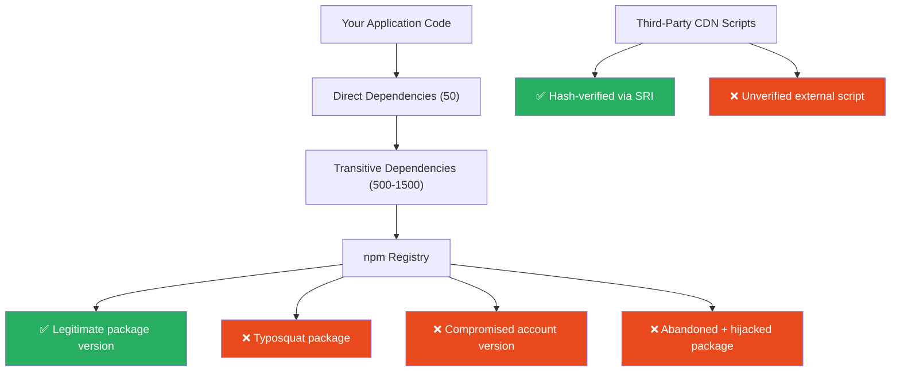
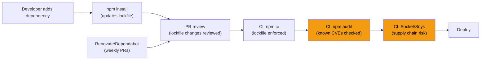

# 106 · Dependency Security

> **The average React/Next.js application has 500–1,500 npm dependencies at install time. Each dependency is code you didn't write, running with the same privileges as your application, in your users' browsers and on your servers. Supply chain attacks — where malicious code is introduced into a legitimate, trusted package — have become one of the most effective attack vectors in modern software because they exploit the trust relationship between developers and their tools. The 2021 event-stream incident, the 2022 colors/faker incident, the 2024 polyfill.io hijacking, and dozens of similarly structured attacks share a pattern: developers trust a package, the package is compromised, malicious code runs in production. This document covers the technical mechanisms of supply chain attacks, the engineering controls that mitigate them, and the operational practices that make dependency security tractable at scale.**

Dependency security is distinct from application security: you can write perfectly secure application code while shipping malicious code your users execute — because a dependency you didn't audit introduced it. The defense requires understanding the attack surface (where malicious code can enter), the detection mechanisms (auditing, integrity verification), and the operational hygiene (update cadence, lockfile management) that limits exposure time when vulnerabilities are discovered.

---

## Table of Contents

- [The Dependency Attack Surface](#the-dependency-attack-surface)
- [Supply Chain Attack Patterns](#supply-chain-attack-patterns)
- [Lockfiles: The Integrity Anchor](#lockfiles-the-integrity-anchor)
- [npm audit: Finding Known Vulnerabilities](#npm-audit-finding-known-vulnerabilities)
- [Subresource Integrity for External Scripts](#subresource-integrity-for-external-scripts)
- [Automated Dependency Updates: Renovate and Dependabot](#automated-dependency-updates-renovate-and-dependabot)
- [Dependency Pinning Strategies](#dependency-pinning-strategies)
- [Private npm Registry and Scoping](#private-npm-registry-and-scoping)
- [Minimal Permission Principles for Dependencies](#minimal-permission-principles-for-dependencies)
- [Third-Party Scripts in Next.js](#third-party-scripts-in-nextjs)
- [Runtime Security: Limiting Dependency Blast Radius](#runtime-security-limiting-dependency-blast-radius)
- [Architecture Diagrams](#architecture-diagrams)
- [Good Practices](#good-practices)
- [Bad Practices](#bad-practices)
- [Mental Model](#mental-model)
- [Common Misconceptions](#common-misconceptions)
- [Exercises](#exercises)
- [Further Reading](#further-reading)

---

## The Dependency Attack Surface

```
YOUR DEPENDENCY TREE:
  Your application imports 50 direct dependencies.
  Each of those has its own dependencies.
  The total dependency count for a typical Next.js app at install time:
  500-1,500 packages in node_modules.

  Every one of those packages has:
  - Access to the filesystem (require('fs')) in Node.js
  - Access to network (require('http'), fetch()) in Node.js
  - Access to process environment variables (process.env)
  - Ability to execute child processes
  - Full JavaScript execution context in the browser

THE ATTACK SURFACE AT EACH LAYER:

1. DIRECT DEPENDENCIES (your package.json):
   Packages you explicitly install. You (presumably) evaluated them
   before adding, but may not re-evaluate after updates.

2. TRANSITIVE DEPENDENCIES (their dependencies):
   You almost certainly never reviewed these.
   An attack here is invisible to your team's code review process.

3. DEVDEPENDENCIES:
   Often overlooked ("they only run during development, not in production")
   but: malicious postinstall scripts in devDependencies run during
   'npm install' on developer machines and CI systems.
   A compromised webpack plugin or test runner that exfiltrates your
   .env files runs during CI, where those files EXIST and contain secrets.

4. PEER DEPENDENCIES:
   Installed by the consumer but specified by the library —
   a conflicted peer dependency can pull in an unexpected version.

5. PUBLISH-TIME ARTIFACTS:
   What's on npm may differ from what's on GitHub — the npm publish
   step can include code that's not in the public repository.
```

---

## Supply Chain Attack Patterns

```
PATTERN 1: TYPOSQUATTING
  Legitimate package: 'lodash' (300M+ weekly downloads)
  Malicious package: 'iodash', 'Iodasb', 'lodahs'
  A developer mistyping the package name installs the malicious one.

  REAL INCIDENTS: dozens of typosquat packages removed from npm,
  some downloaded thousands of times before removal.

  DETECTION: npm audit, careful review of package.json, use of
  private registries that whitelist allowed packages.

PATTERN 2: ACCOUNT TAKEOVER
  A legitimate, popular package's maintainer account is compromised
  (via credential stuffing, phishing, or reused passwords).
  The attacker publishes a new version with malicious code.
  Users who auto-update install the compromised version.

  REAL INCIDENT: ua-parser-js (7M+ weekly downloads, 2021) — the
  maintainer's npm account was compromised; malicious versions
  published that installed cryptocurrency miners and credential stealers.

PATTERN 3: MAINTAINER ABANDONMENT / TRANSFER
  A popular package's maintainer transfers ownership (or the package
  is abandoned and claimed by someone else).
  New owner publishes malicious code under the trusted package name.

  REAL INCIDENT: event-stream (2018) — a new maintainer was given
  ownership, added a malicious dependency targeting a specific
  Bitcoin wallet application.

PATTERN 4: DEPENDENCY CONFUSION
  Your organization has an internal package '@company/utils' hosted
  on a private registry. An attacker publishes a package with the
  SAME NAME on the public npm registry with a HIGHER VERSION NUMBER.
  Some npm configurations will prefer the public registry's higher
  version over the private registry's lower version.

  FIX: use scoped packages, configure npm to always prefer your
  private registry for scoped packages.

PATTERN 5: MALICIOUS POSTINSTALL SCRIPTS
  package.json supports lifecycle scripts ('postinstall') that run
  automatically after installation. A compromised package can
  exfiltrate secrets during 'npm install'.

  FAMOUS CASE: a researcher demonstrated that malicious postinstall
  scripts could exfiltrate developer machine SSH keys, AWS credentials,
  and environment variables.

PATTERN 6: CDN/THIRD-PARTY SCRIPT HIJACKING
  A CDN serving a JavaScript library is compromised, or a third-party
  analytics/tracking script on your site is modified by the vendor.
  REAL INCIDENT: polyfill.io (2024) — the domain was sold, the new
  owner served malicious JavaScript to millions of sites using the CDN.
```

---

## Lockfiles: The Integrity Anchor

```
WHAT A LOCKFILE DOES:
  package-lock.json (npm) or pnpm-lock.yaml (pnpm) or yarn.lock (yarn)
  records the EXACT resolved version AND CRYPTOGRAPHIC INTEGRITY HASH
  of every package in your dependency tree.

  For every package:
    - The exact version installed (e.g., lodash@4.17.21, not "^4.0.0")
    - The resolved URL (where it was downloaded from)
    - The integrity hash (sha512:base64 hash of the tarball)

LOCKFILE SECURITY PROPERTIES:
  When you run 'npm ci' (clean install using the lockfile):
  1. npm downloads EXACTLY the versions specified in the lockfile
  2. npm verifies the downloaded tarball's hash matches the lockfile
  3. If ANY hash doesn't match → INSTALLATION FAILS with an error

  This means: even if npm's registry serves a different file for
  lodash@4.17.21 than what you originally installed, 'npm ci' will
  detect the mismatch and fail — rather than silently installing
  potentially malicious code.

CRITICAL CI REQUIREMENT:
  - Always use 'npm ci' in CI/CD, not 'npm install'
  - 'npm install' CAN update versions and the lockfile
  - 'npm ci' ALWAYS uses the lockfile, failing if there's a mismatch

LOCKFILE INTEGRITY WORKFLOW:
  Developer: 'npm install new-package' → updates lockfile → commit both
  CI: 'npm ci' → installs EXACTLY what's in the lockfile → fails if modified
  Production: 'npm ci' → identical to CI → no surprises

PROTECTING THE LOCKFILE:
  ✅ Commit the lockfile to version control (never .gitignore it)
  ✅ Review lockfile changes in pull requests (new transitive deps?)
  ✅ Require lockfile to be present in CI (npm ci fails without it)
  ❌ Never run 'npm install' in production — always use 'npm ci'
```

---

## npm audit: Finding Known Vulnerabilities

```bash
# Run npm audit to check for known vulnerabilities:
npm audit

# Example output:
# found 3 vulnerabilities (1 moderate, 2 high)
#
# high   Prototype Pollution in lodash
# Package         lodash
# Patched in      >=4.17.21
# Dependency of   my-app
# Path            my-app > lodash

# Fix automatically (when non-breaking fixes are available):
npm audit fix

# Fix including breaking changes (semver major bumps):
npm audit fix --force

# Audit in CI (fails the build if vulnerabilities found):
npm audit --audit-level=high
# → Exit code 1 if any "high" or "critical" vulnerabilities found
# → Use in CI to block merges/deploys with critical vulns

# JSON output for processing:
npm audit --json > audit-report.json

# ALTERNATIVE TOOLS:
# Snyk: more comprehensive, tracks more CVEs, free tier available
snyk test

# Socket.dev: also analyzes supply chain risk (maintainer changes, etc.)
# Not just CVEs — also flags suspicious new dependencies, new permissions
```

```yaml
# GitHub Actions: automated audit on every PR
name: Security Audit
on: [push, pull_request]
jobs:
  audit:
    runs-on: ubuntu-latest
    steps:
      - uses: actions/checkout@v4
      - uses: actions/setup-node@v4
        with:
          node-version: "20"
      - run: npm ci
      - run: npm audit --audit-level=high
      # Fail the build if any high/critical vulnerabilities found
```

---

## Subresource Integrity for External Scripts

```tsx
// If you load JavaScript from a CDN or external source, use SRI
// to verify the script hasn't been tampered with:

// SRI hash generation (run once, verify future loads):
// openssl dgst -sha384 -binary FILENAME.js | openssl base64 -A
// Or use: https://www.srihash.org/

// In HTML / Next.js:
<script
  src="https://cdn.jsdelivr.net/npm/react@18.2.0/umd/react.production.min.js"
  integrity="sha384-COMPUTED_HASH_HERE"
  crossOrigin="anonymous"
/>;
// If the CDN serves a DIFFERENT file than expected (compromised or modified),
// the hash won't match and the browser REFUSES to execute it.

// In Next.js Script component:
import Script from "next/script";

<Script
  src="https://cdn.example.com/analytics.js"
  integrity="sha384-HASH"
  crossOrigin="anonymous"
  strategy="afterInteractive"
/>;

// SRI LIMITATIONS:
// - Only works for resources loaded via <script> or <link> tags with the integrity attribute
// - Does NOT work for resources loaded dynamically via fetch() or import()
// - CDNs that serve versioned, immutable files are good SRI candidates
// - CDNs that serve "latest" (mutable) URLs can't use SRI reliably

// THE POLYFILL.IO LESSON:
// Sites using <script src="https://cdn.polyfill.io/v3/polyfill.min.js">
// WITHOUT integrity= were vulnerable to the 2024 compromise.
// Sites using the same URL WITH an integrity hash were NOT vulnerable —
// the browser detected the hash mismatch and refused to execute the
// malicious replacement script.
```

---

## Automated Dependency Updates: Renovate and Dependabot

```yaml
# .github/dependabot.yml — GitHub Dependabot configuration
version: 2
updates:
  - package-ecosystem: "npm"
    directory: "/"
    schedule:
      interval: "weekly" # check weekly
      day: "monday"
      time: "09:00"
    open-pull-requests-limit: 5 # max open PRs at once
    groups:
      # Group minor/patch updates together to reduce PR noise:
      minor-and-patch:
        patterns: ["*"]
        update-types:
          - "minor"
          - "patch"
    ignore:
      # Don't auto-update these (require manual review):
      - dependency-name: "react"
        update-types: ["version-update:semver-major"]
      - dependency-name: "next"
        update-types: ["version-update:semver-major"]
    reviewers:
      - "team:security"
```

```json
// renovate.json — Renovate Bot configuration (more powerful than Dependabot)
{
  "$schema": "https://docs.renovatebot.com/renovate-schema.json",
  "extends": ["config:base", ":dependencyDashboard"],
  "schedule": ["every weekend"],
  "lockFileMaintenance": {
    "enabled": true, // regularly update lockfile to get patch releases
    "schedule": ["every weekend"]
  },
  "packageRules": [
    {
      "matchUpdateTypes": ["patch"],
      "automerge": true, // auto-merge patch updates (low risk)
      "automergeType": "pr", // if all CI checks pass
      "platformAutomerge": true
    },
    {
      "matchDepTypes": ["devDependencies"],
      "matchUpdateTypes": ["minor", "patch"],
      "automerge": true // auto-merge minor dev dep updates
    },
    {
      "matchPackageNames": ["next", "react", "react-dom", "typescript"],
      "automerge": false, // major framework updates: manual review
      "prPriority": 10 // elevated priority in the dependency dashboard
    }
  ],
  "vulnerabilityAlerts": {
    "enabled": true, // immediate PRs for security vulnerabilities
    "schedule": ["at any time"] // override normal schedule for security fixes
  }
}
```

---

## Dependency Pinning Strategies

```json
// OPTION 1: RANGE-BASED (default, uses ^ or ~)
{
  "dependencies": {
    "react": "^18.2.0",  // any 18.x.x ≥ 18.2.0 is acceptable
    "lodash": "~4.17.0"  // any 4.17.x is acceptable
  }
}
// PRO: automatically gets patch/minor fixes
// CON: lockfile update might pull in compromised version within the range

// OPTION 2: EXACT PINNING
{
  "dependencies": {
    "react": "18.2.0",   // EXACTLY this version, nothing else
    "lodash": "4.17.21"  // EXACTLY this version
  }
}
// PRO: maximum control, no surprise version changes
// CON: security fixes require explicit version bumps (use Renovate/Dependabot)
// RECOMMENDED FOR: applications (not libraries)

// OPTION 3: LOCKFILE-ONLY CONTROL (range in package.json, lockfile enforces)
{
  "dependencies": {
    "react": "^18.0.0"   // range in package.json
  }
}
// + commit lockfile (which pins to specific hash)
// + use 'npm ci' in all environments
// PRO: best of both — range allows updates via Renovate, lockfile enforces current
// CON: Lockfile must be updated deliberately (not automatically on `npm install`)

// RECOMMENDATION FOR NEXT.JS APPS:
// Use range in package.json + committed lockfile + npm ci in CI/CD
// + Renovate for automated PRs when updates are needed
```

---

## Private npm Registry and Scoping

```
PRIVATE REGISTRY USE CASES:
  1. Internal packages not meant for public consumption
  2. Vendored/forked versions of public packages
  3. Organization-wide dependency allowlist (only approved packages)
  4. Mirror of public npm for airgapped environments

CONFIGURATION (.npmrc or package.json):
  # .npmrc — always use private registry for @mycompany scoped packages
  @mycompany:registry=https://npm.mycompany.com
  # For everything else, use the public registry:
  registry=https://registry.npmjs.org

DEPENDENCY CONFUSION PROTECTION:
  The vulnerability: npm might prefer a public registry package with the
  same name as your private package if the public one has a higher version.

  MITIGATIONS:
  1. Use scoped packages (@mycompany/utils) — scopes are reserved
     and can be configured to ALWAYS use your private registry.
  2. Publish dummy/placeholder packages on npm for your internal package names
     at version 9999.0.0 — no real attacker can publish higher than that.
  3. Configure your private registry to block packages with your org's names
     from being fetched from public npm.
  4. Use npm's --prefer-offline flag where appropriate.
```

---

## Minimal Permission Principles for Dependencies

```
NOT ALL DEPENDENCIES NEED EQUAL TRUST:

BROWSER DEPENDENCIES (bundled into client-side JavaScript):
  These run in YOUR USERS' BROWSERS.
  They have access to: DOM, localStorage, cookies (non-HttpOnly),
  network requests (fetch), browser APIs.
  A compromised browser dependency can steal user data directly.

NODE.JS SERVER DEPENDENCIES:
  These run on YOUR SERVERS.
  They have access to: filesystem, environment variables, network,
  child process execution, database connections.
  A compromised server dependency can steal server secrets.

DEVDEPENDENCIES:
  These run during BUILD and DEVELOPMENT on developer machines and CI.
  They have access to: developer filesystem (SSH keys, cloud credentials),
  CI environment variables (deployment tokens, API keys).
  A compromised devDependency can steal CI secrets or developer credentials.
  Often underestimated as a risk vector.

RISK TIERS:
  HIGH RISK: server-side dependencies, build tools with postinstall scripts
  MEDIUM RISK: client-side runtime dependencies
  LOWER RISK: type-only packages (@types/*), pure configuration packages

AUDITING HEURISTICS:
  - When did this package last have a legitimate commit? (abandonment risk)
  - How many maintainers? (one-person bus factor)
  - Has the maintainer changed recently? (account transfer risk)
  - Does a build tool need a postinstall script? (if not, investigate)
  - Is this package on Socket.dev's risk indicators list?
```

---

## Third-Party Scripts in Next.js

```tsx
// Third-party scripts (analytics, chat widgets, A/B testing) are a
// significant security risk — they run with your site's full JavaScript
// privileges in users' browsers.

// The polyfill.io compromise affected sites loading scripts like:
// <script src="https://cdn.polyfill.io/v3/polyfill.min.js"></script>
// The malicious replacement could read form data, steal session cookies
// (non-HttpOnly), redirect users, etc.

// BEST PRACTICES FOR THIRD-PARTY SCRIPTS:

// 1. USE SRI FOR STABLE SCRIPTS (see Subresource Integrity section)
<Script
  src="https://cdn.example.com/stable-lib@1.2.3.min.js"
  integrity="sha384-HASH"
  crossOrigin="anonymous"
/>;

// 2. SELF-HOST CRITICAL SCRIPTS (download and serve from your domain)
// If polyfills, fonts, or critical libraries are loaded from a CDN,
// download them and serve from your own origin → no third-party trust required.
// next/font does this automatically for Google Fonts.

// 3. USE next/script's strategy CAREFULLY:
import Script from "next/script";

// strategy="afterInteractive" (safest timing — page is visible first):
<Script
  src="https://analytics.example.com/script.js"
  strategy="afterInteractive"
/>;

// strategy="beforeInteractive" (loads before hydration — highest risk timing):
// Only use for scripts that MUST be present before any JS runs.
// These block rendering and are loaded with maximum priority.

// 4. CONTENT SECURITY POLICY LIMITS THIRD-PARTY SCRIPT DAMAGE:
// Even if a CDN is compromised, a strict CSP can prevent:
// - The injected script from making outbound requests (connect-src)
// - The injected script from loading additional scripts (script-src)
// CSP is the last line of defense when SRI isn't feasible.

// 5. REGULARLY AUDIT YOUR THIRD-PARTY SCRIPTS:
// List every <Script> tag and external URL in your application.
// For each: is it necessary? Is it from a reputable provider?
// Can it be replaced with a self-hosted equivalent?
```

---

## Runtime Security: Limiting Dependency Blast Radius

```
DEFENSE IN DEPTH FOR WHEN A DEPENDENCY IS COMPROMISED:

BROWSER CONTEXT:
  CSP (Content Security Policy) — as covered in doc 104:
  Even if a dependency is compromised and contains malicious code,
  a strict CSP can prevent that code from:
  - Exfiltrating data (connect-src restricts outbound requests)
  - Loading additional malicious scripts (script-src with nonce)
  - Injecting new DOM content that loads external resources

SUBRESOURCE INTEGRITY:
  Prevents tampered external scripts from executing.

NODE.JS CONTEXT (server-side dependencies):
  Container isolation: run the Next.js server in a container with
  minimal system permissions (read-only filesystem except for /tmp,
  no network access except to allowed hosts if possible).

  Environment variable compartmentalization: only provide each
  process/service with the secrets it actually needs.
  A compromised dependency in the Next.js process shouldn't have
  access to your database admin credentials if it only needs
  read access.

SECRETS MANAGEMENT:
  Never store secrets in the application's source code or committed
  .env files. Use environment variables at runtime (from the platform
  or a secrets manager like AWS Secrets Manager, Vault, Doppler).
  A compromised dependency that reads process.env during postinstall
  shouldn't find any meaningful secrets — because secrets aren't
  in process.env at install time.

MONITORING:
  Unexpected network requests from your server (to an attacker's
  collection endpoint) are detectable via:
  - Network egress logging and alerting
  - Runtime Application Self-Protection (RASP) tools
  - AWS/GCP/Azure security monitoring for unusual API calls
```

---

## Architecture Diagrams

### Supply chain attack entry points



### Dependency security pipeline



---

## Good Practices

### ✅ Good Practice — Comprehensive dependency security configuration

```yaml
# .github/workflows/security.yml — security checks on every PR
name: Dependency Security

on:
  pull_request:
  schedule:
    - cron: "0 9 * * 1" # also run weekly on Mondays

jobs:
  audit:
    runs-on: ubuntu-latest
    steps:
      - uses: actions/checkout@v4
      - uses: actions/setup-node@v4
        with:
          node-version: "20"

      # Always use ci for reproducible installs:
      - run: npm ci

      # Fail on high/critical vulnerabilities:
      - run: npm audit --audit-level=high

      # Check for lockfile changes that weren't committed:
      - name: Verify lockfile is up to date
        run: |
          npm install --ignore-scripts
          git diff --exit-code package-lock.json
        # Fails if package-lock.json would change after npm install
        # (catches cases where lockfile is out of sync with package.json)

  socket-scan:
    runs-on: ubuntu-latest
    steps:
      - uses: actions/checkout@v4
      - uses: socket-security/socket-action@v1
        with:
          api-key: ${{ secrets.SOCKET_API_KEY }}
        # Analyzes for supply chain risks beyond just CVEs:
        # - New maintainer (account transfer risk)
        # - New postinstall scripts (potential data exfiltration)
        # - Network access from build-time scripts
        # - Dependency confusion indicators
```

---

## Bad Practices

### ⚠️ Bad Practice — Running npm install in CI and ignoring the lockfile

```yaml
# ❌ Bad CI workflow: doesn't enforce lockfile integrity
name: Deploy
jobs:
  deploy:
    steps:
      - uses: actions/checkout@v4
      - run: npm install  # ❌ ignores lockfile — might update versions!
                           # Could install compromised versions in the
                           # allowed range (e.g., lodash@4.17.22 if that
                           # was compromised and ^4.17.0 is in package.json)
      - run: npm run build
      - run: vercel deploy

# ❌ Also bad: committing node_modules instead of using lockfile
# (wastes space, makes diff review impossible, no integrity verification)

# ❌ Also bad: npm install with --ignore-scripts in production only
# Postinstall scripts during development still run and can exfiltrate
# developer credentials during setup.

# ✅ Correct CI workflow:
name: Deploy
jobs:
  deploy:
    steps:
      - uses: actions/checkout@v4
      - run: npm ci                           # ← enforces lockfile
      - run: npm audit --audit-level=high     # ← fails on known vulns
      - run: npm run build
      - run: vercel deploy

# ✅ For reduced postinstall risk during development:
# npm install --ignore-scripts
# (then manually run any necessary postinstall scripts you trust)
# Trade-off: some packages genuinely need postinstall (native modules)
```

---

## Mental Model

> 💡 **The dependency security mental model:**
>
> Your application's dependencies are like **contractors you've hired to build parts of your house**. Your direct dependencies (the 50 in your package.json) are contractors you interviewed and chose. Their subcontractors (the 1,000+ transitive dependencies) are people your contractors hired on your behalf — you've never met them, but they have full access to your home's blueprints, keys, and contents. A supply chain attack is one of those subcontractors turning malicious — or being replaced by an impersonator. The lockfile is like **taking a fingerprint of every contractor on day one**: if anyone shows up with a different fingerprint, you're alerted before they get in. `npm ci` is the guard that checks fingerprints on every entry. `npm audit` is the background check service that flags when a contractor has a known criminal record. Renovate is like a **scheduled contractor review process** — regularly verifying your contractors are current and don't have newly discovered issues. The `.env` in your CI pipeline is your safe with valuables — compartmentalize what's accessible so that even if one contractor turns malicious, they can't access everything.

---

## Common Misconceptions

### "devDependencies aren't in production, so they're not a security concern"

DevDependencies run during build and on developer machines — environments where your most sensitive secrets exist (CI API keys, deployment credentials, cloud provider keys). A malicious postinstall script in a devDependency can exfiltrate CI secrets during the `npm install` step, before any `npm audit` would run. DevDependencies are a HIGH-RISK attack surface, not a low-risk one.

### "npm audit gives me a full picture of my dependency risks"

`npm audit` only checks the npm Advisory Database for KNOWN vulnerabilities with CVE IDs. It does NOT detect: malicious code in recently-compromised packages (before a CVE is filed), typosquatting, dependency confusion attacks, suspicious new maintainers, or unusual postinstall scripts. Tools like Socket.dev and Snyk provide broader supply chain analysis.

### "If I use ^ (caret) ranges, I'll automatically get security fixes"

You'll get them IF you run `npm install` (which updates the lockfile) AND if the fix is within your specified range. But if you use `npm ci` in production (as you should), the installed versions DON'T change between deploys — you need an active process (Renovate/Dependabot) to update the lockfile and trigger a new deployment.

### "The lockfile prevents all supply chain attacks"

The lockfile prevents UNINTENTIONAL version changes. A developer who runs `npm install malicious-package` updates the lockfile, and the next `npm ci` installs the malicious package — the lockfile faithfully records what was installed. The lockfile ensures CONSISTENCY (same versions everywhere), not CORRECTNESS (that those versions are safe).

### "Self-hosting scripts from CDNs is overkill"

The 2024 polyfill.io compromise, affecting millions of websites, demonstrated the opposite. Sites self-hosting their polyfills were completely unaffected. Sites using the CDN needed to make emergency code changes. `next/font` specifically self-hosts Google Fonts for exactly this reason — it's not paranoia, it's learned practice from real incidents.

---

## Exercises

### Exercise 1 — Audit your dependency tree

Run `npm audit` on your current project and `npx npm-check-updates` to see available updates. For your top 5 direct dependencies by download count:

1. When was the last commit to the repository?
2. How many maintainers?
3. Has the maintainer changed in the last 2 years?
4. Does the package have postinstall scripts? (`cat node_modules/PACKAGE/package.json | grep postinstall`)

### Exercise 2 — Set up Renovate

Configure Renovate Bot on a project with:

1. Automated PR creation for patch updates
2. Auto-merge for passing CI patch updates
3. Grouped minor updates for devDependencies
4. Security vulnerability PRs at any time (not on a schedule)
5. No auto-merge for major React or Next.js updates

Verify by checking the Renovate dependency dashboard issue created in your repository.

### Exercise 3 — Add SRI to an external script

Find an external script loaded in a Next.js project (analytics, fonts, or a CDN-hosted library). Generate its SRI hash using:

```bash
curl -s https://example.com/script.js | openssl dgst -sha384 -binary | openssl base64 -A
```

Add the integrity attribute to the `<Script>` tag. Verify in Chrome DevTools (Network tab → click the request → Security) that SRI verification passed.

---

## Further Reading

- [OWASP: Software Component Verification Standard](https://owasp.org/www-project-software-component-verification-standard/) — comprehensive dependency security standard
- [Socket.dev](https://socket.dev/) — supply chain security analysis beyond CVEs
- [Snyk](https://snyk.io/) — vulnerability scanning and automated fix PRs
- [npm docs: Security best practices](https://docs.npmjs.com/threats-and-mitigations) — official npm security guidance
- [Renovate docs](https://docs.renovatebot.com/) — the most configurable automated dependency update tool
- [MDN: Subresource Integrity](https://developer.mozilla.org/en-US/docs/Web/Security/Subresource_Integrity) — SRI specification and usage
- [The polyfill.io supply chain attack](https://sansec.io/research/polyfill-supply-chain-attack) — detailed post-mortem of a major CDN compromise
- Related in this handbook: [104 · XSS & CSP](./01-xss-csp.md), [105 · CSRF & Auth](./02-csrf-auth.md)
- Next in this handbook: [107 · Security Headers](./04-security-headers.md)

---

_Part of the [React + Next.js Engineering Handbook](../../README.md)_
